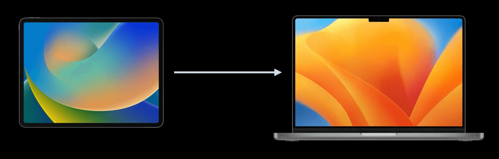

ps. 这里补充其他信息。请严格按照以下格式填写。

## 个人介绍

JPlay，iOS 开发者，Base 厦门，曾就职于美图，现就职于稿定科技，专注于视频/图片编辑类产品开发

## 审核介绍

要求待补充...
要求待补充...
要求待补充...

## 不超过 120 个字的文章简介

SwiftUI 可以跨整个苹果生态，Flutter 可以跨大多数主流平台，为什么我还要选 Mac Catalyst ？假如有一套已经基于 UIKit 实现的 iPad 代码想要迁移到 Mac 上的话，Mac Catalyst 将是你的不二之选。本文将为你介绍 iOS 应用迁移到 Mac 上的几种方式，并且展示了新系统中的新接口。

## 公众号/小专栏图文头图

