# Session 10076 - 将你的 iOS 应用搬到 Mac 上

> 作者：JPlay，iOS 开发者，Base 厦门，曾就职于美图，现就职于稿定科技，专注于视频/图片编辑类产品开发
> 审核：待审核同学填充
> 引申：本文基于 [WWDC2022 Session 10076](https://developer.apple.com/videos/play/wwdc2022/10076/%20) 梳理。

## iPad 与 Mac 的融合之路

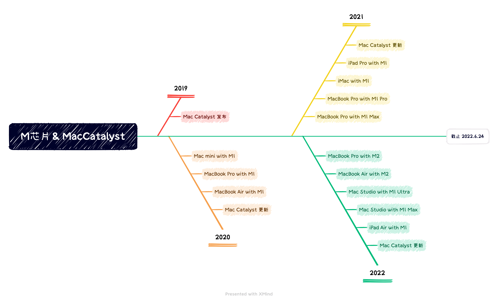

*苹果嘴上说不要，身体却很诚实。*

虽然 Tim Cook 和苹果高级副总裁 Craig Federighi 都曾经明确否认 iOS 与 macOS 并不会走向融合，还强调 Mac 设备不可能推出触屏版，但是其实苹果在 2019 年开始，就在推动开发者将 iOS 应用带到 macOS 中。

在 M 系列芯片的支持下，两者已经在硬件上实现了打通：

- 相同的芯片架构，带来了指令集的统一
- 相同的大尺寸屏幕，带来了可展示内容的统一
- iPad 支持鼠标键盘之后，两者甚至可以用一模一样的交互方式

唯一不同的，可能就是一些历史和配件问题：

- UIKit vs AppKit
- 触控 vs 键鼠
- iPad 专属传感器、前后摄像头等配件在 Mac 上的缺失

在这样的大背景下，iPad 与 Mac 的融合已经开启。从苹果逐步减少更新 AppKit，转而推动 Mac Catalyst 的趋势可见一斑。

## 应用展示

Mac Catalyst 发展到今年，落地情况到底如何？我们来看几个苹果推荐的应用。

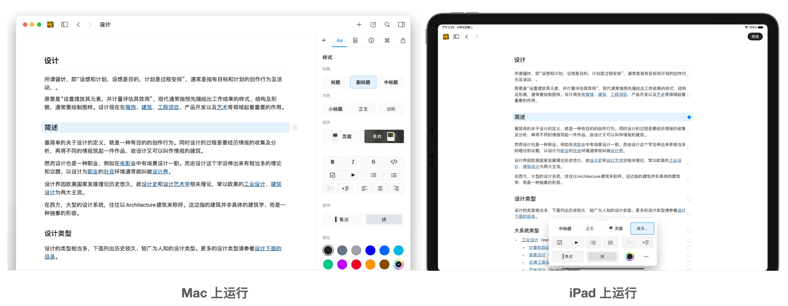
Craft 是一款功能丰富的文档编辑软件，在 Mac Catalyst 的帮助下，写作体验可以贯穿平台，它获得了 App Store's 2021 年最佳 Mac 应用大奖。

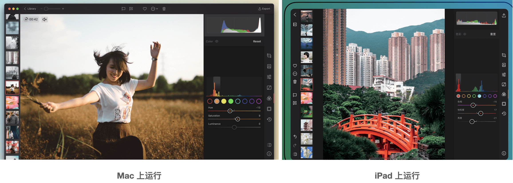
Darkroom 是一款功能强大的图片编辑软件，有了 Mac Catalyst，iPad 上的能力可以轻松移植到 Mac 上，它获得过苹果设计大奖，并且从 2018 年开始连续获得 App Store 编辑推荐。

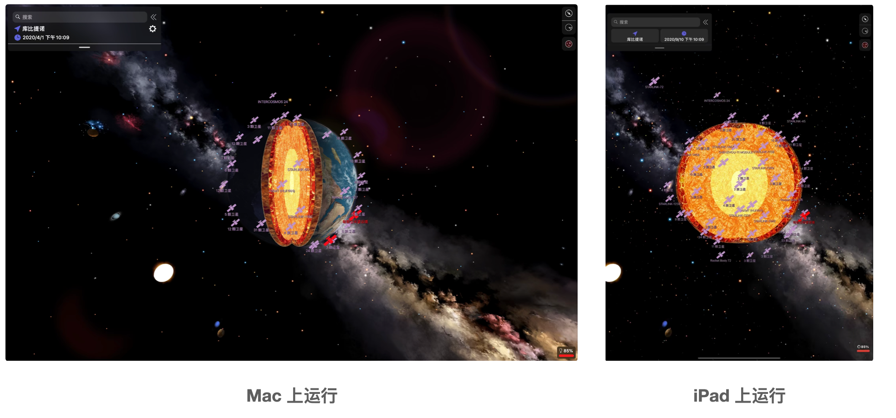
Night Sky 是一款宇宙探索软件，它惊艳的 3D 效果获得了多次 Webby 奖 和 Lovie 奖。值得一提的是，使用了 Mac Catalyst 之后，它在 Mac 上采用横屏展示，在 iPad 上采用竖屏展示，但是视觉和交互在双端都保持了最佳效果。

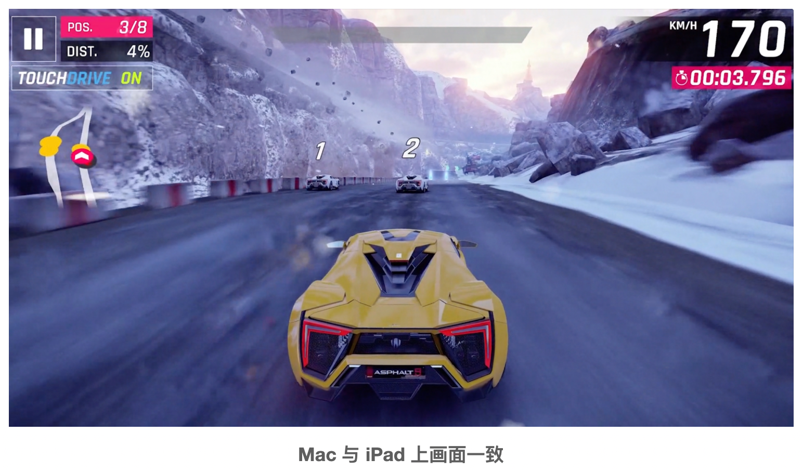Asphalt 9 - Legends 是唯一一款获得过苹果设计大奖的赛车游戏，它使用 Mac Catalyst 做到了 Mac 和 iPad 双端画面体验完全一致。

## 迁移方式

从文字、图片编辑类软件，到 3D 软件，甚至是游戏，都可以通过 Mac Catalyst 把 iPad 应用搬到 Mac 上，接下来我们看看迁移应用的几种方式。
> PS：以下内容全部基于 Xcode 14.0 beta，会和市面上其他基于旧版本 Xcode 的文档略有不同。

### 默认迁移(Designed for iPad)

当你新建一个项目的时候，系统会默认帮你添加 Mac(Designed for iPad)，这可以让你拥有苹果芯片（目前也就是 M 系列芯片）的 Mac，直接把此应用跑起来。

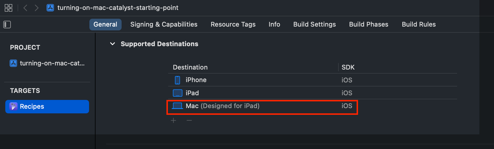

如果你希望在此模式下进行一些简单的适配，也是可以的。

比如，在 info.plist 文件中加入以下两个 key：

~~~ XML
<key>UILaunchToFullScreenByDefaultOnMac</key>
<true/>
<key>UISupportsTrueScreenSizeOnMac</key>
<true/>
~~~

`UILaunchToFullScreenByDefaultOnMac` 可以让你的应用在开启时直接进入全屏，这个选项特别适合游戏。
`UISupportsTrueScreenSizeOnMac` 可以让你的应用支持任意屏幕尺寸和分辨率，具体说明可以查看[官方文档](https://developer.apple.com/documentation/bundleresources/information_property_list/uisupportstruescreensizeonmac?changes=late_3__8)。

在交互方面 Touch Alternatives 可以帮助你把 iPad 上的交互简单地映射到 Mac 上

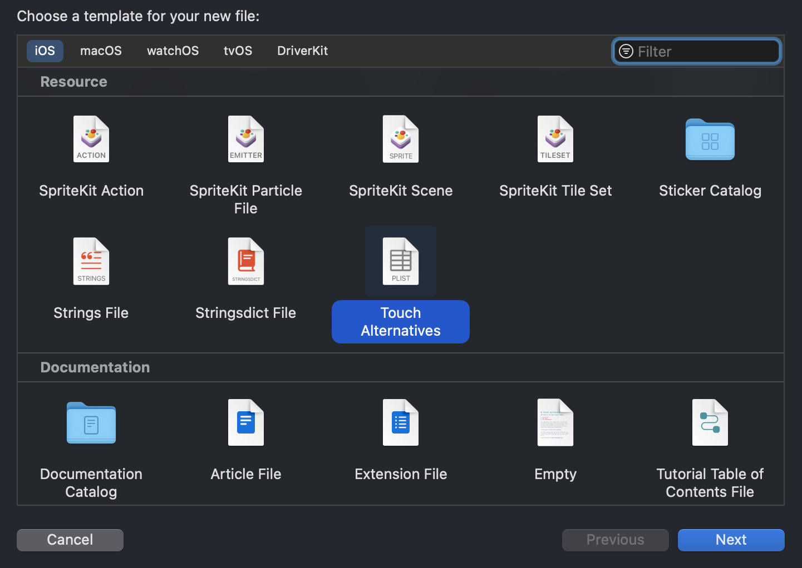

如上图，添加 Touch Alternatives 的 plist 文件后，你就可以配置你想要的交互选项：

~~~ XML
<dict>
    <key>defaultEnablement</key>
    <true/>
    <key>requiredOnboarding</key>
    <array>
        <string>Tilt</string>
        <string>Tap</string>
        <string>Arrow Swipe</string>
        <string>Scroll Drag</string>
        <string>Trackpad Capture</string>
    </array>
</dict>
~~~

在 requiredOnboarding 下的数组中添加的选项将自动映射到 Mac 上的替代交互方案，具体映射规则是：

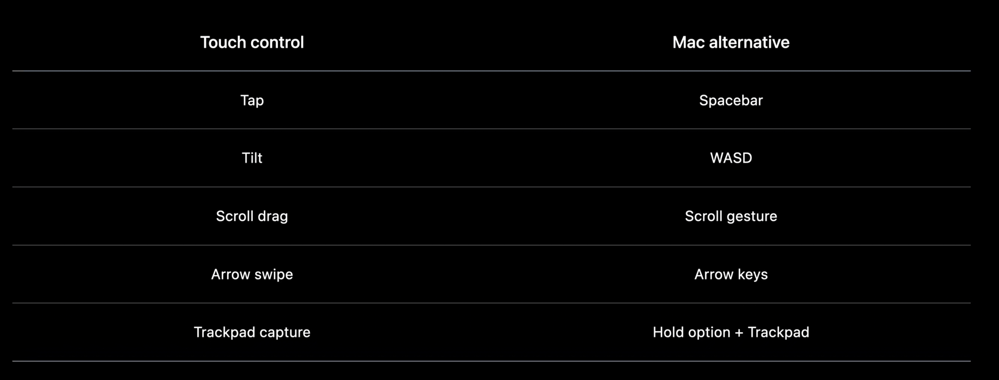

设置完毕后，你就可以在 Mac 中使用这些交互了，并且在你首次打开应用时，还会给你一个友好提示：

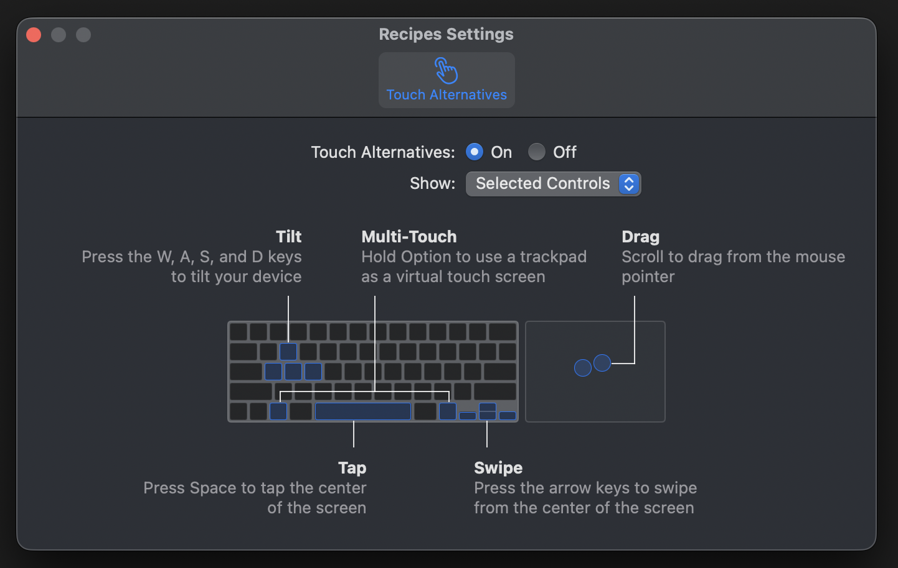

你甚至可以在这个界面上做一些配置。比如，关闭 Touch Alternatives。

值得一提的是，现在 iPad 是直接支持用键鼠操作的，苹果更加建议你在 iPad 上实现对键鼠的支持，这样移植到 Mac 上的体验将是完美的。

想要了解更多的话，可以观看往期的 Session：

- [Support hardware keyboards in your app](https://developer.apple.com/videos/play/wwdc2020/10109/)
- [Handle trackpad and mouse input](https://developer.apple.com/videos/play/wwdc2020/10094/)

### 使用 Mac Catalyst

更进一步的迁移方式是本文的主角： Mac Catalyst

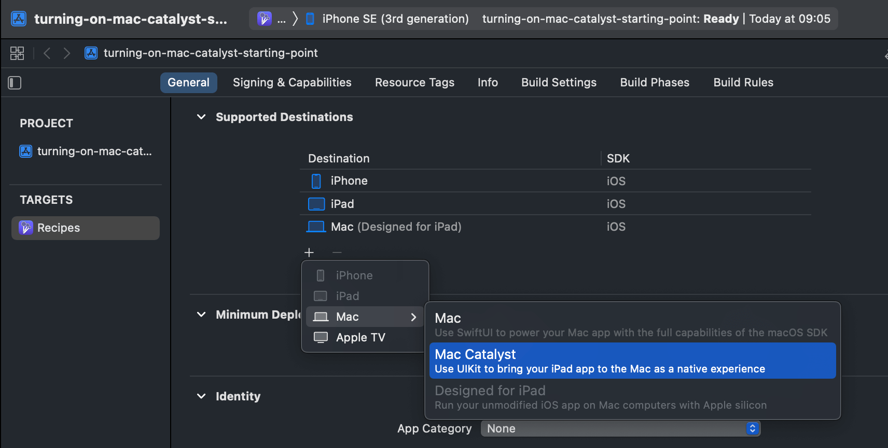

添加完 Mac(Mac Catalyst)，我们就开启了 Mac Catalyst，此时你的应用可以跑在所有 Mac 之上（囊括了带苹果芯片和英特尔芯片的 Mac）。

Mac Catalyst 分为两种适配模式：

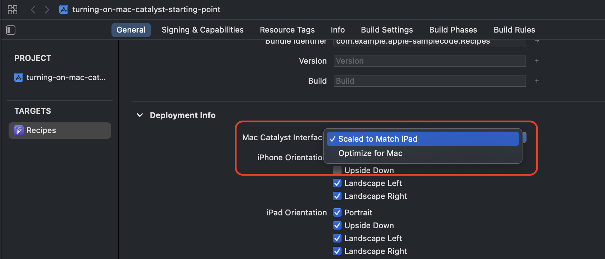

其中 "Scaled to Match iPad" 对应的是 iPad idiom，他是系统的默认选项。

iPad idiom 下，需要你做的适配工作是很少的，甚至可以一行代码都不改。
当然，这是有代价的：

- 视图和文字在 Mac 上会被缩放到 77%，所以会丢失一些细节，甚至会因为[像素不对齐](https://jplay.github.io/2022/05/26/%E4%B8%AD%E7%9A%84%E5%83%8F%E7%B4%A0%E5%AF%B9%E9%BD%90/)变得模糊。
- 控件是直接从 iOS 搬到 macOS 上的，某些情况下显得体验不佳。比如，UINavigationBar 在 Mac 上显得格格不入。

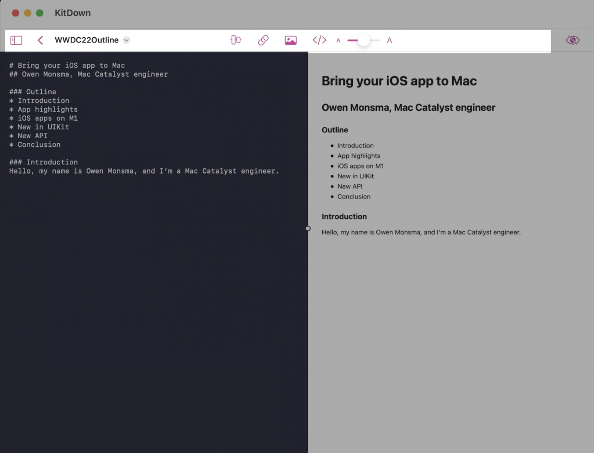

### Mac idiom

想要进一步提升用户体验，你应该选择 Mac idiom，也就是下图中的 "Optimize for Mac"

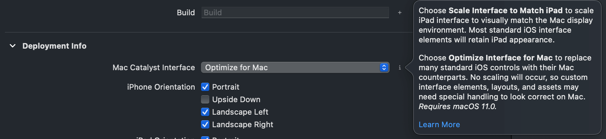

在 Mac idiom 下，你的应用将变得更加贴合 Mac 的交互体验：

- 视图和文字不再被缩放，所有内容将一比一还原
- 一些控件将自动被 "Mac 化"

我们基于同一个应用在两种模式下的对比来说明：

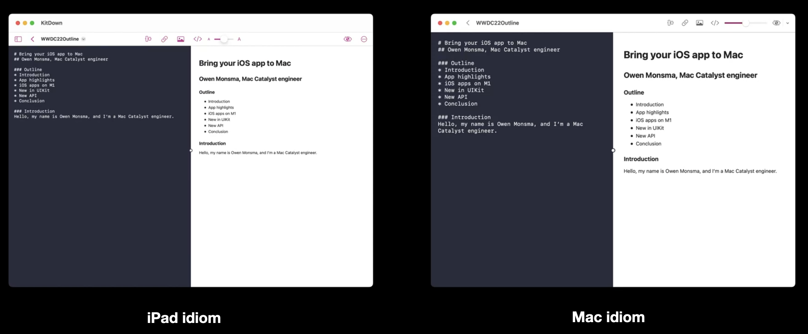

- iPad idiom 下的文字明显小于 Mac idiom 下的文字
- iPad idiom 下的 UINavigationBar 在 Mac idiom 下自动变成了 NSToolbar，这明显更贴合 Mac 的交互体验

诸如此类的细节还有很多，详细信息可以查看[官方文档](https://developer.apple.com/design/human-interface-guidelines/technologies/mac-catalyst/introduction)。

## 新增接口

接下来，让我们看看在 iOS 16 & macOS Ventura 中新增了哪些属于 Mac Catalyst 的接口。

### 窗口相关

我们基于一个例子来展示窗口相关的内容，假设我们要实现一个小窗口，用来展示 markdown 的语法提示：

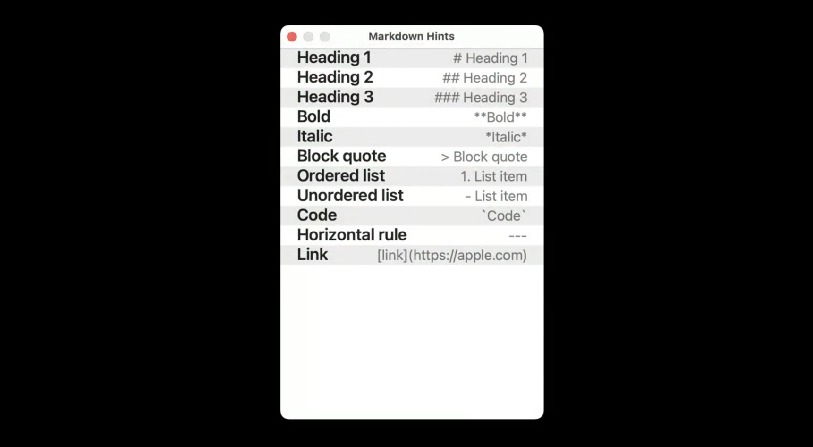

我们需要窗口实现几个功能：

1. 左上角的交通灯按钮只保留红色关闭按钮
2. 指定窗口大小
3. 窗口大小不可调整

> 在 macOS 中，应用左上角的三个控制按钮被称为 "交通灯"，因为它们的颜色和现实中的交通信号灯一样：红色代表关闭，黄色代表最小化，绿色代表全屏最大化。

我们来简单实现一下：

~~~ Swift
func scene(_ scene: UIScene,
           willConnectTo session: UISceneSession,
           options connectionOptions: UIScene.ConnectionOptions) {
        
    guard let windowScene = (scene as? UIWindowScene) else { return }
        
    #if targetEnvironment(macCatalyst)
        
    // 设置窗口大小
    let currentFrame = windowScene.effectiveGeometry.systemFrame
    let newFrame = CGRect(origin: currentFrame.origin, 
                          size: CGSize(width: 320, height: 480))
    let geometryRequest = UIWindowScene.MacGeometryPreferences(systemFrame:newFrame)
    windowScene.requestGeometryUpdate(geometryRequest){ error in
        // 处理异常情况
    }
        
    // 控制交通灯按钮
    windowScene.windowingBehaviors?.isMiniaturizable = false
    windowScene.sizeRestrictions?.allowsFullScreen = false
        
    #endif
}
~~~

讲解一下代码：

1. 首先从 `windowScene.effectiveGeometry.systemFrame` 获得窗口 frame 赋值给 currentFrame
2. 根据 currentFrame.origin 和指定的大小 320 * 480，设置 newFrame
3. 接着通过 `windowScene.requestGeometryUpdate()` 提交 frame 更新
4. 再通过设置 `windowScene.windowingBehaviors?.isMiniaturizable = false` 来禁用最小化按钮
5. 最后通过 `windowScene.sizeRestrictions?.allowsFullScreen = false` 来禁用全屏按钮

在我们实现这个小需求的时候，我们有两个值得注意的细节：

1. 在指定尺寸的时候，单位是点。如果是 Mac idiom，那就是 AppKit 中一比一的 320 * 480 点；如果是 iPad idiom，那会在此基础上缩放至 77%
2. 原点在主屏幕的左上角。如果你有多个屏幕，那么顶部菜单栏被激活的就是主屏幕。

再来看看关于窗口的新接口还有哪些：

~~~ Swift
// 禁用红色按钮
windowScene.windowingBehaviors?.isClosable = false
        
// 禁用黄色按钮
windowScene.windowingBehaviors?.isMiniaturizable = false
        
// 禁用绿色按钮，方式一
windowScene.sizeRestrictions?.allowsFullScreen = false
        
// 禁用绿色按钮，方式二
let fixedSzie = CGSize(width: 100, height: 100)
windowScene.sizeRestrictions?.minimumSize = fixedSzie
windowScene.sizeRestrictions?.maximumSize = fixedSzie
        
// 判断是否处于全屏
if windowScene.isFullScreen { /* ... */ }
~~~

以上代码所见即所得，唯一值得一提的是：把最大尺寸和最小尺寸设置为同一个值也能禁用绿色按钮（方式二）。

### Toolbar 相关

我们前面提到：如果你处于 Mac idiom 下，UINavigationBar 会自动转换成 NSToolbar。我们也可以设置 `navigationBar.preferredBehavioralStyle`来手动控制映射样式：

- `.automatic` - 默认值，交给系统决定映射样式
- `.pad` - 保持 iPad 上的样式不变，也就是 UINavigationBar
- `.mac` - 告知系统需要映射成 mac 上的样式，也就是 NSToolbar

假设我们已经成功将 UINavigationBar 转换成了 NSToolbar，那么进一步的定制化需求应该怎么实现呢？让我们基于一个小例子来看看。

这次我们要实现一个字数统计功能：

1. 在 NSToolbar 中插入一个自定义的 UIView 作为 NSToolbarItem，用来展示字数并且支持点击
2. 点击这个字数按钮，需要弹出一个自定义 UIView，用来展示更多信息

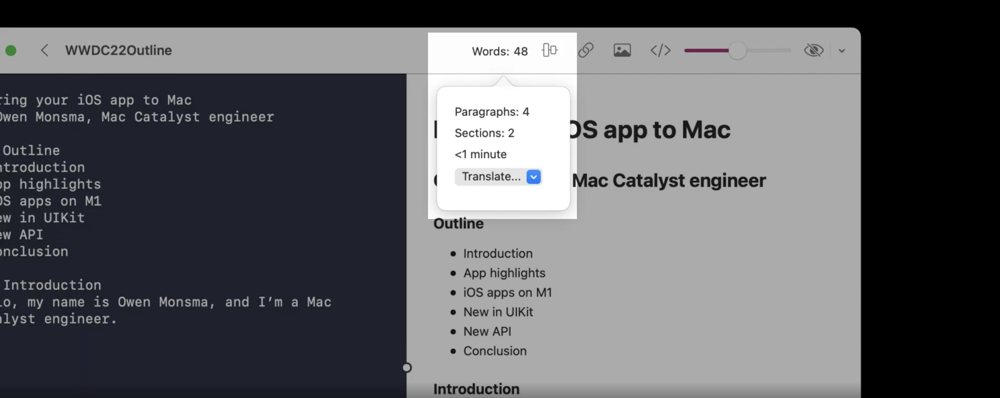

首先，我们在 NSToolbarDelegate 的代理方法里实现自定义字数按钮的逻辑：

~~~ Swift
func toolbar(_ toolbar: NSToolbar,
            itemForItemIdentifier itemIdentifier: NSToolbarItem.Identifier,
            willBeInsertedIntoToolbar flag: Bool) -> NSToolbarItem? {
    if let itemIdentifier == "wordCountIdentifier" {
        let wordCountView = WordCountView()
        return NSUIViewToolbarItem(itemIdentifier: itemIdentifier,
                                   uiView: wordCountView)
    }
}
~~~

NSUIViewToolbarItem 是 NSToolbarItem 的子类，通过它的构造方法，我们可以包裹一个 UIView，并插入到 NSToolbar 中。

使用 NSUIViewToolbarItem 时，有两点细节指的注意：

1. 如果我们的 NSToolbar 是通过 UINavigationBar 自动转换而来，自定义的 UIView 将被系统自动拷贝
2. 如果我们的 NSToolbar 是自己添加的，切记要使用唯一的 item，而不要重复使用同一个 item

接着我们来实现弹窗：

~~~ Swift
let wordCountDetailsVC = WordCountDetailsViewController()
wordCountDetailsVC.modalPresentationStyle = .popover
wordCountDetailsVC.popoverPresentationController?.sourceItem = wordCountView
rootVC.present(wordCountDetailsVC, animated: true)
~~~

讲解一下代码：

1. 我们创建了一个自定义 UIViewController：`wordCountDetailsVC`
2. 将 `wordCountDetailsVC.popoverPresentationController?.sourceItem` 设置为我们之前自定义的 UIView：`wordCountView`，这样按钮和弹窗就关联起来了，点击字数按钮就会展示弹窗

## 结束语

自此，我们介绍了将你的 iOS 应用迁移到 Mac 上的所有方式，也用例子介绍了新版本下的新接口，相信你对迁移这件事情已经不再陌生，想要了解更多细节推荐查看[官方教程](https://developer.apple.com/tutorials/mac-catalyst)。

跨端方案有很多，SwiftUI 可以跨整个苹果生态，Flutter 能做的事情就更多了。但是，如果有一套已经基于 UIKit 实现的 iPad 代码想要迁移到 Mac 上的话，Mac Catalyst 是你的不二之选。

Mac Catalyst 每年都在迭代，M 系列芯片也装进了越来越多的设备中，我很期待 iPad 与 Mac 的融合，希望有一天我们能看到 Xcode 可以跑在 iPad 上。
