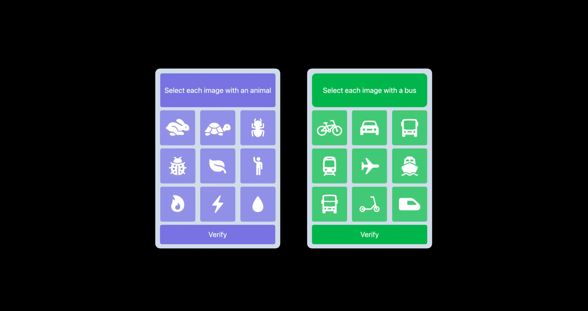

## 个人介绍

Hummer，就职于字节跳动，从事隐私安全方向研发工作

## 审核介绍

Damien

## 不超过 120 个字的文章简介

验证码技术一直被用于真实流量识别，虽然比较有效但是也给用户带来了一些不便，于是一些平台尝试收集用户隐私信息来精准识别用户。一向注重保护用户隐私的苹果则认为这种做法不可取，于是苹果带来了新的认证技术：Private Access Token。

## 公众号/小专栏图文头图

