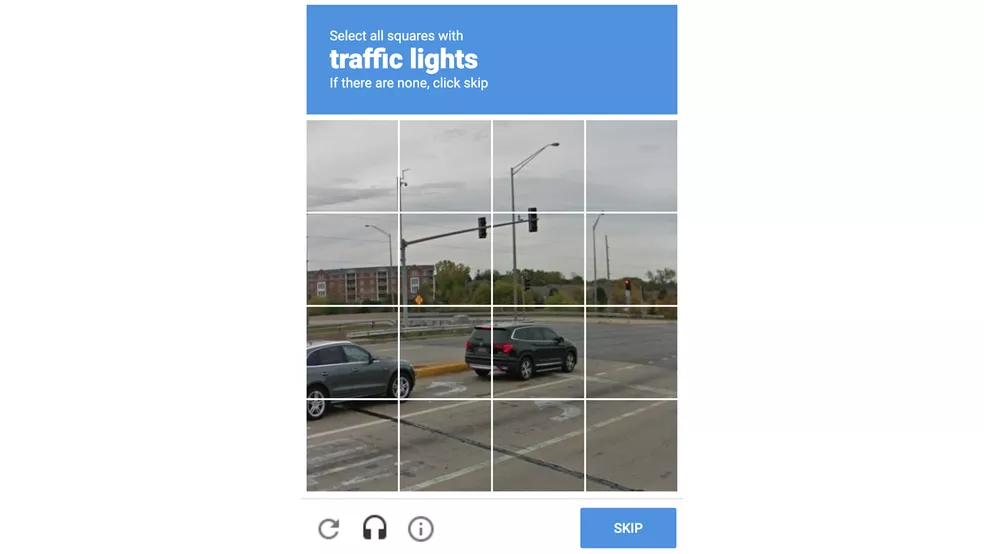
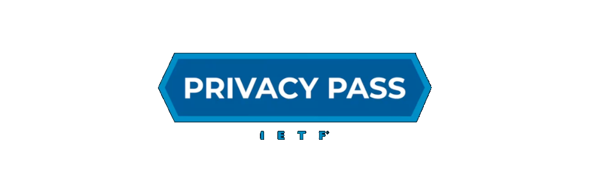
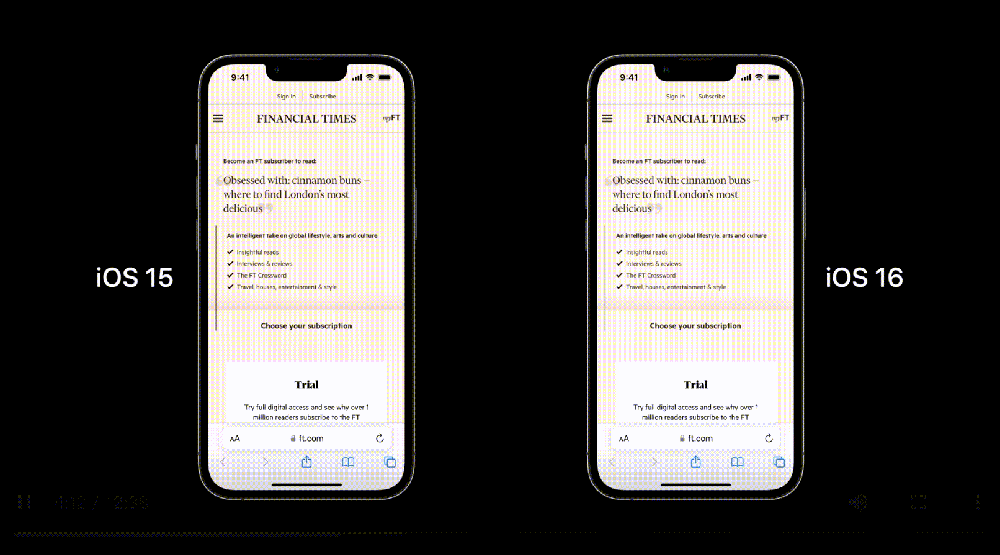
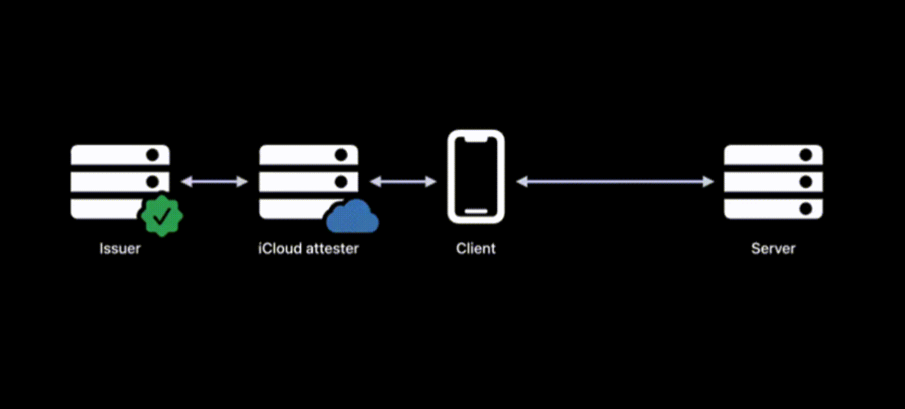
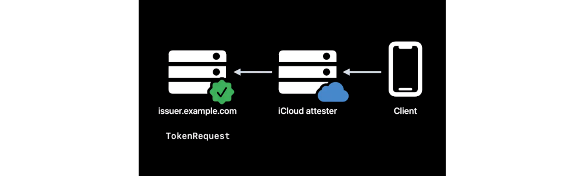
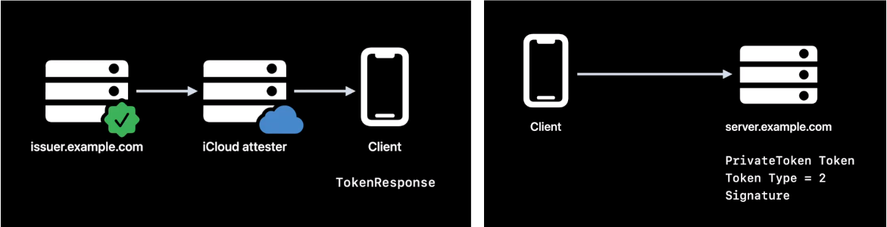
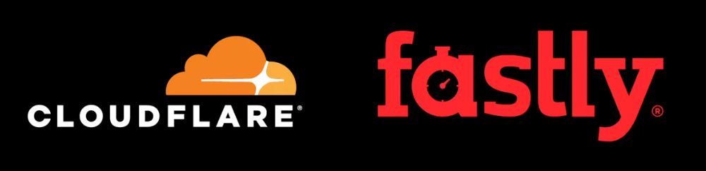

> 作者：Hummer，就职于字节跳动，从事隐私安全方向研发工作。
> 
> 审核：Damien，就职于字节跳动，目前负责 TikTok 隐私和安全相关的工作。

# WWDC22 10077 - 验证码的替代者—私有访问凭证

在网络空间中除了普通用户，还活跃着一群从事网络攻击、窃取信息、勒索诈骗、盗窃钱财、推广黄赌毒等网络违法活动的黑产人员，他们可能利用技术手段（比如编写自动化脚本）窃取用户的账号和密码或者利用技术手段注册虚假账号并发布营销信息。网络平台为了区分出普通用户和机器人用户，大量使用了验证码服务，虽然最初验证码能够有效识别机器人，但是随着技术的进步，机器人识别验证码的能力也在不断增强，于是验证码也不再局限于出现识别字符，演变为识别图片中的物体或文字。

这些验证码对于用户的使用体验并不友好，用户需要花费时间去识别验证码，有时还需要反复识别。此外，对于那些有视力障碍的人群，因为验证码的存在，可能导致他们无法登录网站或使用网站的其他服务。

各个平台服务也致力于提升用户体验，但是代价却是侵犯用户隐私。因为需要采集用户的 IP 等指纹信息来追踪和识别用户，以此来判断哪些流量是来自真实用户。显然，这种方式并不符合当下互联网的隐私趋势。

由于苹果具有比较完善的隐私保护体系，任何使用苹果设备的用户都已经在享受其隐私保护服务，其中包括苹果账号体系 Apple ID，硬件安全保护技术 Touch ID 和 Face ID，以及经过 App Store 审核的 App，苹果可以从账号、软件、硬件等多种维度识别用户的合法性，比如可以根据 iPhone 是否越狱、App 的签名是否有问题、判断 iPhone 的使用习惯是否不同于真实用户等方式判定是否为非法用户。由此苹果在自家的平台上推出了 **Private Access Tokens** (暂译为：**私有访问凭证**，简写为：**PAT**)。

## Privacy Pass & PAT

### IETF - Privacy Passs

该 IETF 工作组致力于制定一个高性能的应用层凭证创建和匿名赎回机制，签发者创建访问凭证，再由匿名客户端取回并交给正在访问的目标网站进行验证，整个过程要满足以下要求：

1. 签发者使用标识符将返回的凭证与之前创建的 N 个凭证进行关联的概率不能大于 1/N。（An Issuer cannot link a redeemed token to one of N previously created tokens
using the same key with probability non-negligibly larger than 1/N.）
2. 客户端能够利用约定的密钥验证凭据是由特定签发者创建的。
3. 凭据不可伪造
4. 凭据的发行和赎回机制要足够高效。
目前该工作组已经积累了 10 余篇相关的草案，Private Access Tokens 就是其中的一篇。

### PAT draft

该草案于 2021 年 10 月 25 日 提出，其作者分别来自苹果、谷歌、Fastly 和 Cloudflare 等公司。草案中提出了一种可以保护用户隐私的访问凭证，允许服务在无需追踪用户的情况下，根据策略限制用户访问频率。
在介绍私有访问凭证的原理之前，我们先来对比一下使用私有访问凭证代替验证码之后的效果。当使用 iOS 15 设备阅读 Financial Times 的一篇文章，网站先跳转到登录页面，要求用户输入用户名和密码，然后用户被拦截了，需要输入验证码之后再阅读文章。当更换到最新的 iOS 16 设备，用户完成登录操作后，网站直接导航进入文章页面，没有弹出验证码对用户身份进行验证。

我们不想遇到验证码，也不想泄漏太多的隐私数据给服务提供者来识别我们的身份，那鱼和熊掌是否能兼得？苹果认为是可以的，我们来研究一下苹果给出的解决方案。

## 私有访问凭据  (PAT)

具备以下特点：

1. IETF Privacy Pass 草案标准
2. 使用了一种全新的 HTTP 认证方式 PrivateToken
3. 使用了 RSA 盲签名算法
4. 服务提供者无法追踪客户端

由于 RSA 盲签名算法 在 PAT 方案中扮演了重要角色，所以先了解其算法原理。

### RSA 盲签名算法

假如 Bob 有一段消息 m 需要让 Alice 签名，但是又不想让 Alice 知道消息的内容。Alice 的 RSA 私钥是 d ，公钥是 (n,e)。那么签名流程如下：

1. Bob 首先选择一个因子 r，然后计算 m' = m * r^e mod n
2. Alice 收到 m' 后用私钥进行签名，s' = m'^d mod n = (m *r^e)^d mod n = m^d* r mod n
3. Bob 拿到 s 后再进行去盲化处理得到原始签名，s = s' * r^{-1} = m^d mod n
4. 消息的接收方可以使用 Alice 的公钥 (n,e) 进行验签，s^e = m^{ed} mod n = m mod n

### PAT 工作原理

先通过下图了解 PAT 的全流程，在有了整体印象的情况下再分步骤去研究其工作原理：

**分步骤解析：**

1. 当 iOS 或 macOS 客户端通过 HTTP 访问服务时，服务端会使用 PrivateToken 身份验证方案发回质询，要求客户端提供访问凭证。在服务端返回的质询里提供了其信任的访问凭证签发者。客户端可以向该签发者请求凭证。

    

2. 此时客户端将要向证明者 (iCloud) 请求凭证。此过程需要完成以下工作：

    * 客户端对质询中的消息进行盲化处理，保证凭证无法关联到服务网站。
    * iCloud 利用设备 Secure Enclave 中的证书验证设备是否正常。
    * iCloud 会验证该客户端登录的 Apple ID 账户是否信誉良好。
    * iCloud 还可以检测该客户端请求凭证的频率，综合判定其是否为黑灰产机架上的设备。
    * 如果客户端通过了以上检验，那么 iCloud 会代表客户端向凭证签发者发送凭证创建请求。

    

3. 当凭证签发者收到来自 iCloud 的请求时，虽然它对客户端的信息一无所知，但是它会信任 iCloud 给出的结论，因此签发者对客户端发送的盲化凭证进行签名。

    

4. 经过签名的凭证会原路返回到客户端，此时客户端需要对签名的凭证进行去盲化处理得到原始凭证的签名。最后，客户端将签名发送给服务端，服务端再使用凭证签发者的公钥检查此凭证是否指定的签发者创建。

### PAT 适配

#### 服务端适配

1. 凭证签发者应该是服务端受信任的提供商，由该提供商为服务端提供访问凭证。这里的提供商可以是正在使用的验证码服务商或者 CDN 服务商。

    * Fastly 和 Cloudflare 已经和苹果合作，可以对外提供私有访问凭证的颁发服务。
    * 在最新的 iOS 16 和 macOS Ventura 测试版系统中，可以试用这两家凭证签发者的服务。
    * 其他验证码服务商或者 CDN 服务商也可以成为凭证签发者，注册通道将在 [register.apple.com](https://register.apple.com) 开启。苹果对签发者的服务规模有一定要求：至少能服务 100+ 的网站。

2. 当客户端访问服务端时，服务端使用 PrivateToken 方案发送 HTTP 身份验证质询。服务端有两个选择来实现该过程：

    * 与现有的 验证码或防欺诈提供商合作，将此流程构建在他们的服务中。
    * 服务端自己实现。如果自己实现，那么质询请求中的域名必须来自服务端的主域名或子域名，不能是其他第三方域名。

3. 当服务端接收到凭证之后，需要使用签发者的公钥验证它们的有效性。

#### 客户端适配

在 iOS 16 或 macOS Ventura 系统中，通过 Safari 和 WebKit 访问的 Web 服务时将自动响应服务端端质询。应用程序如果使用 URLSession 或 WebKit 发送 HTTP 请求，也可以自动响应服务端的凭证质询。

如果获取凭证时出错，例如应用不在前台或设备没有登录 Apple ID，应用将收到包含凭证质询的 401 HTTP 响应，应用程序需要对 401 响应做出处理。

另外，客户端如果要测试 PAT 功能，需要在设备上登录 Apple ID 。苹果声称 Apple ID 仅用于验证客户端身份，不与接收凭证的服务端共享。

## 安全问题

1. DoS 攻击：因为使用 PAT 的成本比其他验证方式（比如 IP 地址验证）要高，因此当服务端遭受 PAT 流量攻击时，其承受的压力会更大。
2. 信道安全：如果攻击者侵入 iCloud 和签发者之间的通信信道，那么就有可能干扰凭证的签发结果。如果攻击者侵入客户端与服务端之间的信道，那么就可以窃取已经签名的凭证，并在之后进行重放。前一个问题可以使用 HTTPS 并进行证书校验来降低被攻击的风险；后一个问题可以在凭证中增加随机数来解决。

## 总结

因为黑灰产的存在，迫使服务提供者不得不使用反欺诈措施，而验证码技术因为其简单有效的特点被广泛采用。但是验证码也给用户带来糟糕的使用体验，服务提供者意识到这个问题，所以也在通过收集设备指纹等方式来识别真实用户，以便避免弹出验证码，然而这种行为又侵犯了用户的隐私。

因此，为了能彻底解决这些问题，苹果利用自身优势推出了一种既能保护用户隐私又能识别机器人流量的新技术 Private Access Token。该技术利用真实用户识别机制和 RSA 盲签名机制来完成对可疑流量的检查和对用户身份信息的保护。

所有为苹果用户提供服务的提供商都应该适配 PAT，只要 PAT 可用就应该避免使用验证码，这样可以为用户带来更好的使用体验。

**参考资料：**

1. [Google 验证码进化史：我们越来越方便，但也交出了越来越多的隐私](https://www.ifanr.com/1234644)
2. [Privacy Pass (privacypass)](https://datatracker.ietf.org/wg/privacypass/about/)
3. [Private Access Tokens](https://www.ietf.org/archive/id/draft-private-access-tokens-01.html)
4. [RSA Blind Signatures](https://www.ietf.org/archive/id/draft-irtf-cfrg-rsa-blind-signatures-02.html)
5. [盲签名 blind signature](https://blog.csdn.net/mutourend/article/details/121186128)
