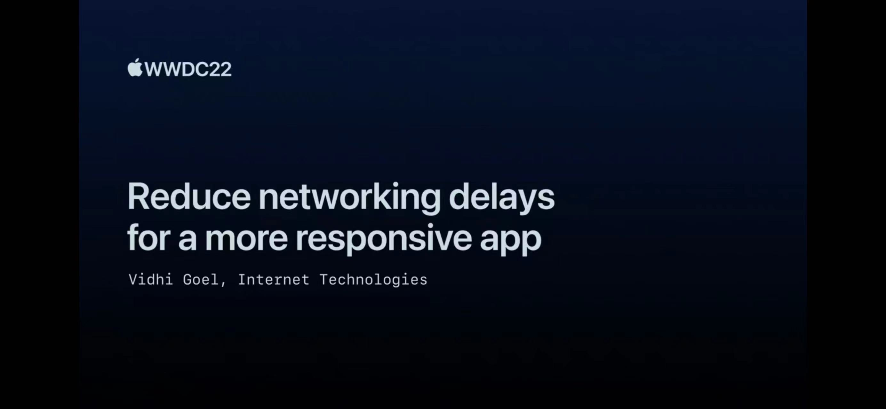

## 个人介绍

阿尘，资深 iOS 开发者、开源项目作者，现就职于华泰证券。对前沿技术保持浓厚兴趣，乐于分享和交流；曾开发的实时网络状态检测框架 RealReachability 在 Github 获得 3k+ stars，在 Cocoapods 被下载数万次。

## 审核介绍

## 标题
如何降低网络延迟以打造更具响应性的 App

## 不超过 120 个字的文章简介
如何打造更具响应性的 App ，对于开发者来说是一个永恒的课题。2021年，苹果给大家分享了许多网络延迟优化相关的理论知识，而今年，苹果在去年的基础上，又为我们带来了这一篇颇具实战指导意义的分享，从客户端侧、服务端侧、网络协议侧三个方面入手提供了一系列行之有效的建议，帮助开发者们更好的分析和改善应用的网络延迟状况，从而打造更具响应性的 App 。

## 公众号/小专栏图文头图

