# WWDC22 - 降低网络延迟：让你的 App 变得更快

本文基于 [Session 10078](https://developer.apple.com/videos/play/wwdc2022/10078) 梳理，如需了解更多，可以浏览文末的参考来源。

> 作者：阿尘，资深 iOS 开发者、开源项目作者，现就职于华泰证券。对前沿技术保持浓厚兴趣，乐于分享和交流；曾开发的实时网络状态检测框架 RealReachability 在 Github 获得 3k+ stars，在 Cocoapods 被下载数万次。
>
> 审核：
>
> 黄骋志（橙汁），老司机技术社区核心成员，现于西瓜视频负责稳定性 OOM/Watchdog 相关工作。
>
> 王浙剑（Damonwong），老司机技术社区负责人、WWDC22 内参主理人，目前就职于阿里巴巴。

## 前言

如何打造更快的 App ，对于开发者来说是一个永恒的课题；原因无他，因为对于一个以网络交互为核心的现代应用来说，这是用户体验的核心所在：它意味着更流畅的音视频播放、低延迟的网络会议、快速加载的页面和资源、更少的游戏等待时间等等。2021 年，苹果通过 [Session 10239: Reduce network delays for your app](https://developer.apple.com/videos/play/wwdc2021/10239) 给大家分享了许多网络延迟优化相关的理论知识，并提出了 RPM (每分钟往返次数) 的概念和基于此概念的测试工具；而今年，苹果在去年的基础上，又为我们带来了这一篇实战性质颇强的分享，从客户端侧、服务端侧、网络协议侧三个方面入手提供一系列行之有效的建议，帮助开发者们更好的分析和改善应用的网络延迟状况，从而打造响应更加快捷的 App ，带来更好的用户体验。

## 论网络延迟的重要性

### 网络延迟的定义

网络延迟指的是数据包从一个端发送到另一端所需要的时间；它决定了网络侧的内容经过多久可以到达你的设备和应用上。如果网络延迟很大，那么设备上的应用程序都会受到影响，从而导致糟糕的用户体验。

### 降低网络延迟 != 升级带宽

举例而言，在视频会议的场景下，网络延迟可能会带来卡顿或者画面冻结，从而导致会议完全无法进行。为了解决此类问题，人们通常的做法有联系网络服务商来升级网络带宽、更换更好的网络设备、通过 mesh 组网构建更好的  wifi 网络等(如下图所示)。
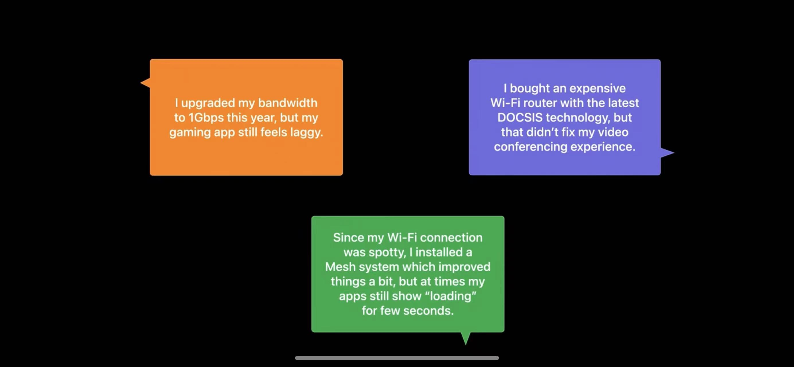
这些措施从本质上来说都是升级网络带宽和优化网络质量的手段， 但它们仍无法完全避免问题的发生。有研究表明，通过增加带宽的手段一开始可以改善页面加载的时长，但当带宽超过一定的大小后，就收效甚微；对比来看，降低网络延迟则基本上一直可以减少页面加载时间，两者基本呈现线性关系。

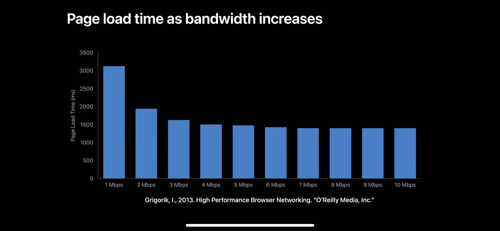

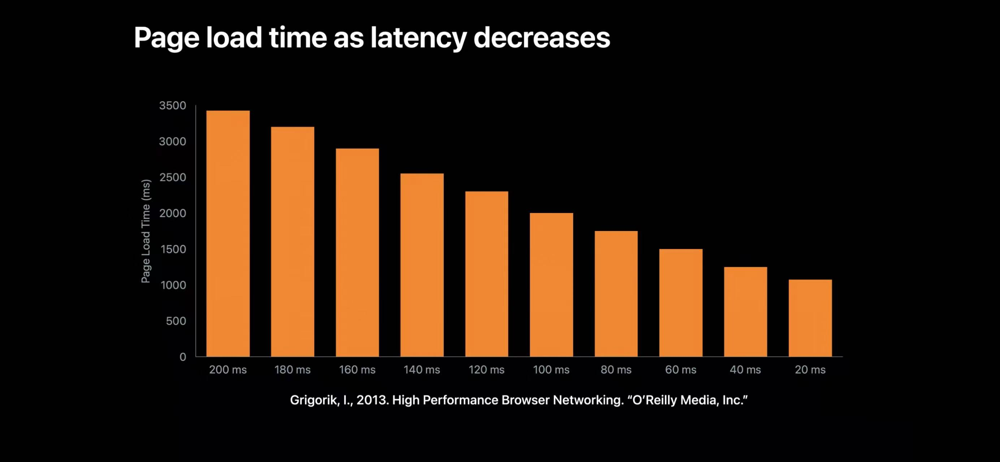
那么这究竟是为何？想弄清楚这一点，我们需要知道 App 的数据包是如何在网络上被传送的。当 App 从服务器请求数据时，数据包从网络堆栈中被发送出来；你可能以为它们会被无延迟的从网络上直接发送到服务器，但事实上，网络链路中最慢的一个节点通常积压了大量的数据包等待处理，这个数据包的积压队列往往会很大。

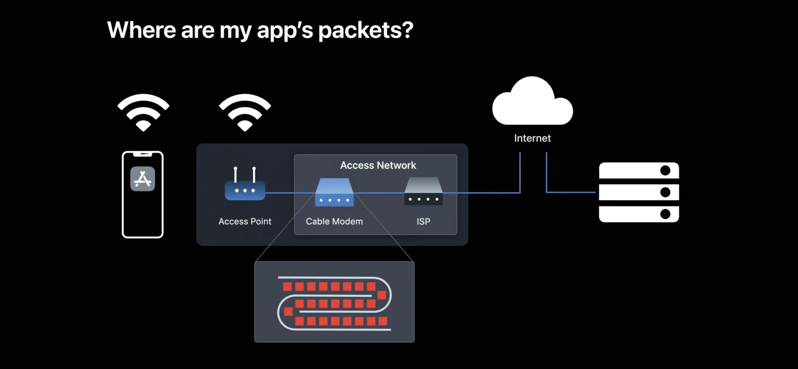

这样一来，从你的 App 往外发送的数据包不得不等待该积压队列全部处理完毕才能通过。在这个最慢的节点上的等待增大了 App 到服务器之间的往返时间；带宽的增加并不能够改善这种积压的问题，因此在这种情况下，升级带宽并不一定能改善网络延迟。

### 网络延迟 = RTT(Round Trip Time) 次数 * RTT 时间

首先我们简单的解释两个小概念。 RTT(Round Trip Time)指的是数据包传送的往返时间，比如大家所熟知的 TCP 协议三次握手过程就会产生 3 次 RTT。苹果于 WWDC 2021 提出了 RPM (Roundtrips per minute) 的概念，它指的是每分钟内可以完成的往返次数，这个指标也可以比较直观的反映网络的快慢程度；简单来说，RTT 越小网络越快，而 RPM 则是越大越好。当应用请求需要经过多次往返才能获得响应的时候，因积压导致的网络延迟问题会被放大。举例来说，一个常见的 https 请求需要经过 4 次往返才能获得响应（tcp 1 次，tls 2 次，http 1 次，如下图），而且每次往返都会受到积压队列的影响，这个响应的总时间最终变得非常长。

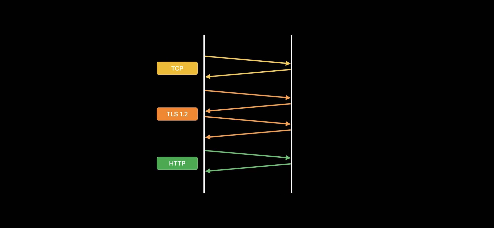

因此，我们可以看出，决定网络延迟的两个最重要的因素就是单次往返的耗时和往返的次数；降低它们即可显著的降低应用的延迟，从而提升应用的响应速度。


## App 侧的优化建议

### 使用现代网络协议

我们通过使用现代网络协议即可显著的降低应用的网络延迟，主要包括 IPv6、TLS 1.3 和 HTTP/3 等。只要服务端支持这些协议，在 App 侧，你只需要使用 URLSession 和 Network.framework 框架的 API 即可自动使用以上的协议。IPv6 在很早的版本苹果就已经支持了；从 iOS 12.2 开始 TLS 1.3 默认被支持（值得注意的是，你需要使用上面提到的 API，比如 GCDAsyncSocket 是无法支持 TLS 1.3 的）；而从 iOS 15 开始，苹果系统提供了 HTTP/3 协议的支持。目前，通过 Safari 浏览器的流量有 20% 是基于 HTTP/3 来承载的。

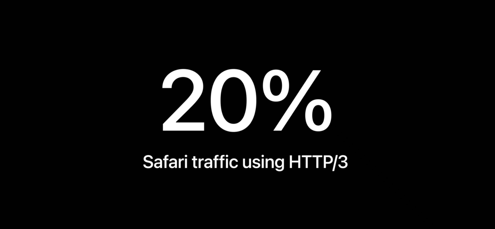

统计数据显示，HTTP/3 可以显著的提升请求完成的时间，仅约为 HTTP/1.1 的一半（如下图所示）。TLS 1.3 可以减少 1 次 握手过程中的 RTT 从而减少网络延迟；HTTP/3 基于 QUIC 实现，它的底层协议是 UDP。HTTP/3 通过真正的多路复用、0-RTT 支持等特性，大大提升了性能。

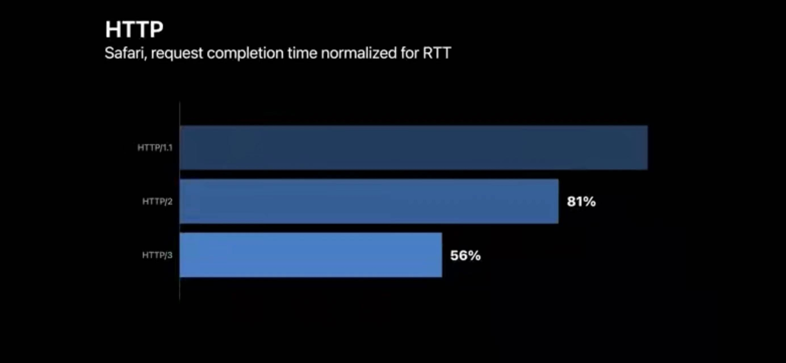

### 启用 handover 处理网络切换

就我们以往的经验来看，在网络切换的场景下，我们的连接需要重新建立（主要是基于 TCP 的长连接），这个过程往往会相当耗时，很影响用户体验；但现在我们可以启用 handover 来优化这个过程，苹果称之为连接迁移。配置连接迁移的核心代码如下：

```swift
// URLSession
let configuration = URLSessionConfiguration.default
configuration.multipathServiceType = .handover

// Network.framework
let parameters = NWParameters.quic(alpn: ["myproto"])
parameters.multipathServiceType = .handover
```

MultipathServiceType 是一个枚举类型，它实际上是定义了一系列 Multipath 场景下使用网络的配置。所谓 Multipath 指的是用户同时有多条网络通道 （一般来说是移动网络和 WIFI 共存）的情况下，App 可以采用不同的策略来利用这些网络通道。 handover 枚举配置的含义是启用 Multipath，但当且仅当主通道无法使用时，才会使用其他的通道。启用 handover 并且确保它正常工作，可以使我们的应用获得无缝切换的效果。

### 启用 QUIC 数据报

如果你使用基于 UDP 的自有协议，在 iOS 16 和 macOS Ventura 下，苹果建议我们启用 QUIC 数据报，在该协议配置下，通过优化的拥塞控制算法可以显著的降低 RTT 时间并减少丢包。具体配置代码如下：

```swift
// Only one datagram flow can be created per connection
let options = NWProtocolQUIC.Options()
options.isDatagram = true
options.maxDatagramFrameSize = 65535
```

## 服务端侧的优化建议

### 网络质量检测工具介绍

尽管我们的服务器很可能采用了很高水准的硬件配置，但它们仍然可能成为网络延迟的罪魁祸首。在 macOS Monterey 我们引入了网络质量检测工具，你可以使用该工具来检测服务提供商的网络和你的服务器上是否存在“缓冲膨胀 （buffer bloat）”。在该工具中需要把你的服务器配置成目标，并和苹果的默认服务器进行对比测试。如果苹果的默认服务器得分情况良好，但你的服务器表现不佳，那么你的服务器在网络层面很可能需要改进。具体的配置和运行参考如下：

```
Configure your server
https://github.com/network-quality/server

// networkQuality tool in macOS
networkQuality -s -C https://myserver.example.com/config
```

除了苹果提供的工具以外，还有很多类似的第三方/开源工具，一并介绍如下：
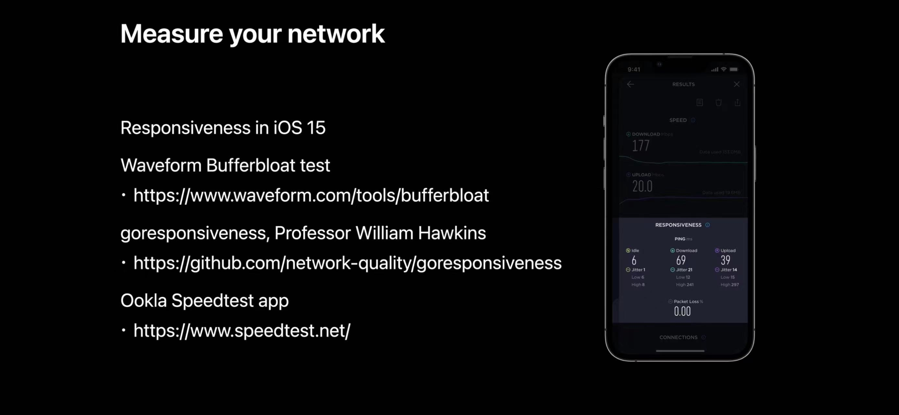
它们都可以用来对网络质量进行检测和度量。

### 合理的缓冲配置

在很多情况下，不合理或者说过大的缓冲配置会导致数据包在服务器侧形成巨大的缓冲队列，带来额外的延迟(这正是我们上面所说到的“缓冲膨胀”)。苹果通过一个视频流媒体拖放的场景来对比了两种截然不同的配置下的表现：一种是相对过大的缓冲配置（TCP 4MB、TLS 256KB、HTTP 4MB），另外一种是苹果推荐的相对合理的经验配置（TCP 128KB、TLS 16KB、HTTP 256KB）。在过大的缓冲配置下，视频流媒体拖动播放的体验很差，需要等待较长的时间，视频才可以被继续播放。通过结合 macOS 中的网络质量检测工具的使用，我们可以很方便的定位到该问题，我们能够发现数据包在服务器侧的积压；减小缓冲配置到合理的数值后，该问题得到了极大的改善。在 Apache Traffic Server （ATS）9.2 版本上改进后的具体配置如下：

```
% cat /opt/ats/etc/trafficserver/records.config

# Set not-sent low-water mark trigger threshold to 128 kilobytes
# tcp 128KB
CONFIG proxy.config.net.sock_notsent_lowat INT 131072

# Set Socket Options flag to the sum of the options we want
#  TCP_NODELAY +  TCP_FASTOPEN + TCP_NOTSENT_LOWAT 
# TCP_NODELAY(1) + TCP_FASTOPEN(8) + TCP_NOTSENT_LOWAT(64) = 73
CONFIG proxy.config.net.sock_option_flag_in INT 73

...
# Enable Dynamic TLS record sizes
CONFIG proxy.config.ssl.max_record_size INT -1
...

# Reduce low-water mark and buffer block size for HTTP/2
CONFIG proxy.config.http2.default_buffer_water_mark INT  32768
# http 256KB
CONFIG proxy.config.http2.write_buffer_block_size   INT 262144
```

在上面的配置中，我们启用了 TCPNODELAY / TCPFASTOPEN / TCPNOTSENTLOWAT，并将 TCP 的缓存水位值设置在了 128KB； 将动态 TLS 记录大小设置为启用；将 HTTP2 的缓存大小设置为 256KB。 在其他的 web 服务器上也需要寻求等价的配置来进行设置。值得一提的是，并非只有流媒体播放服务才会从该配置上获益；在其他类型的网络服务场景下我们依然可以进行尝试，并使用工具配合来做测试验证，以寻求一个相对最优的配置策略，为服务带来更好的体验。

## 加速你的网络: L4S 技术介绍和实践

### L4S 介绍

前面我们说到，网络上较慢节点的数据包很可能存在一个较大的积压队列，这个积压队列会导致整个网络传输受到影响。如果通过某种方法解决或者改善这个积压的状况，我们的网络表现就会获得一个巨大的提升。L4S 的提出主要就是为了解决上面这个问题。它的目标就是为了改善网络的拥塞控制。 其核心思想是希望通过更好的队列控制算法来实现更低的网络延迟、更少的丢包和对吞吐量的弹性控制。L4S 没有采用丢弃数据包的策略（这种策略会带来重传，从而增加 RTT 的次数）来解决拥塞；它提出了一种特定类型的数据包，这种数据包和传统数据包在路由器上会使用两个不同的队列来分开处理；发送者会收到路由设备关于网络拥塞的反馈，从而能够通过自适应调节发送速率来达到维持较少的排队的效果。目前我们可以在 iOS 16 和 macOS Ventura 中使用 L4S（还处于 beta 阶段）。需要了解更多关于 L4S 技术的细节，可以查看这篇提案：[Low Latency, Low Loss, Scalable Throughput (L4S) Internet Service: Architecture](https://tools.ietf.org/id/draft-ietf-tsvwg-l4s-arch-03.html) 。  
启用 L4S 后的网络示意图如下。

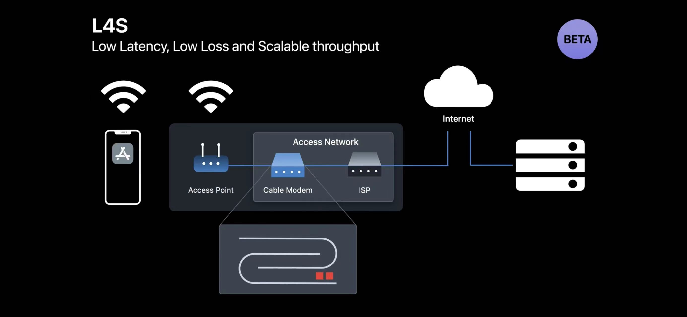

### 在屏幕共享应用中实践 L4S

众所周知，屏幕共享应用对于网络延迟是比较敏感的。因此，我们通过一个屏幕共享应用来演示 L4S 的惊人效果。我们的屏幕共享应用架构如下：

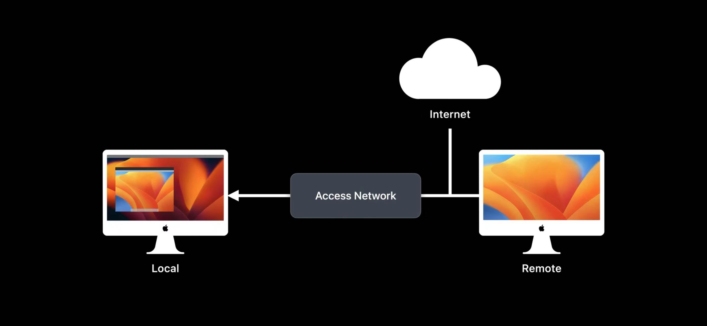
在本地和远端屏幕分别开启时钟，应用效果如下：

很明显我们可以看到，应用的延迟大概是 2s。下面我们启用 L4S，重启应用，效果如下：
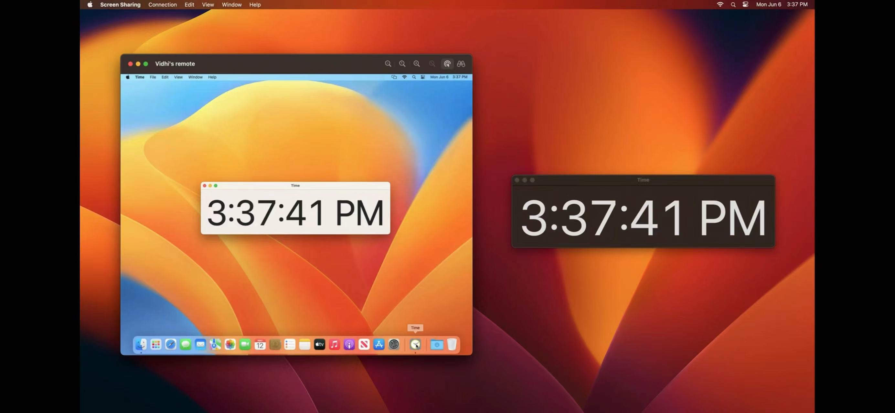
可以看到，远端屏幕的时间和本地基本上完全同步了。  
接下来我们使用测试工具对比开启 L4S 前后的网络延迟：
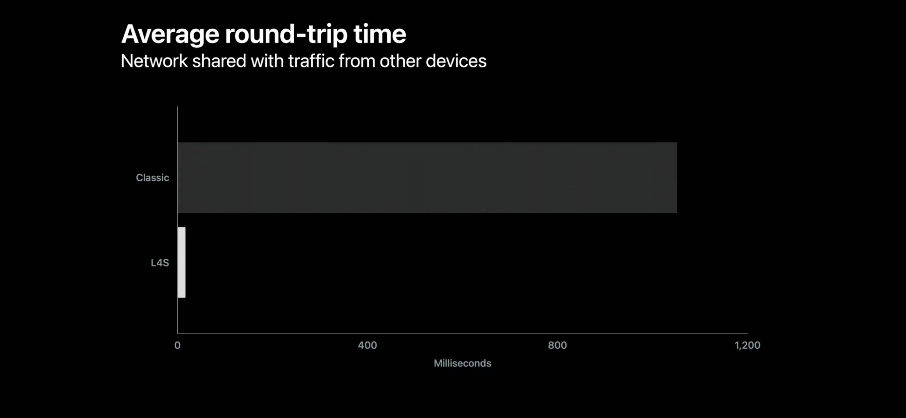
对比出来的效果非常夸张，相差了数十倍以上。

### 启用 L4S，测试应用兼容性

如果你的应用使用了 HTTP/3 或者 QUIC，就可以通过启用 L4S 来测试应用的兼容情况和优化后的效果。在 iOS 16 上，其设置在开发者设置选项中；在 macOS Ventura 上，我们可以通过执行命令行的方式对 其进行设置。要在 Linux 服务器上进行设置，你的 QUIC 实现需要支持 accurate ECN 和一种可伸缩的拥塞控制算法。  
具体设置可参考下图：
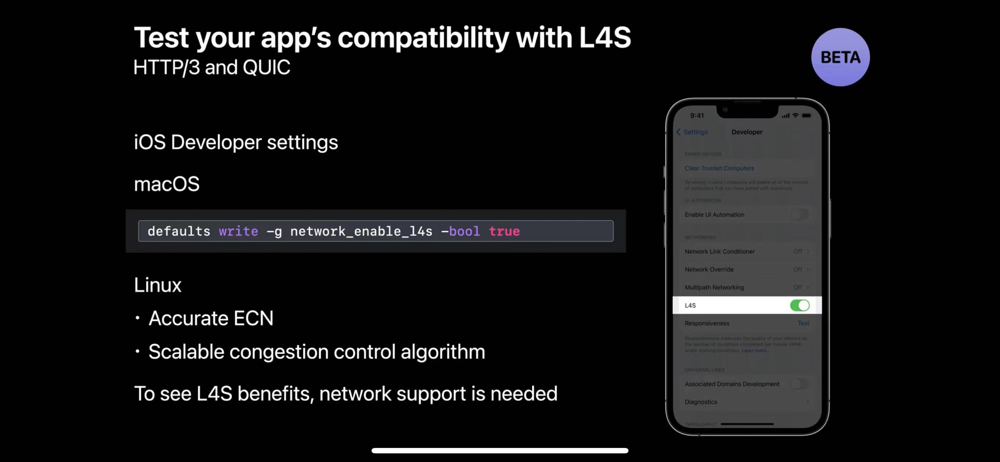

## App 网络延迟优化实践

下面这部分内容来自笔者个人理解和开发实践，希望也可以给大家带来一些启发，主要有以下几个方面：

### 更好的服务器地址发现
  
既然网络延迟定义的数据包从端到端发送所需要的时长，那么对于 App 而言，如何选择更优的服务器去连接，是一个非常重要的课题。常见的策略有以下几种：  

1. 基于 DNS 的地址发现。这种策略一般是系统默认支持的，其弊端是可能遇到 dns 劫持的问题，同时 dns 也会带来 rtt 的额外开销；  
2. 基于 HTTPDNS 的地址发现和排序。这种方案可以解决 dns 劫持问题，一般来说其实现也会使用普通 dns 解析作为兜底，其单次调用的代价应该是高于普通 dns 解析，但可以通过本地缓存策略等优化方案来进行弥补。合理配置后的 HTTPDNS 服务也支持按运营商、地域来进行匹配，同时还可以在其上承载一些简单的负载均衡策略。HTTPDNS 有比较成熟的市场化方案，可以较好的满足 App 使用的需求。  
3. 自行实现地址发现接口，客户端上报网络相关的信息，服务端通过接口下发地址列表。这种方案对于实现一些较为简单的策略相对友好，否则维护起来成本较高。  
4. 对于一些中小型 App 来说，IP 直连也是一个可行的方案，从网络开销上说，直连的成本相对是更低的。

需要注意的是，以上几种策略中如果使用了 IP 直连的方案，那么也需要考虑 IPV6 的支持和适配，关于这点苹果也给出过相关实践指引，这里就不展开说了。

### 服务器时延探测

仅仅针对服务器地址发现来优化其实还不够。即使你们的运营商、地域等信息匹配度相对较高，我们也无法能够保证当前所选择的服务器是最优的。我们还可以通过对服务器进行实时探测的手段来让我们的方案更加完善。常见的探测策略也有多种：  

1. 发送一个简单的探测用特定 udp 数据包，服务端收到包后自动回包，客户端收到包后即可计算出 rtt 时间（开销较小）；  
2. 通过 ICMP 协议发送 ping 包，计算 rtt 时间（开销较小，但 ping 包存在被特定路由策略拦截的可能）；  
3. 发送一个即时响应的 HTTP 请求，计算 rtt 时间（开销相对较大）。  
以上的探测方案和地址发现策略结合使用，最终的目标就是通过测速对服务器进行排序，帮助我们选择到更优的服务器；后续当网络变化/请求失败等场景下，我们可以考虑重新进行地址发现和探测，以选择合适的地址去连接。

### 更快的连接

在长连接的应用中，为了快速建立连接或者更快的从断开的连接中恢复，我们也有一些策略可以选择：  

1. 串行连接。串行连接实际上就是对服务器进行挨个尝试连接，直到连上为止。该策略实现较为简单，也不会增加额外的服务器压力，但建立连接的过程相对较慢；  
2. 并行连接。并行连接是指同时对多个服务器发起连接，某个服务器最先连上则终止其他连接。这种策略会增加服务器的压力（发起连接的并发数增加），建立连接的过程相对较快；
3. 复合连接。复合连接的策略是在不同的阶段结合串行连接和并行连接，在不会给服务器带来过大压力的同时获取到一个较快的连接建立过程。  
关于以上的策略，感兴趣的同学也可以参考腾讯的 Mars 框架及其设计方案。

### 更快或者更少的网络传输内容

1. CDN 的使用可以在很多场景下优化资源加载的表现，如果有条件/必要性，可以考虑 CDN 的使用；  
2. 对于图片加载，使用更好的图片格式（比如 webp / HEIC）可以优化你的网络性能-同等图片质量下，它们的体积更小，因此在网络上传输会更快 （但你需要注意考虑兼容性问题）；  
3. 使用更紧凑的格式也可以减少网络上的传输内容，比如使用 protobuf 来替代 json/XML；另外启用 gzip 压缩也可以提升网络传输效率。

### 体验优化

对于网络层的优化来说，最终的目标还是让用户满意。很多时候网络本身确实存在连通性方面的问题，我们需要做的，就是把信息传递给用户，或者至少让用户感觉上没那么难受。以下是几个小 Tips:  

1. 做好网络连通性检测，提前发现网络方面的问题，做好提示和相应的逻辑处理。比如一些伪连接和弱网络的场景，可以通过 RealReachability 框架进行探测；  
2. 在用户拨打电话 / 发起 voip 通话时，往往会第一时间听到回铃音，但这个回铃音有时候其实并不真实的表明你的请求已经发到了对面。但因为用户很难去证实这一点，通过这个简单的小策略可以给用户的心理体验得到提升。这种小策略也经常被用在加载/下载等场景下；  
3. 在真的无法获取内容时，通过本地缓存/兜底策略让你的 App 看起来不那么糟糕，或者可以完成部分工作。

## 总结

回顾一下本文的内容，其实苹果最终是给了我们 3 个实用性极强的建议：  

1. 尽可能使用现代网络协议，特别是 HTTP/3 和 QUIC；
2. 合理配置网络服务器上的缓存，消除服务器上不必要的排队；  
3. 支持和测试 L4S 网络架构，为启用 L4S 作准备，获得更好的应用网络性能。

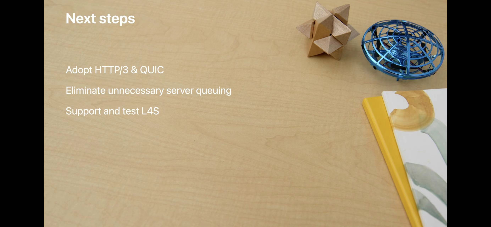
从现实角度而言，可能 L4S 离我们业务使用还有些遥远，但 HTTP 和 QUIC 协议的演进和发展已经是不争的事实，并且在很多头部互联网公司已经被广泛使用。仅仅需要更新和支持新的网络协议即可拿到相当大的业务收益，非常值得广大开发者们去探索和实践。  
除了使用苹果的方案以外，基于 Cronet 来实现跨端的网络协议支持也成为一种技术选择，归根结底也是为了达到同样的目标-降低网络延迟，让 App 变得更快。也希望广大的读者朋友就此方面的话题可以和我一起来进行交流和探讨，谢谢！

## 参考

- [Apple - Reduce networking delays for a more responsive app](https://developer.apple.com/videos/play/wwdc2022/10078/)
- [Apple - Reduce network delays for your app](https://developer.apple.com/videos/play/wwdc2021/10239/)
