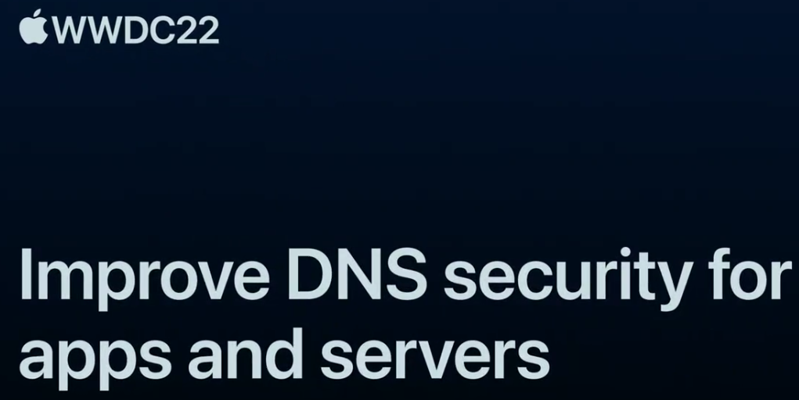
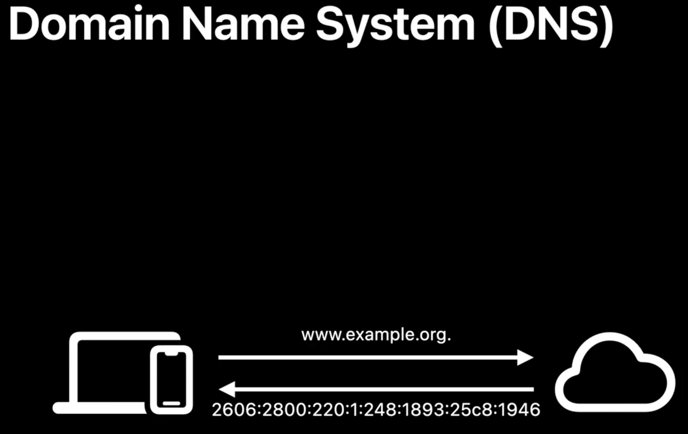
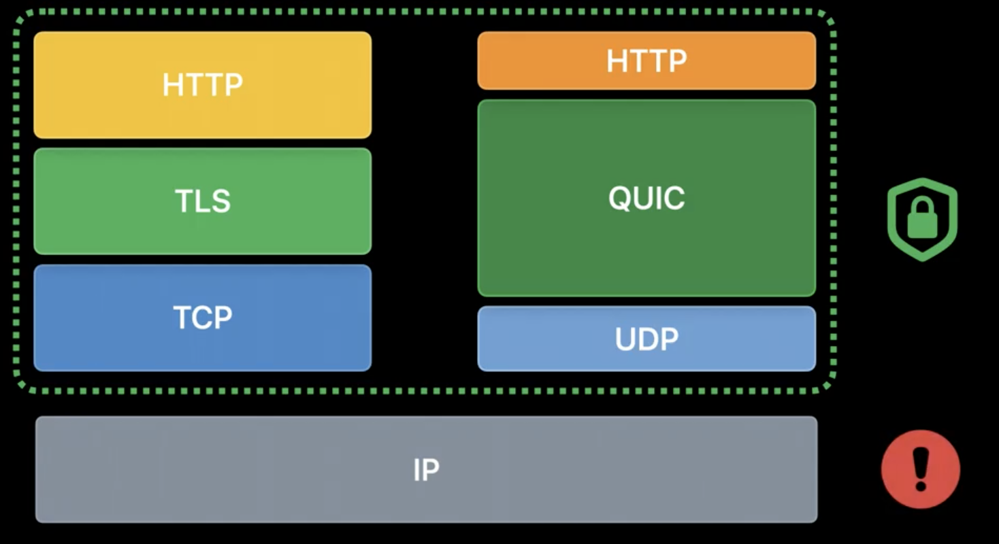
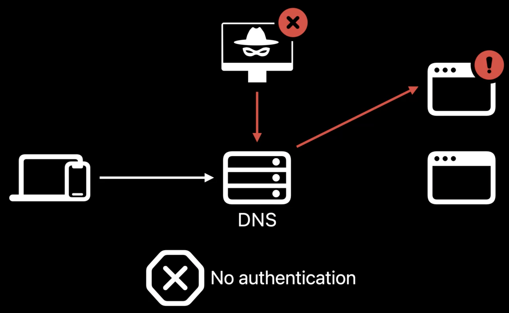
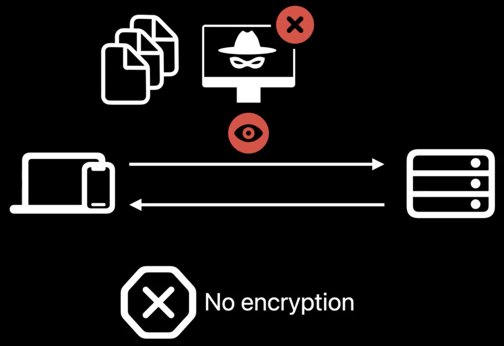
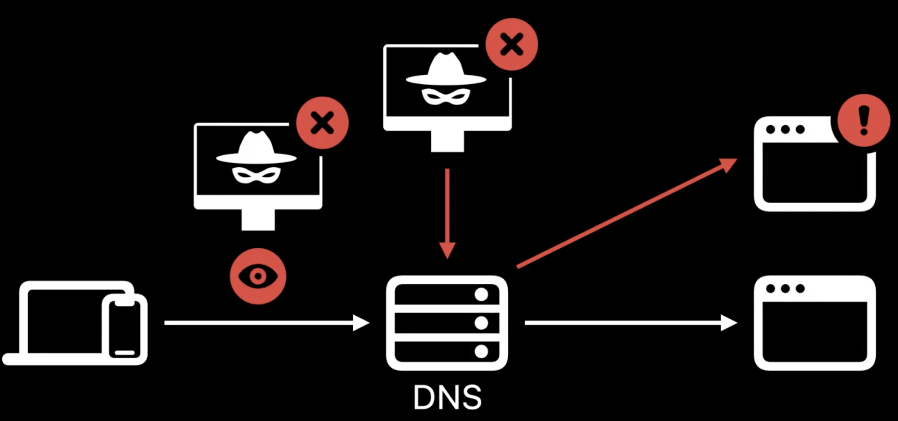
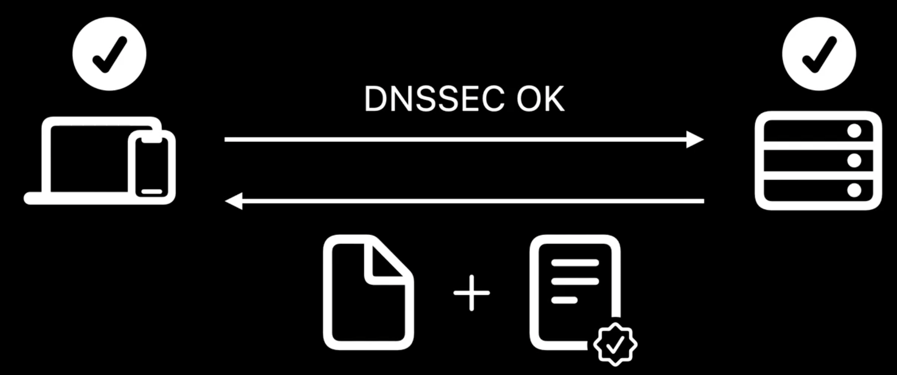
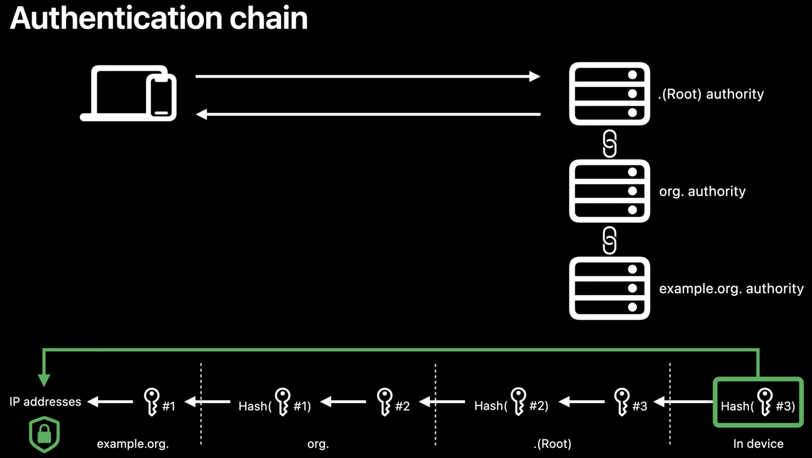
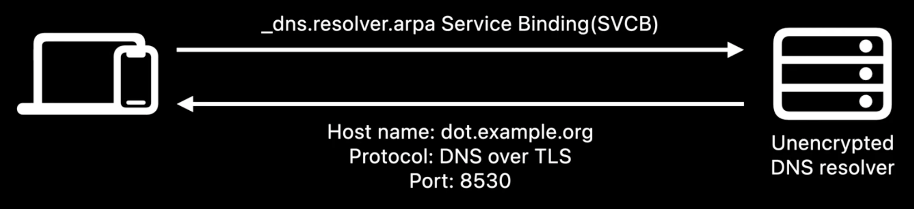
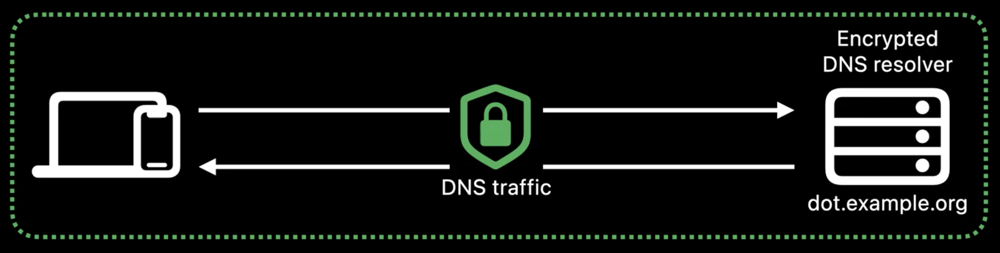

# Session 10079 - 提高应用程序和服务器的 DNS  安全性

本文基于 [Session 10079](https://developer.apple.com/videos/play/wwdc2022/10079) 梳理。

> 作者： Nicola，就职于探探，iOS 开发者。国际化语音房活动开发。
>
> 审核：
>
> ……



> 导读：
>
> -  本文分为 ：DNS 为什么不是安全的 、DNNSSEC 是什么 、应用如何支持 DNSSEC、DDR 对 DNS 进行加密
> -  其他

## Improve DNS security for apps and servers

本文我们将讨论为什么 DNS 通常是不安全的，以及如何通过 DNSSEC 和使用 DDR 加密的 DNS 来保护他的安全性。

### 一、不安全的 DNS

DNS 是互联网的电话簿，它将人类可读并且容易记忆的域名转换成为机器设计的 IP 地址。



其他的互联网协议，如 TCP 、TLS 和 QUIC ，依赖于 IP 地址，因此一切都是从 DNS 开始。今天 TLS 被广泛用于保护互联网通信安全，但作为基础层的 DNS 存在一些安全问题。DNS 有史以来并不安全，它是在 1983 年设计的，当时几乎没有什么安全考虑，从那以后的几年里，已经产生了很多 DNS 攻击。



比如说 DNS 缓存中毒，攻击者利用 DNS 解析的缺陷，使他们缓存不正确的 IP 地址，导致客户端连接到恶意主机。这揭示了 DNS 的一个漏洞：它没有身份验证。如今传统的 DNS 客户端无法验证应答者，因此很容易被欺骗。



另一种常见的攻击就是 DNS 嗅探，攻击者监听客户端和 DNS 解析服务器之间的 DNS 流量，收集客户端的历史记录。对于用户隐私来说，这是一个严重的问题。而让这种攻击成为可能的原因是 DNS 流量最初是未加密的。



为了成为安全起点，在此之上构建其他的协议，DNS 需要经过身份验证和加密。

-  当我们使用 DNNSEC 对 DNS 响应进行签名时，它提供了身份验证
-  当我使用 TLS 和 HTTPS 加密 DNS 解析结果时，它可以确保隐私



### 二、什么是 DNSSEC

> DNSSEC 是由 IETF 制定的一套扩展规范。许多 DNS 服务提供商已经支持它了，但是客户端支持还需要加快速度。

iOS16  和 macOS Ventura 现在支持客户端 DNSSEC 验证。 DNSSEC 通过添加数字签名来确保数据的身份验证，以此来保护数据完整性，当应答者不存在时，它会验证拒绝存在，还提供加密身份验证。DNNSEC 通过在响应中附加签名来保护数据完整性。如果响应被攻击者篡改了，那么篡改后的数据签名将与原始数据不匹配。这种情况下，客户端可以检测到响应已经被篡改然后将其丢弃。



DNSSEC 还通过使用特殊类型的 DNS 记录（例如 NSEC 记录）来断言区域中记录是否存在。NSEC 记录按字母顺序安全地告诉您下一个记录名称是什么。只有它列出的名称才是存在的，任何未列出的名称都是不存在的。


例如，现在这里有三个 NSEC 记录。记录集合中显示区域 org 只有三个记录名称，A.org、C.org 和 E.org。如果有攻击者说 A.org 不存在，客户端可以检测到这种攻击。确定 A.org 的确存在，因为它列在第一个 NSEC 记录中。同样的，如果攻击者说 D.org 存在，客户端也可以检测到，因为根据第二个 NSEC 记录，D.org 位于 C.org 和 E.org 之间，但是这两个名称之间并不存在 D.org。

DNSSEC 通过建立信任链来验证记录，举个例子：设备想要解析 www.example.org 并启用 DNSSEC 验证。它发送询问 IP 地址、签名和密钥的查询。通过响应，可以建立从 IP 地址到密钥 1 的信任关系。然后客户端向父区域 org 发送查询，询问可用于验证密钥 1 的记录，因此它可以建立从密钥 1 到密钥 2 的信任关系。所以设备递归地重复这个过程，直到它到达根域。现在如果根密钥（图中的密钥 3 ）可以信任，则可以验证从 IP 地址到密钥 3 的信任关系。根密钥的哈希值始终安全地存储在设备中。在 DNSSEC 中，它被称为根信任锚。如果密钥 3 的哈希值与预先安装的锚匹配，则可以安全地建立信任链。通过信任链，www.example.org 的 IP 地址现在已经通过了身份验证。



### 三、应用支持 DNSSEC

如果你想在你的应用程序中要求 DNSSEC 验证，您需要执行以下操作：

-  域名支持 IPV6
-  对域名进行签名
-  采用相应架构的 APIs

在只有 IPV6 的环境中，IPV4 地址被转换为合成 IPV6 地址。如果域名被签名，合成地址无法通过 DNSSEC 验证； 启用 DNSSEC 后，它们无法访问。因此，请确保您的域支持 IPv6。

确保你的 DNS 服务提供商使用 DNSSEC 对你的域名进行签名。如果你在您的应用程序中启用了 DNSSEC 但是没有对你的域名进行签名，你将不会获得任何好处，但是你将获得额外的 DNS 流量和更长的解析时间，以尝试对你没有签名的域名进行身份验证。

获得相应的基础架构支持后，以下是为你的应用采用 DNSSEC 所需要的代码。

```swift
//  Require DNSSEC validation in your URL request at session level.

let configuration = URLSessionConfiguration.default

configuration.requiresDNSSECValidation = true

let session = URLSession(configuration: configuration)
```

如果你是 NSURLSession 客户端，你可以要求对你的 URL 请求进行 DNSSEC 验证。举个例子：

```swift
//  Require DNSSEC validation in your URL request at session level.

var request = URLRequest(url: URL(string: "https://www.example.org")!)

request.requiresDNSSECValidation = true

let (data, response) = try await URLSession.shared.data(for: request)
```

先创建一个默认会话配置，设置需要 DNSSEC 验证。接下来将使用修改后的配置来创建会话。它会为从此会话创建的所有 URL 请求启用 DNSSEC。如果你不想在整个会话启用 DNSSEC，你也可以在请求级别执行此操作。

使用禁用 DNSSEC 验证的默认配置创建会话，然后在请求中启用它。现在，此会话任务将仅在 DNSSEC 验证完成后启动。如果你是 Network.framework 客户端，你还可以要求对连接进行 DNSSEC 验证。创建参数对象时，需要进行 DNSSEC 验证，然后使用参数对象创建 NWConnection。

```swift
//  Require DNSSEC validation in your network request.

let parameters = NWParameters.tls
parameters.requiresDNSSECValidation = true

let connection = NWConnection(host: "www.example.org", port: .https, using: parameters)
```

现在当你开始连接时，只有在 DNSSEC 验证完成并且与经过验证的 IP 地址建立连接时，它才会进入就绪状态。启用 DNSSEC 后，将仅使用经过验证的地址来建立连接。

在 HTTPS 中，通过 APIs 报告错误。在 DNSSEC 中，验证失败不会返回任何错误。收到验证失败的响应等于没有收到任何响应。

如果存在篡改响应的 DNS 提供者，地址将无法通过身份验证检查，因此将直接丢弃。当设备加入 DNS 提供商未篡改响应的新网络时，验证将再次进行，解析将自动恢复正常。

以下是一些可能导致 DNSSEC 失败的情况。

-  当原始 DNS 响应被修改了，不匹配的签名将无法通过 DNSSEC 检查，从而导致验证失败
-  当设备无法访问任何预安装的信任锚并且无法与其建立信任链时
-  当网络不支持 DNSSEC 所需的必要协议时，例如 DNS over TCP 和 EDNS0 选项，它携带了 DNSSEC 启用位
-   当签名的域名不支持 IPv6 时，由互联网服务提供商提供的合成 IPv6 地址将无法通过验证

这就是使用 DNSSEC 对 DNS 响应进行身份验证的方法，但如果它们仍未加密，网络上的任何人都可以看到它们。

### 四、DDR 对 DNS 加密

如何使用 DDR 自动启用 DNS 加密。在 iOS 14 和 macOS Big Sur 中，我们引入了加密 DNS 以帮助保护隐私。您可以使用应用程序中的NEDNSSettingsManager 或配置文件中的 DNSSettings 手动配置加密的 DNS 系统范围。您还可以使用 NWParameters 上的 PrivacyContext 为您的应用程序选择加密 DNS。有关详细信息，请观看“[Enable encrypted DNS](https://developer.apple.com/videos/play/wwdc2020/10047)”， iOS 16 和 macOS Ventura 的新增功能，可以自动使用加密的 DNS。

如果您的网络支持发现指定解析器（也称为 DDR ），则 DNS 查询将自动使用 TLS 或 HTTPS。要使用加密的 DNS，您的设备需要知道解析器支持 TLS 或 HTTPS，并且可能还需要学习端口或 URL 路径。诸如 DHCP 或路由器播发等常见机制仅提供普通IP地址。DDR 是 Apple 与其他行业合作伙伴在 IETF 中开发的一种新协议。

它为 DNS 客户端提供了一种通过使用特殊 DNS 查询来了解这些必要信息的方法。当你的设备加入新网络时，它将发出“_dns.resolver.arpa”的服务绑定查询。如果 DNS 服务器支持 DDR，它会回复一个或多个配置。然后，设备使用此信息建立与指定解析器的加密连接。它验证未加密解析器的 IP 地址是否包含在指定解析器的 TLS 证书中。这样做是为了确保未加密的解析器和加密的解析器属于同一实体。



如果一切正常，设备现在默认使用加密的 DNS。DDR 一次适用于单个网络。只有在当前网络支持时，你的设备才会自动使用加密的 DNS。同样重要的是要注意，如果DNS 服务器的 IP 地址是私有 IP 地址，则 DDR 不起作用。这是因为 TLS 证书中不允许此类 IP 地址，因为它们的所有权无法验证。

### 五、展望未来

在 iOS 16 和 macOS Ventura 中，我们还支持在使用加密 DNS 进行配置设置时使用 NEDNSSettingsManager 或 DNSSettings 配置文件，指定客户端身份验证的功能。客户端身份验证允许在服务器需要在允许访问之前验证客户端的企业环境中使用加密的 DNS 服务器。



现在可以使用 NEDNSSettings 的 identityReference 属性配置客户端证书。这就像 VPN 的客户端证书一样。这些可以应用于 DNS over TLS 和 DNS over HTTPS。这是保护 DNS 的途径。

使用 DNSSEC 对你的域名进行签名，并要求在您的应用中进行 DNSSEC 验证以验证您的 IP 地址。在您的网络上启用 DDR，以便客户端可以自动切换到加密 DNS 以更好的保护用户隐私。在需要更好的访问控制的企业中采用客户端身份验证。

**DNSSEC**：域名系统安全扩展（**D**omain **N**ame **S**ystem **Sec**urity Extensions）是 IETF 对确保由域名系统（DNS）中提供的关于互联网协议 （IP）网络使用特定类型的信息规格套件。它是对 DNS 提供给 DNS 客户端（解析器）的 DNS 数据来源进行认证，并验证不存在性和校验数据完整性验证，但不提供机密性和可用性。

**DDR：**Discovery of Designated Resolvers，可以自动检测现在用的 DNS resolver 是否支持 DNS over HTTPS 或者 DNS over TLS，如果有的话就直接升级到 DoH（DNS over HTTPS） 或者 DoT（DNS over TLS）。

