# Session 10082 - 利用 Xcode 和设备上的检测工具排查卡顿

本文基于 [Session 10082](https://developer.apple.com/videos/play/wwdc2022/10082) 梳理。

> 作者：Wilson，就职于字节跳动剪映团队，iOS 开发者。
>
> 审核：
>
> 红纸。
>
> 呼神护卫。

## 导读

今年 Apple 在开发全链路过程中对于卡顿问题的排查分析工具上做了一次相对较完整的更新，借此机会笔者想将结合本次 WWDC22 的更新内容与大家一同探讨下日常卡顿的治理思路。本文篇幅有点长，大家可以先浏览下文章的思维导图，能够帮助大家提前梳理本文的主体脉络。
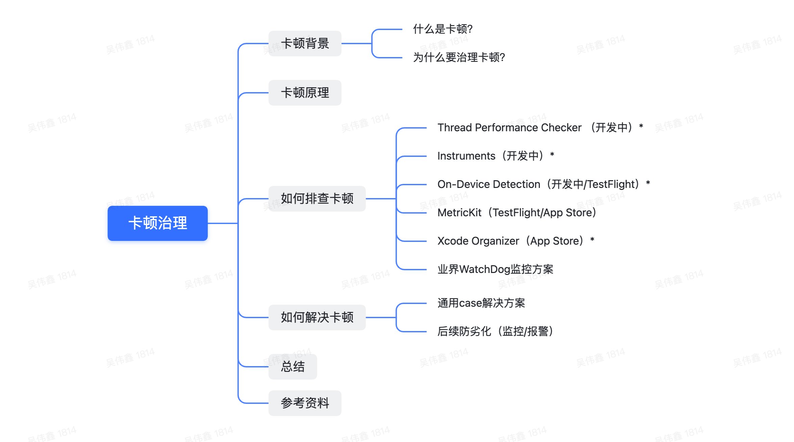

## 背景介绍

我们先来看一个简单示例（以下片段截取至 Session 视频的开头部分），示例展示的是 Apple 内部新研发的一款 Food Truck 应用（餐车，用于管理销售甜甜圈产品），当开发人员点击 Donuts 进入甜甜圈种类列表并尝试滚动时，发现需要等待一段时间后界面才响应。借这种现象，我们来引入本文的话题——卡顿的治理。在话题具体讨论之前，首先先回答两个问题：什么是卡顿？以及我们为什么要治理卡顿？
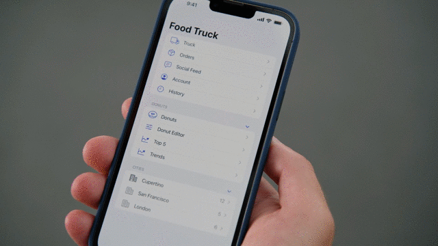

**什么是卡顿？**

卡顿，顾名思义就是 App 在使用过程中出现了一段时间的阻塞，其表现为在用户触摸屏幕后，需要等待一段时间 App 才有响应，在这段时间内用户都无法进行其它操作，屏幕上的内容也没有任何的更新，正如上述示例所示。

**为什么要治理卡顿？**

卡顿从表现层面来讲，小到给用户一种掉帧和延迟感，大到用户不耐烦主动退出应用或超出系统阈值而发生崩溃；而这种体验对用户的伤害其实比普通的崩溃更加严重，而持续的卡顿感可能导致用户退出并转去使用其他应用，甚至可能卸载应用并在 App 商店留下不好的评论，直接关系到用户留存率、DAU 和 DNU 等各项产品数据。因此卡顿目前已成为 iOS 最重要的性能指标之一，治理并减少 App 的卡顿率变得尤其关键。

## 卡顿原理分析

> 在正式进入排查和解决卡顿之前，我们先简单分析下卡顿发生的原理以及日常开发中通常导致卡顿的原因。

正常情况下，iOS 默认显示频率是 60Hz，所以 GPU 渲染只要达到 60fps 就不会产生卡顿；以 60fps 为例，vSync 会每 16ms(1/60) 触发一次渲染，假如在 16ms 内没有准备好下一帧数据就会使画面停留在上一帧，就造成了掉帧或卡顿现象（参考：[iOS 保持界面流畅的技巧 | Garan no dou](https://blog.ibireme.com/2015/11/12/smooth_user_interfaces_for_ios/)）。

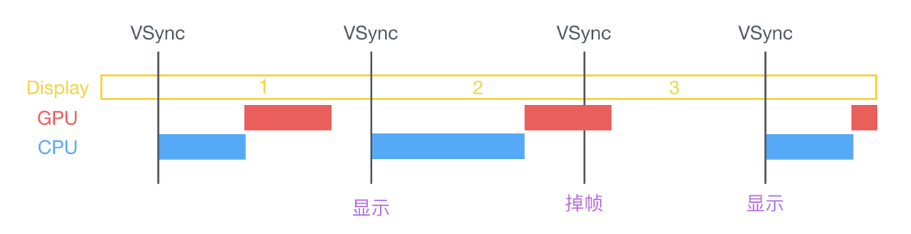

而在 iOS 开发中，由于 UIKit 是非线程安全的（参考：UIKit | Apple Developer Documentation），因此一切与 UI 相关的操作都必须放在主线程执行，系统会每 16ms 将 UI 的变化计算重新绘制，渲染至屏幕上。如果 UI 刷新的间隔能小于 16ms，那么用户是不会感到卡顿的。但是如果在主线程进行了一些耗时操作，阻碍了 UI 的刷新，那么就会产生卡顿，甚至是卡死。
主线程对任务的处理是基于 Runloop 机制，如下图所示。Runloop 支持并提供给外部注册 6 个时机的事件回调，分别是：

- RunloopEntry
- RunloopBeforeTimers
- RunloopBeforeSources
- RunloopBeforeWaiting
- RunloopAfterWaiting
- RunloopExit

其流转关系如下图所示。Runloop 在没有任务需要处理的时候就会进入休眠状态，直至有信号将其唤醒，它又会去处理新的任务。

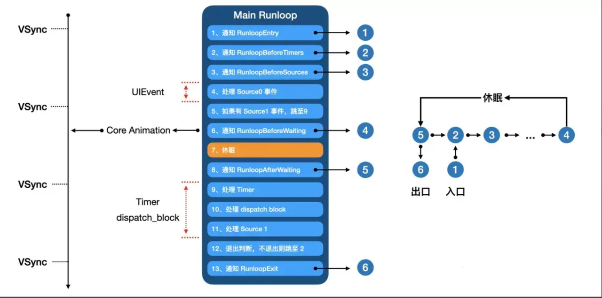

在日常开发中，`UIEvent`事件、`Timer`事件以及`dispatch`主线程块任务都是在 Runloop 循环机制的驱动下完成的。一旦我们在主线程中的任一个环节进行了一个耗时的操作，或者因为锁使用不当造成了主线程因等待而阻塞，那么主线程就会因为无法执行`Core Animation`回调而造成界面无法刷新。而用户的交互又依赖于`UIEvent`事件的传递和响应，该流程也必须在主线程中完成。所以主线程的阻塞会导致应用 UI 和交互双双阻塞，这也是导致卡顿的根本原因。

实际在日常开发中通常造成卡顿的原因主要是以下几种：（具体可参考往期[【WWDC21 10258】理解和消除 App 中的卡死 - 小专栏](https://xiaozhuanlan.com/topic/9027453618)）

- 主线程执行耗时的任务（CPU 密集型任务），比如调用`UIGraphicsGetCurrentContext`等接口在 CPU 上进行绘制计算；
- 主线程等待繁忙的子线程或低优先级的后台线程任务而导致阻塞，比如在主线程使用`queue.sync`同步派发任务或使用`semaphore.wait()`将异步调用转化为同步调用等；
- 主线程等待系统资源，`比如使用Data(contentsOf:)`进行 IO 读取等；

## 如何排查卡顿

> 在了解了卡断的原理以及日常开发中通常造成卡顿的原因之后，接下来我们就来简单介绍下有哪些工具可以帮助排查和定位卡顿问题。

在 iOS 16 和 Xcode 14 以前，Apple 提供了 Instruments、MetricKit 以及 Xcode Organizer 等工具供开发者在不同开发阶段进行 App 性能的统计分析，但是针对卡顿的排查分析十分有限。值得高兴的是今年 Apple 在 iOS 16 和 Xcode 14 上更新了一些帮助开发者在不同开发阶段进行排查和分析卡顿的工具。它们分别是：

- Thread Performance Checker
- Hang detection in Instruments
- On-Device Hang Detection
- Xcode Reports Organizer

因此我们将结合本次更新的内容，简单探讨下在 App 不同开发阶段应如何利用好这些工具帮助我们更快定位和解决卡顿问题，不断提升我们 App 的性能体验。

### Thread Performance Checker

首先是开发阶段，当我们在使用 Xcode 进行真机调试时，可以在 Edit Scheme -> Run -> Diagnostics 选项卡中开启 Thread Performance Checker。（其实升级到 Xcode 14 后就已经默认开启 Thread Performance Checker）

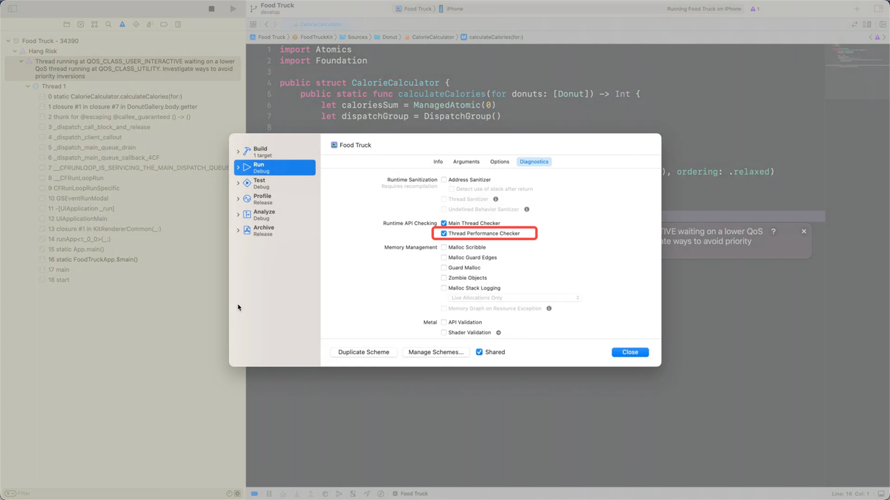

当开启 Thread Performance Checker 后，Xcode 如果检测到 App 在运行时有例如线程优先级反转和非 UI 工作在主线程运行等问题时就会在 Xcode 问题导航栏中提示该卡顿风险警告。这可以帮助我们在开发初期就能发现并去解决隐含的卡顿风险问题。

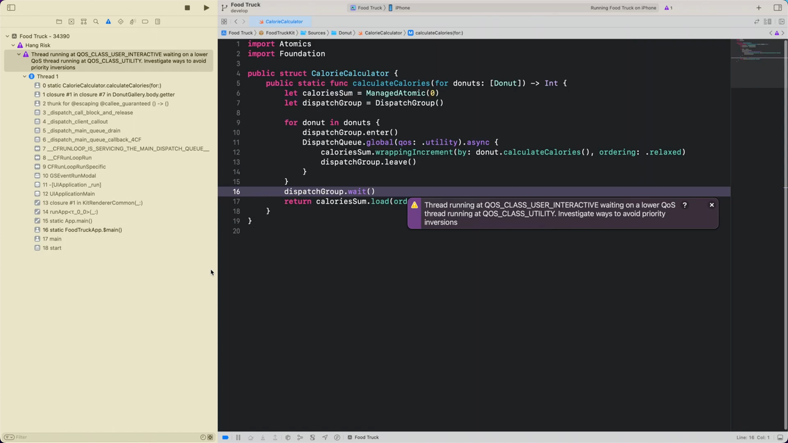

但是笔者在 Xcode 14 Beta 版上实际体验了该功能后，发现该功能目前还有一些局限性：

- 在主线程执行比较耗时的 CPU 密集型任务导致卡顿时，Xcode 并没有提示该卡顿风险。
- 实际测试过程中只要在主线程上检测到等待`utility`和`background`两种 qos 类型的线程等待问题（不管是否耗时）时就会提示，但却无法针对其它 qos 类型的线程等待问题（即使非常耗时）进行提示，而且运行期间有且仅会提示第一次遇到的线程等待问题。比如 App 同时存在两个等待`utility`和`background`类型的线程等待问题时，如果在运行时先执行了等待`utility`线程的代码，然后再执行等待 `background`线程的代码，则只会提示第一次的等待`utility`线程的问题，反之亦然。
- 在主线程通过`Data(contentsOf:)`同步请求网络数据时可以检测到卡顿风险，但是在设备上同步读写磁盘文件（无论大小多大）时并没有提示卡顿风险。

不确定以上问题是否是 Beta 版本存在的 BUG，还是目前功能相对不够完善。另外该卡顿风险警告提示仅显示主线程堆栈信息，并没有展示在该卡顿期间其它线程的堆栈信息。这时可以借助开发阶段的另一个工具——Instruments Timer Profiler 进行进一步分析；

### Instruments

接下来我们将使用 Timer Profiler 来对上述 Thread Peformance Checker 提示的线程等待问题进一步深入分析。针对 Timer Profiler 具体使用方法我这边也不做赘述了，大家可通过往届 WWDC 视频 [Instruments 入门](https://developer.apple.com/videos/play/wwdc2019/411/) 和官方文档 [Instruments Developer Help](https://help.apple.com/instruments/developer/mac/current/) 了解更多；
当我们在使用 Xcode 14 的 Timer Profiler 工具分析 App 重现的卡顿问题时，可以惊喜地发现新的 Timer Profiler 在检测到 App 有卡顿问题时就会在轨道时间线上展示红色的 Hang 标记，该标记的长度代表了卡顿的时间间隔。然后，我们可以通过点击三次 Hang 标记过滤出该卡顿时间间隔区间内的所有事件并展开详细的线程轨道视图，以方便查看其它线程的繁忙情况。如下图所示，可以看到主线程在这段时间内属于空闲状态，而有一个 worker 子线程在这段时间内却属于繁忙状态，可见应该是主线程在等待该子线程完成任务。这与上述 Thread Performance Checker 中展示的卡顿风险警告遥相呼应，最后我们可以展开 Timer Profiler 下方的调用堆栈分析当时子线程的堆栈信息，结合实际上下文并最终解决主线程阻塞问题。

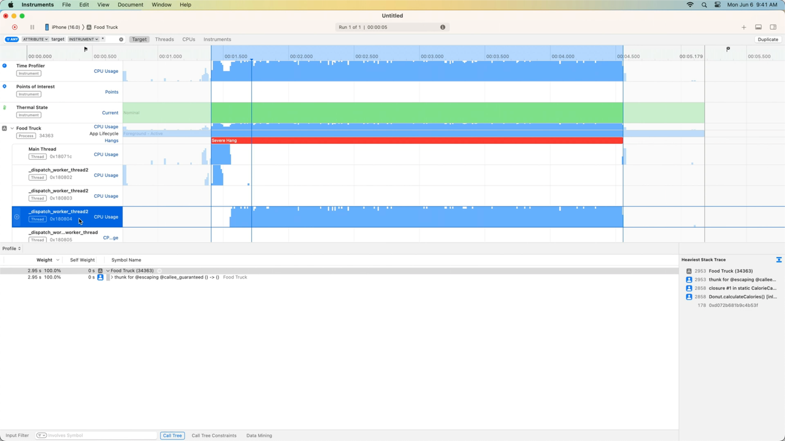

值得一提的是上述的 Instruments 中卡顿检测与标记在 Timer Profiler 和 CPU Profiler 工具中同样都是默认可用的，另外也可以在其它 Trace 模版中添加 Hang tracing 跟其他工具结合进行测试，不过需要注意的是单独的 Hang tracing 只能检测到运行期间是否发生了卡顿以及卡顿时长，并没有实际的堆栈信息，所以在实际利用 Instruments 排查卡顿时还是建议优先使用 Timer Profiler 进行分析。

### On-Device Detection

前面讨论了可利用 Thread Performance Checker 和 Instruments 中的卡顿检测工具来帮助我们发现并定位问题，其实可以发现这两个工具都是线下的定位手段。虽然我们可能在开发阶段已经做足了相对完整的测试，并取得了较好的测试覆盖率，但是在后续的 Beta 测试阶段和线上发布阶段中也有可能会出现自己没考虑到的卡顿问题的路径。这时候用户设备都是无法连接到 Xcode 进行线下调试的，所以就非常依赖线上的工具进行定位问题。谈到线上工具，首先值得高兴的是今年 Apple 在 iOS 16 的开发者设置中引入了 Hang Detection（卡顿检测）功能，为 App 运行时提供实时的卡顿检测通知并诊断的能力，不过这只适用于由开发证书签名的以及通过 TestFlight 分发的应用，换言之就是该功能只能统计通过 Xcode 安装的 Debug 包和通过 TestFlight 安装的 Release 包，而通过 AppStore 安装的应用或企业包则不能被统计（笔者理解上这块应该是 iOS 系统内部针对应用的签名类型进行了限制，可参考：[漫谈 iOS 程序的证书和签名机制](https://segmentfault.com/a/1190000004144556)）。

功能具体打开方式： Settings -> Developer -> Hang Detection，并切换 Enable Hang Detection 开关状态到开启状态。开启后可以看到以下三部分：

- Hang Threshold：可设置卡断检测的阈值，目前只有 250ms、500ms、1000ms 和 2000ms 四个可选；
- Monitored Apps：展示可监控的 App 列表；（注意：只展示由开发证书签名的和通过 TestFlight 安装的应用，企业证书签名无法适用）
- Avalable Hang Logs：展示了收到卡顿警告通知时诊断所产生的卡顿日志列表，这个后续我们排查具体问题时会用到；

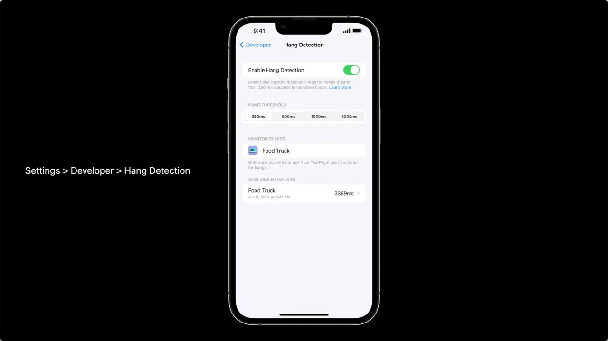

现在我们将 Food Truck 应用部署到 TestFlight 并在个人设备上安装运行，如下图所示，当我们首次点击 Orders 打开订单列表时，在屏幕上方收到了一个卡顿提示。

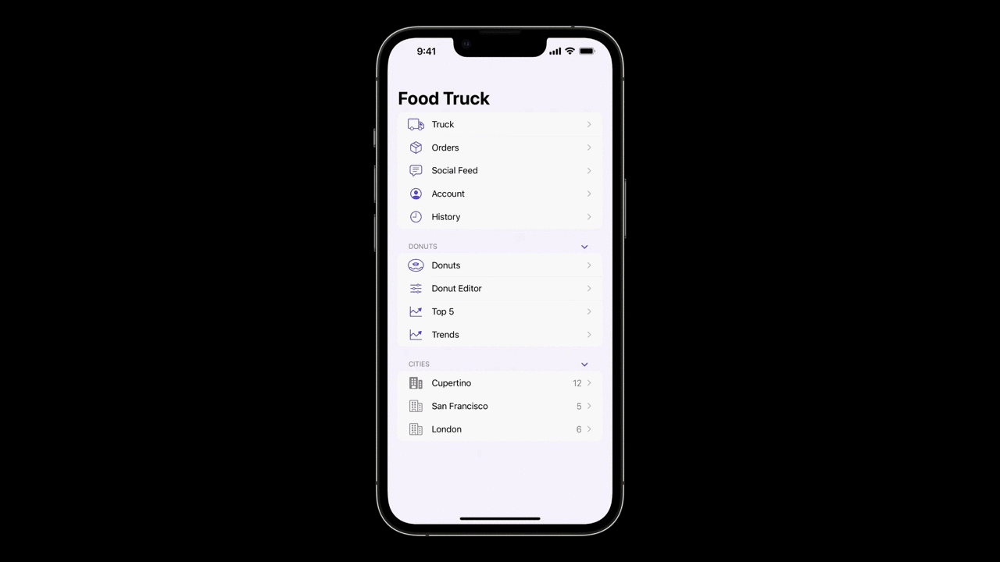

这显然是我们在开发时都没有注意到的卡顿问题，它出现在了 Beta 测试阶段，此时我们可以切换到上述 Hang Detection 的 Avalable Hang Logs 列表中来查找该卡顿产生的诊断日志并打开详情。如下图所示，日志详情分为两部分：一部分是基于文本的卡顿日志摘要文件（格式类似崩溃日志），文件后缀名为 .ips；另一部分则是 tailspin 压缩文件，tailspin 文件可以在 Instruments 中打开查看更多维度信息（例如 Timer Profile 和 Disk Usage 等系统资源使用情况等）供深入分析使用。

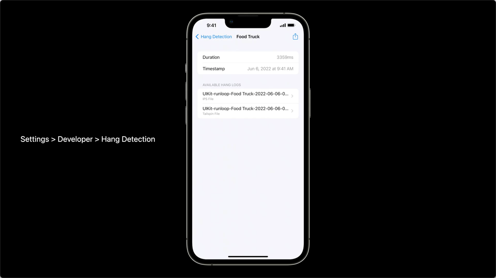

此时我们可以通过分享到 Airdrop 方式将这些日志发送到 Mac 上，我们将日志符号化后，可得到如下图所示的堆栈信息，可以看到 App 在发生卡顿期间，主线程正在执行一个同步读取网络/磁盘数据的方法，最终我们定位到了该问题的原因是主线程在等待资源而发生了阻塞。

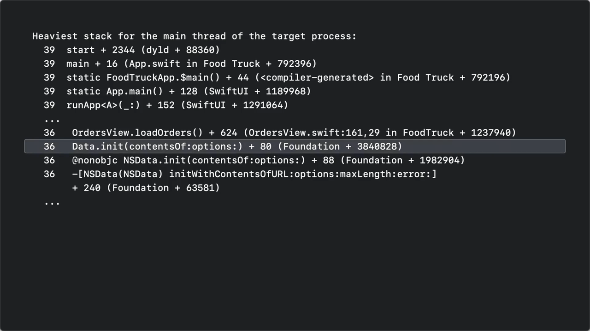

### MetricKit

然后说回到线上工具，值得一提的是 MetricKit 框架，它是 Apple 在 iOS 13 发布的用于收集和诊断性能的工具，其中就包括卡顿指标（具体可查阅：[MetricKit | Apple Developer Documentation](https://developer.apple.com/documentation/metrickit)）。不过它始终只是一个框架，线上使用时还需要人为接入它并上报相关诊断数据才能进行系统性地分析，不过其实苹果也考虑到了这点，也一并在 Xcode Organizer 中加入相应的指标分析能力，这一点我们接下来会简单介绍下。另外它还可以作为一个性能测试工具供开发阶段单元测试使用，具体这边就不赘述了，详情可查阅 [XCTMetric | Apple Developer Documentation](https://developer.apple.com/documentation/xctest/xctmetric)。

### Xcode Organizer

最后当 App 发布到正式环境以后，后续我们就可以通过 Xcode Organizer 来分析线上版本 App 的性能指标。Xcode 14 以前 Organizer 只提供了卡顿率这种经过系统性分析后的数据指标，并没有提供诸如包含堆栈信息的卡顿报告来帮助排查定位，功能上相对鸡肋。不过在 Xcode 14 上 Organizer 终于支持了 Hang Reports，它能收集并上报线上用户在遇到卡顿时系统所产生的诊断报告数据（前提是用户同意了与 App 开发者共享应用分析）。如下图，Xcode 14 Organizer 的 Reports 分类中新增加了 Hang Reports 栏目。左起第二栏展示问题的聚合列表，问题按用户影响程度进行排序；第三栏展示了具体问题的堆栈信息，可帮助开发者分析定位卡顿原因；第四栏展示了具体问题的汇总统计信息，比如发生卡顿的数量，操作系统和设备分布比例等。

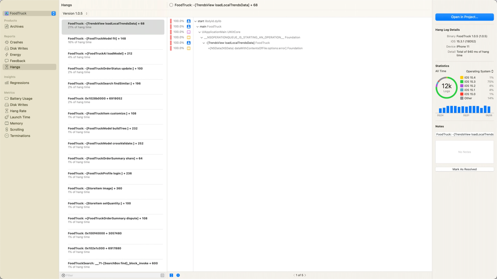

例如上图所示，我们观察到 Hangs Reports 的问题列表中最顶部的问题占了该版本卡顿问题的 21%，问题相当严重。我们可以尝试解决该问题，选中该问题并展开查看具体的堆栈信息，最终可以推断出该问题是因为在主线程同步读取磁盘文件而引起阻塞。这里补充说明下上述堆栈信息是经过符号化后的结果，具体只要用户在 App 上传到 App Store 时一并上传符号信息，报告中的堆栈信息就能自动符号化了。
除了 Xcode Organizer 本身提供的可视化分析工具之外，它也支持第三方开发者通过 App Store Connect REST API 获取应用的卡顿报告数据，以方便开发者将卡顿分析集成到自己内部的分析系统中并做额外分析。（具体可参考往期[WWDC20 10057 - Identify trends with the Power and Performance API](https://xiaozhuanlan.com/topic/2036175489)的介绍）
另外在进行排查和治理现有问题时，做好线上防劣化监控其实也同样重要，Apple 建议开发者到 Organizer 的 Regressions 中开启版本性能指标劣化通知，当版本卡顿率突然上涨时就能收到劣化通知，并根据相应问题及时做出调整。具体可观看 Apple 去年 WWDC21 视频 [Diagnose Power and Performance regressions in your app](https://developer.apple.com/videos/play/wwdc2021/10087) 介绍

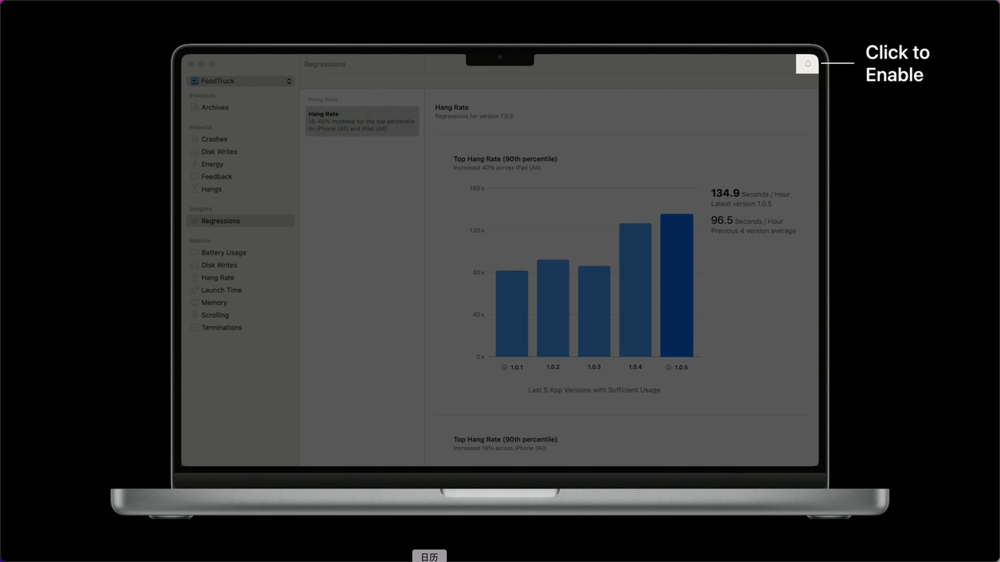

至此我们就今年 WWDC22 上 Apple 为开发者提供的线上/线下排查卡顿的工具做了相关介绍，对工具的使用上也有了简单的了解。但是笔者想要吐槽一点的是，Apple 针对线上卡顿问题的治理分析工具的更新来得太晚了。过去大家在解决线上用户反馈的卡顿问题时，苦于 Apple 官方没有提供相对统一成熟的工具进行排查定位，大多数公司和开发者不得不自研工具，经过多年的探索，业界也逐渐有了相对成熟完善的 WatchDog 方案，接下来我们就来简单展开讨论下。

### 业界 WatchDog 方案

目前业界大多数企业（如微信、字节、美团和得物等）的 APM 工具实现线上卡顿监控能力的思路都是采用监听 Runloop 回调的方式进行卡顿的捕获，这也是综合性能和准确性表现最好的一种方案。整体流程如下：

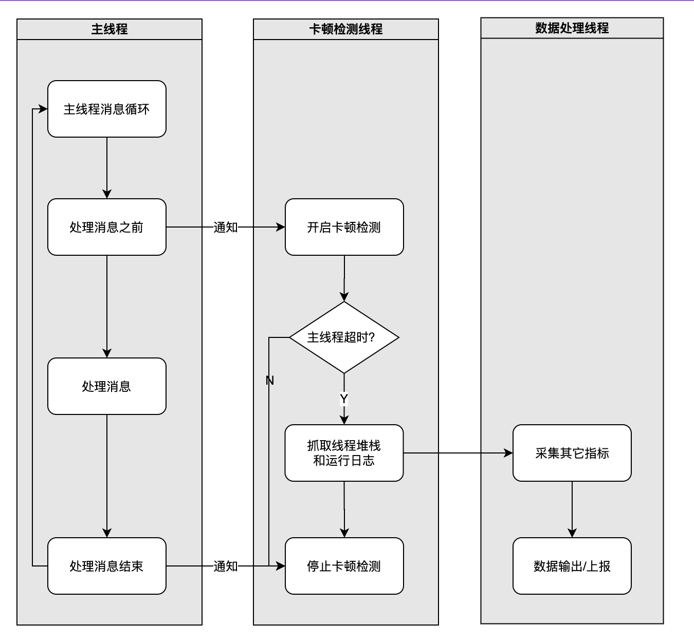

具体首先对主线程 Runloop 注册两个事件回调：一个为 begin 事件回调，用于启动检测；另一个为 end 事件回调，用于关闭检测。在 begin 事件回调被触发时，可以利用`signal`机制将其运行状态传递给另一个卡顿检测线程，卡顿检测线程等待主线程`signal`信号并可以设置等待的超时时间进行间隔采样，如果等待`signal`信号超时了，这说明主线程可能发生了阻塞。另外在 end 事件被触发时，通过`signal`通知卡顿检测线程关闭卡顿检测，进入休眠状态。通过卡顿检测线程，我们可以完整地了解主线程 Runloop 的运行状态，目前处于哪个阶段，耗时了多久等等。根据这些信息，我们就可以判断主线程是否发生了卡顿/卡死，并采取对应的策略进行异常捕获和上报。更多对方案的细节补充介绍可参考：

- [字节跳动 iOS Heimdallr 卡死卡顿监控方案与优化之路](https://juejin.cn/post/7055190328260689951)
- [iOS 稳定性问题治理:卡死崩溃监控原理及最佳实践](https://juejin.cn/post/6937091641656721438)
- [得物 iOS 卡顿监控实施与性能调优](https://mp.weixin.qq.com/s/Rs1lvFdQlXK6k9jkXHAhHQ)
- [微信 iOS 卡顿监控系统](https://mp.weixin.qq.com/s/M6r7NIk-s8Q-TOaHzXFNAw)
- [移动端性能监控方案 Hertz](https://tech.meituan.com/2016/12/19/hertz.html)

在了解了大致思路后，我们可以将方案用伪代码大致实现如下：

```C++
/***********以下为卡顿检测线程监听 runloop 事件回调的核心逻辑*************************************/
 - (void)addRunLoopObservers {
    CFRunLoopRef mainRunloop = CFRunLoopGetMain();
    // 注册 kCFRunLoopEntry|kCFRunLoopBeforeSources|kCFRunLoopAfterWaiting 事件
    CFRunLoopObserverRef runloopBeginObserver = CFRunLoopObserverCreate(kCFAllocatorDefault, kCFRunLoopEntry|kCFRunLoopBeforeSources|kCFRunLoopAfterWaiting, YES, LONG_MIN, runloopBeginCallback, NULL);
    CFRunLoopAddObserver(mainRunloop, runloopBeginObserver, kCFRunLoopCommonModes);
    // 注册 kCFRunLoopBeforeWaiting|kCFRunLoopExit 事件
    CFRunLoopObserverRef runloopEndObserver = CFRunLoopObserverCreate(kCFAllocatorDefault, kCFRunLoopBeforeWaiting|kCFRunLoopExit, YES, LONG_MAX, runloopEndCallback, NULL);;
    CFRunLoopAddObserver(mainRunloop, runloopEndObserver, kCFRunLoopCommonModes);
}

// begin事件回调
static void runloopBeginCallback(CFRunLoopObserverRef observer, CFRunLoopActivity activity, void *context) {
    // 通过 signal 通知检测线程从休眠中恢复运行，开启卡顿检测
}

// end事件回调
static void runloopEndCallback(CFRunLoopObserverRef observer, CFRunLoopActivity activity, void *context) {
    // 通过 signal 通知检测线程关闭卡顿检测并进入休眠状态
}

/***********以下为卡顿检测线程的核心逻辑*************************************/
- (void)startMonitor {
    dispatch_async(monitor_queue, ^{
        runMonitor();
    });
}

// 卡顿检测线程线程事件循环
- (void)runMonitor {
    while(true) {
        // 进入休眠，等待signal唤醒
        waitForSignalWithoutTimeout();
        
        // 卡顿检测逻辑
        while(isMainRunloopRunning()) {
            // 等待 signal 进入休眠，设定超时等待时间 50ms（时间可配置）进行隔采样，然后通过采样数据判断主线程 runloop 状态是否卡顿/卡死；
            if (!waitForSignalWithTimeout(timeout)) {
                // 信号超时
                waitDuration += timeout;
                if (waitDuration > hangThreadhold) {
                    hangDetected(); // 视情况上报堆栈信息帮助排查
                }
            }
        }
    }
}
```

## 如何解决卡顿

在分析和定位到了具体的卡顿原因之后，我们就可以着手解决问题了。面对大多日常开发中的常见问题我们可以有以下通用解决方案：

- 将 CPU 密集型工作迁移到子线程队列处理，降低主线程繁忙的概率；
- 避免主线程等待子线程的场景，尽量使用异步子线程处理任务，完成后通知回调到主线程的方式；
- 特别需要注意的是在主线程上访问一些原子变量或使用锁（例如 `pthread_rwlock_t`）访问数据时，可能会与其它子线程同时竞争锁，当其它子线程先获取到锁时，主线程就会因为等待而阻塞，所以尽量避免在主线程频繁的访问原子变量和锁，即使不可避免的要在主线程上使用锁，推荐优先使用能够提升线程优先级的锁（例如`pthread_mutex`和`os_unfair_lock`），能够避免发生[优先级反转问题](https://zhuanlan.zhihu.com/p/146132061)。
- 避免在主线程同步读取磁盘或网络数据，可通过在后台线程代替处理，待 IO 操作完成后再回调主线程；

另外，除了进行现有问题的排查和治理外。提升发现和定位线上问题的能力和效率同样重要，在实际开发过程中，我们应该尽早搭建性能防劣化体系，针对每个版本的卡顿进行统计分析，并对具体指标进行监控报警，这样当线上版本质量发生劣化时，我们就能在第一时间收到警报，及时跟进解决。

## 总结

本文以卡顿的治理为主线，首先介绍了卡顿背景，了解了什么是卡顿以及为什么要治理卡顿；其次我们对卡顿做了原理性分析并探讨了日常开发中导致卡顿的原因；然后结合今年 WWDC22 的内容讲述了如何利用线上/线下工具进行定位分析卡顿，并对业界 WatchDog 方案进行展开性讨论；最后探讨了日常开发中的卡顿问题该如何解决和避免，并强调了线上防劣化和监控体系搭建的重要性。整体上来说本文简单分享了一个常规化的卡顿治理思路。

## 参考资料

- [Understand and eliminate hangs from your app](https://developer.apple.com/videos/play/wwdc2021/10258)
- [Diagnose Power and Performance regressions in your app](https://developer.apple.com/videos/play/wwdc2021/10087)
- [Identify trends with the Power and Performance API](https://developer.apple.com/videos/play/wwdc2021/10087)
- [Improving app responsiveness](https://developer.apple.com/documentation/Xcode/improving-app-responsiveness)
- [iOS 保持界面流畅的技巧 | Garan no dou](https://blog.ibireme.com/2015/11/12/smooth_user_interfaces_for_ios/)
- [【WWDC21 10258】理解和消除 App 中的卡死](https://xiaozhuanlan.com/topic/9027453618)
- [字节跳动 iOS Heimdallr 卡死卡顿监控方案与优化之路](https://juejin.cn/post/7055190328260689951)
- [iOS 稳定性问题治理:卡死崩溃监控原理及最佳实践](https://juejin.cn/post/6937091641656721438)
- [得物 iOS 卡顿监控实施与性能调优](https://mp.weixin.qq.com/s/Rs1lvFdQlXK6k9jkXHAhHQ)
- [微信 iOS 卡顿监控系统](https://mp.weixin.qq.com/s/M6r7NIk-s8Q-TOaHzXFNAw)
- [移动端性能监控方案 Hertz](https://tech.meituan.com/2016/12/19/hertz.html)
