# WWDC22 10083 - Power down:  Improve battery consumption

本文基于[WWDC22 Session 10083]("https://developer.apple.com/videos/play/wwdc2022/10083")撰写，文章中补充的额外信息仅供大家参考。

> 作者：皮拉夫大王😈，就职于抖音基础技术团队，主要负责稳定性相关工作。
>
> 审核：吕孟霖，就职于字节跳动 TikTok iOS 团队，对 App 稳定性与性能感兴趣。

## 前言

前端时间收到部分用户反馈，在使用 APP 时出现了手机发烫的现象。这种问题一般来说比较难排查，因此在看到了 10083 这个 Session 后，我产生了极大的兴趣。在观看视频之前，我希望我能通过这个视频得到一些排查问题和优化电量的手段。

## WWDC22 的介绍的优化方式

WWDC22 中主要介绍了 4 种优化方式，分别是：使用暗黑模式、合理降低刷新率、限制后台任务时间、推迟非实时性任务。苹果介绍这几块内容都是在教我们如何去合理地编写代码，除了后台任务的监控外，并没有过多的介绍在出现电量问题的时候如何去排查相关问题 ，不过相关内容对我们排查问题和编写高质量代码有一定的指导意义。

### 暗黑模式

Apple 在 2019 年的 WWDC 中引入了暗黑模式，相信暗黑模式大家已经不再陌生。在了解暗黑模式对电量的优化之前，我们先来了解 iPhone 的 2 种材质的屏幕：OLED 和 LCD。在 iPhone X 系列以后的 iPhone 设备几乎都采用了 OLED 屏幕。相比于 LCD 屏幕，OLED 屏幕是像素自发光，越重的颜色需要的电量的供应越少，在像素点不表达的时候可以切断像素点的电量供应来渲染黑色。而 LCD 则是通过背光照明来表达颜色，即使是渲染黑色也是需要供电的。因此暗黑模式在 OLED 屏幕上有很大的节能优势，这也是为什么在 OLED 屏幕应用到 iPhone 设备上仅仅 1 年后苹果就积极推广暗黑模式。WWDC22 中介绍相比于暗黑模式相比于亮色模式，用于渲染的电量可以节省 70%。

那如何适配暗黑模式呢？

1. Xcode 提供了动态颜色和图片设置，系统会根据模式来动态的决定显示什么颜色和图片。

   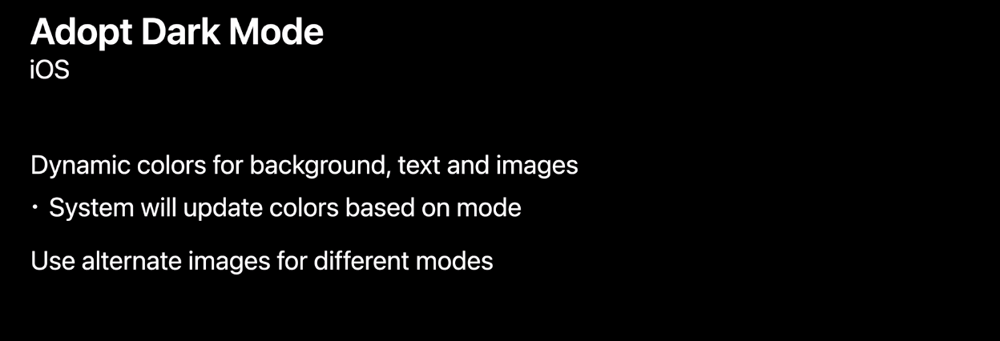

2. 由于 Safari 不会自动为 web 页面做暗黑渲染，所以 web 的暗黑模式也需要我们自己适配。通过`color-scheme`和`prefers-color-scheme`可以让 web 在不同的模式下选择渲染不同的颜色和图片。

   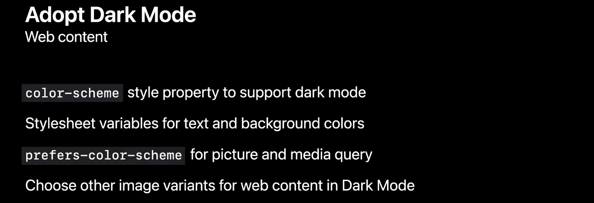

> 更多暗黑模式适配的相关内容可以参考 WWDC2019 的[Implementing Dark Mode on iOS](https://developer.apple.com/videos/play/wwdc2019/214)和[Supporting Dark Mode in Your Web Content](https://developer.apple.com/videos/play/wwdc2019/511)

## 合理设置刷新率

iPhone 13 Pro 和 iPhone 13 Pro Max 是最早尝试 ProMotion 的 iPhone 设备。iPhone 13 Pro 系列的设备支持 10Hz~120Hz 共 12 档刷新率切换。WWDC 中提到，刷新率越高消耗的电量也就越高，因此需要合理地设置刷新率。

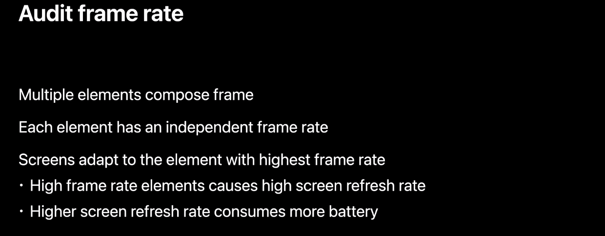

如果页面由多个元素组成，并且每个元素都有各自的刷新率，那么屏幕最终的刷新率会取自元素中设置的最高刷新率。这就会导致原本需要低刷新率的元素也被动升级到高刷，而高刷则意味着消耗更多的电量。WWDC22 中举了一个例子用来说明什么样的场景需要优化刷新率。

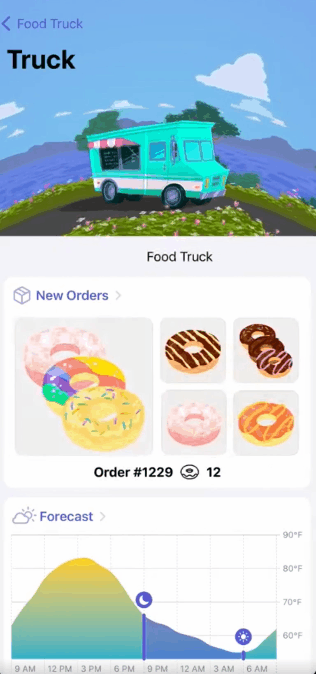

上面的视频中，卡车是以 30 帧每秒进行动画，下面的文字是以 60 帧每秒进行动画。因此整个页面会以 60 帧每秒进行刷新。但是假如我们将文字动画的刷新率调整为 30 帧每秒，那么整个屏幕的刷新率会优化为 30 帧每秒，一个简单的调整就可以使能耗下降 20%。

> 在这个例子中苹果突出强调了卡车动画是页面的主要元素，文本元素为次要元素，因此苹果建议考虑非主要元素进行降帧。如何定义主要元素和次要元素？页面设计师想突出表达的元素就是主要元素，其他为次要元素，是设计师决定的。

那如何获取 APP 的帧率信息呢？WWDC 推荐我们使用 instruments 的 Core Animation FPS 可以查看帧率的变化以及帧率是否符合预期，如果帧率不符合预期的话，那么我们需要进一步检查我们页面的次要元素的帧率是否高于主要元素的帧率。

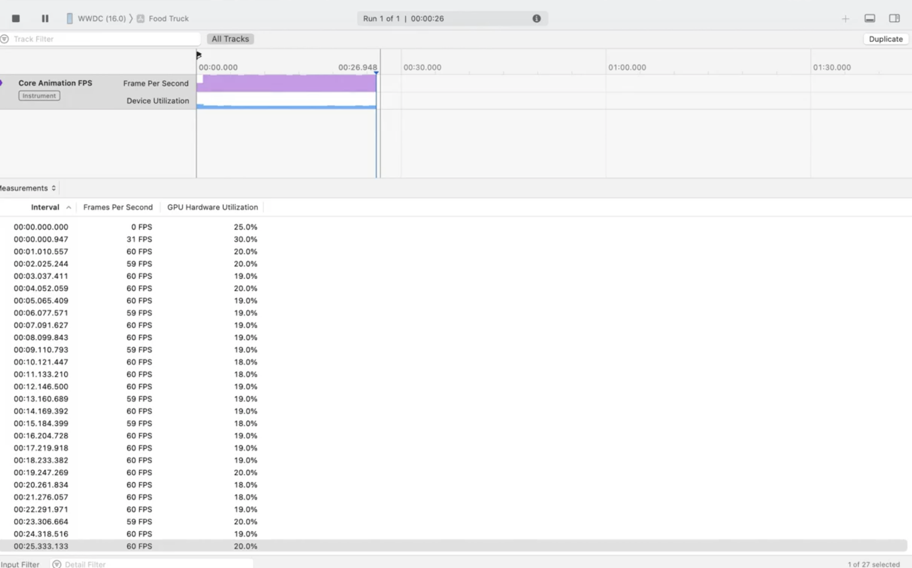

谈到刷新率就必然要牵扯到 CADisplayLink，CADisplayLink 是与显示器的刷新率同步的。CADisplayLink 在 iOS 支持高刷后有了新的变动，即我们可以告诉系统我们所期望的刷新率。

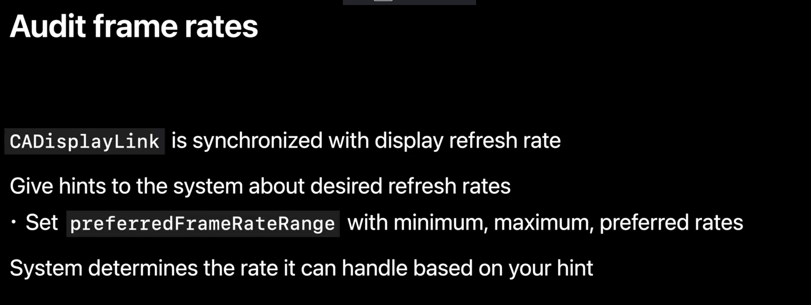

我们可以通过设置 preferredFrameRateRange 来告诉系统我们的帧率范围和偏好帧率，系统会尽可能达到我们的偏好帧率，如果无法满足偏好帧率，那么系统就会尝试将帧率保持在我们指定的帧率区间内。当然，preferredFrameRateRange 只是我们向系统提出的一个参考性建议，如果想取消相关设置那么可以将 preferredFramesPerSecond 设置为 0。

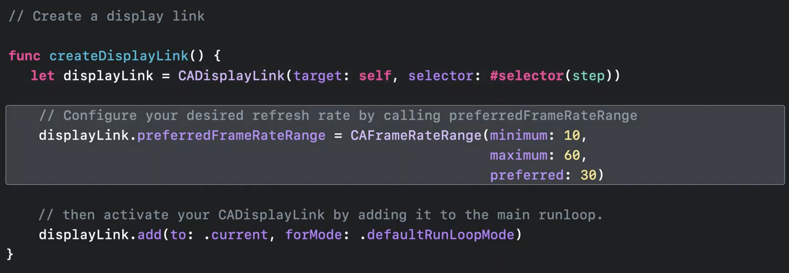

> 帧率优化的相关内容与之前的暗黑模式一样，都不是最新的内容。大家可以查看 WWDC2021 中的[Optimize for variable refresh rate displays](https://developer.apple.com/videos/play/wwdc2021/10147)来进一步了解相关内容。

## 合理使用后台任务

WWDC22 提醒我们，如果我们的 APP 处于非前台状态的时候，我们的 APP 可能会继续使用系统的通用服务，例如定位和音频等等。所以当我们使用这些功能的时候，需要格外留意下是否及时停用相关服务。

在这里苹果举了个定位功能的例子，当 APP 置于后台的时候，定位服务可能会一直在持续进行定位数据传输从而损耗电量。

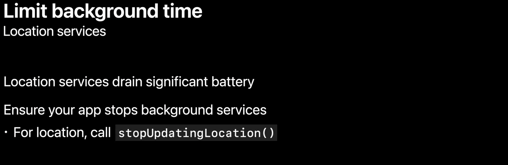

那如何进行后台任务检测呢？WWDC 介绍了 3 种方式，分别是：Xcode Gauges、 MetricKit、以及 iOS 16 新提出的 Control Center。

不知道是否有同学跟我一样，看到 Xcode Gauges 以为是什么新鲜的功能，其实就是我们每天调试时查看到仪表盘。

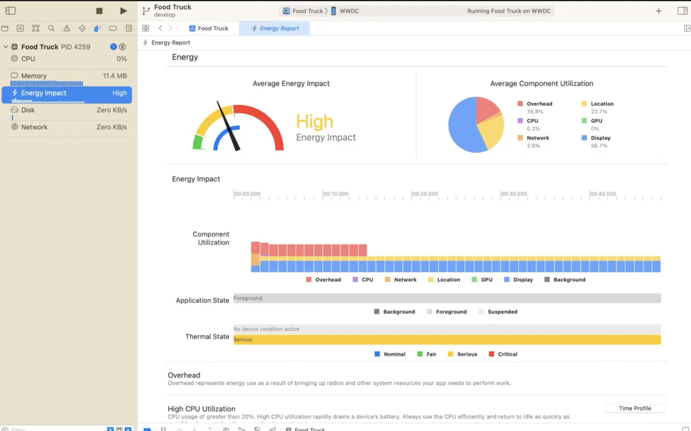

Xcode Gauges 主要是在开发阶段使用的，他能告诉我们当前的电量消耗情况以及电量消耗的来源，如：location、CPU、GPU、Display、Network。

在代码层面，我们可以在预发布与 Release 阶段通过 MetricKit 提供的 cumulativeBackgroundLocationTime 来获取定位服务时间。

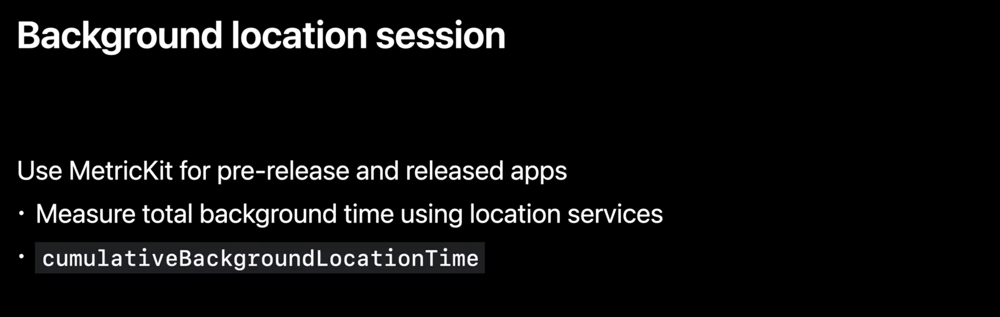

**【new】** iOS 16 中，系统提供了一个新的方式来提示用户当前有哪些 APP 正在使用后台定位服务。点击控制中心的顶部的文字部分，就可以看到所有正在使用后台定位的 APP 列表。因此我们也可以通过这种方式来检查我们的定位服务使用上是否符合预期。

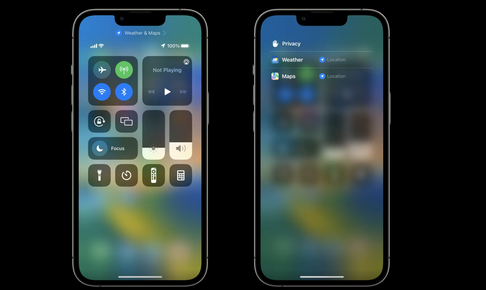

和定位服务一样，音频服务也需要在播放结束后停止音频服务，通过设置 AVAudioEngine 的 autoShutdownEnabled = True 来保证音频硬件在没有 APP 使用时停止工作。这个属性也不是新鲜事物，早在 iOS11 就已经存在了。在 iOS 上需要手动设置，watchOS 上则是强制开启的。

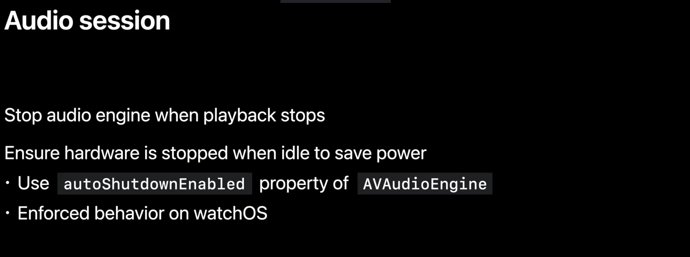

## 推迟非实时性任务

APP 中每天进行的任务非常多，例如音视频、视图渲染、机器学习等等，这些任务中很多任务都不是与用户实时交互相关的。

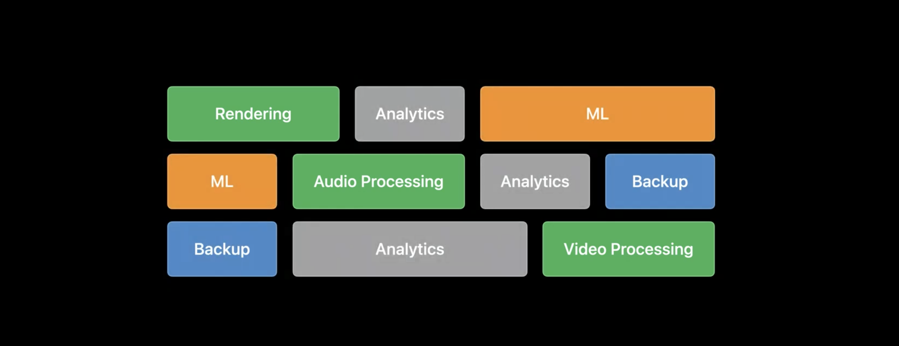WWDC 对这些任务做了划分，一类是以渲染和音视频为例的实时性任务，另一类是例如机器学习、数据上传与分析、备份等非实时性任务。

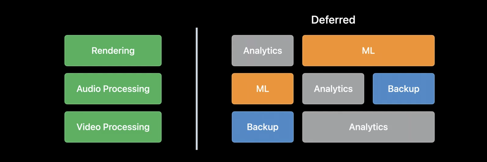

如果这类非实时任务能够在适当的时机执行，例如用户在进行手机充电的时候，那么就能避免电量的损耗并且能避免与实时性任务的冲突。

> 这里苹果是不是没有考虑到中国的实际情况呢？国人很多时候都是边玩手机边充电。

苹果提供了 3 种方式来拆分实时性任务和非实时性任务。分别是：

- BGProcessingTask

- Discretionary URLSession
- Push Priority

BGProcessingTask 是苹果在 iOS 13 推出的 API。iOS 13 之后苹果对 Background Tasks API 做了全新的梳理。详情可参考：[Background Tasks](https://developer.apple.com/documentation/backgroundtasks)

通过 BGProcessingTask 我们可以将能够在后台运行的非实时性任务交由系统在指定的时机完成。例如：在充电的时候进行数据库清理、数据备份、机器学习等等。那如何使用这个功能呢？系统提供了 2 个 API：

1. 通过传入 APP identifier 来发起后台任务。

   ```
   init(identifier: String)
   ```

2. 设置相关属性（如 requiresExternalPower、requiresNetworkConnectivity）来指定任务执行的条件。

   ```
   var requiresExternalPower: Bool { get set }
   var requiresNetworkConnectivity: Bool { get set }
   ```

通过设置 requiresExternalPower 和 requiresNetworkConnectivity 可以告诉系统 BGProcessingTask 的触发时机是否需要连接电源和是否需要网络连接。BGProcessingTask 真正的执行时机是与用户的行为有关联的，如果用户一直不使用我们的 APP，那么可能在很长的时间里 BGProcessingTask 都得不到执行。

另外，BGProcessingTask 理论上来说是可以在后台运行数分钟时间，但是它也有被系统中断的风险，这就意味着我们需要对 BGProcessingTask 设置 expirationHandler 进行任务过期处理。

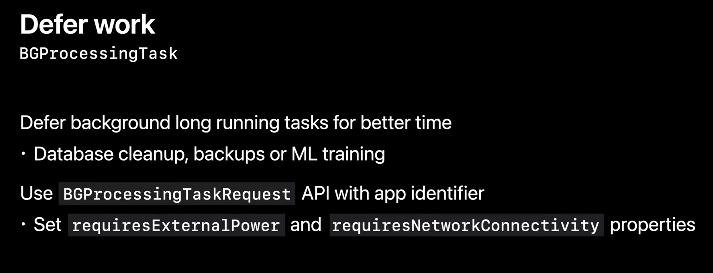

后台网络请求加上 discretionary 标记的话会更合理一些，因为系统会根据自身情况决定什么时候发起请求。

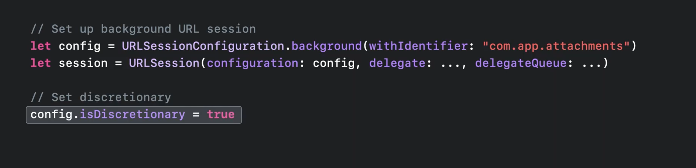

假设我们需要做一些比较耗时的网络数据传输，例如下载电视剧等等，那么 Discretionary URLSession 会在适当的时机，例如充电空闲时机或者连接上 wifi 的时候，自动进行请求，当然在数据传输过程中，APP 是不需要处于运行状态的。

> 这里可能有读者会存在困惑，为什么 APP 非运行状态还能发起网络请求，这其实是后台网络请求的特性之一。当网络请求完成后，系统会根据我们传入的 APP identifier 拉起对应的进程通知 APP。

推迟非实时性任务苹果给的第三个建议是为推送划分优先级。推送到达设备后会唤起设备屏幕，导致电量消耗，因此尽量避免非高优的事件进行实时推送。

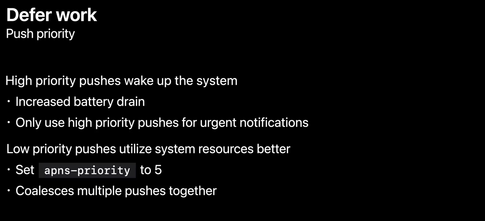

推送将分为高优先级和低优先级推送，高优先级将立即被推送到设备。低优先级的推送会等到合适的时机，例如：设备唤醒时或者有其他高优的推送请求时，推送服务才会被推送到设备。总之，低优先级的推送几乎不会独立唤醒设备也不具有实时性。

小结一下这个章节的内容，WWDC22 告诉我们 3 件事情：

- 耗时、耗性能的任务可以考虑通过 BGProcessingTask 推迟到充电时执行。
- 耗时、数据量较大的网络请求可以考虑通过 Discretionary URLSession 推迟到充电或者 wifi 时执行。
- 如果推送内容不是实时相关的，可以考虑低优先级的推送任务，这样推送就不会独立唤醒 APP 造成电量损耗。

## 其他可能造成耗电的场景（非 WWDC 内容）

以上是 WWDC22 中介绍的关于耗电量优化的 4 种方式。在我们日常工作中，能造成电量损耗的代码其实非常多。例如：

- 单个线程的 cpu 占用率过高或者线程数量过多。
- 高频地进行小数据 I/O 操作。
- 大量频繁地发起网络请求。

能引起耗电的问题远远不止这些，其他场景大家感兴趣的话可以搜索相关问题进行专项优化。

## 总结

本文主要基于 WWDC22 中 Session 10083 进行撰写，主要围绕 WWDC 提到的 4 种电量优化方式展开叙述，分别是：

- 使用暗黑模式可以节省 display 相关的电量。
- 合理设置刷新率可以节省一部分电量，我们需要 review 我们屏幕中的元素帧率设置是否合理。
- 合理地使用后台任务，苹果提出了使用 Xocde、metrickit、Control Center 来检查 APP 的后台任务是否符合预期。其中 Control Center 中查看后台任务 APP 是 iOS 16 新增的功能。
- 将推送任务按优先级加以区分，非紧急的事件使用低优先级推送。
