# Session 10089 - What's new in PDFKit

> 摘要：本文基于 WWDC17  Introducing PDFKit on iOS 以及 WWDC22 What's new in PDFKit 两个 Session 的内容梳理，先后介绍了 PDF 的简介、苹果在 PDF 处理中的发展历史、PDFKit 的基本内容以及 PDFKit 最新的特性。
>
>作者：Jimmy（曹鉴津），iOS 开发者，就职于金山办公，目前参与 WPS Office iOS 端的业务开发。
>
>编辑：士土 Edmond 木, 对 CocoaPods 有一点了解，目前对 Bazel 和 Swift 比较感兴趣。[Github Page](https://looseyi.github.io)

- 文章大纲如下图所示：

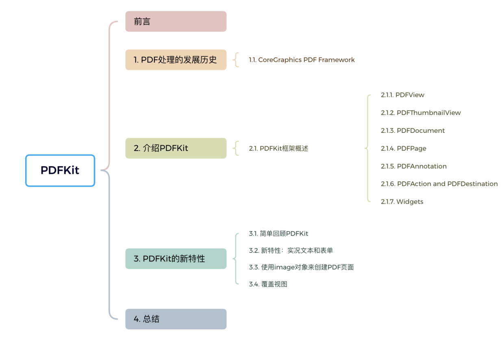

>阅读建议：
>
>- 如果是小白，建议从头开始看。
>- 如果已经非常熟悉 PDFKit 框架，建议直接查看"PDFKit 的新特性"章节。
>
>相关 Session：
>
>[WWDC2017 - Introducing PDFKit on iOS](https://www.bilibili.com/video/BV1SQ4y1f741?spm_id_from=333.1007.top_right_bar_window_history.content.click&vd_source=1ffa2efbb3d86bce7d7cd27f2c9b9bac) //由于笔者在写这篇文章时，在苹果开发者网站搜索该[session](https://developer.apple.com/videos/wwdc2017/)发现已经下架了，因此无法提供官方链接，但是在网上搜到了有人把这个视频给搬下来了，仅供参考。
>
>[WWDC2022 - What's new in PDFKit](https://developer.apple.com/videos/play/wwdc2022/10089/)
>
>[WWDC2022 - Add Live Text interaction to your app](https://developer.apple.com/videos/play/wwdc2022/10026/)

## 前言

**什么是 PDF?**

PDF 全称叫`Portable Document Format`，可移植的文档格式。

**我们为什么要使用 PDF？**

PDF 有以下优势：

- 在政府、医疗、金融和商业中具有普遍的应用价值
- 具有权限模型的强加密
- 用户可以与小部件以及注释进行交互。
- 打印出来的效果跟你看到的 PDF 是一样的。

PDF 不只是一个静态文档，它最强大的地方在于可以与用户产生交互。

## 1. PDF 处理的发展历史

我们先来回顾一下在 iOS 中，苹果提供的处理 PDF 的框架的迭代更新。

### 1.1. CoreGraphics PDF Framework

苹果在很早之前就为我们提供了一个较低层次的解决方案，那就是`CoreGraphics PDF Framework`，它提供了可以生成、显示以及修改 PDF 的 API。

以下代码使用`CoreGraphics PDF Framework`实现了读取一个 PDF 文档的第一页并绘制到视图上。

```
class CoreGraphicPDFView: UIView {
    override func draw(_ rect: CGRect) {
        guard let url = Bundle.main.url(forResource: "WWDC_-_Developer_s_Living", withExtension: "pdf") as CFURL?,
            let document = CGPDFDocument.init(url),
            let context = UIGraphicsGetCurrentContext(),
            let page = document.page(at: 1) else {
            return
        }
        //由于Quartz坐标系和UIView坐标系不一样，所以需要调整坐标系，使pdf正立
        context.translateBy(x: 0.0, y: self.bounds.size.height)
        context.scaleBy(x: 1.0, y: -1.0)
        //创建一个仿射变换，该变换基于将PDF页的BOX映射到指定的矩形中。
        let transfrom = page.getDrawingTransform(.cropBox, rect: self.bounds, rotate: 0, preserveAspectRatio: true)
        context.concatenate(transfrom)
        context.drawPDFPage(page)
    }
}
```

效果如下：
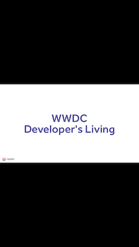

关于 Core Graphic 处理 PDF 的更多细节可以参考苹果官方文档（<https://developer.apple.com/documentation/coregraphics/cgpdfdocument/>）。

`CoreGraphics PDF Framework` 这个框架有以下特点：

1、与 PDF 图形相同的绘图模型。

2、具备读写功能。

3、C 语言函数。

但是它也有一些局限：

1、没有适用于 AppKit 的原生类型。

2、不支持文档交互，比如不能与文档进行任何的实时互动，也不能突出显示搜索结果等。

3、不支持辅助功能。

因此，`PDFKit`来了。

## 2. 介绍 PDFKit (introducing PDFKit in iOS)

WWDC17，苹果正式推出更加强大的 PDF 处理框架`PDFKit`。
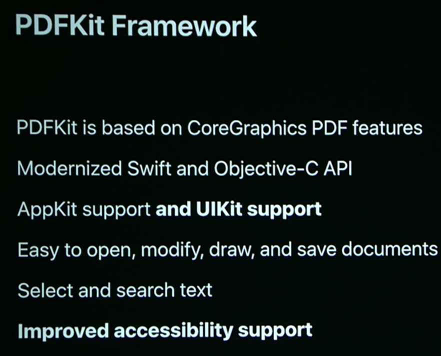

- `PDFKit`在原有的`CoreGraphics PDF`框架的基础上，新增了更加现代化的`Swift`和`Objective-C`的`API`。
- 同时支持 AppKit 和 UIKit。
- 更加容易去打开、修改、绘制以及保存文档的内容选择并搜索文本。
- 改进了对 PDF 可访问性的支持。

### 2.1. PDFKit 框架概述

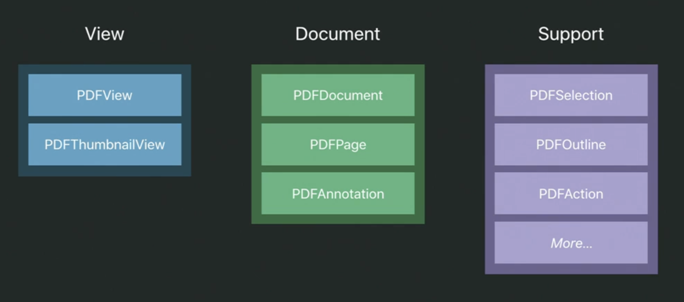
`PDFKit`中所有的类都可以归为`View`、`Document`、`Support`这三种类型中的一种。

- `View`层

`PDFView`：是`PDFKit`中的主要视图，主要用于显示以及管理 PDF 文档的内容。

`PDFThumbnailView`：是一个包含 PDF 页面缩略图集合的自定义视图，用户可以通过滚动或者手势交互来控制`PDFView`视图中的页面变化，相当于页面的索引。

- `Document`层

`PDFDocument`：代表一个 PDF 文件，它是所有`PDFPage`的容器。它不仅为你提供了加载、修改和保存一组 PDF 页面的能力，而且还有解锁、搜索以及与文档结构交互的能力。

`PDFPage`：代表`PDFDocument`中的某一页。

`PDFAnnotation`：是 PDF 文档中所有标注类型的包装类。它是一个直接映射到 PDF 文件格式的键值对的容器，在 Adobe PDF 规范（1.7）中，你可以通过制定键值对来实现注释的属性。

- `Support`层

`PDFSelection`：代表一段被选择的内容的范围。我们可以提取该范围的字符串文本，也可以对该范围的字符串文本进行装饰。

`PDFOutline`：代表大纲层次结构中的节点。

`PDFAction`：是一个抽象类，用于表示用户可以触发的事件与所属注释的交互，这些事件可以是 PDFActionGoTo、PDFActionNamed、PDFActionRemoveGoTo、PDFActionResetForm、PDFActionURL 等，通常这些事件主要用于移动 PDF 视图的视口、打开网页浏览器、清除表单等。

之后会详细讲解这些类的特性和使用方式。

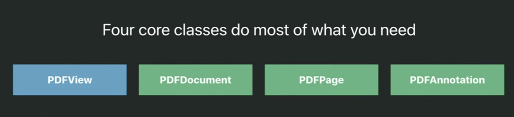
`PDFView`、`PDFDocument`、`PDFPage`、`PDFAnnotation`这四个类可以完成大部分 PDF 功能。

#### 2.1.1. PDFView

我们来看一个使用 PDFView 来显示 PDF 的例子

```
import Cocoa
import Quartz.PDFKit

class ViewController: NSViewController {

    override func viewDidLoad() {
        super.viewDidLoad()

        // Create PDFView, and it to controller's view
        let pdfView = PDFView(frame: self.view.bounds)
        
        // Center document on gray background
        pdfView.autoresizingMask = [.width, .height]
        self.view.addSubview(pdfView)
        
        // Enable drag & drop of PDF files
        pdfView.acceptsDraggedFiles = true
    }
}
```

以上代码创建了一个 PDFView，设置了文档居中，并且背景颜色是灰色的；最特别的是，只要设置了`pdfView.acceptsDraggedFiles = true`后，我们就可以通过手动拖动 pdf 文件到视图范围内就可以加载文档了。

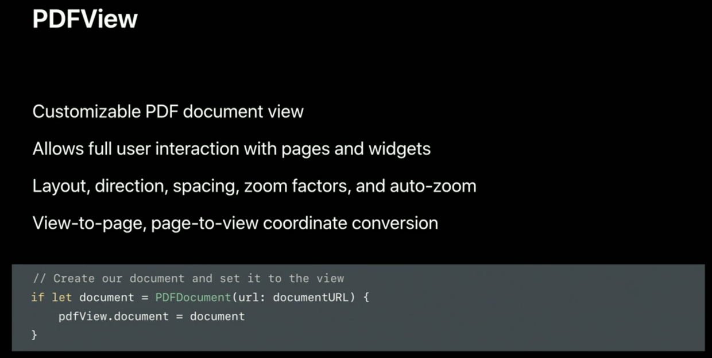

 PDFView 有以下特点：

- 可定制的 PDF 文档视图
- 允许与页面和小部件进行完整的用户交互
- 可以定义很多属性，比如布局、方向、间距、缩放因子和自动缩放，通过调整这些属性的值来达到查看内容的最佳位置
- 视图到页面、页面到视图的坐标转换
- 当我们用手指触碰 pdf 的内容时，我们可以知道触碰的是文件中的哪一页。
- 直接把一个带有 URL 的 PDFDocument 赋值给 PDFView 的 document 属性，无论是什么文档，都会以 PDF 格式显示
- ...

下面介绍两个 PDFView 中的枚举类型，PDFDisplayMode 和 PDFDisplayDirection：

- PDFDisplayMode 代表页面显示的模式

```
public enum PDFDisplayMode : Int {
    case singlePage = 0
    case singlePageContinuous = 1
    case twoUp = 2
    case twoUpContinuous = 3
}
```

效果如下
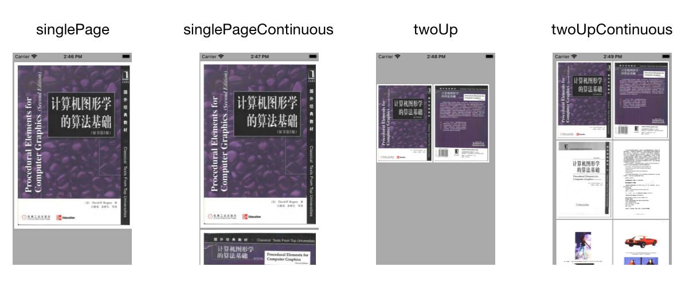

- PDFDisplayDirection 代表页面显示的方向

```
public enum PDFDisplayDirection : Int {
    case vertical = 0
    case horizontal = 1
}
```

效果如下
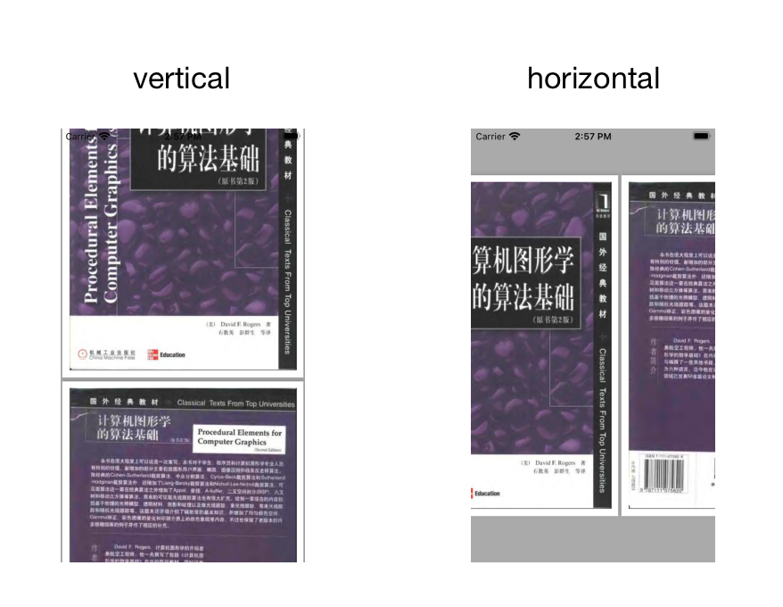

#### 2.1.2. PDFThumbnailView

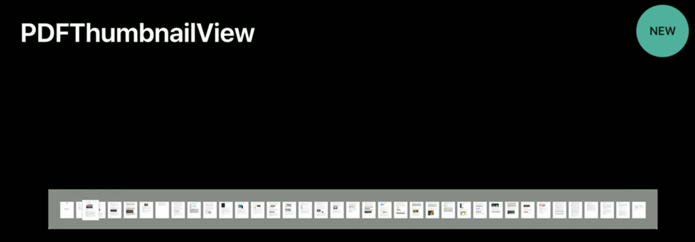
当我们在界面上加入了 PDFThumbnailView，并且关联到 PDFView，我们就可以控制当前页面的位置。
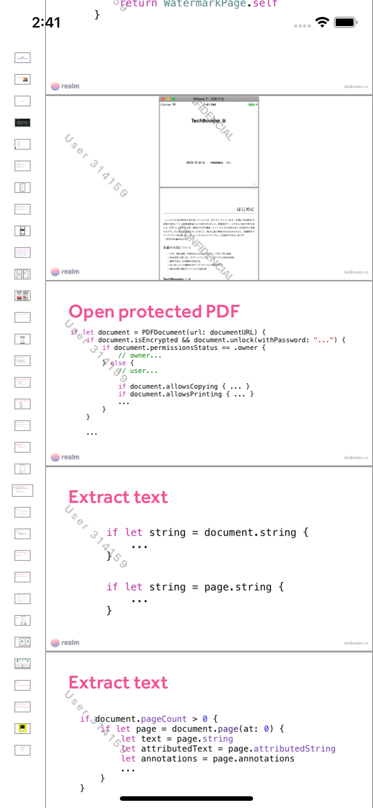

如图所示，PDFThumbnailView 可以横向显示也可以纵向显示，当我们触碰到某一页的缩略图时，PDFView 就会跳转到对应的页面。

**Document, Page, and Annotations Model**

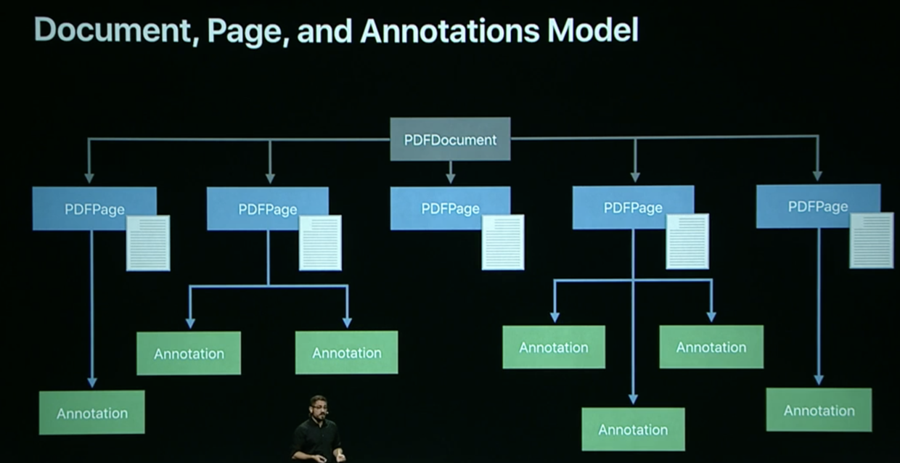
接下来让我们来谈谈 Document、Page、Annotations Model 之间的关系。

关系很简单，PDFDocument 包含了一系列的 PDFPage，每个 PDFPage 又包含着一系列的 PDFAnnotation。也就是说，一个 PDF 文档里包含着很多页面，而每一个页面都包含很多标注。

#### 2.1.3. PDFDocument

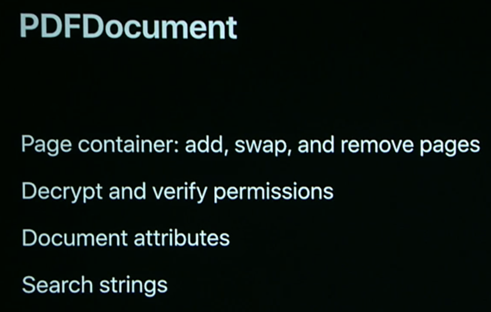
PDFDocument 是一个页面容器，它具备以下能力：

- 添加、交换和删除页面
- 解密和验证权限
- 设置文档属性
- 搜索字符串

关于 PDFDocument 的使用请看以下代码例子

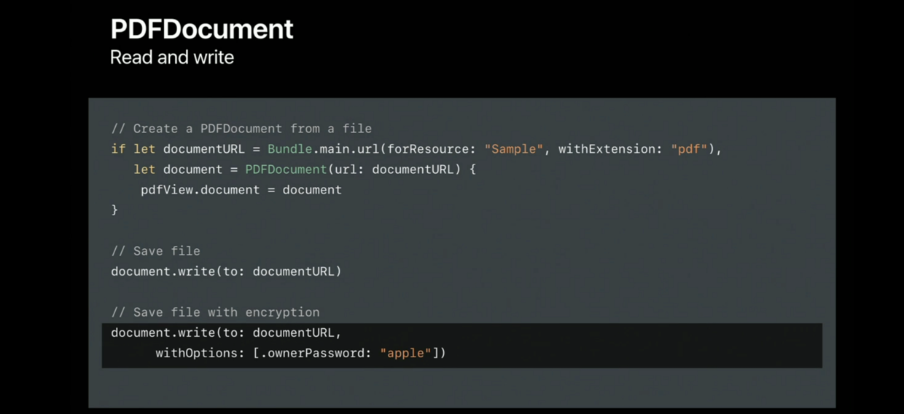
以上代码展示了 PDFDocument 对象的读写操作，使用-`writeToURL:withOptions:`还可以指定键为`.ownerPasswordOption`和值为密码的可选项为文档加密。

一般来说，我们打开一个 PDF 文档，并不是简单的直接打开，而且会检查是否加密、各种权限控制等，那么如何处理加密的情况？苹果建议我们这样去做：

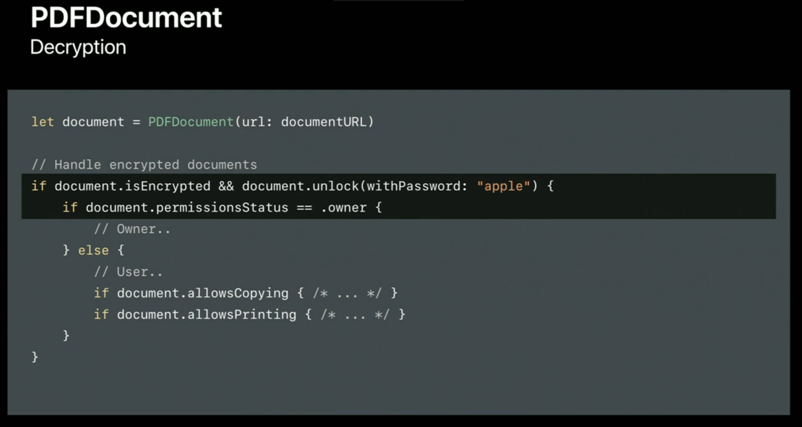

- 首先通过 isEncrypted 判断是否加密。
- 尝试使用 unlock(withPassword: "") 传入密码去解密。
- 如果解密成功，就再次判断 document 的权限。

```
public enum PDFDocumentPermissions : Int {
    case none = 0         //没有文档权限
    case user = 1         //用户文档权限
    case owner = 2        //所有者权限
}
```

当处于 owner 状态时，代表拥有所有者权限，那么就可以任意操作文档了，否则就要逐个权限去进行判断（比如是否允许复制，是否允许打印等）。

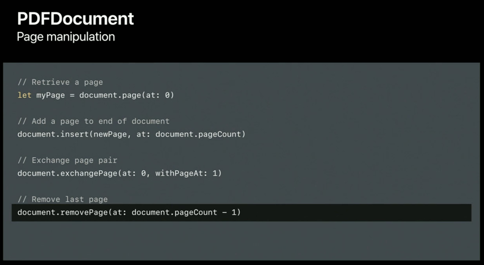
PDFDocument 还提供了几个操作 PDFPage 的方法，包括插入页面、交换页面和删除页面。其中插入页面时需要注意该 PDFPage 对象是否来自于其他的 PDFDocument 对象，如果是的话，那么最好做一次 copy（拷贝）操作再插入，这是因为如果两个 PDFDocument 对象同时持有同一个 PDFPage 对象，只要该 PDFPage 对象发生改动（比如把属性 rotation 设置为 90 度），那么两个 PDFDocument 对象的对应 PDFPage 都会发生变化。

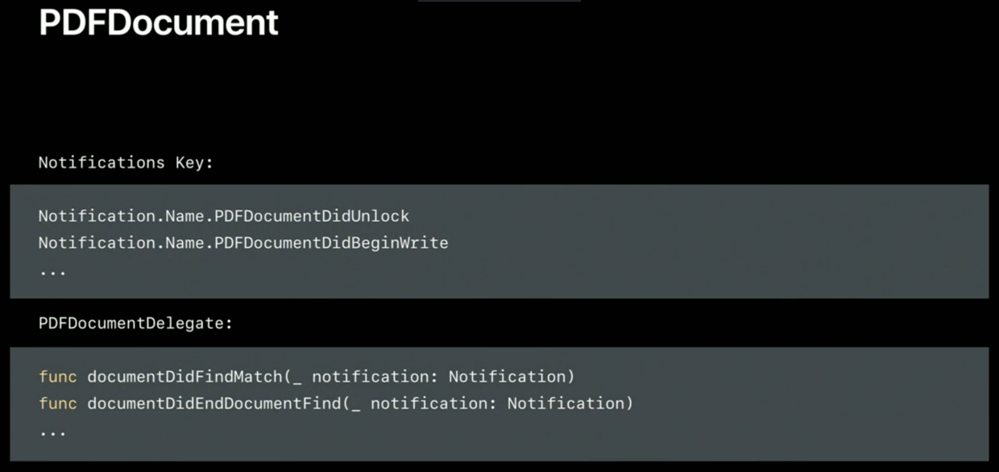

PDFDocument 还提供了一系列的事件通知（如文档解锁、文档开始写入数据等）以及代理回调（如字符串查找匹配成功，结束字符串查找等）。

PDFDocument 的介绍就到这里了，更多细节请参考苹果 API 文档（<https://developer.apple.com/documentation/pdfkit/pdfdocument>）。

#### 2.1.4. PDFPage

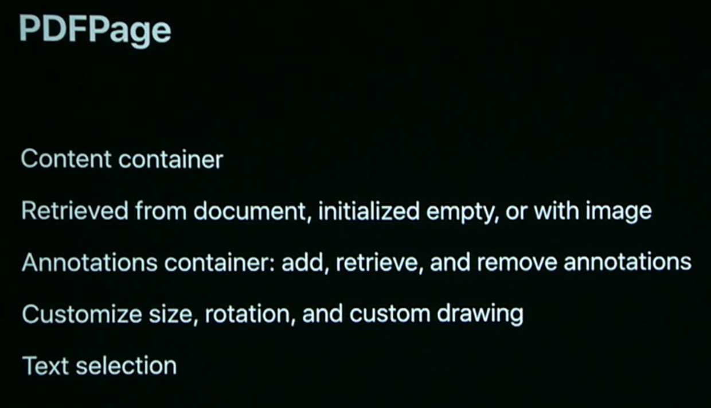

接下来我们来聊聊 PDFPage，PDFPage 有以下特点：

- 它是一个装载文档内容的容器，
- 它作为一个页面可以从文档中提取出来。
- 默认有两个初始化方法，`init()`（空白页面），`init?(image: UIImage)` (图片页面)。
- 它同时也是装载标注的容器，具有添加、检索、删除注释的功能。
- 可以自定义页面大小、旋转角度以及自定义绘制等。
- 支持选择文本。

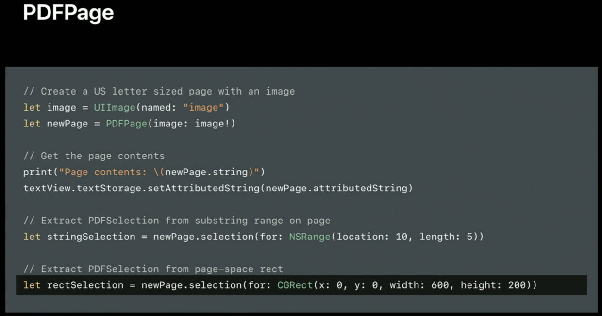

以上示例通过加载图片`PDFPage(image:)`的方式生成一个 PDFPage 对象。

- 使用`string`属性可以得到页面上的普通文本字符串。
- 使用`attributedStrinng`可以得到富文本字符串。
- 传入一个`NSRange`范围可以得到该范围内的字符串文本选区对象。
- 传入一个`CGRect`区域可以得到该区域内的页面内容选区对象。

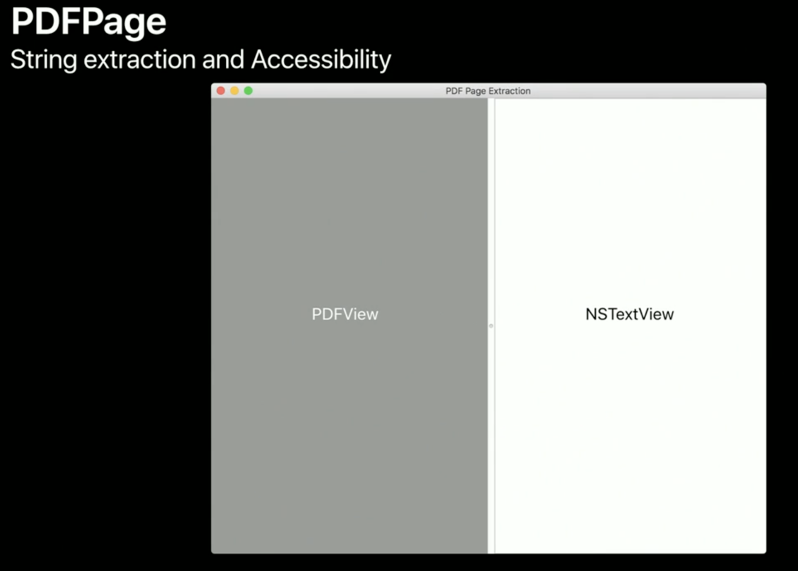

我们做一个测试，建立一个视图装载两个子 View，左边是 PDFView，右边是 NSTextView。

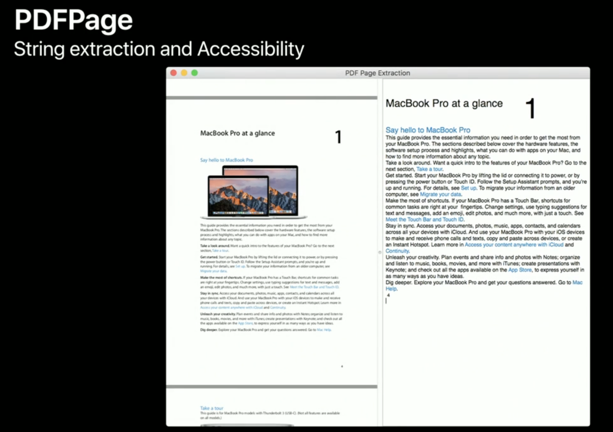

我们让 PDFView 加载一个 PDF 文件，然后使用提取页面富文本字符串功能，把提取结果赋值给右边的 NSTextView，效果显示，富文本的所有属性样式跟原文档完美一致。

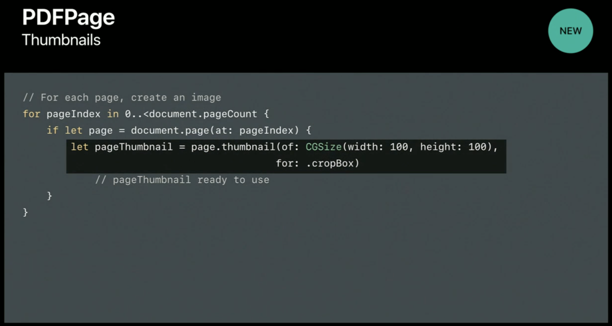

获取指定页面的缩略图可以使用：

```
func thumbnail(of size: CGSize, for box: PDFDisplayBox) -> UIImage
```

这里有两个参数 size 和 box，size 表示要生成缩略图的大小，box 是一个 PDFDisplayBox 枚举类型，如下图

```
public enum PDFDisplayBox : Int {
    case mediaBox = 0   //定义用于显示或打印的物理介质边界的矩形，以默认用户空间单位表示。
    case cropBox = 1    //定义可见区域边界的矩形，以默认用户空间单位表示。默认值等于kPDFDisplayBoxMediaBox。
    case bleedBox = 2   //定义生产环境中页面内容的剪辑区域边界的矩形。默认值等于kPDFDisplayBoxCropBox。
    case trimBox = 3    //定义完成页面的预期边界的矩形。默认值等于kPDFDisplayBoxCropBox。
    case artBox = 4     //定义页面有意义内容边界的矩形，包括用于显示的周围空白。默认值等于kPDFDisplayBoxCropBox。
}
```

下图展示了使用 mediaBox 和 cropBox 的效果：
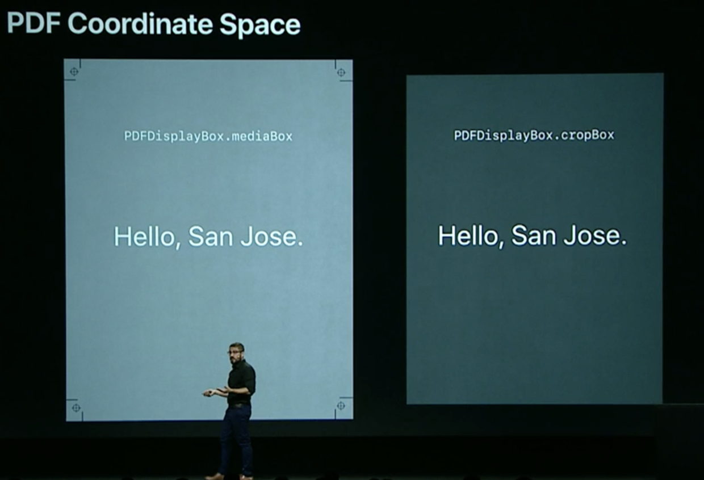

**PDFPage 自定义绘制**

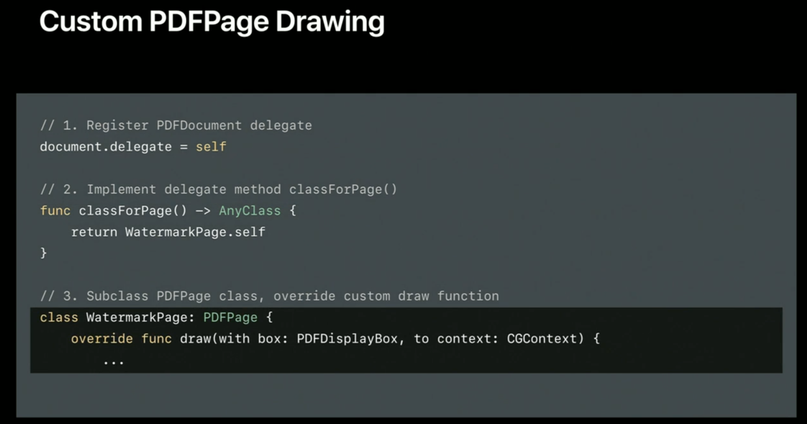
我们经常会往 PDF 中添加水印，那么在 PDFPage 中我们是如何实现的呢？

1、成为 PDFDocument 的代理。

```
document.delegate = self
```

2、实现代理方法`classForPage`。

```
func classForPage() -> AnyClass {
    return WatermarkPage.self
}
```

并返回一个自定义类型（这里是 WatermarkPage）。

3、在 WatermarkPage 中重写`draw(with box: PDFDisplayBox, to context: CGContext)`方法。

```
override func draw(with box: PDFDisplayBox, to context: CGContext) {
    super.draw(with: box, to: context)
        
    // Draw rotated overlay string
    UIGraphicsPushContext(context)
    context.saveGState()
        
    let pageBoundns = self.bounds(for: box)
    context.translateBy(x: 0.0, y: pageBoundns.size.height)
    context.scaleBy(x: 1.0, y: -1.0)
    context.rotate(by: CGFloat.pi / 4.0)
        
    let string: NSString = "U s e r   3 1 4 1 5 9"
    let attributes = [
        NSAttributedString.Key.foregroundColor: UIColor(red: 0.5, green: 0.5, blue: 0.5, alpha: 0.5),
        NSAttributedString.Key.font: UIFont.boldSystemFont(ofSize: 64)
    ]
        
    string.draw(at: CGPoint(x: 250, y: 40), withAttributes: attributes)
    context.restoreGState()
    UIGraphicsPopContext()
}
```

在这个方法里就可以使用 context 来进行各种自定义绘制了。

以上代码为每一个 PDFPage 加上一层水印，效果如下：
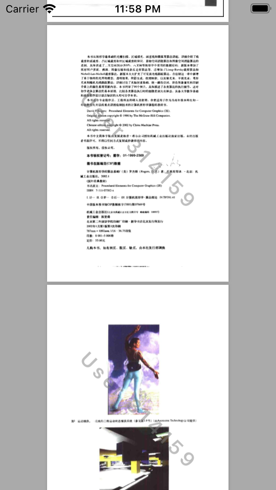

#### 2.1.5. PDFAnnotation

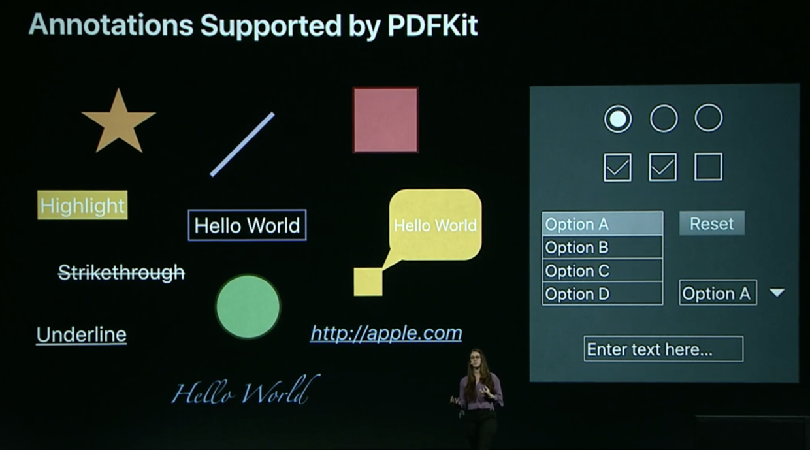

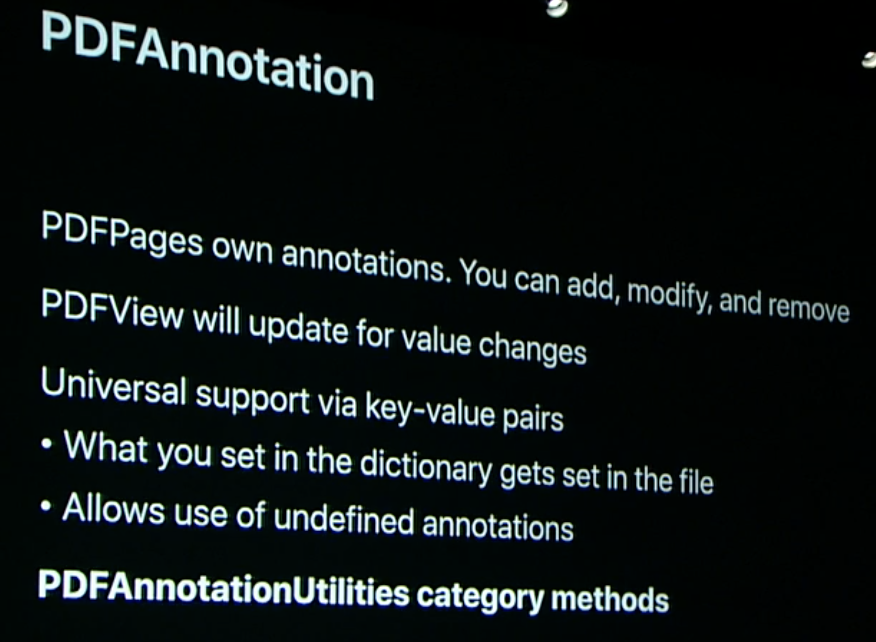
PDFPages 可以拥有很多标注。你可以添加、修改和移动 PDFView 去更新值。

通过键值对实现全面支持。

- 您在字典中设置的内容将在文件中设置。
- 允许使用未定义的标注。

PDFAnnotation 还有一个分类是 PDFAnnotationUtilities，让我们能够更容易地设置和获取我们支持的属性。

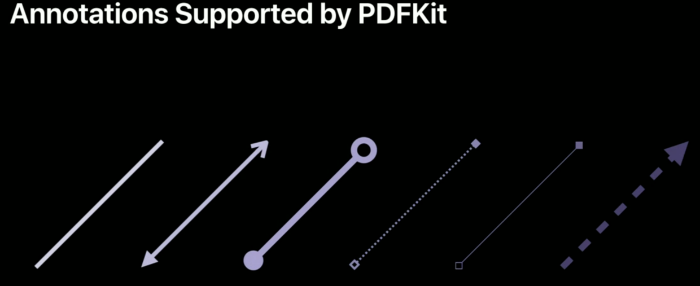
比如，我们可以用六种不同的线条样式来生成一个标注。

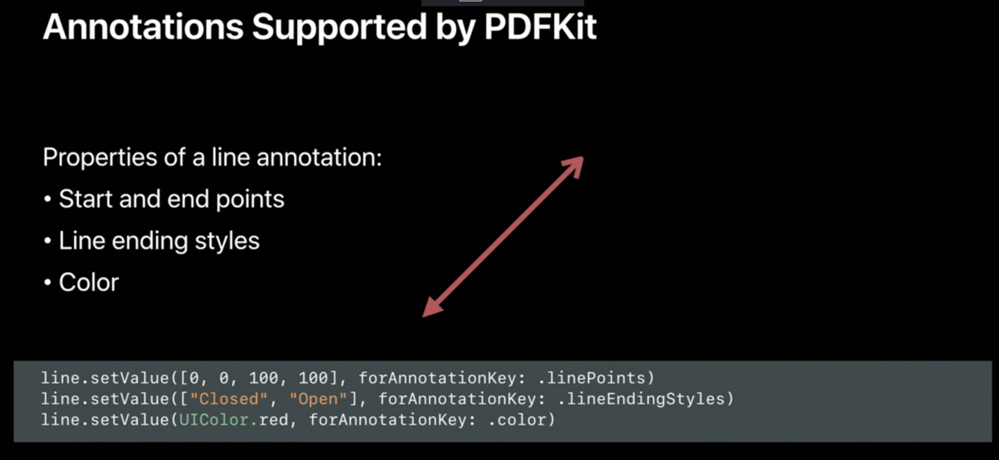
拿第二种样式举例子，我们可以通过键值对的方式去设置起点和终点坐标、线条的结尾样式、线条显色，但这种方式使用起来比较麻烦，我们使用 PDFAnnotationUtilities 来完成这一切看看：

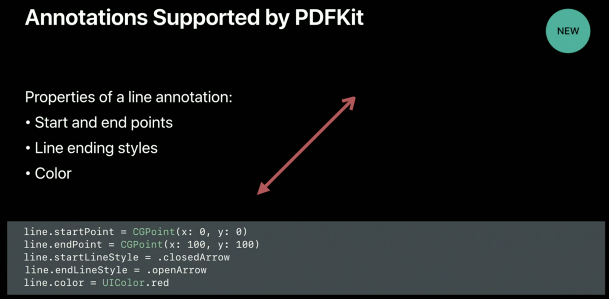
可以看到通过 PDFAnnotationUtilities 可以直接使用属性赋值。
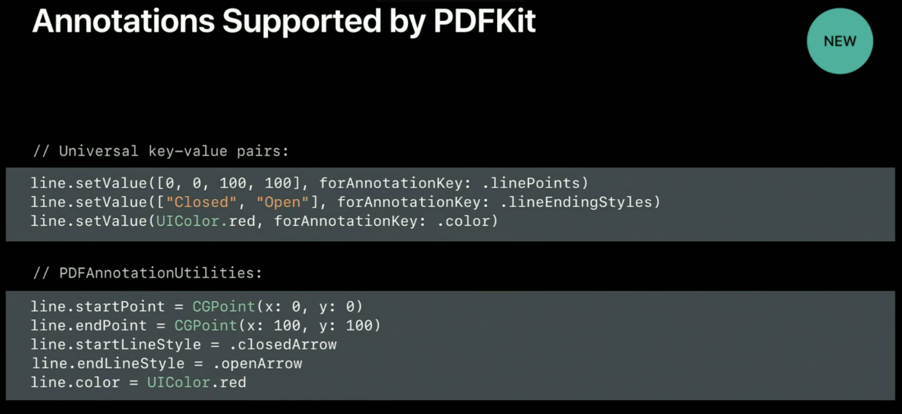

我们来对比一下这两种方式，比如设置起点和终点坐标。

键值对：

```
line.setValue([0, 0, 100, 100], forAnnotationKey: .linePoints)
```

PDFAnnotationUtilities：

```
line.startPoint = CGPoint(x:0, y:0)
line.endPoint = CGPoint(x:100, y:100)
```

很明显通过 PDFAnnotationUtilities 的方式更加清晰和易用。

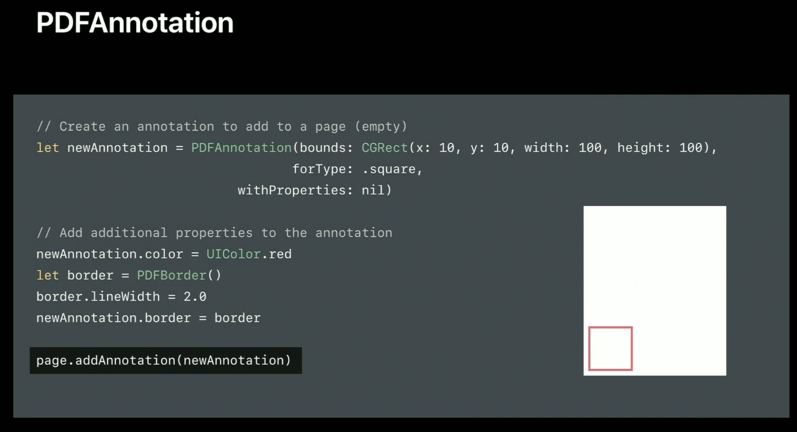
PDFAnnotation 的创建方式也非常简单，传入坐标、标注类型、属性字典即可：

```
let newAnnotationn = PDFAnnotation(bounds: CGRect(x: 10, y: 10, width: 100, height: 100), forType: .square, withProperties: nil)
```

type 是 PDFAnnotationSubtype 结构体，它有非常多种类型：

```
public struct PDFAnnotationSubtype : Hashable, Equatable, RawRepresentable {

    public init(rawValue: String)
}

extension PDFAnnotationSubtype {
    @available(iOS 11.0, *)
    public static let text: PDFAnnotationSubtype

    @available(iOS 11.0, *)
    public static let link: PDFAnnotationSubtype

    @available(iOS 11.0, *)
    public static let freeText: PDFAnnotationSubtype

    @available(iOS 11.0, *)
    public static let line: PDFAnnotationSubtype

    @available(iOS 11.0, *)
    public static let square: PDFAnnotationSubtype

    @available(iOS 11.0, *)
    public static let circle: PDFAnnotationSubtype

    @available(iOS 11.0, *)
    public static let highlight: PDFAnnotationSubtype

    @available(iOS 11.0, *)
    public static let underline: PDFAnnotationSubtype

    @available(iOS 11.0, *)
    public static let strikeOut: PDFAnnotationSubtype

    @available(iOS 11.0, *)
    public static let ink: PDFAnnotationSubtype

    @available(iOS 11.0, *)
    public static let stamp: PDFAnnotationSubtype

    @available(iOS 11.0, *)
    public static let popup: PDFAnnotationSubtype

    @available(iOS 11.0, *)
    public static let widget: PDFAnnotationSubtype
}
```

我们使用 line 类型看看效果如何：

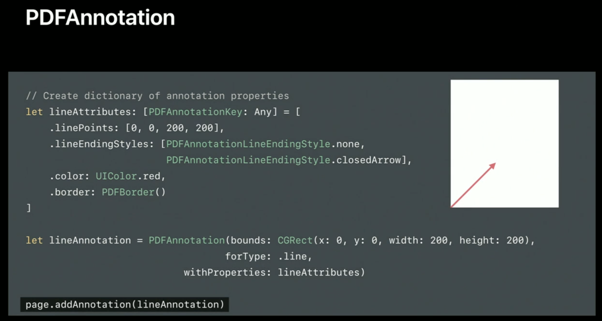
以上右上角的标注效果展示了两种不同的实现方式，键值对和 PDFAnnotation。

#### 2.1.6. PDFAction and PDFDestination

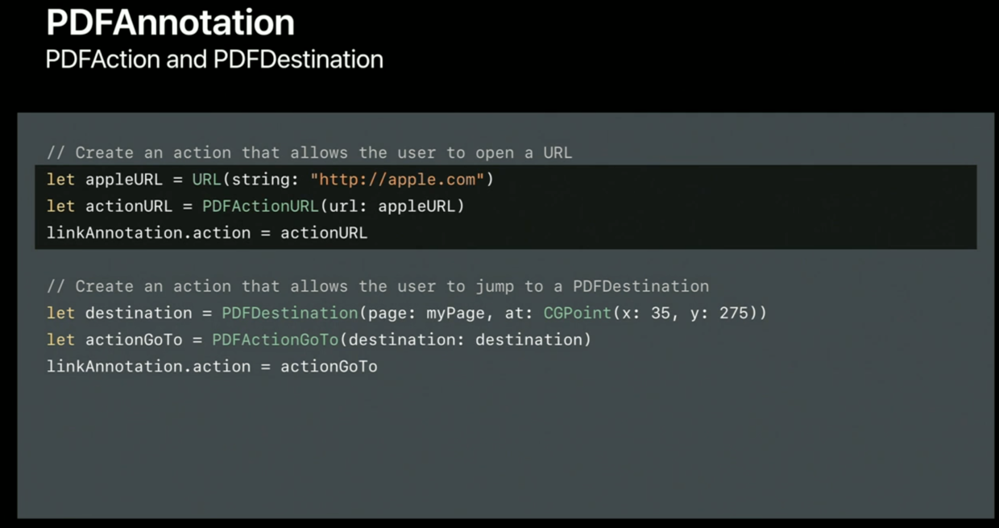
当 PDFAnnotation 为 link 类型时，可以设置 action 属性，用户通过触摸或者点击 PDFAnnotation 就响应事件，响应事件的类型是 PDFAction 的各种子类：

PDFActionGoTo：用于跳转 PDF 中的某个页面的具体位置，与 PDFDestination 搭配。

```
func createActionGoTo(page: PDFPage, point: CGPoint) -> PDFAction {
    let destination = PDFDestination(page: page, at: point)
    let actionGoTo = PDFActionGoTo(destination: destination)
    return actionGoTo
}
```

PDFActionNamed & PDFActionNamedName：定义用于处理 PDF 文档中的操作的方法。

```
public enum PDFActionNamedName : Int {
    case none = 0                        //无操作
    case nextPage = 1                    //跳转到下一页
    case previousPage = 2                //跳转到上一页
    case firstPage = 3                   //跳转到第一页
    case lastPage = 4                    //跳转到最后一页
    case goBack = 5                      //undo      
    case goForward = 6                   //redo
    case goToPage = 7                    //跳转到指定的页面
    case find = 8                        //查找
    case print = 9                       //打印
    case zoomIn = 10                     //放大
    case zoomOut = 11                    //缩小
}

func createActionNamed() -> PDFAction {
    let actionNamed = PDFActionNamed(name: .nextPage)
    return actionNamed
}
```

PDFActionRemoteGoTo：定义了获取和设置针对另一个文档的 go-to 操作的目的地的方法。

```
func createActionRemoteGoTo(pageIndex: Int, point: CGPoint, url: URL) -> PDFAction {
    let actionGoTo = PDFActionRemoteGoTo(pageIndex: pageIndex, at: point, fileURL: url)
    return actionGoTo
}
```

PDFActionResetForm：定义获取和清除 PDF 表单中的字段的方法。

```
func createActionResetForm() -> PDFAction {
    let actionResetForm = PDFActionResetForm()
//  actionResetForm.fields = ["PDFDocument"]
//  actionResetForm.fieldsIncludedAreCleared = false
    return actionResetForm
}
```

PDFActionURL：用于跳转 URL。

```
func createActionURL() -> PDFAction {
    let appleURL = URL(string: "http://apple.com")!
    let actionUrl = PDFActionURL(url: appleURL)
    return actionUrl
}
```

#### 2.1.7. Widgets

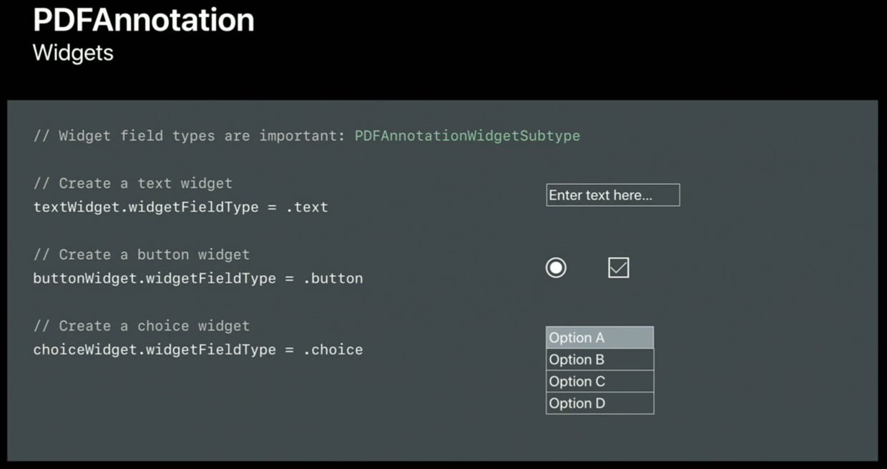
PDFAnnotationn 提供了很多的小部件，包括文本框、复选按钮、可选项等。

在初始化 PDFAnnotation 时把 type 设置为 widget，然后设置 widgetFieldType 属性即可。

```
let textWidget = PDFAnnotation(bounds: CGRect(x: 50, y: 50, width: 100, height: 100), forType: .widget, withProperties: nil)
let buttonWidget = PDFAnnotation(bounds: CGRect(x: 50, y: 50, width: 100, height: 100), forType: .widget, withProperties: nil)
let choiceWidget = PDFAnnotation(bounds: CGRect(x: 50, y: 50, width: 100, height: 100), forType: .widget, withProperties: nil)
        
textWidget.widgetFieldType = .text
buttonWidget.widgetFieldType = .button
choiceWidget.widgetFieldType = .choice
```

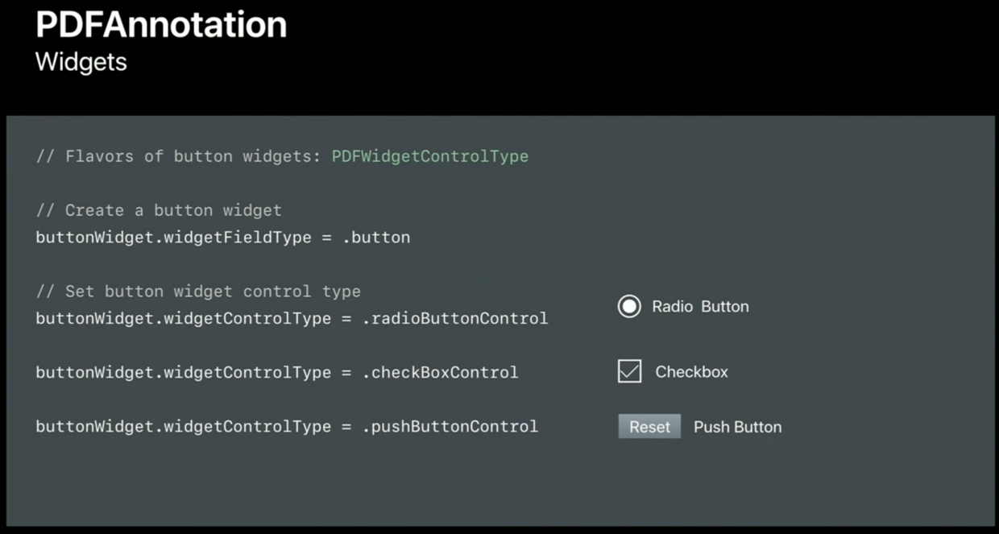

当我们使用 widgetFieldType 类型为 button 的时候，我们可以设置 3 种不同风格的按钮类型 radioButtonControl、checkBoxControl、pushButtonControl。

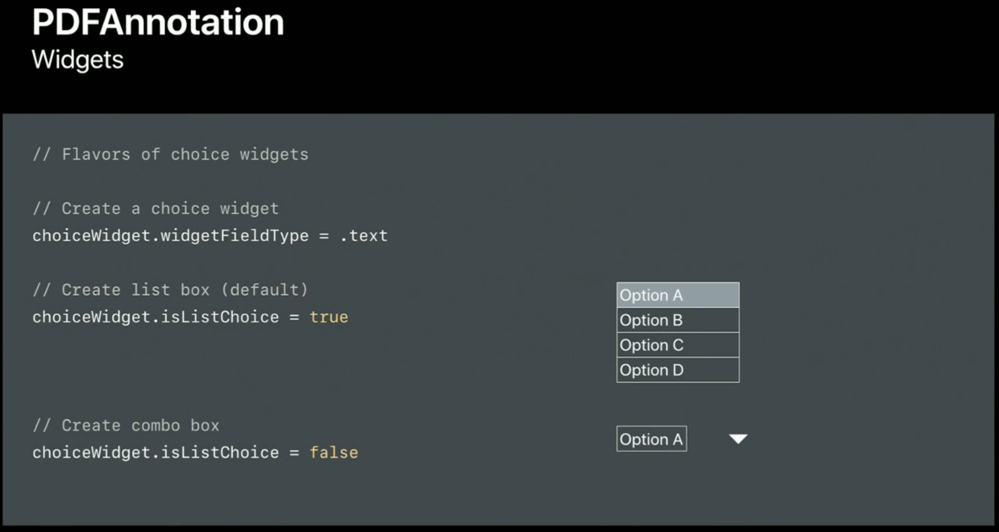
同样地，使用 widgetFieldType 类型为 choice 时，也有两种不同的风格，isListChoice 设为 true 时为列表框，false 则为组合框。

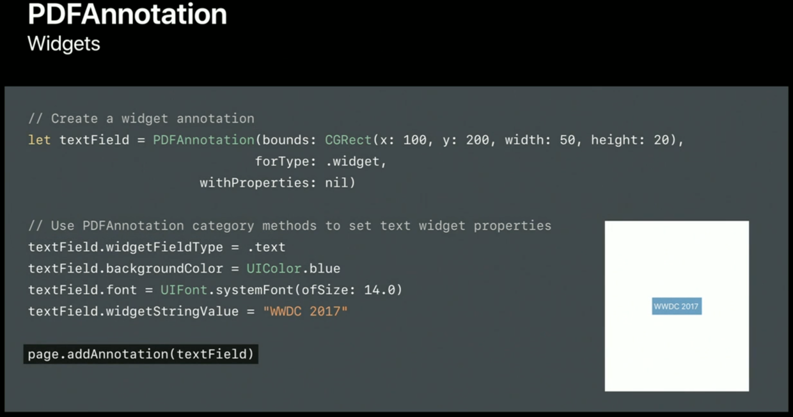
以上是设置一个文本框小部件的示例。

**Advanced widget annotationns （标注小部件的最佳实践）**

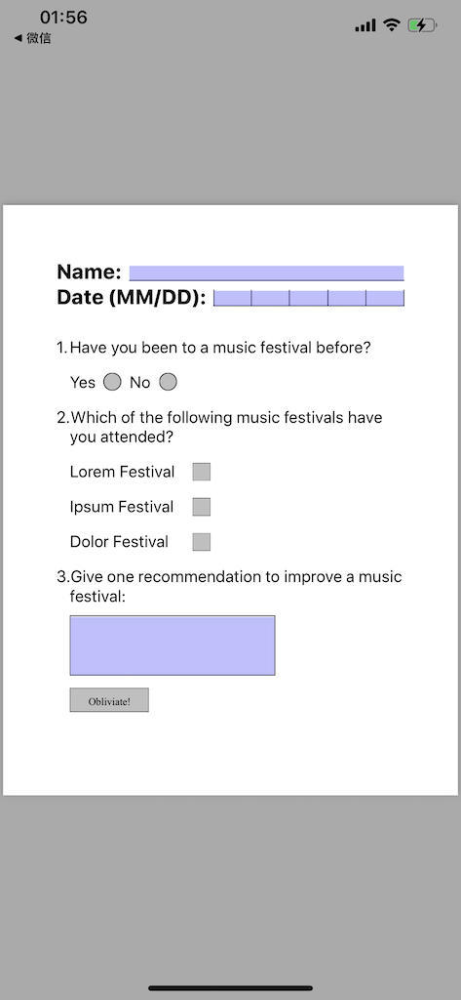

使用标注小组件实现一个填充表单的功能，点击查看[完整源码](https://gist.github.com/JimmyCJJ/d57bba2f46ea5431fc19df8c112aad97)。

- 最后，苹果给了我们使用 PDFKit 的一些建议。
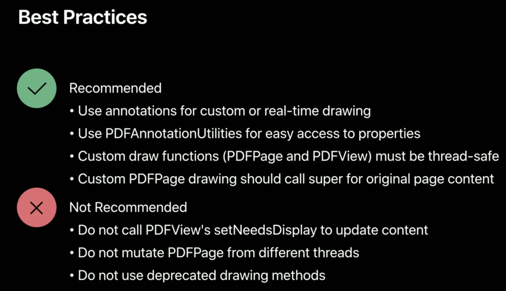

推荐：

- 使用标注进行自定义或实时绘图

- 使用 PDFAnnotationUtilities 更加方便地访问属性

- PDFPage 和 PDFView 的自定义绘制方法必须是线程安全的

- 自定义 PDFPage 绘制时应该调用 super 来获取原始页面内容

不推荐：

- 不要调用 PDFView 的 setNeedsDisplay 来更新内容

- 不要通过不同的线程去改变 PDFPage

- 不使用已弃用的绘制方法

## 3. PDFKit 的新特性（What's new in PDFKit）

本章主要讲解 WWDC22 的`What's new in PDFKit`session 内容。

该 session 中，苹果为我们带来了 PDFKit 的许多改进，主要有以下几部分：


- PDFKit review （简单回顾一下 PDFKit 的内容）
- Live text and forms （新特性：实况文本和表单）
- Create PDFs from images  （使用 image 对象来创建 PDF 页面）
- Overlay views （覆盖视图）

### 3.1. 简单回顾 PDFKit（PDFKit review）

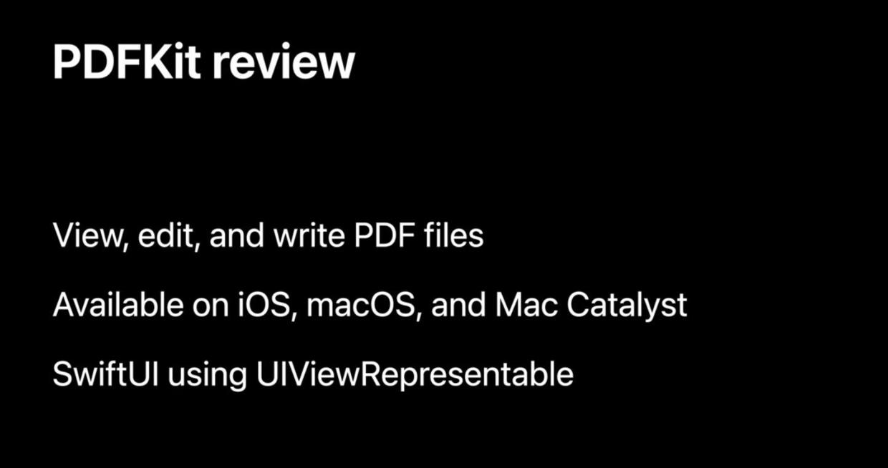

- PDFKit 是一个功能齐全的框架，它可以让我们的应用程序去查看、编辑和写入 PDF 文件。
- 它可以在 iOS, macOS 和 Mac Catalyst 上使用。
- 在 SwiftUI 中，它也可以通过 UIViewRepresentable 的方式使用。
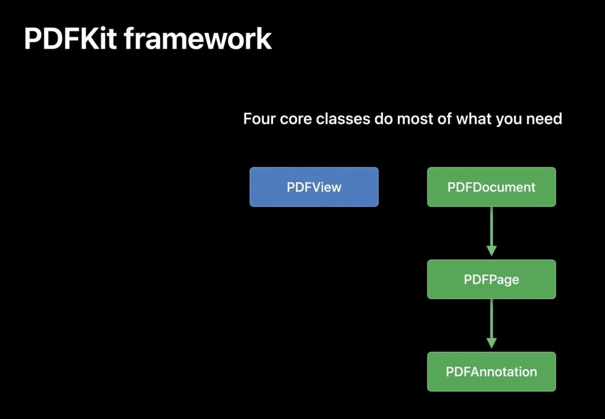

PDFKit 包含 4 个核心类，PDFView、PDFDocument、PDFPage、PDFAnnotation，它们所提供的 API 足以涵盖我们开发中需要使用的大部分功能。

- PDFView 负责显示 PDF 文档的内容。它允许用户导航、设置缩放级别以及将文本复制到粘贴板；在使用 SwiftUI 或者 Interface Builder 布局时都可以使用 PDFView。
- PDFDocument 代表一个 PDF 文档对象。一般来说，可以直接使用 PDFDocument，它足以满足我们的开发需求，我们很少会去子类化 PDFDocument。如图所示，PDFDocument 是 PDF 对象图的根。
- PDFPage 代表一个 PDF 文档里的一个页面。每个文档都会包含一个或者多个 PDFPage，PDFPage 负责渲染和存储该页面特有的字体和图像等资源。
- PDFAnnotation 是 PDFPage 的叶子结点，它是可选的。PDFPage 的内容是不能编辑的，而 PDFAnnotation 本质上是可交互可编辑的。

如果想详细了解更多关于 PDFKit 的基础知识，请查看第二章`介绍PDFKit`。

现在我们来谈谈在 iOS 16 和 macOS Ventura 中引入的新功能。

### 3.2. 新特性：实况文本和表单（Live text and forms）

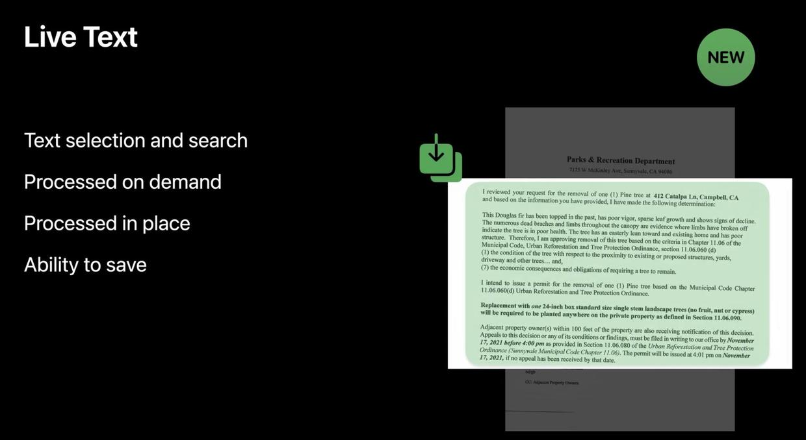

PDFKit 现在支持实况文本（Live Text）了，它拥有以下几个功能：

- 支持在 PDF 文档中选择和搜索文本内容。
- PDFKit 会按需识别当前选择的文本。
- 在识别选中的文本时，OCR 就已经完成了，不需要再拷贝一份文档去处理。
- 如果你想选择保存整个文档的文本，在保存的时候会有一个选项可以实现。

而在该 session 中，苹果并没有用代码示例来展示如何在 PDF 文档中实现实况文本，但是我们可以从 [WWDC2022 - Add Live Text interaction to your app](https://developer.apple.com/videos/play/wwdc2022/10026/) 中，学习到如何使用 Living Text API 实现实况文本，我们分析一下关键的实现逻辑：

- 因为只需要对当前显示在屏幕上的 PDFPage 实现实况文本功能，我们可以利用 pdfView.visiblePages 获取所有屏幕上显示的 PDFPage 对象。由于我们只能拿到 PDFPage 对象，PDFPage 是一个 NSObject 对象而非 UIView 对象，而实现实况文本需要对 UIView 对象处理，苹果并没有提供 API 去获取当前 PDFPage 的 UIView 对象，但是通过从 PDFView 开始遍历层级，我们能找到每一个 PDFPage 对应的 PDFPageView 对象（其实这样去获取是不太安全的，但目前只想到这种实现，期待苹果之后能提供 API 去获取，如果大家有更好的实现欢迎提出），拿到 PDFPageView 对象后，需要将交互对象添加到 PDFPageView 。

```
        for index in 0..<pdfView.visiblePages.count {
            let page = pdfView.visiblePages[index]
            let view = pdfView.subviews[0]
            let pageView: UIView = view.subviews[0].subviews[index + 1]
            let image = page.thumbnail(of: page.bounds(for: .cropBox).size, for: .cropBox)
            let analyzer = ImageAnalyzer()
            let interaction = ImageAnalysisInteraction()
            pageView.addInteraction(interaction)
            analyzeCurrentImage(targetImage: image, analyzer: analyzer, interaction: interaction)
        }
```

- 接着利用 ImageAnalyzer 对传入的 image 对象进行分析，把分析结果赋值给 interaction ，就完成了对该 PDF 页面的实况文本处理。

```
        interaction.preferredInteractionTypes = []
        interaction.analysis = nil
        if let image = targetImage {
            Task {
                let configuration = ImageAnalyzer.Configuration([.text, .machineReadableCode])
                do {
                    let analysis = try await analyzer.analyze(image, configuration: configuration)
                    if let analysis = analysis, image == targetImage {
                        interaction.analysis = analysis;
                        interaction.preferredInteractionTypes = .automatic
                    }
                }
                catch {
                    // Handle error…
                    print(error)
                }
            }
        }
```

效果如下：

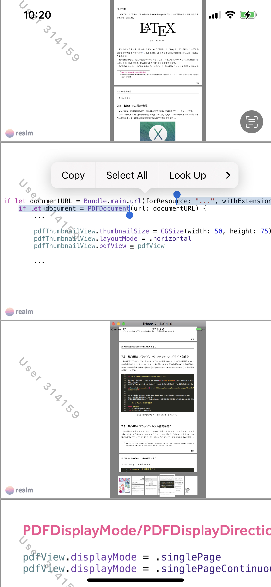

点击查看[完整源码](https://gist.github.com/JimmyCJJ/2af862209c373ffc144581459c63dc0e)。

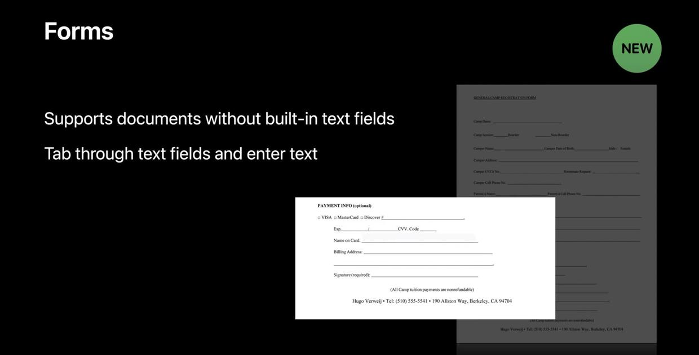

除了实况文本之外，PDFKit 还改进了对表单的处理：

- 包含表单字段的文档将被自动识别，即使它们不包含内置文本字段。
- 你可以按`tab`键切换这些文本字段并输入文本。

### 3.3. 使用 image 对象来创建 PDF 页面（Create PDFs from images）

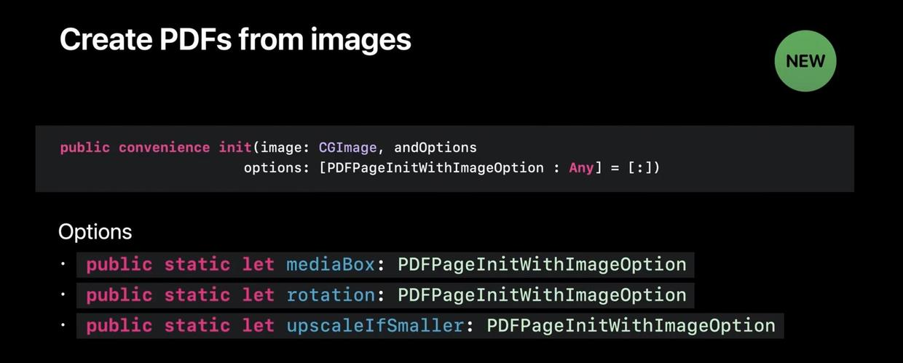
在 iOS 16 和 macOS Ventura 中，有一个新的、灵活的 API，可以让您的应用程序使用图像作为输入创建 PDF 页面。并且 PDFKit 会使用高质量的 JPEG 格式的编码对其进行压缩。因为 CGImageRef 是 CoreGraphics 中的原生数据类型，所以不需要进行额外的转换。另外还提供了可选参数来处理几种最常见的情况：

- mediaBox：可以指定页面的大小。你可以选择完美地适配图像大小，或者选择指定像信封一样的纸张大小。
- rotation：允许指定页面的纵向或横向方向。
- upscaleIfSmaller：默认情况下，如果图像比 mediaBox 指定的大小还要大，那么图像将缩小尺寸去适应，如果图像比 mediaBox 指定的大小还要小，那么图像将被缩放以填充页面。

### 3.4. 覆盖视图 （Overlay views）

苹果首先对“怎么用 Apple Pencil 在 PDF 页面上画画”这一个很多人问过的问题做出了解答：那就是使用覆盖视图（overlay views）。

以前在 PDF 上进行附加绘制时，我们只能通过两种方法来实现：

- 一个是创建 PDFPage 的子类并重写绘制方法。
- 另一个是使用自定义的 PDFAnnotation。

但是从 iOS 16 和 macOS Ventura 开始，我们可以在每个 PDF 页面的顶层覆盖自定义视图了，这代表我们的应用程序可以创建实时的、完全交互式的视图，并且显示在 PDF 页面的顶部。

下面是关于覆盖视图需要知道的三件事情：
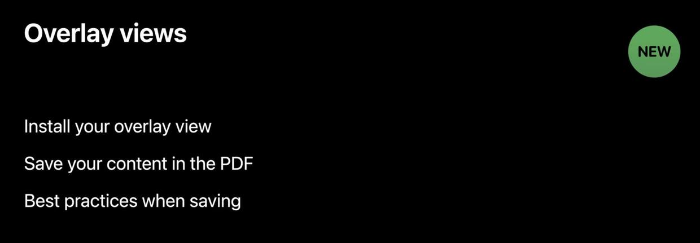

- 首先，我们需要使用一个新的协议在 PDF 页面上安装覆盖视图。
- 当需要保存时，我们要将内容合并到 PDF 中。
- 关于保存，苹果介绍了保存 PDF 文档时的一些最佳实践。

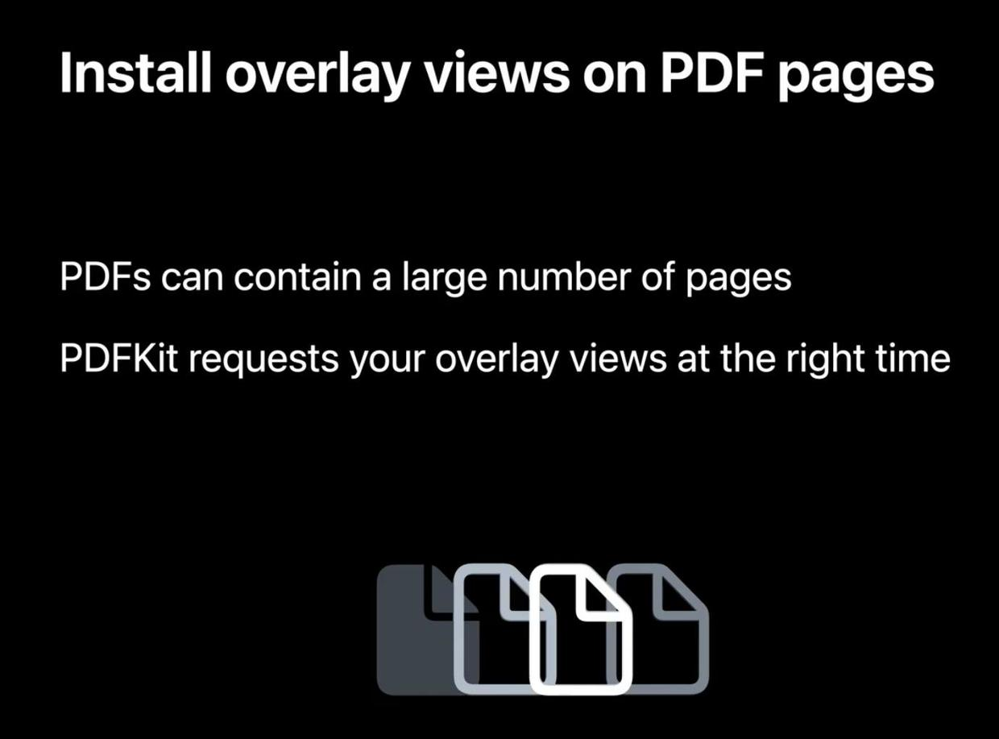
在 PDF 页面上安装覆盖视图非常简单，但是有个问题，PDF 可能包含着数百（甚至上千）个页面，所以在打开 PDF 时，我们不可能为所有的页面都创建覆盖视图。如果用户快速来回滚动，我们如何知道何时创建覆盖视图？

幸运的是，PDFKit 已经被设计成在人们滚动页面进入视图之前就会提前准备好内容了，所以它知道什么时候请求绘制覆盖视图，我们只需要遵守新的协议并重写对应的方法就可以了。

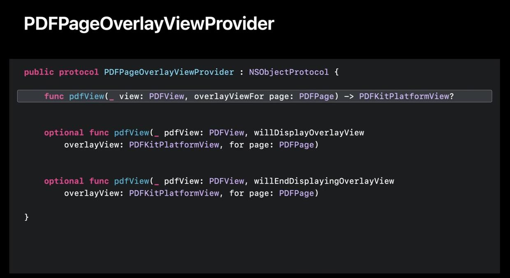
新的协议是 PDFPageOverlayViewProvider，它提供了三个方法，我们可以看到这里使用到了 PDFKitPlatformView，PDFKitPlatformView 只是一个适配不同平台的类型，它可能是 UIView 也可能是 NSView，具体要看所在的平台。
我们来看看这三个协议方法：

- overlayViewForPage：是必须要实现的协议方法，我们只需要提供一个视图的示例对象，PDFKit 就会通过使用适当的约束来调整它的大小。如果页面是一个旋转视图，那么我们提供的覆盖视图也会跟着旋转。
- willDisplayOverlayView：是可选实现的协议方法，它可以用来处理一些手势操作，也可以让这些手势在 PDFKit 中失效
- willEndDisplayingOverlayView：也是可选实现的协议方法，当我们的覆盖视图已经添加完成之后（比如当页面滚动时覆盖视图已经超出屏幕范围时），就会调用这个方法，我们可以在这个方法里面释放覆盖视图。这个方法还有另一个重要的用途，假如我们的覆盖视图保存了一些表示绘制内容的数据，我们可以在这个方法里获取这些数据并且把这些数据放在其他地方（下面会举例子来说明这个用途），否则就不需要实现这个方法。

以下是一个实现了 PDFPageOverlayViewProvider 协议的例子

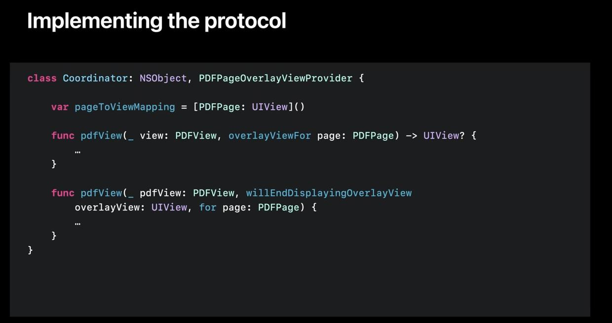
在这个例子中，我们创建了一个 Coordinator 类，它遵守了 PDFPageOverlayViewProvider 协议，并且声明了一个 pageToViewMappinng 变量，它是一个 key 为 PDFPage 类型，value 为 UIView 类型的字典，并且实现了两个协议，overlayViewFor 和 willEndDisplayingOverlayView。

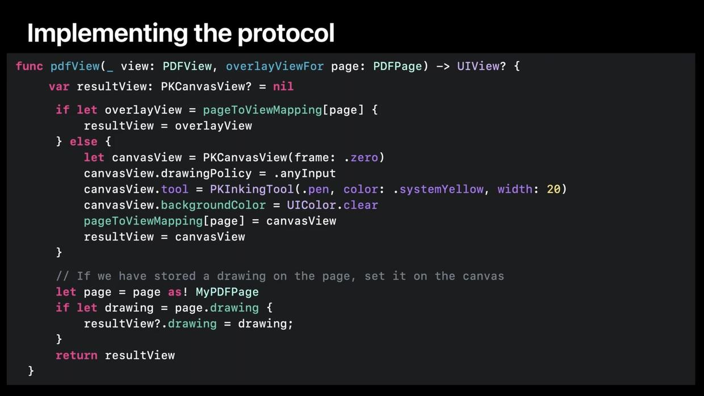

我们来看看 overlayViewFor 的具体实现：

- 首先声明了一个 PKCanvasView 类型的返回变量 resultView。
- 接着传入当前的 PDFPage 对象到 pageToViewMapping 中取出对应的 view，如果存在，则直接赋值给 resultView；否则就初始化一个新的 PKCanvasView 类型的 canvasView 并赋值给 resultView，与此同时，会将当前 page 与 canvasView 做一层映射缓存到 pageToViewMapping 字典中。
- 最后从当前的 PDFPage 对象中获取页面的绘制内容 drawing 并存储到 resultView 里面，在这里使用的 MyPDFPage 是 PDFPage 的一个子类，它仅仅只是添加了一个 drawing 属性。

现在，我们看看 WillEndDisplayingOverlay 方法的实现：
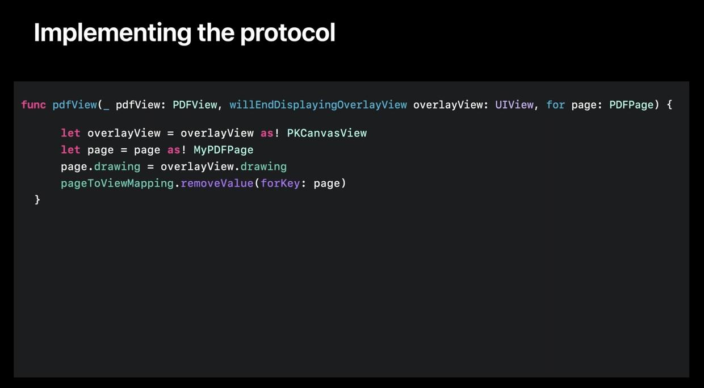
实现很简单：

- 获取当前的覆盖视图 overlayView，并将当前 page 的绘制内容（drawing）替换为 overlayView 的绘制内容。
- 从 pageToViewMapping 中移除当前页面的缓存。

接着苹果展示了一个 Apple Pencil 与 PDF 的交互绘制流程：

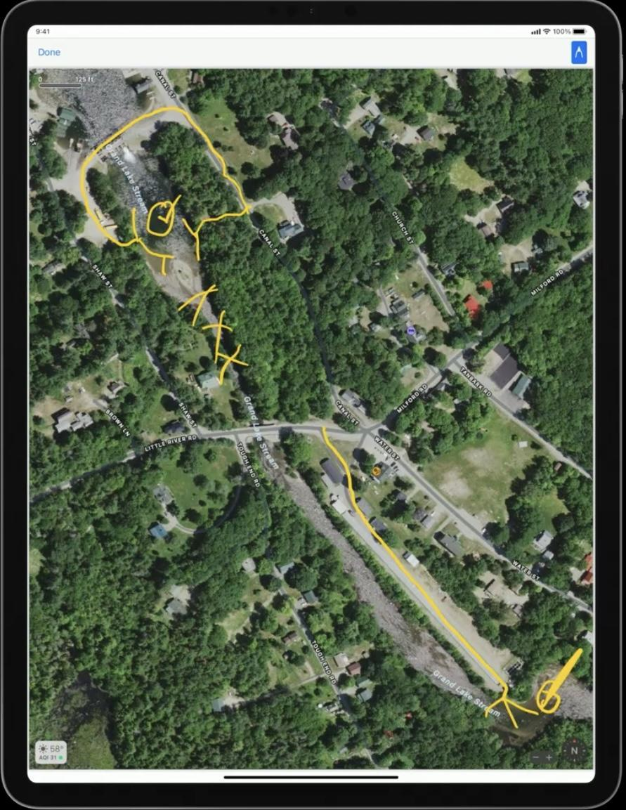
图中的黄色部分就是使用 Apple pencil 在 PDF 绘制的内容，其本质上就是往 PDF 上添加了一些覆盖视图。

那么我们如何去保存这些绘制内容呢？

同时，对于保存的结果，我们还希望能实现：

- 以高保真度去匹配屏幕外观。
- 可以双向编辑（round-trip editing），意思就是支持 undo 和 redo。

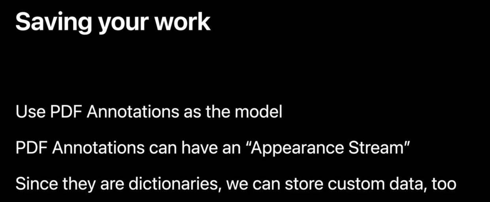

这时候 PDFAnnotation 就派上用场了，在 PDFAnnotation 中，它有一个“外观流（Appearance Stream）”，这是一个 PDF 绘制命令流，几乎任何可以使用 Quartz2D 绘制的内容都可以记录在这个外观流中，然后渲染成图像，并记录下来。
而且，因为它被记录为 PDF 绘制的图像，它将看起来与使用 Adobe 阅读器，Chrome 等时的效果完全一致。

关于外观流的具体操作，我们来看看示例代码：
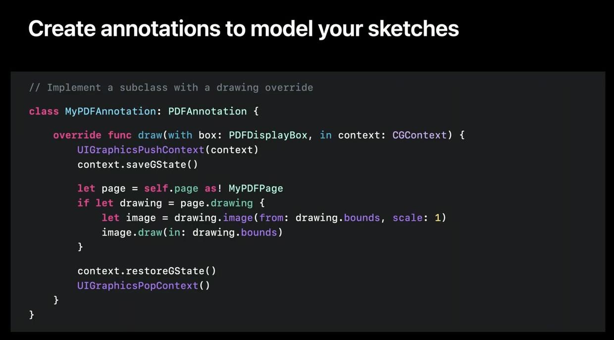

- 首先创建一个 PDFAnnotationn 的子类 MyPDFAnnotationn，目的是为了重写 draw()方法，PDFKit 将在保存我在上面提到的外观流时调用这个方法。

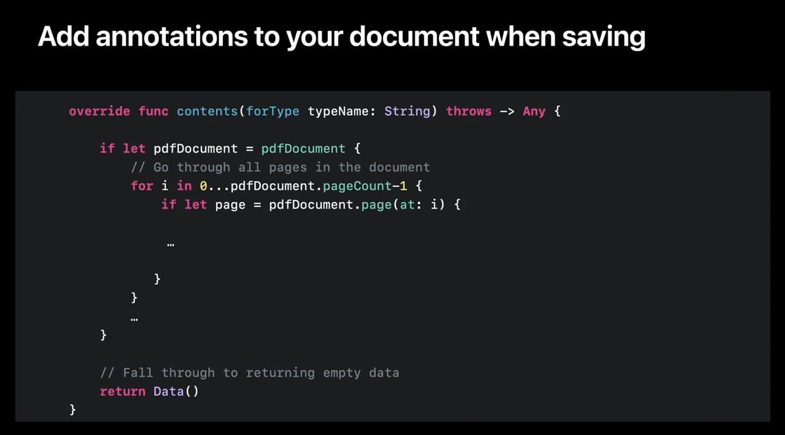

- 为了保存文档，我们又重写了 UIDocumennt 的 contents 方法，在这个方法中，我们循环遍历 PDF 文档的所有页面，图中省略的部分实现在下面说明。

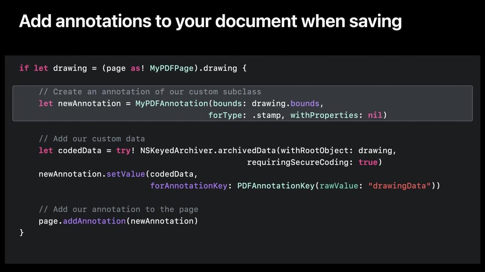

- 以上是第一处省略的代码。在每个页面中，创建一个 MyPDFAnnotation，将页面的 drawing 编码为 data 类型，然后使用键值对的方式存储到 MyPDFAnnotation 中，最后把 MyPDFAnnotation 添加到当前遍历的页面。

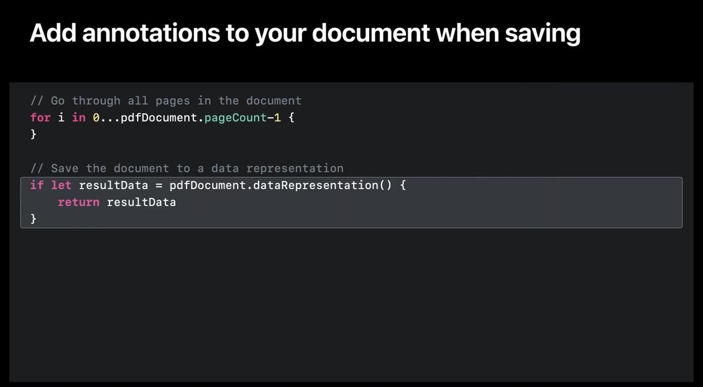

- 以上是第二个省略的代码。到这里，我们已经对所有的页面添加完标注了，现在我们使用 PDFDocument 的 dataRepresentation()来返回结果。

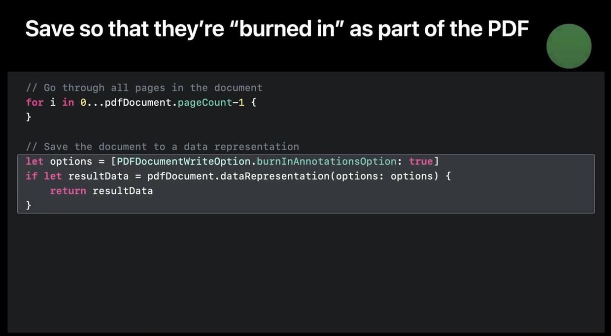

- 当页面内容保存为标注时，文档的接收者可以移动它、调整它的大小或者删除它，一般情况下，这就是我们想要的。但有时候，我们希望这个标注能够作为页面的一部分“嵌入”。在 iOS 16 和 macOS Ventura 中有一个新的 PDFDocumentWriteOption 可选项，只需要在编码为 data 的时候加上这个可选项并添加 burnannotationsoption = true 就可以实现了。

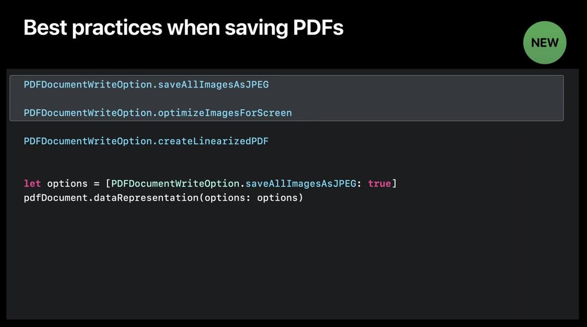

- CoreGraphics 一直致力于以最大保真度保存 pdf 格式的图像，因此图像会以全分辨率保存，具有无损压缩的性质。如果 PDF 文件是在大型打印机上打印的，这是最好的情况。但很多时候，它都是显示在屏幕上的，所有的高保真图像数据将导致它变成一个非常大的文件。为了解决这个问题，我们可以使用 PDFDocumentWriteOption，在 iOS 16 和 macOS Ventura 已经提供了几个选项了，针对以上问题我们可以使用两个选项（saveAllImagesAsJPEG 和 optimizeImagesForScreen）：

**saveAllImagesAsJPEG** ：通过字面意思理解，无论图像是如何创建的，它都将以 JPEG 编码保存在 PDF 中。

**optimizeImagesForScreen** ：通过对图像进行向下采样到最大的 HiDPI 屏幕分辨率。

以上两个选项可以同时使用。

**createLinearizedPDF** ：LinearizedPDF 是 PDF 文件中的一种特殊格式，它为互联网做了不少优化，所以可以通过互联网更快地进行查阅。
在互联网出现之前，PDF 格式的最初设计是从文件末尾读取的，这意味着在显示任何内容之前，需要先下载全部内容。而 LinearizedPDF 包含了在文件开头显示第一页所需的所有内容，所以 web 浏览器可以在加载其余内容时快速显示该内容。

我们可以在使用 PDFDocument 的 dataRepresentation 或者 writeToURL 方法时根据所需传递这些选项。
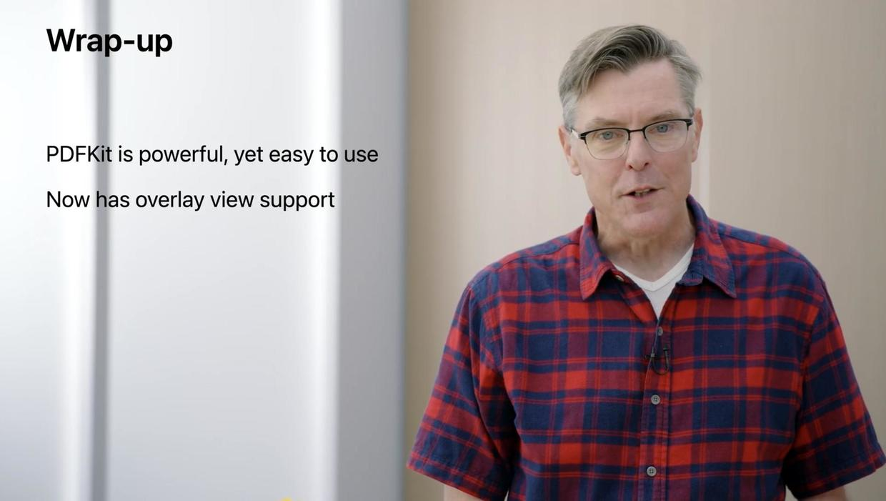

- PDFKit 是非常强大且易用的，在如今的 iOS 和 macOS 平台中有许多的应用程序都在使用，现在我们可以使用 iOS16 和 macOS Ventura 新增的功能来完成一些有意义的功能设计了！

## 4. 总结

- 第一章介绍了苹果在 PDF 处理方面的发展历史，在 CoreGraphics PDF Framework 转变到 PDFKit 的这个过程中支持了很多的新功能并且使用面向对象的设计，使得 API 使用起来更加易用了。
- 第二章介绍了 WWDC2017 苹果首次推出 PDFKit 的 session 内容，全面介绍了 PDFKit 的框架内容。
- 第三章介绍了 WWDC2022 苹果对 PDFKit 优化的一些新特性：实况文本、表单处理、覆盖视图。

从首次推出 PDFKit（WWDC17）到现今的 PDFKit 增加新特性（WWDC22），可以看出苹果在 PDFKit 上的更新不算太多，但目前的 PDFKit 已经很强大了，足以满足大多数对 PDF 文档的处理。不过对于一些比较历史久远的应用程序来说，比如 WPS Office 在开发前期时苹果还没有推出 PDFKit，所有的效果都是自己去实现的一套方案，目前看来替换为 PDFKit 来实现的可能性不大，成本较高。不过我们还是可以参考一下 PDFKit 的一些新特性，并尝试去实现这些特性，给用户带来更好的体验。
