# WWDC22 10090 - What's new in TextKit and text views

> 作者：
>
> 审核：

文本一直都是页面呈现和用户交互的核心元素，本文将主要介绍 TextKit2 的新特性，以及如何适配 TextKit2。全文共分为 3 个部分：
第一部分是对 iOS 上文本系统发展的回顾，TextKit 的介绍，以及 TextKit2 针对于 TextKit 的主要优化。
第二部分是对 TextKit2 新特性的解读
第三部分是对于开发者，如何更方便和简单的适配 TextKit2 所支持的视图，TextKit2 有哪些不同于 TextKit1 的 API 以及如何尽量避免兼容模式。

> 阅读建议
> 如果你对于 TextKit 和文本系统布局方式完全没有印象，请先了解相关文档和 session；
>
> 如果你只关心最新特性，请直接跳转到第二部分
>
> 如果你想了解如何在 iOS16 系统上更容易的适配 TextKit2 以及一些注意点，请直接跳转到第三部分
>
> 相关 Session ：
>
> [Session 10090 What's new in TextKit and text views](https://developer.apple.com/videos/play/wwdc2022/10090/)
>
> [Session 10061 Meet TextKit 2](https://developer.apple.com/videos/play/wwdc2021/10061/)
>
> [Session 221 TextKit Best Practices](https://developer.apple.com/videos/play/wwdc2018/221/)
>

## iOS 文本系统发展回顾

在 iOS7 以前，iOS 系统中的文本组件底层基本都是使用 WebKit 进行布局和渲染，虽然在 iOS3 带来了 CoreText，但其应用并不广泛。在 iOS7，文本系统进行了一次大升级，带来了 TextKit，并且将 UIKit 中文本相关的组件底层都切换为 TextKit 实现，文本绘制性能得到了提升，TextKit 的出现，也提升了 iOS 系统外观设计里文本的重要程度。TextKit 是一个基于 CoreText 封装的高级框架，其使用 MVC 架构，将 CoreText 中的底层排版逻辑进行抽象，使得上层开发者也能够容易的自定义个性化文本样式，大大丰富了 iOS 系统中的文本生态。然而实际上， TextKit 并不是一个新框架，早在二十多年前，其就在出现在 OpenStep 系统上了，然而几十年前的设计对于现在追求高性能，丰富性可扩展性，和安全性的使用场景注定有些局限性，针对于此，Apple 推出了 TextKit2。并在 iOS15 上支持了 UITextField，在 iOS16 系统上，所有 UIKit 中，文本相关的组件默认都使用 TextKit2 进行绘制。

TextKit2 的核心原则为 “准确性、高性能、安全性” 。针对于准确性，TextKit2 抽象了字形处理逻辑，直接从框架层面消除了字形 API，避免了不必要的复杂性，并且其完全支持 OpenType 和可变字体等现代字体技术；针对高性能，TextKit 默认就会使用基于 ViewPort 的布局和渲染，尤其对于内容较多的文档，性能得到明显提升；针对于安全性，TextKit2 更加关注值语义。TextKit2 专注于使用更高级的对象来控制文本布局，使您可以更轻松地自定义文本的布局，从而可以用更少的代码构建更酷的内容。TextKit2 引擎构成了所有 Apple 平台上文本布局和渲染的基础。未来 Apple 针对于文本的性能增强和改进都将着重与 TextKit2 之上。所以了解 TextKit2，以及清楚如何适配 TextKit2 对于开发者来说是必须要关注的事情。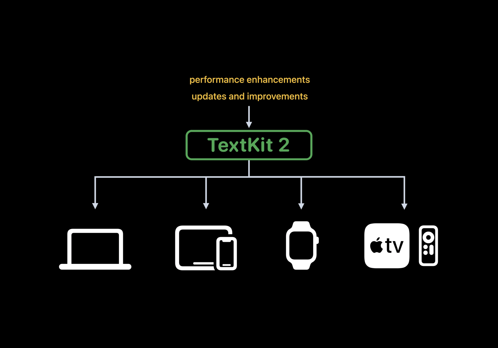

如果想要更加深入了解 TextKit2 的设计原则，以及针对 TextKit1 具体有哪些优化，可以看去年的 WWDC Session 10061。本文将主要着重于 TextKit2 在 iOS16 上的新特性和如何适配。

## TextKit2 的新特性

本部分将主要介绍 TextKit2 在 iOS 和 macOS 系统中的覆盖面，以及 TextKit2 的新特性。

### 发展历程

针对 iOS，TextKit2 最早于 iOS15 中被引入 iOS 系统，并在 UITextField 中替换 TextKit1，成为其底层默认的渲染引擎。而在 iOS16 中，UIKit 中所有的文本相关控件，默认都由以前的 TextKit1 替换到 TextKit2。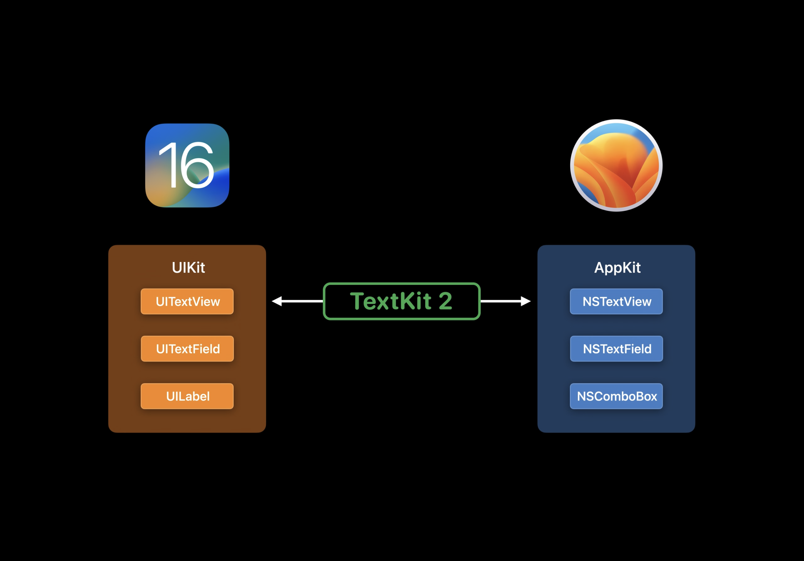

对于 macOS，从 macOS Monterey 开始，默认情况下，NSTextField 使用 TextKit2 进行渲染，对于 NSTextView 可选择的使用 TextKit 进行渲染。在 macOS Ventura 中，默认情况下，所有文本控件都使用 TextKit2 进行渲染。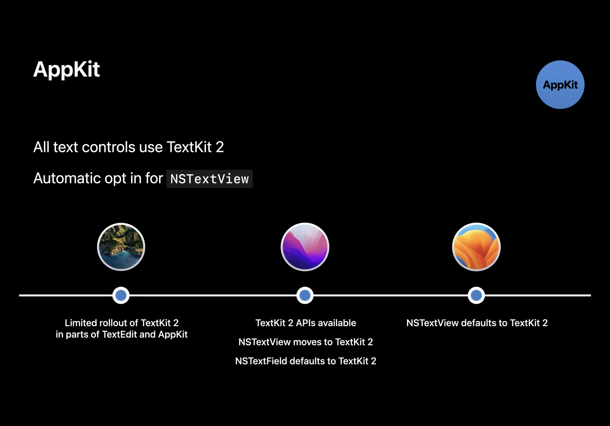

大多数情况下，这些转换是框架层面自动完成的，并不需要开发者进行任何适配。但仍有少数情况下，自动适配可能无法完成，需要开发者来主动进行适配。

由于 TextKit2 针对于 UITextView 是 iOS16 上的新标准，可能会有某些不兼容现象，所以 Apple 为开发者提供了简便的构造函数，用于在初始化时期判断是否使用 TextKit2 作为底层渲染引擎。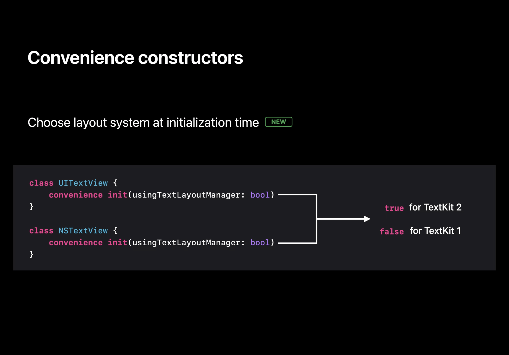

### 非简单文本容器支持

TextKit2 支持环绕文本或其他内联内容，可通过使用 NSTextContainer 的 ExclutionPaths 属性进行设置，此能力为对齐 TextKit1 中相关能力。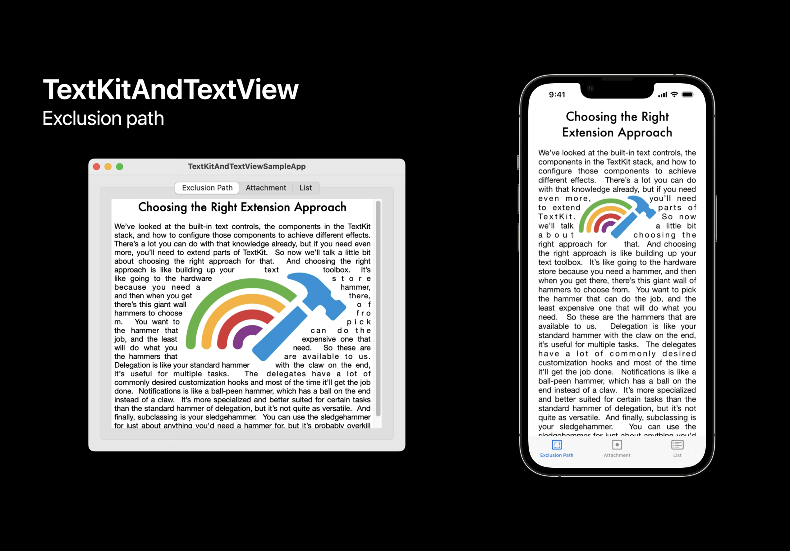

```swift
let bezierPath = ExclusionPath.uiBezierPath
textViewForExclusionPath.textContainer.exclusionPaths = [bezierPath]
```

### 换行引擎增强

TextKit2 中的换行引擎进行了增强，在使用传统换行符时，字间距会变大，而在新的能力增强下，默认文本可以支持更加均匀的换行，在较长的文本段落中使得文本更加容易阅读 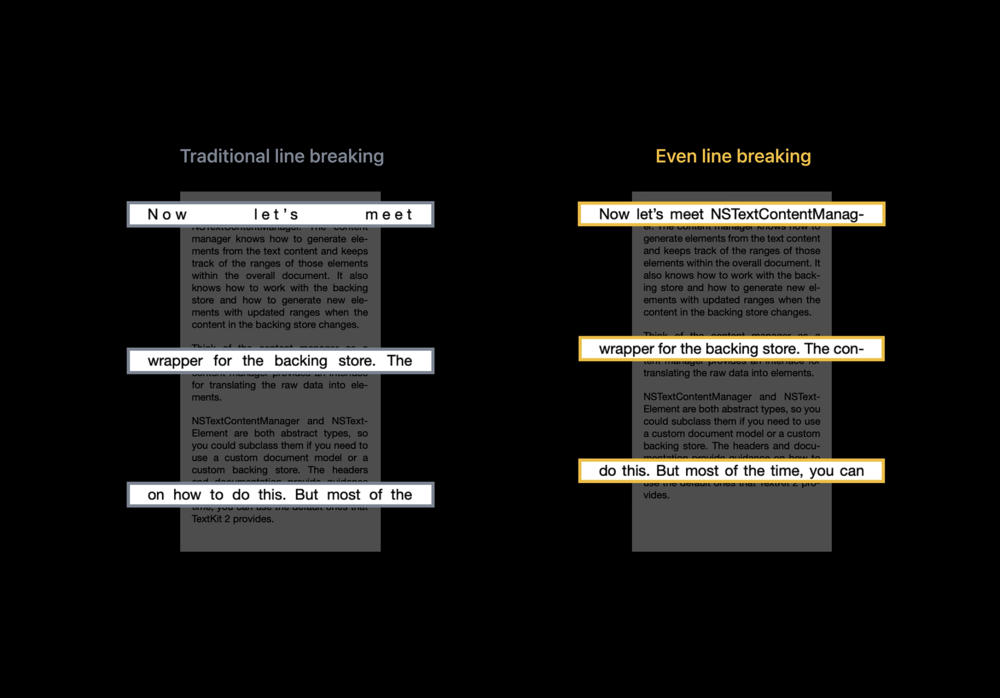

### 文本列表支持

过去 TextList 仅支持 AppKit，但在 iOS16 上，TextKit2 为所有平台均添加了文本列表的支持，使用文本列表，可以通过代码直接实现创建项目变化或者项目符号列表，可在 TextView 中直接进行展示。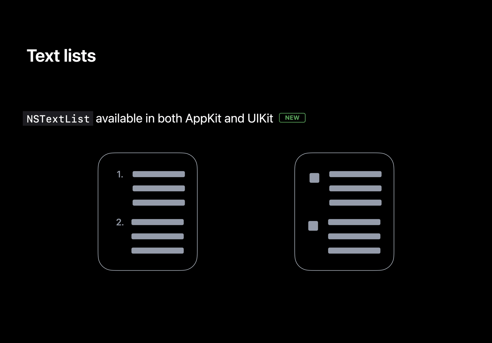

NSTextList 配合 NSMutableParagraphStyle 一起使用，可以让 textStorage 中的段落转换为列表进行展示。

```swift
guard let paragraphStyle = NSParagraphStyle.default.mutableCopy() as? NSMutableParagraphStyle else {
            return
        }
let textList = NSTextList(markerFormat: .decimal, options: 0)
paragraphStyle.textLists = [textList]
```

由于常见的列表可由嵌套项，所以在 TextKit2 中，增强了 NSTextElement，以支持将其构造为一个树结构。新版 TextKit 添加了一个新类 NSTextListElement，用以支持嵌套场景。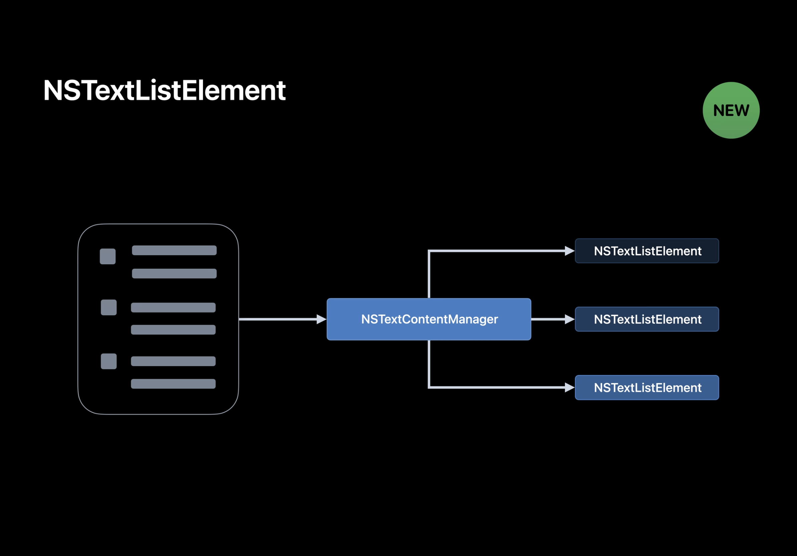

### 文本附件

在 TextKit1 中，我们可以通过 NSTextAttachment 为文本添加附件，用以支持复杂的富文本场景，但可惜的是，NSTextAttachment 仅支持图片，这也就对其使用场景进行了限制。而在 TextKit2 中，NSTextAttachment 支持将 view 作为文本附件进行展示，仅需要通过 NSTextAttachmentViewProvider 实例化即可，并且可以通过附件直接处理事件，这使得文本附件的使用场景可以更为丰富。

## 兼容模式

接来下这部分将详细介绍 TextKit1 的兼容性模式，原因及排查方式。由于 TextKit2 与 TextKit1 设计方式的不同，对于某些在 TextKit1 体系中投入较大的 App，亦或是脱离 UIKit，直接使用 TextKit1 进行自定义渲染绘制操作的组件，全面采用 TextKit2 可能需要一些时间。所以针对于此，Apple 提供了兼容模式，以便其能够顺利完成过渡。

### 原因

#### 构造函数兼容

前面已经提到过，当初始化时，显示使用 TextKit1 进行渲染时，TextView 将使用 TextKit1 进行渲染。

#### 显示调用 API

而当显示的调用 NSLayoutManager 等 TextKit1 中的 API 时，文本组件也会在内部重新将 NSTextLayoutManager 替换为 NSLayoutManager，并将其自身重新配置为使用 TextKit1 进行渲染。

#### 属性不支持兼容

如果在 TextView 中使用了 TextKit2 中尚不支持，或是完全剔除的 API 时，也会发生这种情况。

### 排查方式

如果我们发现在使用 UITextView 的过程中意外的回退到 TextKit1 进行渲染，可以通过在日志中开启该消息的警告。对于 UITextView，可以在 _UITextViewEnableingCompatibilityMode 开启符号断点，可以追溯调用栈，查看何处触发该异常；对于 NSTextView，可以通过监听 willSwitch 或是 didSwitchToNSLayoutManager 通知来获取意外回退 TextKit1 时的更多信息，以便进行针对性处理。
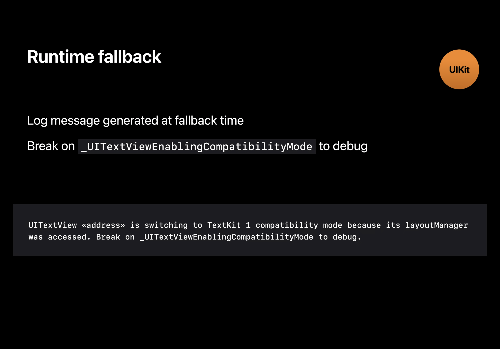

### 注意点

如果我们必须要使用某些 TextKit 中专有属性，最好在初始化时就指定使用 TextKit1 进行渲染，以避免在渲染过程中切换渲染引擎，带来更大的性能损耗和状态丢失。

### 如何避免兼容模式

一个最重要的概念：每个 TextView 只能有一个 LayoutManager，所以其不能同时拥有 NSTextLayoutManager 和 NSLayoutManager，并且 TextKit2 切换到 TextKit1 为单向操作。切换 LayoutManager 的过程非常昂贵，并会带来状态丢失，所以避免兼容模式非常重要。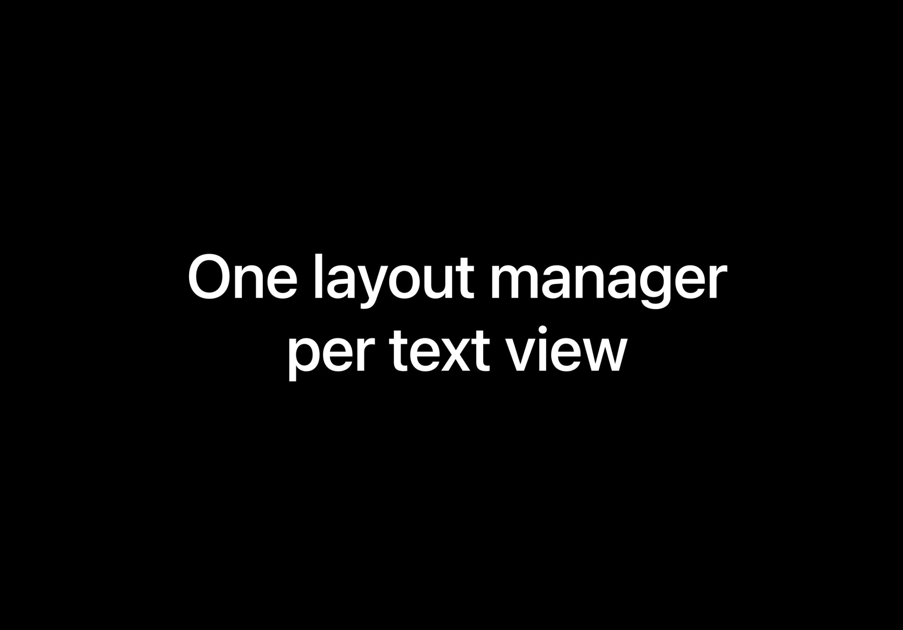

TextView 使用兼容模式最常见的原因就是访问 TextView 的 layoutManager 属性，所以一个重要的策略就是避免该属性的访问。但通常我们的代码都需要兼容低版本，并没有 NSTextLayoutManager，也无法完全避免 NSLayoutManager 的访问，在这种情况下，最好先访问 NSTextLayoutManager，确认其不存在后，再访问 NSLayoutManager。这样的情况下，TextKit1 的代码仅会在 Textkit2 不可用时进行使用。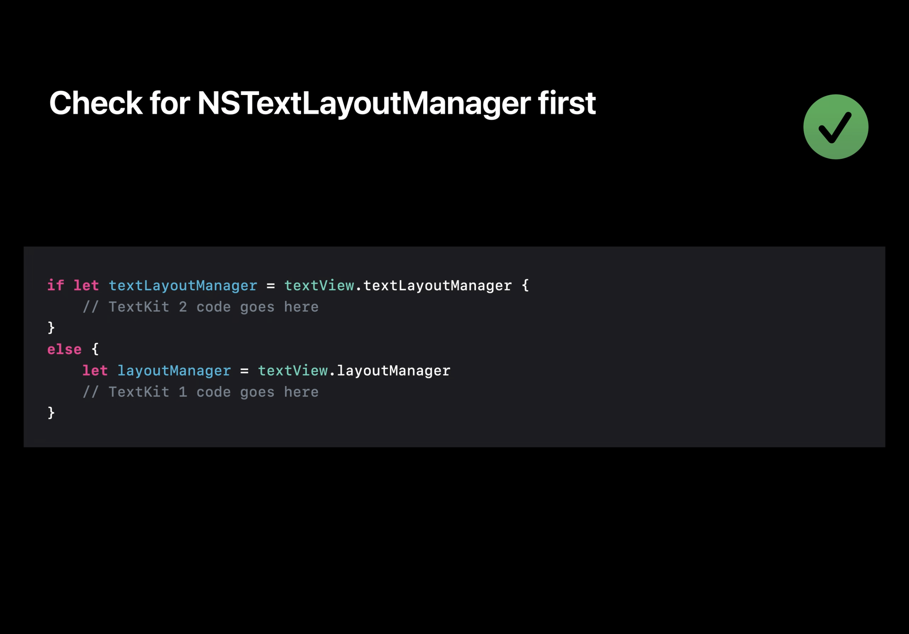

## 部分 API 兼容方式

这部分会主要介绍 TextKit2 相较于 TextKit1 与类型相关更新的代码，以便使用了这部分 API 的开发者能够更好的迁移到 TextKit2。

NSLayoutManager 与 NSTextLayoutManager 中等价的 API：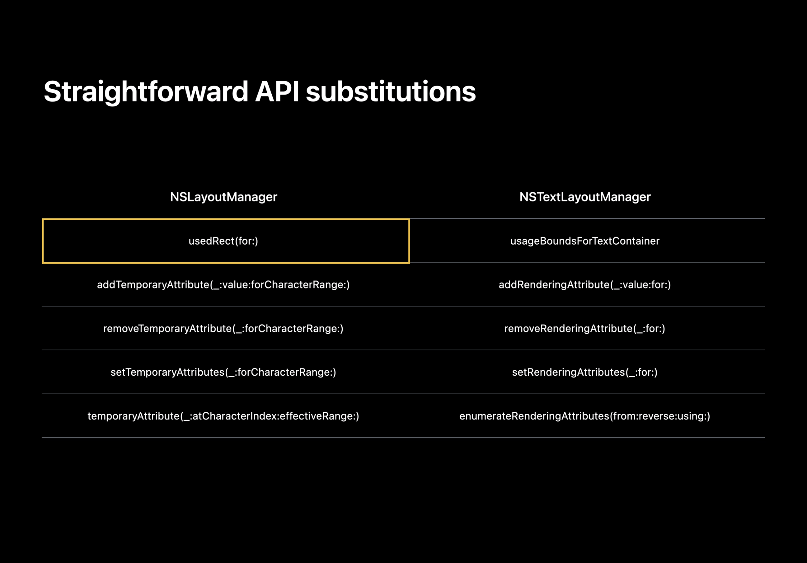
可以看到，这些 LayoutManager 相关的 API 在 TextKit 两个版本间都有类似的名称，替换比较简单。

但实际上，某些 TextKit1 中的 API 在 TextKit2 并没有直接与其等价的接口。因为，在卡纳达等印度文字中，许多单词并没有字符到字形正确的映射。在 TextKit2 中，glyph 可以被拆分重组甚至删除。NSLayoutManager 上基于 glyph 的 API 假设我们可以把连续的字符范围与连续的字形范围进行直接的关联，但并非所有语言都是如此，所以使用 glyph 相关的 API 可能会导致某些语言的文本布局和展示并不完整。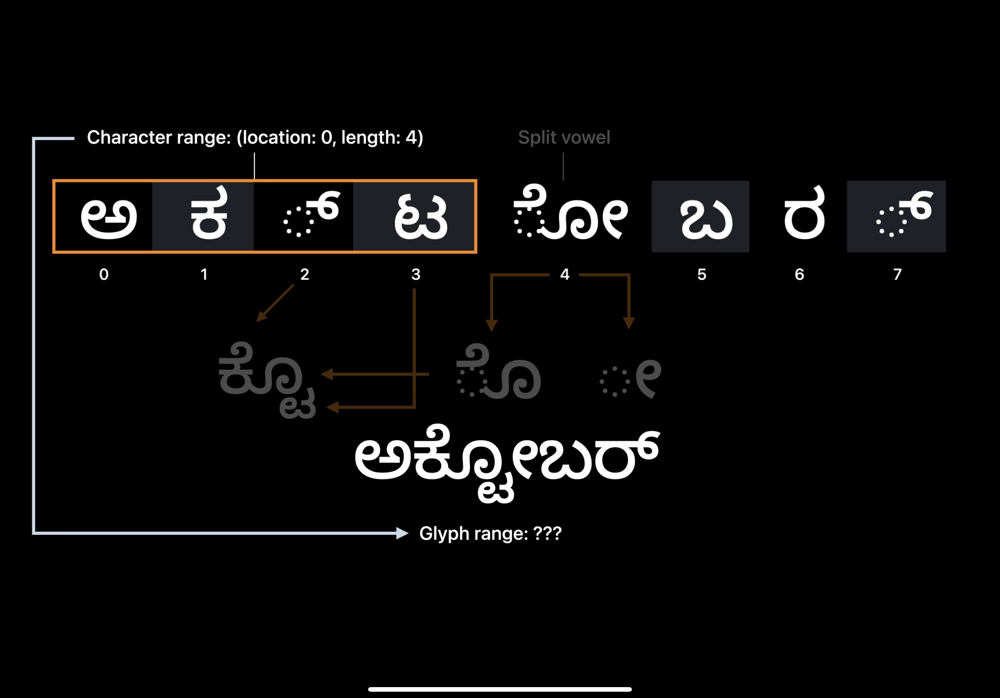

### 字形相关 API

这就是为什么 TextKit2 中没有 glyph 相关的 API。那么我们如何使用 TextKit2 来替换 TextKit1 中字形相关 API 的使用？

下面的一个例子中展示了如何使用 TextKit2 来更新基于 glyph 的代码：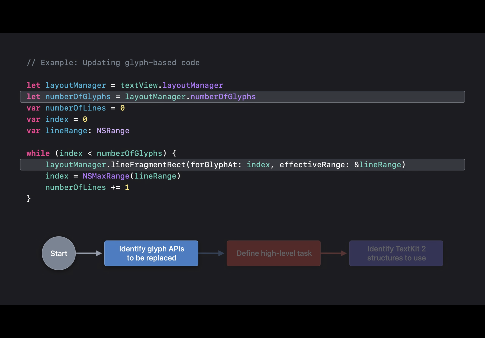
首先我们需要确定当前正在使用哪些字形相关 API 以及如何使用这些 API 及其用途。

接着需要找出其更高级别的抽象任务，然后使用 TextKit2 进行替代。

在这个例子中，我们使用 glyph 的两个 API: numberOfGlyphs 和 lineFragmentRect(forGlyphAt:index) 主要用于计算 TextView 中文本的行数。

下面是使用 TextKit2 重写的代码，我们通过枚举 NSTextLayoutFragments，并提供一个闭包来统计每个布局片段中所有的文本行片段。

```swift
var numberOfLines = 0
let textLayoutManager = textView.textLayoutManager

textLayoutManager.enumerateTextLayoutFragments(from:
                                               textLayoutManager.documentRange.location,
                                               options: [.ensuresLayout]) { layoutFragment in
        numberOfLines += layoutFragment.textLineFragments.count
}
```

### NSRange 能力增强

在 TextKit1 中，我们通常使用 NSRange 索引文本的内容，NSRange 是字符串的线性索引。这种线性模型定义简单，很容易理解，但一旦我们要描述具有稍微复杂一些的结构内容时，线性模型就会有较大弊端。比如在 HTML 中索引字符串 Hello TextKit2! 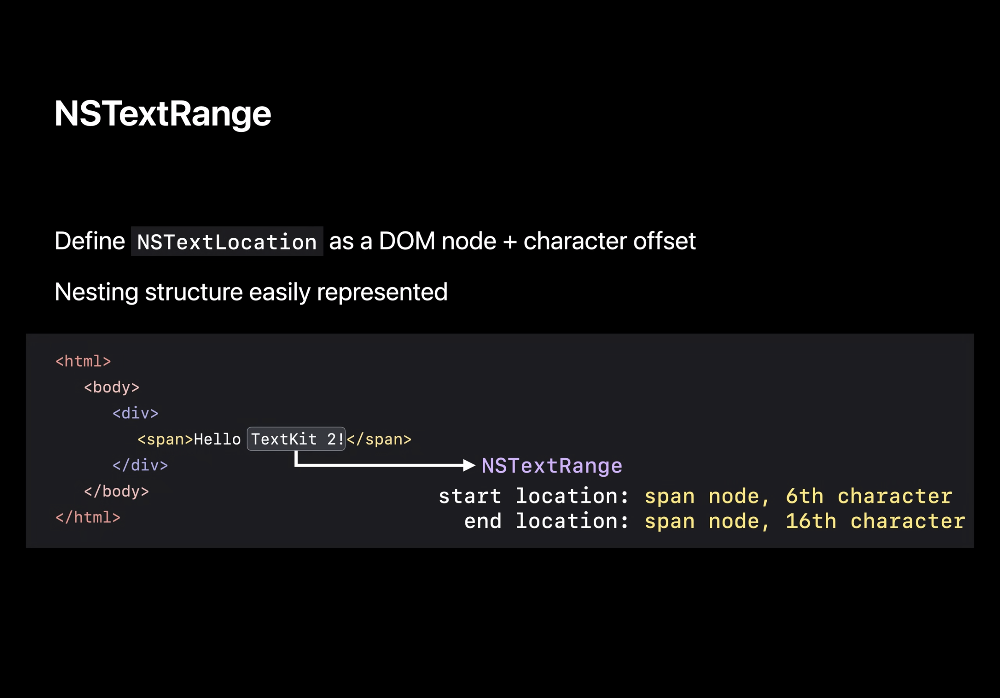
在上面这个例子中，我们所需要索引的文本是 HTML 文档的一部分，NSRange 并无法告诉我们文本位于 span 标签内，嵌套层级为 3。所以 TextKit2 中增加了 NSTextLocation 和 NSTextRange 用于表达这种非线性结构内容。

通过 NSTextLocation 协议，我们可以自定义文本内容中的抽象位置。其只有一个方法需要实现:

```swift
// Compares and returns the logical ordering to location
- (NSComparisonResult)compare:(id <NSTextLocation>)location API_AVAILABLE(macos(12.0), ios(15.0), tvos(15.0)) API_UNAVAILABLE(watchos);
```

NSTextRange 类似 NSRange，表示文档中的内容的连续范围，其属性和方法参数均需实现 NSTextLocation 协议: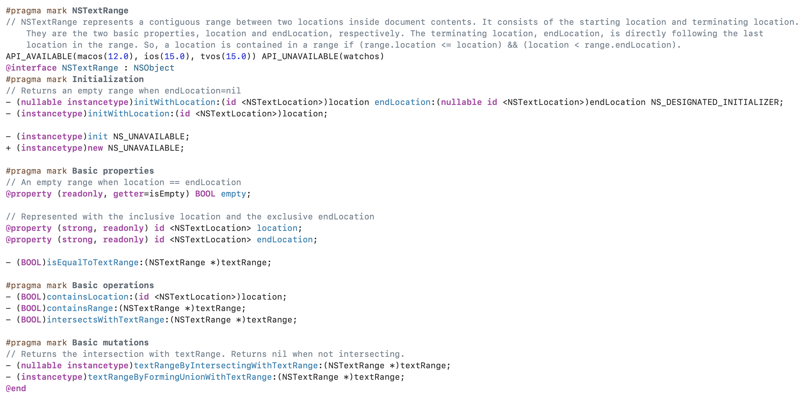

有了这些新的类型，我们可以方便的通过把位置定义为 DOM 节点和字符偏移量来表达此 HTML 中的嵌套结构。

但是 TextView 是建立在没有这种结构的 NSAttributedString 上的，要改变这一点，需要改变很多基础的数据结构，所以在使用 selectedRange 或 scrollRangeToVisible 等 TextView 相关 API 时，底层仍将继续使用 NSRange，在于 TextKit2 的 layoutManager 进行通信时，需要在 NSRange 和 NSTextRange 之间进行相互转换。
转换也比较简单，下面是将 NSRange 转换为 NSTextRange 的示例：

``` swift
let textContentManager = textLayoutManager.textContentManager

let startLocation = textContentManager.location(textContentManager.documentRange.location, 
                                                offsetBy: nsRange.location)!

let endLocation = textContentManager.location(startLocation, 
                                              offsetBy: nsRange.length)

let nsTextRange = NSTextRange(location: startLocation, end: endLocation)
```

若要将 NSTextRange 转换为 NSRange，可以通过 textContentManager 来获取文本内容的两个不同偏移，通过其生成 NSRange 对象：

```swift
let textContentManager = textLayoutManager.textContentManager

let location = textContentManager.offset(from: textContentManager.documentRange.location,
                                         to: nsTextRange!.location)

let length = textContentManager.offset(from: nsTextRange!.location,
                                       to: nsTextRange!.endLocation)

let nsRange = NSRange(location: location, length: length)
```

在大多数场景下，我们使用 UITextView 和 UITextField 等符合 UITextInput 协议的对象时，不需要把 UITextRange 转换为 NSTextRange，但当我们需要这么做时，可以使用整数作为媒介，在两种类型相互转换。

```swift
let offset = textView.offset(from: textview.beginningOfDocument, to: uiTextRange.start)

let startLocation = textContentManager.location(textContentManager.documentRange.location, 
                                                offsetBy: offset)!

let nsTextRange = NSTextRange(location: startLocation)
```

另外，如果你实现了符合 UITextInput 协议的自定义对象，则可以直接获取 view 中的 UITextPosition 和 UITextRange 子类，
我们可以使 UITextPosition 实现 NSTextLocation 协议所需方法，并可以使用子类直接创建 NSTextRange。
即使两个视图相似，我们也需要避免在不同的视图中重用 UITextPosition 对象，因为 UITextPosition 仅对创建它的视图生效。

## 总结

本文首先介绍了 iOS 平台上文本系统的发展历程，接着着重介绍了 TextKit2 相对于 TextKit1 的升级和具体适配流程。相对于去年的 session 《Meet TextKit2》，本文主要着重于在实践层面介绍 TextKit2 的适配策略及重大改进。
通过本文，我们可以在 iOS 新系统上充分检查和适配 TextKit2 的新特性。
对于我个人，印象比较深的是针对字形的高层次抽象，其帮助我们封装了字形等低级 API，可以让我们在应用层面更加方便的适配国际化；
针对于 NSTextAttachment，支持自定义 viewProvider 可以让开发者更加充分的发挥创造力，创造出更加丰富的文本生态；
针对于文档模型的进一步抽象升级，可以使得文本系统能够充分表达出层次更加丰富的内容；
针对于默认开启的 Viewport 布局和渲染能力，使得 TextKit2 的性能得到巨大提升。
相信在不久的将来，使用 TextKit2 来打造个性化的文本和丰富的文字特效的 App 将会越来越多。
