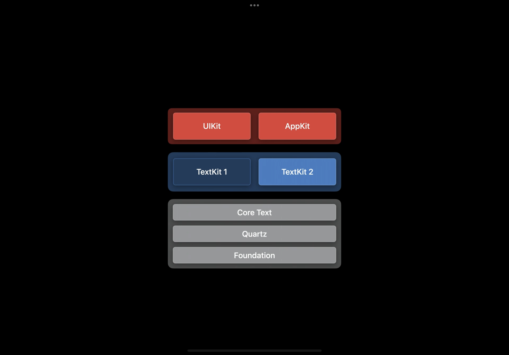
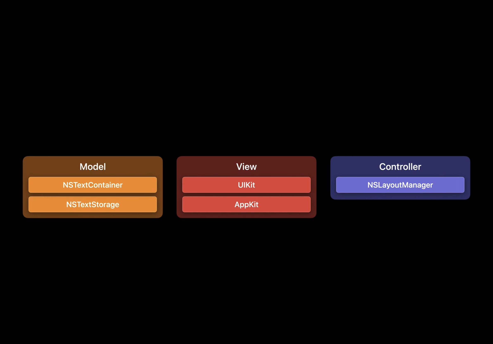
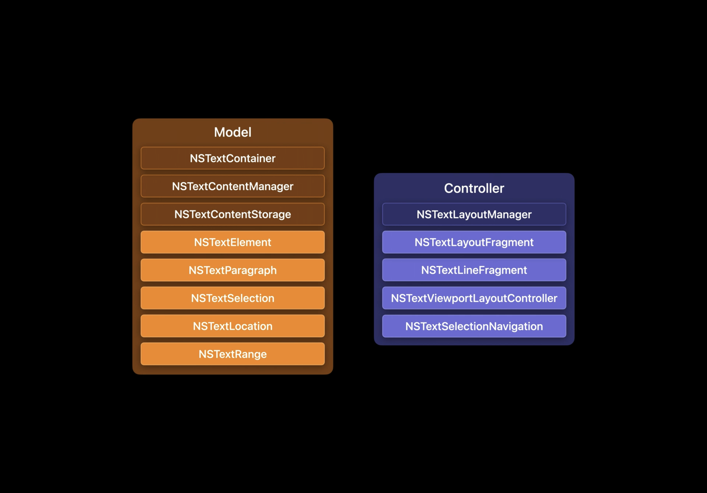
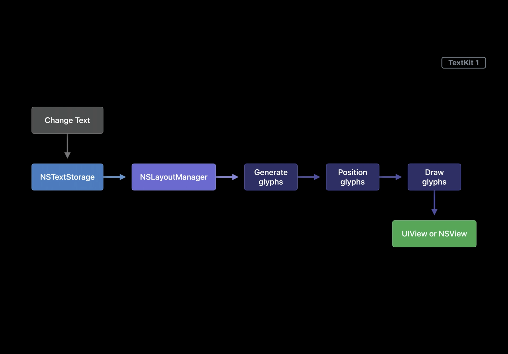
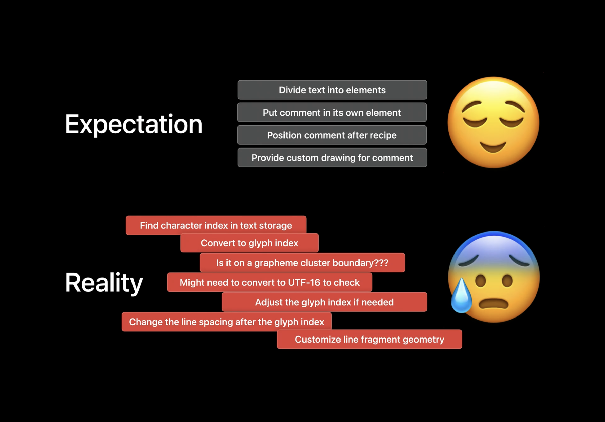
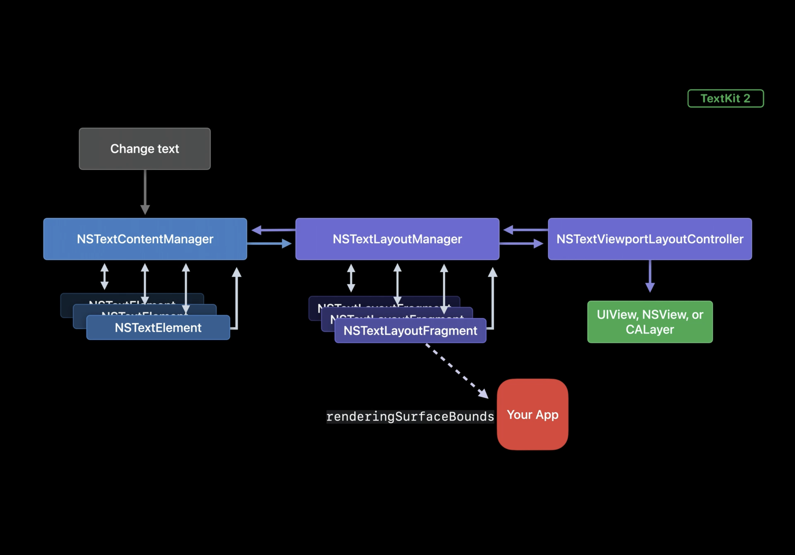
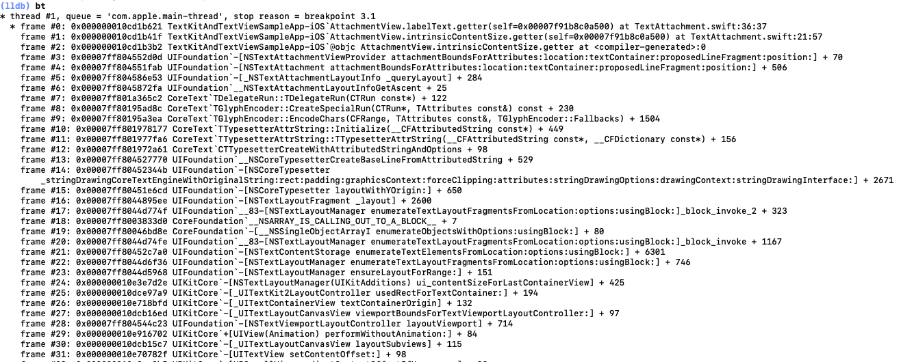
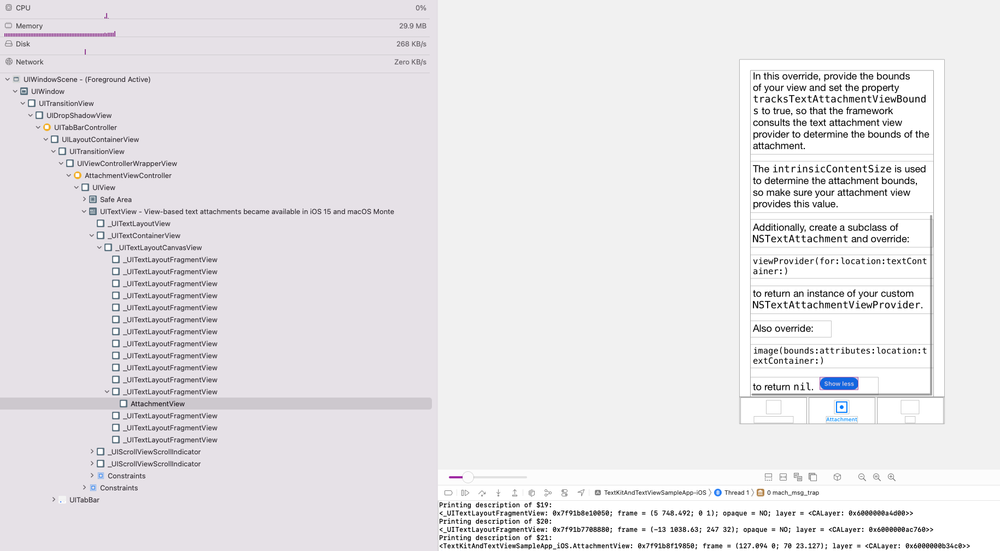

# WWDC22 10090 - TextKit 2 新特性解读及适配方案

文本一直都是页面呈现和用户交互的核心元素，本文将首先简短介绍 TextKit 2 的核心设计思路，着重介绍 TextKit 2 的新特性及如何适配 TextKit 2。全文共分为 3 个部分：
第一部分是对 iOS 上文本系统发展的回顾，TextKit 的核心设计原则，以及 TextKit 2 针对于 TextKit 的主要优化。
第二部分是对 TextKit 2 新特性的解读
第三部分是对于开发者，如何更方便和简单的适配 TextKit 2 所支持的视图，TextKit 2 有哪些不同于 TextKit 1 的 API 以及如何尽量避免兼容模式。

> 阅读建议
> 如果你对于 TextKit 和文本系统布局方式完全没有印象，请先了解相关文档和 session；
>
> 如果你只关心最新特性，请直接跳转到第二部分
>
> 如果你想了解如何在 iOS16 系统上更容易的适配 TextKit 2 以及一些注意点，请直接跳转到第三部分
>
> 相关 Session ：
>
> [Session 10090 What's new in TextKit and text views](https://developer.apple.com/videos/play/wwdc2022/10090/)
>
> [Session 10061 Meet TextKit 2](https://developer.apple.com/videos/play/wwdc2021/10061/)
>
> [Session 221 TextKit Best Practices](https://developer.apple.com/videos/play/wwdc2018/221/)
>

## iOS 文本系统发展回顾

在 iOS7 以前，iOS 系统中的文本组件底层基本都是使用 WebKit 进行布局和渲染，虽然在 iOS3 带来了 Core Text，但其应用并不广泛。在 iOS7，文本系统进行了一次大升级，带来了 TextKit，并且将 UIKit 中文本相关的组件底层都切换为 TextKit 实现，文本绘制性能得到了提升，TextKit 的出现，也提升了 iOS 系统外观设计里文本的重要程度。TextKit 是一个基于 Core Text 封装的高级框架，其使用 MVC 架构，将 Core Text 中的底层排版逻辑进行抽象，使得上层开发者也能够容易的自定义个性化文本样式，大大丰富了 iOS 系统中的文本生态。然而实际上， TextKit 并不是一个新框架，早在二十多年前，其就在出现在 OpenStep 系统上了，然而几十年前的设计对于现在追求高性能，丰富性可扩展性，和安全性的使用场景注定有些局限性，针对于此，Apple 推出了 TextKit 2。并在 iOS15 上支持了 UITextField，在 iOS16 系统上，所有 UIKit 中，文本相关的组件默认都使用 TextKit 2 进行绘制。

### TextKit 2 核心原则

TextKit 2 的核心原则为 “准确性、高性能、安全性” 。针对于准确性，TextKit 2 抽象了字形处理逻辑，直接从框架层面消除了字形 API，避免了不必要的复杂性，并且其完全支持 OpenType 和可变字体等现代字体技术；针对高性能，TextKit 默认就会使用基于 Viewport 的布局和渲染，尤其对于内容较多的文档，性能得到明显提升；针对于安全性，TextKit 2 更加关注值语义。TextKit 2 专注于使用更高级的对象来控制文本布局，使您可以更轻松地自定义文本的布局，从而可以用更少的代码构建更酷的内容。TextKit 2 引擎构成了所有 Apple 平台上文本布局和渲染的基础。未来 Apple 针对于文本的性能增强和改进都将着重与 TextKit 2 之上。所以了解 TextKit 2，以及清楚如何适配 TextKit 2 对于开发者来说是必须要关注的事情。

### TextKit 2 与 TextKit 1 的主要区别

上面主要是从概念上粗略的了解 TextKit 2 ，此处再从架构设计层面介绍一下 TextKit 2，以及 TextKit 2 相对于 TextKit 1 的主要优化点。

首先是层级结构：TextKit 2 与 TextKit 1 一样，都是以 Core Text 为基础，UIKit 和 AppKit 等文本相关控件均以 TextKit 为渲染内核。TextKit 实际上为 Core Text 更加面向对象的封装，使得上层开发者也可以方便的脱离系统文本控件来定制个性化的文本组件。比如 DinamicX 就以 TextKit 1 为基础，实现了自测自绘的富文本组件，由于 TextKit 的相关 API 均可以在异步线程访问，基于此，我们利用 TextKit + 异步绘制能力大大提升了信息流场景下多文本情况下的滑动流畅度。

接着是架构设计，TextKit 2 和 TextKit 1 一样，都是以 MVC 为基础架构进行设计 
上图为 TextKit 1 的架构设计。可以看出从架构上来看，TextKit 1 各部分分工明确。但在实际操作过程中我们会发现，由于 TextKit 1 的接口设计并不够抽象，导致其将底层的字形等基础结构都暴露给上层开发者，API 调用也需要大量的字形字符转换，导致我们在需要某些国际化的场景下通过字形来计算范围、行数等值并不准确，因为不同的语言字符和字形并非是一一对应的，映射关系也并不固定，导致我们在使用 TextKit 1 时，绘制某些文本时会出现意外截断、bounds 计算不准确等现象。而由于 TextKit 1 的 NSRange 为线性概念，导致我们在某些复杂场景下，并不能够很好的表达复杂的层级结构。下图为 TextKit 2 相对于 TextKit 1 的改进部分。由于 TextKit 1 中对于单词、短语并未进行抽象，所以当我们更改一段文本中的某个字段时，整个文本均需要重新进行字符转字形，测量，绘制等流程。

 可以看到，在 View 层上没什么变化，TextKit 2 和 TextKit 1 一样，均用以支持 UIKit/AppKit，主要变化为 Model 层，抽象出了新的 NSTextLocation、NSTextRange 用于表达复杂层级结构；抽象出了 NSTextElement、NSTextParagraph 等结构，让开发者能够更好的抽象区块结构，在重绘时，仅需改变其中某一区块即可，大大提升了渲染效率。

再看绘制流程，在 TextKit 1 中，当文本内容改变时，MVC 架构中的 Model： NSTextStorage 会使用新值直接替换旧值，接着其会通知 LayoutManager，接着 LayoutManager 会对字形进行初始化，布局，绘制，在初始化过程中还会对其进行正确性校验，可以看到在 TextKit 1 中的绘制流程为一条线性结构，当有文本改变时，则需要重新进行所有流程。在这个过程中，对于开发者来说，如果我们想对一段文本进行测量和布局，我们需要先将每个字符转成字形，然后再根据字形去计算其 index，再根据 index 去计算 range 和 boudns，在这个过程中，我们关注了太多底层的计算逻辑，而且也无法分清在何处创建自定义绘制空间。 

而在 TextKit 2 中，对于整个渲染流程进行了极大的改进，采用更高层次的抽象思维让我们能够更好的自定义文本，采用组合的形式巧妙的将文本中的每个部分定义为一个个可拆分可组合的节点，可以更加轻易和高性能的实现文本部分替换、更新等操作。对于一段文本来说，当我们需要对其更新时，操作的对象为 NSTextContentManager，NSTextContentManager 会将文本分成一个个 NSTextElement，在布局时，NSTextLayoutManager 会将一个个 TextElement 转换成对应的 LayoutFragment，最终通过 ViewportLayoutContainer 进行最终给 View 展示前的 layout 片段组合、定位和布局。NSTextElement 和 NSTextLayoutFragment 都是抽象类型，我们可以子类化自定义的文本片段和布局片段用于自定义 backingStore。

如果想要更加深入了解 TextKit 2 的设计原则，以及针对 TextKit 1 具体有哪些优化，可以观看去年的 WWDC Session 10061 及去年的内参：[初见 TextKit 2](https://mp.weixin.qq.com/s/vZ74jNgItabOB-TsaQn6Uw)。本文将主要着重于 TextKit 2 在 iOS16 上的新特性和如何适配。

## TextKit 2 的新特性

本部分将主要介绍 TextKit 2 在 iOS 和 macOS 系统中的覆盖面，以及 TextKit 2 的新特性。

### 发展历程

针对 iOS，TextKit 2 最早于 iOS15 中被引入 iOS 系统，并在 UITextField 中替换 TextKit 1，成为其底层默认的渲染引擎。而在 iOS16 中，UIKit 中所有的文本相关控件，默认都由以前的 TextKit 1 替换到 TextKit 2。

对于 macOS，从 macOS Monterey 开始，默认情况下，NSTextField 使用 TextKit 2 进行渲染，对于 NSTextView 可选择的使用 TextKit 进行渲染。在 macOS Ventura 中，默认情况下，所有文本控件都使用 TextKit 2 进行渲染。

大多数情况下，这些转换是框架层面自动完成的，并不需要开发者进行任何适配。但仍有少数情况下，自动适配可能无法完成，需要开发者来主动进行适配。

由于 TextKit 2 针对于 UITextView 是 iOS16 上的新标准，可能会有某些不兼容现象，所以 Apple 为开发者提供了简便的构造函数，用于在初始化时期判断是否使用 TextKit 2 作为底层渲染引擎。

### 非简单文本容器支持

TextKit 2 支持环绕文本或其他内联内容，可通过使用 NSTextContainer 的 ExclutionPaths 属性进行设置，此能力为对齐 TextKit 1 中相关能力。

```swift
// 创建一个贝塞尔曲线，并将其设置为环绕文本
let bezierPath = ExclusionPath.uiBezierPath
textViewForExclusionPath.textContainer.exclusionPaths = [bezierPath]
```

### 换行引擎增强

TextKit 2 中的换行引擎进行了增强，在使用传统换行符时，字间距会变大，而在新的能力增强下，默认文本可以支持更加均匀的换行，在较长的文本段落中使得文本更加容易阅读 

### 文本列表支持

过去 TextList 仅支持 AppKit，但在 iOS16 上，TextKit 2 为所有平台均添加了文本列表的支持，使用文本列表，可以通过代码直接实现创建项目变化或者项目符号列表，可在 TextView 中直接进行展示。

NSTextList 配合 NSMutableParagraphStyle 一起使用，可以让 textStorage 中的段落转换为列表进行展示。

```swift
// 首先创建一个可变段落结构
guard let paragraphStyle = NSParagraphStyle.default.mutableCopy() as? NSMutableParagraphStyle else {
            return
        }
let textList = NSTextList(markerFormat: .decimal, options: 0)
// 将文本列表作为段落的属性进行赋值即可
paragraphStyle.textLists = [textList]
```

由于常见的列表可由嵌套项，所以在 TextKit 2 中，增强了 NSTextElement，以支持将其构造为一个树结构。新版 TextKit 添加了一个新类 NSTextListElement，用以支持嵌套场景。

### 文本附件

在 TextKit 1 中，我们可以通过 NSTextAttachment 为文本添加附件，用以支持复杂的富文本场景，但可惜的是，NSTextAttachment 仅支持图片，这也就对其使用场景进行了限制。而在 TextKit 2 中，NSTextAttachment 支持将 view 作为文本附件进行展示，仅需要通过继承 NSTextAttachmentViewProvider 即可，并且可以通过附件直接处理事件，这使得文本附件的使用场景可以更为丰富。
👇 为一个自定义 viewAttachment 的实例，当点击时，可切换文本展开收起状态。

```swift
// 首先自定义 AttachmentViewProvider 继承自 NSTextAttachmentViewProvider
class AttachmentViewProvider: NSTextAttachmentViewProvider {
    override func loadView() {
        // 其中 AttachmentView 为一个自定义 view
        let attachmentView = AttachmentView()
        attachmentView.textAttachment = textAttachment as? Attachment
        view = attachmentView
    }
}

// 在创建自定义 Attachment 时，将 AttachmentViewProvider 作为附件内容，最终在真正渲染时，使用 Attachment 进行渲染即可。
class Attachment: NSTextAttachment {
    weak var textLayoutManager: NSTextLayoutManager? = nil
    var hiddenContent: NSAttributedString? = nil
    
    override func viewProvider(for parentView: View?, location: NSTextLocation, textContainer: NSTextContainer?) -> NSTextAttachmentViewProvider? {
        let viewProvider = AttachmentViewProvider(textAttachment: self, parentView: parentView,
                                                  textLayoutManager: textContainer?.textLayoutManager,
                                                  location: location)
        viewProvider.tracksTextAttachmentViewBounds = true
        return viewProvider
    }

    func toggleHidden() {
        guard let textStorage: NSTextStorage = (textLayoutManager?.textContentManager as? NSTextContentStorage)?.textStorage else { return }
        textLayoutManager?.textContentManager?.performEditingTransaction {
            if hiddenContent != nil { // Showing
                let ellipsisRange = NSRange(location: textStorage.length - 2, length: 1)
                textStorage.replaceCharacters(in: ellipsisRange, with: hiddenContent!)
                hiddenContent = nil
            } else { // Hiding
                let firstParagraphRange = NSRange(location: 0, length: 331)
                let hidingRange = NSRange(location: NSMaxRange(firstParagraphRange), length: textStorage.length - NSMaxRange(firstParagraphRange) - 1)
                hiddenContent = textStorage.attributedSubstring(from: hidingRange)
                textStorage.replaceCharacters(in: hidingRange, with: "…")
            }
        }
    }
}

```

当把 tracksTextAttachmentViewBounds 设置为 true 时，系统会在 layout 阶段调用 `-[NSTextAttachment attachmentBoundsForAttributes:location:textContainer:proposedLineFragment:position:]` 方法来访问我们的自定义 view，来根据 location、position、lineFragment 等参数来确定位置；当将该属性设置为 false 时，默认会使用当前 TextAttachment 本身的 bounds 作为 viewProvider 的大小。查看上例调用栈： 可印证上述说法。
以上例来说，最终渲染完成的样式如下：

可以看到，由于 TextKit 2 分段渲染的特性，最终多段文本会渲染在不同的 view 上，其中我们的 Attachment 会作为 _UITextLayoutFragmentView 的子 view 进行呈现。这也是 TextKit 2 高性能渲染的表现之一。

## 兼容模式

接来下这部分将详细介绍 TextKit 1 的兼容性模式，原因及排查方式。由于 TextKit 2 与 TextKit 1 设计方式的不同，对于某些在 TextKit 1 体系中投入较大的 App，亦或是脱离 UIKit，直接使用 TextKit 1 进行自定义渲染绘制操作的组件，全面采用 TextKit 2 可能需要一些时间。所以针对于此，Apple 提供了兼容模式，以便其能够顺利完成过渡。

### 原因

#### 构造函数兼容

前面已经提到过，当初始化时，显式使用 TextKit 1 进行渲染时，TextView 将使用 TextKit 1 进行渲染。

#### 显式调用 API

而当显式的调用 NSLayoutManager 等 TextKit 1 中的 API 时，文本组件也会在内部重新将 NSTextLayoutManager 替换为 NSLayoutManager，并将其自身重新配置为使用 TextKit 1 进行渲染。

#### 属性不支持兼容

如果在 TextView 中使用了 TextKit 2 中尚不支持，或是完全剔除的 API 时，也会发生这种情况。

### 排查方式

如果我们发现在使用 UITextView 的过程中意外的回退到 TextKit 1 进行渲染，可以通过在日志中开启该消息的警告。对于 UITextView，可以在 _UITextViewEnableingCompatibilityMode 开启符号断点，可以追溯调用栈，查看何处触发该异常；对于 NSTextView，可以通过监听 willSwitch 或是 didSwitchToNSLayoutManager 通知来获取意外回退 TextKit 1 时的更多信息，以便进行针对性处理。


### 注意点

如果我们必须要使用某些 TextKit 中专有属性，最好在初始化时就指定使用 TextKit 1 进行渲染，以避免在渲染过程中切换渲染引擎，带来更大的性能损耗和状态丢失。

### 如何避免兼容模式

一个最重要的概念：每个 TextView 只能有一个 LayoutManager，所以其不能同时拥有 NSTextLayoutManager 和 NSLayoutManager，并且 TextKit 2 切换到 TextKit 1 为单向操作。切换 LayoutManager 的过程非常昂贵，并会带来状态丢失，所以避免兼容模式非常重要。

TextView 使用兼容模式最常见的原因就是访问 TextView 的 layoutManager 属性，所以一个重要的策略就是避免该属性的访问。但通常我们的代码都需要兼容低版本，并没有 NSTextLayoutManager，也无法完全避免 NSLayoutManager 的访问，在这种情况下，最好先访问 NSTextLayoutManager，确认其不存在后，再访问 NSLayoutManager。这样的情况下，TextKit 1 的代码仅会在 Textkit 2 不可用时进行使用。

## 部分 API 兼容方式

这部分会主要介绍 TextKit 2 相较于 TextKit 1 与类型相关更新的代码，以便使用了这部分 API 的开发者能够更好的迁移到 TextKit 2。

NSLayoutManager 与 NSTextLayoutManager 中等价的 API：
可以看到，这些 LayoutManager 相关的 API 在 TextKit 两个版本间都有类似的名称，替换比较简单。

但实际上，某些 TextKit 1 中的 API 在 TextKit 2 并没有直接与其等价的接口。因为，在卡纳达等印度文字中，许多单词并没有字符到字形正确的映射。在 TextKit 2 中，glyph 可以被拆分重组甚至删除。NSLayoutManager 上基于 glyph 的 API 假设我们可以把连续的字符范围与连续的字形范围进行直接的关联，但并非所有语言都是如此，所以使用 glyph 相关的 API 可能会导致某些语言的文本布局和展示并不完整。

### 字形相关 API

这就是为什么 TextKit 2 中没有 glyph 相关的 API。那么我们如何使用 TextKit 2 来替换 TextKit 1 中字形相关 API 的使用？

下面的一个例子中展示了如何使用 TextKit 2 来更新基于 glyph 的代码：
首先我们需要确定当前正在使用哪些字形相关 API 以及如何使用这些 API 及其用途。

接着需要找出其更高级别的抽象任务，然后使用 TextKit 2 进行替代。

在这个例子中，我们使用 glyph 的两个 API: `numberOfGlyphs` 和 `lineFragmentRect(forGlyphAt:index)` 主要用于计算 TextView 中文本的行数。

下面是使用 TextKit 2 重写的代码，我们通过枚举 NSTextLayoutFragments，并提供一个闭包来统计每个布局片段中所有的文本行片段。

```swift
// 直接遍历区间内的 layoutFragment，通过文本片段来计算最后行数，极为方便
var numberOfLines = 0
let textLayoutManager = textView.textLayoutManager

textLayoutManager.enumerateTextLayoutFragments(from:
                                               textLayoutManager.documentRange.location,
                                               options: [.ensuresLayout]) { layoutFragment in
        numberOfLines += layoutFragment.textLineFragments.count
}
```

### NSRange 能力增强

在 TextKit 1 中，我们通常使用 NSRange 索引文本的内容，NSRange 是字符串的线性索引。这种线性模型定义简单，很容易理解，但一旦我们要描述具有稍微复杂一些的结构内容时，线性模型就会有较大弊端。比如在 HTML 中索引字符串 Hello TextKit 2! 
在上面这个例子中，我们所需要索引的文本是 HTML 文档的一部分，NSRange 并无法告诉我们文本位于 span 标签内，嵌套层级为 3。所以 TextKit 2 中增加了 NSTextLocation 和 NSTextRange 用于表达这种非线性结构内容。

通过 NSTextLocation 协议，我们可以自定义文本内容中的抽象位置。其只有一个方法需要实现:

```swift
// Compares and returns the logical ordering to location
- (NSComparisonResult)compare:(id <NSTextLocation>)location API_AVAILABLE(macos(12.0), ios(15.0), tvos(15.0)) API_UNAVAILABLE(watchos);
```

NSTextRange 类似 NSRange，表示文档中的内容的连续范围，其属性和方法参数均需实现 NSTextLocation 协议:

有了这些新的类型，我们可以方便的通过把位置定义为 DOM 节点和字符偏移量来表达此 HTML 中的嵌套结构。

但是 TextView 是建立在没有这种结构的 NSAttributedString 上的，要改变这一点，需要改变很多基础的数据结构，所以在使用 `selectedRange` 或 `scrollRangeToVisible` 等 TextView 相关 API 时，底层仍将继续使用 NSRange，在于 TextKit 2 的 layoutManager 进行通信时，需要在 NSRange 和 NSTextRange 之间进行相互转换。
转换也比较简单，下面是将 NSRange 转换为 NSTextRange 的示例：

``` swift
// 通过 textContentManager 获取开始和结束的 location，计算多维的 TextRange
let textContentManager = textLayoutManager.textContentManager

let startLocation = textContentManager.location(textContentManager.documentRange.location, 
                                                offsetBy: nsRange.location)!

let endLocation = textContentManager.location(startLocation, 
                                              offsetBy: nsRange.length)

let nsTextRange = NSTextRange(location: startLocation, end: endLocation)
```

若要将 NSTextRange 转换为 NSRange，可以通过 textContentManager 来获取文本内容的两个不同偏移，通过其生成 NSRange 对象：

```swift
let textContentManager = textLayoutManager.textContentManager
// 通过计算出位置和长度也可以将多维转一维
let location = textContentManager.offset(from: textContentManager.documentRange.location,
                                         to: nsTextRange!.location)

let length = textContentManager.offset(from: nsTextRange!.location,
                                       to: nsTextRange!.endLocation)

let nsRange = NSRange(location: location, length: length)
```

在大多数场景下，我们使用 UITextView 和 UITextField 等符合 UITextInput 协议的对象时，不需要把 UITextRange 转换为 NSTextRange，但当我们需要这么做时，可以使用整数作为媒介，在两种类型相互转换。

```swift
let offset = textView.offset(from: textview.beginningOfDocument, to: uiTextRange.start)

let startLocation = textContentManager.location(textContentManager.documentRange.location, 
                                                offsetBy: offset)!

let nsTextRange = NSTextRange(location: startLocation)
```

另外，如果你实现了符合 UITextInput 协议的自定义对象，则可以直接获取 view 中的 UITextPosition 和 UITextRange 子类，
我们可以使 UITextPosition 实现 NSTextLocation 协议所需方法，并可以使用子类直接创建 NSTextRange。
即使两个视图相似，我们也需要避免在不同的视图中重用 UITextPosition 对象，因为 UITextPosition 仅对创建它的视图生效。

## 总结

本文首先介绍了 iOS 平台上文本系统的发展历程，接着着重介绍了 TextKit 2 相对于 TextKit 1 的升级和具体适配流程。相对于去年的 session《Meet TextKit 2》，本文主要着重于在实践层面介绍 TextKit 2 的适配策略及重大改进。
通过本文，我们可以在 iOS 新系统上充分检查和适配 TextKit 2 的新特性。
对于我个人，印象比较深的是

 1、针对字形的高层次抽象，及使用组合和面向抽象的设计方式，大大提升了框架的可扩展性，使得上层开发者使用 TextKit 2 来自定义多样化文本控件成为一件非常简单的事情；

 2、针对 NSTextAttachment，支持自定义 viewProvider 可以让开发者更加充分的发挥创造力，创造出更加丰富的文本生态；

 3、针对于文档模型的进一步抽象升级，可以使得文本系统能够充分表达出层次更加丰富的内容；

 4、借助新增的 NSTextElement、NSTextLayoutFragment 等，以及默认开启的 Viewport 布局和渲染能力，使得 TextKit 2 的渲染性能得到巨大提升。

TextKit 2 的出现，大大简化了开发者对于 UIKit/AppKit 底层文本绘制自定义的难度，并极大增强了可扩展性和性能表现。相信在不久的将来，使用 TextKit 2 自定义来打造丰富、个性化的文本效果的使用场景将会越来越多。
