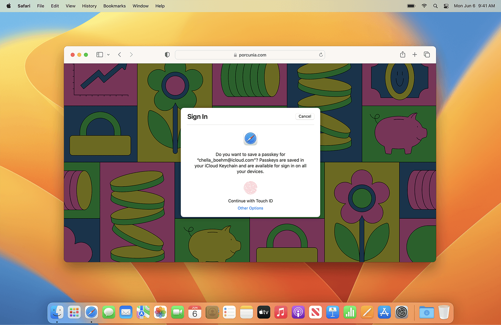

## 个人介绍

Tamarous，就职于字节跳动，目前工作内容是某 App 的稳定性治理。

## 审核介绍

Damien，就职于字节跳动，目前负责 TikTok 隐私和安全相关的工作。

王浙剑（Damonwong），老司机技术社区负责人、《WWDC22 内参》主理人，目前就职于阿里巴巴。

## 文章介绍

苹果一向以对用户隐私的严格重视和出色的隐私保护能力而广受赞誉。passkey 是苹果在用户隐私保护与信息安全方面提出的一个完整的解决方案。本文将带你一起来了解这一方案是什么、为什么和怎么用。

## 头图

