# WWDC22 10092 - 遇见 Passkey

本文基于 [Session 10092](https://developer.apple.com/videos/play/wwdc2022/10092) 梳理。

> 作者：Tamarous，就职于字节跳动，目前工作内容是负责某 App 的稳定性治理。
>
> 审核：
>
> Damien，就职于字节跳动，目前负责 TikTok 隐私和安全相关的工作。
>
> 王浙剑（Damonwong），老司机技术社区负责人、《WWDC22 内参》主理人，目前就职于阿里巴巴。

苹果一向以对用户隐私的严格重视和出色的隐私保护能力而广受赞誉。passkey 是苹果在用户隐私保护与信息安全方面提出的一个完整的解决方案。本文将带你一起来了解这一方案是什么、为什么和怎么用。

全文共分为如下三个部分：

1. 什么是 passkey

2. passkey 的原理

3. passkey 的使用

## 什么是 passkey

在现代数字生活中，用户名和密码是我们在各个网站和应用上的通行证。我们在这些网站和应用上分享生活、记录信息，可以说数字生活是我们的第二种生活方式。

如下图，是一个比较典型的，用户通过密码登录网站或应用的过程。

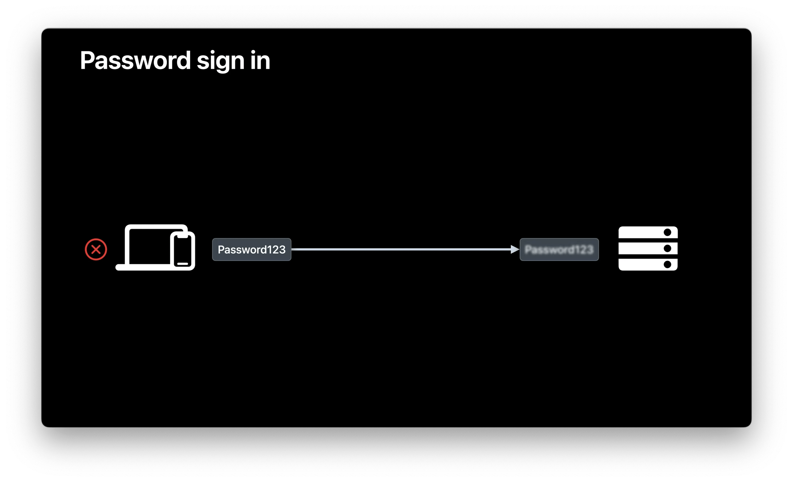

用户初次注册时，在设定好用户名和密码并点击注册后，客户端对用户名和密码进行一定的加密处理，然后发往服务端。服务端接收到客户端请求后，将加密后的数据提取出来，存入数据库中。在用户下次登录时，服务端从请求中获得当前用户输入的用户名和密码，然后在数据库中查找是否有相应的条目，从而验证用户的身份。

以上的流程使得现有密码体系存在种种不足。

首先，很多用户都喜欢使用简单好记的密码，但这些密码非常容易被猜到或被尝试出来。数据调查网站 NordSecurity 的一份调查显示，123456、password、qwerty 等是全球使用人数最多的密码。

其次，用户信息全部存储在服务端，极易受黑客攻击，某某网站或应用服务器遭受攻击后发生用户信息大规模泄露的事情在最近时有发生，并且一些用户可能会在多个网站或应用上使用同样的密码，因此在一个网站上的信息泄露了，在其他网站上的信息也会随之泄露。

此外，一些黑客还会制作和真正网站看起来非常类似的钓鱼网站，在这样的网站上输入用户名和密码后，并不是发给了真正网站的服务端，而是直接将用户名和密码告诉了黑客，因此也有很高的安全风险。

从用户角度来看，很多应用或网站对密码都有特定的格式要求，需要为不同的网站设定不同的密码，因此这也增加了用户维护密码的成本，并催生了一批密码管理软件如 1Password、LastPass 等的出现。

为了解决以上问题，联想、Paypal、Synaptics 等几家公司于 2012 年建立了 FIDO (Fast Identity Online，在线快速身份认证) 联盟，并在之后的几年内快速发展，目前在全球已经拥有了超过 250 名成员。该联盟的目标就是通过制定一套开放的、可扩展的、可互操作的技术规范，从而减少对通过密码认证用户身份的依赖。WebAuthn 标准是 FIDO 联盟指导下的 FIDO2 项目的核心组成部分。在 WebAuthn 标准下，网站和应用程序能够调用用户设备上的身份认证器，直接使用指纹识别、面部识别、虹膜识别、声音识别等方式对用户身份进行验证。由于这些用户信息都是保存在用户设备本地的，不会发送到应用或网站后台上，因此能够杜绝传统密码体系中的种种问题。

passkey，就是苹果对 WebAuthn 标准的实现。在 WWDC21 上，苹果面向开发者发布了 passkey 的预览版，详见 [Move beyond passwords](https://developer.apple.com/videos/play/wwdc2021/10106/)。 在今年的 WWDC22 上，passkey 正式与我们见面了。

我们来看一个典型的应用场景。如下图，是一个名为 shiny 的 demo 应用。用户可以使用用户名和密码进行登录，得益于 FaceID 及 Keychain，在 iPhone 上用户已经免去了记录密码的烦恼。


这个应用也适配了 passkey。在登录后，我们在设置中为这个账号创建一个 passkey。在调用苹果提供的 API 后（下文中会介绍如何用 passkey 实现用户注册），会出现 passkey 的创建弹窗。点击继续后，系统使用 FaceID 进行人脸识别，成功后就能成功创建一个 passkey。


创建 passkey 后，用户下次登录时，只要点击用户名输入框，在键盘快速输入区就会弹出使用 passkey 进行自动填充的提示框，点击后会直接调用 FaceID 进行验证，验证通过后即可完成登录。


此外，如果应用对应的网站也支持了 passkey，那么在 Mac 上访问该网站时，用户能够直接用 iCloud 中的 passkey 进行登录；如果是在 PC 上访问时，用户可以通过扫码来使用 passkey。

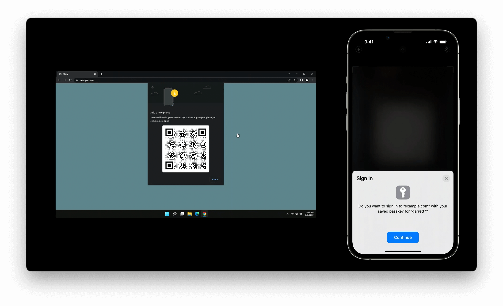

## passkey 原理

本节将从原理的角度对 passkey 的细节进行一些解释。

### WebAuthn 标准

前文提到过，passkey 是苹果对 WebAuthn 标准的一个实现。到底什么是 WebAuthn 标准呢？这个标准里又规定了什么内容呢？本小节中我们先来进一步了解一下 WebAuthn。

WebAuthn，又名 Web Authentication API，是一套由 FIDO 和 W3C 组织共同制定的[标准](https://w3c.github.io/webauthn/)，在这个标准里，也定义了一个 Web API，供网页程序采用公钥密码技术完成对用户身份的注册或认证。注意这里有两个重点，第一是 WebAuthn 是采用公钥密码技术的，这一点有别于传统密码技术；第二是 WebAuthn 主要应用于用户的注册和登录这两个场景中。

#### 常用术语

为了下文中更方便地介绍 WebAuthn 的过程，我们先介绍下其中的会出现的一些术语。

首先，在 WebAuthn 认证过程中，有四个重要的角色，分别是：

1. User (用户)：准备进行注册或者登录的用户。

2. User Agent (用户代理)：用户使用的浏览器或者应用程序，负责和认证器进行交互。

3. Authenticator (认证器)：指纹识别、面部识别、虹膜识别等用户设备上的身份认证模块，负责对用户的身份进行验证。

4. Server (服务端)：实现了 WebAuthn 标准的服务提供方，网站或应用的后端程序。

其次，在认证的过程中，会产生如下的一些内容：

1. Challenge：一个至少 16 字符的随机字符串，由服务端产生。

2. Attestation：在用户注册时认证器产生的数据。

3. Assertion：在用户登录验证时认证器产生的数据

4. Public Key Credential (公钥)：认证器产生的公钥私钥对中的公钥部分，会连同一个随机产生的认证 ID 一起被发往服务端。这个公钥是公开的，可以被随意获取或分享。

5. Private Key Credential (私钥)：认证器产生的公钥私钥对中的私钥部分，被秘密地存储在用户设备上，不可以泄露。

#### 注册过程

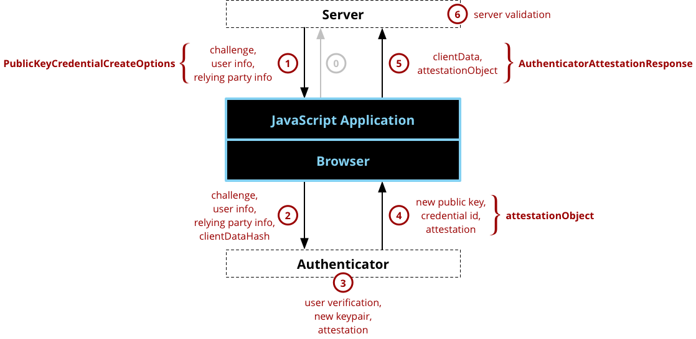

用户的注册过程如上图所示。

第 0 步，用户代理请求注册，WebAuthn 没有规定这个请求的协议和格式，用户代理和服务端之间可自行约定。

第 1 步，服务端生成 challenge 以及其他必要信息，返回给用户代理。WebAuthn 同样没有规定这个过程的协议和格式。

第 2 步，用户代理将这些信息交给认证器，并提示用户进行验证。

第 3 步，用户验证通过后，认证器首先会生成一对公钥-私钥，并存储私钥、用户信息以及请求登录的域名。之后，认证器会使用私钥对服务器返回的 challenge 进行加密。

第 4 步，认证器将签名、公钥、加密算法、加密数据等数据传递给用户代理。

第 5 步，用户代理将来自认证器的数据加密后发送给服务端。

第 6 步，服务端使用公钥进行解密，验证 challenge 是一致的后，完成整个注册过程。

#### 登录过程

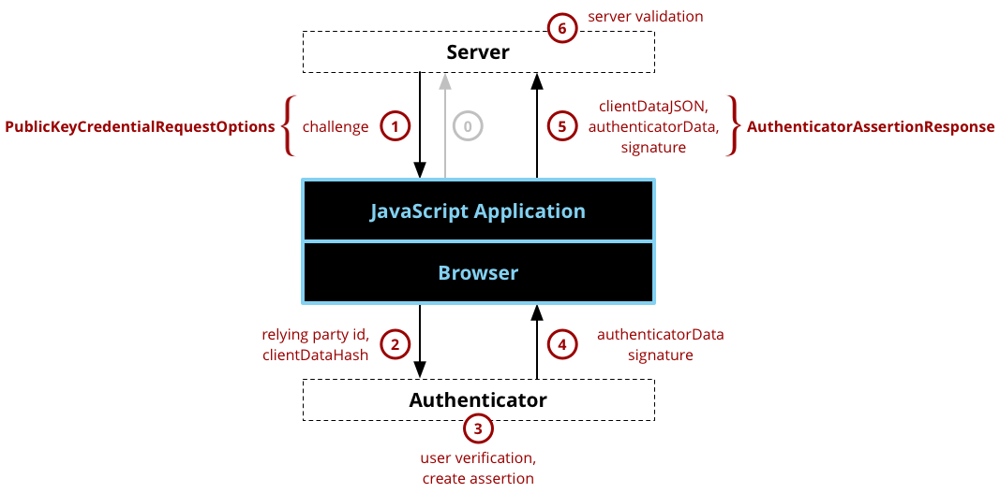

用户完成注册后，再次访问网站，此时就进入了登录流程。

第 0 步，用户代理向服务端发起登录请求。

第 1 步，服务端生成 challenge 以及其他必要信息，返回给用户代理。

第 2 步，用户代理将 challenge、服务端信息及用户信息发送给认证器。

第 3 步，认证器根据用户信息和服务端信息查找之前存储的私钥，用私钥对 challenge 进行签名，然后传回给用户代理。

第 4 步，用户代理将签名后的数据发送给服务端。

第 5 步，服务端接收到数据后，使用公钥对数据进行解密，如果解密出来的 challenge 是一致的，则验证通过。

### passkey 的过程

#### 基本原理

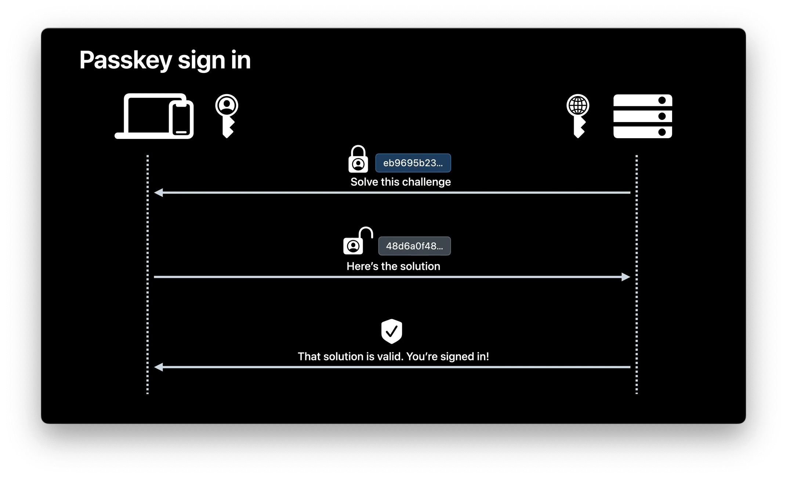

在了解了 WebAuthn 标准的原理后，再来理解 passkey 就会变得容易很多。在 passkey 中，苹果设备上的 TouchID 或 FaceID 充当了认证器的角色，用户注册与登录过程与 WebAuthn 标准无显著的差异。

#### 如何在临近设备上登录

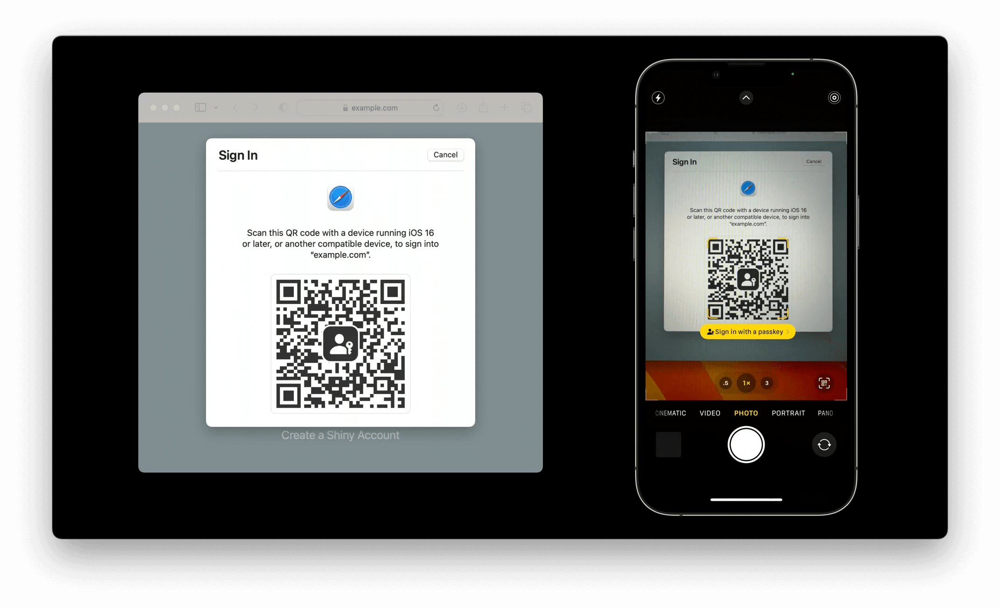
当使用临近设备上保存的 passkey 来进行登录时，流程会稍微复杂一些：

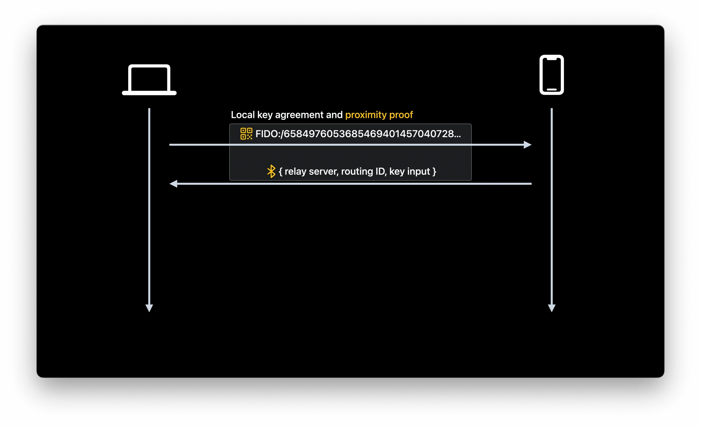
首先，发起登录请求的设备 A 上会产生一个一次性的带有加密密钥信息的二维码，当保存有 passkey 的设备 B 扫描了这个二维码后，B 就会建立起一个中继服务器，然后通过蓝牙广播信息将路由信息、中继服务器的地址进行发送，A 就可以连接到这个中继服务器上。这种本地信息交换不仅起到了选择中继服务器和信息共享的作用，还有两个额外功能：

1. 密钥确认细节对中继服务器来说是透明的，所有通过网络传输的内容都是端到端加密的，中继服务器无法读取。

2. 确保了两个设备在物理位置上的邻近性。由于蓝牙广播是有距离范围的，因此邮件或网页中的二维码，或者是攻击者架设的钓鱼网站是不可能生效的。

当密钥确认完成后，这两个设备会使用刚刚确认的密钥来完成一个标准的 CTAP(Client to Authenticator Protocol，客户端到身份验证器协议) 操作。这整个过程对于中继服务器来说又是不可见的。

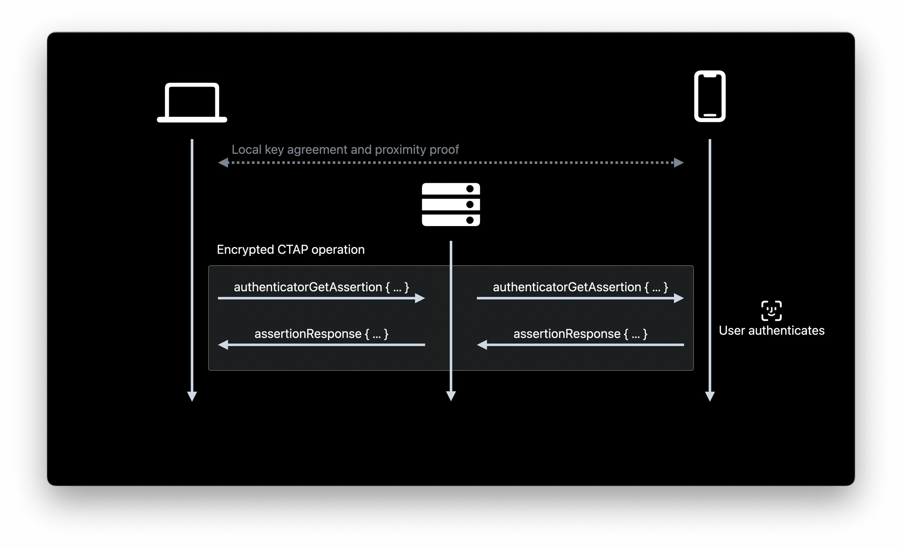
对于整个登录过程而言，参与方只有设备和网络浏览器，而网站并不参与这其中的任何一个环节，因此确保了 passkey 在跨端登录时的安全性。

关于 CTAP 的更多细节，感兴趣的读者可以参考如下文档进行了解：

[Client to Authenticator Protocol, Wikipedia](https://en.wikipedia.org/wiki/Client_to_Authenticator_Protocol)

[CTAP Review Draft](https://fidoalliance.org/specs/fido-v2.1-rd-20191217/fido-client-to-authenticator-protocol-v2.1-rd-20191217.html)

### 小结

综上，passkey 具有如下特点：

1. passkey 使用过程对用户极为简单，用户无需记录密码信息，免去密码维护和泄露的烦恼。

2. passkey 会生成一对私钥和公钥，公钥存在服务器上，私钥存在用户设备上，因此不会再出现密码泄露问题。

3. 可以跨设备、跨平台共享 passkey 信息，同时保证极高安全性。

## passkey 的使用

### 为后端适配 passkey

如果希望能在应用或者网站上使用 passkey 来进行用户注册和登录，那么应用或网站的服务端需要支持 WebAuthn 标准。目前已经有很多语言的开源项目实现了 WebAuthn 标准，你可以在你的后端程序中引入这些开源项目，或者参考它们的代码进行实现。

Go：[duo-labs/wenauthn](https://github.com/duo-labs/webauthn)

Java: [webauthn4j](https://github.com/webauthn4j/webauthn4j)

Python: [py_webauthn](https://github.com/duo-labs/py_webauthn)

你可以在这个[网站](https://webauthn.io/)上找到更多语言对应的 webauthn 实现。

### 为应用适配 passkey

#### 基本流程

在苹果平台上，passkey 是 AuthenticationServices 框架下 ASAuthorization API 的一部分，这个框架本身也是用来处理各种不同的认证类型，如密码、密钥和苹果登录等。适配 passkey 仅需要进行如下几个步骤：

首先，需要在 webcredentials 下设置 associated domains：

```
{
    "webcredentials": {
        "apps": [ "A1B2C3D4E5.com.example.Shiny" ]
    }
}
```

其次，用于输入用户名的文本框的 textContentType 需要是 .username，这样系统才会知道在这里可以提供 passkey 填充建议：

```
override func viewDidLoad() {
    super.viewDidLoad()
    //Additional setup…

    userNameField.textContentType = .username
}
```

然后，按照 WebAuthn 标准流程，创建一个自动填充的 passkey 请求：

```
func signIn() {
    let challenge: Data = … // Fetched from server
    let provider =
        ASAuthorizationPlatformPublicKeyCredentialProvider(
            relyingPartyIdentifier: "example.com")
    let request =
        provider.createCredentialAssertionRequest(
            challenge: challenge)

    let controller =
        ASAuthorizationController(
            authorizationRequests: [request])
    controller.delegate = self
    controller.presentationContextProvider = self

    // Start the request
    controller.performAutoFillAssistedRequests()
}
```

最后，处理用户认证成功与否的回调。

（1）认证通过时，从回调中取出加密算法与原始数据，发往服务端进行校验：

```
func authorizationController(controller: ASAuthorizationController,
     didCompleteWithAuthorization authorization: ASAuthorization) {
    
    guard let passkeyAssertion = authorization.credential as?
        ASAuthorizationPlatformPublicKeyCredentialAssertion
    else { … }

    let signature = passkeyAssertion.signature
    let clientDataJSON = passkeyAssertion.rawClientDataJSON

    // Pass these values to your server, and complete the sign in
}
```

（2）认证失败，如用户取消认证时，进行相应处理：

```
func authorizationController(controller: ASAuthorizationController, 
    didCompleteWithError error: Error) {
    
    guard let error = error as? ASAuthorizationError else { … }

    if error.code == .canceled {
        // Either the user canceled the sheet, or there were no credentials available.
        showSignInForm()
    }
}
```

通常说来，通过自动填充来使用 passkey 是最为方便的使用场景。但如果用户需要用其他用户名来登录，那么只需要将第 1 步中开始请求的方法调用从

```
controller.performAutoFillAssistedRequests()
```

换为

```
controller.performRequests()
```

这样在用户输入用户名后，就会弹出弹窗供用户选择已有的 passkey 或者使用其他设备来登录。用户确认或取消的行为仍然会触发相同的回调函数。

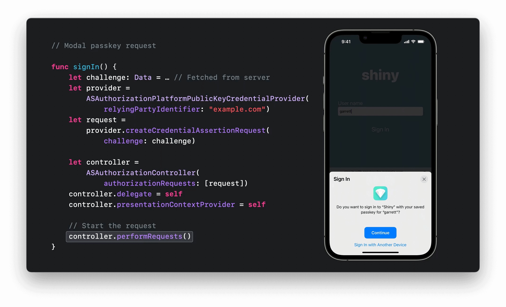

#### 过滤设备上的 passkey

当用户输入用户名后，系统上可能存储着这个用户名在多个应用或网站上的 passkey，在默认情况下，这些 passkey 都会被展示出来，供用户选择，但这样无疑提高了用户登录的复杂度。因此可以通过 passkey 允许列表，来过滤掉一些和当前应用不相关的 passkey，简化用户的选择过程。为此，我们需要根据用户名，在 server 上查找这个用户名对应的 credential ID 列表，由于 credential ID 和 passkey 是一一对应的，所以可以用这个 ID 列表来过滤设备上存储的 passkey。

```
func signIn(userName: String) {
    let challenge: Data = … // Fetched from server
    let provider = ASAuthorizationPlatformPublicKeyCredentialProvider(
        relyingPartyIdentifier:"example.com")
    let request = provider.createCredentialAssertionRequest(
        challenge: challenge)

    let credentialIDs: [Data] = … // Fetched from server for provided userName
    request.allowedCredentials = credentialIDs.map(
        ASAuthorizationPlatformPublicKeyCredentialDescriptor.init(credentialID:))

    let controller = ASAuthorizationController(authorizationRequests: [request])
    controller.delegate = self
    controller.presentationContextProvider = self

    // Start the request
    controller.performRequests()
}
```

#### 如果当前设备上不存在 passkey

当用户输入用户名后，如果当前设备上不存在对应 passkey，那么会默认展示一个二维码，供用户使用邻近的设备进行登录。但 API 也提供了一个选项，当不存在 passkey 时，可以进行自定义的处理。

在上面示例代码中，如果在 performRequest 时传入了 `.preferImmediatelyAvailableCredentials` 参数，那么当设备上存在 passkey 时，将如同普通 request 一样正常展示 passkey 选择弹窗；如果不存在 passkey 或发生错误，那么此时你将接收到一个回调，这个回调带有错误参数，可以通过错误参数来判断是否是用户手动取消或者是不存在 passkey，从而回退到使用密码登录的普通登录模式上。

```
func signIn() {
    let challenge: Data = … // Fetched from server
    let provider = ASAuthorizationPlatformPublicKeyCredentialProvider(
        relyingPartyIdentifier:"example.com")
    let request = provider.createCredentialAssertionRequest(
        challenge: challenge)

    let controller = ASAuthorizationController(authorizationRequests: [request])
    controller.delegate = self
    controller.presentationContextProvider = self

    // Start the request
    controller.performRequests(options: .preferImmediatelyAvailableCredentials)
}
```

#### 组合认证

如果应用支持通过密码、passkey 或者苹果登录等多种方式来进行登录，那么通过将这些认证方式组合起来，就可以为一个单一账号提供多种登录方式的支持。

```
// Combined credential modal request

func signIn() {
    let challenge: Data = … // Fetched from server
    let passkeyProvider = ASAuthorizationPlatformPublicKeyCredentialProvider(
        relyingPartyIdentifier:"example.com")
    let passkeyRequest = passkeyProvider.createCredentialAssertionRequest(
        challenge: challenge)

    let passwordRequest = ASAuthorizationPasswordProvider().createRequest()
    let signInWithAppleRequest = ASAuthorizationAppleIDProvider().createRequest()

    let controller = ASAuthorizationController(
        authorizationRequests: [passkeyRequest, passwordRequest, signInWithAppleRequest])
    controller.delegate = self
    controller.presentationContextProvider = self

    // Start the request
    controller.performRequests()
}
```

此时，无论用户选择了何种登录方式，你都会收到相同的回调，之后你需要在回调中根据用户的选择来进行相应的登录逻辑：

```
func authorizationController(controller: ASAuthorizationController, 
     didCompleteWithAuthorization authorization: ASAuthorization) {

    switch authorization.credential {
    case let passkeyAssertion as ASAuthorizationPlatformPublicKeyCredentialAssertion:
        finishSignIn(with: passkeyAssertion)

    case let signInWithAppleCredential as ASAuthorizationAppleIDCredential:
        finishSignIn(with: signInWithAppleCredential)

    case let passwordCredential as ASPasswordCredential:
        finishSignIn(with: passwordCredential)

    default:
        // Handle other credential types
        break
    }
}
```

### 为网页适配 passkey

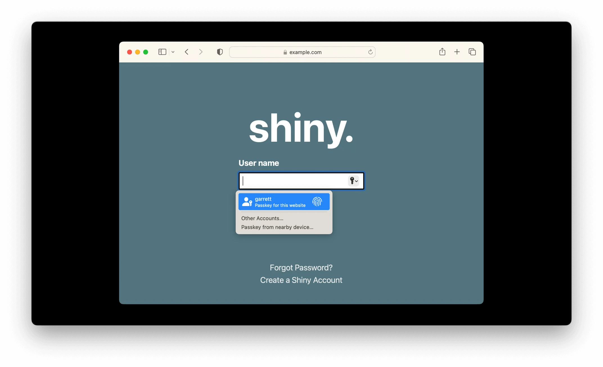

当希望用户登录过程能使用 passkey 时，那么用户名输入框的 autocompletion 属性需要设置为 `username webauthn`。

```
<input type="text" id="username-field" autocomplete="username webauthn" ></input>
```

通过自动填充来使用 passkey 的基本流程如下：

```
function signIn() {
    if (!PublicKeyCredential.isConditionalMediationAvailable ||
        !PublicKeyCredential.isConditionalMediationAvailable()) {
        // Browser doesn't support AutoFill-assisted requests.
        return;
    }

    const options = {
        "publicKey": {
            challenge: … // Fetched from server
        },
        mediation: "conditional"
    };

    navigator.credentials.get(options)
        .then(assertion => { 
            // Pass the assertion to your server.
        });
}
```

首先应该先通过 `PublicKeyCredential.isConditionalMediationAvailable` 来判断当前浏览器是否支持自动填充，不支持就直接返回。如果支持，剩余流程同 passkey 原理一节中 WebAuthn 登录的过程是一致的。

当用户手动输入用户名时，只需将上述代码中 options 中的 mediation 字段移除掉：

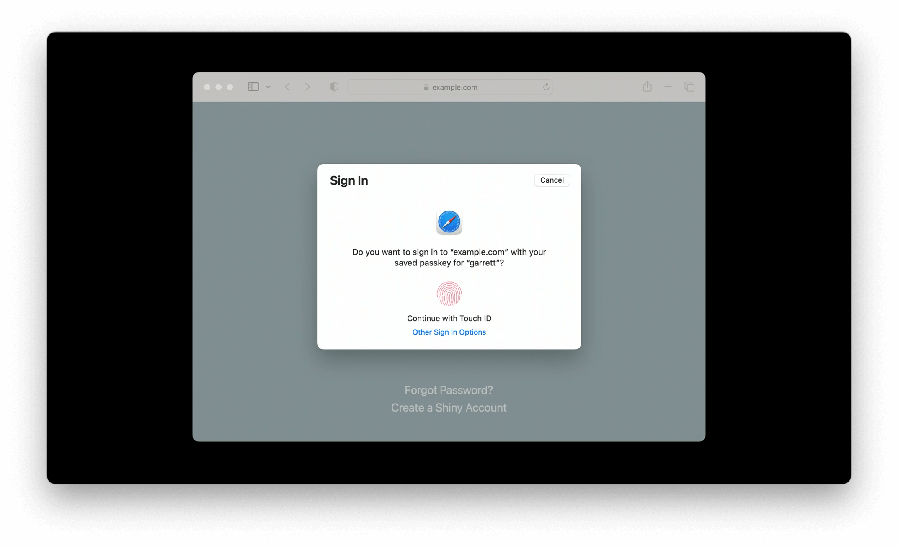

如果你的网页是基于 WordPress 的，那么可以使用 [WP-WebAuthn](https://wordpress.org/plugins/wp-webauthn/) 这款 WordPress 插件来支持 WebAuthn。这个插件的作者也在其[网站](https://flyhigher.top/develop/2160.html)上提供了一个 Demo，可以体验下在网页上使用 WebAuthn 的效果。PS，推荐阅读该作者的这篇[《谈谈 WebAuthn》](https://flyhigher.top/develop/2160.html)，对 WebAuthn 标准做了很深入的分析和介绍。

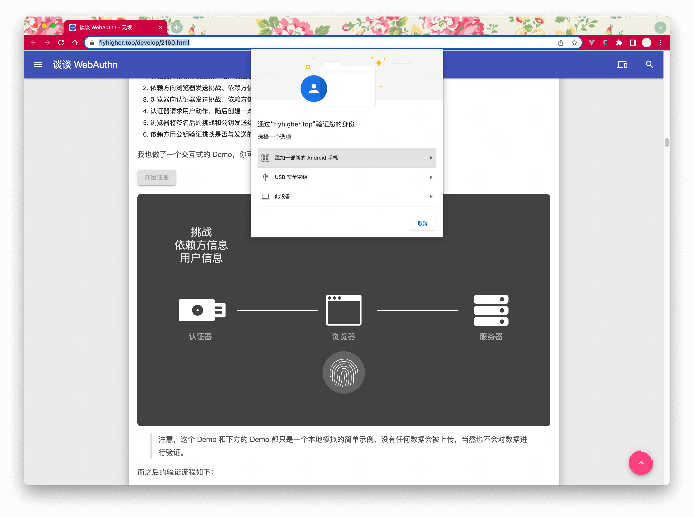

## 总结

本文简要介绍了 passkey 的定义、原理和使用方式。从苹果在 Demo 中展示出来的使用方式来看，passkey 兼顾了用户体验和安全性，是解决密码泄露等安全问题的强有力的手段。不过，要想提供对 passkey 的支持，需要客户端、前端、服务端三方添加支持，才能提供良好的体验，对于国内以微信、支付宝、抖音等扫码登录为主的大环境下，往往需要产品经理、技术人员在开发成本和 ROI 上达成一致，这可能需要比较长的路要走。尽管如此，还是希望 passkey 能更早更广泛地被应用和适配，以方便我们每一个人的数字生活。
