# Session 10096 - What’s new in privacy

本文基于[Session 10096](https://developer.apple.com/videos/play/wwdc2022/10096/ )梳理。

> 作者：西瓜超人，iOS 开发程序媛，现就职于米哈游平台组

> 审核：

## 本文知识概况

近几年的 WWDC 苹果开发者大会上一直在更新用户隐私相关的内容，对用户隐私的严格重视和出色的隐私保护能力受到用户的广泛认可和喜爱。今年关于隐私技术更新的内容相对较多，下面是本文的知识概况：

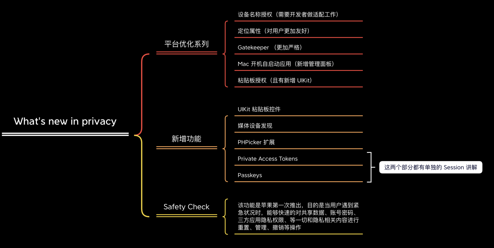

## 前言

想要开发出一个能够保护用户隐私的 App 其中的几个重要因素有：

**数据最小化：** 仅使用构建项目所需的数据。

**本机处理：** 当我们使用敏感数据时，尽可能的避免与服务器共享。

在实际的业务场景中，想要做好用户行为分析，必不可少的需要上传服务器，此时就我们做好隐私数据的防护工作。

**知情权和控制权：** 当我们必须要将敏感数据共享给服务器时，一定要确保操作该数据的行为已经被用户所授权，并且是公开透明的。

**安全保护措施：** 包括设备的开机、关机状态，敏感数据的动态传输、静止状态都需要保护措施。

## 平台更新

iOS 16 和 macOS Ventura 的这次更新中，其中 Location attribution 可以给用户带来直观的视觉感受，其他内容有要开发者做少许的适配工作，下面一一介绍。

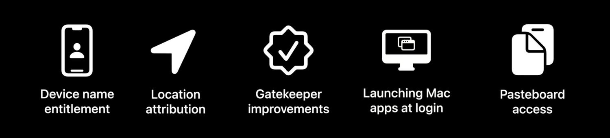

### 设备名称权限

UIDevice API  允许我们获取设备名称的几种情况大概是这样的

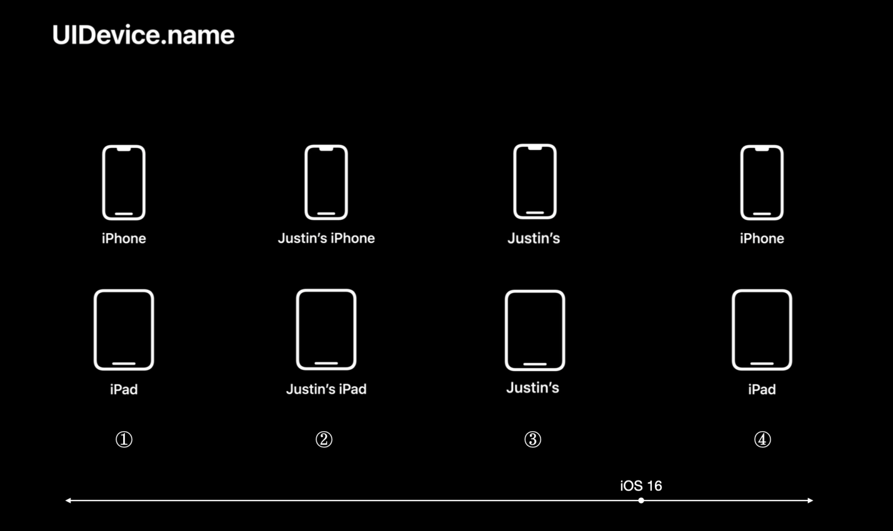

在 iOS 16 之前：

- 从未登录过 iCloud 账户时，我们获取的设备名称如图 ①
- 当我们登录了 iCloud 账户时，由于系统为了便于识别设备，默认情况下，iOS 上的设备名称中会包含苹果 ID 帐户中的用户名，所以获取的设备名称如图 ②
- 当然，如果我们在【设置/通用/关于本机/名称】路径设置过昵称时，我们获取的到的设备名称如图 ③

在 iOS 16 之后：为了更好的保护用户隐私，无论我们是否登录 iCloud 账户，或者是否在设置中自定义过自己的设备名称，UIDevice API 都只会返回设备型号，如上图 ④

当然苹果官方也考虑到我们业务需求，比如说一些允许多设备登录的 App 的场景有：

- 向用户展示最后一次编写文档的位置
- 该用户已经登录过哪些设备

在这种需要在 App UI 上向用户明确展示设备名称的情况，只需要在 entitlement 申请设备名称权限，我们就可以和 iOS 16 之前一样获取到用户设备的真实的、可识别的名称了。

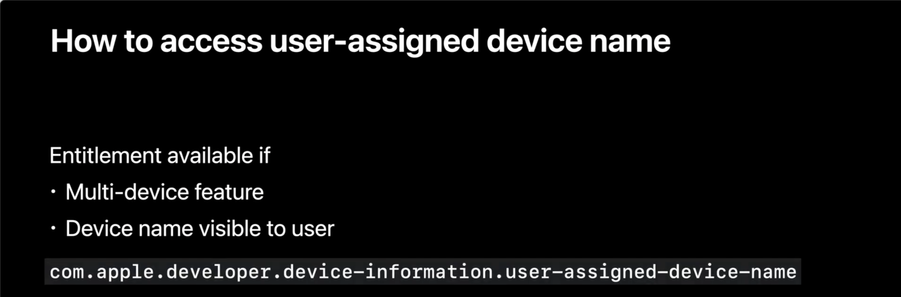

### 位置属性

定位指示器的更新更多的是给用户的，让用户更加明确的知道是哪个 App 在后台使用定位功能。但对于开发者来说，没有额外的开发操作。

在使用定位权限的 App 中，现在 iOS 在状态栏中仅显示一个箭头，从 iOS 16 开始将 Control Center 向下滑动会明确指出是哪个应用程序正在使用定位，防止用户在看到定位指示图标闪烁时晕头转向，不知道是哪个 App 在操作。

### GateKeeper

GateKeeper 是 macOS 的一项安全检查功能，为了降低执行恶意软件的可能性，它会强制对已经签名过的代码应用执行验证。
在【系统设置/安全与隐私】中，用户有多个选项，允许从以下位置下载应用程序：

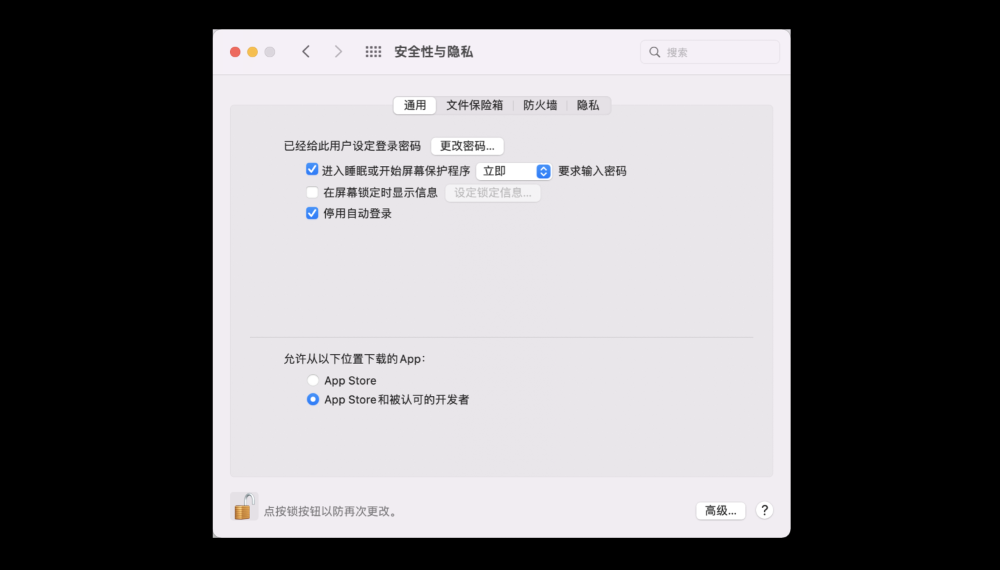

**Mac 应用商店**

- 仅允许启动从【App Store】下载的应用程序。

**Mac App Store 和被认可的开发者**

- 允许启动从【App Store】下载的应用程序和【App Store 和被认可的开发者】的应用程序。这是自 Mountain Lion 以来的默认设置。

**任何地方**（自 2019 年 macOS Sierra 以来，此选项默认隐藏）

- 允许启动所有应用程序。这有效地关闭了 Gatekeeper。

但是以上可选设置，都可以通过终端使用 `sudo spctl --master-disable` 命令并使用管理员密码进行身份验证来重新启用此选项。
（以上均来自维基百科 [GateKeeper_macOS](https://en.wikipedia.org/wiki/Gatekeeper_(macOS))）

**什么是隔离程序？**

官方视频中有提到【隔离程序】，在这里简单介绍下。

现象就是当用户下载 DMG 时，在一些 MAC 上打开应用程序用户会看到【"X.app" 无法打开，因为无法确认开发者身份】这就是【隔离程序】

隔离是下载应用程序（或其中的磁盘映像）的结果。当我们使用浏览器下载文件时，浏览器会附加 ``com.apple.quarantine`` 属性，表明它是来自不受新人的网络来源。其他类型的互联网应用程序（电子邮件、聊天等）也会将该属性附加到下载的文件上。

但是并不是所有的网络下载方式都会将应用附加隔离属性。例如：通过文件共享链接的文件（带有 Finder 的 AFP 或 SMB）不会将其标志位隔离。

那么被标志为隔离属性的应用程序是会被严格执行 GateKepper 检查的，所以会出现【"X.app" 无法打开，因为无法确认开发者身份】现象。解决方案就是在隐私中进行授权（如上图所示）

#### 验证优化

在今年的 OS 系统（macOS Ventura）Gatekeeper 再次强调：

- 验证范围：扩大到所有签名 App，不只是带有隔离标志的 App
- 有效签名：如果不再具有有效签名，在 App 启动时就会被拒绝
- 签名文件：包括所有可执行文件和捆绑包都必须进行签名，并确保在更改应用程序时签名是有效的
- 更新机制：会阻止应用程序以某些形式被修改，修改最常见的方式就是更新啦

那么如何保证同一个开发账户或者团队继续更新签名 App 呢？

#### 配置项 - NSUpdateSecurityPolicy

今年新增了一个配置项，通过配置 info-plist 中【NSUpdateSecurityPolicy】来限制是否允许其他开发团队去更新你的 App 还是仅限于你自己去进行更新操作：

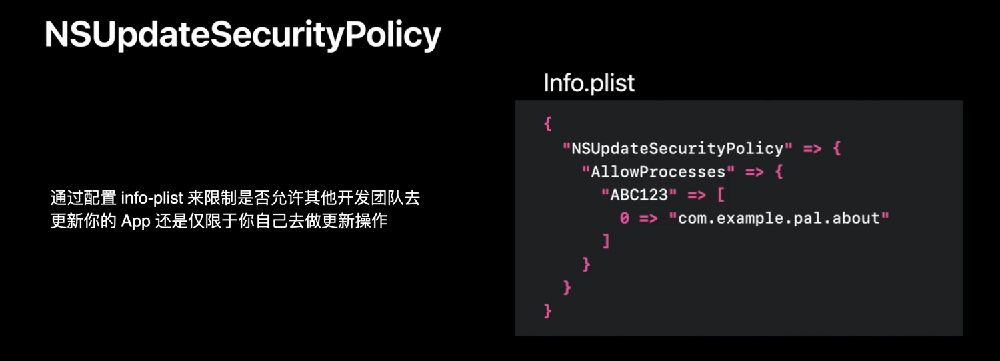

官方特意举了一个例子，指出我们只需按照图中所示去更改 info.plist 文件，既在 `NSUpdateSecurityPolicy` 中添加 Key 为 `AllowProcesses` ，Value 为以 `Team ID` 签名标识符的数组的字典。如此，我们就可以允许【Pal About】去更新【Unrelated App】

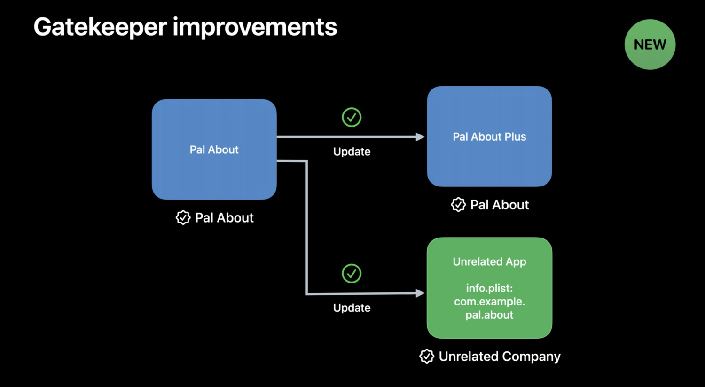

反之，如果一个 App 需要迭代新功能或者修复 bug 来让用户去使用最新版本，但是并没有经过自己开发团队签名或者没有配置 `NSUpdateSecurityPolicy`，那么 macOS Ventura 会拒绝这次更新，并且以通知的方式告诉用户有一个 App 试图去管理其他的 App

在设置中，我们也可以对这个权限进行查看、修改、管理

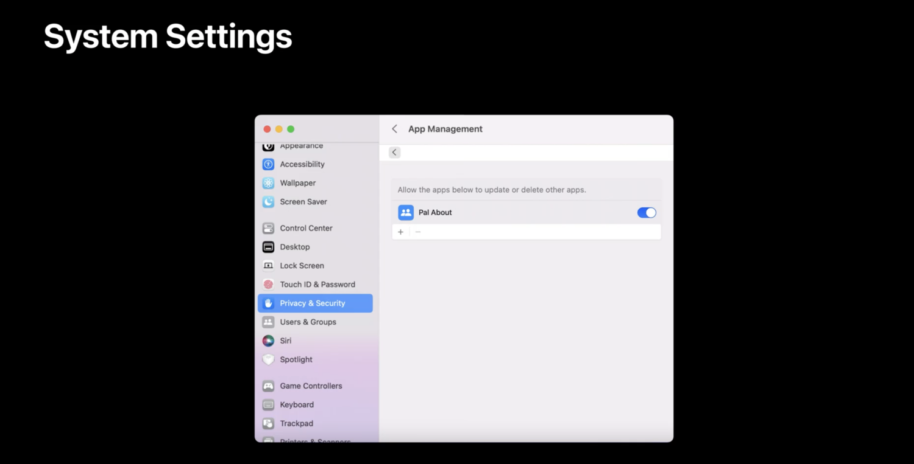

综上，在 macOS Ventura 最新系统中，开发者需要检查自己发布的 App 是否涉及到修改其他 App 的权限，如果有，一定要设置 `NSUpdateSecurityPolicy` 确保已某些业务流程能够顺利走通。

### Mac 开机自启动应用

在 macOS Monterey 之前的系统，当用户登录 Mac 时 某些 App 是可以【启动代理】和运行【守护进程】，这是直译，不是很好理解，在这里简单介绍一下。

【守护进程】英⽂叫 Daemon，守护进程其实就是在后台运⾏的程序，它没有界⾯，你看不到它，⼀般使⽤命令来对它进程管理控制，守护进程常被设置为开机⾃动启动（当然也可以开机后⼿动⽤命令启动），很多软件的“服务器端”⼀般都是以守护进程的⽅式运⾏，⽐如数据库、内存缓存、Web 服务器等等都是以守护进程⽅式运⾏的。

daemons 和 agents 都是 Launch 所管理的后台程序，它们的区别是 agent 是属于当前登录⽤户（就是你开机后输⼊密码时的那个⽤户名），它们是以当前登录的⽤户权限启动的，⽽ daemon 则属于 root ⽤户，但由于有 root ⽤户权限，所以它可以指定以什么⽤户运⾏，也可以不指定（不指定就是以 root ⽤户运⾏）

这更加方便我们去做其他业务，例如可以去做 APP 运行助手，还可以在后台检查软件更新，或跨多个 App 同步数据。

在方便的同时，苦恼也随之而来，当我们开机时，这样的应用程序就会在我们不知情的情况下自启动，不仅增加了我们的开机时间，当某些 App 在使用传感器、位置等敏感数据时，用户并不知情，就像上面所解释的 daemon 不可见。

因此在 WWDC 22 这次更新的系统 macOS Ventura 中，给我们开发者清晰的指出了在登录时可以使用的机制。

#### 用户通知

默认情况下，App 是被允许开机自启动，但需要通知给用户

#### 系统设置

通过点击【通知消息】或者直接去【系统设置】，用户就可以直接管理开机时所有 App 的自定义操作了，需要注意的是如果你的 App 申请了【守护程序】等操作时，则需要更高的管理员权限才可以。

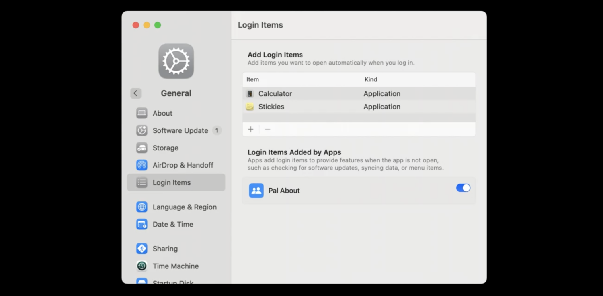

系统设置包括：

- 【添加/删除】开机自启动 App
- 当应用程序未打开时，可以添加登录项提供一些功能，例如检查软件更新、同步数据或菜单项。

#### SMAppService API 的使用

以上这些权限都是通过官方提供的 SMAppService API 达到最终目的

- 登录时获取启动资源
- 不需要额外安装程序来编写启动代理或创建清理脚本，因为所有的 agents 和 daemons  都已经打包在应用程序中
- 适用于所有的 Mac App Store Apps

通过调用 SMAppService API，就可以让用户随时收到通知，并且会自动获取 App Icon 显示在系统设置中

### 粘贴板权限

在 iOS 16 之前当 App 内发生复制/粘贴时，会有一个半透明的通知弹窗让用户知道何时发生了粘贴操作。在 iOS 16 之后，系统会确认所有访问其他用 App 的粘贴意图。甚至如果 App 继续使用 UIPasteboard API 进行复制粘贴操作，系统会弹窗提示

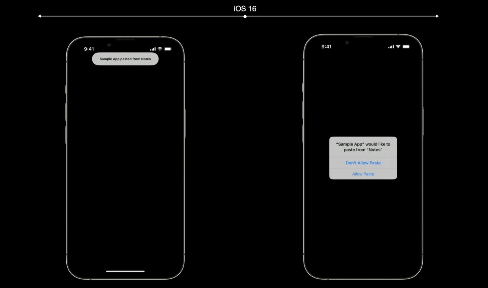

只要复制粘贴就要弹窗提示也是一件好可怕的事情，好消息是官方提供了 3 个方法来避免这个弹窗的问题：

- 使用 Edit Options
- 使用键盘快捷键
- 新的 UIKit Paste 控件（新增功能）

## 新增功能

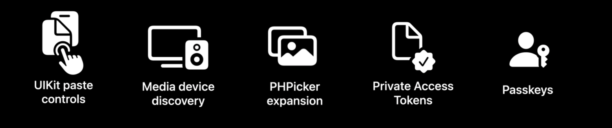

### 粘贴控件

新增的 UIKit paste controls 控件可以让 App 用户让用户直观的明确粘贴含义，并且通过点击按钮直接访问 pasteboard，最主要的就是，这个新增 paste controls 可以在不使用 edit options、键盘快捷键或者系统提示的情况下直接粘贴

paste controls 简单介绍：

- 系统通过验证 paste control 是否【显示】并且点击【确认】粘贴操作
- 支持自定义按钮 UI 样式，例如：更改圆角、文本、图标、背景色
- 需要保证按钮不被隐藏，清晰显示在界面，否则功能无效

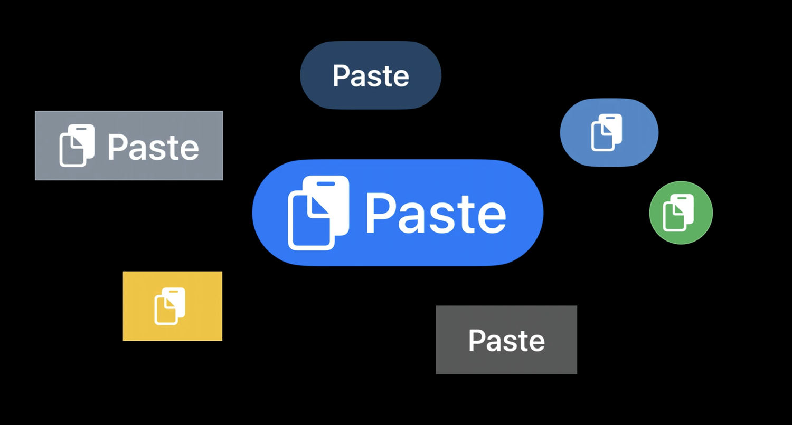

### 媒体设备发现

媒体设备发现（media device discovery）无需接触数据，这比最大限度减少数据访问更加安全。

现在市场上的应用必不可少的使用了流媒体协议、发现设备以及设备通信等逻辑，比如说，音乐类型 App、智能家居、互联网汽车，使用这些协议来完成联网设备的发现以及通信、蓝牙设备的链接、音频流的输出来提升用户视觉、听觉、生活等完美的感受。

想要完成这些功能，前提就是 App 需要获得访问本地网络的权限、蓝牙权限，因此会给相互依赖的其他隐私数据带来一些风险，例如当你在进行其他授权需要确认身份，此时需要您的生物识别，这就是风险之一。

#### What - Media device discovery

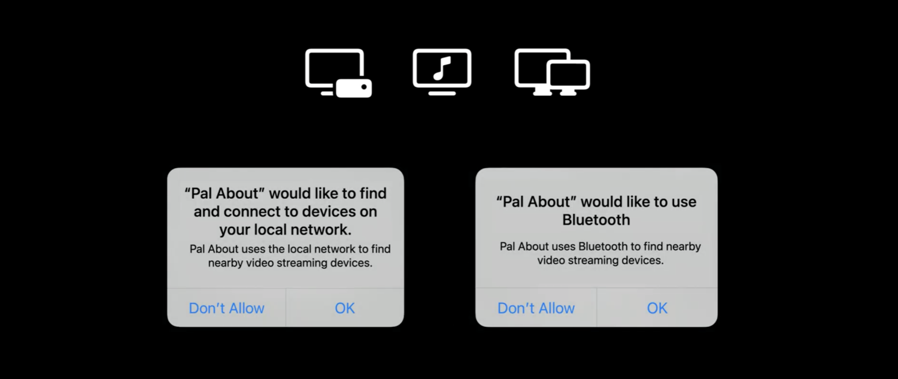

通过 Media device discovery 可以将流媒体信息传输到选定的设备上，但是不需要显示获取网络或者蓝牙等方位权限弹窗。

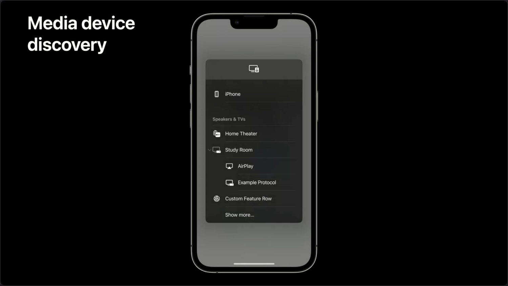

流媒体与 AirPlay 一样都是显示在选择控制器中，并且 App 只能看到能够将流媒体信息传输上去的设备

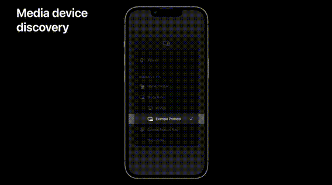

#### How

在多媒体选择控制器上只会显示我们能使用的设备，这都是因为有 DeviceDiscovery extensions 给我们带来的扩展功能。那么对于苹果用户、开发者、流媒体供应商等相关人员应该如何协同工作一起实现 Media device discovery 呢？

**从 Apple 开发者角度可以总结为以下几点：**

- 可以搜索本地网络和蓝牙设备，但是与 App 分开放在不同的沙盒中，因此不能将扫描的结果返回给 App 内部
- 这意味着 App 无法看到整个网络、蓝牙设备等信息，也就不需要申请这些隐私权限
- 但是，这些扫描到的信息是允许以附件的形式发送给 DeviceDiscovery extensions 框架的
- 最终，通过 DeviceDiscovery extensions 框架将这些被发现的设备信息显示在选择控制器中
- 选择要通信的设备后，系统就允许通过 DeviceDiscovery extensions 进行通信工作了

**从流媒体供应商角度，Providers 需要做的事情可以总结为以下几点：**

- 使用 DeviceDiscoveryExtension 创建应用程序扩展
- AVRoutePickerView 来处理用户的选择
- 在协议里处理用户选择的网络设备
- 可以下载示例应用程序和扩展以便了解更多内容

**从 Apple 应用开发者的角度可以总结为：**

使用并实现流媒体供应商开发完成的 Media device discovery SDK，就可以实现 DeviceDiscoveryExtension
这样一来，我们既可以使用流媒体数据通信，并且不需要过去的权限授予，防止隐私泄露啦。

### PHPicker API

PHPicker API 提供了仅访问所需要照片的权限就可以不显示弹窗。（PHPicker 仅在 macOS Ventura、watch OS 9 上生效）

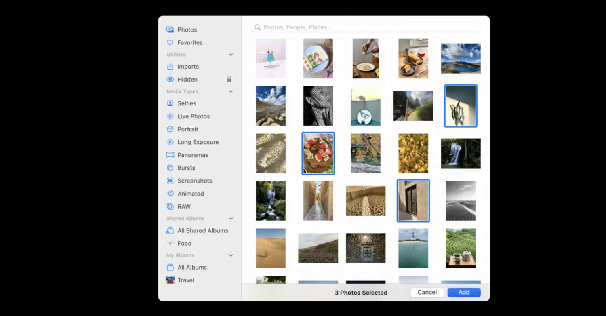

### Private Access Tokens（PAT）

在苹果举行 WWDC22 的同一时间（既 2022/06/09）Cloudflare 公司也隆重推出 PAT，其目的是为了代替验证码（CAPTCHA）来保证用户的真实性。官方描述是这样的：
> 这是一种完全无形和隐私的方式，用于验证访问网站的是真实的用户。如果访问者使用支持这些工具的操作系统，包括即将发布的 [macOS 和 iOS 版本](https://developer.apple.com/wwdc22/10077)，能够证明他/她们是真实的人，则无需填写验证码（CAPTCHA）或提供个人信息。这对用户而言，验证码几乎完全消失了

#### 这对我们来说的意义是

**用户：**

- 将会提高更愉快、更私密的 Web 体验
- 再也不用通过验证码的方式保证“您”的真实性

**苹果开发人员：**

- 用户是来自真实的设备、已签名的应用等，都由设备提供商直接验证，无需和服务器进行兑换。
- DeviceID 保持私有
- 不需要接入复杂的 SDK
- PAT 是包含在 Privacy Pass IETF 协议中的，所以完全可以代替 CAPTCHA（验证码）

想要了解更多关于 PAT 请移步 [老司机技术：验证码的代替者 - 私有访问凭证](https://xiaozhuanlan.com/topic/6437105829)

### Passkey

在互联网的环境中，我们离不开的就是账号和密码，随着种类繁多的 App 的出现、办公环境的需求我们有永远记不完的账号和密码。其中密码是验证账户和保护个人数据安全的核心，因此如何保护密码是非常重要的。但是在日常生活中为了能够记住密码，我们可能存在的操作是存在危险的，你是是否中招了呢？

- 创建及其简单的规则
- 多个网站用同一个密码
- 或者记在小本本上...

这几种类型极易泄漏、被网络钓鱼，且一个出问题可能代表着所有的都有问题，是很可怕的！！！

#### 什么是 Passkey

- 更加健壮的身份验证解决方案
- 具有和密码自动填充非常有好的 UI 样式，和 FaceID、TouchID

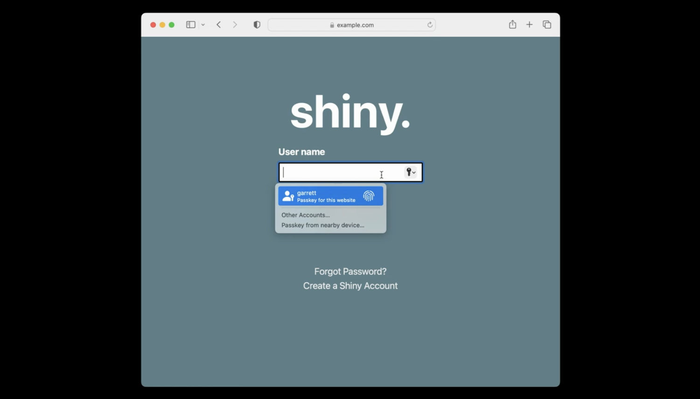

- Passkey 是建立在公钥加密的基础之上，所以即使被泄露，也不用过度担心，但是存在服务器的值也不能太弱。
- 因为 passkey 是与对应网站直接链接的，所以不必担心被仿冒

passkey 是 WWDC22 很重要的一个 Session，详细请看[【老司机技术 - 遇见 PassKey】](https://xiaozhuanlan.com/topic/8042173596)

## 新工具 - Safety Check

以往的使用中，我们可能授权过某人查看照片的权限、共享位置、日历数据等所有隐私相关的信息，但是当我们想要去关闭的时候，入口很难找到，当我们放弃危险也就随之而来了。Safety Check 目的就是让我们可以查看和重置这些授予过他人的访问权限。

### 可以帮我们做什么呢

- 停止与他人共享数据：关闭 FindMy 中的位置共享、停止照片、笔记和日历中的共享
- 停止与 App 共享数据：重置所有第三方应用的系统隐私权限
- 注销其他 iCloud 设备上的 FaceTime 和 iMessage：以确保短信和电话只发送到自己手中的设备
- 注销其他 iCloud 设备：以确保其他设备无法从 FindMy、照片、日历等接收位置更新
- 更改密码：更改设备 和 iCloud 帐户的密码
- iCloud 双重验证码
- 管理紧急联系人：可以根据需要在任何地方进行修改

综上，就是给我们提供了一个一键管理工具

### 使用方式

#### 紧急重置

适用于需要立即重置其他人和应用的所有访问权限的紧急情况，可以进行如下操作：

- 禁止在其他设备上访问 FaceTime 和 iMessage
- 将 iCloud 账户保存到本机上，进而查看紧急联系人和受信任的设备

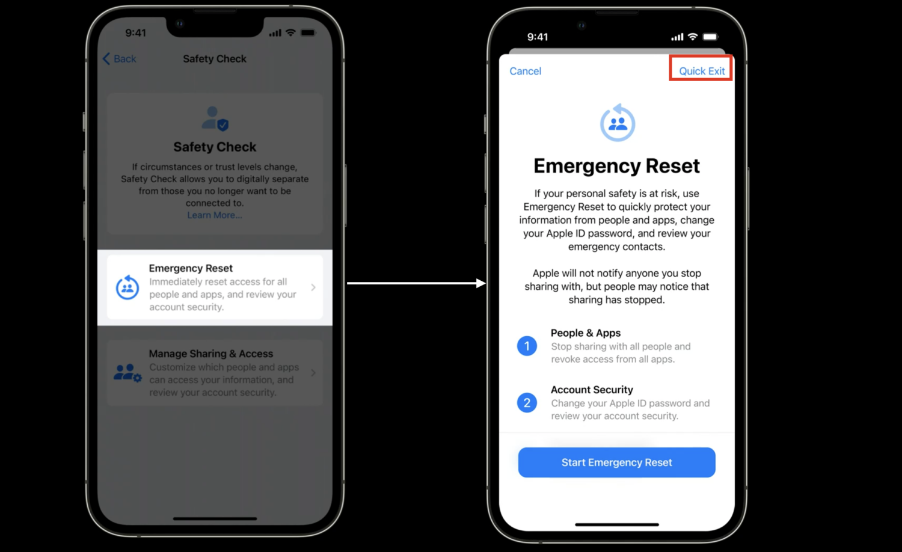

#### 共享和权限管理

通过对共享和权限的管理可以为每个功能提供颗粒度更加微小的控制作用，例如：

- 逐个应用查看其共享对象
- 可以按名称或共享的信息类型对其进行排序
- 协助我们查看具有敏感权限的应用程序

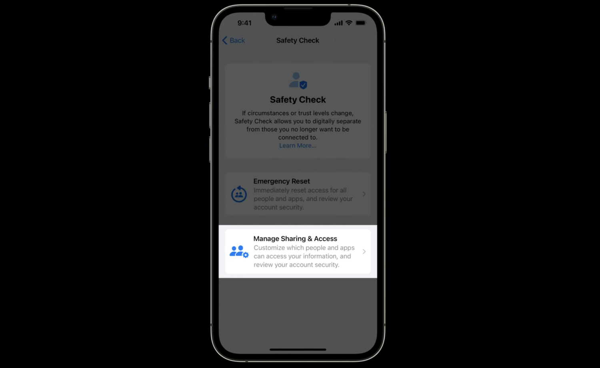

### 特色 - 快速退出

首先声明“快速退出”不是一个功能，但他是所有 Safety Check 流程中很重要的一个步骤。作用就是为了防止其他人有可能会看见你正在操作以上两种中的任一 Safety Check 动作，这就失去了 Safety Check 原本的意义。“快速退出”的操作流程可以比喻为“阅后即焚”，也就是当你点击按钮，会直接回到主屏幕，下次进入系统设置时也是设置首页，也不会再是 Safety Check。

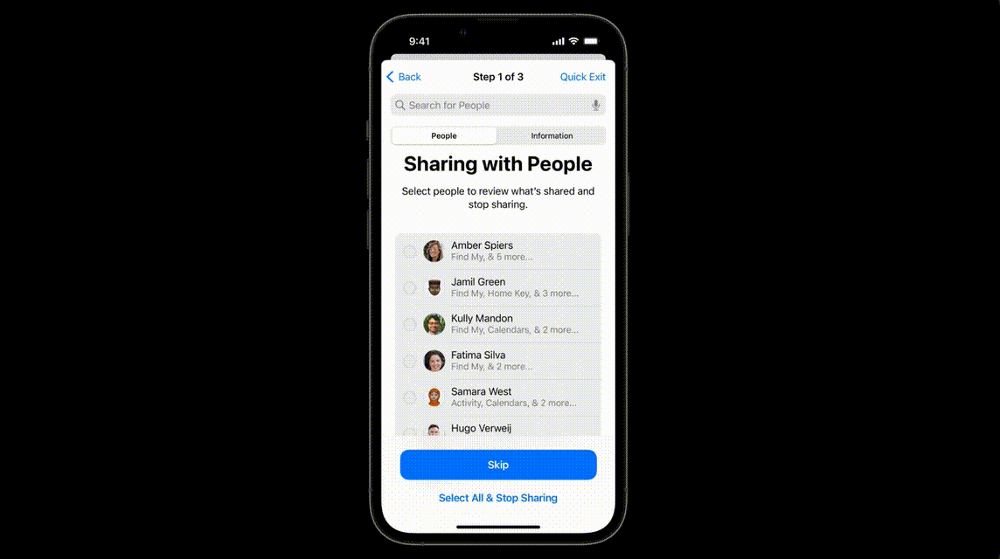

## 小编有话

苹果近几年一直致力于用户隐私保护方向的构建和优化，在技术的不断更新中，同时也给开发者们带来更加复杂的的交互，但是这无疑是增加了我们每个人保护隐私的意识。今年在 UIKit 框架中优化了对用户更加友好的使用后台定位 App 提示，Safety Check、PassKey 等等，这一篇文章更多的是给我们展示了关于隐私架构相关的概况，更多原理相关内容，可以根据文中链接尽情的阅读吧！愿我们的互联网环境的隐私越来越美好。
