# 【WWDC22 10097】What's new in App Clips

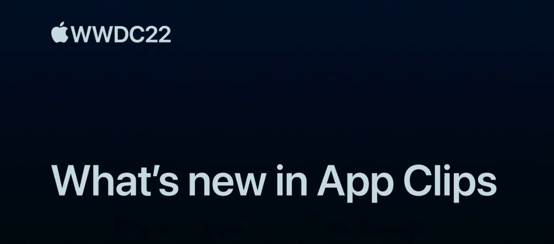

本文基于  [Session - 10097 What's new in App Clips](https://developer.apple.com/videos/play/wwdc2022/10097/) 梳理

## 引子

距离 WWDC20 发布 App Clip，已经过了三年的时间，App Clip 发展的愈来愈加完善。在今年的 session 中，苹果首次提升了 App Clip 的包体积大小限制。同时提供了 App Clip 诊断工具帮助开发者定位和解决 App Clip 配置链接中产生的各项问题。并开放 CloudKit 公共数据库的读取权限给到 App Clip，同时也优化了 keychain 数据的迁移方式。在 App Clip 发展过程中，需要配置很多的 advanced App Clip experiences 来完善各个场景的唤醒方式。如何管理和更新他们也是让开发者头痛的一个问题。因此 App Store Connect 提供了 App Clip experiences web API，旨在自动化此工作流。

今年的更新真是吊足了我们胃口，让我们开始探索吧。

## App Clip 全新的包体积大小限制

App Clip 诞生以来，就以轻而快著称，它为速度而生。App Clip 为了让用户无感知下载的过程，包体积需要做的很小。随着网络基础设施的进步，在 iOS 16 版本，App Clip 的大小限制扩大为 15 MB。给了工程师更多的空间来开发更多有创意的功能。

| 版本      | App Clip 包体积最大限制 |
| --------- | ----------------------- |
| < iOS 16  | 10 MB                   |
| >= iOS 16 | 15 MB                   |

将 App Clip 的最低支持版本设置为 iOS 16 来获得最新的包体积限制。需要注意的是，为了兼容 iOS 15 及以下版本，App Clip 的包体积仍然需要保持 10 MB 以下。

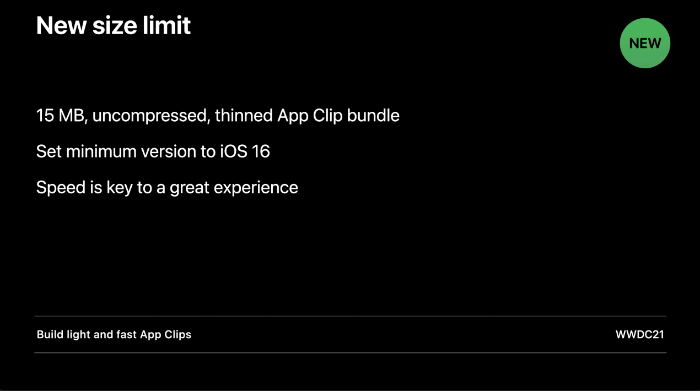

速度，是用户获得出色体验的关键。用户不会永远都处于网络良好的环境，因此优化 App Clip 包体积大小是十分重要的。接下来，介绍下优化 App Clip 包体积的一些方式。

TODO: App Clip 包体积优化方案。

## App Clip 诊断工具

相信各位开发者在开发 App Clip 的过程中，会碰见 App Clip 的配置链接失效的情况。体现为 Safari 顶部的 Clip Card 没有展示，或是扫描 App Clip 二维码直接跳转到官网而不是展示 App Clip Card 等等。出现这种情况的原因有可能是源数据填写问题或是前端 meta tag 配置问题等。排查这些问题是需要各个方位全面进行检查。如果能有个工具来检验配置的链接是否正确，并能标明出现错误的地方那就太好了。现在，它来了！接下来像各位介绍 App Clip 诊断工具的使用方式。

在 iPhone 或 iPad 的设置中，进入 Developer 设置页，在 APP CLIP TESTING 下方选中 Diagnostics，并输入要诊断的 App Clip 配置链接。

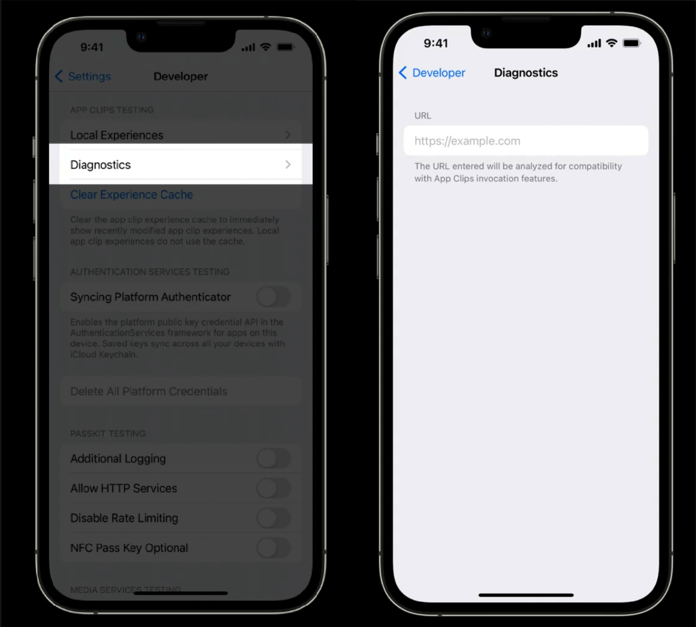

> 1.如设备设置中找不到 Developer 的入口，需手动开启开发者调试模式。使用数据线将设备连接到 Mac 上，并打开 Xcode，点击菜单栏 Window -> Devices and Simulators，在弹出的页面中选中设备。此时设备的设置页面就会出现 Developer 入口。
>
> 2.实测 iOS 15.4.1，已包含 App Clip 诊断工具。

iOS 会检测输入的配置链接，如果配置正确将会看见绿色的复选框。但是，如果配置出错，则会展示黄色的警告符号并表明出错的原因。同时每一个诊断结果都包含对应的文档链接来进一步解释配置步骤。所以现在开发者能确切地看到问题所在。

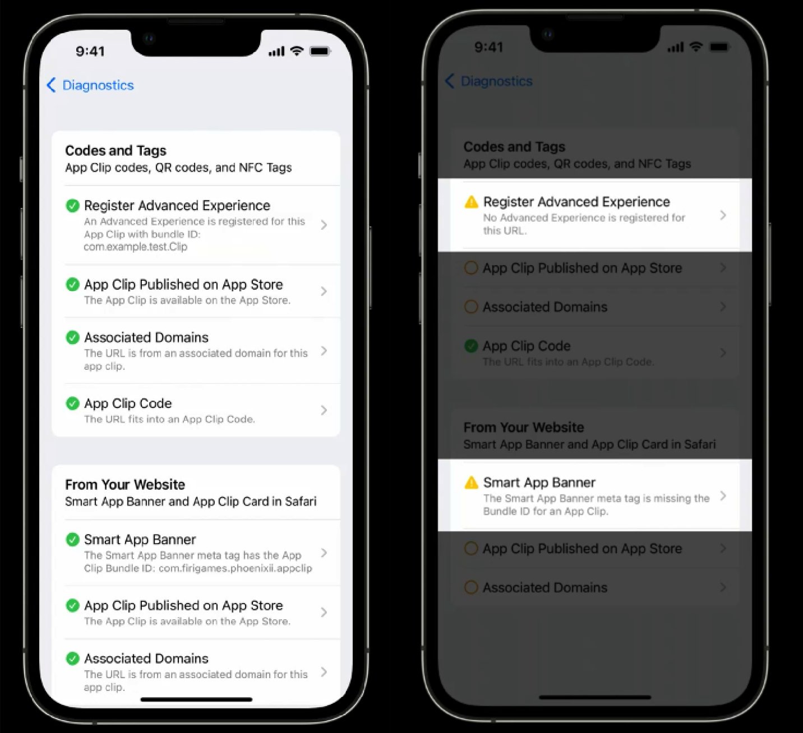

App Clip 诊断工具使用 App Clip Code、Safari、iMessage 来检查，它也会检查开发者的通用链接关联域配置。这个简单的新工具，让 App Clip 的链接配置正确变的更简单。

> App Clip Code 是专属于 App Clip 的二维码。想了解更多关于 App Clip Code 的介绍和配置使用，请参阅 WWDC21 相关内参：[【WWDC21 10012】App Clip 新特性](https://xiaozhuanlan.com/topic/2048796351)。

## CloudKit

CloudKit 是一个框架，可以让您的应用访问存储在 iCloud 上的数据。到目前为止，CloudKit 还不能用于 App Clip。现有的 App Clip 大多数使用服务器来读取数据和资源。

在 iOS 16，App Clip 也可以访问存储在 CloudKit 公共数据库中的数据和资源。现在开发者可以在 App Clip 中和 App Clip 复用相同的代码，访问相同的云端数据。

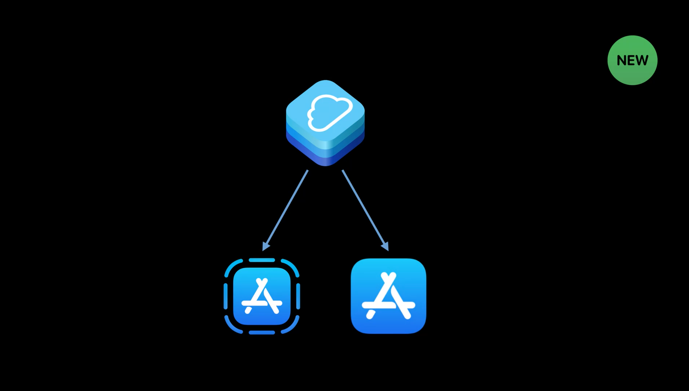

但是在 CloudKit 的使用上，App Clip 同 App 也是有如下几点的区别

- App Clip 只有读取 CloudKit 公共数据库的权限，并没有写入数据的权限。
- App Clip 无法使用 Cloud 文档服务。
- App Clip 无法使用键值对的存储服务。

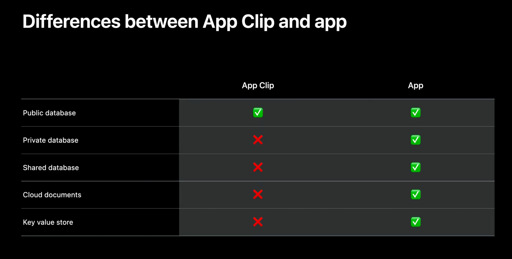

这也兑现了 Apple 当初对用户的承诺，当用户不再使用 App Clip 的时候，iOS 将会删除 App Clip 及其数据。

### 如何在 App Clip 开启 CloudKit

在 Xcode 选中要开启 CloudKit 的 Target，并选中 Signing & Capabilities，并在下方选中你想在 App Clip 中使用的 CloudKit 容器。这个 CloudKit 容器可以是一个全新的，也可以是与 App 共享的容器。

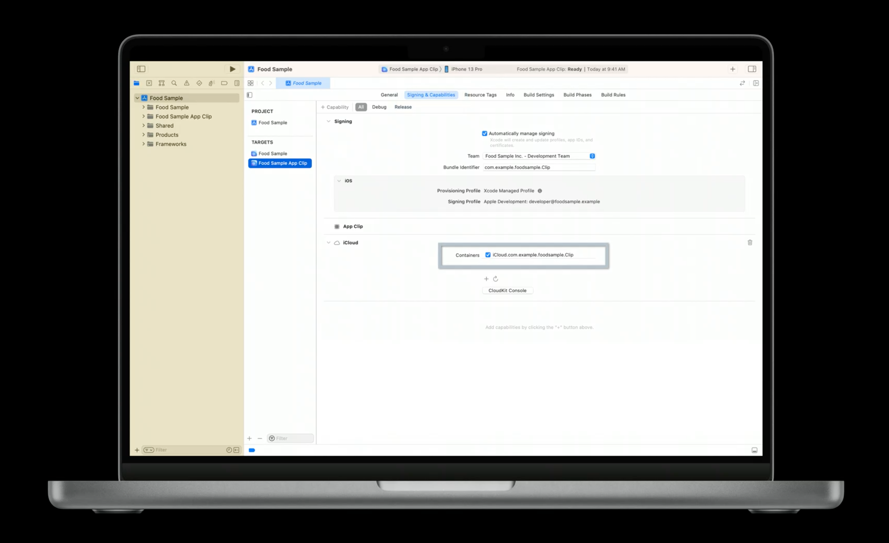

### 使用 CloudKit 访问数据的示例

使用容器的标识符创建一个 `CKContainer`，并获取 `publicCloudDatabase` 属性值。这样就可以从公共数据库中获取你想要的数据了。

```swift
// Read your CloudKit public database from your App Clip

let container = CKContainer.default()
let publicDatabase = container.publicCloudDatabase
let record = try await publicDatabase.record(for:
    CKRecord.ID(recordName: "A928D582-9BB6-E9C5-7881-E4EAF615E0CD"))

if let title = record["Title"] as? String,
    let description = record["Description"] as? String {
        print(“Fetched a food item from CloudKit: \(title) \(description)")
}
```

## 钥匙串迁移

App Clip 的最终目的是将用户吸引到主 App 中，因此在 App Clip 过渡到 App 的过程中，就涉及到了数据转移。

在 iOS 16 之前，当从 App Clip 转移敏感数据（例如身份验证令牌和支付信息）到 App 的过程中，App Clip 会在 App Group 容器中保存这些数据。当用户从 App Clip 升级到完整应用程序后，App 会从 App Group 容器读取传递过来的数据，并将该信息保存在钥匙串中。

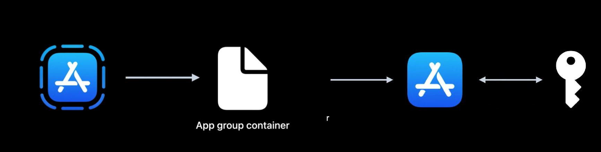

但是，钥匙串是安全存储敏感信息的理想场所。因此在今年推出的新功能则是，App Clip 支持钥匙串数据存储功能。在用户升级到 App 后，保存在 App Clip 钥匙串中的数据会直接迁移到 App 中。

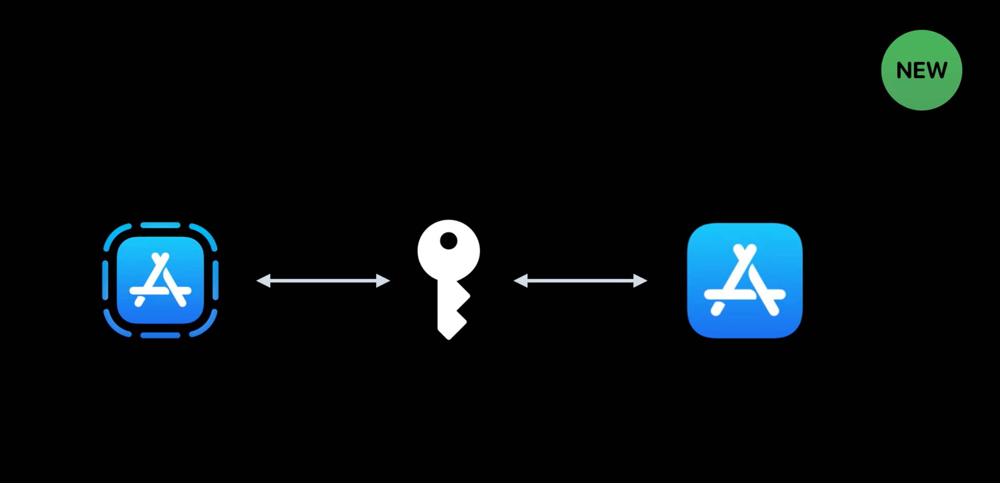

钥匙串在 App 和 App Clip 之间的表现仍是有一些区别。App Clip 不支持共享钥匙串和 iCloud 钥匙串。这些差异也是凸显了 App Clip “用完即走”的特点，当 App Clip 被卸载的时候，iOS 不会保存任何钥匙串信息。

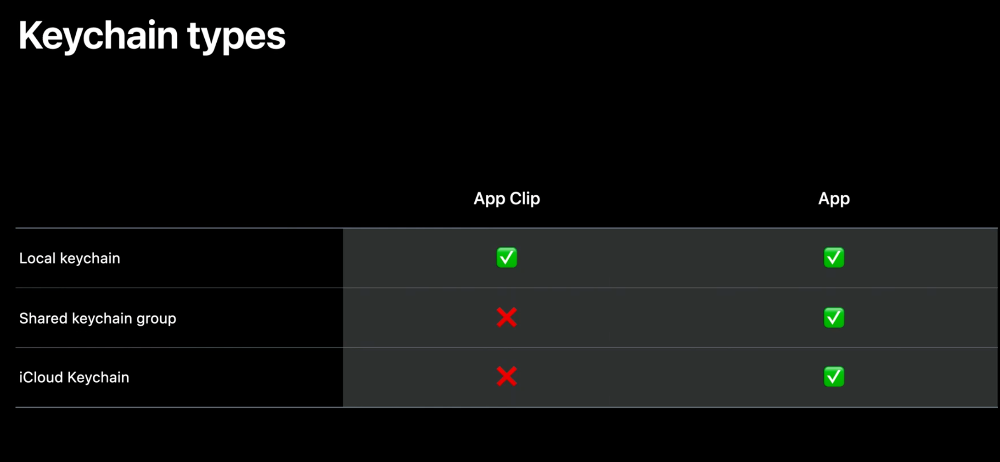

### 使用钥匙串读写数据的示例

开发者可以使用 `SecItemAdd` 添加数据项到钥匙串，使用 `SecItemCopyMatching` 从钥匙串中读取数据项。为数据项添加标签（示例中的 `kSecAttrLabel`），可以在 App 中更好地识别出哪些数据项是从 App Clip 迁移过来的。

```swift
// Write authentication token to App Clip keychain
let addSecretsQuery: [String: Any] = [
    kSecClass as String: kSecClassGenericPassword,
    kSecValueData as String: "smoothie-secret".data(using: .utf8),
    kSecAttrLabel as String: "foodsample-appclip"
]
SecItemAdd(addSecretsQuery as CFDictionary, nil)

// Read authentication token from app or App Clip
var readSecretsQuery: [String: Any] = [
    kSecClass as String: kSecClassGenericPassword,
    kSecReturnAttributes as String: true,
    kSecAttrLabel as String: "foodsample-appclip",
    kSecReturnData as String: true
]
var secretsCopy: AnyObject?
SecItemCopyMatching(readSecretsQuery as CFDictionary, &secretsCopy)
```

> 这段代码同时适用于 App 和 App Clip。

## App Clip experiences API

随着 App Clip 的迭代发展，一个 App Clip 会拥有越来越多的 advanced App Clip experiences，每一个 experiences 都包含独有的信息和定位。开发者需要一种简单的方式来添加和更新这些 experiences。因此，App Store Connect 提供了 App Clip experiences web API，旨在自动化此工作流。接下来让我们看看使用此 API 的示例。

> **解释下什么是 Advanced App Clip Experiences**
> App Clip 的任何唤醒方式，都需要在 App Store Connect 上配置 default App Clip experience。App Clip 有两种体验方式 Default App Clip Experience 和  Advanced App Clip Experiences。
> App Clip 通过 Safari App Banner 或者 iMessage app 中的唤醒方式称为 Default App Clip Experience，这些唤醒方式的相同点都是基于 App Clip 链接。
> 对于更复杂的唤醒情况，可以根据 URL 的不同、地理位置的不同，来提供不一样的 App Clip Card。这类启动方式被称为 Advanced App Clip Experiences。以下几种情况需要配置 Advanced App Clip Experiences
>
> - App Clip 能支持所有的唤醒方式，包括 Map、Spotlight search、QR Codes、App Clip Codes 、NFC tags。
> - 需要将 App Clip 与一个物理位置进行绑定。
> - 需要在不同的域名或子域名上展示 Safari App Banner。
> - 同一个 App Clip 供不同企业使用。
参考：[Configuring Your App Clip’s Launch Experience](https://developer.apple.com/documentation/app_clips/configuring_your_app_clip_s_launch_experience) 

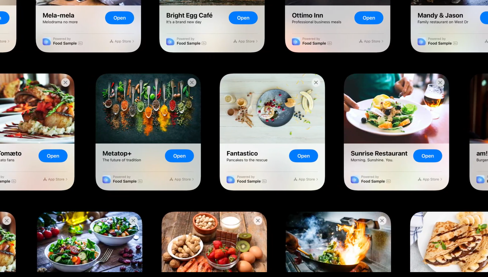

### 使用 Web Api 创建 Advanced App Clip Experiences 流程
创建一个 Advanced App Clip Experiences 只需以下三步

1. 获取 App Clip resource ID。
2. 上传 App Clip Card 的 header image。
3. 创建 App Clip experiences web API。

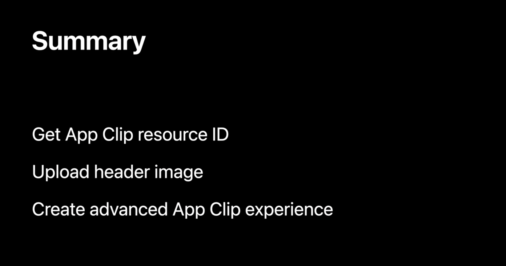

### App Clip experiences web API 使用示例

#### 获取 App Clip resource ID

使用 App item ID 和 App Clip bundle ID 调用 API，然后从响应数据中获取 App Clip resource ID。这个 ID 会在后面使用到。

```json
# Get the App Clip resource ID

GET /v1/apps/1234567890/appClips?filter[bundleId]=com.example.foodsample.Clip

# Response

{
    "data": {
        "attributes": {
            "bundleId": "com.example.foodsample.Clip"
        },
        "id": "726ad1bb-3e1b-40eb-a986-d8a9897e4f1e"
    }
}
```

#### 上传 header image

从响应数据中保存 header image's recource ID，以供下一步使用。

```json
# Upload a header image for the advanced App Clip experience
POST /v1/appClipAdvancedExperienceImages
{
    "data": {
        "type": "appClipAdvancedExperienceImages",
        "attributes": {
            "fileName": "Hero_image_US.png",
            "fileSize": 43500
        }
    }
}

# Response
{
    "data": {
        "attributes": "..."
        "id": "91c52741-832b-48a2-8935-1797655edbe7"
    }
}
```

#### 创建 App Clip experiences web API

接下来看看如何使用前两步保存的 App Clip resource ID 和 header image's recource ID 来创建 advanced App Clip experience。

```json
# Create advanced App Clip experience

POST /v1/appClipAdvancedExperiences
{
    "data": {
        "type": "appClipAdvancedExperiences",
        "attributes": {
            "action": “OPEN",
            "businessCategory": "FOOD_AND_DRINK",
            "defaultLanguage": "EN",
            "isPoweredBy": true,
            "link": "https://fruta.example.com/restauraunt/simply_salad",
            "place": {
                "names": [ "Caffe Macs" ],
                "mapAction": "RESTAURANT_ORDER_FOOD",
                "displayPoint": {
                    "coordinates": { "latitude": 37.33611, "longitude": -122.00731 },
                    "source": "CALCULATED"
                }
            }
        },
        "relationships": {
            "appClip": {
                "data": {
                    "type": "appClip",
                    "id": "726ad1bb-3e1b-40eb-a986-d8a9897e4f1e"
                }
            },
            "headerImage": {
                "data": {
                    "type": "appClipAdvancedExperienceImages",
                    "id": "91c52741-832b-48a2-8935-1797655edbe7"
                }
            }
        },
        "included": {
            "type": "appClipAdvancedExperienceLocalizations",
            "attributes": {
                "language": "EN",
                "subtitle": "Fresh salad every day",
                "title": "Simply Salad"
            }
        }
    }
}
```

请求体中有三个字典需要进行数据填充，attributes、relationships、included。接下来让我介绍每一个字典数据的填充规则。

##### attributes

在属性字典中，需要添加诸如 App Clip Card 上的启动按钮的标题、类别、配置链接等信息。

如果你的 advanced App Clip experience 与地理位置关联，需要添加 `place` 字典。在 `place` 字典中添加地点名称、地图动作和地图坐标信息。

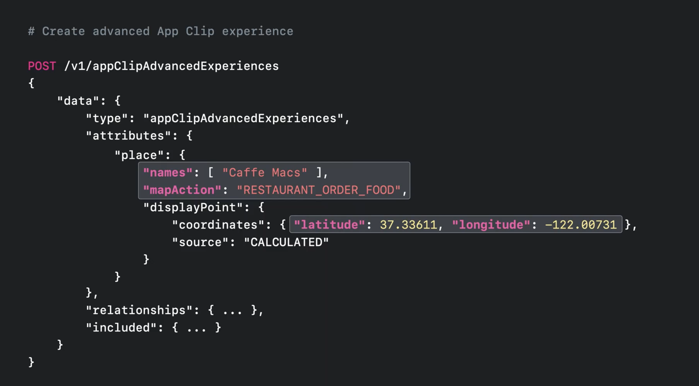

##### relationships

在关系字典中，添加前两步保存的 App Clip resource ID 和 header image's recource ID 即可。

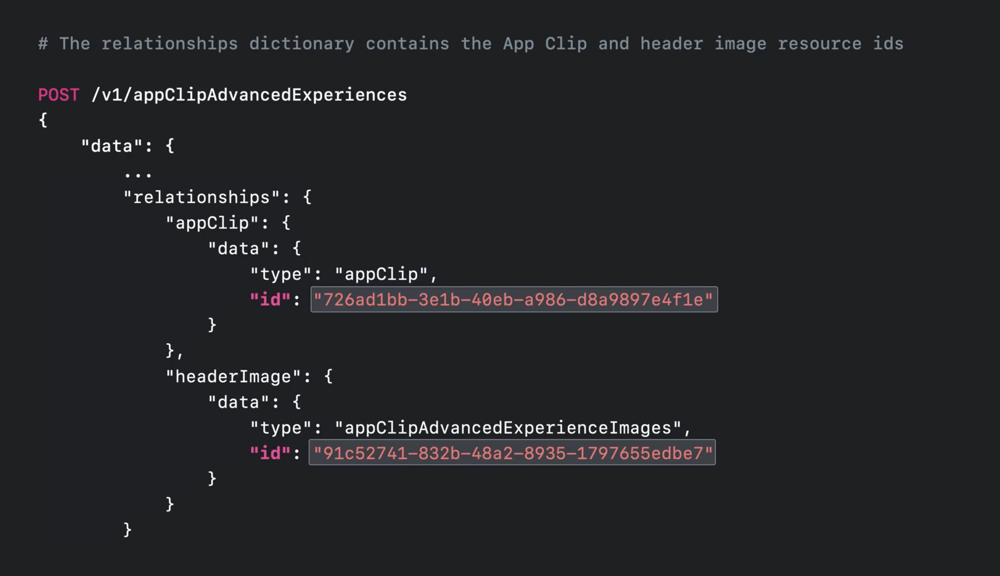

##### included

在包含字典中，添加本地化的标题和副标题。就这么简单。

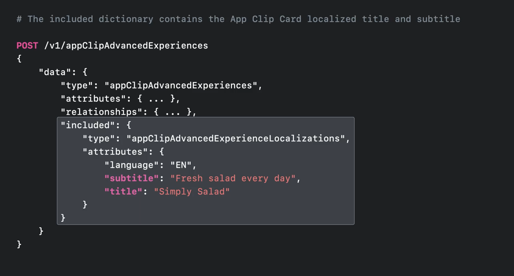

这就是 App Store Connect API 的全部配置内容，有了这个 API，开发者可以自动化创建  advanced App Clip experience。要了解有关 App Store Connect 的更多信息，请参阅 [WWDC18 Automating App Store Connect](https://developer.apple.com/videos/play/wwdc2018/303/)和[WWDC20 What's new in App Store Connect](https://developer.apple.com/videos/play/wwdc2022/10043/)。

## 总结

在今年的 session 中，iOS 16 将 App Clip 的包体积大小提升到了 15 MB，给了工程师更多的空间来创造更多天马行空的功能。App Clip 诊断工具也帮助工程师更好地解决 App Clip 链接配置问题。CloudKit 和 keychain 让我们可以更大程度地复用 App 中的代码来让 App Clip 的开发变得轻松。App Clip experiences API 可自动化管理你的 advanced App Clip experiences。

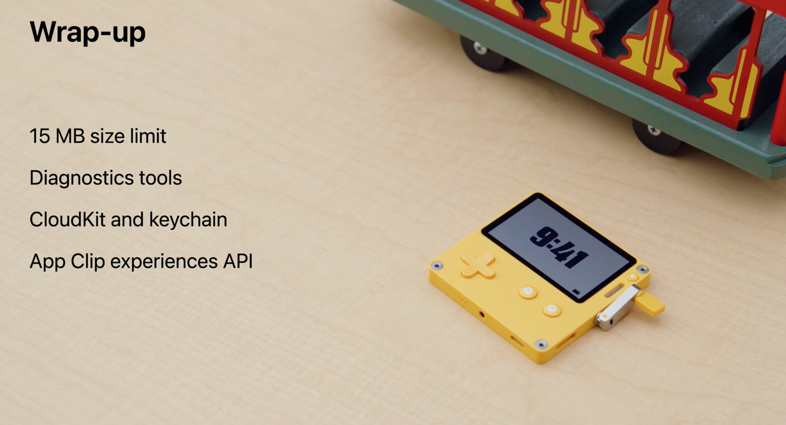

TODO: 总结性，瞻望等补充。
**我们，明年见！**