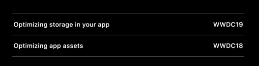
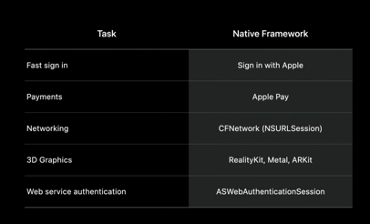

### 1.使用Xcode生成尺寸报告并导出.ipa

使用archive导出app thinning报告，来获取每一个clip的大小。

如下几步来控制app clip的大小

- build setting
  - release下 编辑速度改为最小最快的
- Asset catalogs
  - 优点1：添加到资产中的媒体，会在xcode构建过程中自动优化。
  - 优点2：按需加载。当客户下载程序或者 App Clip 的时候，他们下载的包体积会相对比较小。因为只包含适合用户设备的没提。
  - 若要更深入了解资产目录 请观看《Optimizing Storage in Your App》 和《Optimizing App Assets》 的专题讲座
- Inspect IPA
  - 移除ipa包里面非必要的文件，只包含编译任务必要的文件和代码。
  - 在build phase监视每个文件是一个挺有用的手段。移除后再次构建，来查看是否为必须的。很容易说将项目的文件移到app clip中，app clip只是部分功能的一个载体。导致包体积变大。
- Refactor重构让项目变小
  - 国际化字符串文件可能会随着时间，充斥着重复的字符串或未使用的。*所以可以创建专属app clip的专属字符串文件，而不是使用项目的。*

适用于让项目包体积大小的手段 大部分也都适用于app clip

### 如果还是没有达标，可以考虑下几个高级包体积优化策略

- 评估你的外部依赖关系 并考虑它们的大小 记住 App Clip是 应用程序的轻量版本 所以要确保你只链接 你的clip功能需要的东西 

  - 

- 优化媒体

  - jpeg<PNG。建议使用透明度通道的时候才需要使用png的格式。
  - 无损压缩
  - Png8
  - jpeg有损压缩
  - 视频使用hevc
  - 音频使用比较低的比特率。
  - svg
  - SF Symbols 

  不会造成可察觉的质量下降

- 图片变量

  - 图片复用

- 懒加载

  - App Clip中 用高质量 但分辨率较低的占位符资产 用新的Async图像API 在启动后逐步取代这些资产