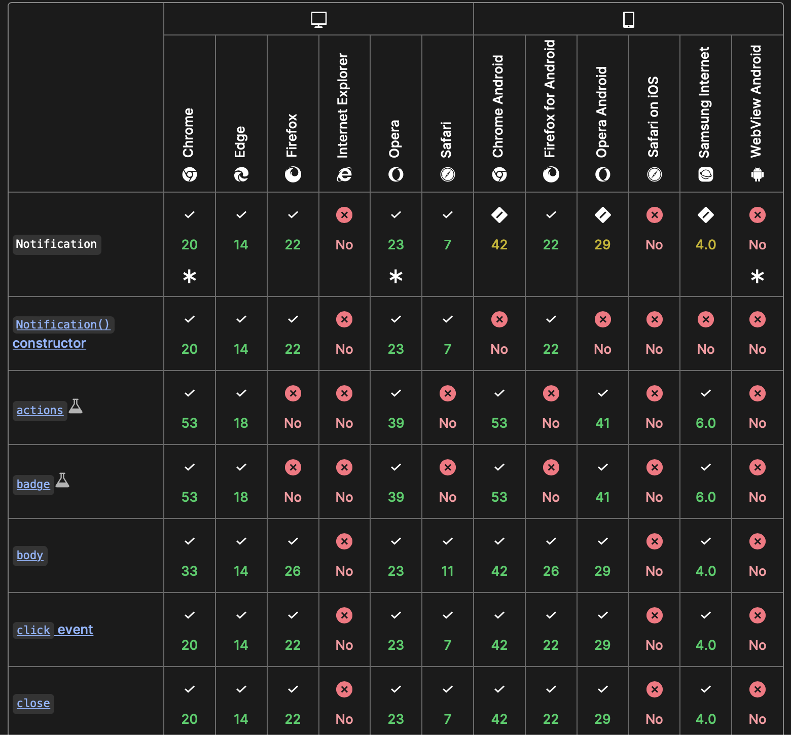
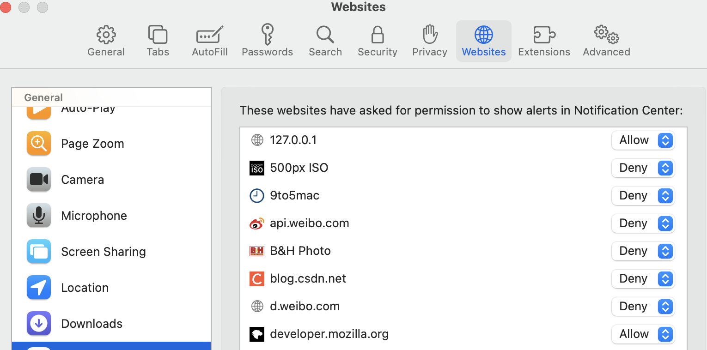
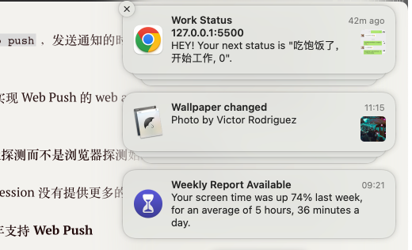
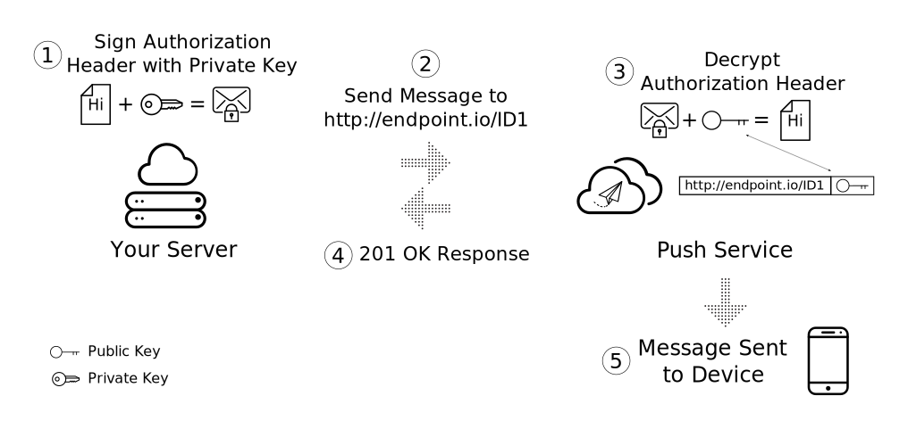
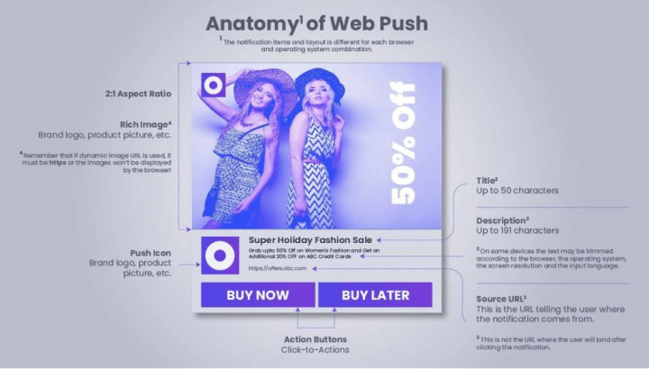
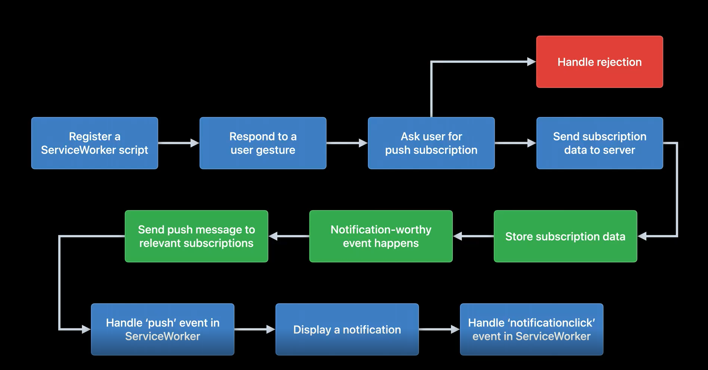

# Session 10098 - 在 Safari 里使用 Web Push

> 本文基于 [Session 10098](https://developer.apple.com/videos/play/wwdc2022/10098/) 梳理。

## 导读

Session 10098 本身内容不多，本文内容除了 Session 中提到的信息外，还包括一些从 Digital Lougue 和从 webkit blog、MDN、web.dev  上获取的信息。以下是大纲

[TOC]

## Web Push 终获 macOS 完整支持

在本次 WWDC 之前，Web Push 其实已经在其他浏览器中获得完整支持，根据 MDN 的数据，

| 浏览器 |  最新稳定版本  |  最早完全支持版本    |
| ------ | ---- | ---- |
| Chrome | 103 | 20 |
| Firefox | 102 | 22 (部分 experimental 特性不支持) |
| Safari | 15 | 16 beta（部分 experimental 特性不支持） |



在这个功能上面，Apple 是个妥妥的后进生，直到现在 Safari 16 beta 才敢称为 实现了 **real web push**，因为之前只是支持 Safari Push Notification。如图所示，

对于那些已经按照标准协议，在其他浏览器 （如 Chrome) 上实现 Web Push 的 web app 而言，不需要做**任何改动**即可实现 Safari 上提供 Web Push 功能，除非

- 将启用功能时，排除 Safari 。需要将此逻辑去掉
- 使用特性探测而不是浏览器探测**始终是最佳实践**

所以如果已经熟悉如何使用 [Notifications API](https://developer.mozilla.org/en-US/docs/Web/API/Notifications_API/Using_the_Notifications_API)、[Push API](https://developer.mozilla.org/en-US/docs/Web/API/Push_API) 的开发者，本 session 没有提供更多的内容，对于这些开发者，本 Session 的信息相当于一句话新闻：

**今年即将到来的 Safari 16 完整支持 Web Push，iPad/iOS 明年支持 Web Push**

而下面的关于 Web Push 如何使用的内容，是为新手准备的。老手可以直接跳过，如果感兴趣可以继续阅读第四部分，关于 macOS 实现的部分细节。

## Web Push 的使用简介

### 何为 Web Push

如图就是 Chrome 收到的一个 Web Push 样子。



Web Push 的需求来源和 App 的通知/推送（notification）一样。支持远程推送是 App 相比 Web 最不同的特性，通知提供了一种全新高效，和用户交流的方式。用户访问网页时，网页以 Poll 或者拉数据的形式来更新数据；而 App 利用 os 提供的双工或者长连接来实现主动向用户更新数据的能力。即使 Web 技术发展和优化，使得 web app 和 native App 在交互体验上差距越来越小，而主动推送消息的能力是 web app 心口的痛，即使是微信小程序也受限于此，只得指望微信为它分配的每日配额的推送数量。

而 Web Push 则是解决 web app 无法主动通知这一痛点的解决方案。

### Web Push 技术栈

让我们回顾下对如何接收远程通知的要求

- 第一步，包括注册本浏览器（相当于 App 推送里的 deviceToken），和开始监听远程推送
  - 同时，有个 deamon 程序，一直在后台默默监听远端的数据，即使浏览器关闭或者注册了通知的页面不是当前活动页面（active page）也要可以收到的信息。

- 第二步，监听程序，一旦**接收远端服务器的信息**，经过必要处理之后，根据返回值，执行相应逻辑。

- 第三步，让用户第一次时间获取到信息。毫无疑问，**os 系统原生的通知系统**是最佳选择
  - 用户习惯和技术实现双重的路径依赖。

针对以上业务需求，相应的 Web 标准组织提供了 3 组 API：

1. **[Service Worker API](https://developer.mozilla.org/en-US/docs/Web/API/Service_Worker_API)**，ServiceWorker 并不是为了 Web Push 而创造的，之前为了解决 Web App 提供类型 native 能力看齐时提供的功能。在做 Web Push 时发现 ServiceWorker 是个很好的技术，所以在此基础上添加了一些专门为 Web Push 服务的接口（ additional interfaces）。
2. Push API 服务于如何注册消息接收者，**接收远端信息**，并合理分发。
3. Notifications API 负责请求权限，**在通知中心展示接收到的消息**。

本文不会对上述的 API 做详细的介绍，只明确他们在 Web Push 中扮演的角色。详细请阅读文末的链接。

### Chrome 上的 Web Push 使用

这一部分解释如何完整的权限请求、接收一个 Web Push，处理消息流程。我们从用户侧开始

> Safari 16 需要在  macOS 13 上运行。本人和大部分一样不能升级 OS，取而代之，因为 Safari 16 遵循标准推送协议，所以代码 Chrome 上可以运行，意味着完全可以在 Safari 16 上运行。

另外，Session 里 JS 使用了 async/await 语法，并不时所有浏览器都支持，本文并没采用。

#### 1. 请求用户授权

正如标准协议规定，请求通知的权限，必须由用户操作触发。举例，我们有这样的一个页面

```html
<button id="enable" onclick="askNotificationPermission();">Enable notifications</button>
<script type="text/javascript">
function askNotificationPermission(callback) {
    Notification.requestPermission()
        .then((permission) => {
            if (permission === 'denied' || permission === 'default') {
                callback(false);
            } else {
                callback(true);
            }
        })
}
//
function createNotification(title) {
    const img = './icon.jpeg';
    const text = 'HEY! Your next status is "' + title + '".';
    const notification = new Notification('Work Status', {
        body: text,
        icon: img
    });
    return notification
}

var i = 0;
function pushNotification() {
    const n = createNotification('吃饱饭了，开始工作, ' + (i++))
 // 注意这里，如何处理本地通知；和后面处理远端推送可相互比较
    n.addEventListener('click', function (e) {
        console.log(e);
        var notif = e.target;
        var url = notif.data.url;
        window.open(url);
    });
}
</script>
```

当用户点击 `Enable notifications` 后，用户选择允许，即认为此浏览器可以接收远程推送。如果用户选择了拒绝，那么 web app 没有简单的路径可以让用户再次选择允许，需要提示用户去浏览器设置，或者系统设置里修改权限。

这一步最重要的就是提前获取通知权限，以便后续接收推送时更加顺利。在后文都 Service Worker 里的 `push` 事件里，用户如果没有授权过，还有机会提示用户授权，但用户体验被中断，不够平滑。

额外的，请注意上面代码里 `createNotification` 和  `pushNotification` 的事件逻辑，可以和后面处理远端推送的逻辑对照着看。

#### 2. 注册 Sevice Worker，获取本浏览器的推送配置

在我们得到推送权限之后，启动 Service Worker 运行，作用有 2；

1. 获取推送配置
2. 等待远端推送信息

因为 Service Worker 的特性，得以在后台运行。

##### 2.1 获取推送配置

如果浏览器想要获取 web app 后端的推送信息，按照架构，需要一个中间层信息，这个中间层叫 Push Service。


这个中间层除了屏蔽平台差异和内部逻辑外，还有两个和体验相关的能力

1. 消息队列管理，如果 web app 后端服务器发送信息时，浏览器不在线，消息会排队或者覆盖更新。
2. Push Service 提供更安全的、负载均衡的响应能力。

代码示例；

```javascript

function registerServiceWorker() {
    return navigator.serviceWorker
        .register('/service-worker.js')
        .then(function (registration) {
            console.log('Service Worker successfully registered.');
            return registration;
        })
        .catch(function (err) {
            console.error('Unable to register Service Worker.', err);
        });
}

if (isWebPushEnabled()) {
    const serviceWorkerRegistration = registerServiceWorker();
    serviceWorkerRegistration.then(function (registration) {
        const subscribeOptions = {
            userVisibleOnly: true,
            applicationServerKey: urlBase64ToUint8Array(
                 'BEl62iUYgUivxIkv69yViEuiBIa-Ib9-SkvMeAtA3LFgDzkrxZJjSgSnfckjBJuBkr3qBUYIHBQFLXYp5Nksh8U',
             )// Firefox 此参数非强制
        }
        return registration.pushManager.subscribe(subscribeOptions);
    }).then(function (pushSubscription) {
        console.log(
            'Received PushSubscription: ',
            JSON.stringify(pushSubscription),
        );
        return pushSubscription;
    });
}
```

最重要的部分是，在 Service Worker 注册成功之后，使用 `ServiceWorkerRegistration` 获取到 `pushManager` 对象，调用 `subscribe` 来注册本页面为通知接收端（其实应该是本浏览器）。此时浏览器根据页面生产唯一标识符，在 Push Service 端注册为消息接收者，Push Service 为页面生成专属 Push Service url。（这句描述是根据基于使用 native App 推送机制之上的合理推测，真实情况需要查看源码）

> 熟悉 App 推送的人应该对 APNS 比较熟悉，和图中的 Push Service 作用相同。native 是拿到 os 生成的 deviceToken 来表明自身作为信息接收者的唯一 ID，后台发送推送时带上 deviceToken 从而验证证书和找到合适的 device。而 Web Push 则是通过 Push Service url 来找到合适的浏览器的。

**难点：如何保证只有合法 web app 后端发送消息给注册页面？**

因为 web app 后端消息是通过 Push Service 来传播的。具体一些说，是注册时传入的 `applicationServerKey` 保证的。`applicationServerKey` 和浏览器返回给我们的 Push Service url 绑定在一起，一对一映射，可以相互找得到。当后续 web app 后端发起通知时，携带的包含了参数

- Payload 即通知的数据（如样式、内容）
- Encrypted info。 `applicationServerKey` 对于的私钥加密后的信息

以及请求本身 url （即 Push Service url）。验证时，Push Service 用 Push Service url 找到对应的公钥来解密 Encrypted info ，解密成功即视为这个 web app 后端时合法 web app 后端。


[上图](https://web-dev.imgix.net/image/C47gYyWYVMMhDmtYSLOWazuyePF2/nHEwbmGFjtttom6DTFAw.svg)，描述了 applicationServerKey 在生成推送配置时，如何两者绑定。

[上图](https://web.dev/push-notifications-subscribing-a-user)描述了 `applicationServerKey` 的在发送推送时的用途。

> 如何生成 applicationServerKey （即 vapid-keys）？请参阅 <https://web.dev/push-notifications-subscribing-a-user/#how-to-create-application-server-keys>

#### 3. 向 web app 后端服务器发送推送配置

在 2.1 中，注册成功我们会拿到推送配置，如下，

```json
{"endpoint":"https://fcm.googleapis.com/fcm/send/deba6qqRob4:APA91bH1SDPNk3a73gJG2uRE-NZdjzRQcb2j8ZnPvptpCNJlboKu9mWZdEcm6IrDZp9QKHjQN8gLxm8oSvFR6HlPbfEhmRt3Yy6sd4LQN1AGe6KVaXs6tN1p10aqbP1Y96Zbfr5fiF9X","expirationTime":null,"keys":{"p256dh":"BIUijBroTvKodU-V3nXWrRPgMcVHdwEzOPIRYDRmkyusfnXM03uq2_TmsDsxq26qdJDD5yN2C7vCgX_v3Ah5GOE","auth":"GmY-6E-jnPSg4XnjztsEtA"}}
```

> 以`fcm.googleapis.com/fcm`数据可见，Chrome 的 Web Push 时基于 Firebase 的能力建设的

可以看到 endpoint: 和浏览器自身的相关的，会变化，而 native 发送 APNs 的 URL 一直是 `gateway.push.apple.com` 不会变。根据  [Voluntary Application Server Identification (VAPID)](https://datatracker.ietf.org/doc/html/draft-ietf-webpush-vapid-00) 定义，这里的 keys 除了后续 web app 后端用来解密 [JSON Web Key](https://datatracker.ietf.org/doc/html/rfc7517) (JWK) 外，还可以区分用户，日后可以通过筛选 key 值来表达定向推送的意图。

这些配置需要发送给 web app 后端， 后端保存起来，在合适的时机用这些参数给 Push Service 发请求，让 Push Service 向浏览器推送消息。

> 获取配置和发送配置，一般 web app 第一次运行 service worker 时只需要执行一次

#### 4. web app 后端保存推送配置 （略）

#### 5.  web app 后端根据业务需求发起消息推送

上述步骤 3，4，5 需要后台配置 https 证书、处理请求参数中的组装、加解密，步骤繁多，属于 web app 后端部署范畴，相关代码，本文一并略过，强烈推荐以下系列文章，步骤详细，也解释很多原理。

- [Web Push Notification Overview](https://web.dev/push-notifications-overview/)
- [How Push Works](https://web.dev/push-notifications-how-push-works/)
- [Subscribing a User](https://web.dev/push-notifications-subscribing-a-user/#how-to-create-application-server-keys)
- [Permission UX](https://web.dev/push-notifications-permissions-ux/)
- [Sending Messages with Web Push Libraries](https://web.dev/sending-messages-with-web-push-libraries/)
- [Web Push Protocol](https://web.dev/push-notifications-web-push-protocol/)
- [Handling Push Events](https://web.dev/push-notifications-handling-messages/)
- [Displaying a Notification](https://web.dev/push-notifications-display-a-notification/)
- [Notification Behavior](https://web.dev/push-notifications-notification-behaviour/)

> 作者作为客户端开发，也是第一次接触 Web Push，从中学到了好多东西

因为 Web Push 里的 Push Service 在 Apple 平台就是 `https://*.push.apple.com`. 之类的域名，所以需要 web app 后端的服务器可以访问此类域名。

#### 6. Web Push 通知的 UI 组成

在后端发送远程推送时/本地推送，有必要了解下如何定制 Web Push 的消息展示,除了查看 whatwg 上 的 [Notification](https://notifications.spec.whatwg.org/#notification) 文档外，[有个网站](https://useinsider.com/what-is-web-push-notification/)的图示更形象，更清晰。



#### 7.  监听远端消息

到这一步回到前端领域。当前序步骤一切顺利，浏览器访问了页面一次之后，service-worker.js 的逻辑已经注册为 os 的 deamon 监听者。在 service-worker.js 里，注册接收到信息后到处理，通常下还需要添加用户在消息中心点击之后的逻辑；

```javascript
// 监听推送
self.addEventListener('push', function (event) {
    if (event.data) {
        console.log('This push event has data: ', event.data.text());
      // 这里和本地推送不同的时，触发接口不一样，但是使用的参数都是 Notification 对象
        const promiseChain = self.registration.showNotification(data.text());
        event.waitUntil(promiseChain);
    } else {
        console.log('This push event has no data.');
    }
});
// 点击事件处理逻辑
self.addEventListener('notificationclick', function (event) {
    const clickedNotification = event.notification;
  // 和本地推送一样的 NotificationEvent 对象
    clickedNotification.close();
    const examplePage = '/demos/notification-examples/example-page.html';
    const promiseChain = clients.openWindow(examplePage);
    event.waitUntil(promiseChain);
});
```

一些自定义逻辑都在 `event.waitUntil(promiseChain);`之前执行。大部分业务逻辑都写在这里，本文略过。

至此，一个完整的 Web Push 流程呈现完毕。用更粗的粒度是如 session 里图示，



## 使用 Web Push 时注意事项

1. 为 Notification 配置 tag 后，只有第一个 notification 会在通知中心弹窗提示，后续的通知不会提示，只会在通知中心，静默更新
2. Notification Permission 和 Push Permission 是一起管理的
3. 提到主动推送，你可能会想到 web sockets 是有能力推送的，为何还需要新的 Push API，那是因为 web socket 的生命周期和页面上相同的，关闭页面即销毁，不适合在后台时也能接收数据。
4. 大部分的浏览器时关掉之后，不会收到 Push 的，但是 Safari 16 可以
5. Chrome 支持 127.0.0.1 上测试推送，Safari 和 Firefox 不会显示也不会报错
6. Web Push 必须在 https 启用的网站使用，否则浏览器会直接返回 denied，不会让用户选择是否容许

## Web Push 在 macOS 实现的部分细节

根据 Digtal Lounge 上的信息， Web Push 只支持 Safari 16 的推送，即使是 App 里内置的 SFSafariViewContoler 打开的页面也不会支持。遑论使用 WebKit 实现的 H5 页面。SFSafariViewContoler 在国外的 App 中集成第三方服务时有广泛的用途，如果呼声高可能后续会支持。

前文提到 macOS 的 Web Push 支持在浏览器关闭的情况下，也能唤醒浏览器，那是得益于 macOS 为其新增了一个 deamon 进程——`webpushd`(来自 [WebKit port](https://webkit.org/blog/12945/meet-web-push/)）。让 Safari 16 支持 Web Push 需要修改系统层面的接口（猜想-此 deamon 进程其中一个原因），即使 Safari 16 可以在 macOS 12 上运行也是不能支持完整 Web Push 功能。

回到 service-worker.js 向 Push Service 注册自身的场景，也是 `webpushd` 将 Javascript 里传递过来的 `applicationServerKey` 和 macOS 自身的一些数据合并成真正的注册信息，发送给 `Push Service`；远端的数据也是先发送给 `webpushd` 再转发给网页。

关于可推送数量和是否支持静默推送，标准规范是需要支持静默推送，但是 Chrome 明确不支持静默推送，会有默认提示。Safari 也不支持，处理逻辑是如果接收了推送但是没有 show 出来（和静默推送效果相同），违规达到一定次数会吊销通知权限。

Safari 很早 2013 年就支持 Safari Push Notifications，它同时支持本地和远端推送，在消息中心显示，但是它的远程推送是通过 Apple Push Notification service (APNs). 实现的。APNs 意味着需要 Website Push ID，证书和开发者账号。在 Web Push 之后还会继续支持。所以为 Safari 编写代码时，使用特性检测来决定是否启用 Web Push，还是回归到旧的 Safari Push Notioncation。Web Push 远程推送猜测目前还是复用了 APNs，只是 macOS 为 Safari 单独创建了一个 appID，本质上还是客户端推送机制；后续会不会做两份—— APNs + Web Push ，很难说，这部分对开发者是黑盒。

为什么猜测 Web Push 复用了 APNs ？是因为这句话， [ref](https://developer.apple.com/documentation/usernotifications/sending_web_push_notifications_in_safari_and_other_browsers)

> The response headers include the HTTP status code and the `apns-id`, which uniquely identifies your push request

## 参考

- Push API 是 W3C 制定的，<https://w3c.github.io/push-api/#pushevent-interface>
- Notification API 是 whatwg 制定的， <https://notifications.spec.whatwg.org/#api>
- At the WebKit blog - <https://webkit.org/blog/12945/meet-web-push/>
- [Voluntary Application Server Identification (VAPID)](https://datatracker.ietf.org/doc/html/draft-ietf-webpush-vapid-00)
- <https://useinsider.com/what-is-web-push-notification/>
- Safari Push Notifications <https://developer.apple.com/notifications/safari-push-notifications/>
- <https://developer.apple.com/documentation/usernotifications/sending_web_push_notifications_in_safari_and_other_browsers>
- <https://web.dev/push-notifications-overview/>
- <https://blog.mozilla.org/services/2016/08/23/sending-vapid-identified-webpush-notifications-via-mozillas-push-service/>
