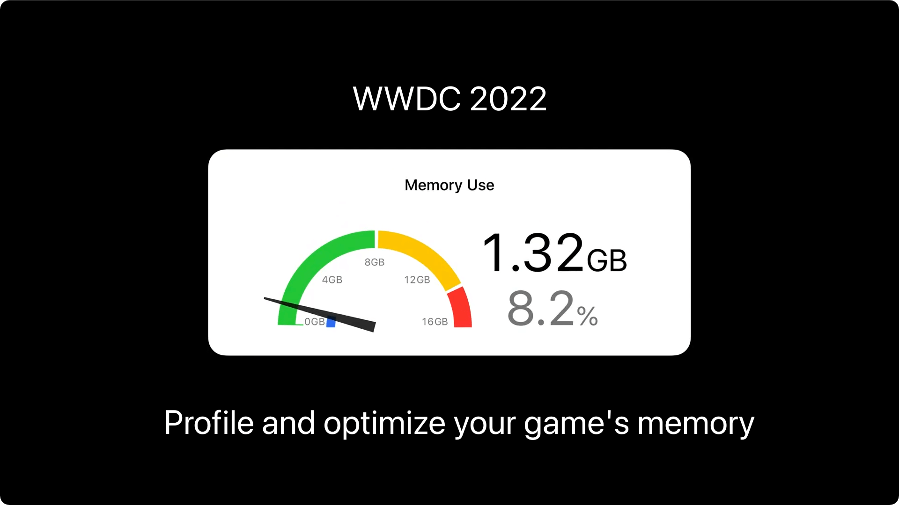

## 个人介绍

张宗辉，手游行业守夜人，游戏公司iOS技术支撑团队负责人

## 审核介绍

待补充

## 不超过 120 个字的文章简介

本文展示了 Apple 平台游戏 App 内存的计算、分配、和调优技巧。全文分四个部分：

第一部分讲解了内存的基本概念；
第二部分展示如何使用 Instruments 工具和 Game Memory Template 来分析游戏，通过游戏内存快照来监测当前内存使用情况；
第三部分介绍了使用 Xcode Memory Debugger 和命令行工具进行分析优化；
第四部分探索 Metal Debugger 中的 Metal 资源，并提供提示和技巧以进一步优化内存使用。

通过本文的探索，您可以更好地理解游戏的内存构成和优化游戏的内存使用。

## 公众号/小专栏图文头图

