# WWDC22 - 游戏内存调试与优化

本文基于 [Session 10106](https://developer.apple.com/videos/play/wwdc2022/10106/) 梳理

> 作者：张宗辉，手游行业守夜人，游戏公司 iOS 技术支撑团队负责人
>
> 审核：待补充

## 前言

游戏应用是 Apple 生态中重要的一员，游戏开发者往往熟悉跨平台游戏引擎，但如何利用 Apple 平台的工具和技巧，调试和优化游戏内存使用呢？

本文展示了 Apple 平台游戏 App 内存的计算、分配、和调优技巧。全文分四个部分：

第一部分讲解了内存的基本概念；
第二部分展示如何使用 Instruments 工具和 Game Memory Template 来分析游戏，通过游戏内存快照来监测当前内存使用情况；
第三部分介绍了使用 Xcode Memory Debugger 和命令行工具进行分析优化；
第四部分探索 Metal Debugger 中的 Metal 资源，并提供提示和技巧以进一步优化内存使用。

通过本文的探索，您可以更好地理解游戏的内存构成和优化游戏的内存使用。

## 一、了解游戏内存

从 Xcode 示例代码（如[Modern Rendering with Metal](https://developer.apple.com/documentation/metal/metal_sample_code_library/modern_rendering_with_metal)）启动游戏，就可以在 Xcode 的调试导航器中打开内存报告。仪表上的数字显示了游戏当前内存的使用情况，这是游戏当前和最近内存使用情况的第一视角：

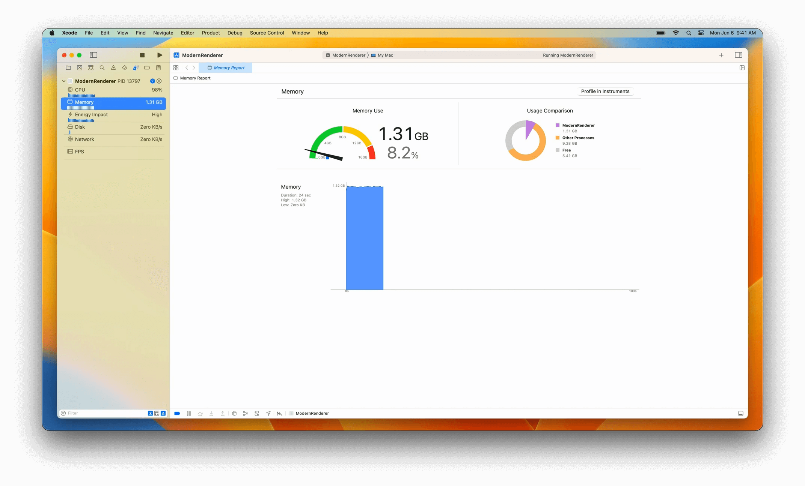

### 物理内存和虚拟内存

在 iOS 系统上，每个应用程序拥有一块自己的虚拟内存空间地址，它们被映射到物理内存的一些位置，共享物理内存。这里游戏中的**实际使用内存**不等于**分配内存**。实际使用内存是指物理内存的使用，而分配内存是游戏在虚拟内存地址空间上请求的内存，称之为虚拟内存（ Virtual Memory ），同时不同类型的分配内存是单独计算的。当您的游戏分配内存时，这些新分配的内存不会立即或直接占用物理内存的空间，相反，它们会在系统为每个进程提供的虚拟内存地址空间上保留一些空间。当程序稍后实际使用此分配时，系统将在物理内存上准备空间。

### 内存分类

同一类型的内存分配按类别`Categories`分组，并占用非连续的虚拟地址空间。这些类别可能包括：

* App 可执行二进制文件
* 堆空间，即动态分配内存区域
* 栈空间，用于存储本地和临时变量以及一些函数参数
* 类实例及手动创建分配的内存
* Metal 对象，如缓冲区、纹理和管道状态对象
* 动态 Frameworks
* 只读资源映射（如游戏资产文件）

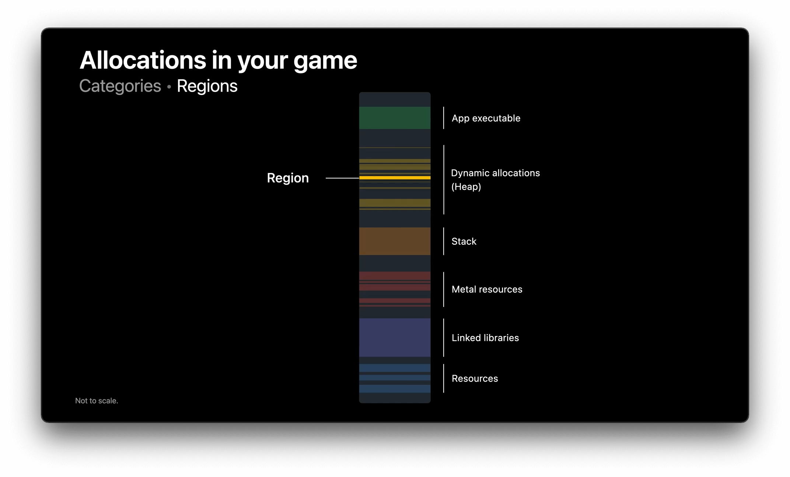

这些类别称之为不同的区域（`Region`）。内存操作在底层以内存页`memory page`为粒度，在现代 Apple 设备上（A7 之后）每个内存页为 16KiB。这意味着每个`region`占用一个或多个`memory page`，并且至少有 16KiB 大。随着游戏的运行，其内存状态不断演变：新对象被分配，旧内容被销毁，导致内存区域也在不断变化。但只有`region`上使用的`memory page`会在物理内存上，系统像任何其他应用程序一样将这部分内存计入游戏使用内存。

### 内存足迹

内存足迹是了解游戏内存使用情况的主要指标，它包括三种类型：

* 脏内存（Dirty Memory Pages）
* 压缩内存（Compressed Memory Pages）
* 干净内存（Clean Memory Pages）

#### Dirty Memory

指分配的内存进行了修改操作后的内存页。包括堆内存分配和 Frameworks 进行了变量或符号修改之后的内存页。在使用 Apple 芯片的设备上，访问的 Metal 资源也属于这一类，这是因为 CPU 和 GPU 共享同一个快速统一内存池。

#### Compressed Memory

如果一些`Dirty Pages`长时间不使用，系统可能会通过压缩这些页面或将其存储在闪存或磁盘上来减少它们的物理内存占用，这个过程称之为交换（ Swapping ）。这样可以允许设备运行更多应用程序和服务。当游戏稍后再次访问这些页面时，系统将从磁盘中重新解压或分页这些内存页。这部分压缩还原的内存称之为`Compressed Memory`。在 Instruments 调试中所指 Swapped Size 即为交换过程压缩的 Compressed Memory 大小。

#### Clean Memory

没有对其内容进行修改的页。包括内存映射文件，例如纹理或音频资产，以及加载到进程中的 Frameworks 等。系统可以随时收回或从磁盘中重新加载，因此它们不会计入游戏的内存占用。然而，它们可能驻留在内存中，过度使用会减慢系统和您的游戏速度。

`Dirty Memory`和`Compressed Memory`结合在一起，我们称之为内存足迹。系统通过它来管理和限制内存使用。

### 内存占用查询

除了 Xcode 内存仪表盘外，Mac 上的活动监视器也可以查找内存占用。此外也可通过有 API 来快速查询当前足迹和可用内存：通过调用`os_proc_available_memory`查看 iOS 、 iPadOS 或 tvOS 游戏的可用系统内存：

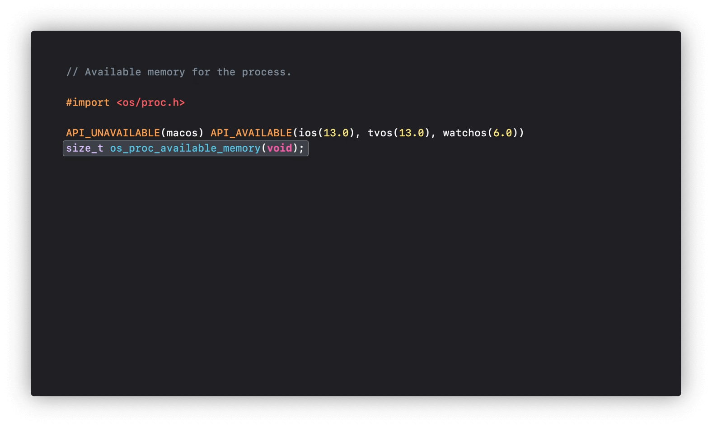

对于任何苹果平台上的内存占用，您可以通过`proc_pid_rusage`获取，并从`get pid`、`rusage_info_current`（目前为版本 6）和数据存储中获取进程 ID。并获取其物理内存占用、生命周期最大物理内存占用属性：

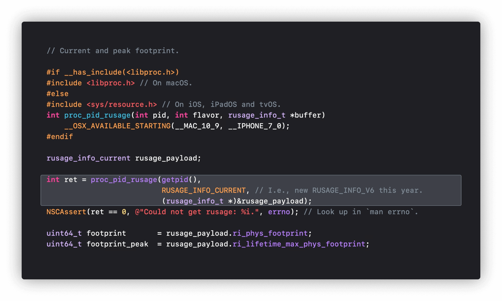

## 二、内存增长调试

第一部分介绍了内存的基本概念，同时介绍了从内存总体角度查询内存占用的工具，不过，对于内存的分析可以有多个角度。本部分利用 Xcode 、 Instruments 和终端命令行工具剖析内存和内存增长，从不同的角度揭示内存之谜。

当从 Xcode 运行游戏时，内存报告可以显示一段时间内的内存占用汇总。通过在 Instruments 中分析游戏，则可以更详细地了解内存使用情况。从 Xcode 中按住运行按钮，然后选取“Profile”打开  Instruments 。 Instruments 包括一系列分析工具，这些工具记录了内存不同角度、随时间变化、可视化的使用数据。

今年新增的 Game Memory Template 可以更好地了解 Metal 游戏中的内存增长。此模板附带 Allocations 和 Metal Resource Events 工具，用于记录内存分配和历史记录，VM Tracker 用于记录内存占用， Virtual Memory Trace 用于记录虚拟内存活动，Metal Application 和 GPU 用于记录与 Metal 相关的事件。

这里重点介绍前三个工具： Allocations、Metal Resource Events 和 VM Tracker。

首先为游戏录制一段 trace 用于分析：在 Instruments 按下录制按钮开始录制，稍后按下相同的按钮或退出游戏停止录制。或者在终端使用 xctrace 命令录制，这可能在自动化工作流程中非常有用：

```
    xctrace record --device-name "xxx's iPhone" --template name "Game Memory" --attach ModernRenderer --output ModernRenderer.trace --time-limit 30s
```

### Allocations

Allocations 工具追踪所有堆分配和匿名虚拟内存 (VM) 分配的大小和数量，可以提供内存分配、内存大小和对象引用计数的详细视图，并按类别组织和显示。通过 Allocations 统计视图，有一系列选项用于查看和分析内存追踪历史。需要注意的是，它不包括私有 Metal 资源。

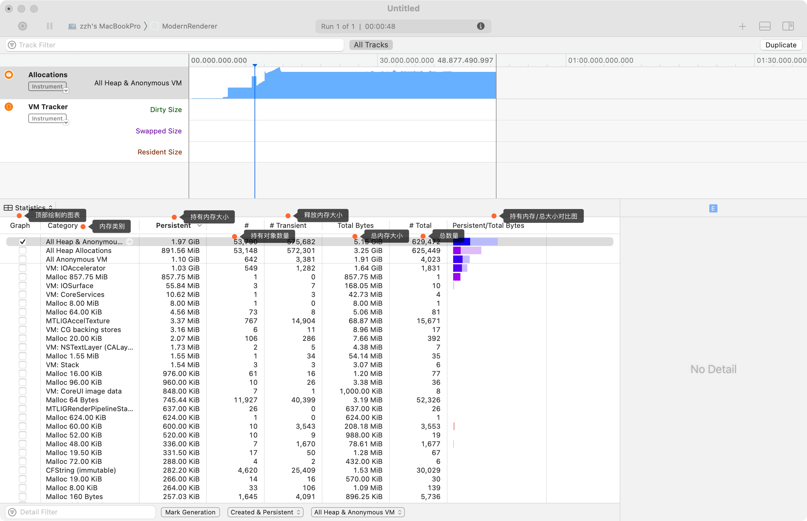
  
#### All Heap Allocations

指堆上 malloc 分配的内存。通常，堆内存优化可以从堆内存较大的分配来入手分析。如点击 Size 列按分配内存大小进行排序，点击箭头以查看 Swift 和 Objective-C 对象的引用计数变化。选中某个分配地址，右边检视面板会显示内存堆栈追踪历史。点击右侧按钮可以显示/隐藏系统库或框架。在这里，根据堆栈跟踪，分配发生在 Modern Renderer 加载 Assets 资源时。双击某个方法也可以跳转查看源码详情。

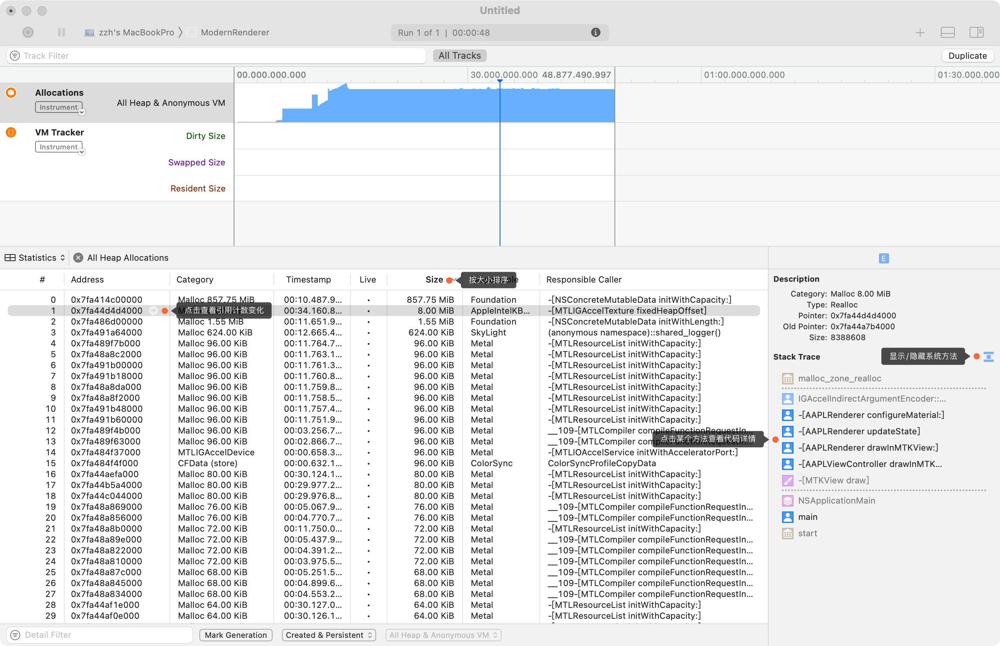

#### All Anonymous VM

指系统为程序分配的虚拟内存。在 Metal 游戏中， IOAccelerator 和 IOSurface 类别通常占用了很大的分配大小。

IOAccelerator 对应于 Metal 资源加载，从堆栈追踪信息中，可以看到在加载 Assets 资源时发生了这种分配：
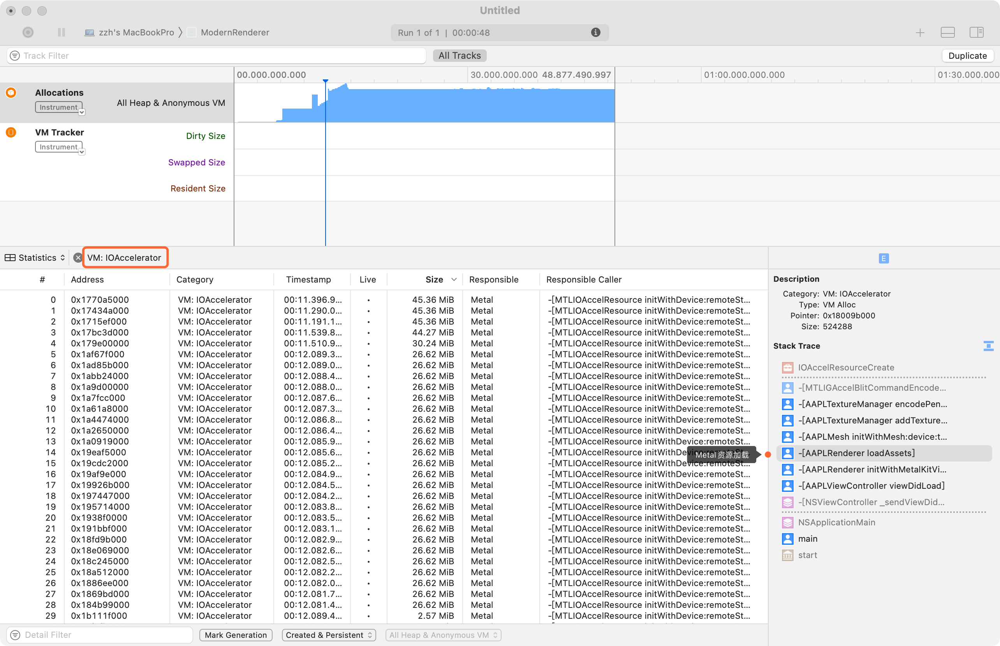

IOSurface 对应于对象绘制。在这里，堆栈跟踪显示 MetalKit 视图的绘制请求：
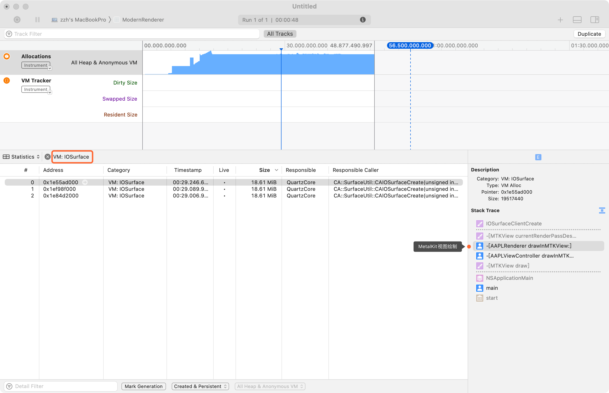

#### Allocations 视图切换

Allocations 工具默认显示可视化、随时间线变化的内存大小图。同时，也可以在 Allocations 下方下拉箭头按钮上自定义显示内存密度`Allocation Density`。`Allocation Density`将随时间更新执行的分配量并显示内存分配的峰值，这些峰值可能是内存增长的来源。此外，`Active Allocation Distribution`也从内存开辟激活历史的角度记录了何时创建分配了内存。切换这些不同的内存追踪历史角度，可以协助更好地了解和分析内存增长和优化角度。

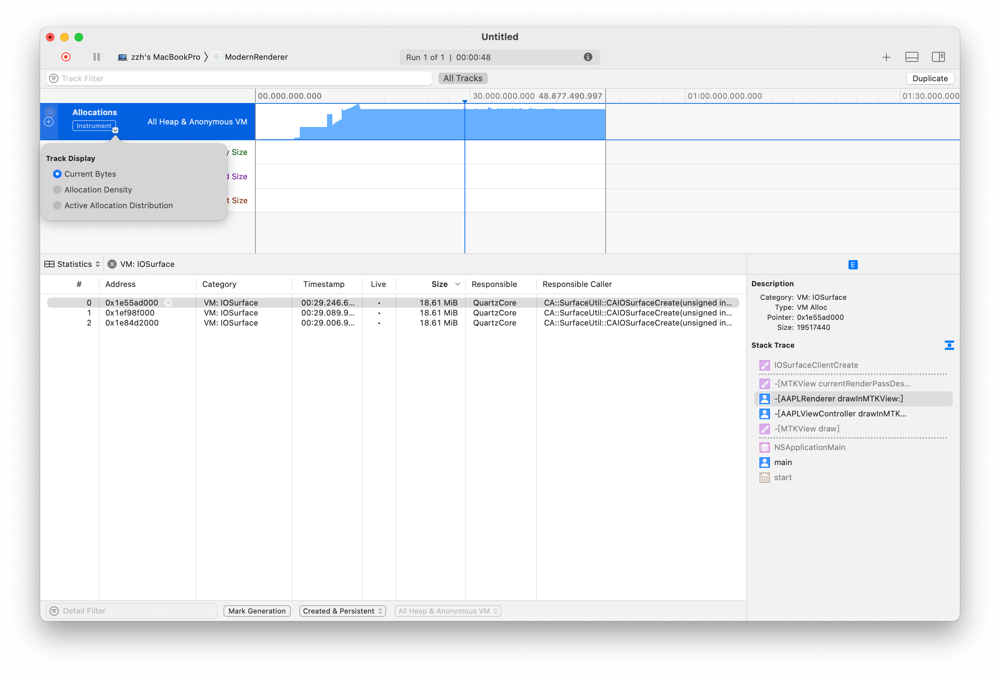

### Metal Resource Events

为了更好地了解分配的 Metal 资源，让我们继续讨论 Metal 资源事件（ Metal Resource Events ）。Metal Resource Events 工具是围绕 Metal 资源设计的。在资源事件视图中，可以找到 Metal 资源内存分配和释放的历史记录。在这里，可以通过标签来识别 Metal 资源，这些标签可以通过 Metal API 以代码形式指定。与 Allocations 工具类似，在检查面板中可以找到堆栈分配历史记录。此外， Metal 设备在表格中还添加了内存分配和释放追踪栏，有助于从内存随时间分配密度，即内存占用峰值角度，对 Metal 资源的内存分配过程有一个可视化的了解。

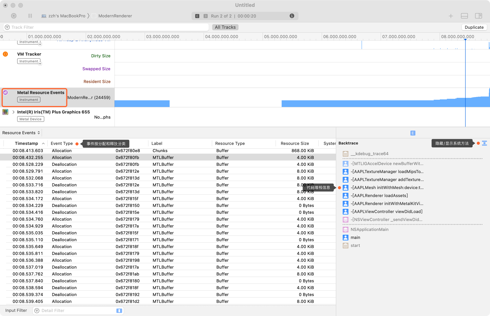

### VM Tracker

到目前为止， Allocations 工具和 Metal Resource Events 工具可以帮助理解内存分配。然而，分配的内存并不总是实际使用的内存。因此，让我们转到 VM Tracker 工具来分析内存的实际使用情况。

VM Tracker 显示了未压缩的`Dirty Memory`、`Compressed/Swapped Memory`。 这里：

* Dirty Size - 表示未压缩的脏内存
* Swapped Size - 表示已压缩/交换至磁盘的内存
* Resident Size - 表示实际使用物理内存，包含物理内存中已加载的干净内存和脏内存

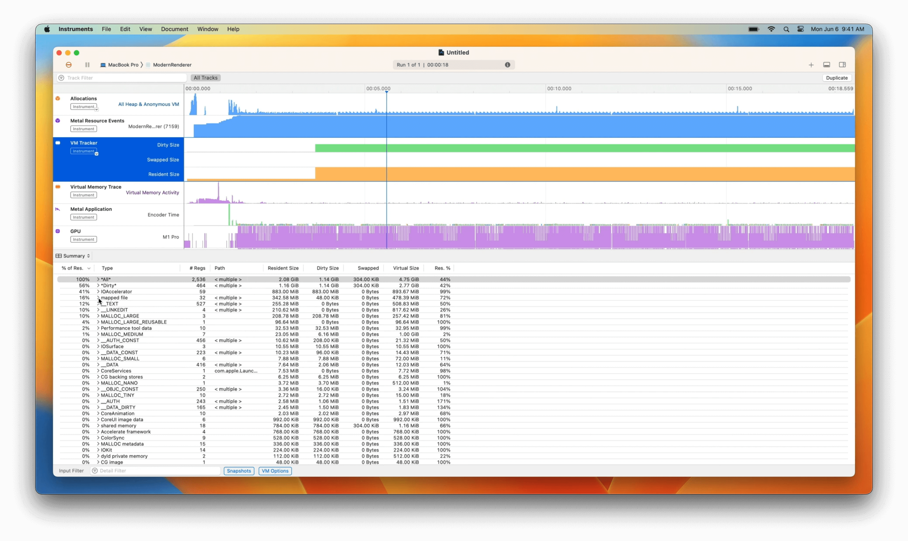

上面摘要视图详情显示了虚拟内存区域，“Type”一栏显示 VM Region 的不同类型。这里的类型可以区分不同的内存使用来源，其中 All 和 Dirty 只是统计汇总，其他类型如 __TEXT 表示代码段的内存映射，__DATA 表示数据段的内存映射， CoreServices 表示系统库的内存映射等。在”mapped file“类型中，可能会找到一些内存映射的资源，如游戏 Assets 资源，这里的 Modern Renderer 示例中，“bistro” Asset 资源文件映射到内存中。此外还可以通过代码的形式自定义分配内存并定义 Type 类型：

```
#import <mach/mach_init.h>
#import <mach/vm_map.h>

vm_address_t address;
vm_size_t size = 1024 * 1024 * 100;
vm_allocate((vm_map_t)mach_task_self(), &address, size, VM_MAKE_TAG(VM_MEMORY_MALLOC_HUGE) | VM_FLAGS_ANYWHERE);

//这里VM_MAKE_TAG可以设置虚拟内存标记
```

### Memory Graph

为了在给定时间捕获游戏的内存状态以便于更深入地挖掘该内存状态，并通过不同的角度检查，今年新增了**游戏内存模板（ Game Memory Template ）**工具，它将有助于了解随着时间的推移内存使用的变化。这个功能可以创建一个**内存图（ Memory Graph ）**文件，用于高效存储游戏内存状态的完整快照，包括对象创建历史、引用以及任何压缩或交换记录。您可以随时创建内存图快照，例如在发生问题时，或问题发生前后的一对快照进行比较。

使用内存图来分析内存，需要准备以下内容：

* 游戏 Xcode 项目
* 开启 Malloc Stack Logging
* 捕获的 Memory Graph

#### Malloc Stack Logging

Malloc Stack Logging 记录游戏过程中的内存分配信息。在 Xcode 项目 > Scheme 设置中，选择 Run ，转到 Diagnostics ，然后勾选 Malloc Stack Logging ：

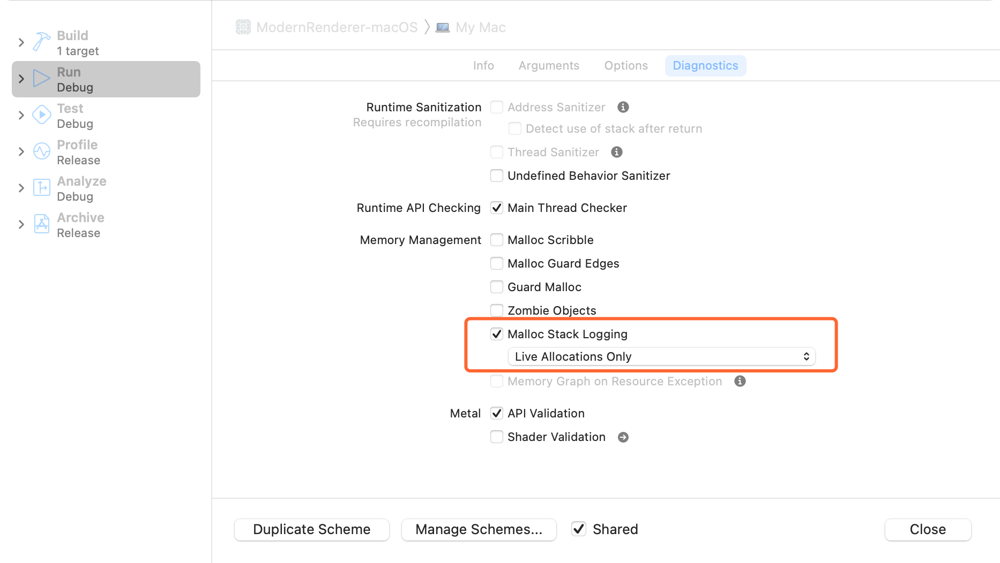

这里的`All Allocation and Free History`指记录所有已分配对象，包括已释放的内存对象；`Live Allocation Only`会从其历史中删除已分配的对象。日志记录数据可能会占用更多内存，但它对于调试碎片化等问题非常有用。在大多数情况下，`Live Allocation Only`是推荐的选项。

如果没有从 Xcode 启动，也可以设置环境变量。查看 malloc 手册页面，了解一些额外的录制模式。

#### Xcode Memory Debugger

运行 Xcode 项目单击调试区域中的 Debug Memory Graph 按钮， Xcode 将处理然后生成内存快照，并进入 Xcode Memory Debugger 页面。 Xcode Memory Debugger 为游戏的内存使用提供了直观的视角。在左侧， Debug Navigator 为您提供对象实例的分层列表。在右侧，文件检查器提供了有用的信息，如内存占用、正常运行时间和捕获日期。在中间区域，闪耀着内存图视图，其中您有左侧的选定对象，以及引用如何连接到此对象。

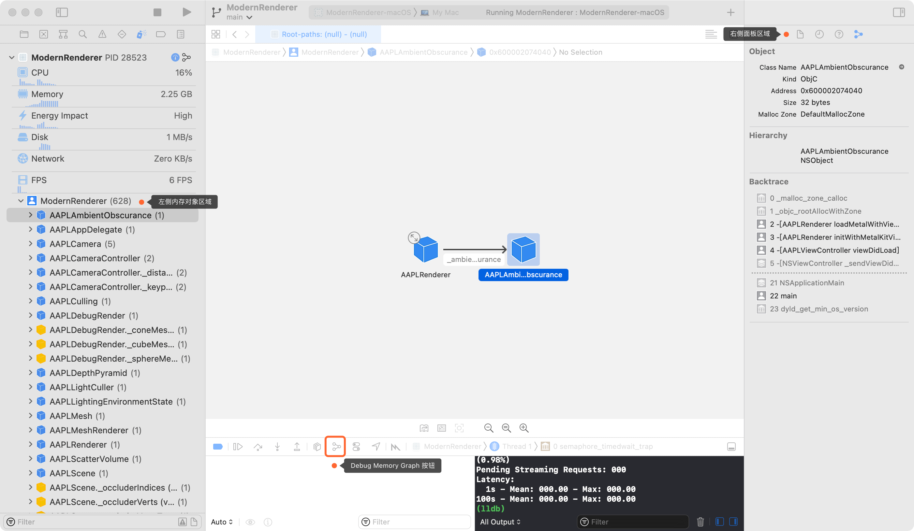

选择顶部菜单 > Export Memory Graph ，可以保存导出此内存图以供将来分析或团队成员共享。
对于 Mac 游戏，您还可以使用命令行工具，通过`leaks PID`命令捕获内存图，进程 PID 可以在活动监视器中找到。这对于需要运行全屏并需要保持对焦的 Mac 游戏较为有用：

```
leaks PID --outputGraph foo.memgraph
leaks GameName --outputGraph foo.memgraph
```

## 三、内存分析优化

通过前面的准备，是时候使用 Xcode Memory Debugger 以及终端中的一些多功能命令行工具来检查此内存图，以找出分析内存分配、占用情况了。

### 按类别分解使用情况 - 使用 footprint 工具

`footprint`命令使用内存图中的信息来重新创建内存高级摘要。通常，首先要关注内存较大的类别。

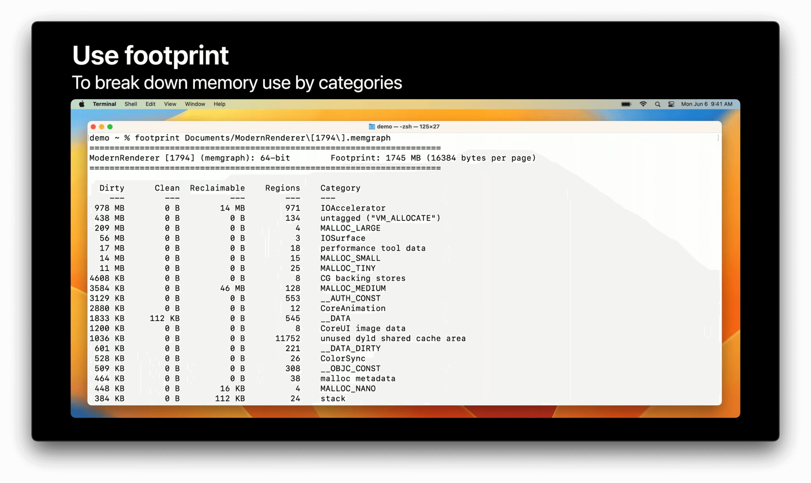
对于示例代码中的这个游戏内存图，IOAccelerator 通常是最大的（其包含 Metal 资源加载）。

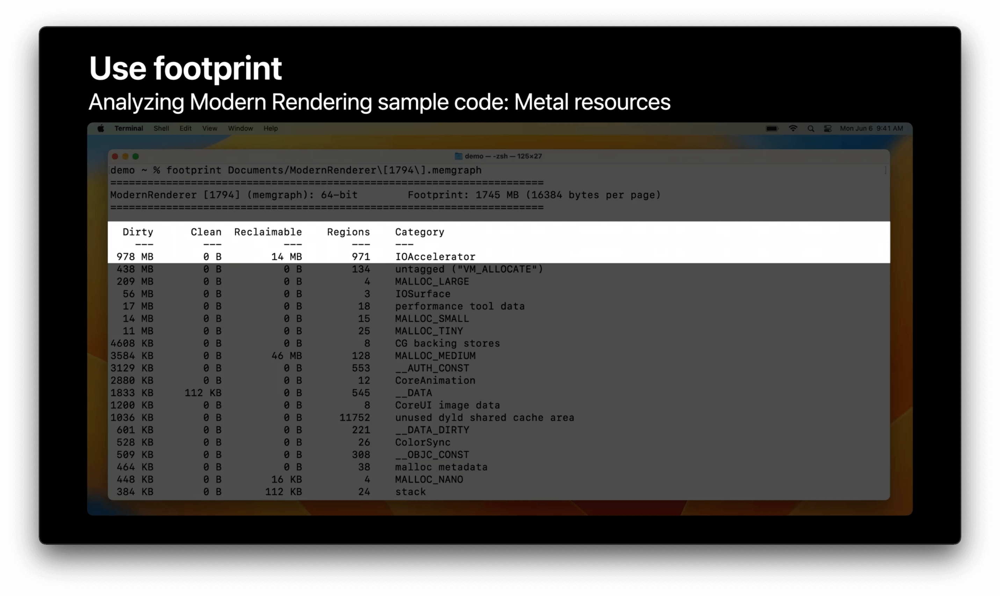
在这里，堆分配转到几个 MALLOC_(prefixed) 类别，系统将堆分配按大小分组到大小池以提高性能（ MALLOC_TINY、 MALLOC_SMALL、 MALLOC_MEDIUM、 MALLOC_LARGE 标签管理不同大小的分配空间）。这些对象可能来自许多地方，例如用于游戏里的音效或物理模拟的第三方插件或库。

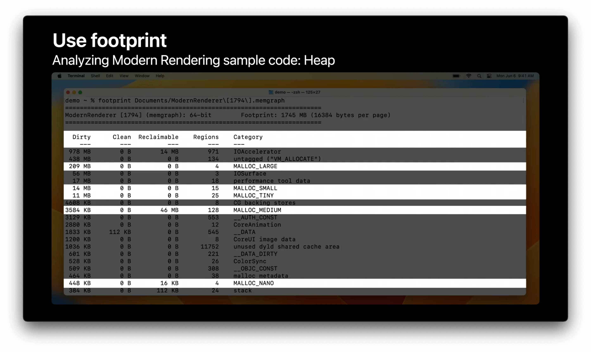

如果您的游戏使用第三方游戏引擎如 Unity ，或自定义分配内存映射，则该内存将像这样显示为未标记的 VM_ALLOCATE 。
在苹果平台上，游戏自定义虚拟内存最多可以使用 16 个应用程序专用标签，可以让您在深入了解内存使用情况时更加清晰。

mmap 内存映射自定义标签方法（ iOS ）：

```
    size_t length = 1024 * 1024 * 100;//100M
    
    /* Reserve 240-255 for application tag */
    int tag = VM_MAKE_TAG(VM_MEMORY_APPLICATION_SPECIFIC_1);

    void *reservation = mmap(NULL, length, PROT_READ | PROT_WRITE, MAP_ANONYMOUS | MAP_PRIVATE, tag, 0);
```

虚拟内存自定义标签方法（ macOS ）：

```
    mach_vm_size_t allocation_size = page_count * PAGE_SIZE;
    mach_vm_address_t vm_address;
    kern_return_t kr;
    
    kr = mach_vm_allocate((vm_map_t)mach_task_self(), &vm_address, allocation_size, VM_MAKE_TAG(VM_MEMORY_APPLICATION_SPECIFIC_1) | VM_FLAGS_ANYWHERE);

```

### 区分 Dirty 和 Compressed Memory - 使用 vmmap 工具

在上面的`footprint`命令中，Dirty 大小还包括 Compressed/Swapped 大小，所以把它看作是每个 Category 的总开销。

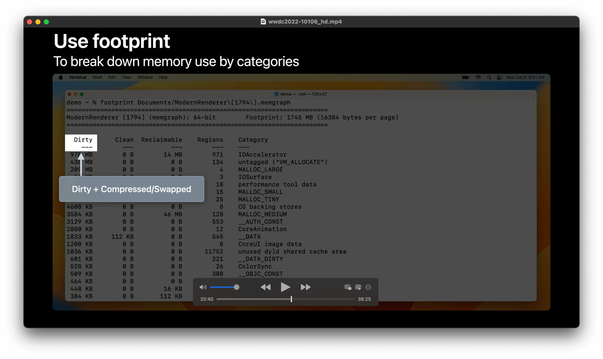
这是当前内存的构成及其使用足迹的概要。其中一些较少使用的内存被压缩或交换，它们可能是节省内存的来源。因此需要了解游戏使用多少压缩或交换的内存，并进行优化。

使用`vmmap`命令处理内存图，以查看 Compressed/Swapped 大小，而不是两者组合。 DIRTY SIZE 列包括当前未交换或压缩的常规 Dirty Memory ，而 Swapped SIZE 列包括压缩或交换内存的原始大小。系统将这两列添加到一起，以确定内存足迹 Footprint 。由于 Swapped SIZE 列中的内容没有经常使用，因此它是优化游戏内存的良好指标。
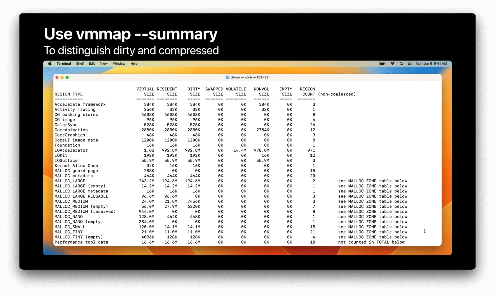
方便的是， vmmap 通过单独的表显示堆分配。在输出底部， vmmap 按区域对堆内存进行分组。这些区域反映了它们在游戏中的使用或生命周期。这里因为开启了 Malloc Stack Logging，也显示在堆上的分配在工具的区域内。否则，根据分配大小，它们将位于两个默认区域： MallocHelperZone 和 DefaultMallocZone 。通常，您可以跳过较小的系统库区域，如 QuartzCore 区域。此外，如果您怀疑碎片大小（ DIRTY + SWAP FRAG SIZE ）或百分比(% FRAG)过高，例如数十或数百兆字节， WWDC 2021 会话涵盖了更多关于碎片化问题的信息^[1][2]。

不带 --sumsummary 参数运行`vmmap`，或在标准模式下使用`vmmap`：

```
vmap /path/to/foo.memgraph
```

输出结果将逐行按 Type 显示每个 vm 区域，就像之前讨论过的虚拟地址空间一样：


**小结：** 使用`vmmap`命令，可以从活跃内存中提取和优化较少使用的脏内存。通常，游戏中也有大量各种大小的动态分配，或 malloc 的堆内存使用。他们需要额外查看。

### 检查类实例 - 使用 heap 工具

`heap`命令按类名对 malloc 的资源进行分组，并按实例计数进行排序。这些类由 C++ 虚表、Objective-C 或 Swift 确定。
这里使用 -quiet 参数来跳过有关某些元数据的信息。今年起堆在识别对象类型方面更智能^**新特性** 。它使用 Malloc Stack Logging 记录的信息来显示调用者或响应库，因此一个巨大的非对象已成为过去。
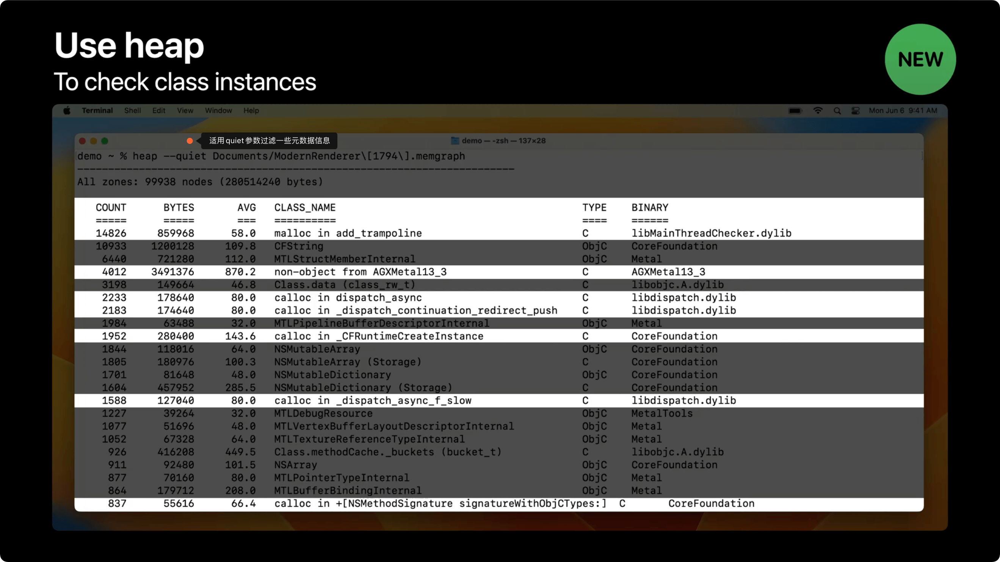

本示例首次揭示了 FMOD Studio 等插件和 GameAssembly.dylib 等游戏组件占用了多少堆使用量。现在可以更多地了解内存是如何分布的，它还暗示了获取有关这些对象的更多信息的方向。在本例中，开发人员可以打开 FMOD Studio 来微调游戏中的配乐和音效，或前往 Unity 查找游戏代码优化等。
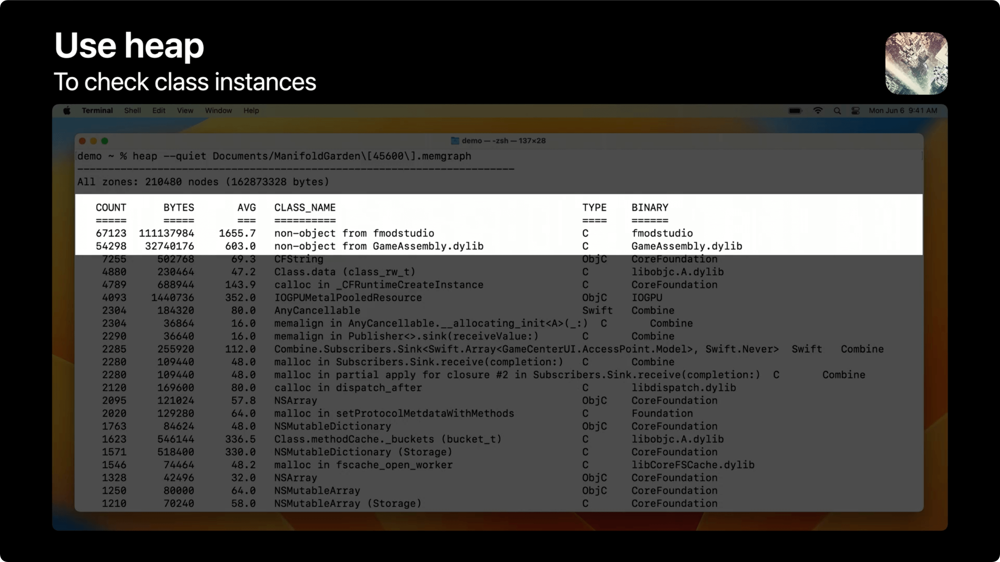

有时，按类总大小排序比按类实例计数排序更有帮助。在 [Modern Rendering with Metal](https://developer.apple.com/documentation/metal/metal_sample_code_library/modern_rendering_with_metal) 示例项目的内存图中，最大的贡献者是一个使用超过 2.58 亿字节的类。要在该示例中寻找较大的对象，可以使用堆按类总大小与-sortBySize 对对象进行排序，并使用—showSizes 列出所有对象，而不是每个类的摘要。

在 Bytes 列中有一个 NSConcreteMutableData 对象，大小为 2.55 亿字节：这看起来值得一看。
通过添加—address 参数并输入 NSConcreteMutableData 跟通配符以列出 10M 及以上的对象：

```
heap --quiet ModernRenderer\[35300\].memgraph --addresses "NSConcreteMutableData.*[10M-]"
```

输出得到该对象的内存地址：

```
NSConcreteMutableData（Bytes Storage）（255049728 bytes）
```

稍后将使用它进行更深入的分析。

**小结：**`heap`工具按类名对 malloc 的资源进行分组，改进了实例的对象识别。

### 追踪对象内存调用栈 - 使用 malloc_history & Xcode Memory Debugger

取决于游戏使用技术栈和特定的内存模式，您可以以任何适合您需求的方式使用`footprint`， `vmmap`，和`heap tools`这三种工具。

随着疑似可优化对象的发现，下一步是获得其分配调用堆栈。在 [Modern Rendering with Metal](https://developer.apple.com/documentation/metal/metal_sample_code_library/modern_rendering_with_metal) 的 2 亿字节对象中，使用`-callTree`模式，并将其地址传递给`malloc_history`。加上额外的`--invert`参数，我可以专注于最接近分配的函数，这里就是分配的调用栈：
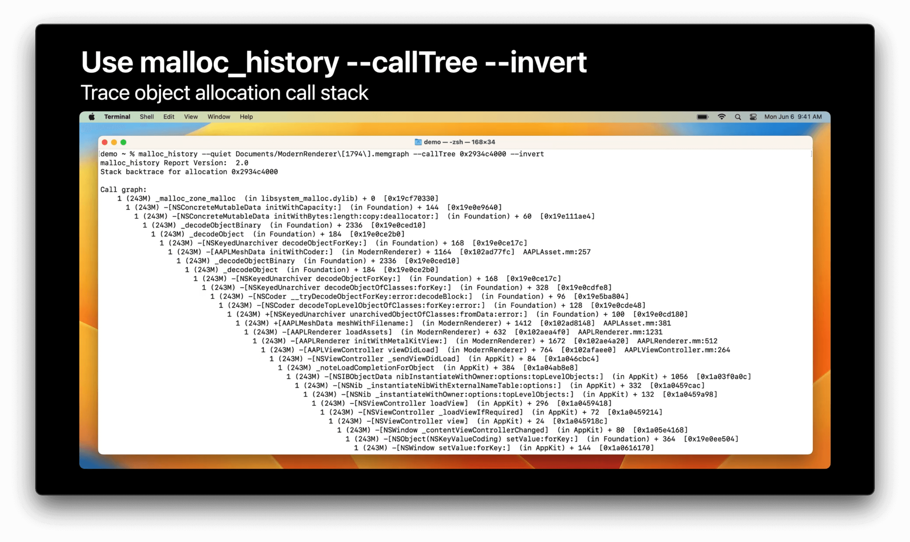

同样， Xcode Memory Debugger 也可以在检查器中显示对象的分配历史记录。只需选择一个对象，单击右侧堆栈按钮就可以看到：
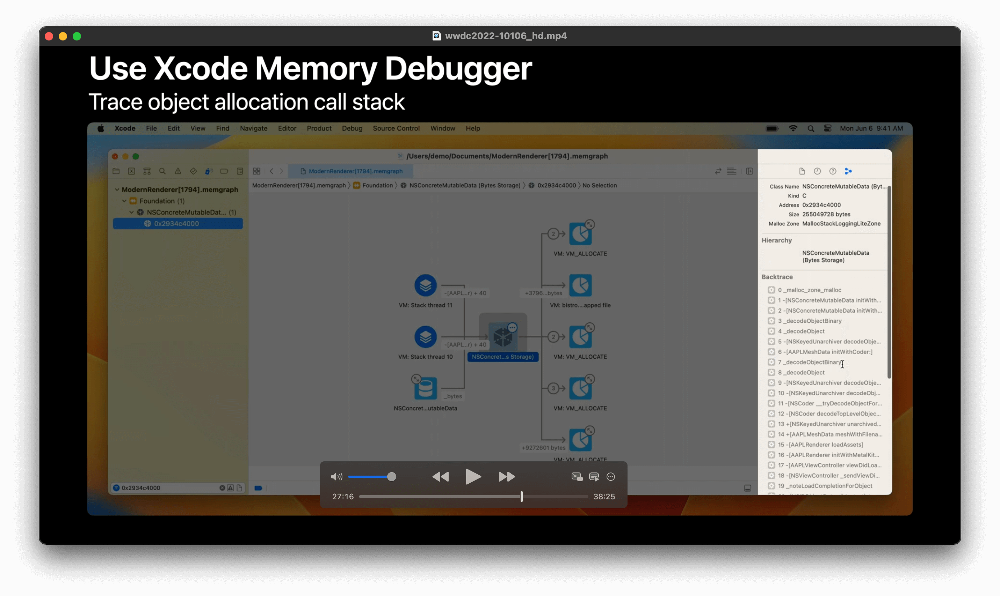

此外，将 VM_ALLOCATE 作为类模式而不是地址传递，可以检查游戏或插件中的匿名 VM 使用情况，例如调试自定义内存分配：
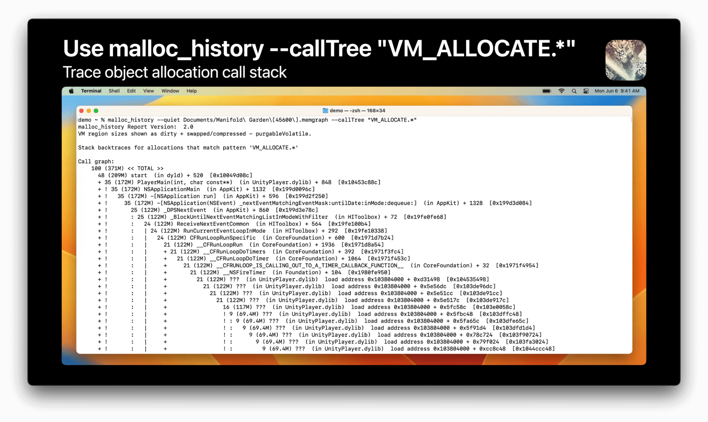

**小结：** 无论是使用 Xcode 还是 malloc_history ，都可以回溯内存分配堆栈，以决定是否要更深入地挖掘分析。

### 检视对象引用计数 - 使用 leaks & Xcode Memory Debugger

最后但同样重要的是，调查对象引用也很有帮助。内存图总是记录对象引用，即使出于各种原因没有启用 Malloc Stack Logging。前面使用了`leaks`命令来捕获 Xcode 以外的内存图，它也可以检查内存图中的所有引用，通过使用`--traceTree`参数和堆中的对象地址来获取对对象的引用树。
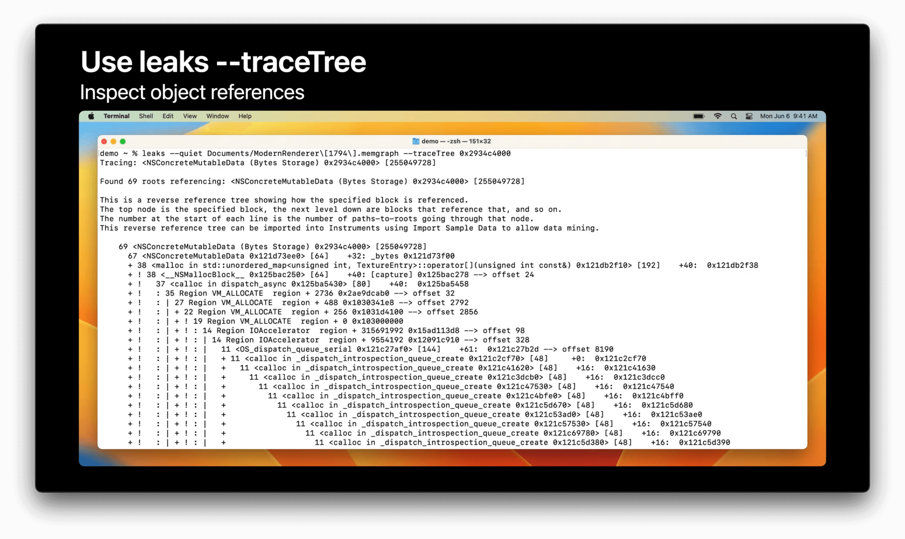
然而，在本示例中这是一棵相当大的树，因此有一种比在终端中查看它的方式要好一些。
在 Xcode 14 中重新设计了内存图视图^**新特性** ，以显示所选当前对象的被引用和引用对象边界，即对象的双向引用：
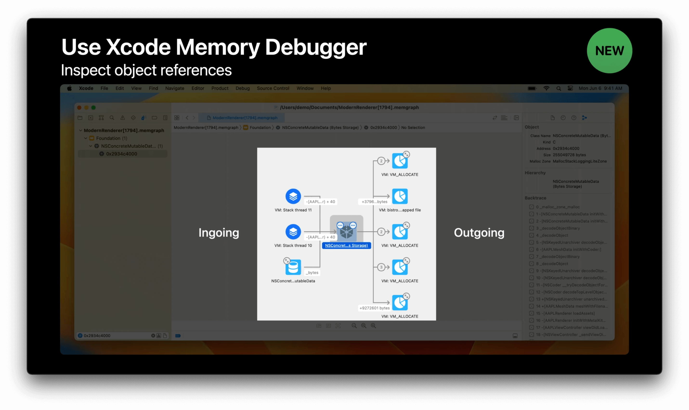当前对象甚至有一个新的选择弹出窗口，用于筛选显示引用的对象。在试图理解复杂游戏状态中的对象引用时，这将大大提高生产力：
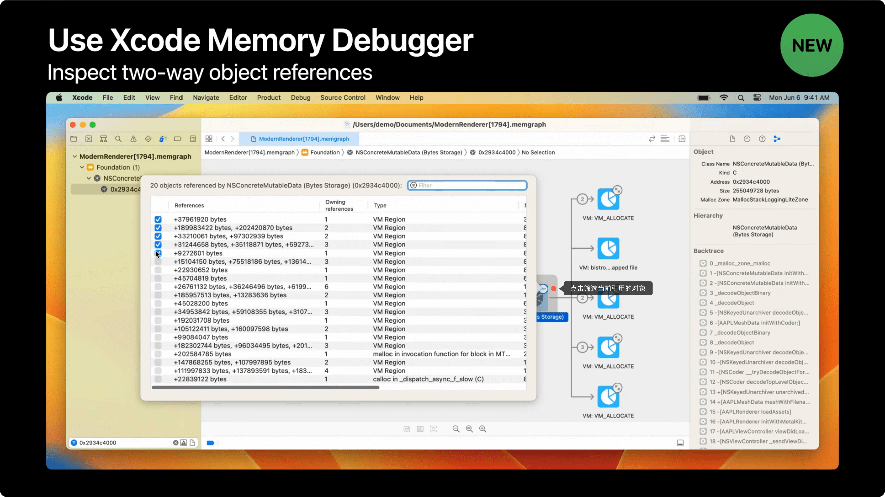

**小结：** 考虑使用`leaks`工具和 Xcode Memory Debugger 来查找重要的对象引用关系，以了解如何在游戏中访问这些对象。

总而言之，当您希望使用内存图捕获和分析内存时，首先要启用 Malloc Stack Logging。然后，使用 Xcode 为您的游戏捕获内存图，或者在 Mac 游戏中使用`leaks`工具。接下来，找到大型而麻烦的对象。`footprint`、`vmmap`和`heap`工具提供了高级和详细的内存分解。使用 `malloc_history`，您可以找到对象的分配位置，`leaks`工具和 Xcode Memory Debugger 可以分析对象的使用或引用。以往的 Session 包括深入的演练以及更多使用这些工具的演示。

## 四、Metal 资源优化

在游戏中， Metal 资源可以使用大量内存。但有一些方法可以优化他们的内存使用。
这里总结了一份内存节省清单，可以在优化游戏中的 Metal 资源时使用。我们将了解 Metal Debugger 如何帮助您审核资源及进一步减少游戏内存的高级技巧。

传统的调试器通过在单个线程上暂停来工作，但这不适用于 Metal 应用程序。Xcode 通过其帧捕获工作流程专门为 Metal 提供了一个调试器。Metal Debugger 是调试 Metal 游戏的一站式商店。在 Xcode Target > Build Settings > Produce Debugging Information 设置为 YES 以启用调试，注意 Release 环境设置为 NO。运行 Xcode 项目，点击调试区域的“摄像头”按钮捕获 GPU frame 后，可以得到一个摘要页面，摘要提供了有关捕获工作负载的一些通用统计数据：

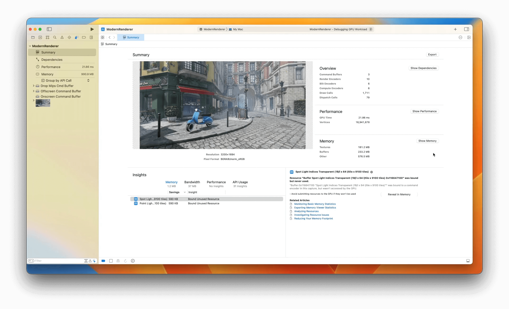

摘要下部分为分为四列的 Insights 列表。“Memory”一列显示了建议为您的游戏节省的内存。对于这个捕获记录来说，在解决这些建议后能节省几 M 的内存。

要想更完整地了解 Metal 资源使用的内存以节省更多内存，可以点击显示内存按钮，通过内存查看器（ Memory Viewer ）为您提供从游戏中捕获的资源的完整列表。 Memory Viewer 上半部分显示了不同的过滤类别，可以快速使用它来查找资源，例如纹理；在下半部分，表格只显示纹理。资源表包含多列可帮助优化游戏。下面重点介绍几列以帮助你快速识别一些感兴趣的资源：
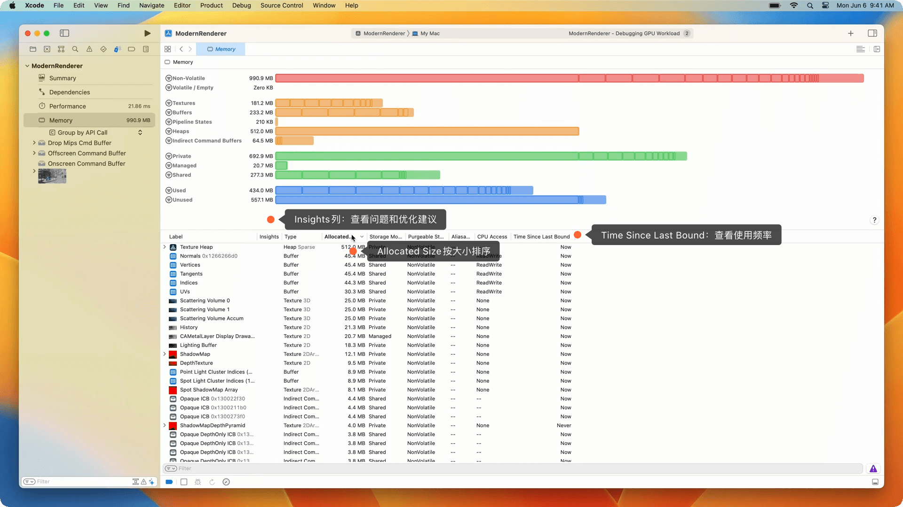

### 1. 内存 insights 发现潜在问题

**Insights 列** 与我们刚刚在摘要页面上看到的相似。按此列对表格进行排序时，您可以快速查看所有资源 Insights 信息。点击 Insights 列显示的紫色警告图标将显示一个弹出窗口，解释该发现并提供一些可能的操作。

### 2. 检查资源大小

**Allocated Size 列** 显示内存分配大小。可以按此列排序以查看最大的资源。检查一些资源是否真的充分利用了它们的内存大小可能会有用。例如，一些纹理可能会调整为较小的分辨率，一些加载在缓冲区中的模型可能会使用较低的聚合物计数，因为这样做不会影响游戏的视觉质量。稍后提到一些替代方法来保存纹理内存。

### 3. 检查资源最近使用情况

**Time Since Last Bound 列** 按此列对资源进行排序，可以查找最近没有使用过的资源。如果从未使用过资源，最好仔细检查是否需要加载该资源。对于一段时间没有绑定的资源，如果将来不再使用，可以考虑将其释放，或者可以将其 purgeable state 设置为`volatile`。

> 关于 Purgeable Memory
Metal 资源属于 Purgeable Memory ，可能处于三种 purgeable states 之一： non-volatile 、 volatile 和 empty 。默认情况下，资源是 non-volatile 状态。通过将其设置为 volatile ，在系统中内存压力高的情况下， Metal 可能会将资源从内存中回收释放。一旦资源为 empty 状态，资源访问会失效，因此当再次访问该资源时需要检查内容是否仍然存在，并按需重新加载。

### 4. 优化纹理像素格式

并非所有列都默认显示在 Memory Viewer 中。要查看和优化纹理，右键单击表头，允许显示和隐藏 Texture pixel format 等列：
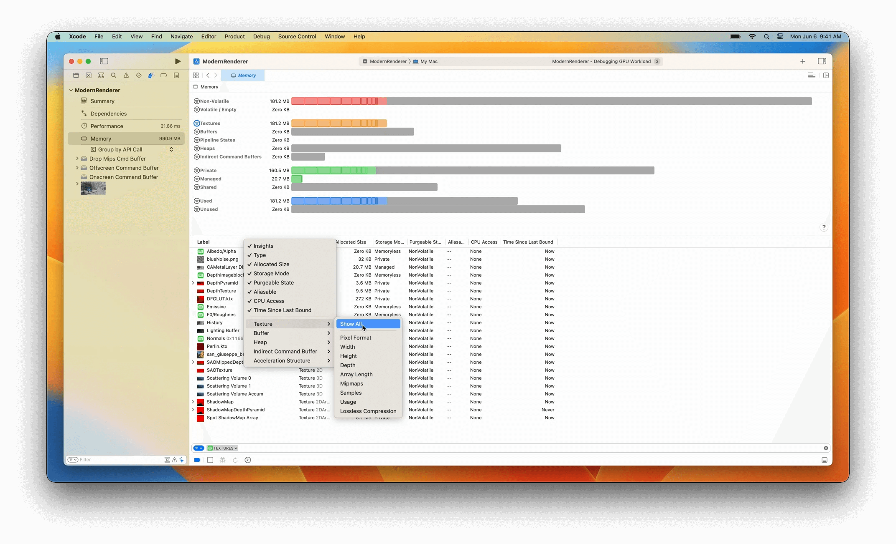

通过优化纹理的像素格式可以节省不同的内存开销：游戏中的许多纹理可以使用**16 位半精度像素**格式来减少内存使用和带宽。如果您需要带有单个 alpha 组件的纹理，您可以**避免多个颜色通道**。

### 5. 纹理压缩

一些只读纹理可以使用**块压缩**以减少内存的使用：对于块压缩像素格式，有 ASTC 和 BC 等选项。此外，自 A15 仿生处理器以来可以对纹理和渲染使用**有损压缩**，以节省内存同时尽可能保持质量。更多详细信息可以查看之前的视频：[Discover advances in Metal for A15 Bionic](https://developer.apple.com/videos/play/tech-talks/10876/)。

### 6. 检查资源/纹理存储方式

如果纹理仅单次使用，可以将其存储模式设置为 memoryless 模式，以节省内存和带宽。memoryless 纹理适用于临时渲染目标，如深度、模板或多采样纹理。否则，如果纹理仅由 GPU 使用，您可以将其存储模式设置为 private ，或 shared 或 managed 。

>memoryless 存储模式： Apple GPU 具有统一的内存模型，其中 CPU 和 GPU 共享系统内存。但 CPU 和 GPU 对该内存的访问取决于资源选择的存储模式。shared 模式定义了 CPU 和 GPU 都可以访问的系统内存；private 模式定义了只有 GPU 可以访问的系统内存；memoryless 模式在 GPU 内定义了只有 GPU 可以访问的瓦片内存（ tile memory ），与系统内存相比，瓦片内存具有更高的带宽、更低的延迟和更少的功耗。

例如，游戏有一个 Depth32Float_Stencil8 纹理。深度纹理（ depth texture ）用于跨通道，但模板纹理（ stencil texture ）的内容将被丢弃，不会在帧的后期使用。深度或模板纹理仅在渲染过程中使用，在 GPU 执行之前或之后不需要，因此，游戏可以使用两个纹理并将模板纹理设为 memoryless 纹理，以节省内存和带宽。
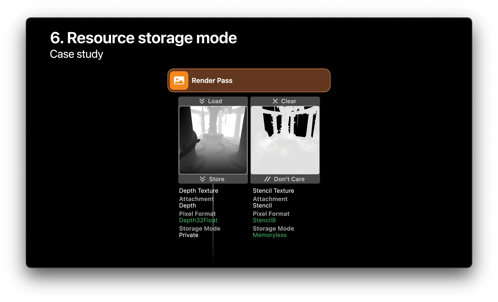

### 7. Resource heap

Resource heap 允许 Metal 资源由相同的内存分配支持。这些资源是从堆中创建的，它们由捕获和管理 GPU 工作依赖关系的栅栏跟踪。

如果游戏未同时使用某 2 个资源，可以使用 heap 上的资源别名，他们可以共享相同的内存分配，但同步访问这些资源时要格外小心。

通过 MTLHeap 对象在堆创建的资源被定义为`aliasable`或`non-aliasable`。 当此堆上分配的子资源与另一个别名资源共享同一部分堆内存时，子资源将使用别名。

可以查看 [Go bindless with Metal 3](https://developer.apple.com/videos/play/wwdc2022/10101/) 以了解有关使用堆中分配的资源的更多信息。

## 参考资料

[1]检测和诊断内存问题: <https://developer.apple.com/videos/play/wwdc2021/10180/>
[2]iOS 内存深入挖掘: <https://developer.apple.com/videos/play/wwdc2018/416/>
[3]Metal 调试、分析和 Asset 构建工具: <https://developer.apple.com/videos/play/wwdc2021/10157/>
[4]现代图形 API 的 Bindless：<https://zhuanlan.zhihu.com/p/136449475>
