# WWDC22 - 如何搭建一个国际化的应用

> 摘要：随着苹果的服务遍布全球，开发者的应用也被世界各地的用户使用。在这样的背景下，开发者们应该如何将自己的应用完成本地化呢？
>
> 本文将以 [WWDC22-10110 Build global apps: Localization by example](https://developer.apple.com/videos/play/wwdc2022/10110/) 为核心，讲述应用本地化的完整流程，并对过程中的几个关键部分做出详细的解释。
>
> 作者：DylanYang，iOS 开发者，现就职于字节跳动国际音乐团队。

苹果的应用商店在全球的许多地区都提供着服务。借助应用商店的分发，开发者的应用可以被来自不同地区的用户下载使用。然而不同地区的用户使用着不同的语言，也有着不同的阅读习惯。在没有进行任何处理的情况下，一个应用很难满足不同地区的不同用户。

应用本地化（Localization）是指针对目标国家的用户对应用进行优化，使得目标国家用户能够获得更好的用户体验。良好的本地化体验可以帮助开发者的应用在当地获得更好的竞争力。

有人会说本地化不就是翻译吗？诚然，本地化过程中最重要的一点就是翻译，但是本地化并不仅仅只有翻译。那么身为开发者，我们该如何进行应用的本地化呢？

## 管理本地化资源

首先，我们需要在项目中添加我们需要支持的语言，一个新建的非 SwiftUI 项目默认会有 Base 和 English 两种语言。

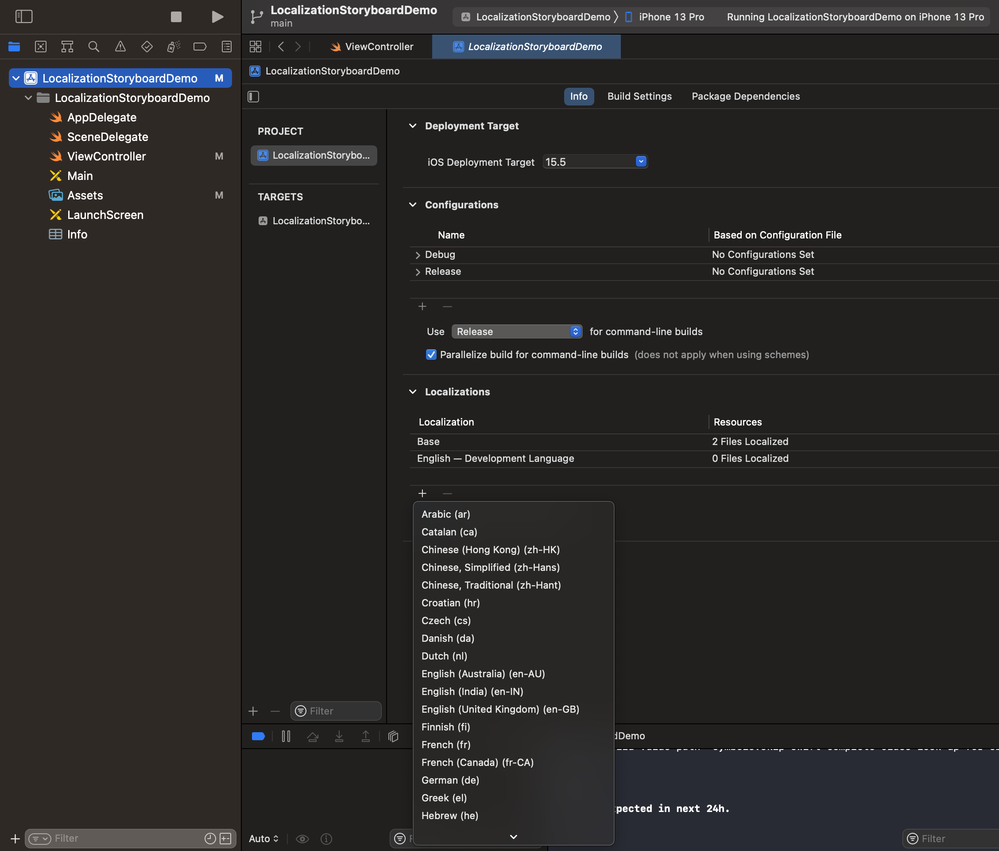

在上图中的位置可以添加更多想要支持的语言。这里添加的每种语言对会对应到工程目录下的一个 xxx.lproj 文件夹，每个 lproj 文件夹内都包含了相关语言的一些用于本地化的资源文件。

lproj 文件夹内通常会包含的本地化资源文件可能有：

- Main.storyboard（storyboard项目的入口）
- LaunchScreen.storyboard（应用的开屏界面）
- Localizable.strings（常规字符串的翻译）
- InfoPlist.strings（info.plist 文件内的翻译)
- AppIntentVocabulary.plist（SiriKit中使用词汇的翻译）
- ......

Base 是用来处理那些可在不同语言之间共享的本地化文件的，比如：storyboard 和 xib。如果新建的是 SwiftUI 项目的话，Xcode 并不会自动把你生成 Base 这个选项。

English 边上标注了 Developemnt language，这代表了这个语言是系统在无法找到匹配用户设置的语言时将使用的兜底语言。如果想要调整 Developemnt Language，那么可以在 project.pbxproj 中修改 `developmentRegion` 字段。

那么系统是如何帮助用户决定应用使用的语言的呢？默认情况下，系统会从手机的设置->通用->语言与地区中获取用户的首选语言列表。之后会按照这个列表的顺序，依次判断每一种语言是否包含在应用提供的可选语言之中。需要注意的是，系统在匹配过程中并不只需要一一对应，如果用户的首选语言是简体中文-香港（zh-Hans-HK），那应用只要提供了简体中文（zh-Hans）也能匹配成功。如果列表中的所有语言都无法匹配成功的话就会按照前文所标注的 Developemnt Language 作为兜底的展示语言。在 iOS13 后，用户也可以在手机的设置->App->语言内手动针对特定的应用单独指定一种语言。

系统选择完语言后，就会使用对应的 lproj 文件夹内的文件来处理本地化。而开发者的应用在商店中展示的所支持的语言，实际也是根据项目中实际存在的 lproj 文件夹来决定的，iTunes Connect 中的配置并不会影响。

注：不使用 lproj 文件夹的情况下，需要退化到使用 [CFBundleLocalizations](https://developer.apple.com/library/ios/documentation/General/Reference/InfoPlistKeyReference/Articles/CoreFoundationKeys.html#//apple_ref/doc/uid/20001431-109552) 字段来表明应用支持的语言，一般不建议如此使用。

在工程中又该如何获取系统最终选定的语言呢？

````swift
//获取App内首选语言列表
Bundle.main.preferredLocalizations

//获取设备的首选语言列表，如果用户单独为App设置了一种语言，那这个列表会和前者不同
Locale.preferredLanguages

//通过"AppleLanguages"可以读取或者设置App的语言，但苹果不推荐如此使用。苹果更建议用户在设置中手动修改App的语言。
UserDefaults.standard.object(forKey: "AppleLanguages")
````

如何更方便的在开发时测试不同的语言呢？参照下图直接在 Scheme 中修改。或者如果你是 SwiftUI 项目的话，也可以在 Preview 中直接使用`ContentView().environment(\.locale, .init(identifier: "zh"))`

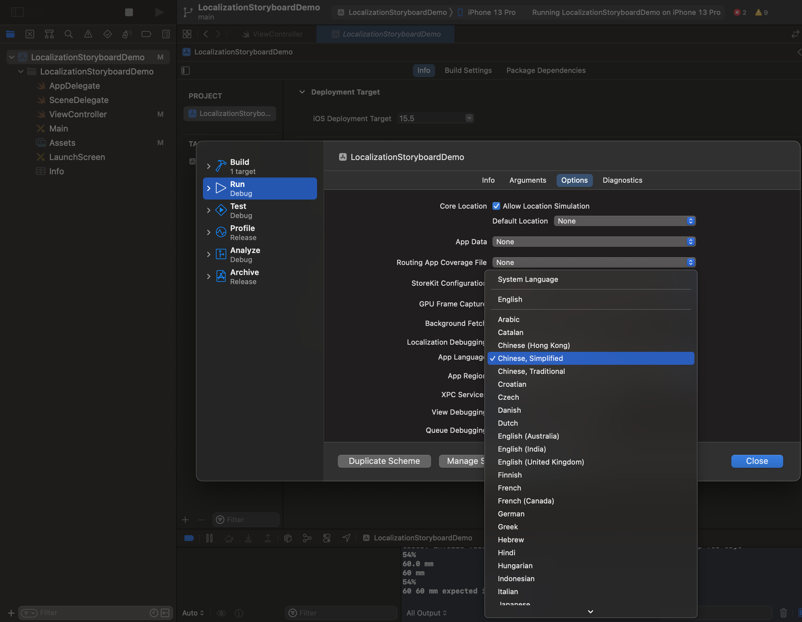

## 文案翻译

翻译是本地化过程中最重要的一步。毫不夸张的说，当你完成了应用内文案的翻译，你的本地化过程就完成了90%。

### 客户端内字符串的翻译流程

注：此处描述的整体工作流更偏向于个人开发者，笔者会在中间补充下这个流程与一般公司内的翻译流程不太一致的地方。

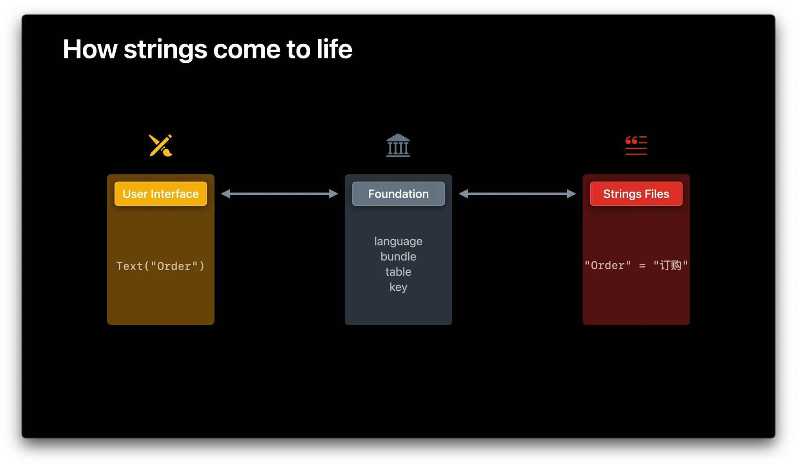

上图是我们字符串在翻译流程中的流转过程。通过 Foundation API 的调用，从 Strings Files 文件内获取到正真需要展现给用户的文案并呈现出来。

我们在应用内声明一个需要本地化的字符串一般有以下几种方式：

```swift
//SwiftUI
Text("Order", comment:"xxxxx")

//SwiftUI 默认使用的字符串都会进行本地化，如果要声明不进行本地化的字符串时需要使用带 verbatim 参数的初始化方法
Text(verbatim: "A")
```

```swift
//Swift Code
NSLocalizedString("Order", comment: "")
```

```swift
//Swift Code, iOS 15.0+
String(localized: "Order", comment:"xxxxx")
```

另外还有直接在 StoryBoard 和 xib 中填充字符串。

这些字符串最终需要在 Localizable.strings 文件中以 `"Order"="订购";`这样 Key-Value 的形式罗列出来才能被程序正常的进行替换。

那么该如何生成 Localizable.strings 文件呢？苹果为我们提供了一些工具去完成整个生成流程。

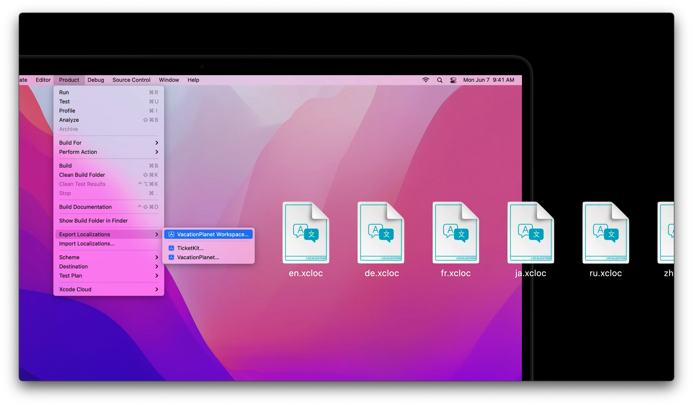

按照上图操作的导出方式，Xcode将把工程内按照前文几种方式声明的字符串自动按每种语言导出为 xcloc 文件，当然已经存在的 Localizable.strings 也会被导入。

xcloc 在 Xcode13 后可以直接打开，它的文件格式如下。

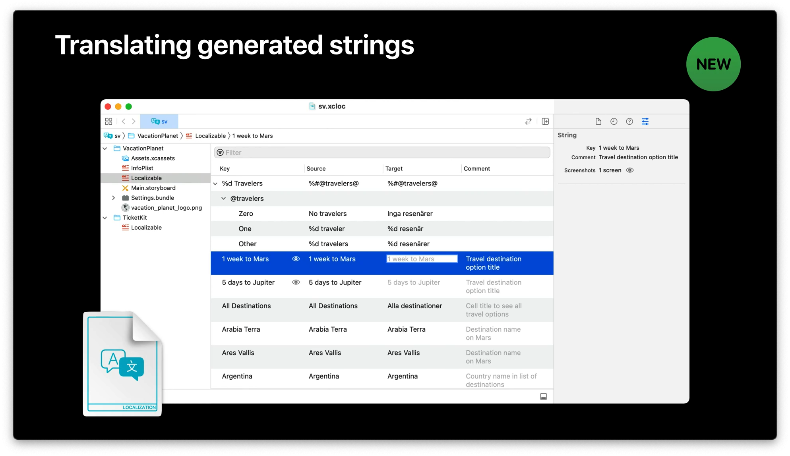

这很方便翻译人员（也可能是开发者本人）在这里集中处理翻译工作，通过这种方式更好的分隔了开发和翻译任务，使得不同的角色可以专注在自己的职责上。处理完成所有的翻译任务后，再通过 Xcode 提供的 import 指令，就可以将这些文案生成对应的本地化资源文件来。

然而这个流程中有个问题，一旦我们对上述声明字符串的 API 进行了封装，那自动抽取字符串的能力就失效了。

```swift
//一个常见的封装 NSLocalizedString 的语法糖
extension String {
    var localized: String {
        return NSLocalizedString(self, comment: "")
    }
}
```

虽然苹果确实有想到这种情况，在工程的 Build Settings 中提供了 `Localized String Macro Names` 参数来允许开发者自定义函数名，但无奈它的条件限制过于苛刻，使得大多数情况下的封装（如上图）都无法满足它的条件。在这种情况下，开发者需要手工在 Localizable.strings 文件中填充 key，才能被顺利导出。

另一个问题则是笔者在段落头提到的问题，大多数公司都无法受益于这套工作流。由于一个应用通常需要同时支持 iOS & Android，在公司内一般会选用中心化的文案管理平台来进行所有文案的管理，比如常见的 Crowdin 平台。在这套流程中开发者/PM 向翻译人员提交新增文案，PM/翻译人员完成文案录入，翻译人员完成翻译，最后开发者拉取翻译文件并在工程内完成替换（可自动化）。在苹果期望的流程中，API 中的 comment 参数可以为翻译人员提供足够的信息来帮助翻译，但是在公司的流程中，comment 参数也变的没有意义。

### 单复数处理

通常在文案的翻译过程中，一个 key 会对应一条翻译的文案。但有些场景下我们很难用一个文案兼容所有的场景，比如处理单复数的时候。

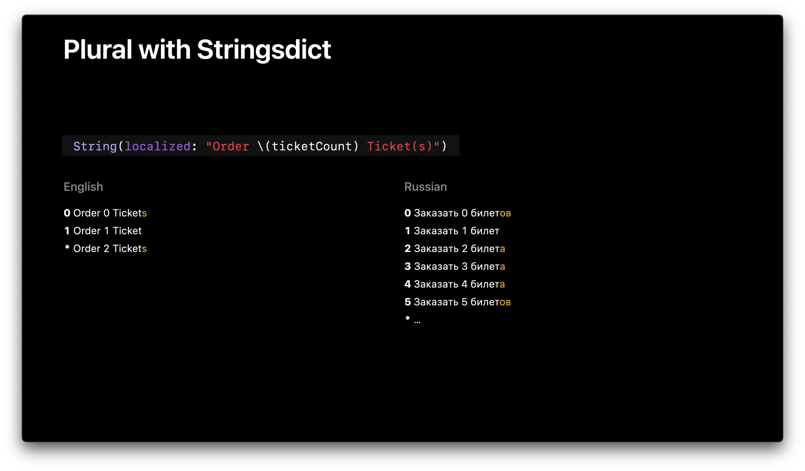

为了方便，有时候开发者会采用 Ticket(s) 的翻译方式来处理。但需要注意的是，当涉及的语言越来越多时，仅仅这样的处理已经无法满足了。比如从上图中可以看到，俄语的单复数规则十分的复杂，也不太能通过简单的代码逻辑去区分。

苹果为我们提供了 Stringsdict 文件来处理这种情况。在这个文件中开发者可以将一个 key 对应到不同的单复数文案。只需要通过`%#@token@` 包住需要特殊处理的文案部分（token），就可以针对这部分做出符合每一种语言的单复数处理了。而这里描述每种语言的单复数的规则需要符合 [CLDR](https://cldr.unicode.org/index/cldr-spec/plural-rules) 的规则。

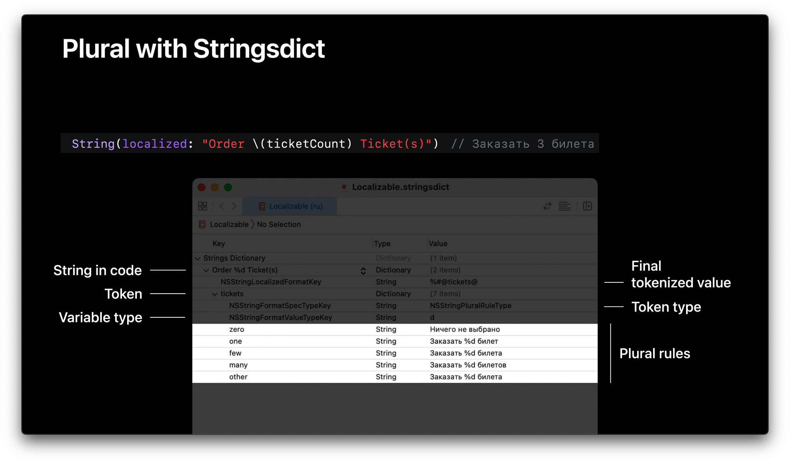

在iOS15之后, 苹果引入了 automatic grammar agreement 来处理单复数以及性别的场景，可以通过`^[xxxxxx](inflect: true)`语法来包裹需要特殊处理的部分。但是这个语法目前仅对英语、西语等极少数几种生效，并且笔者在实践中只能在 SwiftUI 场景下使用成功，不确定是苹果的 bug 还是笔者使用的姿势有问题。

```swift
Text("You have ^[\(count) apple](inflect: true).")
//count = 1 时
//You have 1 apple.
//count = 2 时
//You have 2 apples.
```

### 翻译的注意事项

不同场景应该使用单独的文案，由于各种语言的语法不同，经常会出现在英语中可以使用同一种文案的场景在其他语言下却无法完成。比如下图的场景，德语中描述 "Cupertino" 和 "My Location" 时的文案是不完全相同的，只使用一种文案没有办法处理这种情况。因此存在不同含义的情况下，应该尽量选择一个单独的文案去表示而不是复用现有的文案。

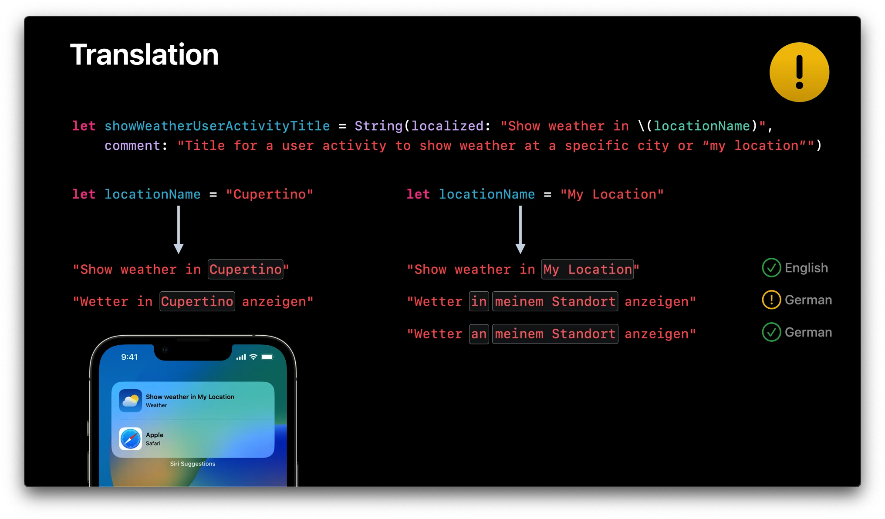

### 三方库中的文案处理

如果你是一个三方库的开发者，并且你的库中也存在一些文案用于展示或者提供给外部，那你也应该对你的三方库做好的本地化的支持。也许你的三方库就被一个国际化的App使用了呢。

今年在 Swift Package 的描述中新增了一个变量`defaultLocalization`来描述 Package 的默认语言，这和我们在主工程中使用的 Developemnt Language 相似。当添加了这个参数后，Xcode 就会认为这个库有本地化的需求，因此前面提到的导入/导出本地化文件的功能也将可以对这个 Swift Package 生效了。而非 Swift Package 的开发者们就只能请大家自己去建一下对应的lproj文件目录了。

```swift
let package = Package(
    name: "FoodTruckKit",
		//默认语言
    defaultLocalization: "en",

    products: [
       .library(
            name: "FoodTruckKit",
            targets: ["FoodTruckKit"]),
    ],
    …
)
```

当开发者在开发一个三方库时，如何才能对库中的文案进行本地化呢？只需在我们正常使用时，额外填充下对应的`bundle`参数就好，毕竟这些本地化资源文件并不在 main bundle 中。

```swift
/* ----------------In SomeKit Framework----------------------*/
//SomeKit/SomeFile.swift
let title = String(localized: "Wind",
                      bundle: Bundle(for: AnyClassInSomeKit.self), 
                     comment: "Title for section that shows data about wind.")
//SomeKit/en.lproj/Localizable.strings
"Wind" = "Wind";
```

### 服务端的翻译

开发App的过程中，有些场景的文案是由服务端下发到客户端，再由客户端去展现的，这类文案无法直接在客户端完成本地化。

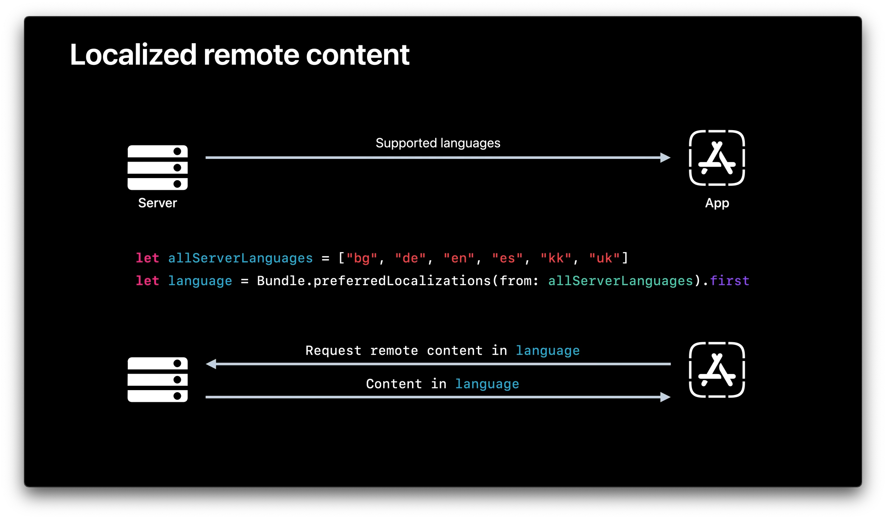

对于这种情况苹果推荐使用`Bundle.preferredLocalizations(from: [serverLanguages])`方法，传入服务端支持的语言，系统会帮你选出匹配的语言，再通过特定的语言去向服务端请求资源。

当然在能确定服务端支持的语言和客户端相同时（绝大多数的情况），客户端直接使用当前App展示的语言去请求会更简单一些。

## 格式化(Formatter)

格式化是本地化过程中的另一块内容。不同语言，除了文案可能不同之外，在一些单位的表述上也大相径庭。比如下图中关于湿度 61% 的表述，可以看到有的数字表述不同，有的单位符号不同，有的表述顺序不同。

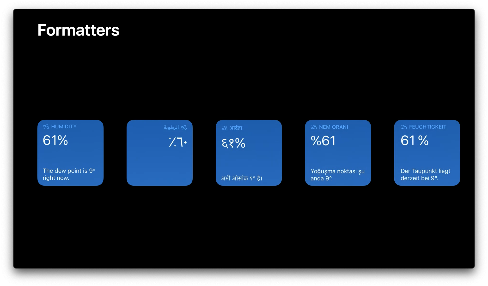

不过好在苹果提供的格式化 API (Formater) 帮助我们处理所有的这些差异。在iOS 15 之后苹果提供了更加 Swift 化的 API 来帮助我们处理格式问题。

```swift
//iOS 15
//SwiftUI
Text(54, format: .percent) //54%
//Swift code
54.formatted(.percent) //54%

//Before iOS 15
let formatter = NumberFormatter()
formatter.numberStyle = .percent
formatter.string(from: NSNumber(value: 0.54)) //54%
```

格式化包含了时间、计量单位，金额单位等各种场景。

```swift
//Dates, times, measurements, percentages, names, and lists should use formatter
["pop", "rock", "electronic"].formatted(.list(type: .or)) // pop, rock, or electronic

Text("Total: \(price, format: .currency(code: "USD"))"), // Total: $9.41
		comment: "Order subtitle: total price of all tickets")
```

苹果对不同类型格式的支持是十分丰富的，下图是一些常用的例子。

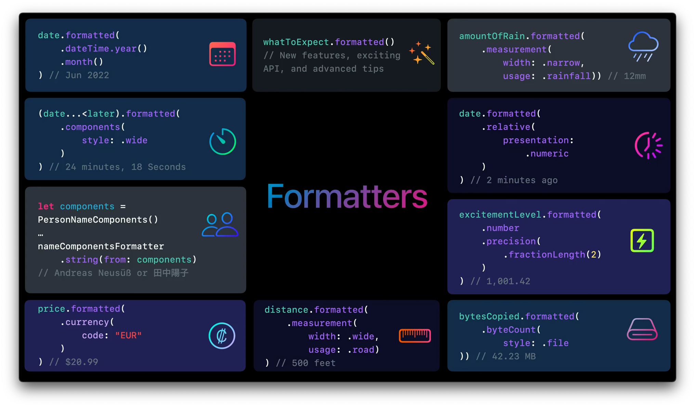

由于处理单位中也会遇到单复数的问题，所以格式化与翻译的结合时会有些繁琐，那么该如何处理呢？下面是一个简单的例子

```swift
//降雨量 12 mm
//iOS 16的新API UnitLength(forLocale:usage:)可以让我们指定选择特定地区的格式
let amountOfRain = Measurement(value: 12, unit: UnitLength(forLocale: .current, usage: .rainfall))

let formattedValue = amountOfRain.formatted(.measurement(width: .narrow, usage: .asProvided))

let integerValue = Int(valueInPreferredSystem.value.rounded())

// 一个包含有 fomatter 值的字符串
return String(localized: "EXPECTED_RAINFALL", 
               defaultValue: "\(integerValue) \(formattedValue) expected in next \(24)h.", 
                    comment: "Label - How much precipitation (2nd formatted value, in mm or Inches) is expected in the next 24 hours (3rd, always 24).")
```

由于牵扯到单复数，我们依旧需要使用前文提到的 stringsdict 文件来进行管理。在上图中可以看到我们的源文案中是有三个变量的`integerValue` `formattedValue` `24`, `integerValue`最终并不会被使用到，这边只是帮助我们在 stringsdict 中进行单复数的区分。因此下图中最终翻译的结果中只出现了`%2$@` `%3$d` 其中的 2$ 和 3$ 分别指代源文案中的第二和第三个变量。而`24`之所以即使是固定的数字也额外使用了变量表示，是为了让它在对应语言中可以被更适当的展示。如下图西语的翻译中可以看到 `%3$d h`，在 24 和 h 之前加入了一个空格，而英语源文中并不存在这一空格。如果不使用单独变量的话，这一细节就无法处理了。

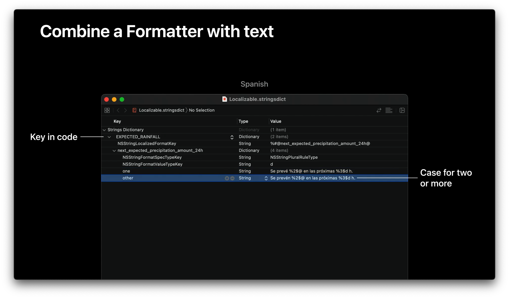

关于更多的 Fomatter 相关的信息，也可以去看 WWDC20-10160 Formatters: Make data human-friendly](https://developer.apple.com/videos/play/wwdc2020/10160/)

## 界面布局

界面布局则是本地化过程中的另一块内容。有时候不同语言本地化的需要，会使得我们的界面布局方式也要做出一定的调整。不过绝大多数情况下只要我们遵守系统的规则，正确的使用自动布局，系统会为我们处理好大部分问题。下面几项是在进行本地化时，布局方面需要额外关注下的场景。当然以下部分场景并不是一定都要做到，而是可以做到的话会使体验更好。

### 左右排版

最常拿来举例的就是阿拉伯语了，这是少数需要从右往左书写/阅读的奇葩语言之一。想要做到最好的体验的话，不光需要保证你的 Label 都是右对齐的，连整个界面的布局都需要做个左右对调，因为这样才符合语言使用者的浏览习惯。

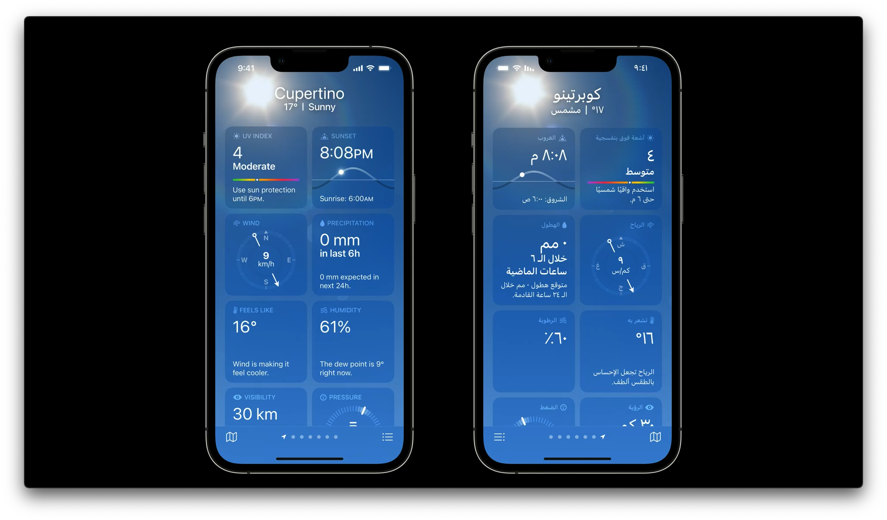

[Get it right (to left)](https://developer.apple.com/videos/play/wwdc2022/10107/) 是今年新出的讲适配类阿拉伯语（从右到左书写/阅读的语言）的 Session，有实际需要的开发者可以去学习一下。由于需要适配阿拉伯语的场景并不太多，这里就不再更详细的描述了。

### 宽高自适应

同一字体下的不同语言的字高也是不相同的，如下图所示，右边的行高是远大于左边的。因此在布局的时候，我们应当避免根据中文/英文的文案来固定 lable 等控件的高度，尽可能让高度去自适应。

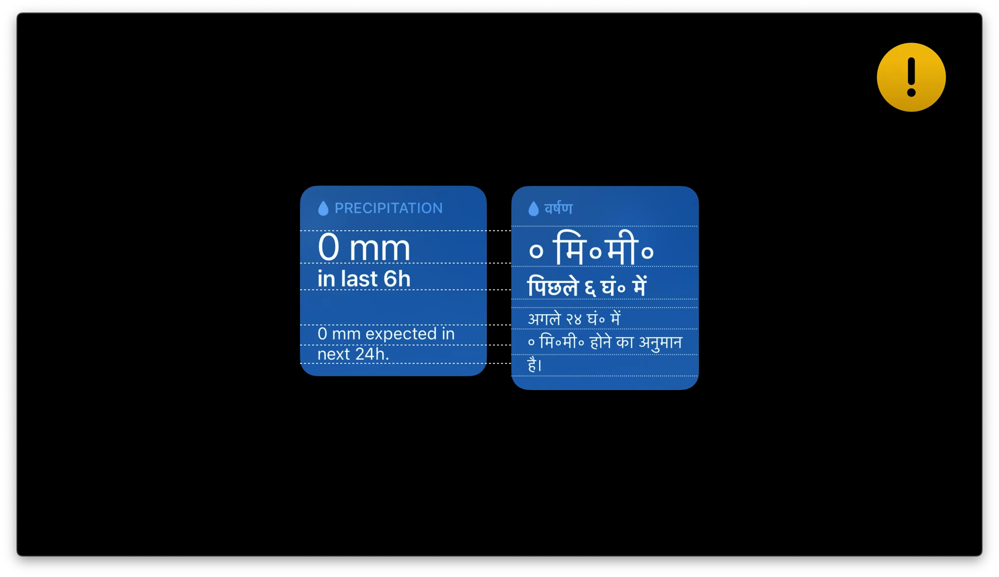

宽度也是类似的情况，同一个单词翻译后文案的长度是不可控的。应当避免限制宽度为固定宽度来进行布局。

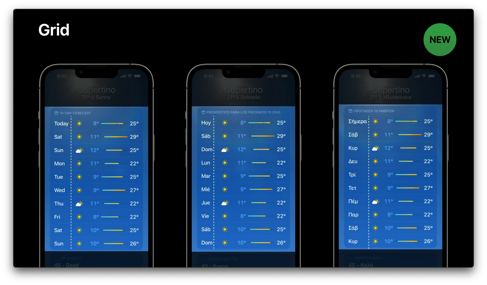

### 行数自适应

遇到本地化文案过长的情况，应该避免直接截断文案，更推荐使用换行的方式进行处理。

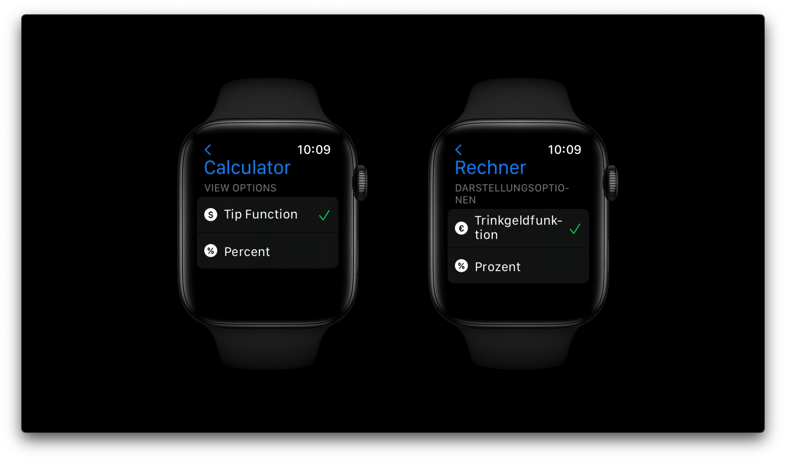

### 更多样化的布局

当空间过小，无法满足本地化的诉求时，也可以考虑更灵活地调整布局。如下图所示，一行四列的按钮可以改为二行二列的结构来满足文案的完整露出。在 SwiftUI 中可以通过`ViewThatFits`来简单的做到这点，不过 UIKit 内就没那么容易实现就是了。像这类优化并不是一个强求的点，开发者们可以按照自己的能力选择性的适配。

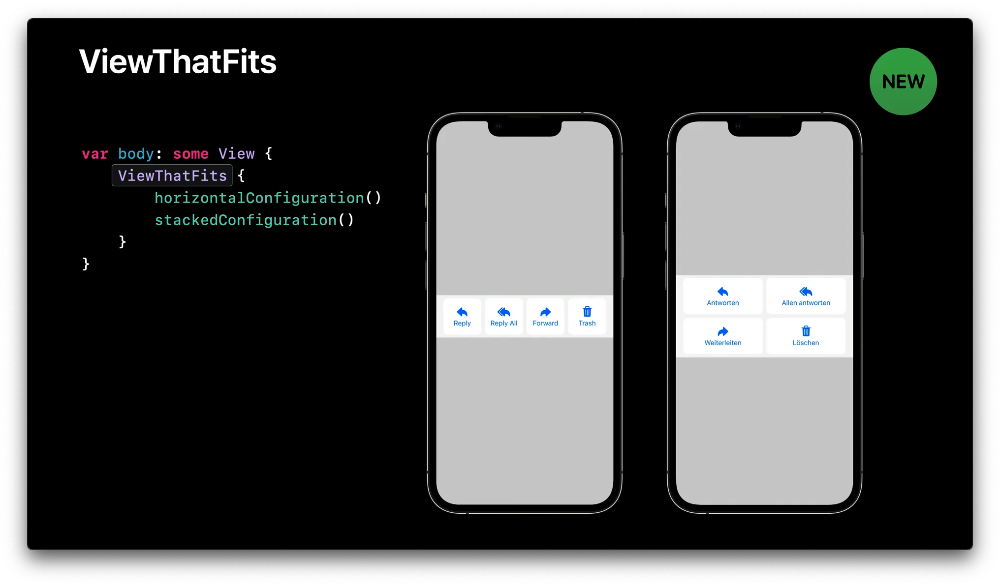

## 总结

本地化是一个非常耗费精力的过程，它涉及到工程中的字符串、单位、界面布局等方方面面，其中任何一点都让原本的开发模式变得更加繁琐、复杂。然而它的优势也是显而易见的，在当前这个号召停止内卷、鼓励出海寻求增加的时代，本地化能帮助开发者给世界各地的用户带来更好的使用体验，从而提升产品的竞争力，击败竞争对手。

做完一个优秀的开发者，我们应该不满足于提供一个可以使用的产品，而应当更进一步，去开发一个对全球用户来说都是易于使用的产品。我相信当有一天你收到来自异国他乡的用户在商店反馈中留下的赞美时，你一定会发自内心地感到欣喜。

> 参考：
>
> [Using Base Internationalization](https://developer.apple.com/library/archive/documentation/MacOSX/Conceptual/BPInternational/InternationalizingYourUserInterface/InternationalizingYourUserInterface.html#//apple_ref/doc/uid/10000171i-CH3-SW2)
>
> [How iOS Determines the Language For Your App](https://developer.apple.com/library/archive/qa/qa1828/)
>
> [WWDC21-10221 Streamline your localizated strings](https://developer.apple.com/videos/play/wwdc2021/10221/)
>
> [Introduction to Localization](https://fluffy.es/introduction-to-localization/)
>
> [Searching for Custom Functions With genstrings](https://developer.apple.com/library/archive/documentation/Cocoa/Conceptual/LoadingResources/Strings/Strings.html#//apple_ref/doc/uid/10000051i-CH6-SW11)
>
> [CLDR](https://cldr.unicode.org/index/cldr-spec/plural-rules)