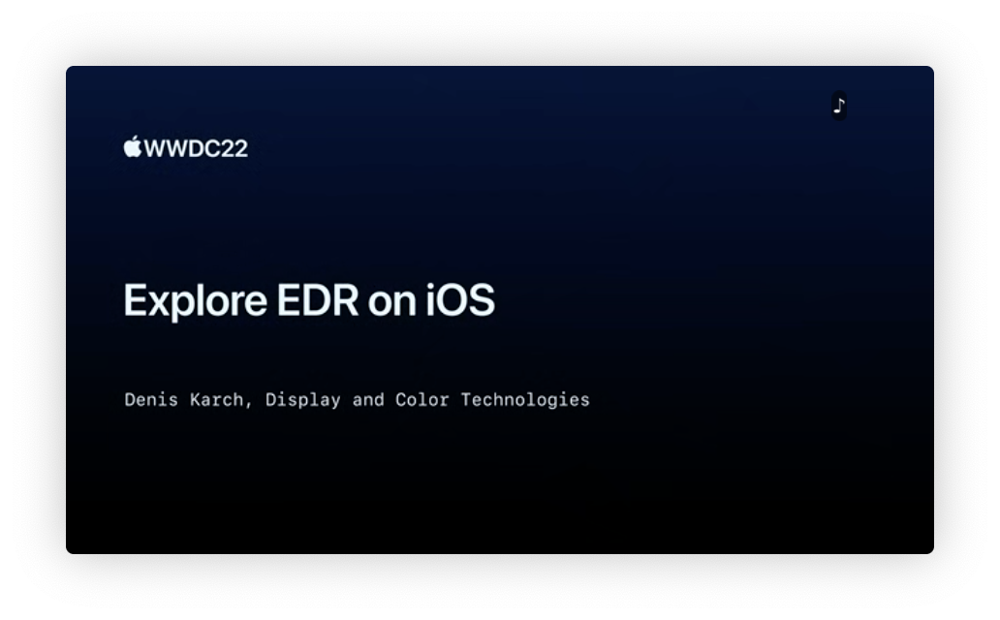

## 个人介绍

Jimbaby，iOS 开发者，目前就职于字节跳动音乐团队

## 审核介绍

## 不超过 120 个字的文章简介

EDR（Extened Dynamic Range）是扩展动态范围，是 Apple 的 HDR 渲染技术和像素表示技术，能更好地表示图像的亮暗细节。2021 年 WWDC 苹果给不支持 HDR 的 Mac 带来了 HDR 的“支持”，今年苹果给不支持 HDR 的 iOS 也带来了 HDR 的“支持” -- iOS EDR 渲染技术。

## 公众号/小专栏图文头图

