# 【WWDC22 10113/10114/110565】在 iOS 上探索 EDR

本文章基于 [Session 10113](https://developer.apple.com/videos/play/wwdc2022/10113/)、[Session 10114](https://developer.apple.com/videos/play/wwdc2022/10114/)、[Session 110565](https://developer.apple.com/videos/play/wwdc2022/110565/) 梳理

> 作者：Jimbaby，iOS 开发者，目前就职于字节跳动音乐团队
> 审核：

## 前言

苹果在产品体验上总是追求极致，图像显示领域也是如此，2019 年苹果上市了支持 HDR 的 [Pro Display XDR](https://www.apple.com/pro-display-xdr/) 显示屏，2021 年 WWDC 苹果给不支持 HDR 的 Mac 带来了 HDR 的 [“支持”](https://developer.apple.com/videos/play/wwdc2021/10161)，今年苹果给不支持 HDR 的 iOS 也带来了 HDR 的“支持” -- iOS EDR 渲染技术。

本文主要讲述「在 iOS 上探索 EDR」，本文整体内容大致如下：

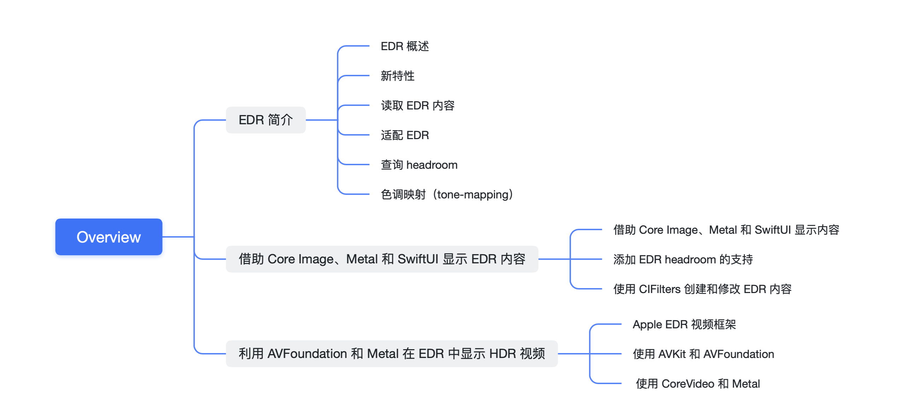

## EDR 简介

### EDR 概述

在图像显示中，用动态范围表示图像的亮暗程度。**SDR（Standard Dynamic Range）是标准动态范围，只能表示 0～1 范围的亮度**，0 代表黑，1 代表白。**HDR（High Dynamic Range）是高动态范围，能表示大于 1 的部分，意味着能更大范围地表示图像的亮暗细节，更好地还原真实世界**。

**EDR（Extened Dynamic Range）是扩展动态范围，是 Apple 的 HDR 渲染技术和像素表示技术，会根据设备本身的亮度范围，扩展表示亮度大于 1 的部分**。在 EDR 渲染中：

- SDR 能渲染，会被映射到 0～1 的范围。
- 1 到当前 EDR headroom 也能渲染。
- 超过当前 EDR headroom 的部分不能渲染，会截掉。

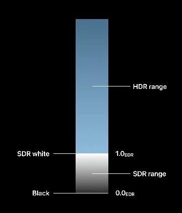 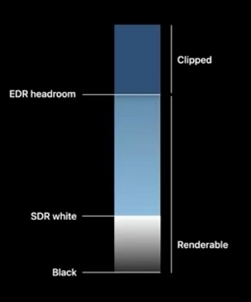

不难发现，EDR 表示范围很大程度上取决于 headroom，那么什么是 headroom 呢？headroom 约等于 **显示屏峰值亮度** 除以 **SDR 亮度**。

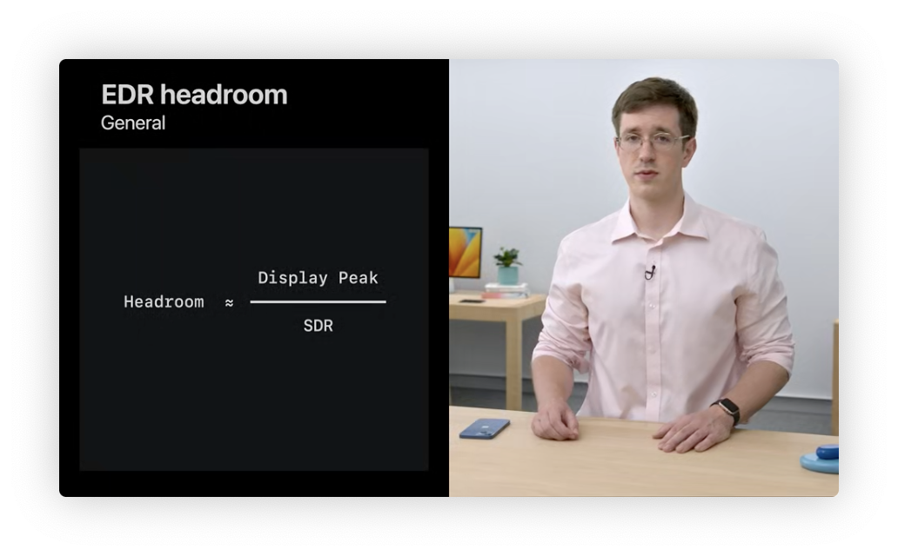

更高的 headroom 能表示更亮的内容，但 headroom 是动态的，当 SDR 亮度进行发生变化时，headroom 也会发生变化。在不同的观看环境里，使用者会更改当前的显示屏亮度，那么此时 SDR 亮度就会发生变化，headroom 也会变化。

另外，不同设备因为亮度峰值不同，EDR headroom 也是不同的，下图罗列了一些常见设备的 EDR headroom：

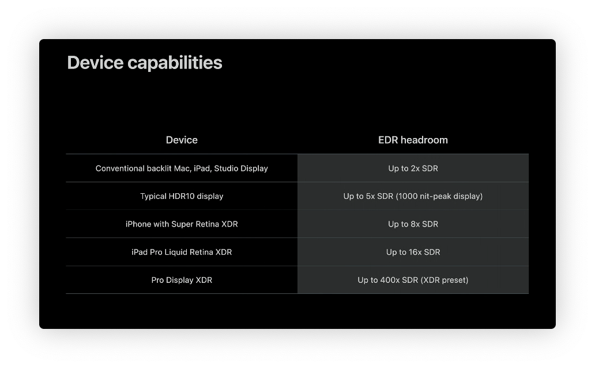

### 新特性

今年 Apple 在 EDR 方面带来的新特性主要是以下三点：

- EDR API 现在支持 iOS 和 iPadOS 了
- 新增参考模式（Reference Mode）
- 在 Sidecar 上支持 EDR 渲染

**参考模式（Reference Mode）**

参考模式是一种新的显示模式，用于颜色关键型工作流程，为各种常见视频格式提供参考结果，例如颜色分级、编辑和内容审查，类似于 macOS 上的参考预设。

开启参考模式，将有以下特点：

- SDK 峰值亮度被固定在 100 尼特，HDR 峰值亮度被固定在 1000 尼特，因此有 10 倍的 EDR headroom。
- 禁用 HDR 色调映射，提供一对一的媒体显示映射。
- 禁用所有为适应环境的动态显示调整，如原彩显示、自动亮度和夜览，而是允许用户手动精细校准白点。

使用参考模式，显示器将产生完全符合各自规格描述的颜色，适合专业的工作流，目前 [LumaFusion](https://luma-touch.com/lumafusion-for-ios-2/?gclid=EAIaIQobChMIpN_LhoDv-AIVEplmAh1ccg9bEAAYASAAEgKhwfD_BwE) 已经支持了参考模式。

参考模式目前主要支持五种最常见的 HDR 和 SDR 视频格式（如下图），提供跨媒体类型的一致参考结果，任何不支持的格式都将按默认显示模式一样去进行颜色管理。另外，与 macOS 上的参考预设不同，参考模式是一个单独的开关，在「设置」的「显示与亮度」中。

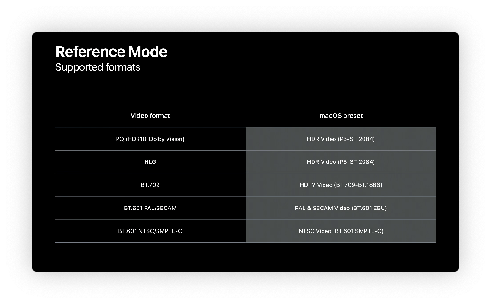

**Sidecar 与参考模式**

[Sidecar](https://support.apple.com/en-us/HT210380) 是一种允许用户将 iPad 作为辅助显示器的技术。随着参考模式的引入，Sidecar 将支持参考级 SDR 和 HDR 内容，专业内容创作者可以将他们的 iPad Pro 作为 Apple silicon Mac 的辅助参考显示器。在参考模式下，在 Sidecar 上渲染的内容，将为所有与 iOS 相同的视频格式提供参考结果。

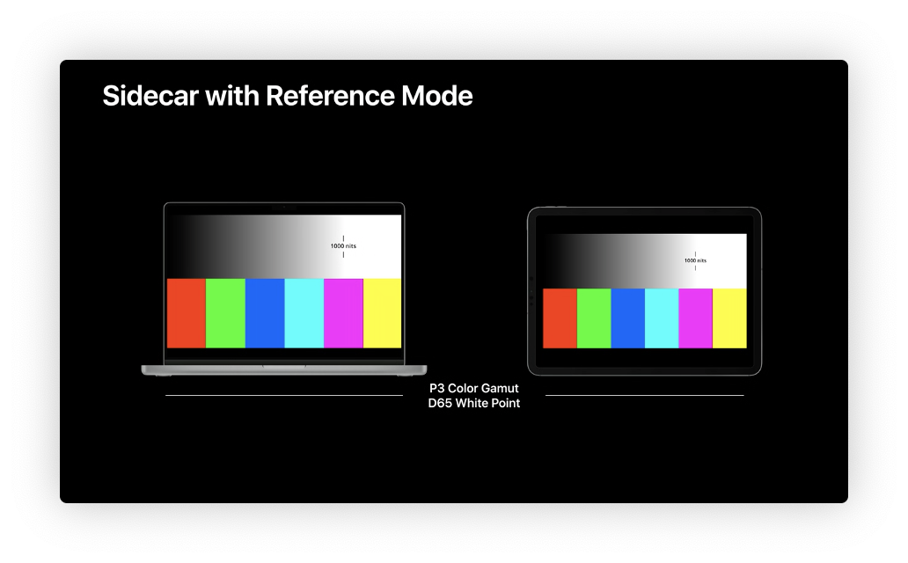

### 读取 EDR 内容

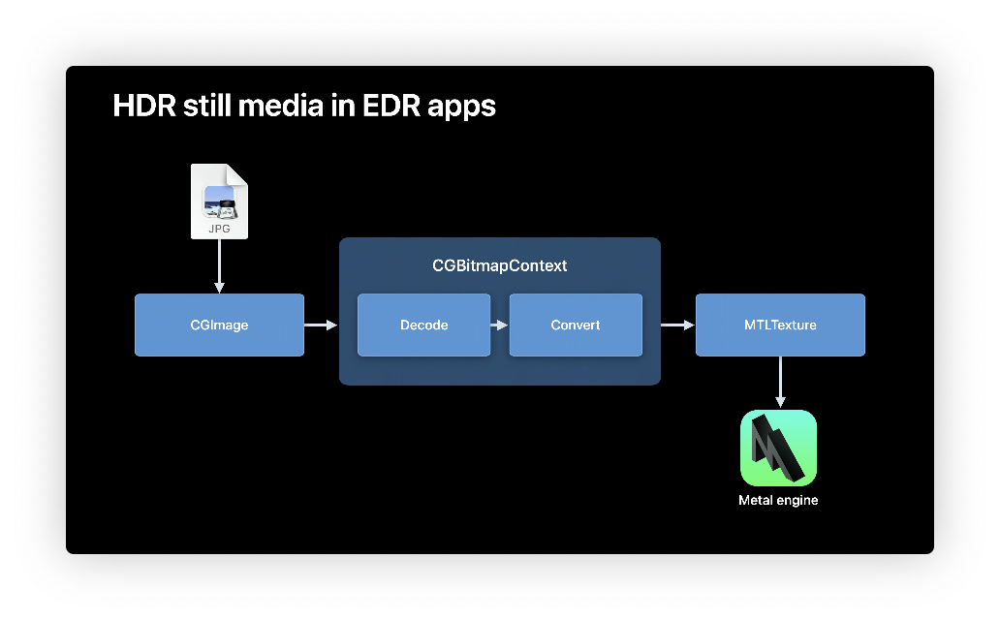

读取 HDR 图像资源到 Metal 纹理，一般分为四个步骤：

1. 从 HDR 图像中创建 CGImage
2. 绘制到浮点位图 context 中
3. 创建浮点纹理
4. 将 EDR 位图加载到纹理中

具体代码实现如下：

```Swift
// 从 HDR 图像中创建 CGImage
let isr = CGImageSourceCreateWithURL(HDRImageURL, nil)
let img = CGImageSourceCreateImageAtIndex(isr, 0, nil)

// 绘制到浮点位图 context 中
let width  = img.width
let height = img.height

let info = CGBitmapInfo(rawValue: kCGBitmapByteOrder16Host |CGImageAlphaInfo.premultipliedLast.rawValue | CGBitmapInfo.floatComponents.rawValue)

let ctx = CGContext(data: nil, width: width, height: height, bitsPerComponent: 16,
    bytesPerRow: 0, space: layer.colorspace, bitmapInfo: info.rawValue)

ctx?.draw(in: img,
          image: CGRect(x: 0, y: 0, width: CGFloat(width), height: CGFloat(height)))

// 创建浮点纹理
let desc = MTLTextureDescriptor()

desc.pixelFormat = .rgba16Float
desc.textureType = .type2D

let texture = layer.device.makeTexture(descriptor: desc)

// 将 EDR 位图加载到纹理中
let data = ctx.data

texture.replace(region: MTLRegionMake2D(0, 0, width, height),
                mipmapLevel: 0,
                withBytes: &data,
                bytesPerRow: ctx.bytesPerRow)
```

### 适配 EDR

适配 EDR 主要分为两个步骤：

1. 使用 CAMetalLayer，并将 `wantsExtendedDynamicRangeContent` 设置为 true。
2. 使用支持的像素格式和颜色空间

具体代码实现如下：

```Swift
// 使用 CAMetalLayer，并将 `wantsExtendedDynamicRangeContent` 设置为 true。
var layer = CAMetalLayer()
layer?.wantsExtendedDynamicRangeContent = true

// 使用支持的像素格式和颜色空间
layer.pixelFormat = MTLPixelFormatRGBA16Float
layer.colorspace  = CGColorSpace(name: kCGColorSpaceExtendedLinearDisplayP3)
```

像素格式和颜色空间需要结合选择，需要选择支持 EDR 的，否则会被裁剪降级成 SDR，具体组合可以参考下图：

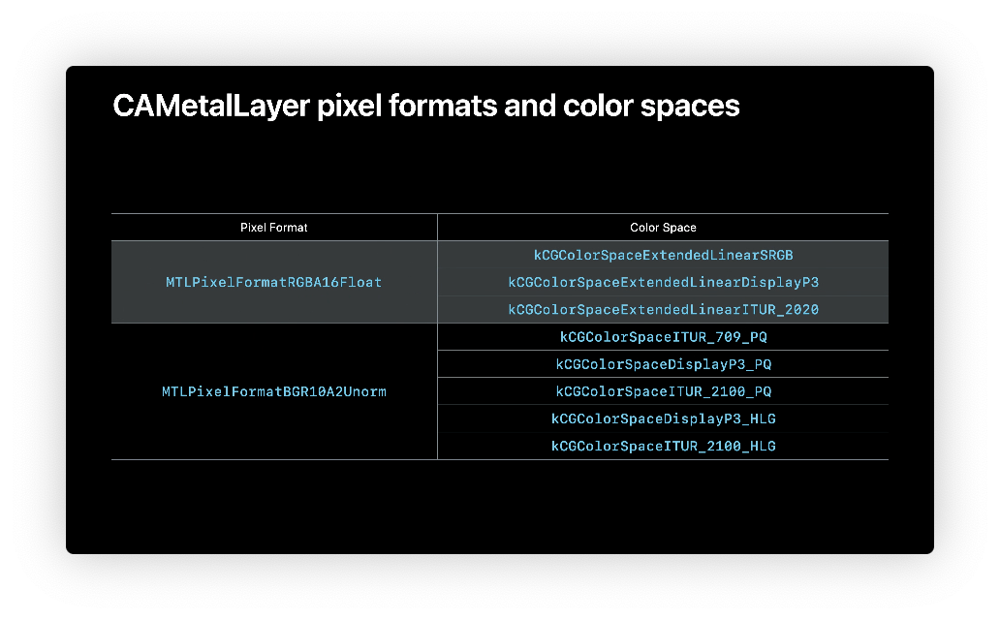

### 查询 headroom

如概述中提到，EDR 的默认行为是裁剪到当前 EDR headroom。目前 iOS 支持了 `potentialEDRHeadroom` 和 `currentEDRHeadroom` API 对潜在 headroom 和当前 headroom 的查询。

在某些情况下，我们可能会认为 headroom 不够高，不足以渲染 EDR 内容，会选择继续使用 SDR 渲染，此时我们可以用 `potentialEDRHeadroom` 来查询潜在 headroom，然后判断如何选择。

有时在内容显示之前，我们希望使用当前 headroom 来调整映射的内容，此时我们可以用 `currentEDRHeadroom` 来查询当前 headroom。

具体 API 使用如下：

```Swift
// 查询潜在 headroom
let screen = windowScene.screen
let maxPotentialEDR = screen.potentialEDRHeadroom
if (maxPotentialEDR < 1.5) {
    // SDR path
}

// 查询当前 headroom
func draw(_ rect: CGRect) {
    let maxEDR = screen.currentEDRHeadroom
    // Tone-map to maxEDR
}
```

另外，还支持了对参考模式（Reference Mode）状态的查询和变化监听，具体 API 使用如下：

```Swift
// 注册参考模式通知
let notification = NotificationCenter.default
notification.addObserver(self,
                         selector: #selector(screenChangedEvent(_:)),
                         name: UIScreen.referenceDisplayModeStatusDidChangeNotification,
                         object: nil)

// 查询最新参考模式状态，以及潜在 headroom
func screenChangedEvent(_ notification: Notification?) {
    let status          = screen.referenceDisplayModeStatus
    let maxPotentialEDR = screen.potentialEDRHeadroom
}
```

参考模式状态有以下四种类型

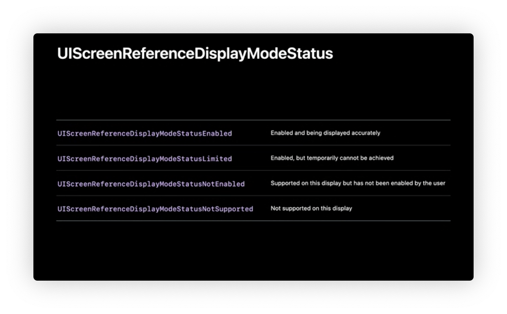

### 色调映射（tone-mapping）

上述中提到，有时我们可以用 `currentEDRHeadroom` 来查询当前 headroom，然后在内容显示之前，按我们自己的色调映射算法来调整最终渲染的内容。但大部分时候，其实我们可以使用系统内置的色调映射算法，使用内置的色调映射一般分为三个步骤：

1. 检查平台是否支持色调映射。
2. 实例化 EDR 元数据。
3. 将 EDR 元数据应用于图层。

具体代码实现流程如下：

```Swift
// 检查平台是否支持色调映射
let isAvailable = CAEDRMetadata.isAvailable

// 实例化 EDR 元数据
// ...

// 将 EDR 元数据应用于图层
let layer: CAMetalLayer? = nil
layer?.edrMetadata = metadata
```

iOS 实例化 EDR 元数据主要有 [HLG](https://en.wikipedia.org/wiki/Hybrid_log%E2%80%93gamma) 和 [HDR10](https://en.wikipedia.org/wiki/HDR10) 这两种格式，具体如何构造如下：

```Swift
// HLG
let edrMetadata = CAEDRMetadata.hlg

// HDR10 (Mastering Display luminance)
let edrMetaData = CAEDRMetadata.hdr10(minLuminance: minLuminance,
                                      maxLuminance: maxContentMasteringDisplayBrightness,
                                      opticalOutputScale: outputScale)

// HDR10 (Supplemental Enhancement Information)
let edrMetaData = CAEDRMetadata.hdr10(displayInfo: displayData,
                                      contentInfo: contentInfo,
                                      opticalOutputScale: outputScale)
```

另外，不同颜色空间使用的不同构造器，具体可以参考下图：

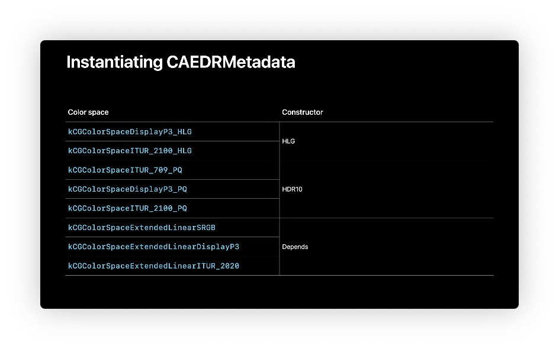

目前 [Pixelmator Photo](https://apps.apple.com/us/app/pixelmator-photo/id1444636541) 应用已经适配了 EDR，下图是 SDR 和 EDR 的效果区别（图左是 SDR 原始效果，图中是 SDR 调大亮度的效果，图右是 EDR 效果）：

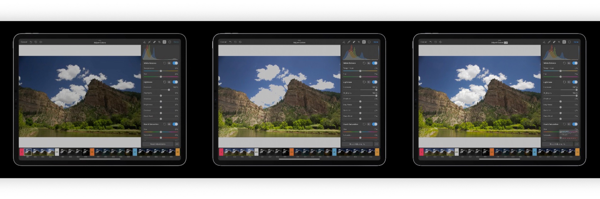

从上图不难发现 EDR 的强大效果：

- SDR 原始效果：有图片细节，但整体偏暗
- SDR 调大亮度的效果：虽然图片整体亮度提升了，但是最亮部分过曝了（即被裁剪了）
- EDR 效果：即提升了图片整体亮度，最亮部分的细节也保留了

> 扩展阅读：对 HDR 和 EDR 感兴趣的同学，可以进一步观看如下两个 session：
>
> - [WWDC20 10009 Edit and play back HDR video with AVFoundation](https://developer.apple.com/videos/play/wwdc2020/10009/)
> - [WWDC21 10161 Explore HDR rendering with EDR](https://developer.apple.com/videos/play/wwdc2021/10161)

## 借助 Core Image、Metal 和 SwiftUI 显示 EDR 内容

我们先简单介绍下 EDR 内容的主要来源：

- 一些可以存储用于 EDR 浮点值的文件格式，如 TIFF 和 OpenEXR。
- 从 HDR 视频文件中获取的帧。
- ProRAW 图像文件。
- Metal GPU 渲染的场景。

本章节主要探索基于 Core Image 的 SwiftUI App 如何跨平台实现 EDR 渲染，整体分为三个部分：

- 借助 Core Image、Metal 和 SwiftUI 显示内容。
- 添加 EDR headroom 的支持。
- 使用 CIFilters 创建和修改 EDR 内容。

### 借助 Core Image、Metal 和 SwiftUI 显示内容

Apple 做了一个 [Sample](https://developer.apple.com/documentation/coreimage/generating_an_animation_with_a_core_image_render_destination) 向我们详细介绍了「借助 Core Image、Metal 和 SwiftUI 显示内容」的最佳实践，其中主要包含 MetalView、Renderer 和 ContentView 三部分。

- MetalView 提供了一个兼容 SwiftUI 的 View 实现，使用 ViewRepresentable 来桥接 SwiftUI 和特定于平台的 MTKView 类，但 MTKView 并不直接负责渲染，它通过其委托来完成这项工作。

- Renderer 是 MTKView 的委托，它负责初始化图形状态对象（如 Metal 命令队列 和 Core Image 上下文），它实现了 MTKView 委托所需的 draw() 方法，但是 Renderer 并不直接负责最终的绘制图像，它使用其 imageProvider 代码块来获取要绘制的 CIImage。

- ContentView 类实现了 imageProvider 代码块，提供要渲染的 CIImage。

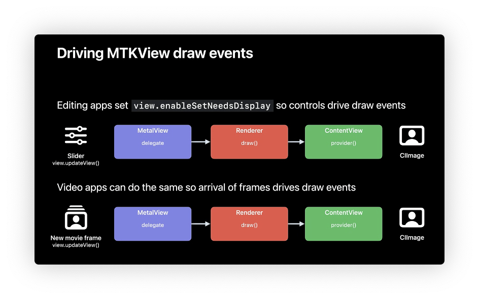

当用户在 App 中触发更新操作时，MetalView 就会调用其委托 Renderer 的 draw() 方法进行绘制，draw() 方法内会调用 ContentView 来获取要绘制的图像。

MetalView、Renderer 和 ContentView 这三部分的具体代码实现如下：

```Swift
// MetalView
struct MetalView: ViewRepresentable {
    
    @StateObject var renderer: Renderer
    
    func makeView(context: Context) -> MTKView {
        let view = MTKView(frame: .zero, device: renderer.device)
       
        view.delegate = renderer

        // Suggest to Core Animation, through MetalKit, how often to redraw the view.
        view.preferredFramesPerSecond = 30
       
        // Allow Core Image to render to the view using Metal's compute pipeline.
        view.framebufferOnly = false
        
       return view
    }
}

// Renderer
func draw(in view: MTKView) {
  if let commandBuffer = commandQueue.makeCommandBuffer(),
     let drawable = view.currentDrawable {
      // Calculate content scale factor so CI can render at Retina resolution.
  #if os(macOS)
      var contentScale = view.convertToBacking(CGSize(width: 1.0, height: 1.0)).width
  #else
      var contentScale = view.contentScaleFactor
  #endif

      let destination = CIRenderDestination(width: Int(view.drawableSize.width),
                          height: Int(view.drawableSize.height), 
                          pixelFormat: view.colorPixelFormat,
                          commandBuffer: commandBuffer,
                          mtlTextureProvider: { () -> MTLTexture in
                                   return drawable.texture
                          })
       
      let time = CFTimeInterval(CFAbsoluteTimeGetCurrent() - self.startTime)

      // Create a displayable image for the current time.
      var image = self.imageProvider(time, contentScaleFactor)

      image = image.transformed(by: CGAffineTransform(translationX: shiftX, y: shiftY))
      image = image.composited(over: self.opaqueBackground)
                
      _ = try? self.cicontext.startTask(toRender: image, from: backBounds,
                                             to: destination, at: CGPoint.zero)

// ContentView
import CoreImage.CIFilterBuiltins

init(struct ContentView: View {
    var body: some View {
       // Create a Metal view with its own renderer.
       let renderer = Renderer(
            imageProvider: { (time: CFTimeInterval, scaleFactor: CGFloat) -> CIImage in
            
            var image: CIImage

            // create image using CIFilter.checkerboardGenerator...

            return image
        })
        MetalView(renderer: renderer)
    }
}                                            
```

### 添加 EDR headroom 的支持

添加 EDR headroom 的支持，主要分为三个步骤：

1. MTKView 初始化时， 将其 CAMetalLayer 的 wantsExtendedDynamicRangeContent 设置为 true，然后使用支持的像素格式和颜色空间。
2. Renderer 渲染时，计算当前的 headroom，并在获取图像时将 headroom 传递给 ContentView。
3. ContentView 使用 headroom 生成最终的图像。

具体代码实现如下：

```Swift
// MetalView 改动：配置 CAMetalLayer 的 wantsExtendedDynamicRangeContent、pixelFormat 和 colorspace
if let caMtlLayer = view.layer as? CAMetalLayer  {
    caMtlLayer.wantsExtendedDynamicRangeContent = true
    caMtlLayer.pixelFormat = MTLPixelFormat.rgba16Float
    caMtlLayer.colorspace = CGColorSpace(name: CGColorSpace.extendedLinearDisplayP3)
}

// Renderer 改动：计算当前的 headroom
let screen = view.window?.screen;
#if os(macOS)
     let headroom = screen?.maximumExtendedDynamicRangeColorComponentValue ?? 1.0
#else
     let headroom = screen?.currentEDRHeadroom ?? 1.0
#endif
     var image = self.imageProvider(time, contentScaleFactor, headroom)

// ContentView 改动：使用 headroom 创建图像
imageProvider: { (time: CFTimeInterval, scaleFactor: CGFloat, headroom: CGFloat) -> CIImage in
  var image: CIImage

  // 使用 CIFilters、time、scale、headroom 创建图像
  return image
})
```

### 使用 CIFilters 创建和修改 EDR 内容

Core Image 内置的 150 多个 filter 支持 EDR，比如 CIColorControls 和 CIExposureAdjust filter 可以改变带 EDR 图像的亮度、色调、饱和度和对比度。

但也有不支持 EDR 的 filter，可以通过 Xcode QuickLook 查看，代码实现如何判断如下：

```Swift
let f = CIFilter.colorControls()
let categories = .attributes[kCIAttributeFilterCategories] as! Array‹String>
let isEDR = categories.contains (kCICategoryHighDynamicRange)
```

接下来，我们通过「在上述示例中添加一个具有明亮镜面反射的波纹效果」来具体了解下如何使用 filter 和 headroom。添加一个具有明亮镜面反射的波纹效果，主要分为两个步骤：

1. 使用 headroom 生成 shadingImage，实现渐变和高光效果。
2. 创建一个 rippleTransition filter 的实例，将输入图像和目标图像都设置为棋盘格图像，并设置波纹效果的中心点和动画时间，通过 shadingImage 设置渐变效果，以便在波纹上产生镜面高光反射。

具体代码实现如下：

```Swift
// 使用 headroom 生成 shadingImage
let gradient = CIFilter.linearGradient()
let w = min( headroom, 8.0 )
gradient.color0 = CIColor(red: w, green: w, blue: w, 
                          colorSpace: CGColorSpace(name: CGColorSpace.extendedLinearSRGB)!)!
gradient.color1 = CIColor.clear
gradient.point0 = CGPoint(x: sin(Double.pi/2)*90.0 + 100.0, y: cos(Double.pi/2)*90.0 + 100.0)
gradient.point1 = CGPoint(x: sin(Double.pi/2)*85.0 + 100.0, y: cos(Double.pi/2)*85.0 + 100.0)
let shading = gradient.outputImage?.cropped(to: CGRect(x: 0, y: 0, width: 200, height: 200))

// 使用波纹效果 Filter
let ripple = CIFilter.rippleTransition()
ripple.inputImage = image
ripple.targetImage = image
ripple.center = CGPoint(x: 512.0, y: 384.0)
ripple.time = Float(fmod(time*0.25, 1.0))
ripple.shadingImage = shading
image = ripple.outputImage
```

接下来介绍一个非常受欢迎的 filter CIColorCubeWithColorSpace，它可以使用 EDR 色彩空间（例如 HLG 或 PQ），也可以设置新属性 extrapolate 为 true 后处理 EDR 图像，具体应用如下：

```Swift
let f = CIFilter.colorCubeWithColorSpace()
f.cubeDimension = 32
f.cubeData = sdrData
f.extrapolate = true
f.inputImage = edrImage
let edrResult = f.outputImage
```

最后，我们介绍下创建自定义 CIKernel 的一些最佳实践：

1. 避免使用将 RGB 限制在 0～1 的函数

   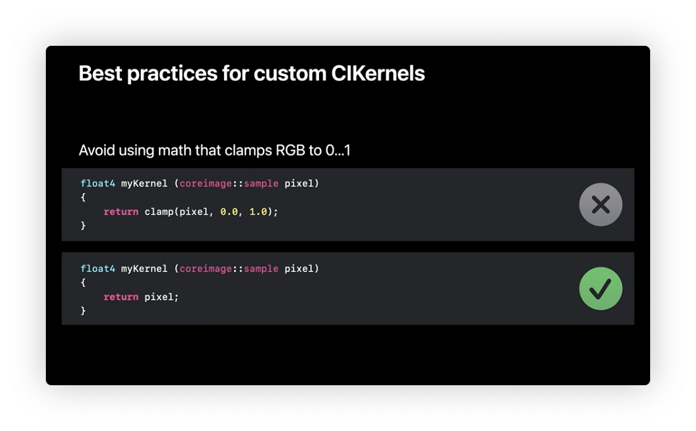

2. 不要使用可能让 alpha > 1 的函数，因为即使 RGB 值可以超出 0 到 1 的范围，但 alpha 值仍必须介于 0 和 1 之间，否则会在混合或显示图像时出现未定义的行为。

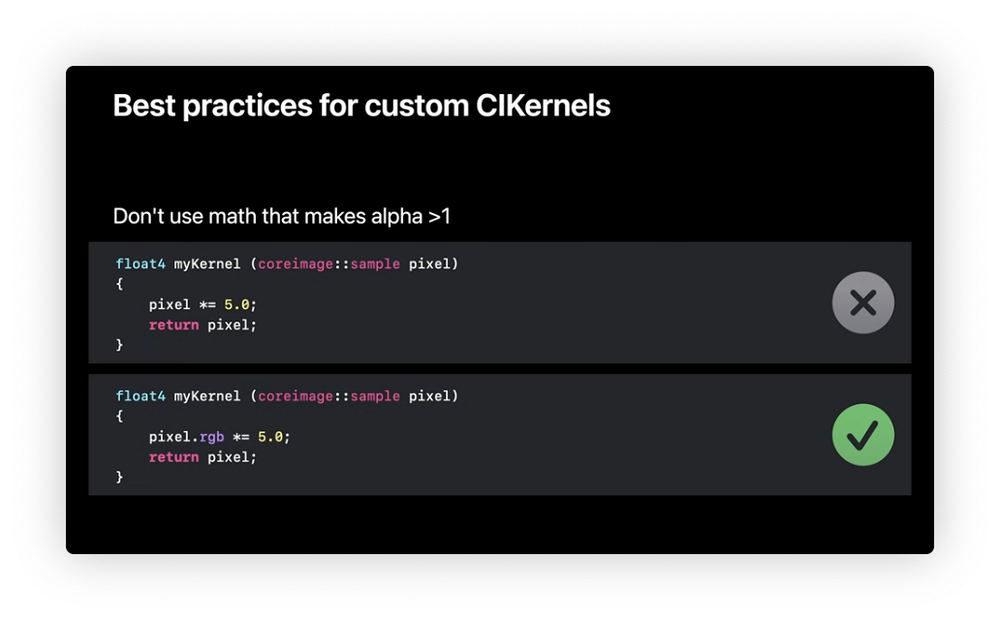

## 利用 AVFoundation 和 Metal 在 EDR 中显示 HDR 视频

本章节主要介绍「如何利用 AVFoundation 和 Metal 在 EDR 中显示 HDR 视频」，内容主要分为三部分：

1. Apple EDR 视频框架：视频框架从上到下被分为 AVKit、AVFoundation、Core Video、 Video Toolbox 和 Core Media 五层，并讲解每一层的功能和主要 API。

2. 使用 AVKit 和 AVFoundation：使用高层级 AVKit 和 AVFoundation 框架直接播放 HDR 视频。

   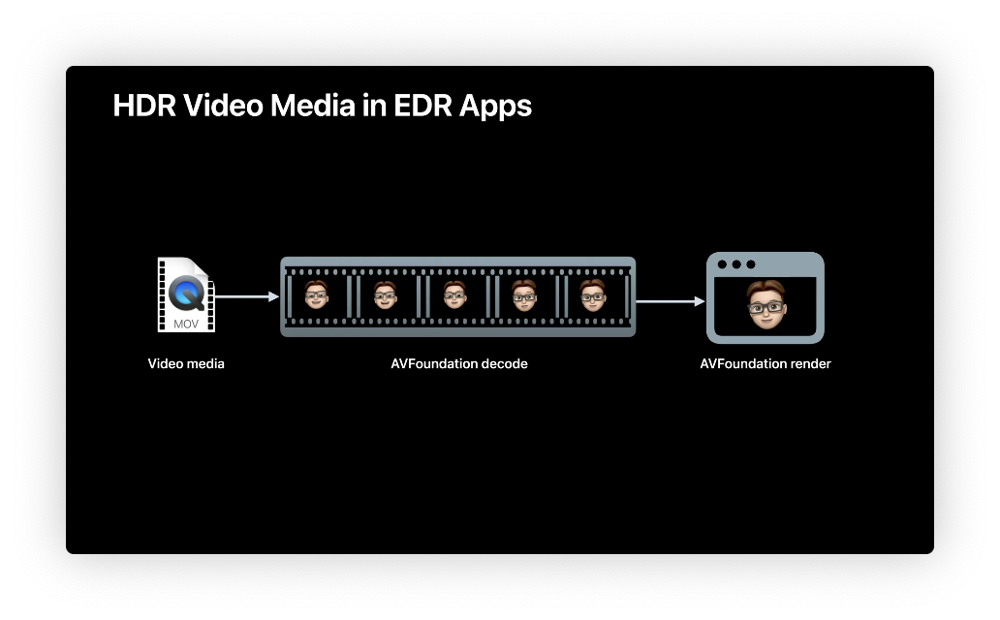

3. 使用 CoreVideo 和 Metal：通过 Core Video 的 DisplayLink 实时访问解码的视频帧，通过 CoreImage Filters 或 Metal Shader 添加颜色管理、视觉效果等，最后用 Metal 进行渲染。

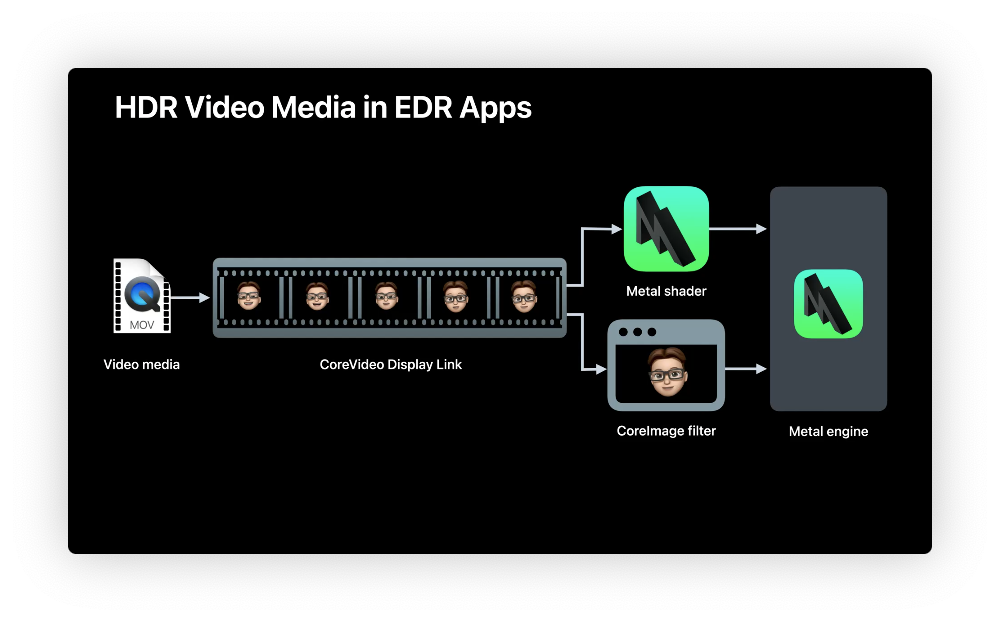

### Apple EDR 视频框架

Apple EDR 视频框架从上到下被分为 AVKit、AVFoundation、Core Video、 Video Toolbox 和 Core Media 五层

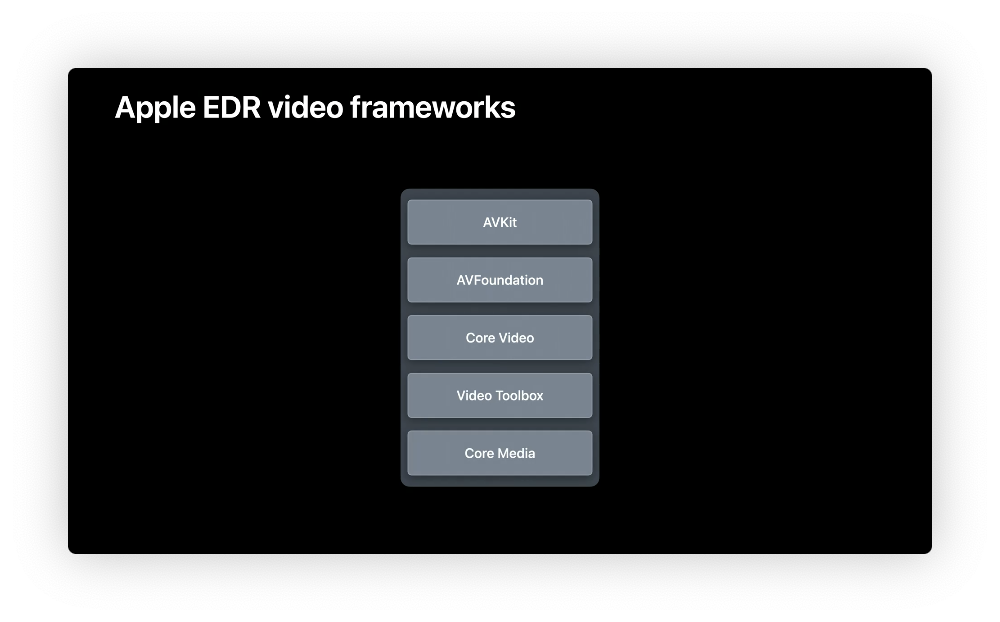

- AVKit 是高层级的框架，可以创建媒体播放的用户界面，包括传输控件、章节导航、画中画支持以及字幕和隐藏字幕的显示。AVKit 可以将 HDR 内容作为 EDR 播放，我们通过 AVPlayerViewController 来实现。
  
- AVFoundation 是功能齐全的音视频框架，可以轻松播放、创建和编辑 QuickTime 电影和 MPEG 4 文件，播放 HLS 流，并在我们的应用程序中构建强大的媒体功能。在这一层，我们可以通过 AVPlayer 和 AVPlayerLayer 来实现音视频功能。
  
- Core Video 是一个为数字视频提供流水线模型的框架，使我们更容易访问和操作单个帧，而无需担心数据类型之间的转换或显示同步。在这一层，我们将通过 DisplayLink、CVPixelBuffer、CoreImage、CVMetalTextureCache 和 Metal 的使用来实现播放处理。

- Video Toolbox 是一个低层级的框架，提供对硬件编码器和解码器的直接访问。它提供视频压缩和解压缩服务，以及存储在 Core Video 像素缓冲区中的光栅图像格式之间的转换服务。在一层，我们可以使用 VTDecompressionSession 这个功能强大的低级接口，有兴趣的同学可以进一步研究。

- Core Media 主要定义了低层级数据类型、接口和媒体流水线，来提供给其他高层级框架使用。

### 使用 AVKit 和 AVFoundation

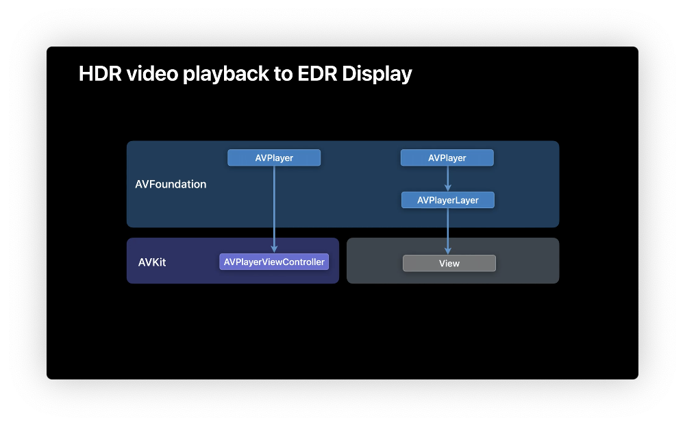

使用 AVKit 和 AVFoundation 播放 HDR 视频，本质都是使用 AVPlayer 的播放能力，AVPlayer 可以直接高性能播放 HDR 视频，它会尽可能自动地将结果呈现为 EDR 内容。 一般有两种实现方式：

- 通过 AVPlayer 和 AVPlayerViewController 实现，这种方式最简单，代码实现如下：

```Swift
// 使用 AVPlayer 和 AVPlayerViewController 播放视频
let player = AVPlayer(URL: videoURL)

var playerViewController = AVPlayerViewController()

playerViewController.player = player

self.presentViewController(playerViewController, animated: true) {
   playerViewController.player!.play()
}
```

- 通过 AVPlayer 和 AVPlayerLayer 实现，这种方式可以将视频加到任意其他视图上，代码实现如下：

```Swift
// 使用 AVPlayer 和 AVPlayerLayer 播放视频
let player = AVPlayer(URL: videoURL)

var playerLayer = AVPlayerLayer(player: player)

playerLayer.frame = self.view.bounds

self.view.layer.addSublayer(playerLayer)

player.play()
```

### 使用 CoreVideo 和 Metal

使用 AVKit 和 AVFoundation 可以很简单地实现播放 HDR 视频，但是很多应用有更复杂的需求，比如有颜色分级等图像处理的诉求，那么我们就需要使用 CoreVideo 和 Metal 来解决了。

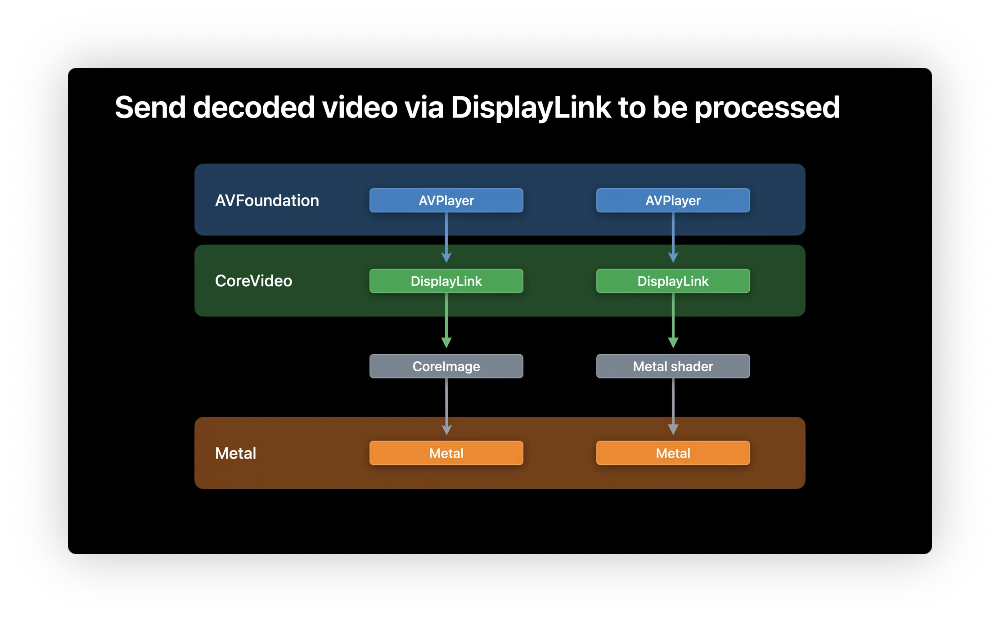

使用 CoreVideo 和 Metal 工作流程一般是这样的：从 AVPlayer 获取解码的视频帧，实时使用 Core Image Filter 或 Metal Shader，并将结果呈现为 EDR。总结下来大致分为三个步骤：

1. 使用 CAMetalLayer 开启 EDR 渲染能力。
2. 从 AVPlayer 获取解码的视频帧。
3. 实时使用 Core Image Filter 或 Metal Shader 进行图像处理，最终通过 Metal 渲染成 EDR。

第一步，使用 CAMetalLayer 开启 EDR 渲染能力。

使用 CAMetalLayer，并将其 wantsExtendedDynamicRangeContent 设置为 true，然后使用支持的像素格式和颜色空间，代码实现如下：

```Swift
// Opt into using EDR
let layer: CAMetalLayer
layer.wantsExtendedDynamicRangeContent = true

// Use half-float pixel format
layer.pixelFormat = MTLPixelFormatRGBA16Float

// Use extended linear display P3 color space
layer.colorspace = kCGColorSpaceExtendedLinearDisplayP3
```

第二步，从 AVPlayer 获取解码的视频帧。

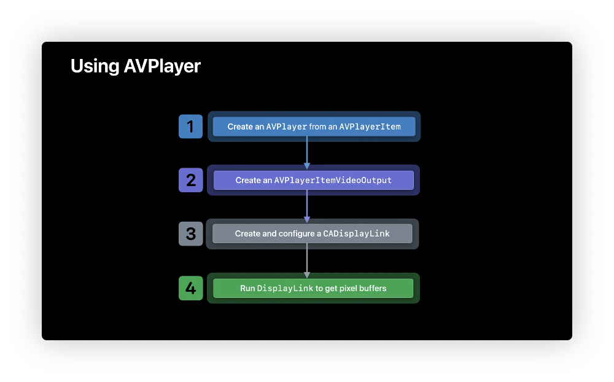

从 AVPlayer 获取解码的视频帧一般分为四个步骤：

1. 先创建一个 AVPlayerItem，再从 AVPlayerItem 创建一个 AVPlayer。
2. 创建一个 AVPlayerItemVideoOutput。
3. 创建并配置 CADisplayLink。
4. 运行 DisplayLink 以获取像素缓冲区。

具体代码实现如下：

```Swift
// 1. 先创建一个 AVPlayerItem，再从 AVPlayerItem 创建一个 AVPlayer
let videoPlayerItem = AVPlayerItem(url: HDRVideoURL!)
var videoPlayer: AVPlayer? = AVPlayer(playerItem: videoPlayerItem)

// 2. 创建一个 AVPlayerItemVideoOutput
let videoColorProperties = [
    AVVideoColorPrimariesKey: AVVideoColorPrimaries_P3_D65,
    AVVideoTransferFunctionKey: AVVideoTransferFunction_Linear,
    AVVideoYCbCrMatrixKey: AVVideoYCbCrMatrix_ITU_R_2020
]

let outputVideoSettings = [
    AVVideoAllowWideColorKey: true,
    AVVideoColorPropertiesKey: videoColorProperties,
    kCVPixelBufferPixelFormatTypeKey as String: NSNumber(value: kCVPixelFormatType_64RGBAHalf)
] as [String : Any]
   
let videoPlayerItemOutput 
= AVPlayerItemVideoOutput(outputSettings: outputVideoSettings)

// 3. 创建并配置 CADisplayLink
lazy var displayLink: CADisplayLink 
= CADisplayLink(target: self, 
                selector: #selector(displayLinkCopyPixelBuffers(link:)))

var statusObserver: NSKeyValueObservation?

statusObserver = videoPlayerItem.observe(\.status,
      options: [.new, .old],
      changeHandler: { playerItem, change in
        if playerItem.status == .readyToPlay {
          playerItem.add(videoPlayerItemOutput)
          displayLink.add(to: .main, forMode: .common)
          videoPlayer?.play()
        }
     })
}

// 4. 运行 DisplayLink 以获取像素缓冲区
@objc func displayLinkCopyPixelBuffers(link: CADisplayLink) 
{
  let currentTime = videoPlayerItemOutput.itemTime(forHostTime: CACurrentMediaTime())
 
  if videoPlayerItemOutput.hasNewPixelBuffer(forItemTime: currentTime)
  {
      if let buffer 
      = videoPlayerItemOutput.copyPixelBuffer(forItemTime: currentTime, 
                                           itemTimeForDisplay: nil) 
   {
        //...
     }
 }
}
```

第三步，实时使用 Core Image Filter 或 Metal Shader 进行图像处理，最终通过 Metal 渲染成 EDR。

不难看出，这一步有两种实现方式，一种通过 Core Image Filter 实现，一种通过 Metal Shader 实现。

**Core Image Filter 实现**

```Swift
@objc func displayLinkCopyPixelBuffers(link: CADisplayLink) 
{
  let currentTime = videoPlayerItemOutput.itemTime(forHostTime: CACurrentMediaTime())
 
  if videoPlayerItemOutput.hasNewPixelBuffer(forItemTime: currentTime)
  {
      if let buffer 
      = videoPlayerItemOutput.copyPixelBuffer(forItemTime: currentTime, 
                                           itemTimeForDisplay: nil) 
   {
        let image = CIImage(cvPixelBuffer: buffer)

        let filter = CIFilter.sepiaTone()
        filter.inputImage = image
        output = filter.outputImage ?? CIImage.empty()
    
        // use context to render to your CIRenderDestination
     }
  }
}
```

**Metal Shader 实现**

使用 Metal Shader 处理和渲染 CVPixelBuffer 一般有两个路径：

1. 将 CVPixelBuffer 转换为 MetalTexture。该过程一般是从 CVPixelBuffer 获取 IOSurface，创建一个 MetalTextureDescriptor，然后使用 `newTextureWithDescriptor` 从 MetalDevice 创建一个 MetalTexture。但是使用不当，纹理可能会被重复使用和过度绘制，这是比较危险的，另外并非所有 PixelBuffer 格式都由 MetalTexture 原生支持。由于这些复杂性，所以我们更推荐另一种方式。
  
2. 从 CVMetalTextureCache 中直接获取 MetalTexture。CVMetalTextureCache 是一种将 CVPixelBuffers 与 Metal 一起使用的直接而高效的方法，有如下特点：
   1. 可以直接从 CVMetalTextureCache 中获得 MetalTexture，而无需进一步转换。
   2. 管理 CVPixelBuffer 和 MetalTexture 之间的桥接。
   3. 结合 CVPixelBufferPools 通过保持 MTLTexture 到 IOSurface 的映射保活，提供了性能优势。
   4. 不需要手动跟踪 IOSurface。

「从 CVMetalTextureCache 中直接获取 MetalTexture」的主要过程如下图：

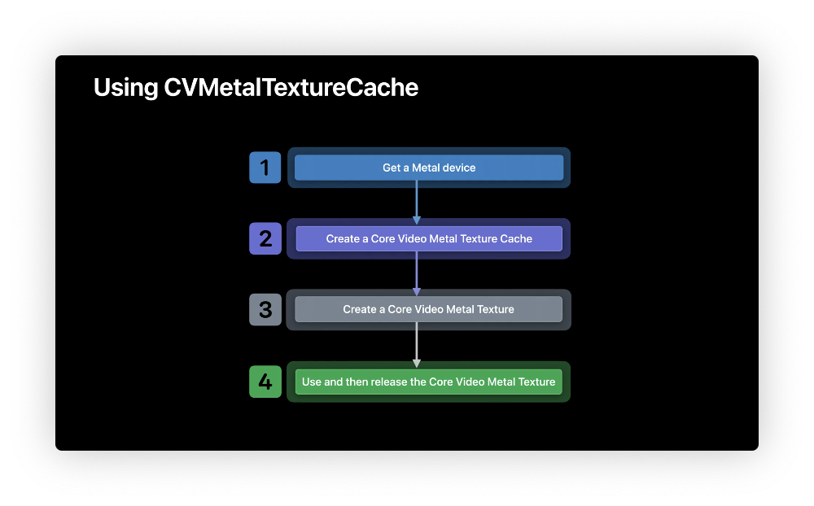

主要分为四个步骤：

1. 创建一个 Metal Device。
2. 用 Metal Device 创建一个 CVMetalTextureCache。
3. 用 CVMetalTextureCache 和 pixelBuffer 创建一个 CVMetalTextureRef。
4. 使用 CVMetalTextureRef，并在 Metal command buffer 完成后释放 CVMetalTextureRef。

具体代码实现如下：

```Swift
// 1. 创建一个 Metal Device

let mtlDevice = MTLCreateSystemDefaultDevice()

// 2. 用 Metal Device 创建一个 CVMetalTextureCache
var mtlTextureCache: CVMetalTextureCache? = nil

CVMetalTextureCacheCreate(allocator: kCFAllocatorDefault, 
                          cacheAttributes: nil, 
                          metalDevice: mtlDevice, 
                          textureAttributes: nil, 
                          cacheOut: &mtlTextureCache)

// 3. 用 CVMetalTextureCache 和 pixelBuffer 创建一个 CVMetalTextureRef
let width  = CVPixelBufferGetWidth(pixelBuffer)
let height = CVPixelBufferGetHeight(pixelBuffer)

var cvTexture : CVMetalTexture? = nil

CVMetalTextureCacheCreateTextureFromImage(allocator: kCFAllocatorDefault, 
                                          textureCache: mtlTextureCache, 
                                          sourceImage: pixelBuffer, 
                                          textureAttributes: nil, 
                                          pixelFormat: MTLPixelFormatRGBA16Float, 
                                          width: width, 
                                          height: height, 
                                          planeIndex: 0, 
                                          textureOut: &cvTexture)

let texture = CVMetalTextureGetTexture(cvTexture)

// 4. 使用 CVMetalTextureRef，并在 Metal command buffer 完成后释放 CVMetalTextureRef
```

## 总结

最后，我们来总结下全文的大致内容。

1. EDR（Extened Dynamic Range）是扩展动态范围，是 Apple 的 HDR 渲染技术和像素表示技术，能更好地表示图像的亮暗细节。
2. EDR API 现在支持 iOS 和 iPadOS 了，并且增加了参考模式（Reference Mode），在 Sidecar 上也支持 EDR 渲染，对专业工作者提供了更好的帮助。
3. 借助 Core Image、Metal 和 SwiftUI 可以很好地显示 EDR 内容，并且可以使用内置的 CIFilters 创建和修改 EDR 内容。
4. 利用 AVFoundation 和 Metal 都可以在 EDR 中显示 HDR 视频。使用 AVKit 和 AVFoundation 框架可以直接播放 HDR 视频。使用 CoreVideo 和 Metal 实时处理显示 EDR 内容，通过 Core Video 的 DisplayLink 实时访问解码的视频帧，再通过 CoreImage Filters 或 Metal Shader 添加颜色管理、视觉效果等，最后用 Metal 进行渲染。
