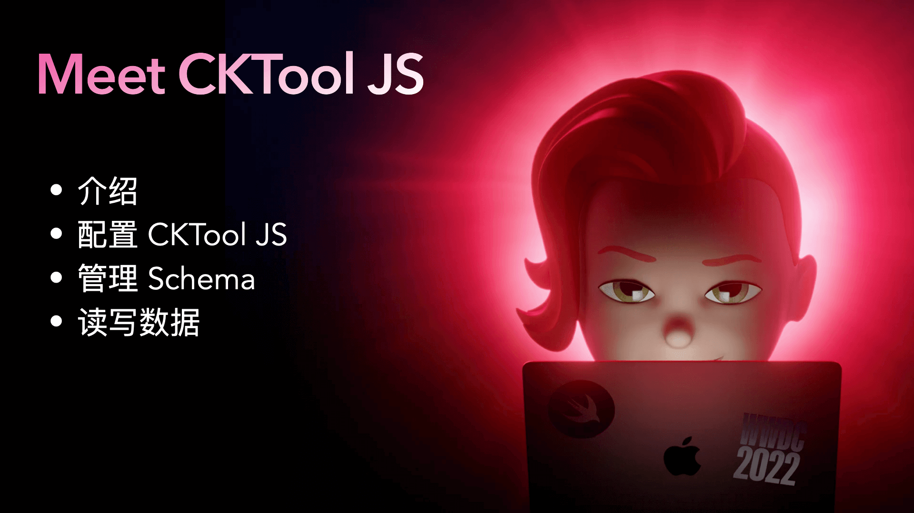
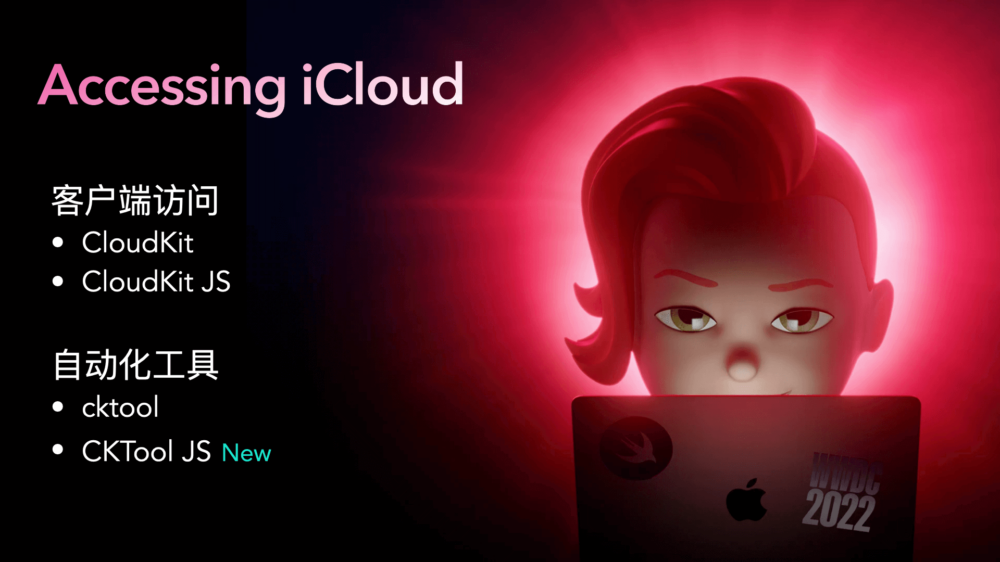
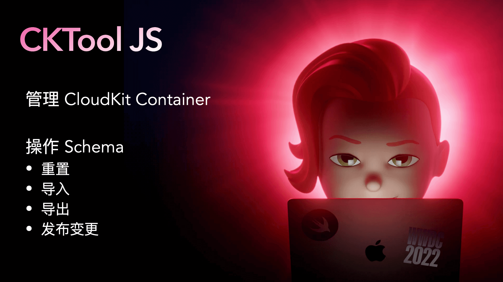
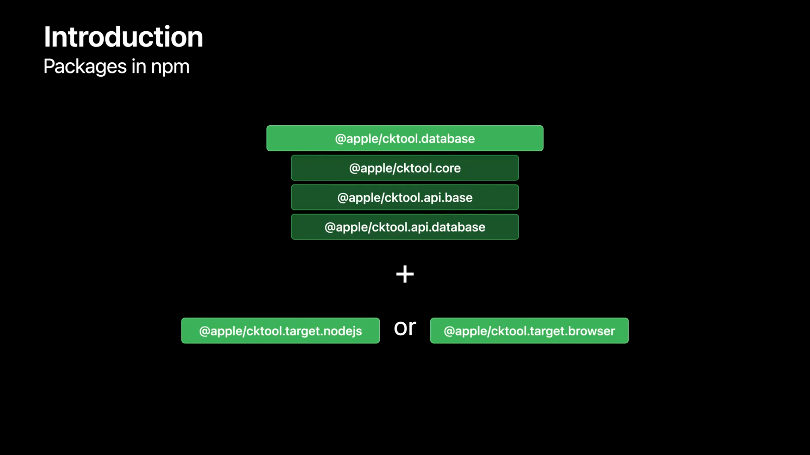
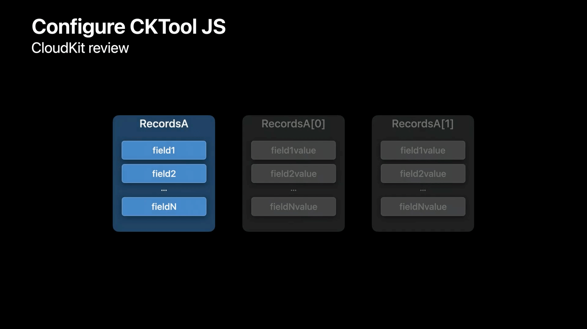
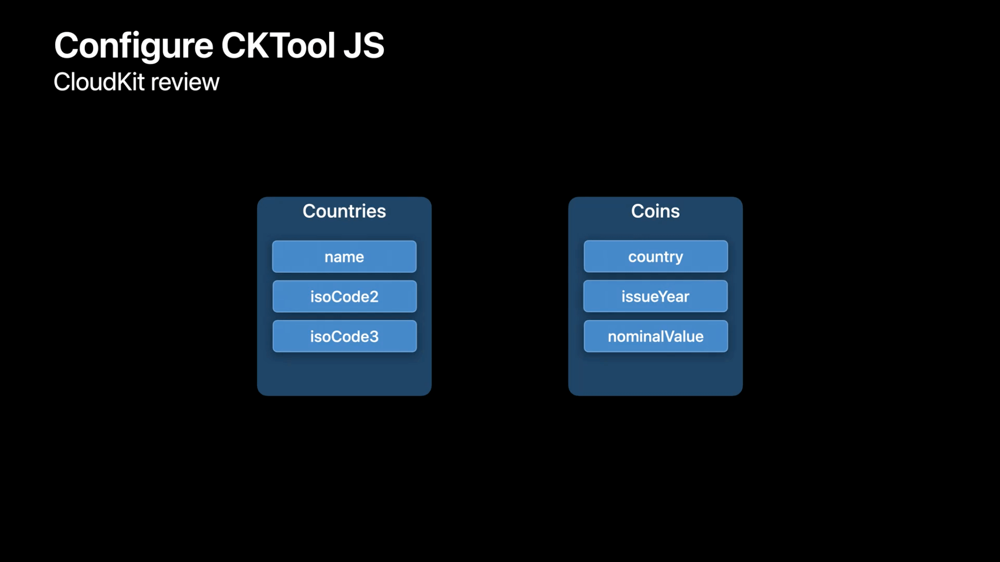
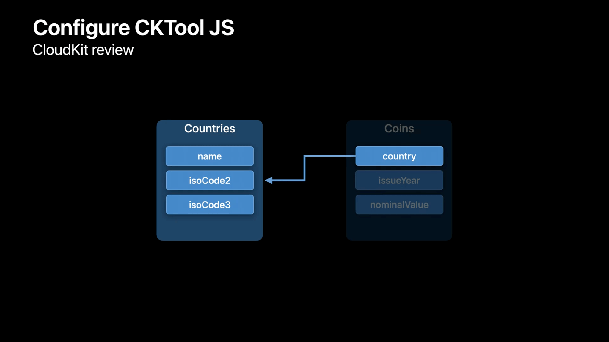
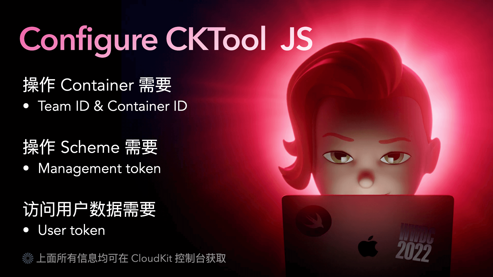

# WWDC22 10116 Meet CKTool JS / 初见 CKTool JS

本文基于 [Session 10116](https://developer.apple.com/videos/play/wwdc2022/10116) 梳理。

> 作者：LabLawliet，在广州搬砖的 iOS 独立开发者，Swift 爱好者，[GitHub](https://github.com/RyukieSama)。

## 前言



本文将带你了解如何使用 `CKTool JS` 自动化管理 `iCloud` 容器。展示如何配置 `CKTool JS` 来管理容器、修改记录以及操作数据。我们还将探讨如何将 `CKTool JS` 集成到自动化工作流程中。为了更好的理解，建议先熟悉 `CloudKit`、`JavaScript` 和 `npm`。

> 本次 `WWDC` 还有其他关于 `CloudKit` 的更新内容可以移步 [WWDC22 10115/10119 - Optimize your use of Core Data and CloudKit / 优化 CoreData & CloudKit 实现](../session_10119/README.md)

## 一、 介绍

### 1.1 CloudKit 简介

`CloudKit` 是苹果为开发者提供的云端存储服务，可将应用程序的数据存储在 `iCloud` 容器中。通过在应用程序中使用 `CloudKit`，还可以让数据在不同设备上保持同步。

### 1.2 访问 iCloud 数据的方式



为了构建应用程序，你可以使用 `Apple` 平台上的 `CloudKit` 或 `Web` 上的 `CloudKit JS` 访问 `iCloud` 存储空间。为了实现自动化和工具化，`Xcode` 提供了 `cktool` 以在 `macOS` 上使用。现在，有了与 `iCloud` 交互的新方式 `CKTool JS`。

### 1.3 CKTool JS 能做什么



`CKTool JS` 可以达到与 `Xcode 13` 中引入的 `cktool` 命令行工具相同的功能。实际上，`CKTool JS` 是用来实现 `CloudKit 控制台`中添加记录类型和查询记录等功能的。

通过 `CKTool JS`，可以管理应用程序的 `CloudKit Container` 和 `Schema`。这是以前通过 `JavaScript` 无法做到的。


通过 `CKTool JS` 可以使用其 ID 或通过查询条件获取现有记录。也可以创建新记录更新记录。`CKTool JS` 为 `TypeScript` 提供了严格的类型定义。这些类型定义启用了编译检查，并可在支持的 `IDE` 中进行代码补全，让编辑 `CKTool JS` 代码更容易。

### 1.4 npm 支持

`CKTool JS` 支持了对 `Node.js` 和浏览器的支持。`CKTool JS` 作为 `npm` 包进行分发，可以轻易的在 `JavaScript` 项目中集成。

这些 `package` 是以 `@apple/cltool.*` 开头的。这里的核心依赖库是 `@apple/cltool.database`。同时，为例与 `iCloud` 通讯，根据平台不同可选用 `@apple/cktool.target.nodejs`　和 `@apple/cktool.target.browser`。

`@apple/cltool.database` 依赖了另外三个核心库 `@apple/cktool.core`、`@apple/cktool.api.base`、`@apple/cktool.api.database`。



### 1.5 访问授权

`CKTool JS` 要与 `iCloud` 通讯，首先需要授权。根据你需要的具体操作，你可能需要不同类型的授权：`Management Token` 或者 `User Token`。这两个 `Token` 都是从 `CloudKit 控制台`获取的。

* Management Token
  * 用于访问管理操作，并仅限于开发团队和用户。
  * 此类操作包括 `Schema` 的导入和导出、验证以及将 `CloudKit Container` 发布为生产。
* User Token
  * 仅限于开发团队和特定容器，允许访问这些容器中的私有用户数据。

> 要了解如何获取这些授权令牌，请查看[WWDC21 - Automate CloudKit tests with cktool and declarative schema](https://developer.apple.com/videos/play/wwdc2021/10118)。

## 二、 配置 CKTool JS

### 2.1 CloudKit Schema

在开始配置 `CKTool JS` 之前，先简单了解下 `CloudKit Schema`。在 `CloudKit` 中，数据以结构化的方式进行存储。具有相同数据结构的数据以 `Record` 的形式存储在一起。`Record` 是 `RecordType` 的实例，`RecordType` 除了可以自定字段，也包含了一些自带的字段，如 `recordName` 即 `ID 唯一标识`。



例如这里以国家和货币为例该怎么去设计 `RecordType` 呢？



并将 `Countries` 与 `Coins` 通过 `isoCode - nation` 的对应关系绑定起来。



`RecordType` 和 `Relationship` 合起来就构成了 `Schema`。


在应用程序功能迭代的过程中，我们的 `Schema` 也可能会不断的更新。

### 2.2 Container

`Schema` 决定了数据存储的结构，这些数据存储的地方就是 `Container`。每个 `Container` 都有一个唯一的 ID 并且是与 `Developer Team` 绑定的。和我们平时开发分测试生产环境一样，`Container` 也分为了 `Development` 和 `Production` 环境。在 `Development` 环境中完成了 `Schema` 的设计调试，就可以将 `Schema` 发布到 `Producti` 环境了。

### 2.3 配置信息

为了使 `CKTool JS` 拥有权限访问正确的 `CloudKit Container`，我们需要进行一些参数配置如制定环境等。不同情况需要的信息在下图中列出了：



### 2.4 Node.js 配置示例

导入需要使用的相关依赖。并将需要的信息保存起来，如下面示例中的 `security` 和 `defaultArgs`。

#### 构建参数

```JavaScript
const { CKEnvironment } = require("@apple/cktool.database");

// 权限安全相关
const security = {
    "ManagementTokenAuth": "<YOUR_MANAGEMENT_TOKEN>",
    "UserTokenAuth": "<YOUR_USER_TOKEN>"
};

// 默认参数
const defaultArgs = {
    // Developer Team ID
    "teamId": "<YOUR_TEAM_ID>",
    // CloudKit Container ID
    "containerId": "<YOUR_CONTAINER_ID>",
    // 指定环境
    "environment": CKEnvironment.DEVELOPMENT
};
```

#### 构建 configuration 和 API 对象

```JavaScript
const { createConfiguration } = require("@apple/cktool.target.nodejs");
const { PromisesApi } = require("@apple/cktool.database");

const configuration = createConfiguration();
// 将 configuration 和 前面填写的令牌数据传给 API 对象
const api = new PromisesApi({
    "configuration": configuration,
    "security": security
});
```

> API 对象提供了异步访问 iCloud 的方法。

## 三、管理 Schema


