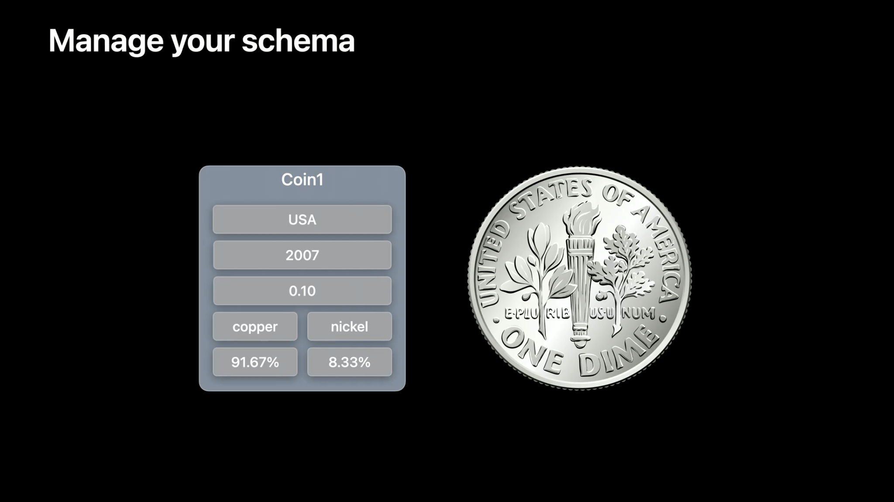
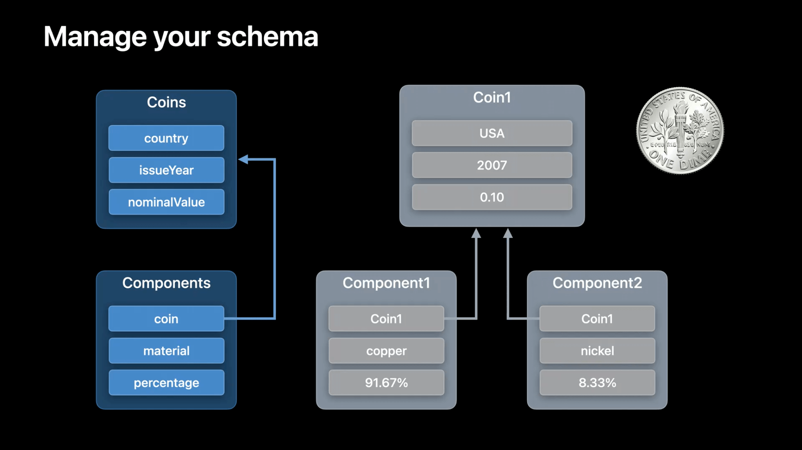
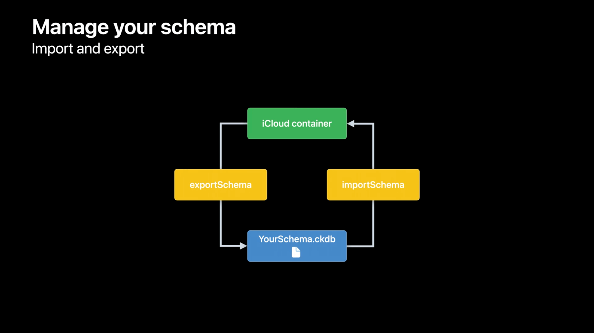

# WWDC22 10116 Meet CKTool JS / 初见 CKTool JS

本文基于 [Session 10116](https://developer.apple.com/videos/play/wwdc2022/10116) 梳理。

> 作者：LabLawliet，在广州搬砖的 iOS 独立开发者，Swift 爱好者，[GitHub](https://github.com/RyukieSama)。

## 前言


本文将带你了解如何使用 `CKTool JS` 自动化管理 `iCloud` 容器。展示如何配置 `CKTool JS` 来管理容器、修改记录以及操作数据。我们还将探讨如何将 `CKTool JS` 集成到自动化工作流程中。为了更好的理解，建议先熟悉 `CloudKit`、`JavaScript` 和 `npm`。

> 本次 `WWDC` 还有其他关于 `CloudKit` 的更新内容可以移步 [WWDC22 10115/10119 - Optimize your use of Core Data and CloudKit / 优化 CoreData & CloudKit 实现](../session_10119/README.md)

## 一、 介绍

### 1.1 CloudKit 简介

`CloudKit` 是苹果为开发者提供的云端存储服务，可将应用程序的数据存储在 `iCloud` 容器中。通过在应用程序中使用 `CloudKit`，还可以让数据在不同设备上保持同步。

### 1.2 访问 iCloud 数据的方式


为了构建应用程序，你可以使用 `Apple` 平台上的 `CloudKit` 或 `Web` 上的 `CloudKit JS` 访问 `iCloud` 存储空间。为了实现自动化和工具化，`Xcode` 提供了 `cktool` 以在 `macOS` 上使用。现在，有了与 `iCloud` 交互的新方式 `CKTool JS`。

### 1.3 CKTool JS 能做什么


`CKTool JS` 可以达到与 `Xcode 13` 中引入的 `cktool` 命令行工具相同的功能。实际上，`CKTool JS` 是用来实现 `CloudKit 控制台`中添加记录类型和查询记录等功能的。

通过 `CKTool JS`，可以管理应用程序的 `CloudKit Container` 和 `Schema`。这是以前通过 `JavaScript` 无法做到的。


通过 `CKTool JS` 可以使用其 ID 或通过查询条件获取现有记录。也可以创建新记录更新记录。`CKTool JS` 为 `TypeScript` 提供了严格的类型定义。这些类型定义启用了编译检查，并可在支持的 `IDE` 中进行代码补全，让编辑 `CKTool JS` 代码更容易。

### 1.4 npm 支持

`CKTool JS` 支持了对 `Node.js` 和浏览器的支持。`CKTool JS` 作为 `npm` 包进行分发，可以轻易的在 `JavaScript` 项目中集成。

这些 `package` 是以 `@apple/cltool.*` 开头的。这里的核心依赖库是 `@apple/cltool.database`。同时，为例与 `iCloud` 通讯，根据平台不同可选用 `@apple/cktool.target.nodejs`　和 `@apple/cktool.target.browser`。

`@apple/cltool.database` 依赖了另外三个核心库 `@apple/cktool.core`、`@apple/cktool.api.base`、`@apple/cktool.api.database`。


### 1.5 访问授权

`CKTool JS` 要与 `iCloud` 通讯，首先需要授权。根据你需要的具体操作，你可能需要不同类型的授权：`Management Token` 或者 `User Token`。这两个 `Token` 都是从 `CloudKit 控制台`获取的。

* Management Token
  * 用于访问管理操作，并仅限于开发团队和用户。
  * 此类操作包括 `Schema` 的导入和导出、验证以及将 `CloudKit Container` 发布为生产。
* User Token
  * 仅限于开发团队和特定容器，允许访问这些容器中的私有用户数据。

> 要了解如何获取这些授权令牌，请查看[WWDC21 - Automate CloudKit tests with cktool and declarative schema](https://developer.apple.com/videos/play/wwdc2021/10118)。

## 二、 配置 CKTool JS

### 2.1 CloudKit Schema

在开始配置 `CKTool JS` 之前，先简单了解下 `CloudKit Schema`。在 `CloudKit` 中，数据以结构化的方式进行存储。具有相同数据结构的数据以 `Record` 的形式存储在一起。`Record` 是 `RecordType` 的实例，`RecordType` 除了可以自定字段，也包含了一些自带的字段，如 `recordName` 即 `ID 唯一标识`。


例如这里以国家和货币为例该怎么去设计 `RecordType` 呢？


并将 `Countries` 与 `Coins` 通过 `isoCode - nation` 的对应关系绑定起来。


`RecordType` 和 `Relationship` 合起来就构成了 `Schema`。


在应用程序功能迭代的过程中，我们的 `Schema` 也可能会不断的更新。

### 2.2 Container

`Schema` 决定了数据存储的结构，这些数据存储的地方就是 `Container`。每个 `Container` 都有一个唯一的 ID 并且是与 `Developer Team` 绑定的。和我们平时开发分测试生产环境一样，`Container` 也分为了 `Development` 和 `Production` 环境。在 `Development` 环境中完成了 `Schema` 的设计调试，就可以将 `Schema` 发布到 `Producti` 环境了。

### 2.3 配置信息

为了使 `CKTool JS` 拥有权限访问正确的 `CloudKit Container`，我们需要进行一些参数配置如制定环境等。不同情况需要的信息在下图中列出了：


### 2.4 Node.js 配置示例

导入需要使用的相关依赖。并将需要的信息保存起来，如下面示例中的 `security` 和 `defaultArgs`。

#### 构建参数

```JavaScript
const { CKEnvironment } = require("@apple/cktool.database");

// 权限安全相关
const security = {
    "ManagementTokenAuth": "<YOUR_MANAGEMENT_TOKEN>",
    "UserTokenAuth": "<YOUR_USER_TOKEN>"
};

// 默认参数
const defaultArgs = {
    // Developer Team ID
    "teamId": "<YOUR_TEAM_ID>",
    // CloudKit Container ID
    "containerId": "<YOUR_CONTAINER_ID>",
    // 指定环境
    "environment": CKEnvironment.DEVELOPMENT
};
```

#### 构建 configuration 和 API 对象

```JavaScript
const { createConfiguration } = require("@apple/cktool.target.nodejs");
const { PromisesApi } = require("@apple/cktool.database");

const configuration = createConfiguration();
// 将 configuration 和 前面填写的令牌数据传给 API 对象
const api = new PromisesApi({
    "configuration": configuration,
    "security": security
});
```

> API 对象提供了异步访问 iCloud 的方法。

## 三、管理 Schema



在应用程序中，存储例如 2007 年发行的硬币之的信息。这枚硬币由铜和镍组成，价值 1/10 美元。在考虑了如何存储这些数据之后，决定将有关硬币成分的信息数据独立出来，即将硬币的铜百分比和镍的百分比分别存储在不同的 Record 中。



### 3.1 Schema File

现在定义好了 Schema 的结构，就可以按照一定的规则，创建一个文本文件 `Schema File` 来描述这些信息。后缀名 `.ckdb`。

> 具体规则可以查看文档[Integrating a Text-Based Schema into Your Workflow](https://developer.apple.com/documentation/cloudkit/integrating_a_text-based_schema_into_your_workflow)

`Schema File` 配置的 Schema 可以通过 CKTool JS 应用到 iCloud。在这之前，我们需要将当前 Development 环境的 Schema 恢复到 Production 环境的状态。调用 `api.resetToProduction()` 方法即可，记住要将在前面准备好的 defaultArgs 也穿进去哦。如果当前 Development 环境中存在 Schema 不存在与 Production 环境，那么进行恢复操作后，这些 Schema 和数据会被删除。

> 注意，这是一个异步的方法，返回的是一个 PromisesApi 对象。

### 3.2 导入导出 Schema File

`CKTool JS` 提供了 `exportSchema` 和 `importSchema` 方法来执行 `Schema File` 的导入导出操作。通过 `exportSchema` 可以下载保存当前 `Schema` 结构，通过 `importSchema` 可以将新的 `Schema` 结构上传到 `CloudKit`。



下面是上传 `Schema` 的一个封装示例：

```JavaScript
// Create a function to apply a schema
const { File } = require("@apple/cktool.target.nodejs");
const fs = require("fs/promises");
const path = require("path");

const importMySchema = async () => {
    // 指定 Schema File 文件路径
    const schemaPath = "<YOUR_SCHEMA_FILE>.ckdb";
    // 将文件写入 buffer
    const buffer = await fs.readFile(schemaPath);
    // 创建 File 对象
    const file = new File([buffer], schemaPath);
    // 使用前面配置的参数，上传 file
    await api.importSchema({ ...defaultArgs, "file": file });
}

/* 链式调用： 
 * 先同步 Production 环境的 Schema 到 Development 环境
 * 注意 这里 resetToProduction 方法是异步的
 * 完成后再调用 importMySchema 上传需要应用的 Schema File 
 */
api.resetToProduction(defaultArgs)
  .then(() => importMySchema());
```

## 四、 数据读写

### 4.1 类型校验

`CKTool JS` 在将数据发送到服务端之前，会在客户端进行类型与边界校验。如果类型错误或者超出了边界就会抛出异常。对于无法在 `JavaScript` 中原生支持的 `Large number` 可以使用 `CKTool JS` 类型来代替。例如：

* 将数字强制转换为 `CKTool JS Int64`，使用 `toInt64` 函数。
* 将数字强制转换为 `Double` 浮点值，使用 `toDouble` 函数。

> 在编写 `TypeScript` 时，如果不使用这些强制转换函数，编译器将报错。

### 4.2 构建 FieldValue

承接前文，继续以硬币为例。创建一枚 2007 年发行的硬币，将该值传递给 `makeRecordFieldValue.int64` 函数，以创建包含 `Int64` 的记录字段值。如果函数无法使用传入的值创建记录，就会抛出异常。

```JavaScript
// Create fields with factory functions.
const {
    makeRecordFieldValue
} = require("@apple/cktool.database");

const value = makeRecordFieldValue.int64(2007);
```

### 4.3 配置公共参数

在这里，创建了一个对象来保存发送给处理记录的方法的公共值。由于 `containerId`、`environment`、`databaseType` 和 `zoneName` 通常是必需的，因此我们将它们包含在此 `databaseArgs` 对象中。

```JavaScript
const {
    CKDatabaseType, CKEnvironment
} = require("@apple/cktool.database");

const databaseArgs = {
    "containerID": "<YOUR_CONTAINER_ID>",
    "environment": CKEnvironment.DEVELOPMENT,
    "databaseType": CKDatabaseType.PRIVATE,
    "zoneName": "_defaultZone"
};
```

### 4.4 查询数据

为查询记录，这里使用 queryRecords 方法。为了使后续使用更加方便，这里创建了一个辅助函数，来查找 `isoCode3` 代码匹配的国家/地区。这里除了包含查询的正文之外，还传递了包含公共参数的 `databaseArgs` 对象。

```JavaScript
// Define helper function for querying records
const { CKDBQueryFilterType } = require("@apple/cktool.database");

const countryQueryRecordForCountryCode3 = async (countryCode3) => {
    const response = await api.queryRecords({
        ...databaseArgs,// 公共参数
        "body": {
            "query": {
                // 记录类型
                "recordType": "Countries",
                // 筛选条件
                "filters": [{
                    // 字段名
                    "fieldName": "isoCode3",
                    // 字段值
                    "fieldValue": makeRecordFieldValue.string(countryCode3),
                    // 匹配规则为相等
                    "type": CKDBQueryFilterType.EQUALS
                }]
            }
        }
    });
    // 取结果的第一条
    return response.result.records[0];
}
```

### 4.5 构建 FieldValue 与关联关系

为了将原始值转换为 `createRecord` 可以使用的字段值，这里封装了一个名为 `makeCoinFieldValues` 的辅助函数来执行此操作。对于要转换为字段值的硬币的每个原始属性，调用相应的 `RecordFieldValue` 函数。但是，对于国家/地区字段，需要创建一个关联关系。

```JavaScript
// Define a helper function for creating field values
const {
    makeRecordFieldValue, CKDBRecordReferenceAction
} = require("@apple/cktool.database");

const makeCoinFieldValues = ({ countryRecordName, issueYear, nominalValue }) => ({
    // 这是并非原始值，而是一个关联关系，通过 countryRecordName 将 Coin 与 Country 关联起来
    "country": makeRecordFieldValue.reference({
        recordName: countryRecordName,
        action: CKDBRecordReferenceAction.DELETE_SELF
    }),
    // 这里两条就是原始数据
    "issueYear": makeRecordFieldValue.int64(issueYear),
    "nominalValue": makeRecordFieldValue.double(nominalValue)
});
```

### 4.6 创建一条记录

这里创建了一个辅助函数，它获上文创建的 `FieldValues` 并将 `createRecord` 请求发送到服务器。在这个函数中，传递了之前声明的 `databaseArgs` 的内容和一个 `body`。如果成功，则返回 `response.result.record`。

```JavaScript
// Define helper method for creating coins
const coinCreateRecord = async (fields) => {
    const response = await api.createRecord({
        ...databaseArgs, // 公共参数
        "body": {
            // 记录类型
            "recordType": "Coins",
            // 需要保存的数据主体
            "fields": fields
        },
    });
    return response.result.record;
}
```

根据前文定义的 makeCoinFieldValues 函数，我们知道还需要获取关联的 contryRecord 的 recordName。下面我们获取并完成记录的创建和上传：

```JavaScript
// 通过国家代码获取 contryRecord 对象
const countryRecord = await countryQueryRecordForCountryCode3("USA");

// 传入参数，构建 FieldValues，上传，成功后返回新的 record
const coinRecord1 = await coinCreateRecord(
    makeCoinFieldValues({
        "countryRecordName": countryRecord.recordName,
        "issueYear": 2007,
        "nominalValue": 0.10
    })
);
```

### 4.7 更新记录

要更新记录，请使用 `updateRecord` 方法。这里创建了一个函数，它使用传递给该辅助函数的字段更新与 recordName 匹配的硬币记录。然后，使用 `databaseArgs`、`recordName` 和一个包含 `recordType` 和新记录的 `FieldValues` 调用 `updateRecord`。如果成功，更新后的记录将在 response.result.record 中返回。

```JavaScript
// Define helper method for updating coins.
// Note that recordChangeTag is required

const coinUpdate =
    async (recordName, recordChangeTag, fields) => {
        const response = await api.updateRecord({
            ...databaseArgs,// 公共参数
            "recordName": recordName,// 需要更新的记录 ID
            "body": {
                "recordType": "Coins",// 记录类型
                "recordChangeTag": recordChangeTag, // 变更标签
                "fields": fields // 字段
            }
        });
        return response.result.record;
    }

// Call coin updating method with field values.
// Note that the recordChangeTag of the record
// to update is passed to the coin update function.

// 先获取关联的 country 
const countryRecord = await countryQueryRecordForCountryCode3("USA");

const updatedCoinRecord1 = await coinUpdate(
    coinRecord1.recordName,
    coinRecord1.recordChangeTag,
    makeCoinFieldValues({
        // 关联的 country 的记录 ID
        "countryRecordName": countryRecord.recordName,
        "issueYear": 2010,
        "nominalValue": 0.10
    });
);
```

### 4.8 删除记录

`CKTool JS` 提供了便捷的删除方法，只需提供对应记录的 recordName 调用异步函数 deleteRecord 即可。

```JavaScript
// Deleting a record
await api.deleteRecord({
    ...databaseArgs,// 公共参数
   "recordName": coinRecord1.recordName // 记录 ID
});
```

