# WWDC22 - Optimize your use of Core Data and CloudKit / 优化 CoreData & CloudKit 实现

> 作者：Ryukie，在广州搬砖的 iOS 独立开发者，[GitHub](https://github.com/RyukieSama)，公众号/掘金等：LabLawliet。

## 前言

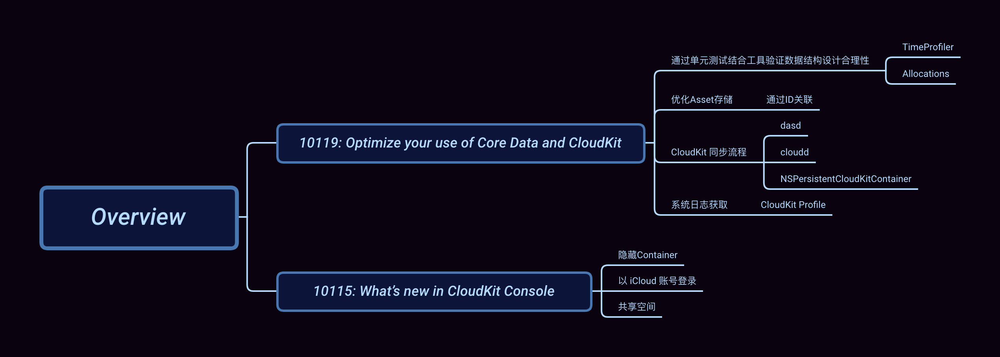

作为一名 iOS 独立开发者，开发了多个个人项目，`CloudKit` 是我构建项目体系的核心。本 Session 旨在通过单元测试、Instruments、日志收集三方面，覆盖开发流程的三个重要方面：`探索`、`分析`与`反馈`，帮助开发者优化 `CoreData & CloudKit` 方案实现，做出更好的产品。同时了解到 `CloudKit` 的同步流程与相关系统服务。


> 本文基于 [WWDC22: 10119 - Optimize your use of Core Data and CloudKit](https://developer.apple.com/videos/play/wwdc2022/10119/) 梳理。
>  
> 本 Session 侧重点为优化实现方案，更适用于对 `CoreData & CloudKit` 以及数据库知识有一定理解的开发者，如果想要了解更多实际使用的知识，推荐阅读文末的相关 Session。
>  
> 同时 [WWDC22: 10115 - What’s new in CloudKit Console](https://developer.apple.com/videos/play/wwdc2022/10115/) 也介绍了 CloudKit 控制台的一些有用更新，本文也会进行一些介绍。

## 一、 探索

合理的数据结构设计，是一款 `CloudKit` 应用程序的核心。我在开发我的第一款应用[扫雷：无尽天梯 Elic](https://apps.apple.com/cn/app/id1488204246)，用来熟悉对 `CloudKit` 的使用时，就遇到了数据结构设计不合理导致的问题。

这里是一个基于 `CloudKit` 建立的扫雷成绩排行榜，这里包含了用户头像、昵称、成绩等信息。

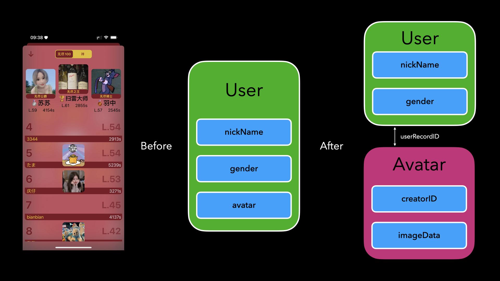

最初头像的数据是以 `Asset` 形式直接存在 `Users` 的数据库中的：

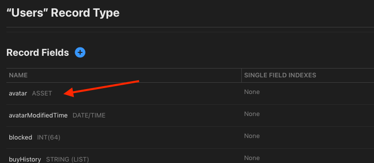

这样的数据结构设计，导致在获取列表用户数据时会同时获取完整的图片数据，如此一来就需要等待很长时间。而为了更好的体验，我们期望达到图片是异步加载的。

那么能否将将头像数据独立出来，通过索引的方式加载呢？这里我建立了 `AvatarSpace` 用来专门存储用户头像

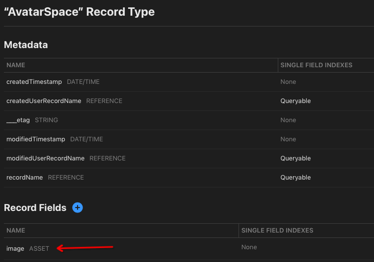

并通过 `userID` 将 `AvatarSpace` 的数据和 `User` 关联起来，在列表中去异步加载，达到类似于 `SDWebImage` 加载网络图片的效果。核心代码如下：

```Swift
static func loadCloudImage(imageInfo: CloudImageCacheBaseInfo, resultCallBack: CloudImageCallBack? = nil) {
    // 检查本地缓存
    if let image = getImageFromDisk(recordName: imageInfo) {
        if let cb = resultCallBack {
            cb(image)
        }
        return
    }
    
    // 没有本地缓存，通过 CloudKit 获取头像资源
    CloudUser.fetchAvatar(userRecordName: CKRecord.ID(recordName: imageInfo.userID), success: { (record) in
        guard let resu = record, let image = UIImage.image(fromRecord: resu, forAssetKey: RecordTypeAvatar.image.rawValue) else {
            if let cb = resultCallBack {
                cb(nil)
            }
            return
        }
        // 异步保存到本地
        self.saveImageToDisk(image: image, imageName: imageInfo)
        if let cb = resultCallBack {
            cb(image)
        }
    }) { (error) in
        if let cb = resultCallBack {
            cb(nil)
        }
    }
}

// 通过创建者 recordID 获取头像图片资源
static func fetchAvatar(userRecordName: CKRecord.ID? = nil, success: @escaping CloudRecordCallBack, fail: @escaping CloudErrorCallBack) {
    var recordName = ""
    
    if userRecordName != nil {
        recordName = userRecordName?.recordName ?? ""
    }
    else {
        recordName = CloudUser.currentUserRecordId ?? ""
    }
    
    let ref = CKRecord.Reference(recordID: CKRecord.ID(recordName: recordName), action: .none)
    let predicate = NSPredicate(format: "creatorUserRecordID == %@", ref)
    
    CloudCenter.publicDataBase.query(type: .AvatarSpace, predicate: predicate) { (records, cursor, error) in
        if error != nil {
            fail(error)
            return
        }
        success(records?.first)
    }
}
```

> 更多关于我在该项目中的实践可以查看我的文章：[LabLawliet: 基于 iCloud 构建独立项目用户体系](https://mp.weixin.qq.com/s/W7XuE3rNaIyjFblrkEoDtQ)

### 1.1 反思

从我的经历可以看出，没有合理的数据结构设计，会导致开发测试过程中回头返工的情况发生。如果在初步设计数据结构的时候编写进行单元测试用例就能使问题更早的暴露出来。

下面我们以一个简单的帖子管理为例，通常会包含标题、内容等文本。同时也包含附件：图片。

我们通过为该例子建立`单元测试`的方式，更快捷的验证数据结构设计的是否合理高效。

> [NSPersistentCloudKitContainer](https://developer.apple.com/documentation/coredata/nspersistentcloudkitcontainer)是数据同步的核心类，可以提前做一些了解。同步数据不是本 Session 的核心，就不做重点介绍了。
>  
> 这里 `Apple` 也贴心的提供了[SampleCode: Synchronizing a local store to the cloud](https://developer.apple.com/documentation/coredata/synchronizing_a_local_store_to_the_cloud)，本文提到的测试用例也包含在其中。
>  
> 对单元测试不熟悉的同学可以通过官方文档补充一些基础知识：[Defining Test Cases and Test Methods](https://developer.apple.com/documentation/xctest/defining_test_cases_and_test_methods)


### 1.2 数据准备

为了探索更庞大的数据集，我们创建一个数据生成器 `LargeDataGenerator`，并提供一个 `generateData` 的方法来构建数据。

可以生成一组 60 个帖子，每个帖子都有 11 个图片附件，共 660 张。每个图片大小 10-20MB，生成的数据大小近 10GB。

> 这里在实际开发过程中，如果遇到类似的循环次数多、数据体量大的操作场景时，一定要注意及时释放内存，避免内存激增甚至出现崩溃。

```Swift
class LargeDataGenerator {
    func generateData(context: NSManagedObjectContext) throws {
        try context.performAndWait {
            for postCount in 1...60 {
                // 创建帖子 
                for attachmentCount in 1...11 {
                    // 添加一个图片作为附件
                    let attachment = Attachment(context: context)
                    let imageData = ImageData(context: context)
                    imageData.attachment = attachment
                    // 直接添加了图片实例
                    imageData.data = autoreleasepool {
                        let imageFileData = NSData(contentsOf: url!)!
                        attachment.thumbnail = Attachment.thumbnail(from: imageFileData,        
                                                                    thumbnailPixelSize: 80)
                        return imageFileData
                    }
                }
            }
        }
    }
}
```

### 1.3 单元测试

有了上面的 `LargeDataGenerator`，我们就可以编写测试用例：

```Swift
class TestLargeDataGenerator: CoreDataCloudKitDemoUnitTestCase {
    func testGenerateData() throws {
        let context = self.coreDataStack.persistentContainer.newBackgroundContext()
        // 通过 LargeDataGenerator 生成数据
        try self.generator.generateData(context: context)
        try context.performAndWait {                     
            let posts = try context.fetch(Post.fetchRequest())
            for post in posts {
                // 验证数据是否包含 11 个图片附件
                self.verify(post: post, has: 11, matching: imageDatas)
            }
        }
    }
}
```

#### 导出数据

既然用到 `CloudKit`，我们就会进行数据同步，下面我们编写一段导出数据的用例：

```Swift
func testExportThenImport() throws {
    // NSPersistentCloudKitContainer 实例
    let exportContainer = newContainer(role: "export", postLoadEventType: .setup)
    // 生成数据
    try self.generator.generateData(context: exportContainer.newBackgroundContext())
    self.expectation(for: .export, from: exportContainer)
    // 等待多点时间确保测试数据导出
    self.waitForExpectations(timeout: 1200)
}
```

这里为每个导出事件添加一个 `XCTestExpectation`，用来监听 `NSPersistentCloudKitContainer` 变化的 `Notification`，并在回调中验证数据。

```Swift
func expectation(for eventType: NSPersistentCloudKitContainer.EventType,
                 from container: NSPersistentCloudKitContainer) -> [XCTestExpectation] {
    var expectations = [XCTestExpectation]()
    for store in container.persistentStoreCoordinator.persistentStores {
        // 监听通知
        let expectation = self.expectation(
            forNotification: NSPersistentCloudKitContainer.eventChangedNotification,
            object: container
        ) { notification in
            // 处理通知
            let userInfoKey = NSPersistentCloudKitContainer.eventNotificationUserInfoKey
            let event = notification.userInfo![userInfoKey]
            // 验证数据                
            return (event.type == eventType) &&
                (event.storeIdentifier == store.identifier) &&
                (event.endDate != nil)
        }
        expectations.append(expectation)
    }
    return expectations
}
```

#### 导入数据

上面我们完成的是导出的流程，下面我们继续完善用例 `testExportThenImport`，完成同步操作中重要的另一步：`导入`。

```Swift
func testExportThenImport() throws {
    // 导出
    let exportContainer = newContainer(role: "export", postLoadEventType: .setup)
    try self.generator.generateData(context: exportContainer.newBackgroundContext())
    self.expectation(for: .export, from: exportContainer)
    self.waitForExpectations(timeout: 1200)
    
    // 导入
    let importContainer = newContainer(role: "import", postLoadEventType: .import)
    self.waitForExpectations(timeout: 1200)
}
```

完成了测试用例的编写，我们就可以进入下一步：`分析`。

## 二、 分析

上面我们完成了`构建实验数据`与`数据同步`功能，接下来我们通过使用一些工具来分析应用程序处理大量数据时的表现。

### 2.1 Instruments

`Instruments` 不光可以用于项目分析，还可用于测试用例分析。通过右击用例左侧的菱形，选择 `Profile` 就可以为用例调起 `Instruments`。

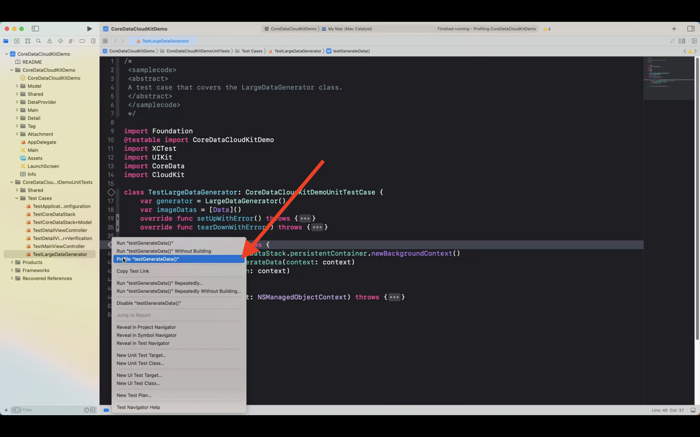

### 2.2 分析时间瓶颈 TimeProfiler

通过 `TimeProfiler` 我们可以分析程序执行耗时较多的区块。

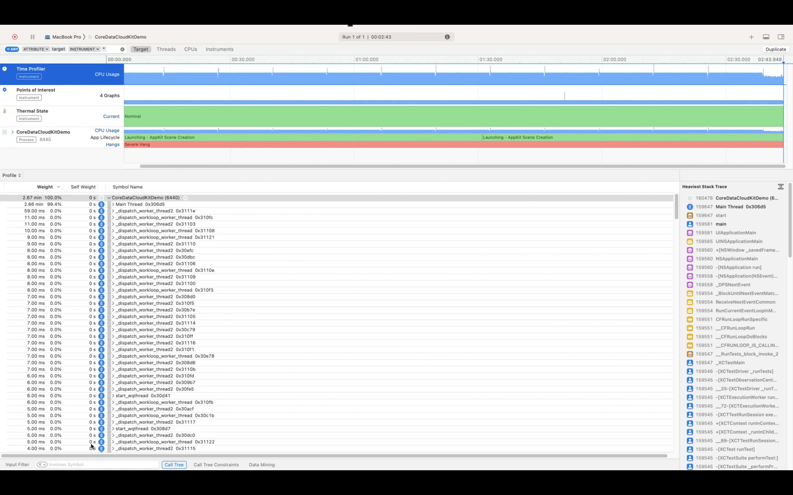

这里可以发现测试用例中 `LargeDataGenerator` 花费了大量时间生成图片。

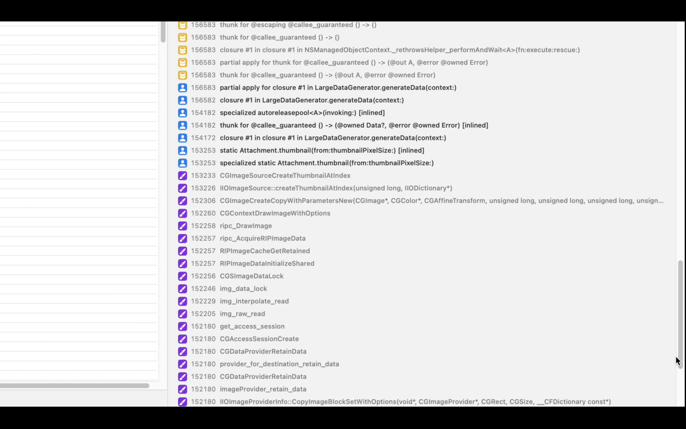

### 2.3 分析内存占用 Allocations

以上我们学习了如何使用 `TimeProfiler` 寻找程序的时间瓶颈并进行优化对比。下面我们通过 `Instruments` 的另一个工具 `Allocations` 分析在处理近 10GB 数据的时候是怎么样的。

#### 瓶颈分析


可以看出，在测试期间占用了超过 **10GB** 的内存。我们选择一段点击进入详情。

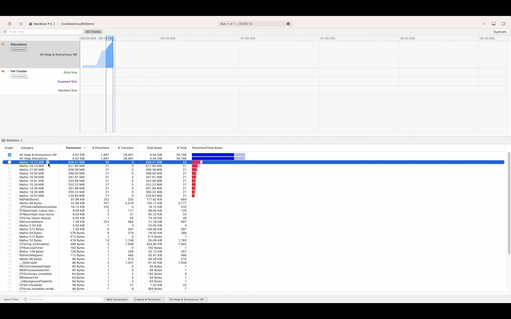

这里列出了选段内的所有内存占用情况。


我们进一步点击箭头进入详情，这里能够看到 `malloc` 与 `dealloc` 情况。

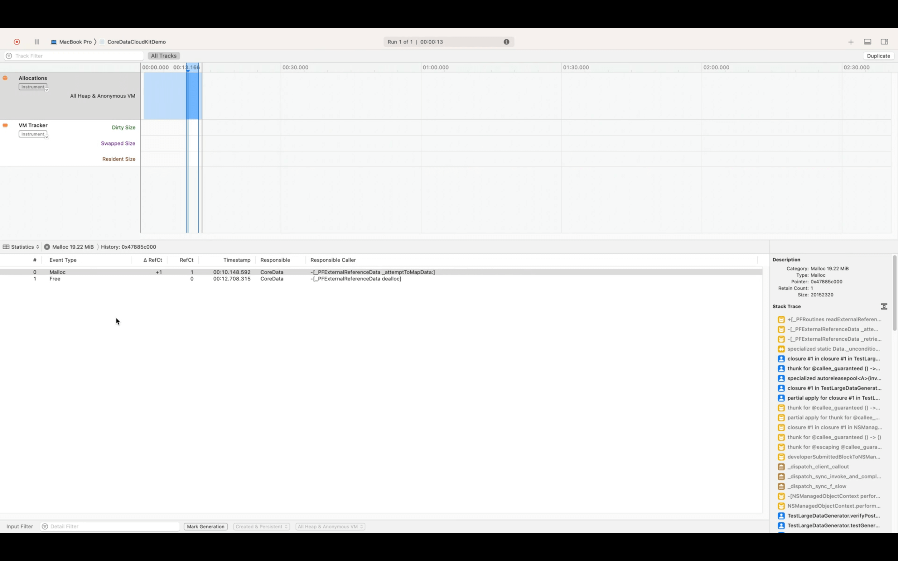

为了清楚定位到具体位置，可以通过查看右侧调用堆栈。

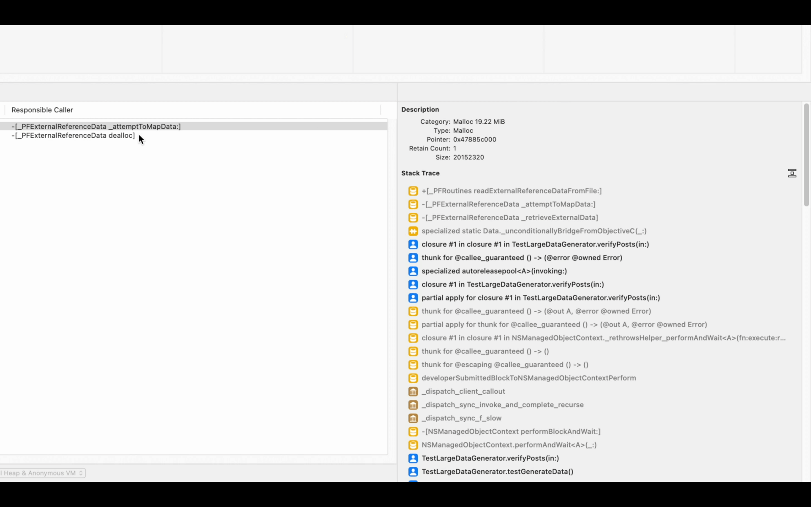

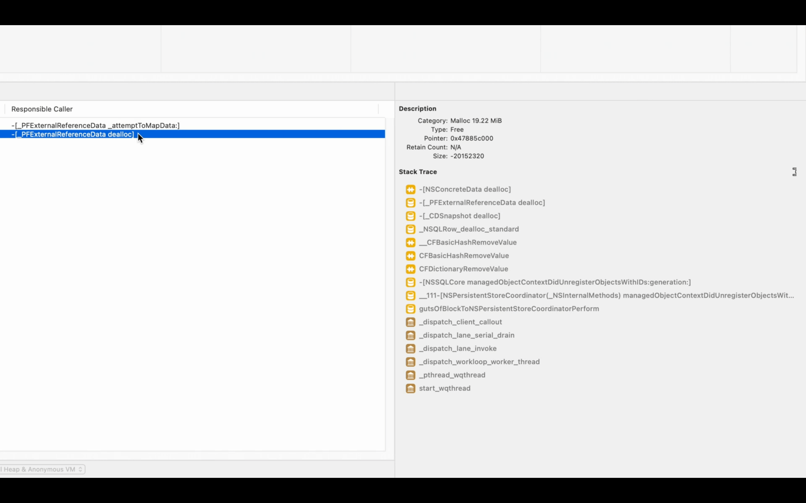

下面是 `verifyPosts` 相关代码，可以看出这里选择了直接获取完整数据的形式（包括 `imageData` ）来进行数据验证，导致了内存用量持续增加。

```Swift
func verifyPosts(in context: NSManagedObjectContext) throws {
    try context.performAndWait {
        let fetchRequest = Post.fetchRequest()
        let posts = try context.fetch(fetchRequest)

        for post in posts {
            // verify post
            let attachments = post.attachments as! Set<Attachment>
            for attachment in attachments {
                XCTAssertNotNil(attachment.imageData)
                //verify image
            }
        }
    }
}
```

这里我们是否可以通过获取索引而非完整数据的方式进行数据验证，进而优化大量数据场景下的数据获取体验呢？

**优化：通过获取 ID 优化存储瓶颈**

通过设置 `resultType` 为 `managedObjectIDResultType` 可以使返回的结果全部是数据 ID，大大减少了循环时的内存增长。

同时通过设定验证超过 10 个就重置上下文的方式，我们也能进一步减轻循环中的内存占用。

```Swift
func verifyPosts(in context: NSManagedObjectContext) throws {
    try context.performAndWait {
        let fetchRequest = Attachment.fetchRequest()
        // 指定结果以 ID 返回
        fetchRequest.resultType = .managedObjectIDResultType
        let attachments = try context.fetch(fetchRequest) as! [NSManagedObjectID]

        for index in 0...attachments.count - 1 {
            let attachment = context.object(with: attachments[index]) as! Attachment

            //verify attachment
            let post = attachment.post!
            //verify post

            if 0 == (index % 10) {
                context.reset()
            }
        }
    }
}
```

### 2.4 实时日志

了解了如何通过 `Instruments` 的一些工具分析时间、空间性能瓶颈之后，日志也是我们进一步分析问题重要的途径。

在学习如何获取日志之前，我们需要了解在使用 `CoreData` 与 `CloudKit` 进行开发的过程中，会涉及到哪些系统服务。

#### 2.4.1 数据交换的生命周期

**导出**

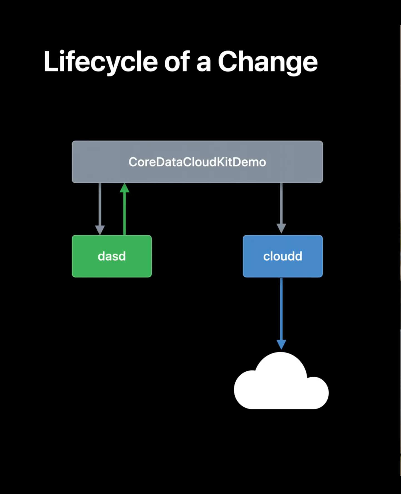

- 当数据写入 `NSPersistentCloudKitContainer` 时，会询问 `dasd` 系统服务，当前是否适合将数据导出到 `CloudKit`。
- 如果是 `dasd` 会通知 `NSPersistentCloudKitContainer` 执行。
- `NSPersistentCloudKitContainer` 通过系统服务 `cloudd` 将更改的对象导出到 `CloudKit`。

**导入**

当数据导入时，整个流程会有一些不同：

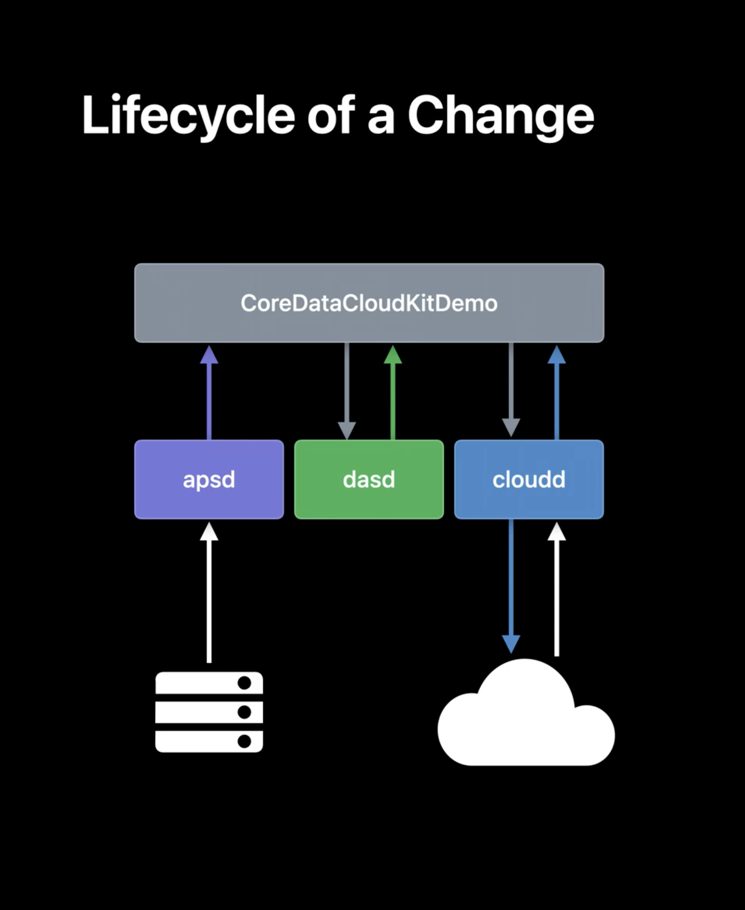

- 系统服务 `apsd` 接收推送通知，将其转发给应用程序。
- 然后 `NSPersistentCloudKitContainer` 询问系统服务 `dasd`，当前是否合适导入。
- 然后 `cloudd` 从 `CloudKit` 将数据导入到`本地数据库`。

#### 2.4.2 实时获取日志

这里涉及到了多个系统服务，多个进程，接下来我们学习如何通过控制台实时查看每个进程的日志。

下面列举了一些终端命令，连接设备，在终端内输入，即可实时查看日志

**CoreData & CloudKit 日志**

```shell
# Application
log stream --predicate 'process = "CoreDataCloudKitDemo" AND 
                        (sender = "CoreData" OR sender = "CloudKit")'
```

**cloudd 日志**

```shell
# CloudKit 
log stream --predicate 'process = "cloudd" AND
                        message contains[cd] "iCloud.com.example.CloudKitCoreDataDemo"'
```

**apsd 日志**

```shell
# Push
log stream --predicate 'process = "apsd" AND message contains[cd] "CoreDataCloudKitDemo"'
```

**dasd 日志**

```shell
# Scheduling
log stream --predicate 'process = "dasd" AND 
                        message contains[cd] "com.apple.coredata.cloudkit.activity" AND
                        message contains[cd] "CEF8F02F-81DC-48E6-B293-6FCD357EF80F"'
```

## 三、 反馈

在应用开发完成之后获得日志是我们排查线上与测试中问题的重要手段。

现在也提供了让开发者可以从**任意设备**上获取日志的途径。

### 3.1 CloudKit Profile

#### 下载


通过 [Profiles and Logs](https://developer.apple.com/bug-reporting/profiles-and-logs/) 网页，下载 `CloudKit Profile` 并在系统设置里安装，然后重启设备。

### 3.2 获取日志

同时按住**两个音量键** + **电源键**几秒钟后，然后放开。


过一会儿系统日志就可以在设置中找到了：

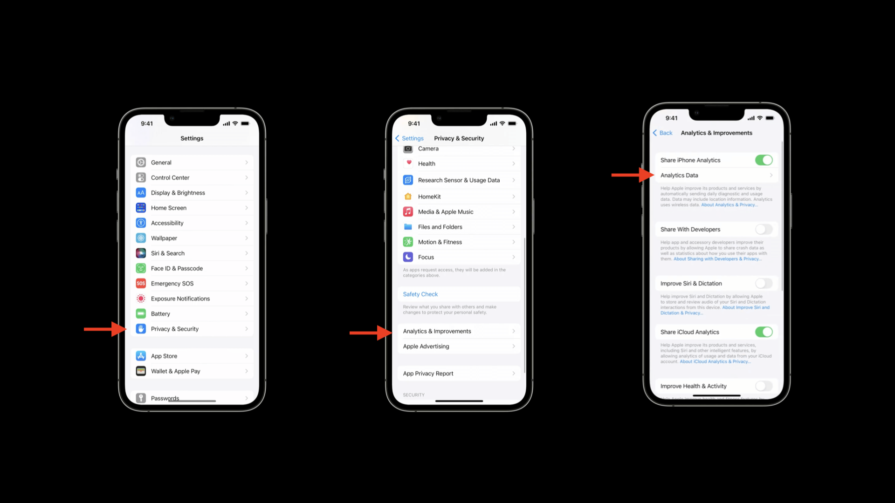

这里就可以看到日志文件了，可以通过分享按钮获取文件。


### 3.3 查询目标日志

获取系统日志之后，我们可以通过命令行设置一些参数，获取到我们需要的日志，我们在终端 CD 到日志目录里，通过下面的指令就能够筛选出想要的日志了。

#### 指定进程搜索

```shell
log show --info --debug
    # 指定进程
    --predicate 'process = "apsd" AND
                 message contains[cd] "iCloud.com.example.CloudKitCoreDataDemo"'
    system_logs.logarchive
```

#### 时间段 + 指定进程搜索

```shell
# 多条件搜索
log show --info --debug
    # 指定时间范围
    --start "2022-06-04 09:40:00"
    --end "2022-06-04 09:42:00"
    # 指定进程
    --predicate 'process = "apsd" AND 
                 message contains[cd] "iCloud.com.example.CloudKitCoreDataDemo"'
    system_logs.logarchive
```

#### 时间段 + 指定多进程搜索

```shell
log show --info --debug
    --start "2022-06-04 09:40:00" --end "2022-06-04 09:42:00"
    --predicate '(process = "CoreDataCloudKitDemo" AND
                      (sender = "CoreData" or sender = "CloudKit")) OR
                 (process = "cloudd" AND
                      message contains[cd] "iCloud.com.example.CloudKitCoreDataDemo") OR
                 (process = "apsd" AND message contains[cd] "CoreDataCloudKitDemo") OR 
                 (process = "dasd" AND
                     message contains[cd] "com.apple.coredata.cloudkit.activity" AND
                     message contains[cd] "CEF8F02F-81DC-48E6-B293-6FCD357EF80F")'
    system_logs.logarchive
```

### 3.4 碎碎念

虽然能从任意设备上获取日志了，但是这个过程实在有点儿复杂，用户的配合成本也非常高。还是希望苹果后续能够提供集成度更高的获取日志的方式。比如在后台给用户发个捞取日志的授权然后上传之类的。

## 四、 CloudKit 控制台的一些小更新

今年在 [WWDC22: 10115 - What’s new in CloudKit Console](https://developer.apple.com/videos/play/wwdc2022/10115/) 对 [CloudKit 控制台](https://icloud.developer.apple.com/dashboard/) 的新功能也做了一些介绍。

### 4.1 以 iCloud 账号方式登录

以往在使用 `CloudKit` 控制台的时候，都是使用开发者账号进行登录的。对 `CloudKit` 有一定了解的开发者都知道，常有的有两种存储空间，公开的和私有的，类似我的排行榜功能使用的就是公开的空间。

在进行公共空间的开发时，我们一般会使用自己的账号进行调试，但是想要查数据的时候可以到控制台根据自己的 `userRecordID` 进行数据筛选。在进行私有空间开发时，如果想要在控制台查看数据，以往是不可能的。

现在添加了 `Act as iCloud Account` 的功能：

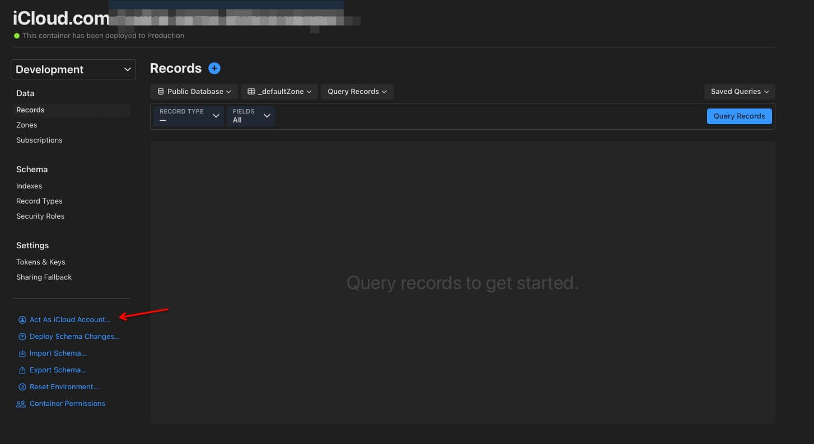

点击之后就可以直接登录 `iCloud` 账号，直接查看当前 `iCloud` 账号下存在 `CloudKit` 中的数据了：


这里我登录了自己的账号，直接显示出了我在扫雷游戏排行榜上的数据，点击顶部 `Stop` 按钮即可回到开发者模式。

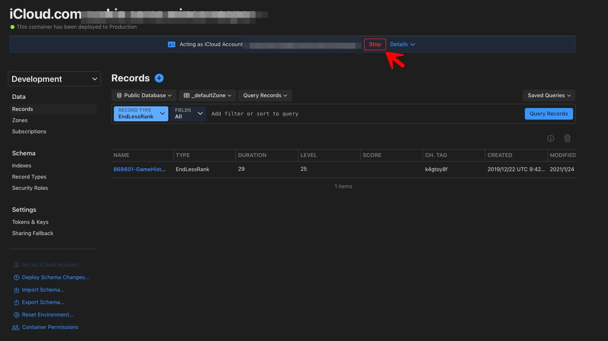

该功能极大提升了开发者在开发阶段查找调试数据的效率，尤其是基于私有空间进行开发的项目，简直不要太方便！

#### 注意

- 用 `Act as iCloud Account` 方式登录只有当前用户创建的数据可以背解析展示，其他用户的数据依旧是加密的无法访问的，这也是 `iCloud` 保证数据安全的核心。
- 我的扫雷游戏的排行榜由于设置的是 `PublicDataBase` 类型，每个用户创建自己的数据，且对所有用户可见，这是 `CloudKit` 的一种特殊场景。

### 4.2 隐藏 Container

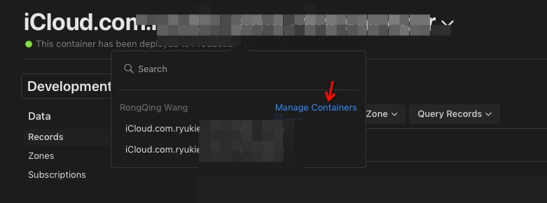

我们经常会有多个 `Container` 有一些我们不经常查看的，一直显示在列表中就比较影响效率，甚至容易误操作（我有两个 `Container` 名字比较像，不止一次选错 `Container` 还以为数据出问题了）。

现在我们可以选择隐藏 `Container` 了。


这些变更也会同步达到 `Xcode` 中，以及其他有权限访问的开发者。这样就可以避免一些用于个人调试的无用 `Container` 出现在其他团队成员的列表中。

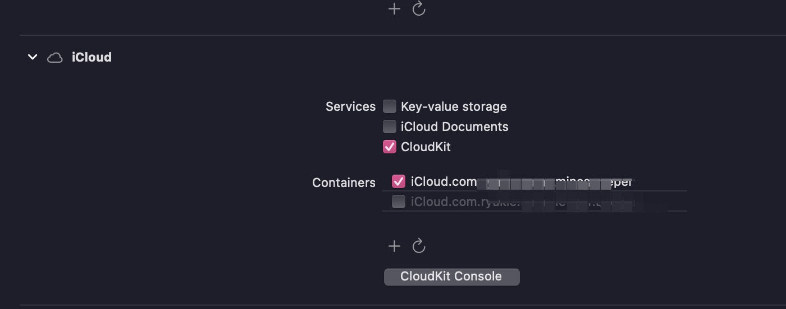

### 4.3 共享空间

`CloudKit` 可以使用户间安全的共享数据。主要分为两种

- 公开的共享空间
  - 所有用户都可以访问
- 私有共享空间
  - 特定授权用户可以访问

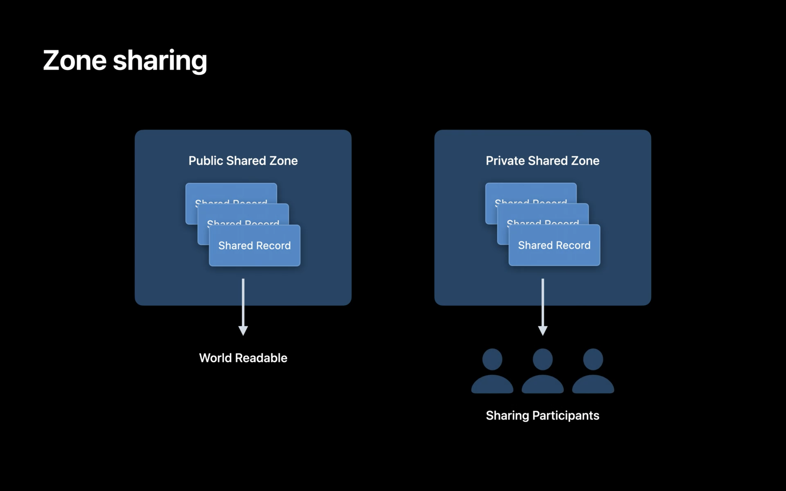

#### 设置公开共享空间

可以设置只读或者可读可写权限。

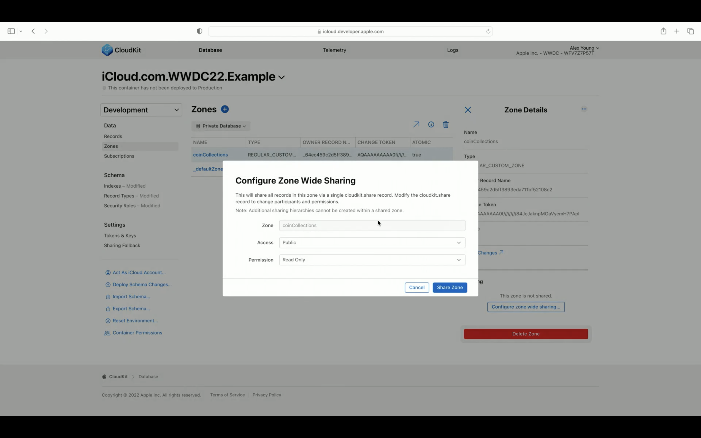

#### 设置私有共享空间

**设置 `Zone` 为私有**

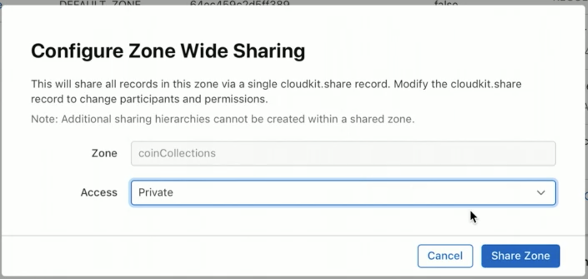

**获取 `ShortGUID`**

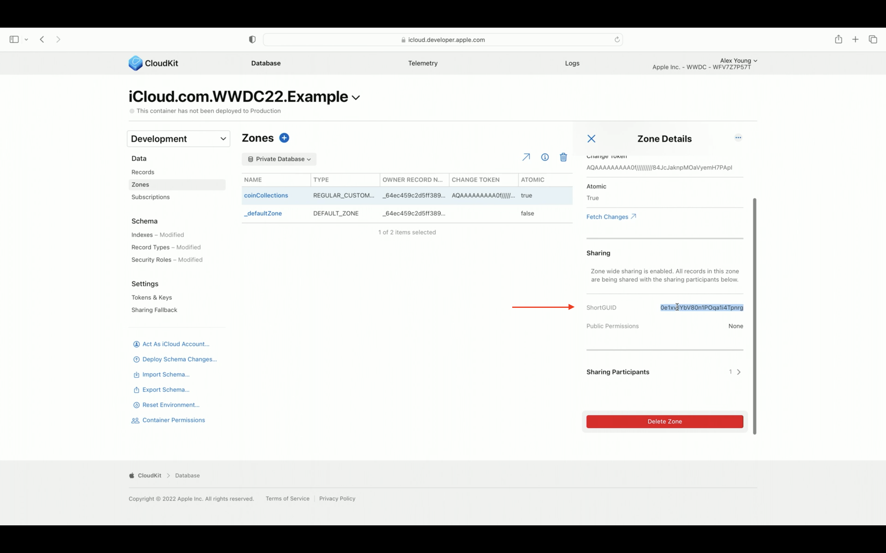

通过将这个 ID 给到可以访问的人，就可以在控制台加入共享。

**设置接受共享数据 `ShortGUID`**

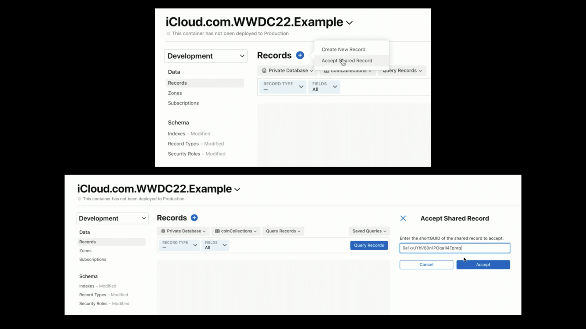

设置完成后，所有在这个 `Zone` 内创建的记录会被自动共享。

## 总结

- 作为对 `CloudKit` 重度依赖的独立开发者，本 Session 给我个人带来的了一些启发：
  - 通过`单元测试`提前验证数据结构设计的合理性。
  - 日志收集与分析工具给我提供了很大的帮助，曾有几次面对用户的问题反馈，却缺乏可用日志，难以跟进排查问题的尴尬局面能够得到很好的改善。
    - 但使用起来不够方便，希望后续能够提供更方便的工具。

- `CloudKit` 控制台的一些小更新也是方便了开发者：
  - 与 `iCloud` 账号的结合使调试私有数据成为可能
  - 隐藏 `Container` 的功能使得控制台更加整洁清晰
  - 共享空间在控制台上的支持，也极大的提升了在开发调试时进行共享数据调试的效率

总体来讲此次和 `CloudKit` 相关的更新的重心在于提高开发者的使用效率，没有一些惊艳的。作为独立开发者很开心看到 `Apple` 还持续的在为开发者持续提供免费安全的云存储服务，并不断提升便捷性与效率。期待后续能带来更多相关新的功能，造福广大充满创造性的独立开发者们，创造更多有趣的产品。

## 推荐阅读

> [LabLawliet: 基于 iCloud 构建独立项目用户体系](https://mp.weixin.qq.com/s/W7XuE3rNaIyjFblrkEoDtQ)
>  
> [WWDC22: 10115 - What’s new in CloudKit Console](https://developer.apple.com/videos/play/wwdc2022/10115/)
>  
> [WWDC21: 10015 Build apps that share data through CloudKit and Core Data](https://developer.apple.com/videos/play/wwdc2021/10015)
>  
> [WWDC19: 202 Using Core Data With CloudKit](https://developer.apple.com/videos/play/wwdc2019/202)
>  
> [WWDC20: Diagnose performance issues with the Xcode Organizer](https://developer.apple.com/videos/play/wwdc2020/10076)
>  
> [WWDC19: Getting Started with Instruments](https://developer.apple.com/videos/play/wwdc2019/411)
