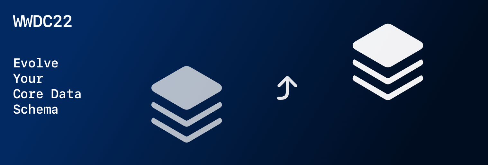

## 个人介绍

[kukushi](https://kukushi.github.io)，Swift 爱好者，上架多款 iOS／macOS App，就职于字节跳动音乐团队。

## 审核介绍

黄骋志（橙汁），老司机技术社区核心成员，现于西瓜视频负责稳定性 OOM/Watchdog 相关工作。

SZ，iOS 开发者，就职于 LinkedIn，喜欢研究编程语言和操作系统相关的内容，目前从事移动应用架构和基础设施的相关工作。

王浙剑（Damonwong），老司机技术社区负责人、WWDC22 内参主理人，目前就职于阿里巴巴。

## 不超过 120 个字的文章简介

数据迁移是数据库绕不开的话题。在 Core Data 中，轻量迁移更是每一个使用者的必修课。本文将由浅入深的介绍 Core Data 轻量迁移的功能、局限与最佳实践以及迁移在 CloudKit 中的注意事项。

## 公众号/小专栏图文头图

