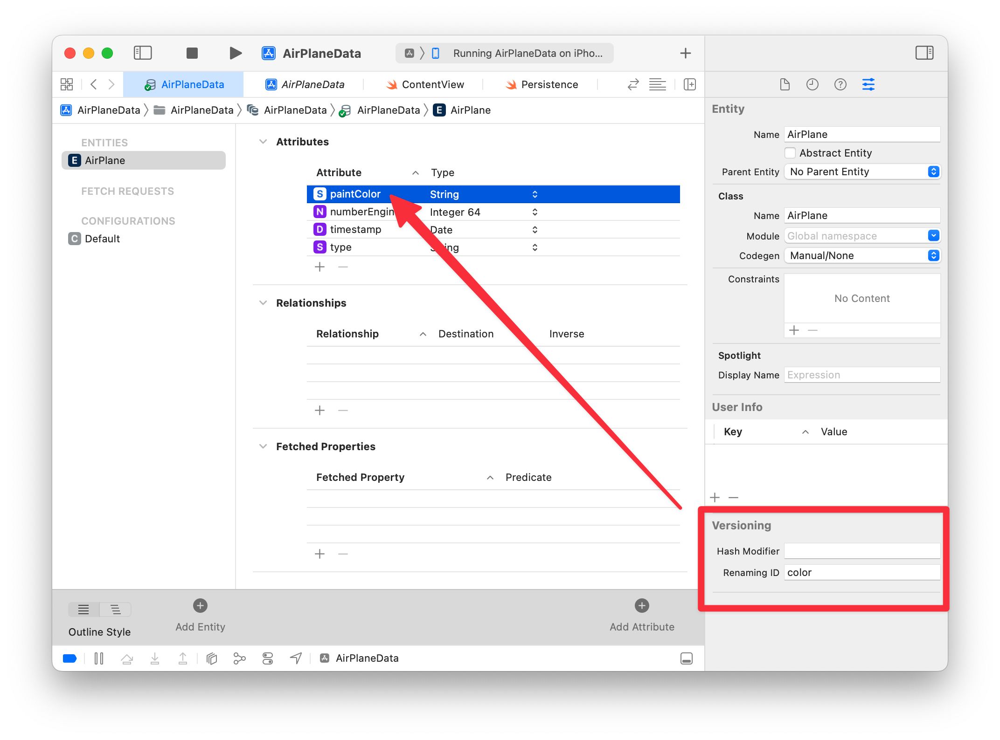
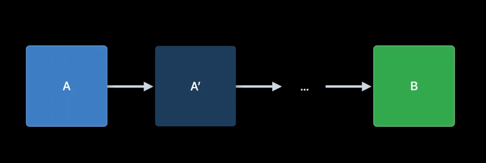
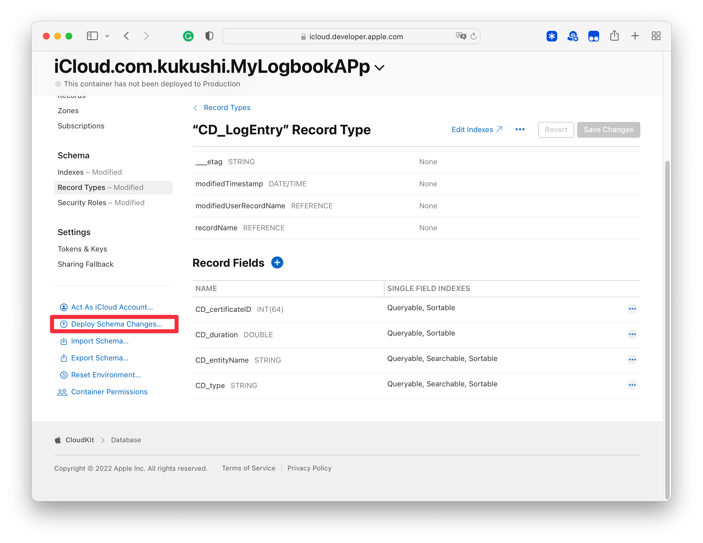
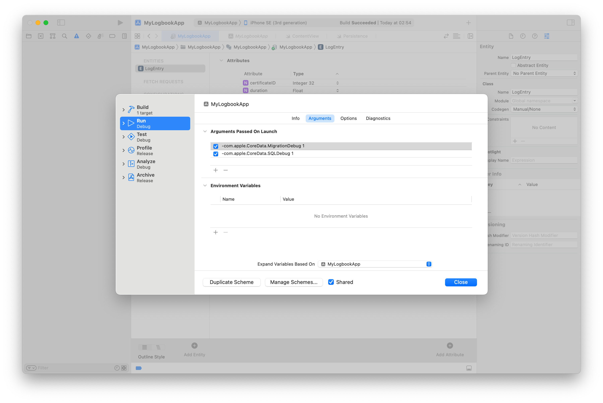
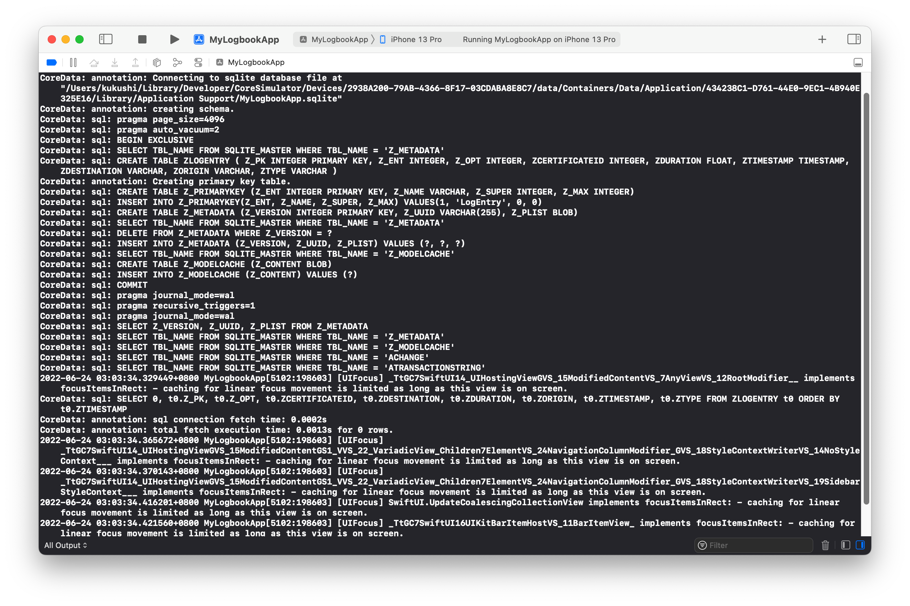
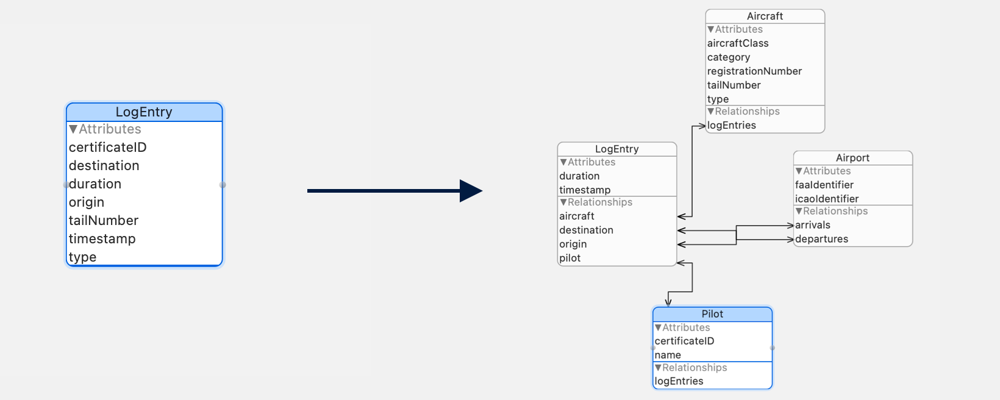

# WWDC22 - 进化你的 Core Data Schema

本文基于 WWDC22 [Evolve your Core Data Schema](https://developer.apple.com/videos/play/wwdc2022/10120/) 创作。阅读本文需要对 Core Data 有基础的了解。如果你从未使用过 Core Data，[官方文档](https://developer.apple.com/documentation/coredata)是很好的起点。

> 作者：[kukushi](https://kukushi.github.io)，Swift 爱好者，上架多款 iOS／macOS App，就职于字节跳动音乐团队。
>
> 审核：
>
> 黄骋志（橙汁），老司机技术社区核心成员，现于西瓜视频负责稳定性 OOM/Watchdog 相关工作。
>
> SZ，iOS 开发者，就职于 LinkedIn，喜欢研究编程语言和操作系统相关的内容，目前从事移动应用架构和基础设施的相关工作。
>
> 王浙剑（Damonwong），老司机技术社区负责人、《WWDC22 内参》主理人，目前就职于阿里巴巴。

在 App 开发中，我们经常因为各种各样的原因修改 Model。在 CoreData 中，Model 的改变意味着底层存储需要进行迁移以适配新的 Model，这让迁移成为了每一个 Core Data 使用者的必修课。本文将介绍如何高效地更新与迁移 Core Data Schema，我们会依次聊聊：

- 什么是 Schema 迁移
- Schema 迁移策略
- 在 CloudKit 中迁移的注意点

## 什么是 Schema 迁移

如果你曾经使用过 Core Data 且对实体做过修改，你可能会发现自己从没写过数据迁移相关的代码，App 也能正常运行！Core Data 神奇地适配了你的改动，这背后发生了什么？接下来让我们一探究竟。

在 Core Data 中，对 Model 的修改需要同步到底层存储 Schema 中。举个例子，假设我们有个 `Aircraft` 实体，有两个属性，类型和引擎数量：

```swift
struct Aircraft {
    let type: String
    let numEngine: Int
}
```

`Aircraft` 的 Schema 决定了底层的存储结构，看起来像是这样：

| TYPE     | NUM_ENGINE |
| -------- | ---------- |
| C172     | 1          |
| BE58     | 2          |
| B737-800 | 5          |

如果我们添加了一个新的属性，乘客数量：

```swift
struct Aircraft {
    let type: String
    let numEngine: Int
+    let numPassengers: Int
}
```

在迁移之后，Model Schema 的变化完全反应到了底层的存储中：

| TYPE     | NUM_ENGINE | NUM_PASSENGERS |
| -------- | ---------- | -------------- |
| C172     | 1          | 4              |
| BE58     | 2          | 6              |
| B737-800 | 5          | 162            |

如果我们没有迁移 Schema，当前使用的 Model 与存储的 Model 不一致，Core Data 会拒绝打开 Store。在这种情况下，Core Data 会返回 [`NSPersistentStoreIncompatibleVersionHashError`](https://developer.apple.com/documentation/coredata/1535452-validation_error_codes/nspersistentstoreincompatibleversionhasherror) 错误告诉开发者 Schema 需要进行迁移。

## Schema 迁移策略

Model 的改变引发的迁移是如此常见，以至于 Core Data 内置了一套迁移工具，让 App 能便捷地使 Model 保持同步。这套工具被统称为 "轻量迁移"（Lightweight Migration），支持自动分析并推断出 Model 变化产生的差异。在运行时，Core Data 会把 `Bundle.allBundles` 和 `Bundle.allFrameworks` 里所有的 Model 生成 Mapping Model，接着把改动同步到底层存储中。

**轻量迁移是 Apple 推荐的迁移方式**。实际使用中，99% 的情况我们应该都应该开启轻量迁移，这也是我们在修改了 Model 之后，App 能够在我们毫无感知的情况下底层存储就“悄悄”适配了新 Model 的原因。

### 轻量迁移适用范围

轻量迁移很强大，但并不支持所有类型的修改。对于属性（Attribute），轻量迁移支持：

- 新增／删除／重命名
- 修改为支持／不支持 Optional
- 定义默认值

如果你想重命名一个 Entity，可以在 Entity 的 Data Model Inspector 中，把新模型中的重命名标识符（Renaming ID）设置为老模型中相应属性的名称。例如，我们可以将 `Aircraft` 的 `color` 重命名为 `paintColor`：



我们可以在一个模型的第二版中重命名一个属性，然后在第三版中再次重命名它。轻量迁移能正确地从版本 2 升级到版本 3，或从版本 1 到版本 3。

对于关联（Relationships），轻量迁移支持：

- 新增／删除／重命名

- 调整关联的基数（Cardinality）
  > 如从一到一迁移到一到多，或者从无序对多迁移到有序到多。

对于实体（Entity），轻量迁移支持：

- 新增／删除／重命名

- 创建一个新的父实体或子实体

- 在实体的层级关系中上下移动属性

- 将实体移出一个实体层级关系

轻量迁移**不支持**合并实体层级关系：如果两个实体在源 Model 中没有相同的父实体，那它们在目标 Model 中也不能有共享相同的父实体。


此外，当源 Model 与目标 Model 差异过大时，也可能会导致 Core Data 无法推断出迁移步骤，导致轻量迁移失败。不过别担心，针对这类复杂场景，接下来会详细介绍解决方案。

### 开启轻量迁移

CoreData 提供了两个选项可以配置轻量迁移的行为：[`NSMigratePersistentStoresAutomaticallyOption`](https://developer.apple.com/documentation/coredata/nsmigratepersistentstoresautomaticallyoption) 和[`NSInferMappingModelAutomaticallyOption`](https://developer.apple.com/documentation/coredata/nsinfermappingmodelautomaticallyoption)。如果这两个选项被设置为 `true` ，那当 Store 加入到 Persistent Coordinator 时，CoreData 会检测模型是否发生变化，并在发现不匹配时执行轻量迁移。

使用 `NSPersistentContainer` 或 `NSPersistentStoreDescription` 时，这两个选项会默认设置为 `true` 并启用轻量迁移。如果使用的是其他的 API，如 `NSPersistentStoreCoordinator.addPersistentStore(type:configuration:at:options:)`，可以通过字典启用轻量迁移功能，如下面的代码：

```swift
// 1
let storeURL = URL(filePath: "/path/to/store")
let momURL = URL(filePath: "/path/to/model")
guard let mom = NSManagedObjectModel(contentsOf: momURL) else { 
    fatalError("Error initializing managed object model for URL: \(momURL)")
}

// 2
let coordinator = NSPersistentStoreCoordinator(managedObjectModel: mom)

do {
    // 3
    let options = [
        NSMigratePersistentStoresAutomaticallyOption: true,
        NSInferMappingModelAutomaticallyOption: true
    ]
    // 4
    try coordinator.addPersistentStore(ofType: NSSQLiteStoreType,
                                       configurationName: nil,
                                       at: storeURL,
                                       options: options)
} catch {
    fatalError("Error configuring persistent store: \(error)")
}
```

1. 从文件中加载 `NSManagedObjectModel`。`NSManagedObjectModel` 描述了 Model 的结构。

2. 使用刚刚创建的 `mom` 初始化一个 `NSPersistentStoreCoordinator`。

3. 配置开启轻量迁移的选项，注意这里开启了 `NSInferMappingModelAutomaticallyOption` 让 Core Data 自动推断出 Mapping Model。

4. 把 Store 加入 Coordinator 中。如果模型发生了变化，Coordinator 会执行轻量迁移。

   > 实际使用中，`addPersistentStore` 会立即在当前线程开始数据迁移。低端机在主线程进行大量数据的迁移有很大的概率会导致 App 卡死，因此更推荐使用 `NSPersistentContainer` 的 `loadPersistentStores(completionHandler:)` 或在异步线程执行 `addPersistentStore`。

无论是用上述哪个 API，我们都可以直接在 Xcode 的 Core Data 编辑器中对 Model 进行编辑，不需要新建一个 Model 版本。

Mapping Model 包含了把数据从源 Model 迁移至目标 Model 所需要的信息。 轻量迁移中，Core Data 会自动推断出 Mapping Model。如果想事先取得源 Model 和目标 Model 之间的 Mapping Model，可以使用 [`NSMappingModel.inferredMappingModel`](https://developer.apple.com/documentation/coredata/nsmappingmodel/1506468-inferredmappingmodel) 方法。

```swift
let mappingModel = try NSMappingModel.inferredMappingModel(forSourceModel: modelA, destinationModel: modelB)
```

在手动迁移中，我们也需要使用 MappingModel 进行迁移：

```swift
let manager = NSMigrationManager(sourceModel: sourceModel, destinationModel: destinationModel)
try manager.migrateStore(from: sourceModelURL, 
                         type: .sqlite,
                         mapping: mappingModel, // <-
                         to: destinationModelURL,
                         type: .sqlite)
```

> 本文不会过多介绍手动迁移，如果你对此感兴趣，可以看看[这篇文章](https://objccn.io/issue-4-7/)。

当 Model 间的变化超出了轻量迁移的适用范围时， [`NSMappingModel.inferredMappingModel`](https://developer.apple.com/documentation/coredata/nsmappingmodel/1506468-inferredmappingmodel) 会抛出错误 。这时，除了改为繁琐的手动迁移外，我们还可以尝试分段轻量迁移。

### 分段轻量迁移

回到 `AirPlane` 的例子，假设我们之前已经添加了 `flightData` 属性，代表二进制的飞行数据，以路径行为存储在这个字段里，如：

| Type     | NUM_ENGINE | NUM_PASSENGERS | FIGHT_DATA                                     |
| -------- | ---------- | -------------- | ---------------------------------------------- |
| C172     | 1          | 4              | /var/data/D5C01880-9CCF-4199-938D-24C1B6FFC84D |
| BE58     | 2          | 6              | /var/data/56F04F7D-1EFB-4CBD-AA55-7B8D399FECB5 |
| B737-800 | 5          | 162            | /var/data/66D5E44A-1282-48FC-9045-55A026EAA968 |

现在我们需要将改为直接存储数据，而非路径。

| Type     | NUM_ENGINE | NUM_PASSENGERS | FIGHT_DATA                          |
| -------- | ---------- | -------------- | ----------------------------------- |
| C172     | 1          | 4              | 01001100 01101111 01110110 01100101 |
| BE58     | 2          | 6              | 00001100 01101011 01101110 01001101 |
| B737-800 | 5          | 162            | 11001100 01001111 01010110 01100011 |

机智的你很快发现这个改动并不属于任何一个轻量迁移支持的类型 🥲。难道要去手写迁移了吗？还好 Apple 也考虑到了这种情况，正如编程中的大部分问题都可以通过增加一个中间层来解决，我们也可以通过将改动拆分为多个步骤，继续使用轻量迁移。

具体来说，如果源 Model 是 `A`，目标 Model 是 `B`，可以通过引入一个或多个 Model 版本来桥接，分解这些改动。



引入的每个 Model 都会有一个或多个改动，这些改动都符合轻量迁移要求，通过执行这一系列的迁移，我们可以得到一个不符合轻量迁移要求的 Model。

回到上面的例子，我们的原始 Model 是 `A`，我们可以依次：

1. 引入一个新的 Model 版本 `A'`，并添加一个新的属性 `tmpStorage`。

2. 将外部文件中的数据导入到 `tmpStorage` 中。

   > 导入文件中数据并不是 CoreData 提供的功能，需要我们手动实现。

3. 数据导入完成后，从 `A'` 新建 `A''` ，删除旧的 `FLIGHT_DATA`，同时将 `tmpStorage` 重命名为 `FIGHT_DATA`。

4. Done！🍻

实际开发中，我们可以在串行遍历每一个支持轻量迁移的 Persistent Store 里的所有 Model，Core Data 会自动开始迁移。需要注意的是，用户可能在迁移过程中杀掉 App，CoreData 的轻量迁移本身支持中断重启，但对于特定的特定的业务逻辑（如上面的从文件导入数据），我们需要手动实现中断重启。

## 在 CloudKit 中迁移 Schema

CloudKit 和 CoreData 有非常深度的集成，因此成为了很多开发者实现同步功能的选择。

在为 CloudKit 设计 Model 时，有一些额外的限制。为了让记录（Record）能在 App 和 CloudKit 之间正常传递， Core Data 的存储需要和 CloudKit 数据库使用相同的 Model Schema。

> Record 是 CloudKit 数据库中的一条记录，对应 CoreData 的 Entity 实例。记录中的字段被称为 Field，对应 Core Data 的 Attribute。

我们可以在本地的 Core Data Model 编辑器中定义 Model，这个 Model 不只是本地 Entity，也定义了 CloudKit Schema。在开发中，我们一般会现在 Development 环境中使用这个 Schema，然后部署到 Production 环境。如果你使用的是 `NSPersistentCloudKitContainer`，对应的 Schema 会自动同步到 CloudKit Console 中。



**需要注意的是，CloudKit 并不支持 CoreData 实体的所有特性**。在为 CloudKit 设计数据 Model 时，需要特意关注这些限制。下面是具体的限制以及实践中的解决方式：

- 不支持唯一约束（Unique Constraints）
    > 实际用到 Core Data 的唯一约束的场景并不多，后端生成的 Model 一般会有唯一的 ID，本地生成的 Model 也能使用 UUID 作为 ID，都从根源上保持了唯一。

- 不支持 `Undefined` 类型的属性

    > 无论使不使用 CloudKit，定义良好的 Schema 都应尽量避免 `Undefined` 类型。

- 不支持使用 [objectID](https://developer.apple.com/documentation/coredata/nsmanagedobject/1506848-objectid)

    > `objectID` 是本地 PersistentStore 存在的概念，同一个用户的同一个实体在不同设备的 `objectID` 也是不同的。如果有多设备同一实体保持统一 ID 的需求，建议使用自定义的 `ID`。

- 所有关联必须是可选的且双向的

- 不支持 [Deny 删除规则](https://developer.apple.com/documentation/coredata/modeling_data/configuring_relationships)

开发环境可以自由修改 Schema，但一旦 Schema 被部署到生产环境，就不能继续改动了。CloudKit 的 Schema 迁移限制非常大，仅支持新增 Fields 与新增 Record 类型，不支持修改／删除 Record 和 Field。轻量迁移只会更新磁盘文件的 Schema，不会对修改 CloudKit 的 Schema。我们仍然需要在 Development 模式下，用 `NSPersistentCloudKitContainer` 初始化新的 Model，让新的 Schema 同步到 iCloud Console， 然后将改动部署到 Production 环境上。

从上面可以看出，CloudKit Schema 本质上只支持"加法"类型的改动。与后端更新接口字段类似，迁移 CloudKit 的 Schema 需要考虑对老版本 App 的影响。一个常见的问题是新增了一个 Field 给新版本使用，但忘了更新老版本正在使用的旧字段。

总结来说，有三种常见的迁移 CloudKit Schema 的策略，我会以新增飞行日志的排序功能为例介绍：

1. 在 Record 中新增 Field。旧版本的 App 也能访问每一个 Record，但不会受到新增 Field 的影响。

   > 在 `LogEntry` 中新增一个 `timeStamp: Date` 属性，新版本的 App 可以正常访问并使用到 `timeStamp`。老用户虽然从数据层面还是获取了到 `timeStamp`，但无法识别，在功能上没有影响。

2. 在实体中新增一个 `version` 属性，并让 App 只会获取与当前 App 版本兼容的实体。

   > 在 `LogEntry` 中新增 `version` 属性，老 Model `version` 为 1.0，App 在同步数据时使用 Predicate 只获取兼容的（ `version` 低于 1.0）的版本。新增 `timeStamp` 后，`version` 更新为 `2.0` 。使用这种方式最好在最初就做好规划（有 `version`）字段，同时需要记住每个 `version` 改动了哪些字段。相较于第一种方式的优势在于老版本的 App 完全不会接触到新版本的数据。

3. 新建一个容器，使用 `NSPersistentCloudKitContainerOptions` 配置到新的容器上，用这个容器加载用户的当前 Store。CloudKit 会重新上传 App 已有的数据到新的 Container 中。这个策略完全没有兼容性问题，但需要留意重新上传数据需要一定时间。

   > 弃用老的 Container，用新的 ContainerID 初始化 Container。这个策略完全抛弃了 CloudKit 中的老数据。如果用户设备上恰好没有保留本地的数据，过往的数据就丢失了，不太推荐。
   >
   > ```swift
   > let description = NSPersistentStoreDescription(url: storeURL)
   > description.cloudKitContainerOptions = NSPersistentCloudKitContainerOptions(containerIdentifier: "newContainerID")
   > container.persistentStoreDescriptions = [description]
   > container.loadPersistentStores(completionHandler: { (storeDescription, error) in
   >     //...
   > }
   > ```

无论是使用上诉的哪个策略，一定要考虑多版本兼容问题，用多个不同版本的 Model Schema 测试 App。

对于中小 iOS 开发者而言，CloudKit 是个不错的数据同步选择。CloudKit 本身是免费的，再加上 iOS 13 引入的 `NSPersistentCloudKitContainer` 让开发者能像操作本地的 Persistent Store 一样同步云端的数据，像是同步用户设置等功能短短数十行代码即可实现。更值得一提的是，[Apple 终于**支持把使用 iCloud 的 App 转让给其他开发者**](https://developer.apple.com/news/releases/?id=06152022a)，消除了大部分开发者的顾虑。

> 如果对 `NSPersistentCloudKitContainer` 如何实现数据同步感兴趣，可以看看[这个文档](https://developer.apple.com/documentation/coredata/mirroring_a_core_data_store_with_cloudkit)。
>
> 如果想详细了解 CloudKit 中如何使用 Core Data 开发与调试，可以移步 [【WWDC22 10115/10119】 优化 CoreData & CloudKit 实现](https://xiaozhuanlan.com/topic/5821964073)查看。

好的，理论环节结束！让我们来看看 Demo。

## Demo

我们将创建一个小 App 来记录飞行时间。这些飞行信息会记录在 `LogEntry` 实体中，包含飞机类型、飞行时间、出发地、目的地和机尾型号等信息。

在运行 App 之前，我们可以在 Xcode Arguments 中设置 `com.apple.CoreData.SQLDebug` 和 `com.apple.CoreData.MigrationDebug` ，让 Core Data 打印出内部的指令。

> 比较常用的还有 `com.apple.CoreData.ConcurrencyDebug` 配置，可以让 Xcode 在执行不符合 Core Data 多线程规定的操作时抛出异常。



在 App 启动后，Console 里可以看到 Core Data 执行的日志，包括：创建 SQLite 文件，创建 Store 的元数据，以及实体化 Schema。



Core Data 创建的 SQLite 文件并没有什么特别，我们可以用 `sqlite3` 或任意其他 App 查看／修改它。

```bash
❯❯❯ sqlite3 "/Users/kukushi/Library/Developer/CoreSimulator/Devices/2938A200-79AB-4366-8F17-03CDABA8E8C7/data/Containers/Data/Application/29A703A6-541C-4F3D-B278-B1EABA9D018A/Library/Application Support/MyLogbookApp.sqlite"
SQLite version 3.37.0 2021-12-09 01:34:53
Enter ".help" for usage hints.
sqlite> .schema
CREATE TABLE ZLOGENTRY ( Z_PK INTEGER PRIMARY KEY, Z_ENT INTEGER, Z_OPT INTEGER, ZCERTIFICATEID INTEGER, ZDURATION FLOAT, ZTIMESTAMP TIMESTAMP, ZDESTINATION VARCHAR, ZORIGIN VARCHAR, ZTAILNUMBER VARCHAR, ZTYPE VARCHAR );
CREATE TABLE Z_PRIMARYKEY (Z_ENT INTEGER PRIMARY KEY, Z_NAME VARCHAR, Z_SUPER INTEGER, Z_MAX INTEGER);
CREATE TABLE Z_METADATA (Z_VERSION INTEGER PRIMARY KEY, Z_UUID VARCHAR(255), Z_PLIST BLOB);
CREATE TABLE Z_MODELCACHE (Z_CONTENT BLOB);
```

目前我们所有的属性都集中在 `LogEntry` 实体中，从 SQLite 角度来说，所有字段都在一张 SQLite 表中，后续新增字段容易出现冗余。因此我们先对实体的结构进行范式化处理（Normalize），拆分出定位更清晰的实体，增加一些新的属性。

- 新建 `Airport` 实体，代表机场，有 `icaoIdentifier`  和 `faaIdentifier` 属性

  > `icaoIdentifier` 代表[国际民航组织机场代码](https://zh.wikipedia.org/zh-cn/國際民航組織機場代碼)，是国际民航组织为世界上所有机场制定的识别代码。`faaIdentifier` 代表[联邦航空管理局位置标识符](https://en.wikipedia.org/wiki/Location_identifier)，用于识别美国境内的航空相关设施。

- 新建 `Aircraft` 实体，代表飞机，把 `LogEntry` 的 `type` 移动这个实体中，新增两个属性：`tailNumber` 和 `registrationNumber`

  > `tailNumber` 和 `registrationNumber` 分别代表飞机的[机尾编号和注册编号](https://zh.wikipedia.org/zh-cn/航空器註冊編號)。

- 新建 `Pilot` 实体，代表飞行员，把 `LogEntry` 中 `name` 和 `certificateID` 属性移动到 `Pilot` 中

- 重构 `LogEntry` ：把它的属性修改为到新实体的关联，如 `destination` 和 `origin` 从 `String` 修改到对 `Airport` 的一对一的关联、新增一个到 `Pilot` 的关联 `pilot`，新增一个到 `Aircraft` 的关联 `aircraft`。

改修完毕后，我们的实体结构看起来会像下图所示，看起来规范多了：



```swift
let coordinator = NSPersistentStoreCoordinator(managedObjectModel: mom)
do {
    try coordinator.addPersistentStore(ofType: NSSQLiteStoreType,
                                       configurationName: nil,
                                       at: storeURL,
                                       options: nil)
} catch {
    fatalError("Error configuring persistent store: \(error)")
}
```

修改完 Model 后再次运行 App。App 抛出了 `NSPersistentStoreIncompatibleVersionHashError` 错误，回忆上文的内容，这意味着我们当前的 Model 和文件中的 Model 并不匹配。

我们有三种方式来迁移数据：

1. 改为使用 `NSPersistentContainer`，默认会开启轻量迁移。

   ```swift
   container = NSPersistentCloudKitContainer(name: "MyLogbookApp")
   container.loadPersistentStores(completionHandler: { (storeDescription, error) in 
           // ...
   }
   ```

2. 改为使用 `NSPersistentStoreDescription`，也默认会开启轻量迁移。

   ```swift
   let persistentStoreDescription = NSPersistentStoreDescription(url: persistentStoreURL)
   persistentStoreDescription.type = NSSQLiteStoreType
   
   persistentStoreCoordinator.addPersistentStore(with: persistentStoreDescription, completionHandler: { (persistentStoreDescription, error) in
       // ...                                                                                
   })
   ```

3. 新建轻量迁移的选项，传递给 PersistentCoordinator。

   ```swift
   let options = [
           NSMigratePersistentStoresAutomaticallyOption: true,
           NSInferMappingModelAutomaticallyOption: true
       ]
   try coordinator.addPersistentStore(ofType: NSSQLiteStoreType,
                                      configurationName: nil,
                                      at: storeURL,
                                      options: options)
   ```

Demo 中我们将选择方式一，`NSPersistentContainer` 异步加载的方式也能避免主线程卡死的问题。将代码改写为用 `NSPersistentContainer`，重新运行 App，数据自动迁移完成！🍻

## 总结

轻量迁移灵活且强大，在 99% 的情况我们都应优先考虑使用它。对于比较复杂，把这个 Model 分解成由轻量级变化组成的模型。如果你的 App 在使用 CloudKit，每一次对 Schema 的改动都需要慎重，且经过全面的测试后再全量部署到 Production 环境中。
