# Session 10122 - 提升 “通过 Apple 登录” 的体验

> 作者：ZUBIN，iOS 开发者，就职于蚂蚁支付宝客户端团队，个人主页 <https://kangzubin.com>
> 审核：Damien

[Sign in with Apple](https://developer.apple.com/sign-in-with-apple/)（“通过 Apple 登录”）在 WWDC 2019 随着 iOS 13 和 macOS 10.15 以及 Xcode 11 一起推出，在前几年的小专栏 [WWDC19 内参](https://xiaozhuanlan.com/wwdc19) 和 [WWDC20 内参](https://xiaozhuanlan.com/wwdc20)，我也分享了两篇文章，详细介绍了 app 如何接入 Sign in with Apple 能力：

* [WWDC 2019：Sign In with Apple - 使用苹果账号登录你的应用](https://xiaozhuanlan.com/topic/8675913204)
* [WWDC 2020：深入使用 “通过 Apple 登录”](https://xiaozhuanlan.com/topic/5318796402)

为了进一步了解如何使用 “通过 Apple 登录” 在 app 中提供安全快捷的身份验证，本文主要介绍如何将基于密码的账户升级为安全的一键登录凭据，增强和简化应用的登录体验。同时并探索如何无缝处理 app 中用户会话（登录态，session）的更改，以及在 Web 和其他跨平台上充分发挥 “通过 Apple 登录” 的优势。

## 1 避免重复创建账户

如之前的 Session 介绍，“通过 Apple 登录” 是传统基于用户名和密码身份验证进行登录的一种安全便捷的替代方案。但即使 app 的登录方式升级支持了 “通过 Apple 登录”，用户仍然可以使用原来的密码来登录账户。因此，对于已经有账号密码的用户，请勿引导用户通过 Apple ID 重复创建一个新的账户。

以苹果提供的 Demo 程序 **[Juice](https://developer.apple.com/documentation/authenticationservices/implementing_user_authentication_with_sign_in_with_apple)** 为例，下面介绍引导用户在使用 “通过 Apple 登录” 时做出正确的决定。

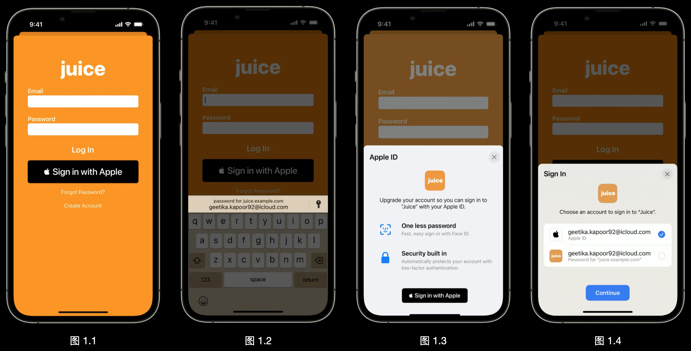

如图 1.1 所示，在 “Juice” 登录页面上，用户可以使用邮箱和密码来登录，或者 “通过 Apple 登录”。如果一个用户同时拥有了这两种登录方式，app 应该在处理登录流程时帮助用户登录正确的账户。

首先，app 需要实现密码自动填充，以便现有密码凭据显示在登录页的键盘上，如图 1.2，这样用户只需轻点一下即可自动填充密码凭证，该功能实现详见以下 Sessions:

* [WWDC17: Introducing Password Autofill for Apps](https://developer.apple.com/videos/play/wwdc2017/206/)
* [WWDC18: Automatic Strong Passwords and Security Code Autofill](https://developer.apple.com/videos/play/wwdc2018/204)

在用户通过密码登录成功后，如果用户的账户尚未关联 Apple ID，那么 app 应该引导用户升级成支持 “通过 Apple 登录”，如图 1.3，升级后，用户将获得一个内置安全性的账户，并且他们少了一个密码需要记住。

账户升级 “通过 Apple 登录” 能力需要通过 `Account Authentication Modification Extension` 来实现，该扩展 API 可以帮助用户无缝完成升级。

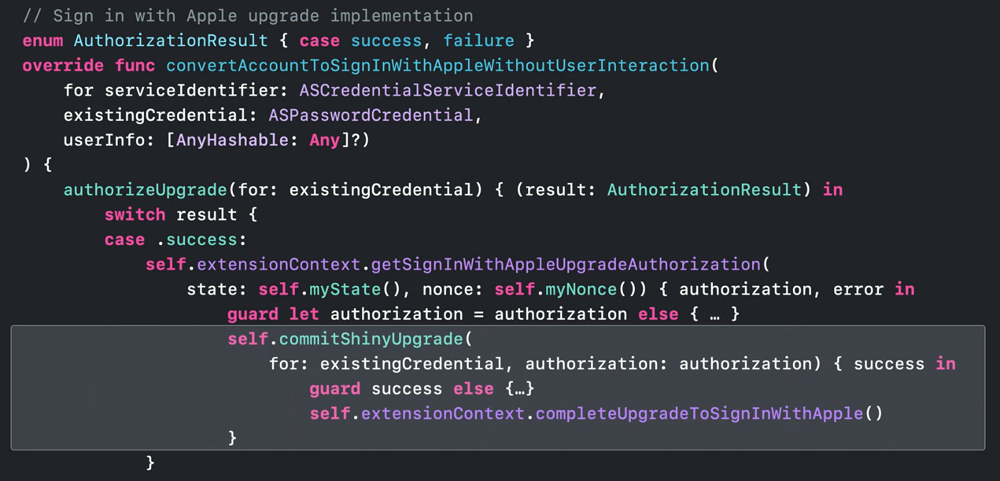

有关为用户账户提供安全升级的更多信息，请查看如下两个 Sessions:

* [WWDC20: Get the most out of Sign in with Apple](https://developer.apple.com/videos/play/wwdc2020/10173)
* [WWDC20: One-tap account security upgrades](https://developer.apple.com/videos/play/wwdc2020/10666)

除了上述提供密码自动填充外，我们还可以更进一步，在 app 启动后，如果用户尚未登录，则立即显示现有登录凭据，如图 1.4 所示。通过这种方式，用户甚至可以在看到登录页之前就使用正确的账户完成登录。

该能力由 Authentication Services API 提供，它既可以展示 “通过 Apple 登录” 凭据，也可以展示基于密码的凭据，实现起来也很简单，代码如下：

```swift
// Requesting both Sign in with Apple and password-based accounts.

import AuthenticationServices

let controller = ASAuthorizationController(authorizationRequests: [
    ASAuthorizationAppleIDProvider().createRequest(),
    ASAuthorizationPasswordProvider().createRequest()
])

controller.delegate = self
controller.presentationContextProvider = self

if #available(iOS 16.0, *) {
    controller.performRequests(options: .preferImmediatelyAvailableCredentials)
} else {
    controller.performRequests()
}
```

首先，创建一个 `ASAuthorizationController` 实例，并在授权请求数组中包含`ASAuthorizationAppleIDProvider` 和 `ASAuthorizationPasswordProvider`，并设置对应的 delegate 实现，然后调用该 controller 的 `performRequests` 方法请求授权。在 iOS 16 上，该方法新增了一个 options 参数，当设置为 `preferImmediatelyAvailableCredentials` 时，它告诉系统只想要设备上**立即可用**的凭据，它专门用于在应用程序启动时调用。

当在 app 启动时调用该方法，就可以看到如图 1.4 的系统授权弹层，会展示一个现有凭据的列表：包括 “通过 Apple 登录” 凭据和现有的密码凭据。用户选择凭据后，系统将在 `ASAuthorizationController` 的 `didCompleteWithAuthorization` 代理方法回调结果：

```swift
// ASAuthorizationControllerDelegate

func authorizationController(controller: ASAuthorizationController,
                             didCompleteWithAuthorization authorization: ASAuthorization) {
    switch authorization.credential {  
    case let appleIDCredential as ASAuthorizationAppleIDCredential:
        // Sign the user in with Apple ID credential.
        // ...

    case let passwordCredential as ASPasswordCredential:
       // Sign the user in with password credential
       // ...
   }
}

func authorizationController(controller: ASAuthorizationController, 
   didCompleteWithError error: Error) {
    // No credential found. Fall back to login UI.
}
```

如果用户选择了 “通过 Apple 登录” 选项，将得到 `ASAuthorizationAppleIDCredential` 结果，选择了基于密码的账户选项时，将得到 `ASPasswordCredential` 结果，拿到这两个凭据后就可以直接发起登录请求了。如果用户没有现有登录凭据，API 将不会显示这个选择弹层，相反，系统将调用`didCompleteWithError` 方法，此时，我们应该跳转到 App 的登录页。

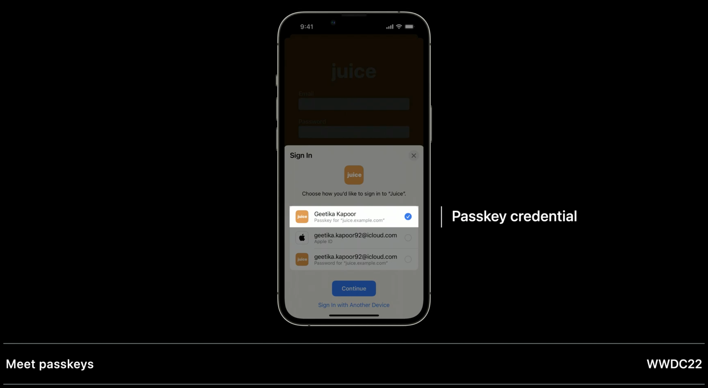

此外，上述 Authentication Services API 也无缝支持 **passkeys**，`passkeys` 是用于替代密码（passwords）的下一代身份验证技术，更详细的信息请查阅 Session:

* [WWDC22: Meet passkeys](https://developer.apple.com/videos/play/wwdc2022/10092)

综上，只需几行代码，可以提升 App 的登录体验，帮助用户选择正确的账户进行登录，以防止在系统中创建重复账户。

## 2 详解 Apple ID 凭据

通过第一节，我们知道，当用户使用 “通过 Apple 登录” 授权成功后，将得到一个 `ASAuthorizationAppleIDCredential` 对象，它包含了 `user`, `fullName`, `email`, `realUserStatus`, `identityToken`, `authorizationCode` 等字段。

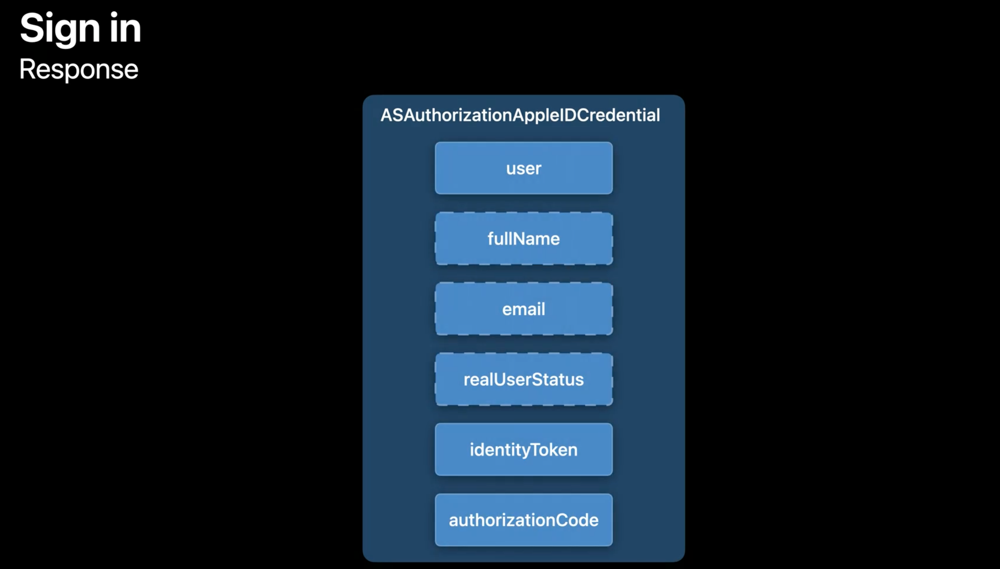

* **user**：用户唯一标识符，该值在同一个开发者账号下的所有 App 是一样的。使用该字段可以唯一标识系统中的用户。
* **fullName**：只有当 App 需要时才请求该字段，用户可以任意指定他们想要的名字返回给开发者。
* **email**：当需要与用户联系时再请求该字段，用户可以选择返回真实 Apple ID 对应的邮箱，也可以选择返回隐藏的邮箱，所有发到该隐藏邮箱的邮件会自动路由到 Apple ID 对应的真实邮箱。此外，并非所有账户都有关联的 email，因此开发者需要准备好处理 email 值为空的情况。
* **realUserStatus**：用户真实可能性指标，用于判断当前登录的苹果账号是否是一个真实用户。它使用设备端机器学习、账户历史记录和硬件认证进行计算，同时保护用户的隐私。取值有 3 个：
  * `likelyReal` 表示基本可以确定用户是真实的人，app 可以为该用户提供最佳的体验，例如跳过额外的欺诈验证检查（如验证码）
  * `unknown` 是指系统不能确定用户是否为真人，需要额外的验证步骤。用户可能仍然是真实的，所以不要阻止他们使用的 app
  * `unsupported` 表示系统无法做出准确的判断，用户大概率可能是机器人

此外，需要额外强调的是，由于 `fullName`、`email` 和 `realUserStatus` 仅会在第一次授权 App 时才会包含在结果凭据中，后续的重新授权都将不会再包含这 3 个信息，因此，必要时请缓存这些字段的值，以保证能在系统中正常创建账户。

* **identityToken**：是一个 JWT（JSON web token）格式的数据，包含了 App 服务端所需要的大部分用户数据信息，由 3 部分组成：base-64 URL 编码 Header、base-64 URL 编码 Payload 核心数据，以及由 Apple 签名的 Signature 数据。开发者需要使用 Apple 的公钥验证签名，以确保响应结果没有被篡改，并且确实来自 Apple ID 服务器。

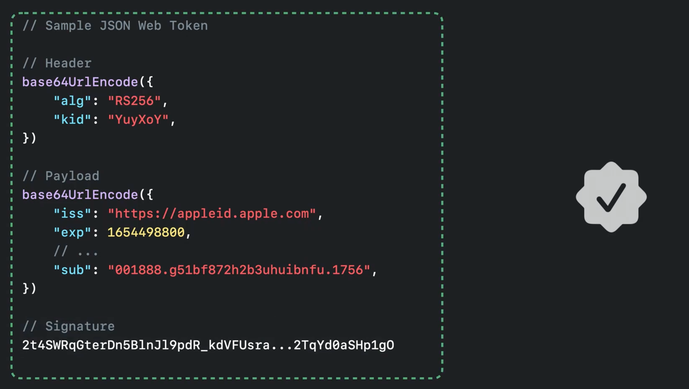

在解码 JWT Payload 数据后（如下截图），我们需要做以下几点验证：

1. 验证发件人 "iss" 字段是 `appleid.apple.com`；
2. 验证 "aud" 字段为 App 的 bundle Id；
3. 验证过期时间字段 "exp" 大于当前时间戳，确保数据有效；
4. "sub" 字段即为用户的唯一标示符；同时也可以看到 "email" 和 "realUserStatus" 等字段，0 表示 "unsupported"、1 表示 "unknown"、2 表示 "likely real"；
5. 最后验证 "nonce" 字段的值与 App 创建授权请求之前生成的是否相同，防止重放攻击。

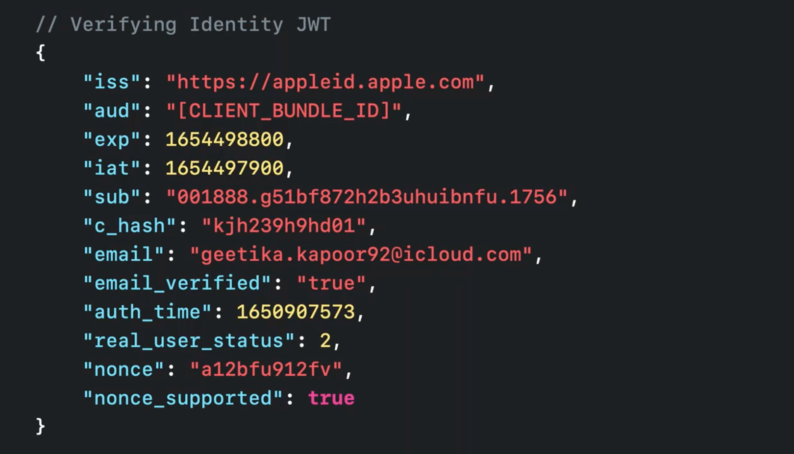

* **authorizationCode**：是一种短暂的一次性令牌，用于向 Apple ID 服务器换取 accessToken 和 refreshToken（标准的 OAuth 2.0 协议），流程如下：

向苹果的服务器 URL `appleid.apple.com/auth/token` 发一个 POST 请求，请求的 body 包含 client_id、client_secret、以及签名获取到的 authCode。其中 grant_type 此处填写 `authorization_code`，client_id 可填写 App 的 bundleId，而关于字段 client_secret 的创建说明，可翻阅 [Apple 开发者文档](https://developer.apple.com/documentation/sign_in_with_apple/generate_and_validate_tokens)。

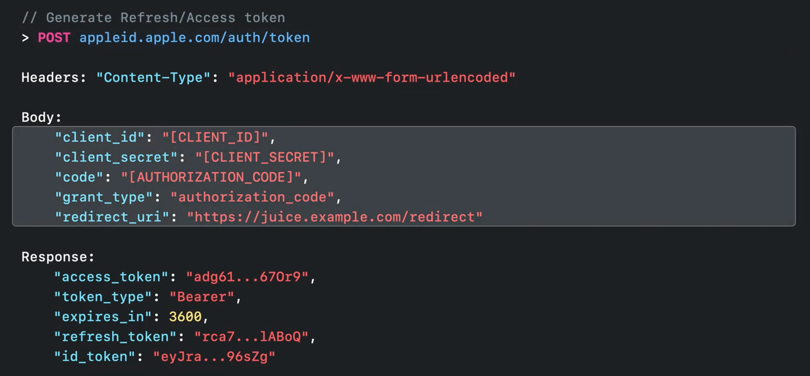

如上截图，在响应数据中，可以获取到 accessToken 和 refreshToken，以及一个新的 base-64 编码的 JWT 格式的 identityToken。后续当 accessToken 过期时，可以通过 refreshToken 重新获取新的 accessToken，此时 POST 请求 body 中需要填写 refresh_token 字段，以及 grant_type 则改为类型 `refresh_token`:

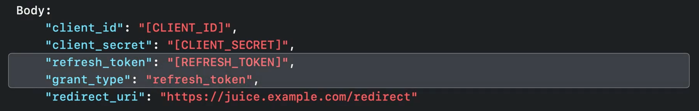

整体流程如下图，第一次获取的 refreshToken 可以一直使用，直到它过期失效，比如当用户的会话（session）发生变化时。

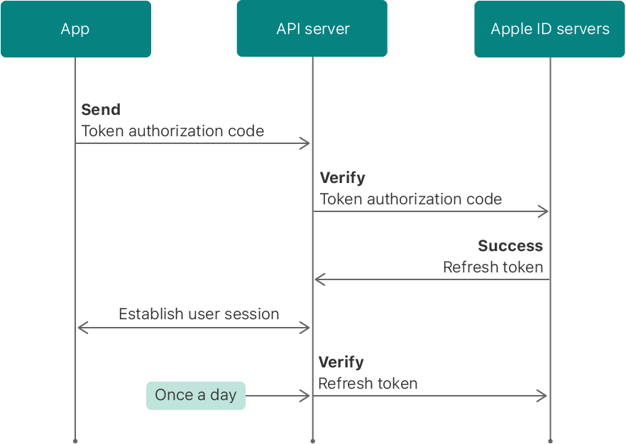

## 3 处理会话变化和账户删除

用户选择 “通过 Apple 登录”，当完成授权并验证 identityToken 后，服务端会下发用户的登录态（user session）表示用户完成登录，可以开始使用 App 提供的服务。

但有很多场景可能会导致用户的会话发生变化，比如用户可以在系统设置中停止某一 App 使用 Apple ID  登录，或者用户的设备退出当前登录的 Apple ID 。

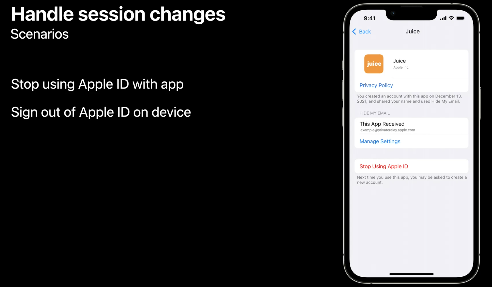

要优雅的处理会话更改，App 可以在启动时（或者其他任何需要验证凭证状态的时候）调用 ASAuthorizationAppleIDProvider 提供的`getCredentialState(forUserID:)` 方法来判断凭证的状态：

```swift
// Check User Credentials on app launch

let appleIDProvider = ASAuthorizationAppleIDProvider()
appleIDProvider.getCredentialState(forUserID: "currentUserIdentifier") 
{ (credentialState, error) in
    switch(credentialState){
    case .authorized:
        // Found valid Apple ID credential
    case .revoked:
        // Apple ID credential revoked. Log the user out.
    case .notFound:
        // No credential found. Show login UI.
    case .transferred:
        // Team is transferred
    }
}
```

同时，苹果也提供了通知的方式来监听，在 App 使用过程中，当苹果账号的凭据被撤销化时进行相应的处理，比如退出登录操作等。

```swift
// Register for revocation notification

let notificationName = ASAuthorizationAppleIDProvider.credentialRevokedNotification

NotificationCenter.default.addObserver(self, 
                                       selector: #selector(signOut(_:)),
                                       name: notifica
```

上述两点相关 API 在之前的 Session 中已介绍，这里不再赘述。

此外，Server to server notifications 服务端订阅通知也是非常重要的一项用于处理用户信息变化，比如：

* 当用户禁用或启用邮件转发首选项时；
* 当用户停止将 Apple ID 与 App 一起使用时；
* 或者当用户永久删除其 Apple ID 时；

苹果会向开发者的服务端发送事件通知。开发者需要在 Apple Developer 门户中进行注册接收通知的 URL，如下截图，所有相关的事件都会发送到该 URL 上。

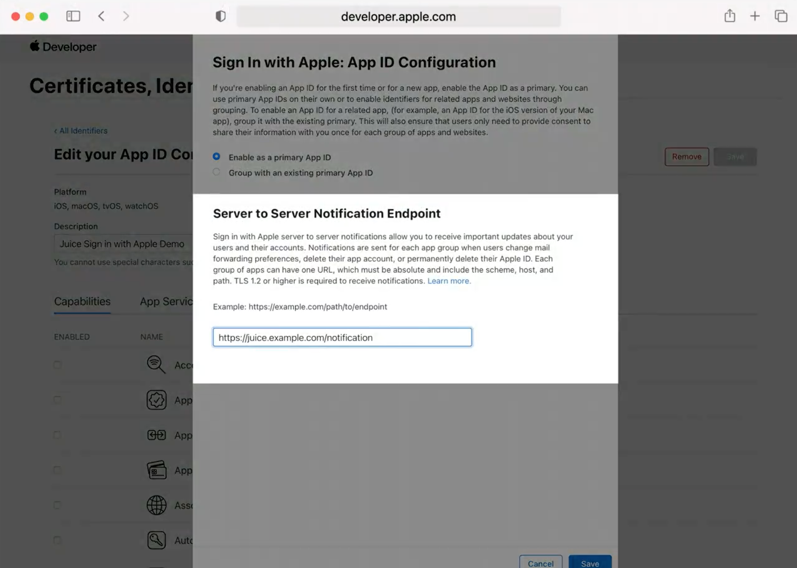

通知事件将通过由苹果签名过的 JSON Web Token 格式来传送，内容如下：

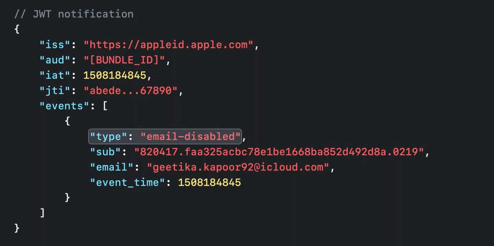

JSON 的内容包含了一些重要的信息，包括消息的颁发者（issuer）和应用 bundleId 等，以及 event（事件）的具体内容。事件的类型有以下几种：

* **email-disabled**：当用户决定停止从 private relay email 中接收邮件时，开发者会收到这个事件通知。
* **email-enabled**：表示用户选择重新接收电子邮件。
* **consent-revoked**：当用户决定停止在开发者的 App 中使用其 Apple ID 时，将向开发者发送“同意撤销”事件，此时 App 应将其视为用户已退出登录。
* **account-delete**：当用户要求苹果删除其 Apple ID 时，将发送此事件。当收到此通知时，与用户关联的用户标识符将不再有效。

通过监听这些通知，我们将能够以更好的方式直接从服务端对这四种不同的情况作出处理，以提升用户体验。下面我们重点介绍一下 **“账户删除”** 的处理。

账户是用户身份的一部分，我们使用它来管理用户一些个人和私密的数据。用户有可能想删除他们的账户，每个 App 需要对此提供支持。

苹果在 2022 年 5 月 24 日也对开发者推送了[新闻](https://developer.apple.com/cn/news/?id=12m75xbj)，要求自 2022 年 6 月 30 日起，支持账户创建的 App 必须同时允许用户在 App 中发起账户删除。

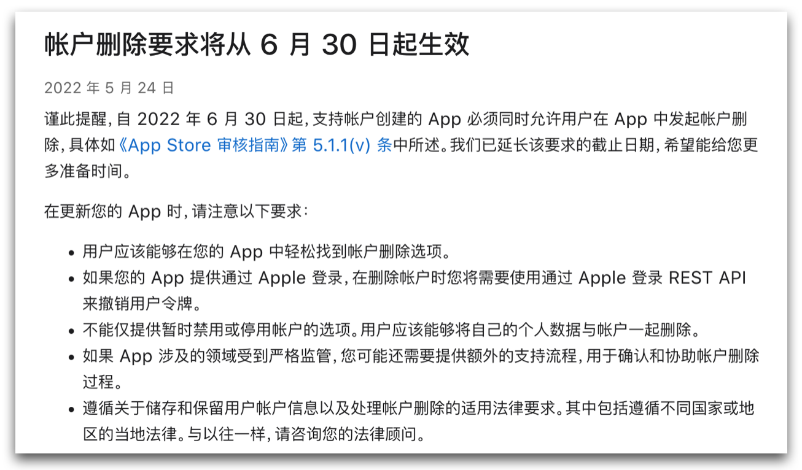

而且，如果 App 提供通过 Apple 登录，在删除账户时，App 的服务端需要使用 “通过 Apple 登录” REST API 来撤销用户令牌，流程如下：

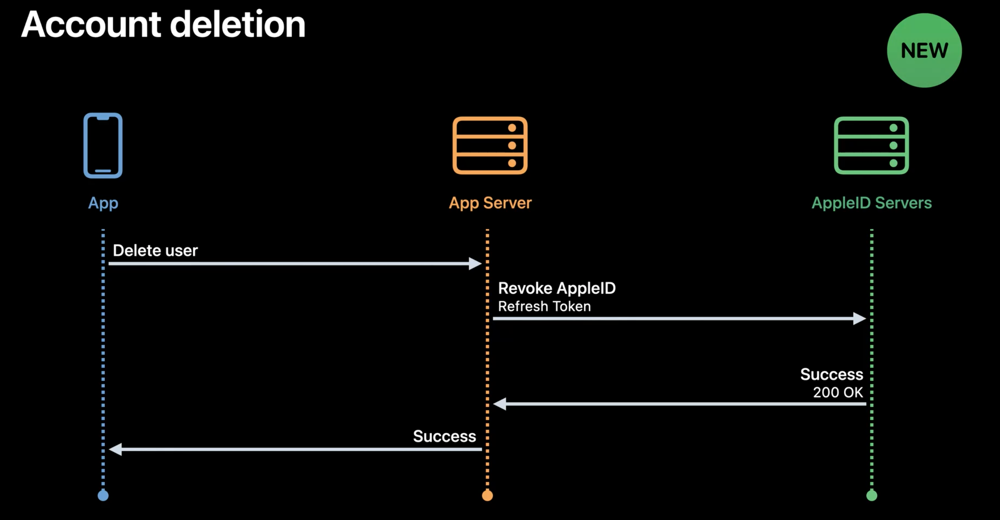

本次新提供的撤销令牌的 REST API 接口为 `appleid.apple.com/auth/revoke`，Body 传递的内容可以是 refreshToken 或者 accessToken，相应的类型也不同，分别为 `refresh_token` 和 `access_token`。

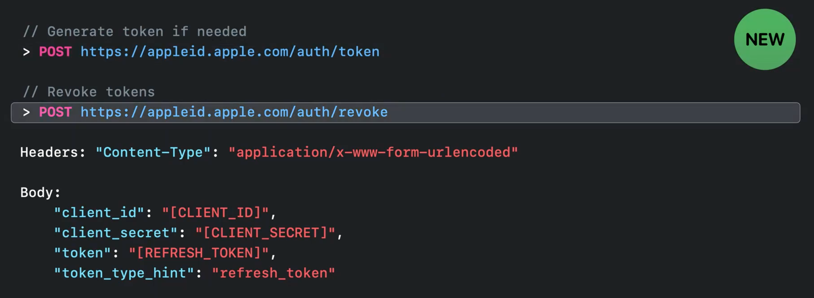

当该 API 返回响应成功时，用户的令牌和会话（sessions）将立即失效。账户删除后，用户再次在 App 中使用 “通过 Apple 登录” 将与第一次使用创建新账户的体验一样。

## 4 跨平台实践

“通过 Apple 登录” 可以无缝地在苹果的各个平台上运行（iOS、iPadOS、macOS、tvOS 等），但不仅如此，它同样可以使用在 Web 和其他平台上。

首先，我们可以将同一开发者不同平台的同类 App 分在一组，比如上述 Demo 程序 Juice 如果同时支持在 iOS 和 macOS 平台上使用（每个平台的使用的 Bundle ID 不同），将这两个平台的 app 归为一组，这样用户只需授权一次 Apple ID 登录凭据，就可以在同组下不同的 app 间共享，避免重复发起登录授权，提升用户体验。

接下来介绍如何配置 Services ID 以支持在 Web 上使用 “通过 Apple 登录”。

登录 Apple Developer  门户，切换到 "Certificates, Identifiers & Profiles"，选择 "Services IDs" 选项，并点击 "Continue" 按钮：

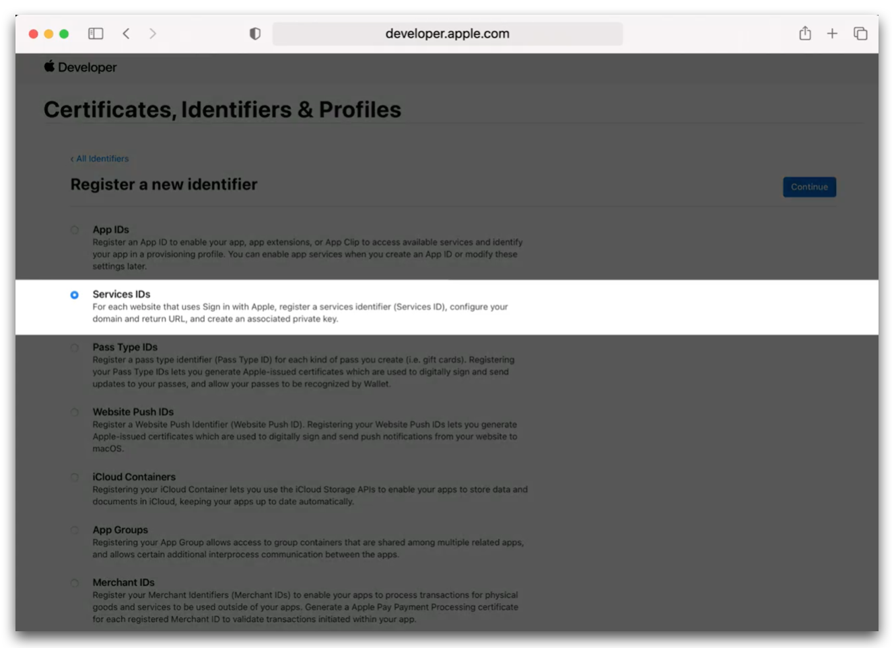

接着输入"服务描述"和"服务的唯一标示符"（identifier），然后选择 “通过 Apple 登录” 旁边的复选框，点按“配置”按钮：

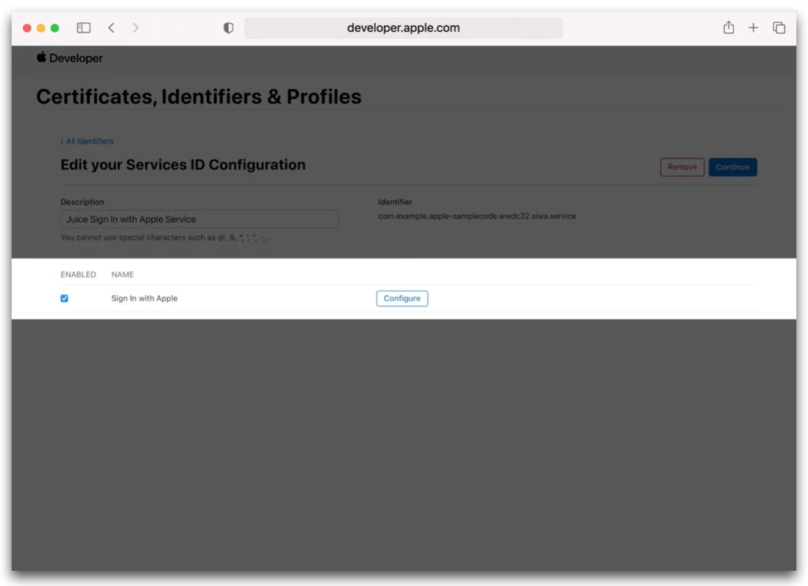

在 Web Authentication Configuration 配置页中，先选择一个主要的应用程序 ID，然后注册 Website URLs，输入将用于支持 “通过 Apple 登录” 的网站的域名或者二级域名。最后，输入一个重定向 URL，以便 Apple 在成功授权后将用户重定向回 app 或网站。

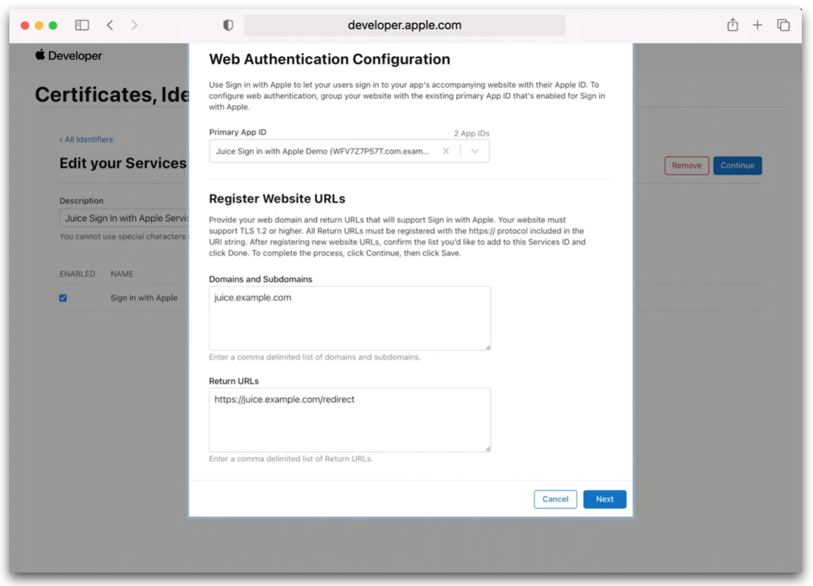

通过这 3 步操作，我们就可以获得一个 Services ID 用于在 Web 上使用 “通过 Apple 登录”。接下来就可以引用 [Sign in with Apple JS](https://developer.apple.com/documentation/sign_in_with_apple/sign_in_with_apple_js)，在 Web 网页中添加 “通过 Apple 登录” 按钮：

1. 引用 `appleid.auth.js`；
2. 通过 div 添加登录按钮，并配置按钮的样式，详见 [Sign in with Apple Button](https://appleid.apple.com/signinwithapple/button)；
3. 通过按钮点击调用 AppleID.auth.init 接口发起授权；

```html
// Embed Sign in with Apple JS
<html>
    <body>
        <script type="text/javascript" src="https://appleid.cdn-apple.com/appleauth/static/jsapi/appleid/1/en_US/appleid.auth.js"></script>
        <div id="appleid-signin" data-color="white" data-border="true" data-type="sign in"/>
        <script type="text/javascript">
            AppleID.auth.init({
                clientId : '[CLIENT_ID]',
                scope : '[SCOPES]',
                redirectURI : '[REDIRECT_URI]',
                state : '[STATE]',
                nonce : '[NONCE]',
                usePopup : true
            });
        </script>
    </body>
</html>
```

其中，授权接口的参数字段赋值说明：

* clientId: 即为前面在 Apple Developer 后台申请的 Service ID；
* scope: 为请求授权的范围，如 name，email 等，多个用空格隔开；
* redirectURI: 在注册申请 Service ID 时填写，用于 Apple 在授权成功后重定向跳转回开发者的网站；
* state 和 nonce: 用于防止重复攻击；
* usePopup: 用于控制在单独的窗口打开登录页面，还是直接在当前窗口重定向到苹果登录网站。

此外，如果用户使用 Safari 浏览器访问网站，“通过 Apple 登录” 则可以直接使用原生 API 发起授权请求，体验更好，如下截图：

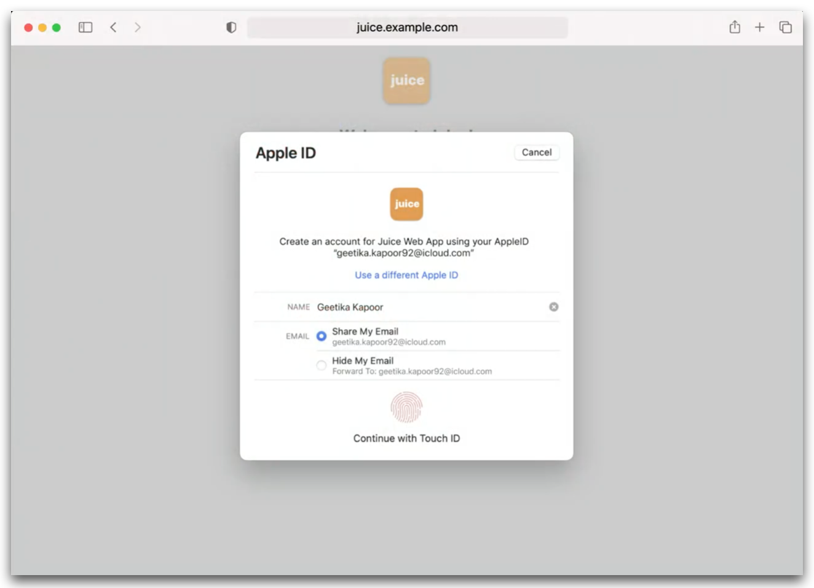

当 Apple ID 服务器处理授权请求后，Web 网站将收到一个包含授权结果的 DOM 事件：

```js
// Listen for authorization success.
document.addEventListener('AppleIDSignInOnSuccess', (event) => {
    // Handle successful response.
    console.log(event.detail.data);
});

// Listen for authorization failures.
document.addEventListener('AppleIDSignInOnFailure', (event) => {
     // Handle error.
     console.log(event.detail.error);
});
```

当授权成功时，将收到包含授权代码、身份令牌和用户信息的回复，Web 网站可以基于这些信息发起登录请求，与 iOS app 处理类似：

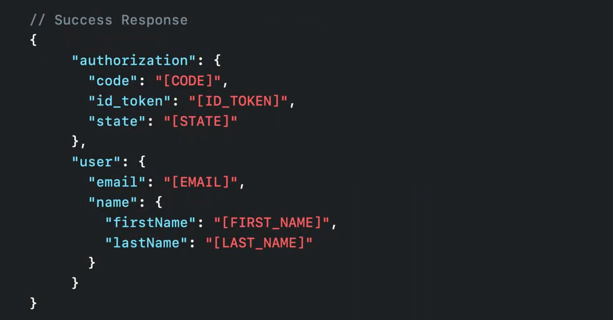

最后，对于 Windows、Android 等其他非 Web 平台，也可以使用 [Sign in with Apple REST API](https://developer.apple.com/documentation/sign_in_with_apple/sign_in_with_apple_rest_api) 来实现一样的功能，直接向 Apple ID 授权服务器接口发起请求：

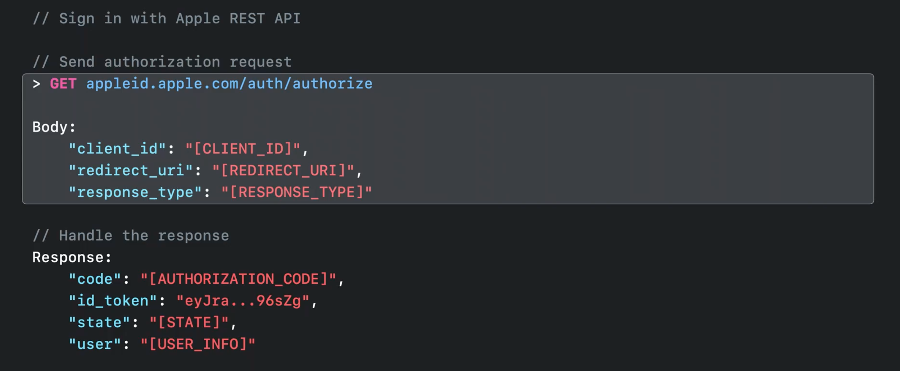

## 5 总结

本 Session 所介绍的 Sign in with Apple 相关能力基本在 WWDC19 和 WWDC20 都陆续介绍过，本文主要是在之前的基础上总结如何充分利用已有的 API 提供更好的 “通过 Apple 登录” 体验，包含防止用户重复创建账户，更详细地解密 Apple ID 凭据，以及如何处理用户会话变化和账户删除操作，以更好的保护用户隐私，最后探索如何在 Web 等其他平台上使用该能力。

虽然 Sign in with Apple 已经推出 3 多年了，各大 App 也基本都接入了该能力，Apple 也给我们提了几条中肯的建议：

1. 除非你的 app 强依赖基于账户的能力，否则应该让用户无需登录即可使用你的应用。例如，可以允许用户使用 Apple Pay 购买项目，然后选择在购买完成后再将购买信息与账户绑定。
2. 引导将用户名和密码身份验证切换到 “通过 Apple 登录”，为现有用户提供升级其账户安全性的能力。
3. 如果你的 app 只需要一个唯一的标识符来识别用户，请不要收集姓名或电子邮件。如果你确实通过 “通过 Apple 登录” 收集 email，请确保尊重用户的选择。
4. 你的 app 用户可能会使用多个平台，他们希望在任何地方使用 “通过 Apple 登录”，因此你应该在所有平台上支持该功能。

相关链接：

* [Sign in with Apple](https://developer.apple.com/documentation/sign_in_with_apple)
* [Sign in with Apple REST API](https://developer.apple.com/documentation/sign_in_with_apple/sign_in_with_apple_rest_api)
* [Sign in with Apple JS](https://developer.apple.com/documentation/sign_in_with_apple/sign_in_with_apple_js)
* [Sign in with Apple Button](https://appleid.apple.com/signinwithapple/button#left-align-button-section)
* [WWDC19: Introducing Sign In with Apple](https://developer.apple.com/videos/play/wwdc2019/706/)
* [WWDC20: Get the most out of Sign in with Apple](https://developer.apple.com/videos/play/wwdc2020/10173)
* [WWDC20: One-tap account security upgrades](https://developer.apple.com/videos/play/wwdc2020/10666)
* [WWDC22: Enhance your Sign in with Apple experience](https://developer.apple.com/videos/play/wwdc2022/10122)
* [WWDC22: Discover Sign in with Apple at Work & School](https://developer.apple.com/videos/play/wwdc2022/10053)
