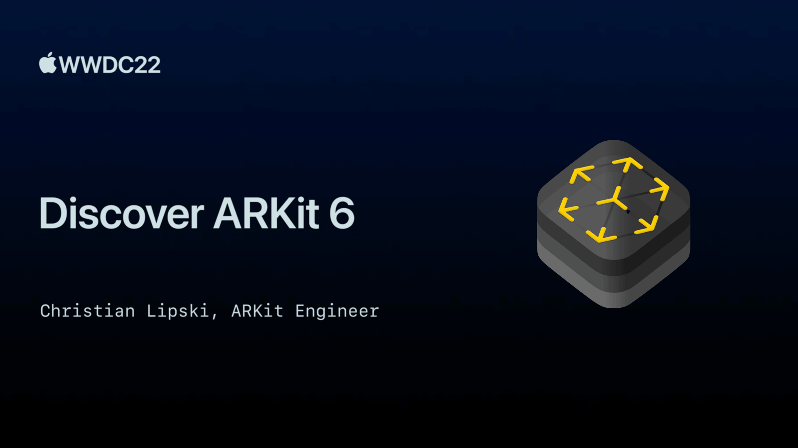

## 个人介绍

作者：员凯，端侧开发，在大前端的路上一去不复返，《ARKit 开发与实战》作者，最近在折腾音视频相关的内容。

## 审核介绍

苹果 API 搬运工，爱写文章的 ARKit 开发者。专栏[《ARKit 与计算几何》](https://xiaozhuanlan.com/computationalgeometry)，[《Metal Shader 快速使用入门》](https://xiaozhuanlan.com/metalforbeginner)

## 不超过 120 个字的文章简介

本文将分两部分介绍 ARKit 相关的内容，第一部分是 ARKit6 相关的特性，第二部分是对 ARKit 历史版本从跟踪、理解、渲染三个角度进行梳理和归类。内容不深，应该容易读懂，感谢品尝。

## 公众号/小专栏图文头图

