# WWDC22 - Discover ARKit 6

本文基于[Session 10126](https://developer.apple.com/videos/play/wwdc2022/10126)梳理

> 作者：员凯，端侧开发，在大前端的路上一去不复返，《ARKit开发实战》作者，最近在折腾音视频相关的内容。

## 前言

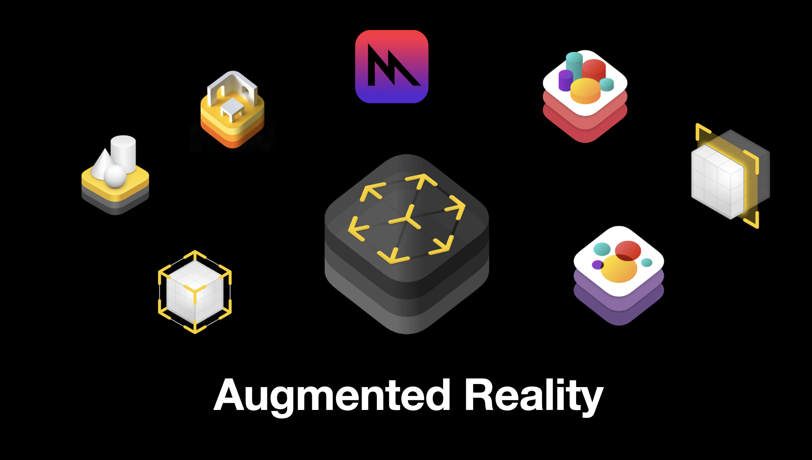

在今年的WWDC大会上，我们虽然没有等来传说中的RealityOS和MR/VR硬件，但还是看到苹果对于整个AR生态有力的补充。比如增加了RoomPlan框架，让你通过调用一些API就可以生成房间的3D模型；以及对VisionKit和ML的更新，通过Data Scanner就可以实时识别文本和各种Code；最后就是ARKit6增加的一些新特性，在Object Capture和RoomPlan Scan使用过程中都会有涉及。

本文会分两部分讲解ARKit所涉及到的内容：

- 第一部分详述了ARKit6带来的新特性

- 第二部分会从跟踪、理解、渲染等几个方面对ARKit历史版本进行回顾和梳理

## 一、ARKit6

ARKit6的新特性主要集中在对相机的自定义配置以及图像捕捉上，其余就是优化了ARPlaneAnchor和Motion Capture，以及Location Anchor对更多城市的支持。

在开始之前，我们先来了解下ARKit是如何通过摄像头来捕捉图像的。从iPhone6到iPhone 13 Pro为止，都会搭载一颗1200W像素的广角镜头，然后根据不同系列和规格会搭载长焦和超广角镜头，比如iPhone 13 Pro就搭载了三颗镜头。总体来看，搭载的后置镜头分为3类：长焦、广角和超广角，当然还有个LiDAR传感器。这几个摄像头会参与到不同的任务中，比如世界跟踪、动作捕捉、人物分割、获取场景深度数据、以及拍照的景深效果。

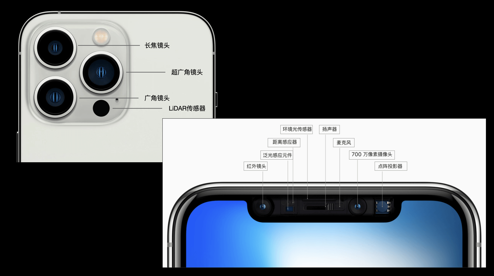

这里的长焦、广角、超广角镜头，以及前置的TrueDepth Camera（原深感镜头）以及后置的LiDAR传感器分别对应AVFoundation中AVCaptureDevice的不同type值，如下：

- AVCaptureDeviceTypeBuiltInTelephotoCamera（长焦镜头）
- AVCaptureDeviceTypeBuiltInWideAngleCamera（广角镜头）
- AVCaptureDeviceTypeBuiltInUltraWideCamera（超广角镜头）
- AVCaptureDeviceTypeBuiltInLiDARDepthCamera（LiDAR）
- AVCaptureDeviceTypeBuiltInTrueDepthCamera（原深感镜头）

这几种镜头中，后置的广角镜头会为ARKit提供背景图像。对于搭载的镜头而言，像素读取规模、分辨率、帧率、视野是几个很关键的点，受限于手机硬件资源以及通道带宽固定，由于像素读取规模的差异，不同的分辨率会对应不同的帧率，而视野（FOV）依赖于硬件配置，缩小视野就相当于裁切摄像头传感器获取的内容。

所以如果想要保持视野不变，就需要减少采样的分辨率。常用的两种减少分辨率的采样方式为：Skipping（跳采样）和Binning（合并读出）。通过选择视野中的像素点，根据不同的规则来抽取或合并像素点来降低分辨率，这样就能保证视野不变，像素读取规模也不变，只需要降低分辨率就能保证固定的帧率。

ARKit采用的是Binning模式，在像素读取后时，不会1200W像素都会使用，而是有一个3840x2880特定尺寸的区域。获取像素区域后，再进行Binning操作，步骤为：读取2x2像素区域，平均像素值，合并读出写回单个像素，这样分辨率就变为1920x1440。最终会以大约每17ms的速度获得一次图像，然后再把图像用于各种视觉任务的计算。

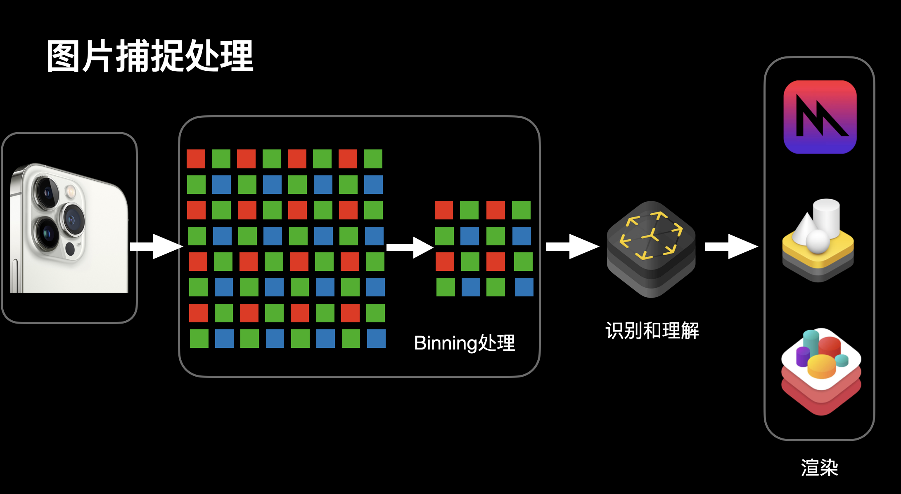

图像捕捉和处理的整体过程如上图所示，最终渲染可以选择Metal、RealityKit，或者SceneKit、SpriteKit。不同的渲染框架，都可以使用ARSession的delegate方法拿到ARKit输出的图像，或者直接使用各自框架（除了Metal）的view，其中就已经包含了ARKit输出的图像，然后再通过view的delegate方法获取图像识别后的锚点，并生成node，代码如下：

```swift
// MARK: - ARSessionDelegate
func session(_ session: ARSession, didUpdate frame: ARFrame) {
        
  // 获取捕捉图像
  let captureImage = frame.capturedImage
  // 或者通过session获取
  let captureImage = session.currentFrame?.capturedImage
}


// MARK: - ARSCNViewDelegate
func renderer(_ renderer: SCNSceneRenderer, nodeFor anchor: ARAnchor) -> SCNNode? {
        
  // SceneKit 添加一个node
  let node = SCNNode()
  return node
}
```

### 1、4K Video Model

从前面的叙述中可以看到如果跳过Binning的过程，其实是可以直接拿到4K分辨率（3840x2880）的图像，当然考虑到内存占用和CPU资源，需要降低每秒处理图像的次数，而这就是ARKit6第一个新特性：4K视频模式。在4K模式下，会以每秒30帧的速度获取3840x2880尺寸像素的图像，后续的处理过程还和之前保持一致。

要开启4K视频模式，可以通过设置ARConfiguration的videoFormat属性，在设置之前需要判断下当前设备是否支持，代码如下：

```swift
let configuration = ARWorldTrackingConfiguration()
        
if let resFormat = ARWorldTrackingConfiguration.recommendedVideoFormatFor4KResolution {
  configuration.videoFormat = resFormat
}

session.run(configuration)
```

如代码所示，如果设备不支持4K模式，则 resFormat为nil，如果设备支持的话，则返回4K格式的videoFormat。需要注意的是不同模式下的videoFormat仅仅是表现在自有属性不同，而不是不同的ARVideoFormat子类。通过videoFormat的imageResolution和framesPerSecond属性可以拿到当前的帧率和分辨率，在4K模式下，各个属性值如下所示：

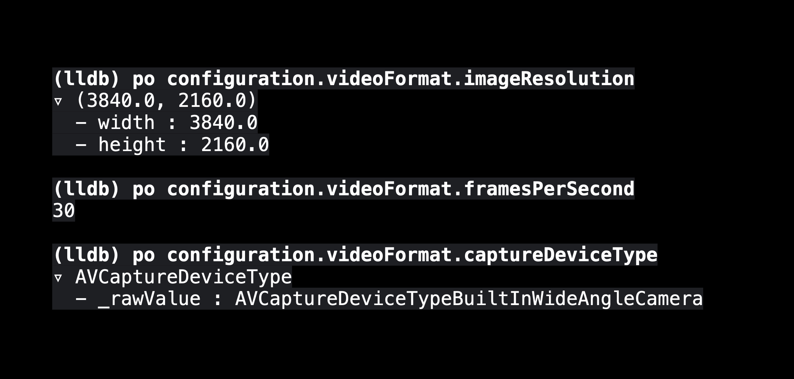

可以看到分辨率为3840x2160，帧率为30，另外captureDeviceType属性值为AVCaptureDeviceTypeBuiltInWideAngleCamera，这个在上面介绍过，表示广角镜头。这里的videoFormat内部持有了AVCaptureDeviceFormat和AVCaptureDevice类实例，关于镜头的很多信息都是从这两个类里获取的，比如上面的分辨率和帧率，如下：

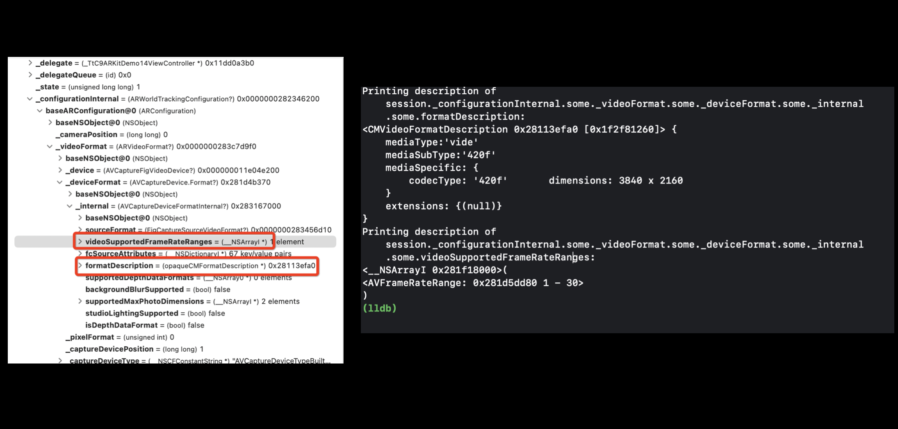

当然如果切换成非4K模式，那分辨率就会变成1920x1440，帧率为60。除了通过videoFormat查看当前分辨率以外，还可以通过session.currentFrame的capturedImage属性获取当前图像尺寸，可参考下方代码：

```swift
func session(_ session: ARSession, didUpdate frame: ARFrame) {
        
        print("W = \(CVPixelBufferGetWidth(frame.capturedImage))")
        print("H = \(CVPixelBufferGetHeight(frame.capturedImage))")
}

// 输出
W = 3840
H = 2160
```

4K模式目前适用iPhone11及以上版本，以及搭载M1芯片的iPad Pro设备。对于iPad设备，由于宽高比是16:9，所以必须裁剪图像后才能全屏显示，最终可能会感觉到图像被放大。

在4K模式下，官方给出了一些最佳实践的建议：

- 不要长时间持有frame，因为会影响到内存释放，进一步导致ARKit不会输出新的frame，最终会让ARCamera的跟踪状态切换到受限模式
- 需要考虑清楚4K分辨率是否是你的正确选择，因为帧率会降到30帧，而且在处理每一帧的图像时会占用更多的资源

### 2、Camera Enhancements

ARKit6第二个新特性是增加了一些与相机相关的API，从而可以更精细的控制相机。通过这些API，可以开启HDR模式增加图像的细节体现和动态范围，以及按需获取高分辨率背景图像，另外可以通过配置AVCaptureDevice来自定义设置相机，最后就是开放获取EXIF标签的接口。

#### （1）HDR模式

首先是支持HDR（High Dynamic Range Imaging，高动态范围成像）模式，开启HDR模式后，会感觉到更多明暗的细节差别，如下图所示：

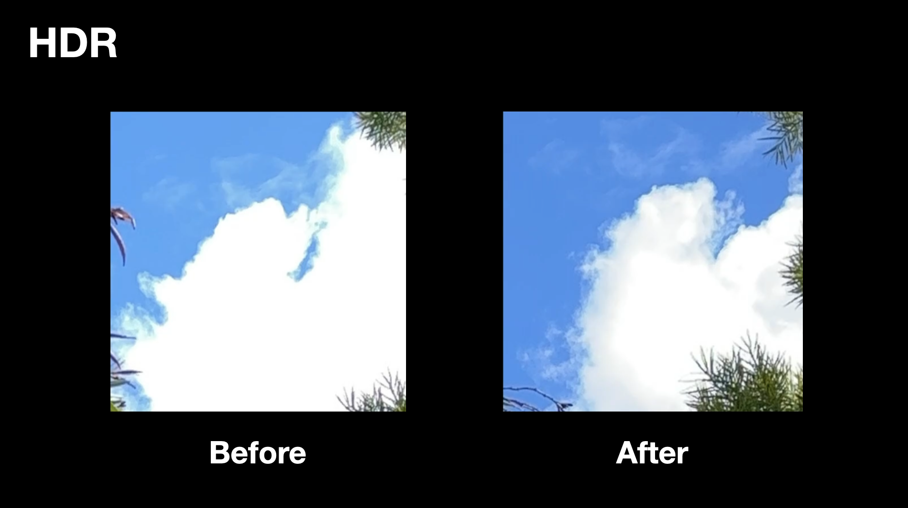

在开启之前需先判断下configuration.videoFormat是否支持，如果支持的话，直接设置configuration的videoHDRAllowed属性为true即可，代码如下：

```swift
if (configuration.videoFormat.isVideoHDRSupported){
  configuration.videoHDRAllowed = true
}

session.run(configuration)
```

因为目前只有不做binning操作（non-binned）的videoFormat才支持HDR，也就是说只有在4K模式下才支持开启HDR，正常模式下调用isVideoHDRSupported会返回false。另外开启HDR会有性能影响，所以要按需开启。

#### （2）高分辨率背景图像

其次是获取高分辨率图像，这里的高分辨率与广角相机的像素数有关，比如iPhone 13上，广角镜头是1200W像素，分辨率就是4032x3024，或者可以直接用系统相机拍个照片，然后看下照片的分辨率，其实也是4032x3024。

想要获取高分辨率图像，需要先判断当前设备是否支持，然后再设置configuration的videoFormat属性，注意这里获取的hiResCaptureVideoFormat分辨率是1920x1440，帧率是60。Session跑起来后，在正常跟踪期间，主动调用session的captureHighResolutionFrame方法，在回调中会返回frame，通过frame.captureImage就可以拿到生成的图像。代码如下：

```swift
if let hiResCaptureVideoFormat = ARWorldTrackingConfiguration.recommendedVideoFormatForHighResolutionFrameCapturing {
  configuration.videoFormat = hiResCaptureVideoFormat
}

session.run(hiResCaptureVideoFormat)

// 正常跟踪中....

session.captureHighResolutionFrame { frame, error in
  if let hiResFrame = frame{
   print("W = \(CVPixelBufferGetWidth(hiResFrame.capturedImage))")
      print("H = \(CVPixelBufferGetHeight(hiResFrame.capturedImage))")
    }
};

// 输出
W = 4032
H = 3024
```

可以看到最终输出的分辨率是4032x3024，正好符合广角镜头1200W像素。另外需要注意的是hiResFrame里面的capturedImage不包含虚拟元素，仅仅只是广角镜头捕捉的图像。

此外，通过ARWorldTrackingConfiguration类的supportedVideoFormats属性获取可支持的所有ARVideoFormat，然后打印每一个ARVideoFormat中的AVCaptureDeviceFormat属性信息（私有属性），如下图所示打印了iPhone11（iOS16）的信息：

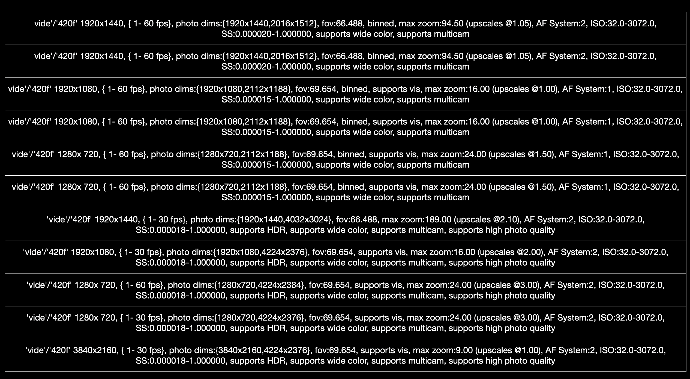

可以看到最后一条显示，分辨率为4K，帧率为30，可支持的最大分辨率为4224x2376，支持HDR，也就是说在4K模式下可以获取高分辨率图像以及开启HDR。

#### （3）配置AVCaptureDevice

除了可以支持HDR和获取高分辨率图像，还可以通过ARConfiguration获取到AVCaptureDevice。AVCaptureDevice是AVFoundation框架中与捕捉功能相关的类，可以理解为设备摄像头或麦克风等物理设备的上层封装类，其中定义了大量的控制方法用来配置摄像头的对焦、曝光、闪光灯或白平衡等。与之相关的还有AVCaptureSession、AVCaptureVideoPreviewLayer、AVCaptureOutput类，用一张图可以来表示它们之间的关系：

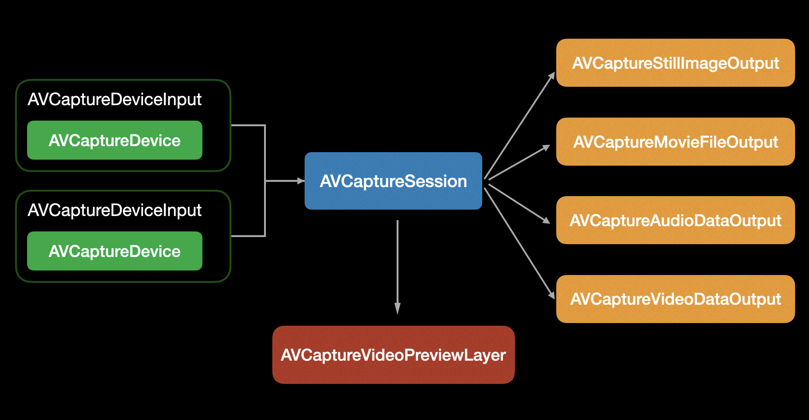

其中AVCaptureSession为核心类，用来连接输入和输出的资源，和ARKit中的ARSession类似。会话从物理设备（摄像头、麦克风、LiDAR）获取到数据流，然后输出到多种目的地。我们可以动态配置这条输入输出线路，其中AVCaptureDevice表示各种物理设备，AVCaptureVideoPreviewLayer表示预览层，AVCaptureOutput的各个子类表示输出的目的地，比如输出到照片和视频文件中，或者直接输出音视频数据。

所以，有了AVCaptureDevice类就可以控制摄像头的各种属性，而ARKit6允许我们通过ARConfiguration的configurationCaptureDeviceForPrimaryCamera方法获得AVCaptureDevice，取得AVCaptureDeviece实例后，就可以进行自定义设置了。如下方代码所示，点击屏幕后，会重新设置对焦和曝光，并设置一个坐标点让摄像头从中点位置开始扫描，还重新设置了白平衡，此外还打开了手电筒模式（虽然有点奇怪）。

```swift
override func touchesBegan(_ touches: Set<UITouch>, with event: UIEvent?) {
        
        if let captureDevice = ARWorldTrackingConfiguration.configurableCaptureDeviceForPrimaryCamera{
            
            let canResetExposure = captureDevice.isExposureModeSupported(AVCaptureDevice.ExposureMode.autoExpose) && captureDevice.isExposurePointOfInterestSupported
            let canResetFocus = captureDevice.isFocusModeSupported(AVCaptureDevice.FocusMode.autoFocus) && captureDevice.isFocusPointOfInterestSupported
            let canResetWhiteBalance = captureDevice.isWhiteBalanceModeSupported(AVCaptureDevice.WhiteBalanceMode.continuousAutoWhiteBalance)
            let canOpenTorch = captureDevice.isTorchModeSupported(AVCaptureDevice.TorchMode.on)
            let centerPoint = CGPointMake(0.5, 0.5)
            
            do{
                try captureDevice.lockForConfiguration()

                if canResetExposure {
                    captureDevice.exposureMode = AVCaptureDevice.ExposureMode.autoExpose
                    captureDevice.exposurePointOfInterest = centerPoint
                }

                if canResetFocus {
                    captureDevice.focusMode = AVCaptureDevice.FocusMode.autoFocus
                    captureDevice.focusPointOfInterest = centerPoint
                }

                if canResetWhiteBalance {
                    captureDevice.whiteBalanceMode = AVCaptureDevice.WhiteBalanceMode.continuousAutoWhiteBalance
                }
                
                if canOpenTorch {
                    captureDevice.torchMode = AVCaptureDevice.TorchMode.on
                }

                captureDevice.unlockForConfiguration()
            }catch{
                // error handling
            }
        }
    }
```

除此之外还可以配置闪光灯以及麦克风相关的配置，具体可查阅[AVCaptureDevice的文档](https://developer.apple.com/documentation/avfoundation/avcapturedevice)。

#### （4）EXIF标签

和相机相关的最后一个更新点就是可以读取EXIF标签，EXIF全拼是Exchangeable Image File，翻译过来是可交换图像文件，包含了数码相机照片的很多信息，比如白平衡、光圈、快门、日期等，更详细的可参考[exifTool站点](https://exiftool.org/TagNames/EXIF.html)。与图像相关的信息，都会保存在ARFrame中，所以直接调用frame.exifData就可以获取到一个字典，字典就包含了成对的信息。代码如下：

```swift
open class ARFrame : NSObject, NSCopying {

  ...

  /**
     A dictionary of EXIF metadata for the captured image.
     */
    @available(iOS 16.0, *)
    open var exifData: [String : Any] { get }

  ...
}
```

这里整理了下exifData中包含的信息，如下方表格所示，列出了Exif标准中定义的标签号和相应含义，以及从iPhone 11设备上获取到的值。

| 标签号 | Exif定义名 | 说明 | 设备中获取的值 |
| --- | --- | --- | --- |
| 0x9202 | ApertureValue | 光圈 | 1.6959938131099 |
| 0x9203 | BrightnessValue | 亮度值 | 4.547706126835637 |
| 0xa001 | ColorSpace | 色彩空间，0x1 = sRGB，0x2 = Adobe RGB，0xfffd =宽色域RGB，0xfffe = ICC配置文件，0xffff =未校准 | 1 |
| 0x9004 | DateTimeDigitized | 数字化时间，照片被写入时间 | 2022:06:22 17:20:06 |
| 0x9003 | DateTimeOriginal | 拍摄时间，照片拍摄时间 | 2022:06:22 17:20:06 |
| 0x9000 | ExifVersion | Exif版本 | 0232 |
| 0x9204 | ExposureBiasValue | 曝光补偿 | 0 |
| 0x829A | ExposureTime | 曝光时间、快门速度 | 0.01 |
| 0x829D | FNumber | 光圈系数、光圈F值 | 1.8 |
| 0x9209 | Flash | 闪光灯状态 | 0 |
| 0xa405 | FocalLenIn35mmFilm | 假设为35mm相机的等效焦距，也称FocalLengthIn35mmFormat | 27，27mm代表广角镜头，200mm代表长焦镜头 |
| 0x920A | FocalLength | 镜头焦距，镜头物理焦距 | 4.25 |
| 0x8827 | ISOSpeedRatings | ISO感光度 | （80） |
| 0xA433 | LensMake | 镜头生产商 | Apple |
| 0xA434 | LensModel | 镜头型号 | iPhone 11 back camera 4.25mm f/1.8 |
| 0xa432 | LensSpecification | 焦距和光圈范围的4个值，也称LensInfo | ("4.25","4.25","1.8","1.8) |
| 0x9207 | MeteringMode | 测光模式，平均测光、中央重点测光、点测光 | 5 |
| 0x9010 | OffsetTime | ModifyDate的时区 | +08:00 |
| 0x9012 | OffsetTimeDigitized | CreateData的时区 | +08:00 |
| 0x9011 | OffsetTimeOriginal | DateTimeOriginal的时区 | +08:00 |
| 0xa002 | PixelXDimension | X维度的像素 | 1920 |
| 0xa003 | PixelYDimension | Y维度的像素 | 1440 |
| 0xa301 | SceneType | 场景类型，1=直接拍照 | 1 |
| 0xa217 | SensingMethod | 感应方式，1 = Not defined，2 = One-chip color area，3 = Two-chip color area，4 = Three-chip color area，5 = Color sequential area，7 = Trilinear，8 = Color sequential linear | 2，1 =未定义，2 =单芯片彩色区域，3 =两芯片彩色区域，4 =三芯片彩色区域，5 =颜色顺序区域，7 =三线性，8 =颜色顺序线性 |
| 0x9201 | ShutterSpeedValue | 以秒为单位显示，但存储为 APEX 值 | 6.644866429928666 |
| 0x9292 | SubsecTimeDigitized | createData的秒数 | 735 |
| 0x9291 | SubsecTimeOriginal | dateTimeOriginal的秒数 | 735 |
| 0xa403 | WhiteBalance | 白平衡，0 = Auto，1 = Manual | 0 |

### 3、Plane Anchor

ARKit6第三个特性和平面锚点（Plane Anchor）相关，在iOS 15中，平面锚点会和平面几何方向一直保持一致。在ARSession开始运行后，如果检测到平面，会输出平面锚点，此时会根据平面锚点加入平面几何，之后每次平面几何更新时，锚点也会同时更新以与平面几何新方向保持一致。

而在iOS 16中，平面锚点和平面几何会完全分开，更新的时候也会通过ARPlaneAnchor的不同属性来体现。比如下图中右侧，当整个桌子进入视野时，平面正在扩展和更新其几何的大小，而anchor的Y轴保持不变。但是图中左侧，平面几何在更新的同时，anchor的Y轴也会跟着变化。

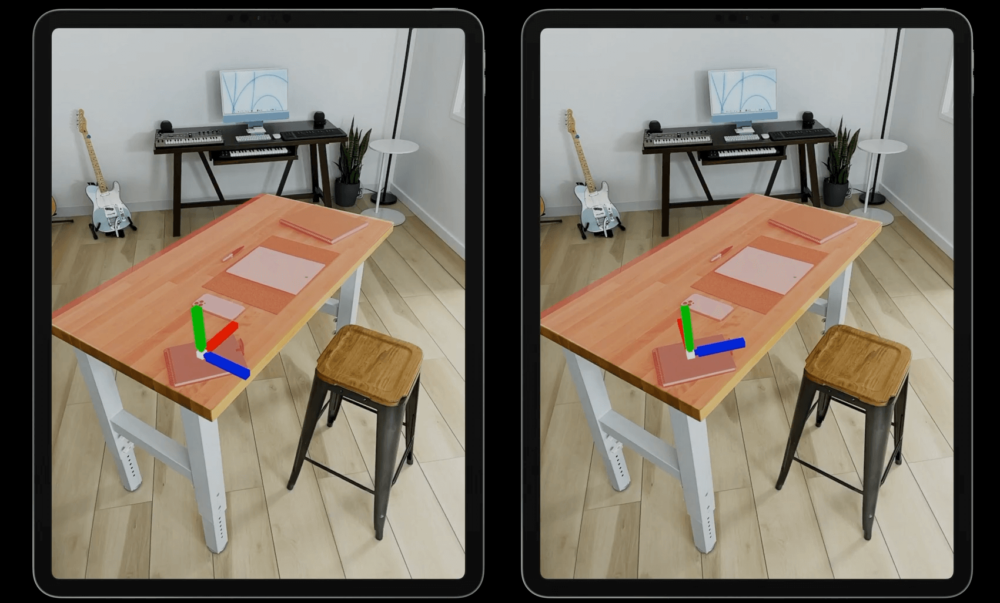

平面几何的信息之前可以从ARPlaneAnchor的extent获得，extent.x为宽，extent.z为高。而在iOS16中，信息会被包含在ARPlaneExtent类中，代码如下：

```swift
@available(iOS 16.0, *)
open class ARPlaneExtent : NSObject, NSSecureCoding {

    open var rotationOnYAxis: Float { get }
    open var width: Float { get }
    open var height: Float { get }
}
```

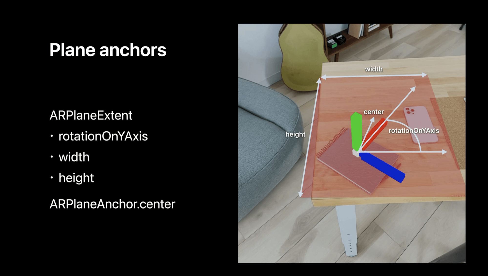

在上图中，width和height为平面几何的宽高，rotationOnYAxis为Y轴的旋转角度。在使用中，需要先根据宽高生成平面几何，然后根据Y轴旋转角度设置变换方向，并根据center属性值来更新位置，每次更新平面时，都需要考虑到width、height、rotationOnYAxis以及center值可能会改变。这里列举了使用RealityKit或者SceneKit框架的伪代码：

```swift
// MARK: - Reality
// 新建模型，使用planeExtent的大小
let planeEntity = ModelEntity(
 mesh: .generatePlane (
  width: planeExtent.width
  depth: planeExtent.height),
 materials: [material])
 )
)
// 使用planeExtent中保存的Y轴旋转角度对模型做变换
planeEntity.transform = Transform(
 pitch: 0,
 yaw: planeExtent.rotationOnYAxis,
 roll: 0)
)
// 模型放在平面上居中的位置
planeEntity.transform.translation = planeAnchor.center

-------------------------

// MARK: - SceneKit
let node = childNodes.firstObject
let planeGeometry = node.geometry
// 更新平面几何的范围大小
planeGeometry.width = planeAnchor.planeExtent.width
planeGeometry.height = planeAnchor.planeExtent.height
// 更新平面几何的位置，以及做Y轴上的变换
node.position = SCNVector3Make(planeAnchor.center.x, 0, planeAnchor.center.z)
node.transform = SCNMatrix4MakeRotation(planerAnchor.planeExtent.rotationOnYAxis, 0.0, 1.0, 0.0))
```

### 4、Motion Capture

ARKit更新的第四个特性是对Motion Capture进行了改进，这部分内容不多，基本都是对现有功能的优化。其中在对人体的2D骨骼检测中，新增加了左耳、右耳两个新的关节点，并且还改进了人体姿态检测，如下图所示：

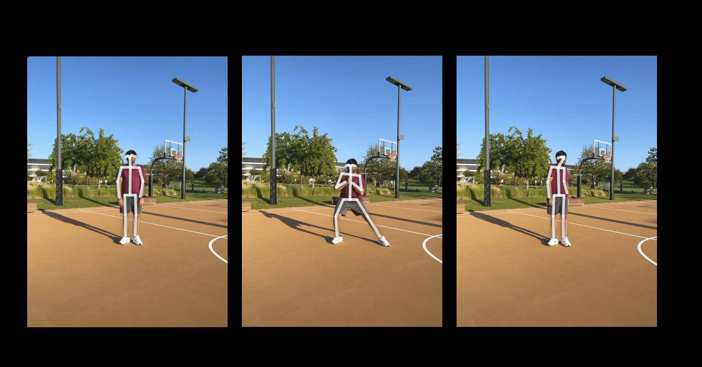

在对人体的3D骨骼检测中，会减少抖动，另外如果人体部分被遮挡或者靠近镜头时，跟踪会更加稳定，如下图所示。这部分优化只会在iPhone12及更高版本，以及搭载了M1芯片的iPad Pro和iPad Air机型上体现。

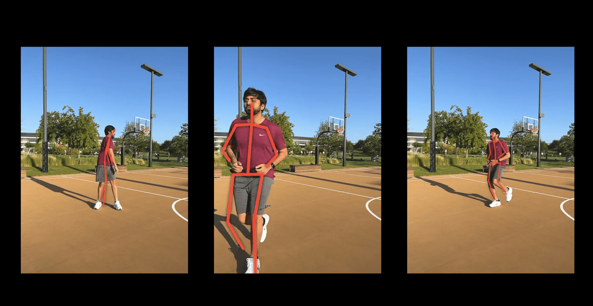

### 5、Location Anchor

ARKit6最后一个特性是Location Anchor支持了更多的城市和国家，比如加拿大的温哥华、多伦多和蒙特利尔等城市，新加坡和日本的七大都市区，以及澳大利亚的墨尔本和悉尼。在今年稍晚些时候，会支持到新西兰奥克兰、以色列特拉维夫和法国巴黎。如果想判断所在地是否支持LocationAnchor，可以使用ARGeoTrackingConfiguration的checkAvailability方法判断。不过对于国内，还暂时没有时间线。

最后说一个有趣的使用场景，Apple Maps使用Location Anchor API为行人的步行做向导，从下图可以看到，界面上的元素会引导用户穿过街道。期待国内也能早日使用上这些功能。

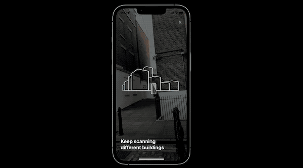

## 二、ARKit

在WWDC2017大会上，苹果发布了自家生态系统中第一个提供AR能力的SDK：ARKit，并且还支持Unity和Unreal。在这之前如果想要在iPhone上开发AR相关功能，就需要使用第三方套件，比如Vuforia、EasyAR等。在大会第二年，谷歌在Google I/O大会上发布了ARCore，对标ARKit，这样两大系统都具备了原生AR能力。

一个典型的AR系统结构大致可分为真实世界、虚拟场景、I/O设备，真实世界包括跟踪、定位、显示设备，虚拟场景包括建模、绘制、融合，最后就是借助I/O设备来交互。整体处理过程基本可分为：

- 1、跟踪、定位等设备来实时提供各自相应的数据信息
- 2、然后处理单元分析、估算，并融合这些数据
- 3、数据信息处理完毕后，会在这些信息的基础上对虚拟场景建模，并融合真实场景，最后绘制渲染到显示器上
- 4、在这个过程中，I/O设备会和整个系统产生各种交互

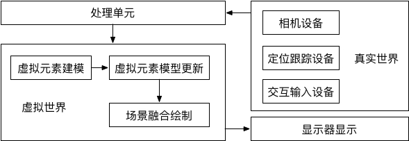

用图来大致表示就是上面这样，需要注意的是其中相机和IMU的数据对于定位跟踪来讲没有先后之分，而是同时使用两者的数据，这项技术称为SLAM（Simultaneous Localization and Mapping，即时定位与地图构建）。

ARKit的结构图也类似于这样，如图所示，大致描述了ARKit的处理逻辑：

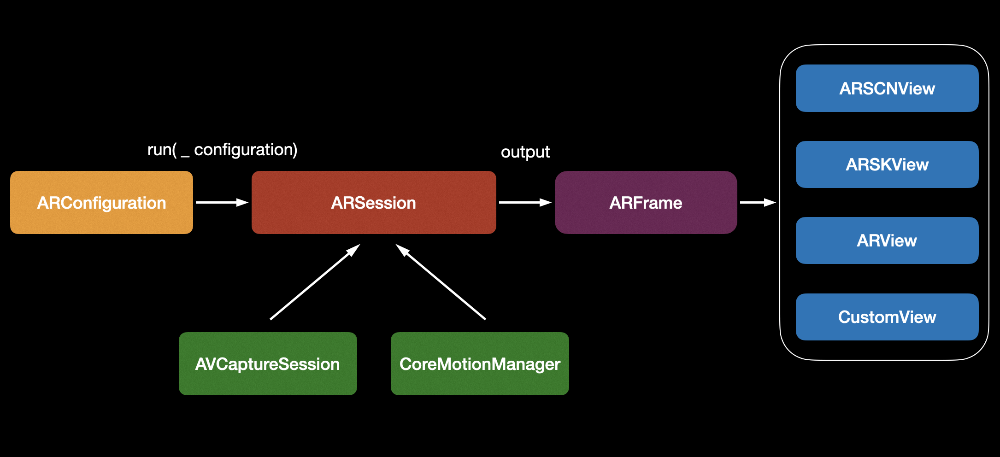

- ARSession为核心类，负责控制整个过程，大致可分为 数据融合 和 图像分析
- ARConfiguration在新建ARSession对象时用来做各种配置
- AVCaptureSession 和 CMMotionManager 负责给ARSession提供实时数据
- ARSession拿到实时数据后进行处理并输出ARFrame，这里面包含了图像、锚点、点云、照明、设备位姿等信息
- 最后依据ARFrame，使用SceneKit、SpriteKit、Metal等图形渲染框架进行渲染绘制

从2017年至今，ARKit已经发布了6个版本，增加了很多特性和优化点，比如通过新增的ARWorldMap和会话协作能力可以让多人同时在当前场景里玩游戏，通过新搭载的LiDAR传感器就可以获取到场景更精准的深度数据。如下图所示列出了各个版本增加的新特性：

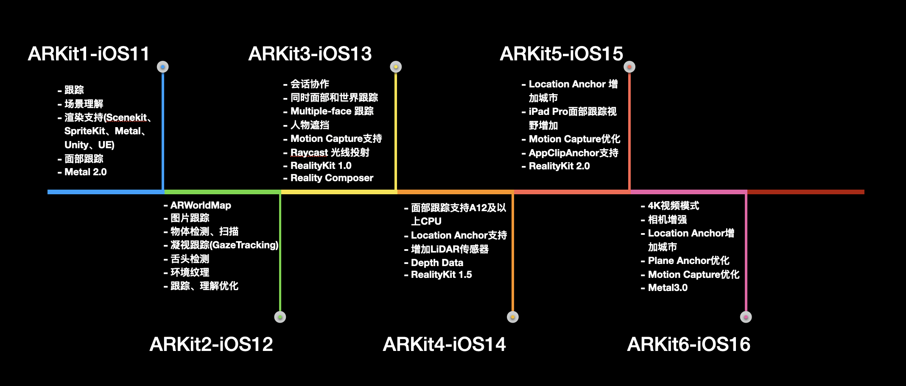

接下来，我们分别从跟踪、理解、渲染三个角度来看ARKit每个版本新增的内容。

### 1、跟踪

ARKit使用一种叫做VIO（Visual Inertial Odometry，视觉惯性里程计）的技术来实时跟踪设备的方向和位置信息。

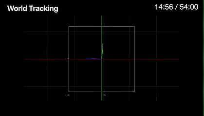

VIO是以设备初始位置为原点，结合惯性传感器（IMU）数据和摄像头图像数据，过程中会识别图像中的特征点，跟踪特征点在各个图像帧中的位置变化，并将这些信息与IMU数据进行比较，从而得到设备的位置和方向信息。这样就可以在不需要知道外部环境状态，且不需要给手机设备增加额外传感器的情况下，快速而准确的跟踪设备变化。在ARKit中，我们称这个过程为世界跟踪（World Tracking），世界跟踪是AR所有功能的基础。

另一方面，得益于从2017年开始在设备上搭载的原深感摄像头（TrueDepth Camera System），ARKit增加了面部识别和跟踪的能力。这个TrueDepth Camera包括了红外镜头、泛光感应元件、距离感应器、环境光传感器、扬声器、麦克风、700万像素摄像头、点阵投影器。

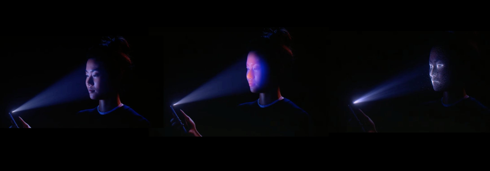

ARKit正常运行时，点阵投影器会将3W多个肉眼不可见的光点投影在用户面部，然后红外镜头会读取投影的点阵图案，捕捉面部的红外图像，泛光感应元件会在弱光条件下帮助进行识别。结合原深感摄像头，ARKit可以实时跟踪面部状态，并以60Hz的频率输出面部的位置、拓扑和表情信息。

除了可以跟踪面部信息和设备位姿信息，截止到ARKit6，还增加了很多种跟踪类型，所有的跟踪类型都是ARConfiguration的子类，下图中列出了各个跟踪类型发布的版本以及系统要求：

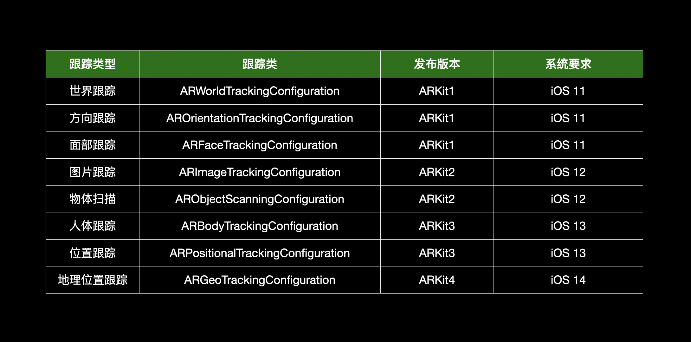

#### （1）世界跟踪

世界跟踪是在ARKit1发布的，可以支持6DOF，另外还有个配置类AROrientationTrackingConfiguration，只能支持到3DOF。如果要使用的话，需要先判断设备是否支持，再创建ARWorldTrackingConfiguration或AROrientationTrackingConfiguration实例，然后再去配置ARSession实例并Run起来，代码如下：

```swift
if ARWorldTrackingConfiguration.isSupported{
 let session = ARSession()
 session.delegate = self
      
 let configuration = ARWorldTrackingConfiguration()
 configuration.planeDetection = .horizontal
            
 session.run(configuration)
}
```

ARSession实例跑起来以后，就开始初始化并跟踪设备在世界坐标系下的变化，设备的方向和位置信息会保存在ARFrame中的ARCamera中，整体处理过程如下图所示，图中除了ARCamera以外的信息是场景理解的结果。

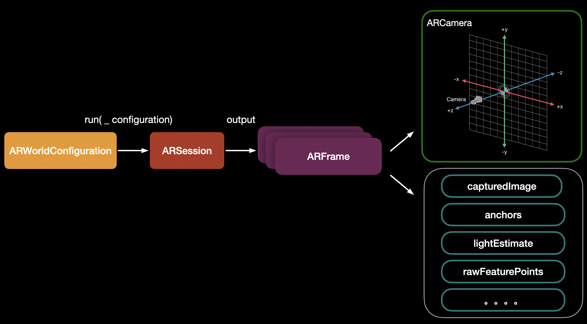

有了设备位姿信息和场景信息，就可以做很多自定义操作了，比如放置模型。如果可以把当前的位姿和场景信息保存下来，以后自己或者别人进入当前场景中，就可以通过这些信息来恢复上次的互动体验，比如可以看到上次放置在场景中的虚拟模型。有个有趣的场景就是你通过ARKit在当前房间中布置了很多家具，然后分享给别人，这样别人进入场景中就可以看到你的布置方案。

通过在ARKit2中增加的ARWorldMap就可以实现这样的操作，ARWorldMap保存了位姿信息、点云以及场景中的所有锚点，然后提供了保存、分享、加载Map的操作。如下图所示，展示了ARWorldMap中保存的内容：

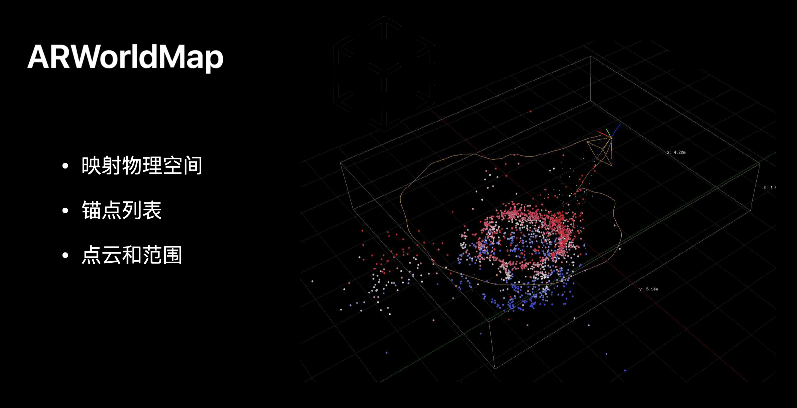

如果要使用ARWorldMap，需要先调用当前ARSession的接口获取Map，然后序列化保存起来。在下次开启世界跟踪时，如果要加载Map，可以设置ARWorldTrackingConfiguration实例的initialWorldMap属性。当然如果只使用位置，不使用原来方向的话也可以使用ARPositionalTrackingConfiguration配置类，代码如下所示：

```swift
// 获取Map
session.getCurrentWorldMap { worldMap, error in
 guard let worldMap = worldMap else 
 {
  showAlert(error)return
 }
}

// 加载Map
let configuration = ARWorldTrackingConfiguration()
// 只跟踪设备位置，不跟踪方向
// let configuration = ARPositionalTrackingCOnfiguration()
configuration.initialWorldMap = worldMap
session.run(configuration)
```

ARKit2不光增加了ARWorldMap，还对世界跟踪和场景理解做了多项优化，如下：

- 更快的初始化和平面检测的速度
- 更健壮的跟踪和平面检测能力
- 检测到的平面具备更精确的范围和边界
- 连续对焦
- 增加了4：3视频格式

ARWorldMap为AR多人交互的场景提供了良好的基础，加上在ARKit3中增加的会话协作（Collaborative Sessions）的能力，会极大的提升多人协作交互的体验和方式。通过Session之间的协作，ARKit会实时给每一个在协作过程中的参与者共享Map信息，其中包含了各参与者的ARAnchor。就像下方示意图中，展示的虚拟模型不仅包含了自己创建的，还包含了其他参与者创建的，这样ARAnchors就会在参与协作的所有设备上共享和识别。

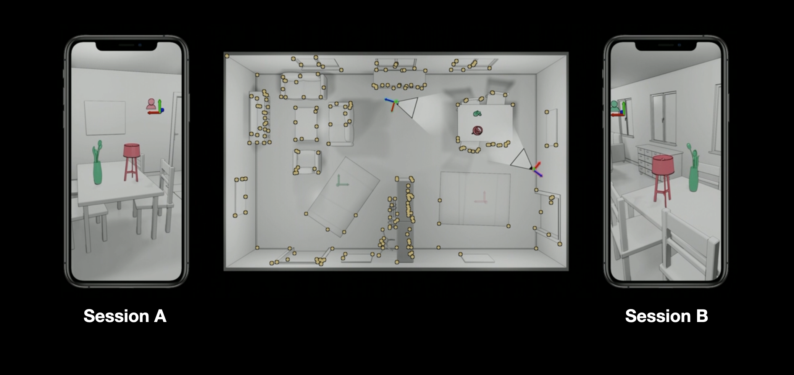

通过设置ARWordTrackingConfiguration的collaborationEnabled属性就可以开启会话协作模式，开启后在ARSession的delegate方法 session:didOutputCollaborationData: 中就可以获取到其他参与者更新的ARCollaborationData，然后调用ARSession的 updateWithCollaborationData: 方法更新当前的session。代码如下：

```swift
// 设置多人连接
setupMultipeerConnectivity()

// 创建配置并开启协作
let configuration = ARWorldTrackingConfiguration()
configuration.isCollaborationEnabled = true
session.run(configuration)


override func session(_ session: ARSession, didOutputCollaborationData data:ARSession.CollaborationData) 
{
 // 将协作数据发送给参与者
 mcSession.send(data, toPeers: participantIds, with: .reliable)
}

func session(_ session: MCSession, didReceive data: Data, fromPeer peerID: MCPeerID) 
{
 // 使用从其他参与者那里收到的协作数据更新session
 let collaborationData = ARSession.CollaborationData(data)
 session.update(from: collaborationData)
}
```

#### （2）面部跟踪

借助于从iPhone X开始搭载的原深感摄像头（TrueDepth Camera），ARKit1增加了面部跟踪的能力。ARConfiguration的子类ARFaceTrackingConfiguration提供了进行面部跟踪的配置信息，创建ARFaceTrackingConfiguration实例并配置ARSession，正常运行后session就会以60Hz的频率跟踪面部的方向、位置和表情信息。代码如下：

```swift
if ARFaceTrackingConfiguration.isSupported{

 let faceTrackingConfig = ARFaceTrackingConfiguration()
 session.run(faceTrackingConfig)
}
```

检测到的面部会以ARFaceAnchor的形式输出，ARFaceAnchor中包含了ARFaceGeometry（面部三角网格）和ARBlendShapeLocation，其中ARBlendShapeLocation属性包含了一组面部特征点（51个），把这组面部特征点映射到虚拟卡通角色模型，就可以实现Animoji的效果，如下图所示：

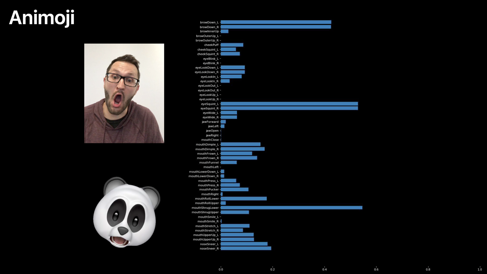

在ARKit2中对面部的检测和跟踪做了优化，并且增加了凝视跟踪（Gaze Tracking）和舌头检测的特性。如下图所示，凝视跟踪是指对面部左右眼球中心方向进行跟踪，并且还对左右眼球凝视方向的交汇点进行估算，ARFaceAnchor中的leftEyeTransform、rightEyeTransform属性表示了左右眼球中心位置，lookAtPoint属性表示交汇点位置。舌头检测是指一种ARBlendShapeLocation状态，代表舌头是否伸出，因为增加了这个特征点，所以ARFaceAnchor中包含的面部特征点变为52个。

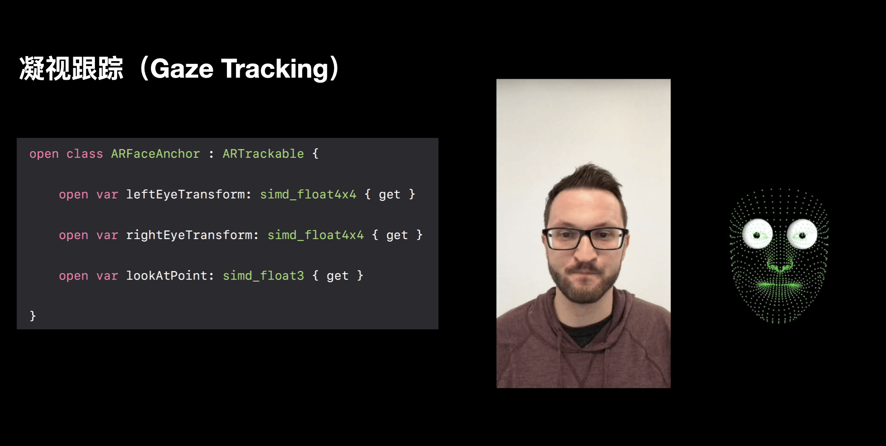

因为原深感摄像头（TrueDepth Camera）是前置的，所以在对面部进行跟踪的时候，后置摄像头是不开启的，而且此时不会进行世界跟踪。在ARKit3中，这种情况得到了改善，可以同时开启前置和后置摄像头来进行世界跟踪和面部跟踪。可以想象到的一种场景就是，把自己脸部信息做成Animoji表情，然后映射到场景中的虚拟人物模型上。设置ARWorldTrackingConfiguration的userFaceTrackingEnabled属性，或者设置ARFaceTrackingConfiguration的isWorldTrackingEnabled属性，就可以同时开启世界跟踪和面部跟踪。

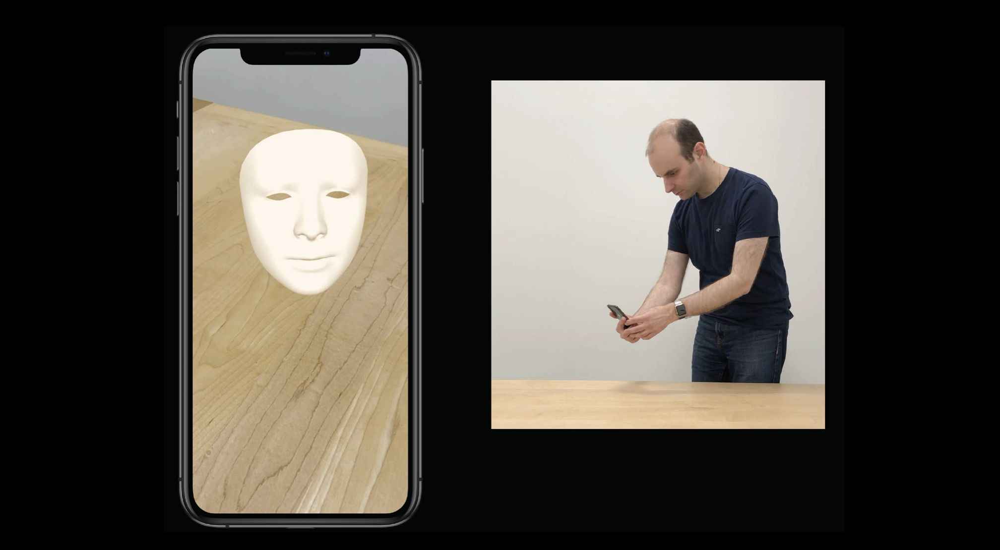

另外在ARKit3中，可以做到同时跟踪多张人脸（Multiple-face Tracking），通过设置ARFaceTrackingConfiguration的maximumNumberOfTrackedFaces属性，就可以设置可同时跟踪人脸的最大数量。当然这个数量是有上限的，通过调用ARFaceTrackingConfiguration的supportedNumberOfTrackedFaces属性就可以获取到当前设备可以支持的识别数量上限。代码如下：

```swift
open class ARFaceTrackingConfiguration: ARConfiguration{

 open class var supportedNumberOfTrackedFaces: Int { get }

 open var maximumNumberOfTrackedFaces: Int
}
```

在ARKit4中，面部跟踪增加了对更多设备的支持。前面讲到面部跟踪是依赖原深感摄像头（TrueDepth Camera），也就是说如果没有搭载原深感摄像头的设备也就无法使用。但现在只要是A12及以上处理器都可以支持，到那时不包含深度数据。

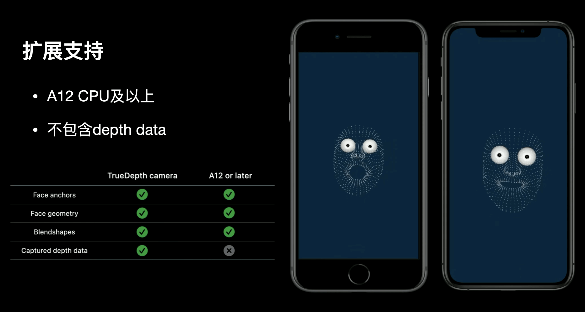

在2021年上半年推出了新的iPad Pro，它搭载的原深感摄像头（TrueDepth Camera）中包含了一颗1200W像素的超广角镜头，这样的话就可以拥有更大的视野。比如下图中左右的对比，明显在进行面部跟踪时，右侧的视野要比左侧大的多。

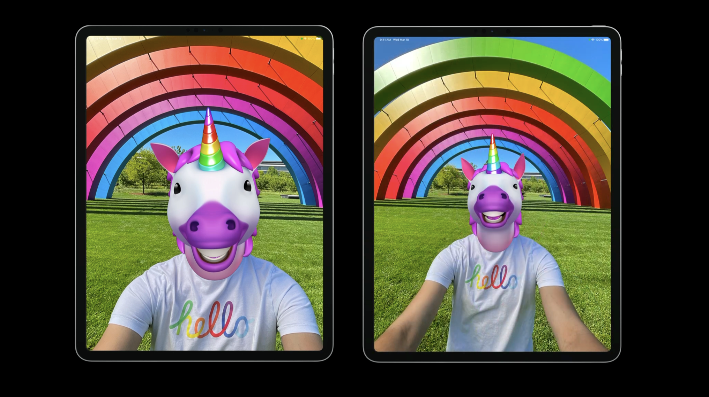

所以在ARKit5中增加了超广角格式（ultra-wide video format），在使用的时候，需要先检查当前可用的视频格式是否支持，可以通过遍历videoFormat的captureDeviceType属性是否为builtInUltraWideCamera来进行判断，代码如下：

```swift
let config = ARFaceTrackingConfiguration()
for videoFormat in ARFaceTrackingConfiguration.supportedVideoFormats{
 if video.format.captureDeviceType == .builtInUltraWideCamera{
  config.videoFormat = videoFormat
  break
 }
}
session.run(config)
```

#### （3）图像跟踪

在ARKit1发布以后，更新了一个小版本（iOS11.3），增加了静止图像检测的能力。通过设置ARWorldTrackingConfiguration实例中的detectionImages属性，就可以预设一组需要检测的图像。开启世界跟踪后，就会自动进行图像检测，并且在检测时会参考预设图像，检测结果会以ARImageAnchor的形式输出。如下方代码所示：

```swift
// 创建配置类实例
let configuration = ARWorldTrackingConfiguration()
// 预设参考图片
configuration.detectionImages = [image1, image2, image3]

session.run(configuration)
```

ARKit2在检测静止图片的基础上增加了图片跟踪（Image Tracking）的能力，也就是说可以跟踪动态的图像，每一帧都包含了图像的位置和方向。另外还可以通过新增加的ARImageTrackingConfiguration类单独进行图像跟踪，会以60Hz的频率来估算图片的位置和方向。整体处理过程如下：

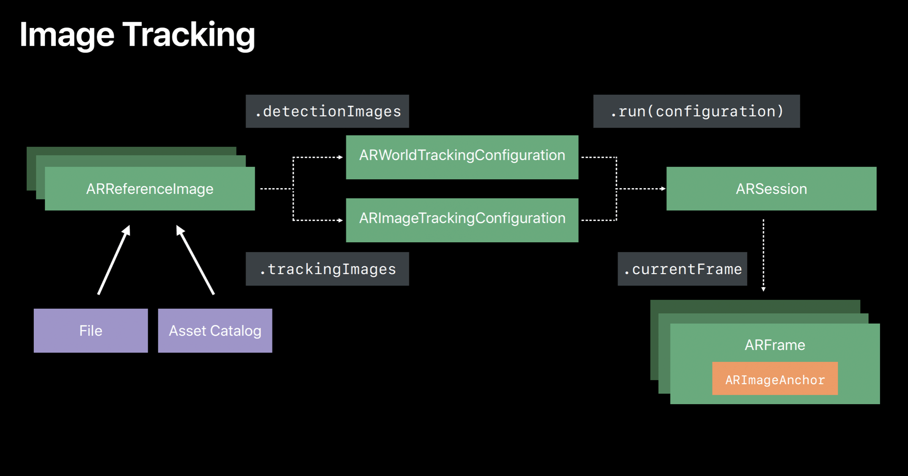

要进行图像跟踪，需要先创建ARImageTrackingConfiguration实例，然后预设需要检测跟踪的图片，再去配置ARSession，最后通过session的delegate方法获取ARImageAnchor，ARImageAnchor中就包含了图片跟踪信息。代码如下所示：

```swift
// 创建图片跟踪配置类
let configuration = ARImageTrackingConfiguration()
// 预设参考图片
configuration.trackingImages = [catPhoto, dogPhoto, birdPhoto]
// 设置可同时跟踪的最大数量
configuration.maximumNumberOfTrackedImages = 2
// 配置session
session.run(configuration)


// ARImageAnchor的属性
open class ARImageAnchor: ARAnchor, ARTrackable{

 public var isTracked: Bool { get }
 open var transform: simd_float4x4 { get }
 open var referenceImage: ARReferenceImage { get }
}
```

#### （4）物体扫描和检测

物体检测（Object Detection）是在ARKit2中发布的，它包含了检测和扫描两部分。检测是指在世界跟踪过程中，对照预先设置的参照对象，去检测相匹配的实际物体，如果检测到就会输出锚点（ARObjectAnchor），预设的参考对象可以通过对实际物体进行扫描得到。

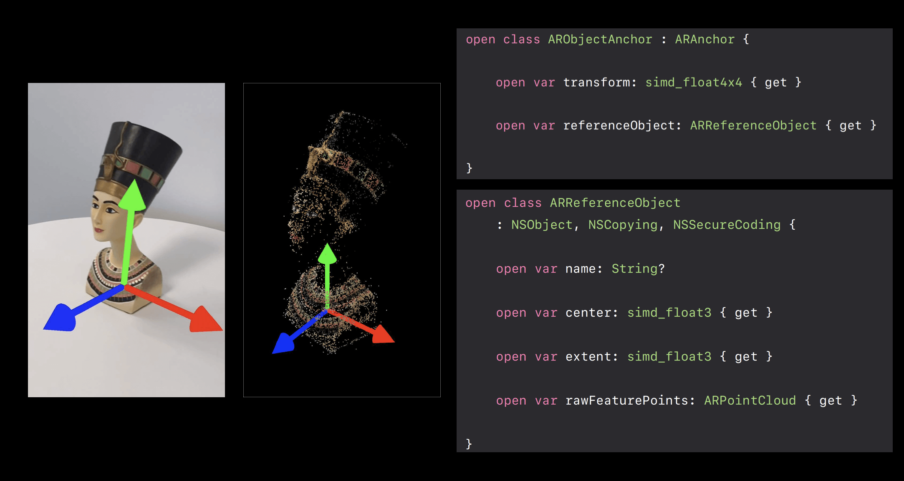

首先来看如何扫描，使用ARConfiguration的子类ARObjectScanningConfiguration配置ARSession就可以进行扫描，扫描完成后再生成参考对象ARReferenceObject。注意这里的ARReferenceObject仅包含检测到的空间特征点信息，不是实际物体的三维重建。代码如下：

```swift
// 初始化
let configuration = ARObjectScanningConfiguration()
configuration.planeDetection = .horizontal
sceneView.session.run(configuration, options: .resetTracking)


// 收集到足够多的特征点

// 创建参考对象
sceneView.session.createReferenceObject(
    transform: boundingBox.simdWorldTransform,
    center: float3(), extent: boundingBox.extent,
    completionHandler: { object, error in

  if let referenceObject = object {
    // 做其它操作
  }
})
```

在扫描的过程中，需要收集到足够多的特征点，这样才能保证检测的准确性。所以在扫描过程中应当引导用户从各个角度来扫描物体。官方给出了一个参考的扫描步骤，首先选定要扫描的物体，然后使用线框定义好物体的边界，接着开始扫描，扫描的时候要从不同的角度识别对象，扫描完成后，调整原点，完毕后可以导出（.arobject文件），或者测试是否可以正常识别，整体过程如下图所示：

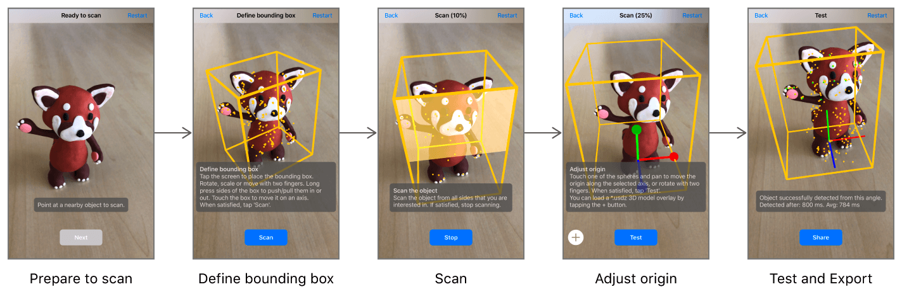

有了ARReferenceObject，我们就可以检测匹配了。此时可以使用ARWorldTrackingConfiguration，然后设置detectionObjects属性，配置好ARSession就可以进行检测，如果检测到会以ARObjectAnchor的形式输出，代码如下：

```swift
let configuration = ARWorldTrackingConfiguration()
configuration.detectionObjects = [referenceObject1, referenceObject2]
self.sceneView.session.run(configuration)


func renderer(_ renderer: SCNSceneRenderer, didAdd node: SCNNode, for anchor: ARAnchor) {
 if let objectAnchor = anchor as? ARObjectAnchor {

  // do something
  }
}
```

#### （5）人体跟踪

动作捕捉（Motion Capture）是ARKit3中新增的能力，依赖于机器学习，可以在capturedImage中识别人体骨骼结构，会跟踪人体2D和3D骨骼信息。通过设置ARWorldTrackingConfiguration的frameSemantics属性为ARFrameSemanticBodyDetection，然后运行ARSession就可以在输出的ARFrame中找到ARBody2D实例，其中包含了2D骨骼信息。

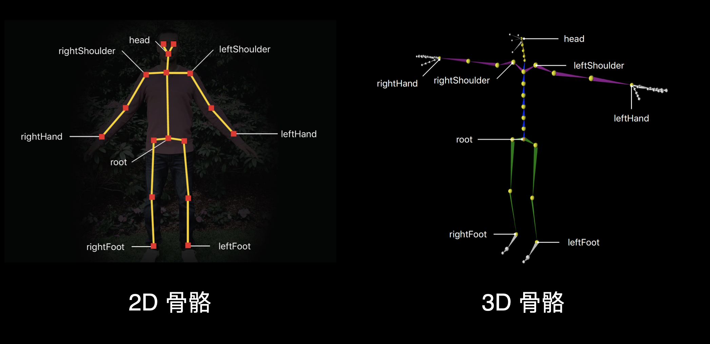

如果要跟踪人体3D骨骼的话，可以使用ARBodyTrackingConfiguration来配置ARSession，然后从输出的ARAnchor数组中就可以找到ARBodyAnchor，而ARBodyAnchor中就包含了ARSkeletion3D，以及相应的transfrom和估算的scale factor。另外还可以通过AnchorEntity和BodyTrackedEntity来驱动3D骨骼模型。

在ARKit5中，对动作捕捉进行了优化，在iPhone12等配备A14 CPU的设备上可以支持更广泛的身体姿势，而且对于开发者来说，无需改动任何代码即可支持。如下面动画所示，旋转动作比之前识别更为准确，对肢体动作、以及大范围活动时的跟踪也更加稳定，另外还可以在更远的距离去跟踪骨骼信息。

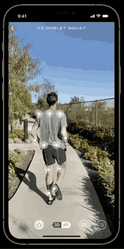

在今年发布的ARKit6中，也优化了动作捕捉时的表现，减少抖动，以及遮挡或靠近镜头时识别会更稳定些，而且还增加了对左耳和右耳两个关节点的识别跟踪。

#### （6）地理位置跟踪

地理位置跟踪功能是在ARKit4发布的，这里的位置是指全球范围内的任意坐标点，用户通过这个功能可以在任意坐标点上放置虚拟元素，当别人打开AR应用走到放置的区域时，就可以加载出预先放置的虚拟元素。这种方式可以将AR交互从室内搬到室外，增加了更多互动场景的落地。

地理位置跟踪的使用分为三步：

（1）使用ARGeoTrackingConfiguration来检查设备是否支持地理位置跟踪，如果支持则运行session

```swift
guard ARGeoTrackingConfiguration.isSupported else{ 
 return
}

ARGeoTrackingConfiguration.checkAvailability{(available, error) in
 guard available else{
  return
 }
 let arView = ARView()
 arView.session.run(ARGeoTrackingConfiguration())
}
```

（2）添加位置锚点（ARGeoAnchor）

```swift
let coordinate = CLLocationCoordinate2D(latitude:12.1212, longitude:34.3434)
// 使用经纬度来创建一个ARGeoAnchor
let genAnchor = ARGeoAnchor(name: "Ferry Building", coordinate: coordinate)
arView.session.add(anchor:genAnchor)
```

（3）实时监听地理跟踪状态，ARGeoTrackingStatus内部有地理位置跟踪的状态信息，其中.state属性表示状态，.stateReason属性是对状态的描述信息。通过ARSession的delegate方法就可以拿到实时的状态

```swift
func session(_ session: ARSession, 
didChange geoTrackingStatus: ARGeoTrackingStatus) {

 // 使用geoTrackingStatus来判断状态
}
```

通过上面三步然后结合geoAnchor就可以在当前场景中添加虚拟模型，就像下方图中的虚拟人物模型，当然也可以通过操作虚拟模型放置在场景的其它地方，或者添加更多交互行为。

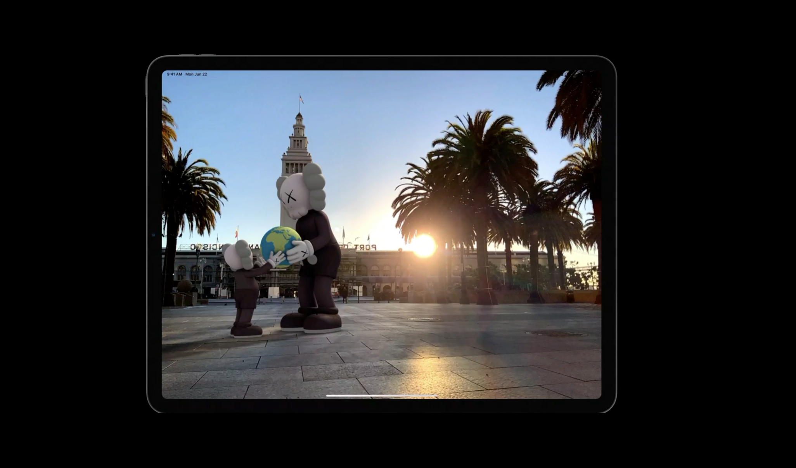

在场景中添加完虚拟模型后，再次进入该场景，比如走到这个建筑物前或者街道旁，ARKit通过当前坐标点，以及场景的特征点就可以识别出之前有在该场景中放置过虚拟元素，然后显示出来。

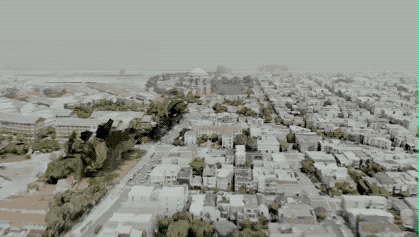

在ARKit5中，结合苹果地图，地理位置跟踪增加了路线规划（turn-by-turn）的功能，如下方动画所示，移动手机，定位到当前位置并扫描街道和建筑后，就开始在图中显示路线引导标志。

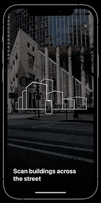

在开发location anchor相关的功能时，如果一直在实际场景中编码调试，就不太方便。所以ARKit提供了recording和replay方法来解决这类问题，recoding是提前把调试的场景录制下来，replay是在调试的时候可以重播录制的场景。

另外在ARKit5和ARKit6中，Location Anchor支持了更多的城市。

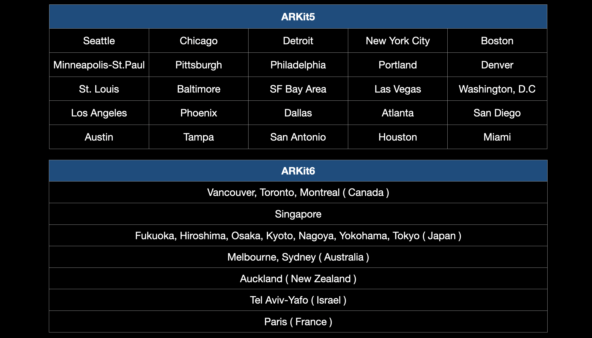

### 2、理解

在前面的内容中，我们讲过使用ARWorldTrackingConfiguration来配置ARSession类，就可以实时捕捉设备的位姿信息。解决了跟踪问题，还需要知道设备所在环境的信息，比如光照、纹理、平面、人体、图片等，基于这些信息就可以对虚拟元素建模和渲染了。

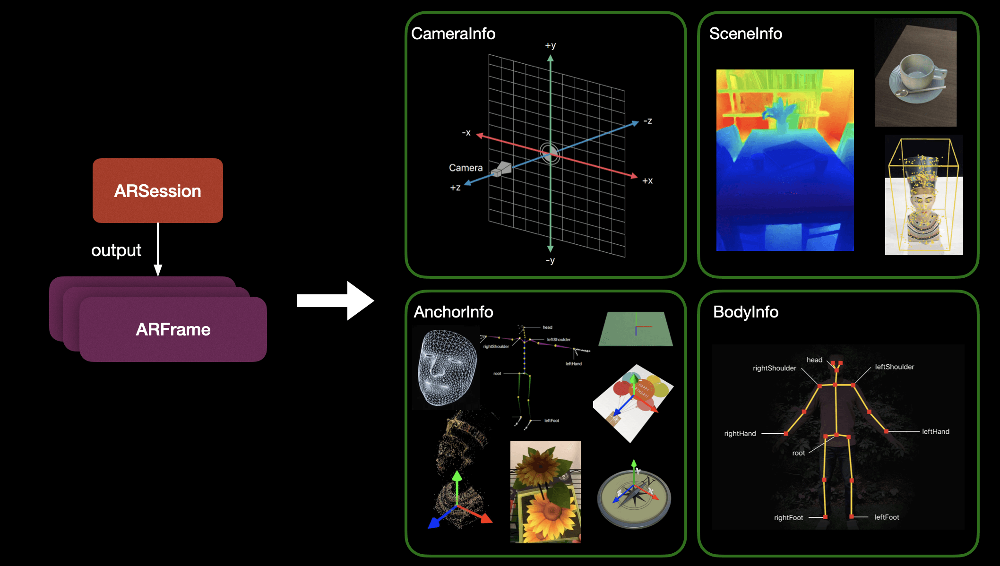

如上图中所示，会把环境信息分为四类：

- 相机信息，包含设备相机EXIF标签、位姿、背景图像等
- 场景信息，包含光照、环境特征点等
- 识别跟踪信息，在各种跟踪类型配置下，识别出来的平面、图片、物体、面部等锚点
- 人体信息，包含2D骨骼信息

在接下来的篇幅中会分别介绍每类信息所包含的详细内容。

#### （1）相机信息

```swift
// frame时间戳
open var timestamp: TimeInterval { get }
// 相机EXIF标签信息
@available(iOS 16.0, *)
open var exifData: [String : Any] { get }
// 相机纹理
@available(iOS 13.0, *)
open var cameraGrainTexture: MTLTexture? { get }
// 相机颗粒强度
@available(iOS 13.0, *)
open var cameraGrainIntensity: Float { get }
// 背景图像
open var capturedImage: CVPixelBuffer { get }
// 相机
@property (nonatomic, readonly) ARCamera *camera;
```

相机信息是世界跟踪的结果，属于基础信息，比如timestamp、capturedImage。需要注意的是exifData是在ARKit6添加的新属性，代表相机exif标签，标签中详细内容可参考前面ARKit6的内容介绍。代码中的cameraGrainTexture和cameraGrainIntensity属性为相机颗粒强度和相机纹理，最后的camera属性代表世界坐标系下的相机，其中包含了自身的位置、方向（欧拉角定义），还有投影矩阵、变换矩阵、捕捉图像分辨率。

#### （2）场景信息

```swift
// 光照
open var lightEstimate: ARLightEstimate? { get }
// 点云
open var rawFeaturePoints: ARPointCloud? { get }
// 捕捉到的深度信息
open var capturedDepthData: AVDepthData? { get }
// 捕捉到的深度信息的时间戳
open var capturedDepthDataTimestamp: TimeInterval { get }
// 场景深度数据
@available(iOS 14.0, *)
open var sceneDepth: ARDepthData? { get }
// 优化后的场景深度数据
@available(iOS 14.0, *)
open var smoothedSceneDepth: ARDepthData? { get }
```

场景信息是对capturedImage进行一系列分析处理后，生成的与当前环境相关的信息，lightEstimate表示环境光照条件，rawFeaturePoints为点云，也就是特征点，前面Object Scan的结果就是一组特征点。capturedDepthData和capturedDepthDataTimestamp分别是通过capturedImage识别到的图像深度信息和相应的时间戳，会以15Hz的频率更新。

最后的sceneDepth和smoothedSceneDepth属性表示场景深度信息，依赖于LiDAR传感器。由于是在2020年发布的iPhone 12 Pro设备上才开始搭载LiDAR传感器，所以只能在iOS14及以上系统调用。ARDepthData可以比之前更精确的预估环境深度数据，而且还增加了场景几何（Scene geometry），可以提供周围环境的拓扑图，同时还提供了对深度数据（ARDepthData）访问的API。

ARDepthData并没有用矩阵数据的形式来表示深度信息，而是结合了广角镜头获取的RGB信息，与LiDAR传感器获得的数据进行融合，形成密集深度图，以60Hz的频率放在ARFrame中输出。ARDepthData有两个属性：depthMap和confidenceMap，都是像素缓冲区，类型为CVPixelBufferRef。其中depthMap表示深度图像，图像中每个像素都是深度数据，以米为单位，图像由蓝色至红色的渐变色组成，蓝色表示距离相机较近，红色表示距离相机较远。

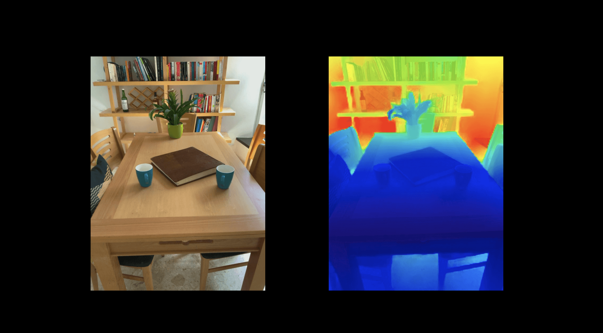

因为LiDAR传感器测量是基于物体反射的光，所以测量到的数据准确度可能会受到环境影响，比如表面呈现高反射率或高吸收率的物体。ARKit会根据当前情况预估准确度，并量化为一个值，这个值称为信任度/置信度（confidence），ARDepthData的第二个属性confidenceMap就表示由准确度组成的图像。对于depthMap属性的每个深度像素，都有一个相应的置信度值，类型为ARConfidenceLevel，这个值可能会是low、medium或high，使用这个值可以按照具体情况过滤depthMap中的深度信息。整体的处理过程如下图所示：

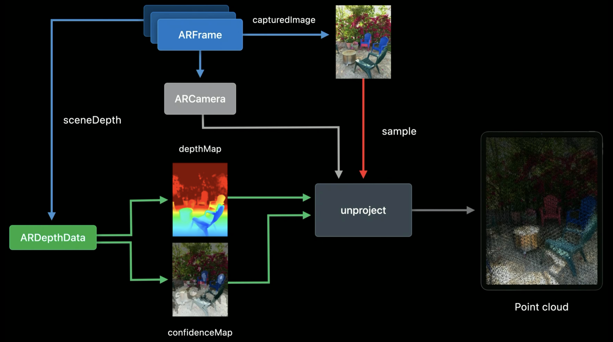

在ARWorldTrackingConfiguration中设置frameSemantics为.sceneDepth，并运行session。然后通过session的代理方法就可以拿到ARDepthData，代码如下：

```swift
let session = ARSession()
let configuration = ARWorldTrackingConfiguration()
// 配置session
if type(of: configuration).supportsFrameSemantics(.sceneDepth){
 configuration.frameSemantics = .sceneDepth
}
session.run(configuration)


// 获取depthData
func session(_ session:ARSession, didUpdate frame: ARFrame){
 guard let depthData = frame.sceneDepth else { return }
}
```

在ARKit早些版本（1-2）中，对象放置依赖于场景理解中对平面的检测，这个过程通常会用到hit test，到了ARKit3中就会使用新加入的raycast （光线投射）API。现在有了LiDAR传感器，对raycast做了高度优化，可以让对象放置的更加精确。在代码层面可以用raycast来替代hit test，如下所示：

```swift
// hit test
let session = ARSession()
hitTest(point, types: [.existingPlaneUsingGeometry,
                       .estimatedVerticalPlane,
                       .estimatedHorizontalPlane])

// raycast
let query = arView.makeRaycastQuery(from: point,
                                    allowing: .estimatedPlane,
                                    alignment: .any)
let raycast = session.trackedRaycast(query) { results in
 //拿到光线投射结果
}
```

#### （3）识别跟踪信息

使用不同的ARConfiguration配置类，跟踪过程中会识别到不同的目标，然后以ARAnchor的形式输出。这里梳理了下所有ARAnchor，如下所示：

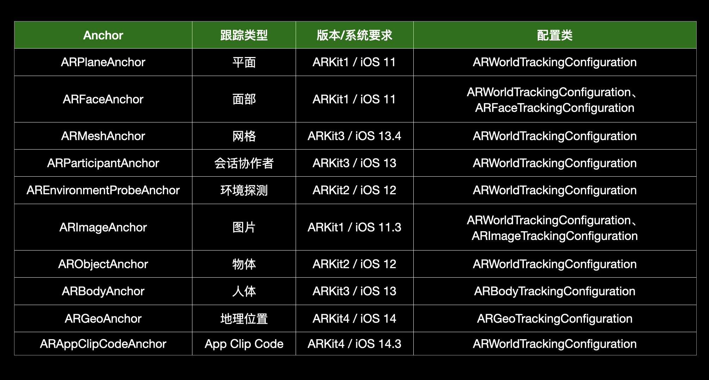

这里着重介绍下AREnvironmentProbeAnchor和ARAppClipCodeAnchor。在ARKit1中提供了环境光照估算的能力，但是仅仅让放置在场景中的虚拟模型具备合适亮度的属性，还不能让虚拟模型看起来像是真实存在一样。就比如下面这个场景：

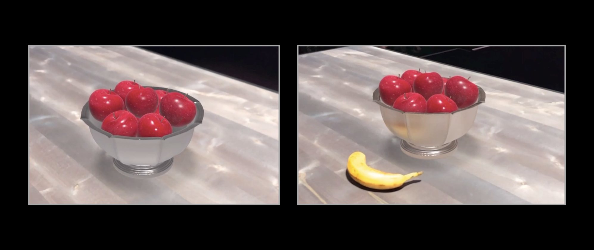

放置的虚拟模型因为自身的材质，需要反射周围环境的颜色，比如左侧的香蕉和下方的桌面需要反射到碗壁上，那么此时就需要ARKit2中提供的环境纹理（Environment Texturing）。通过设置ARWorldTrackingConfiguration的environmentTexturing属性，ARSession就可以自动处理环境纹理，并且以AREnvironmentProbeAnchor类的形式输出，代码如下：

```swift
let configuration = ARWorldTrackingConfiguration()

configuration.environmentTexturing = .automatic

session.run(configuration)
```

在WWDC2020年的时候，苹果发布了App Clips，类似于微信小程序、PWA。使用场景大致为：用户通过NFC、QR Code、Maps、Safari、Message这几个途径识别到App Clip体验链接，如果用户有安装APP，会直接打开主APP，如果没有安装，则会直接打开App Clip来体验主APP的部分功能。

在ARKit4中提供了对App Clip的支持，可以对App Clip Code进行识别和解码，处理结果会以ARAppClipCodeAnchor的形式放在ARFrame中输出。ARAppClipCodeAnchor包含了三个属性：App Clip Code中的URL、URL解码状态、App Clip Code的半径（以米为单位）。

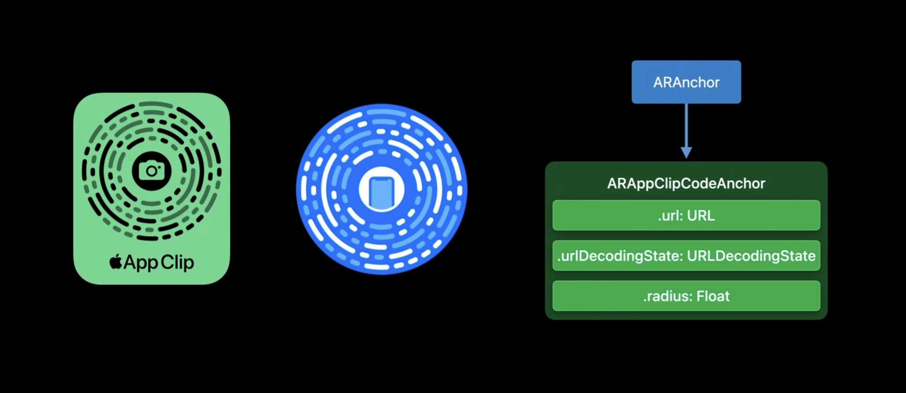

每个App Clip Code都包含一个经过解码的URL，虽然ARKit可以快速检测到App Clip Code的存在，但解码URL并不是即时的，这取决于用户与Code的距离以及诸如照片等因素，ARAppClipCodeAnchor的 urlDecodingState 属性就表示当前的解码状态。状态总共分三种：decoding、decoded、failed，初始化的时候状态为decoding，表示正在对URL进行解码，如果URL解码成功后，状态就会变为decoded，如果无法解码URL时，状态会变为failed。

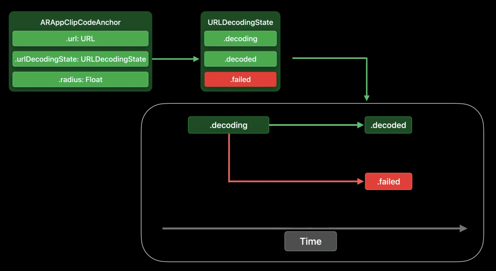

在使用的时候，需要先判断下当前设备是否支持对App Clip Code跟踪，然后初始化ARWorldTrackingConfiguration，并开启App Clip Code跟踪，代码如下：

```swift
func viewDidLoad(){
 // 判断设备是否支持
 guard ARWorldTrackingConfiguration.supportsAppClipCodeTracking else {return}

 // 初始化配置
 let worldConfig = ARWorldTrackingConfiguration()
 worldConfig.appClipCodeTrackingEnabled = true
 arSession.run(worldConfig)
}
```

当session运行起来后，可以通过监听delegate方法来判断是否检测到ARAppClipCodeAnchor，并且判断anchor的解码状态，如果已经解码成功，则获取解码后的URL，然后再增加AnchorEntity和AppClipCodeVisualization来做其它自定义的操作。

```swift
override func session(_ session: ARSession, didUpdate anchors: [ARAnchor]){
 for anchor in anchors{
  // 判断anchor类型
  guard let appClipCodeAnchor = anchor as? ARAppClipCodeAnchor, 
   appClipCodeAnchor.isTracked else {return}
  
  // 判断anchor中的解码状态
  switch appClipCodeAnchor.urlDecodingState{
   case .decoding:
    displayPlaceholderVisualizationOnTopOf(anchor: appClipCodeAnchor)
   case .failed:
    displayNoURLErrorMessageOnTopOf(anchor: appClipCodeAnchor)
   case .decoded:
    let url = appClipCodeAnchor.url!
    let anchorEntity = AnchorEntity(anchor: appClipCodeAnchor)
    arView.scene.addAnchor(anchorEntity)
    let visualization = AppClipCodeVisualization (url: url, radius: appClipCodeAnchor.radius)
    anchorEntity.addChild(visualization)
  }
 }
}
```

在实际开发中还可以将App Clip Code和其它类型的检测结合起来，比如图像跟踪。比如下方的动画中，第一次扫描检测到App Clip Code，然后解码出URL下载虚拟模型，第二次检测到特定图片（向日葵种子包图片）时，就会把向日葵虚拟模型放在图片上。

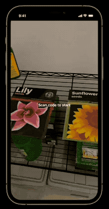

要完成这样的功能，首先必须要让session支持App Clip Code跟踪和图片跟踪，所以在初始化的时候就需要先设置好参考图片，并开启App Clip Code跟踪。session运行起来后，监听session的delegate方法，如果检测到App Clip Code，则隐藏提示语，并解码URL，然后开始下载虚拟模型；如果检测到对应的图片，则会把下载好的虚拟模型展示出来。代码如下：

```swift
// 设置预设图片，开启appClipCode检测
let newConfiguration = ARWorldTrackingConfiguration()
newConfiguration.detectionImages = additionalReferenceImages
newConfiguration.maximumNumberOfTrackedImages = newConfiguration.detectionImages.count
newConfiguration.automaticImageScaleEstimationEnabled = true
newConfiguration.appClipCodeTrackingEnabled = true
arView.session.run(newConfiguration)


// 获取anchor
func session(_ session: ARSession, didAdd anchors: [ARAnchor]) {
 for anchor in anchors {
  // 判断是否是App Clip Code
  if anchor is ARAppClipCodeAnchor {
     appClipCodeCoachingOverlay.setCoachingViewHidden(true)
    }
    if imageAnchor{
    // 隐藏提示语
      appClipCodeCoachingOverlay.setCoachingViewHidden(true)
      imageAnchorFor[productKey] = AnchorEntity(anchor: imageAnchor)
      arView.scene.addAnchor(imageAnchorFor[productKey]!)
      if let productModel = modelFor[productKey] {
        // 展示下载的虚拟模型
        productModel.present(on: imageAnchorFor[productKey]!)
      }
   }}
}

func session(_ session: ARSession, didUpdate anchors: [ARAnchor]) {
for anchor in anchors {
 if let appClipCodeAnchor = anchor as? ARAppClipCodeAnchor, appClipCodeAnchor.urlDecodingState != .decoding {
   let decodedURL: URL
    switch appClipCodeAnchor.urlDecodingState {
     case .decoded:
        decodedURL = appClipCodeAnchor.url!
        if !decodedURLs.contains(decodedURL) {
         decodedURLs.append(decodedURL)
         process(productKey: getProductKey(from: decodedURL))
         NSLog("Successfully decoded ARAppClipCodeAnchor url: " + decodedURL.absoluteString)
        }
      // 判断其它状态 
    }}
 }}
```

#### （4）人体信息

```swift
// 人体2D骨骼信息
@available(iOS 13.0, *)
open var detectedBody: ARBody2D? { get }
// 人物遮挡相关 分割缓冲区
@available(iOS 13.0, *)
open var segmentationBuffer: CVPixelBuffer? { get }
// 估算的深度数据
@available(iOS 13.0, *)
open var estimatedDepthData: CVPixelBuffer? { get }
```

人体信息包含有两部分，一部分是3D人体骨骼信息，这部分在上一小节中的ARBodyAnchor讲过，需要使用人体跟踪配置类ARBodyTrackingConfiguration；另一部分就是2D骨骼信息，直接设置ARWorldTrackingConfiguration的frameSemantics属性为ARFrameSemanticBodyDetection就可以，上面代码中detectedBody属性就表示识别到的2D骨骼信息。

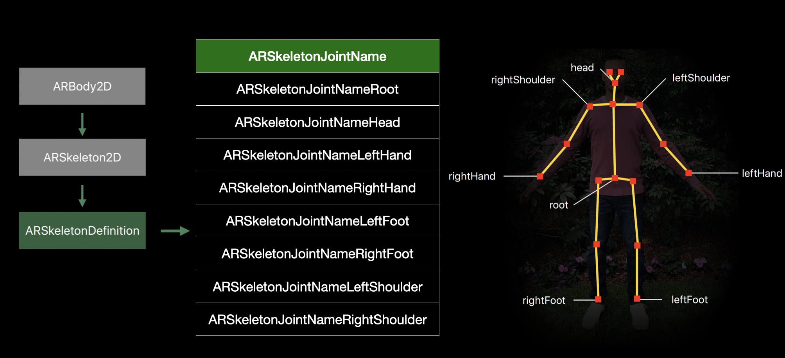

segmentationBuffer和estimatedDepthData属性是和ARKit3中增加的人体遮挡（People Occlusion）特性有关。在ARKit1-2版本中，虚拟元素放置时是在图层最上方，如果正好要放置的平面的一部分被人体遮挡住，这样原本是放置在平面上的虚拟元素，就变成部分放置在人身上。而在ARKit3中，通过设置ARConfiguration的frameSemantics属性为ARFrameSemanticPersonSegmentationWithDepth，ARKit就会自动识别以及分割人体区域，并重新合并渲染。

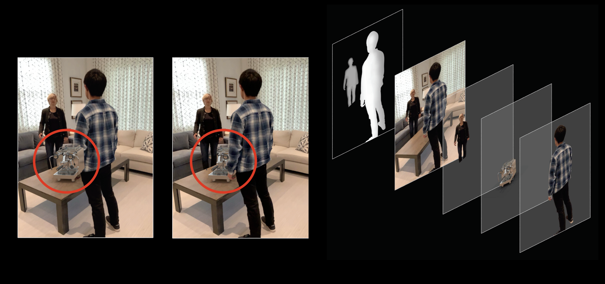

### 3、渲染

ARKit框架本身只是提供设备跟踪和场景理解的能力，这两部分已经在前面中讲过。真正要在图像上添加虚拟元素，是需要渲染框架来进行的。如下图中所示，ARKit在渲染框架的选择上比较宽泛，不仅支持自身生态的渲染框架，还支持第三方的Unity、Unreal Engine（虚幻引擎）。

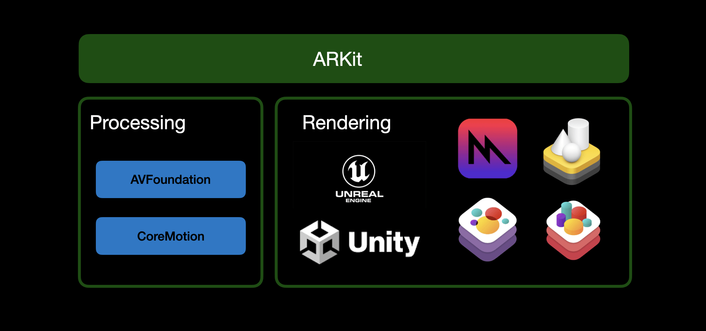

在ARKit1发布时，就支持了SceneKit、SpriteKit和Metal，其中SceneKit为3D渲染框架，SpriteKit为2D渲染框架，Metal相较前两者是低层级的渲染框架。然后在ARKit3发布时推出了全新的渲染框架RealityKit，和配套的工具Reality Composer，为了方便开发者调用，RealityKit和Metal、ARKit的交互都已经内置，所以在开发的时候只需要和一个框架打交道就可以，并且在ARKit4和ARKit5发布时，同步更新了1.5和2.0版本。接下来我们分别简单介绍下各个渲染框架。

#### （1）SceneKit

SceneKit是苹果生态中用来做3D图形渲染的框架，提供比Metal和OpenGL ES更高层级的API，可以用来开发3D内容和游戏。在ARKit1发布时，SceneKit提供了相应的类来支持渲染。如下图所示，ARKit中的ARSCNView类封装了SCNView，并持有ARSession，这样通过ARSession就可以基于SCNView绘制捕捉的图像，并实时更新SCNCamera以及场景照明，场景所有识别到的Anchor都会映射为SCNNode。

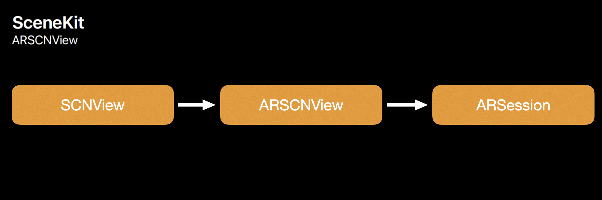

要使用ARSCNView，需要先设置ARSCNView和持有session的delegate，前者可以用来获取anchor更新信息，后者可以获取跟踪状态，接着创建场景，然后使用合适的ARConfiguration类来配置session，代码如下：

```swift
// 设置delegate
sceneView.delegate = self
sceneView.session.delegate = self
// 显示fps、计时等信息
sceneView.showsStatistics = true
// 创建并设置场景
let scene = SCNScene(named: "art.scnassets/ship.scn")!
sceneView.scene = scene
// 创建配置类
let configuration = ARWorldTrackingConfiguration()
sceneView.session.run(configuration)
```

ARSCNView持有的session跑起来后，对场景的识别状态都会通过ARSCNViewDelegate方法传递，比如增加、删除、更新Anchor和Node，如下图所示：

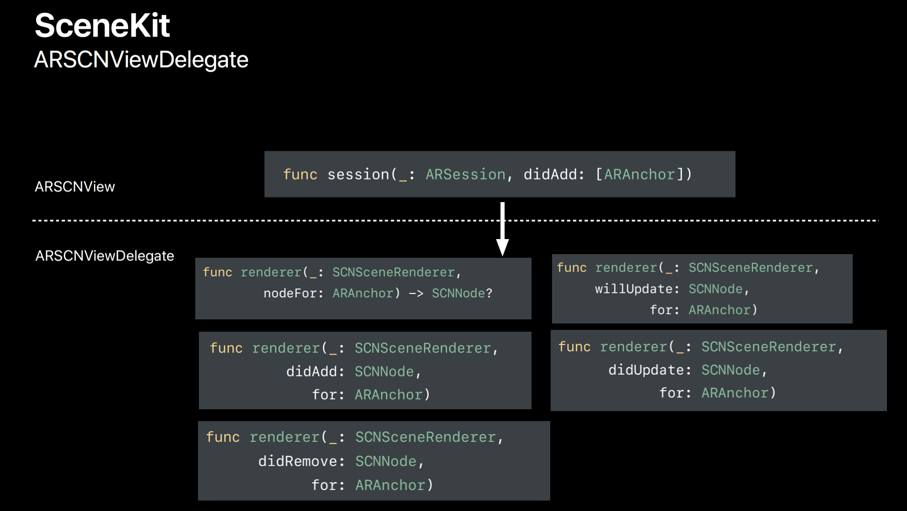

#### （2）SpriteKit

和SceneKit类似，SpriteKit是苹果生态中的2D图形渲染框架，提供了相应的类来支持ARKit中2D内容的渲染工作。ARKit中的ARSKView类封装了SKView，同样基于SKView绘制背景图像，使用SKNode来映射ARAnchor，SpriteKit中的精灵会以广告牌的形式放置在场景中的物理位置上，也就是说不管你怎么移动，精灵始终朝向你。

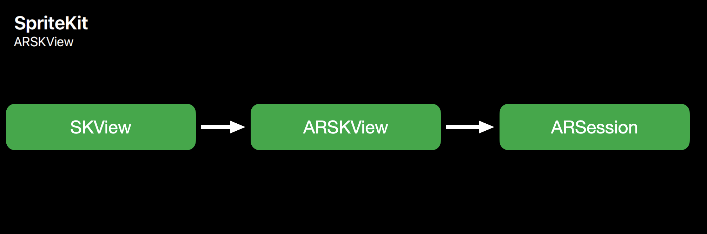

SpriteKit的使用方式和SceneKit大致相同，先设置ARSKView的delegate，用来接受node的状态，再设置ARSKView的session的delegate，接受跟踪状态，然后再使用相应的ARConfiguration配置类配置ARSession，代码如下：

```swift
// 设置delegate
skView.delegate = self
skView.session.delegate = self
// 展示fps和node数量
skView.showsFPS = true
skView.showsNodeCount = true
// 加载场景
if let scene = SKScene(fileNamed: "Scene") {
 skView.presentScene(scene)
}
// 创建配置类
let configuration = ARWorldTrackingConfiguration()
skView.session.run(configuration)


// MARK: - ARSKViewDelegate
func view(_ view: ARSKView, nodeFor anchor: ARAnchor) -> SKNode? {
 // Create and configure a node for the anchor added to the view's session.
 let labelNode = SKLabelNode(text: "👾")
 labelNode.horizontalAlignmentMode = .center
 labelNode.verticalAlignmentMode = .center
 return labelNode;
}
// 添加、更新、删除node回调
func view(_ view: ARSKView, didAdd node: SKNode, for anchor: ARAnchor) {}
func view(_ view: ARSKView, didUpdate node: SKNode, for anchor: ARAnchor) {}
func view(_ view: ARSKView, didRemove node: SKNode, for anchor: ARAnchor) {}
```

#### （3）Metal

Metal是苹果生态中一个同时包含图形渲染和计算的框架，类似于集合了OpenGL 和 OpenCL于一体，通过低开销的API、丰富的着色语言、强大的GPU分析和调试工具套件，提供高性能的硬件加速支持。于2014年发布第一个版本，最低可以在iOS8中使用，可以支持A7以及以上处理器的设备。然后在2017年发布2.0版本，今年的WWDC大会上发布3.0版本。

在使用Metal的时候，就没有SceneKit和SpriteKit中方便的ARSCNView和ARSKView类使用，需要自己手动获取ARSession中的frame信息，然后根据frame信息渲染到屏幕上，如下图所示：

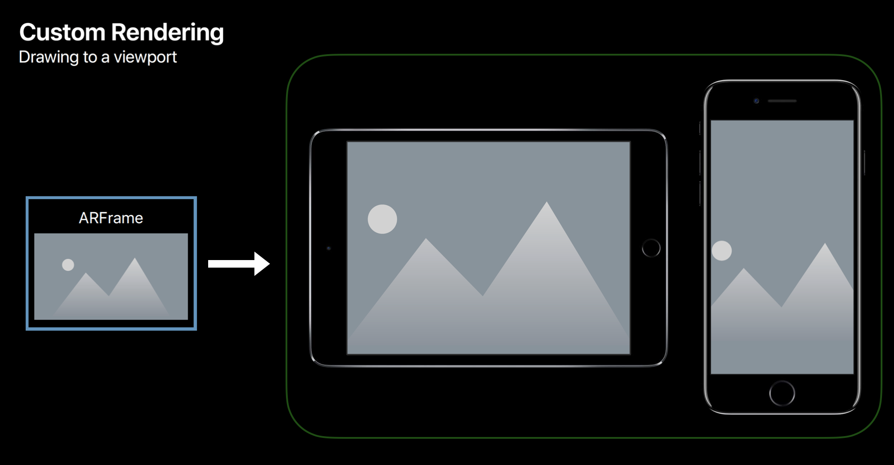

因为frame是实时更新，所以需要实时获取，可以主动轮询ARSession的currentFrame，也可以通过实现ARSession的delegate方法接受frame。拿到frame后，更新背景图像、camera以及光照，最后根据frame的锚点信息绘制模型。代码如下：

```swift
// 主动轮询
if let frame = mySession.currentFrame{
 if( frame.timestamp > _lastTimestamp){
  updateRenderer(frame)
  _lastTimestamp = frame.timestamp
 }
}

// ARSession的delegate
func session(_ session: ARSession, didUpdate frame: ARFrame){
 updateRenderer(frame)
}

// 更新frame
func updateRenderer(_ frame: ARFame){

 // 绘制背景图像
 drawCameraImage(withPixelBuffer: frame.captureImage)
 
 // 更新虚拟camera
 let viewMatrix = simd_inverse(frame.camera.transfrom)
 let projectionMatrix = frame.camera.projectionMatrix
 updateCamera(viewMatrix, projectionMatrix)

 // 更新光照
 updateLighting(frame.lightEstimate?.ambientIntensity)

 // 绘制模型
 drawGeometry(forAnchors: frame.anchors)
}
```

#### （4）RealityKit

在WWDC2019大会上，苹果推出了全新的框架RealityKit，它承担的角色和SceneKit一样，作为一个3D渲染引擎，和ARKit协同来支撑开发者使用，不同的是它专门为了AR开发而设计，降低了使用门槛，还提供各种强大的能力，而且支持跨平台（iOS、iPadOS、macOS），需要注意的是只支持Swift语言开发。

和RealityKit一起发布的还有配套的3D内容制作工具：Reality Composer，使用它可以快速制作一些3D模型和AR场景。一般进行AR开发，都会使用3D建模软件（比如Blender）进行建模，中间会完成模型制作，以及贴图、动画和一些属性设置，建模完成后会导出为3D文件，最终会把3D文件放置到工程中使用。而Reality Composer的推出简化了整个过程，并降低了使用门槛，只需要在界面上拖拖点点就可以完成。另外它还支持在macOS、iOS、iPadOS三个平台，可以在平台之间无缝切换。

RealityKit包含了六个部分的内容：

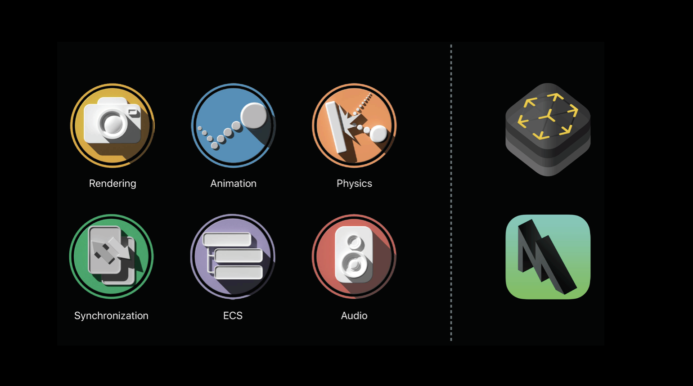

- 渲染（Rendering）

RealityKit基于Metal来渲染，这就意味对苹果的设备做了高度优化，框架本身使用了Metal提供的所有功能，比如多线程渲染等。

- 动画（Animation）

RealityKit支持Transform动画，而且通过ARKit的动作捕捉（Motion Capture）可以支持骨骼动画（Skeletal Animation）。

- 物理（Physics）

物理系统负责模拟模型之间的复杂交互，包括现实世界的对象，并且它提供了一个碰撞检测系统，支持多种不同形状（长方体、球形、复合形状），并且模拟刚体动力学，如质量、惯性、摩擦和恢复。

- 同步（Synchronization）

借助于ARKit的会话协作能力，RealityKit可以跨设备同步整个场景，包括对真实场景的数据，以及不同设备在当前场景中创建的虚拟模型。

- 音频（Audio）

RealityKit会自动配置监听器，并将音频源设置在虚拟内容上，这样就可以让距离你远的虚拟对象发出的声音，听起来会觉得距离是远的。

- ECS（Entity-Component System）

类似于SceneKit中的SCNNode，在RealityKit中用实体组件（Entity-Component）来表示模型数据，通过组合的形式来表示各种内容模型。

RealityKit提供了非常简单且易于使用的Swift API，主要是由四个类来参与到编程中：

- ARView，显示AR体验的视图，其中包含来自RealityKit的内容

- Scene，其中包含由ARView呈现的各种元素集合

- Entity，RealityKit场景的一个元素，可以将其附加到为实体提供外观和行为特征的组件

- Anchor，在AR会话中将虚拟元素连接到现实世界对象的锚点

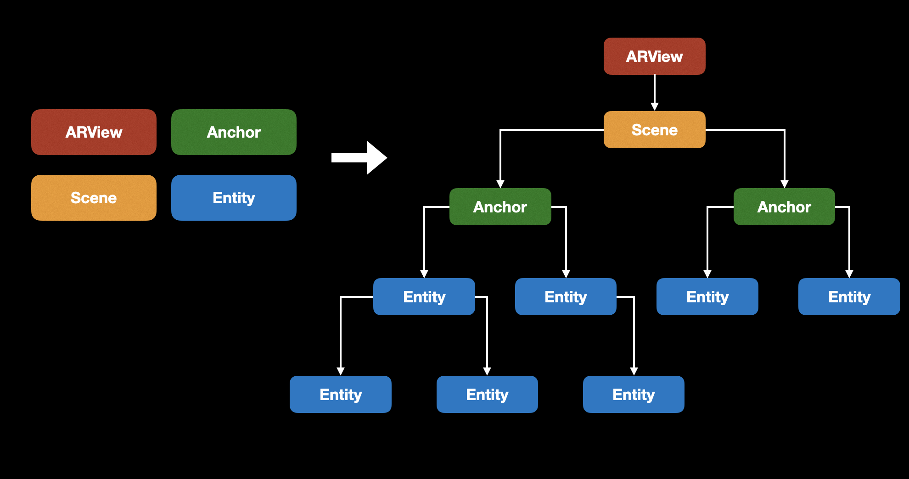

RealityKit在代码调用上特别方便，如下方代码所示：持有一个ARView，然后向ARView中的场景中添加一个组件锚点，接着加载一个模型并添加到锚点中，这样ARView场景里就会展示模型。当然这里只是简单演示了Anchor和Entity，关于物理、动画、物理等特性可以参考Session视频或者文档。

```swift
class ViewController: UIViewController 
{
 @IBOutlet var arView: ARView!

 override func viewDidLoad() {
  super.viewDidLoad()

  let anchor = AnchorEntity(plane: .horizontal)
  arView.scene.addAnchor(anchor)

  let flyer = try Entity.loadModel(named: ”flyer”)
  anchor.addChild(flyer)
 }
}
```

RealityKit在WWDC2019发布第一个版本后，接着在WWDC2020、WWDC2021分别更新了1.5、2.0版本，其中1.5版本新增了Video Materials，允许将视频用作 RealityKit 中的材料，另外会使用LiDAR传感器进行场景理解，并改进了渲染调试，其余和ARKit4相关，就是面部跟踪适配更多设备、增加位置锚点；在2.0版本中优化了动画和材质，增加角色控制器，自定义ECS，并且可以在运行时生成资源。

## 参考链接（推荐阅读）

1、[CMOS 摄像头的Skipping 和 Binning 模式](https://blog.csdn.net/lz0499/article/details/105890600)
2、[35mm等效焦距](https://en.wikipedia.org/wiki/35_mm_equivalent_focal_length)
3、[What’s New in ARKit 2](https://developer.apple.com/videos/play/wwdc2018/602/)
4、[Introducing ARKit 3](https://developer.apple.com/videos/play/wwdc2019/604/)
5、[Explore ARKit 4](https://developer.apple.com/videos/play/wwdc2020/10611/)
6、[Explore ARKit 5](https://developer.apple.com/videos/play/wwdc2021/10073/)
7、[What's new in RealityKit](https://developer.apple.com/videos/play/wwdc2020/10612)
8、[Dive into RealityKit 2](https://developer.apple.com/videos/play/wwdc2021/10074/)
9、[Interacting with App Clip Codes in AR](https://developer.apple.com/documentation/app_clips/interacting_with_app_clip_codes_in_ar)
10、[WWDC20 10174 - App Clips 探索之旅](https://xiaozhuanlan.com/topic/4063519872)