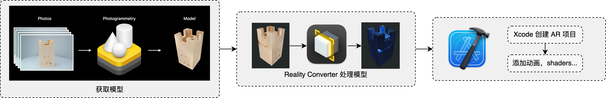
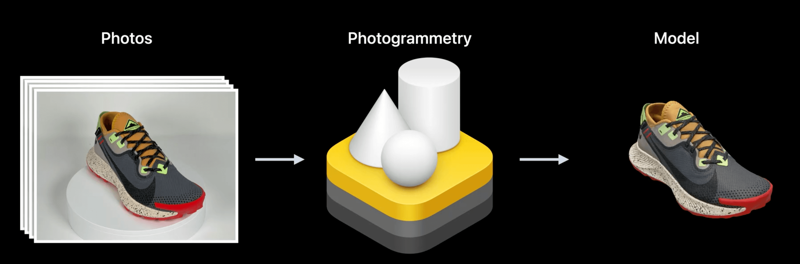
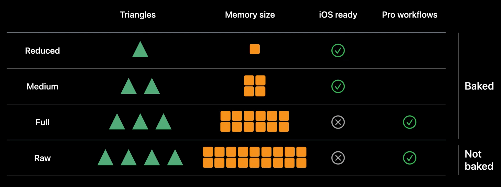
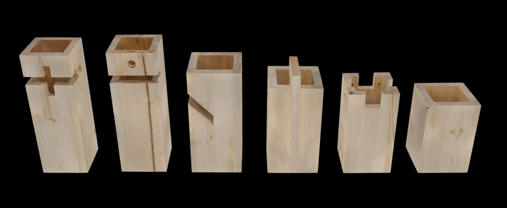
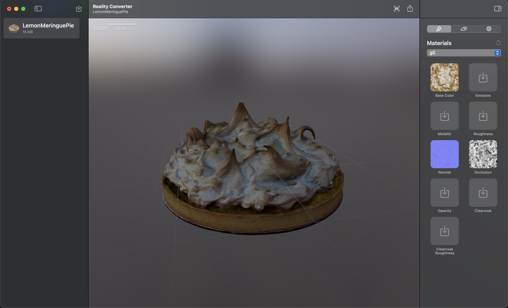
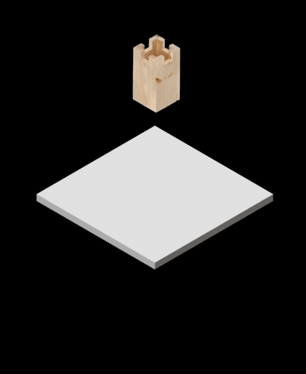
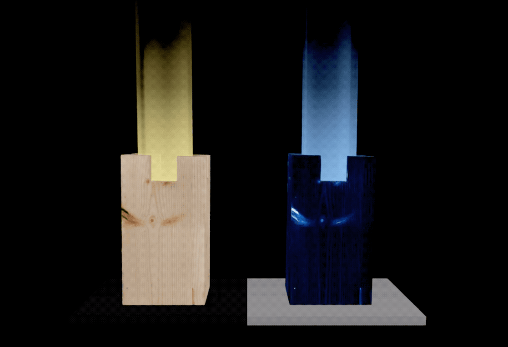
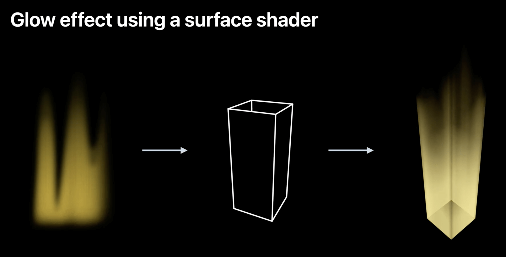
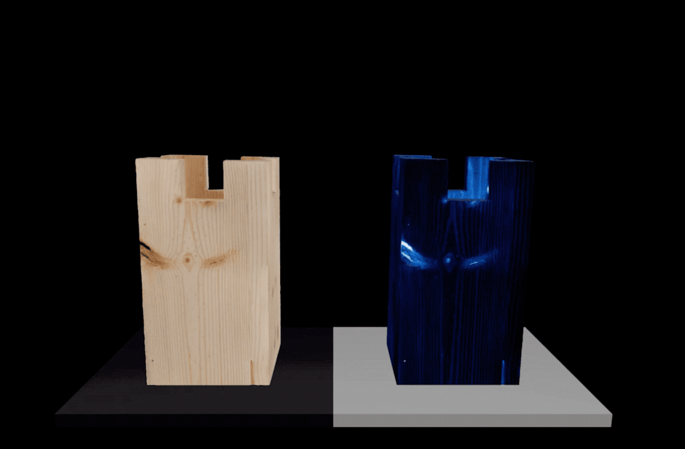
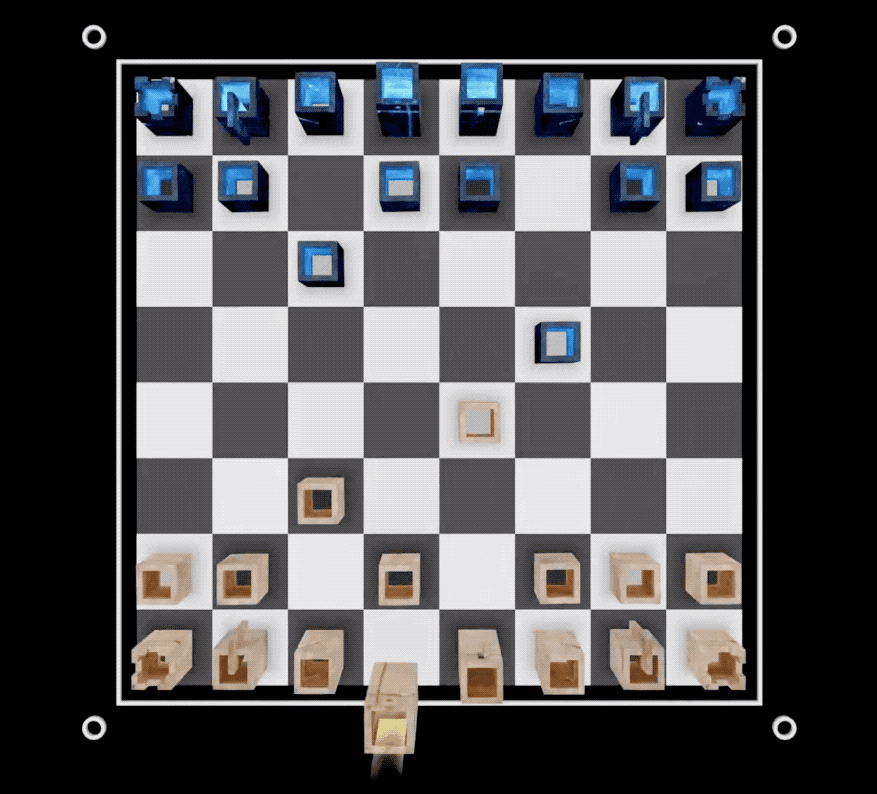

---

session_ids: [10128]

---

# WWDC22 10128 - 将你的世界引入 AR

本文主要根据 [session 10128](https://developer.apple.com/videos/play/wwdc2022/10128) 整理。

其余参考内容：

- [WWDC22 session 10126: Discover ARKit 6](https://developer.apple.com/videos/play/wwdc2022/10126)

- Apple 官方文档 [Modifying RealityKit Rendering Using Custom Materials](https://developer.apple.com/documentation/realitykit/modifying-realitykit-rendering-using-custom-materials)

## 概览

去年的 RealityKit 新增了 Object Capture，自定义 System，自定义 Shader 等大量功能，并给出了一个 [Demo](https://developer.apple.com/documentation/realitykit/building_an_immersive_experience_with_realitykit) 来演示这些功能。然而对于初学者来说，这些功能过于复杂，难以掌握。

于是今年，苹果推出了一个简化版的 Demo，并介绍了苹果生态下 AR 工作流：从使用 Object Capture 创建现实物体的 3D 模型开始，到 USD 格式转换，再到 Xcode 中的 Swift 代码与 Shader 编写。麻雀虽小，五脏俱全，非常适合已经入门 RealityKit，想要进一步深入的开发者学习。

  

本文主要分为两个部分：

- 第一部分是 Object Capture 的相关介绍，包括简单的回顾，ARKit 相机相关增强，以及最佳实践；
- 第二部分则是从使用 Object Capture 到构建 AR App 的 demo。

## Object Capture 相关

### 1. Object Capture 回顾

首先让我们来回顾一下 Object Capture。



Object Capture 可以帮助你方便地将现实物体的照片转化为精细的 3D 模型。首先，使用 iPhone，iPad 或是单反相机等拍摄设备从不同角度给物体拍照；然后将照片导入支持 Object Capture 的 Mac 电脑。通过 Photogrammetry API，RealityKit 可以在几分钟之内将照片转化成 3D 模型。输出的模型包括了几何模型（mesh）和各种材质映射，包括纹理（textures）。关于 Object Capture 的更多信息，可以参看去年的 [WWDC session 10076：*使用 Object Capture 创建 3D 模型*](https://xiaozhuanlan.com/topic/8026419753)，以及其对应的 [demo](https://developer.apple.com/documentation/realitykit/taking_pictures_for_3d_object_capture)。自去年作为 RealityKit 的 API 在 macOS 上发布以来，Object Capture 在电商等领域有不少应用，比如可以通过生成的模型来“试穿”鞋子感受上身效果，或是感受某样东西摆放在你的空间的效果等。

### 2. ARKit 在相机方面的增强

要想获得好的 Object Capture 体验，首先需要**全方位**的拍摄好物体照片；同时，照片的**分辨率**越高，Object Capture 能够生成的模型质量也就越好。你可以用 iPhone，iPad，或是单反、无反相机等任意高分辨率的相机来进行拍摄。如果用的是 iPhone 或 iPad，还可以获取到深度和重力信息，进而恢复出物体的实际大小和方向。

另外，考虑这样一种场景：如果使用 iPhone 或 iPad 拍摄，利用 ARKit 的追踪能力，我们可以在物体上加上 3D 引导 UI，在 AR App 中更好地引导使用者进行拍摄，以获得更全面的物体照片。
在以前，如果使用 ARKit 进行这样的可视化引导，拍照将受限于最高 1920 x 1440 的分辨率，且无法支持 HDR；而今年 ARKit 在相机方面的增强，让我们能在这种 AR 场景下同时获得高分辨率的照片。

ARKit 新提供的高分辨率后台拍摄 API，能让你在运行 ARSession 的同时以原生相机的分辨率拍照。这个 API 是非侵入性的，不会影响当前 ARSession 的持续视频流，所以你的 App 仍然可以提供顺畅的 AR 体验。ARKit 还可以通过照片中的 EXIF metadata 读取白平衡、曝光等信息来更好地进行后处理。使用该新 API 非常简单：

---

1. 设置视频格式

    通过 `ARWorldTrackingConfiguration` 的 `recommendedVideoFormatForHighResolutionFrameCapturing` 变量获取支持高分辨率拍摄的视频格式，如果成功，则设置并运行 `ARSession`

    ```swift
    if let hiResCaptureVideoFormat = ARWorldTrackingConfiguration.recommendedVideoFormatForHighResolutionFrameCapturing {
     // 设置 config 的视频格式
     config.videoFormat = hiResCaptureVideoFormat
    }
    // 运行 session
    session.run(config)
    ```

2. 拍摄照片

    要拍摄高分辨率照片时（比如可以通过点击屏幕等事件触发拍照），只需调用 `ARSession` 新的 `captureHighResolutionFrame` API，它会通过回调异步地返回 `ARFrame`（包含了高分辨率照片和其他属性）

    ```swift
    session.captureHighResolutionFrame { (frame, error) in
     if let frame = frame {
      // 保存 frame.capturedImage
     }
    }
    ```

    注意：不要过久地持有一帧 ARFrame，否则可能使系统无法释放内存，导致 ARKit 无法提供新的帧，表现出掉帧的现象。

3. 手动控制拍摄设置

    如果希望能够手动控制相机的设置，比如聚焦、曝光、白平衡等，可以修改 `AVCaptureDevice` 的属性，来进行更精细的控制：

    ```swift
    if let device = ARWorldTrackingConfiguration.configurableCaptureDeviceForPrimaryCamera {
     do {
      try device.lockForConfiguration()
      // 对 AVCaptureDevice 进行设置
      device.unlockForConfiguration()
     } catch {
      // error handling
     }
    }
    ```

    注意：这里获取到的图像不只是作为背景被渲染展示出来，它同时也会被 ARKit 用来分析场景，因此这里对相机设置的修改（比如设置很强的过度曝光）同时可能影响到 ARKit 的输出质量。

---

关于这些增强的更多细节，可以参看今年的 [WWDC Session 10126：*探索 ARKit 6*](https://developer.apple.com/videos/play/wwdc2022/10126)。

### 3. Object Capture 最佳实践

1. 选取适合 Object Capture 的物体
   - 足够的纹理细节：如果物体的某些部分没有纹理或者是透明的，这部分的细节就无法很好的被重建出来

   - 减少表面反光：如果物体表面不是哑光（matte）的，可以尝试通过使用漫射光（diffuse lighting）来减少反射

   - 不易变形：比如需要翻转物体对底部进行拍照时，需确保物体不会变形

   - 有限的结构细节：要恢复物体的细节结构，需要高分辨率相机拍摄近景照片

2. 搭建理想的拍摄环境
   - 良好的漫射光照（避免太重的阴影）
   - 稳定的背景，保证物体周围足够的空间

3. 关于拍摄的建议
   - 物体与背景能够明显区分开来
   - 拍摄不同高度 & 角度的照片
   - 物体在相机中心且足够大，能够充分捕捉到细节
   - 相邻的照片间，重合度足够高

4. 选择合适的输出模型

   根据实际需要选择，越精细的模型需要的内存也更多

   

## 工作流 - 从模型获取到 AR 应用

在这一部分中，我们将从模型获取开始构建一个 AR 象棋游戏。游戏最终的效果如下所示：


### 1. 使用 Object Capture 获取物体的 3D 模型

关于获取模型，前文已经有比较详细的描述，不再赘述。session 中的例子通过 Object Capture 获取到了一组国际象棋棋子的模型。



### 2. 对模型进行处理：Reality Converter App

使用 Apple 提供的 [Reality Converter App](https://developer.apple.com/augmented-reality/tools/) 可以很方便地查看和简单修改 3D 模型。在这个例子中，演示者使用 Reality Converter 对模型的纹理进行了修改，以获取另一组不同的棋子。

Reality Converter 可以对 3D 模型进行格式转换（.obj, .gltf, .usd → USDZ），查看，和简单的编辑。左侧展示已导入的模型，右侧可以修改材质，查看模型在不同环境光照设置下的样子，以及查看/修改模型的属性（目前似乎只看到版权信息和尺寸单位）。



### 3. 在 Xcode 项目中使用模型构建 AR App

这部分以项目中几个比较关键的点作为例子，展示了 AR 应用开发/ RealityKit 使用中的一些方法。关于 RealityKit 的更多信息，可以参看去年的 [WWDC session 10074: Dive into RealityKit 2](https://developer.apple.com/videos/play/wwdc2021/10074) 和 [session 10075: Explore advanced rendering with RealityKit 2](https://developer.apple.com/videos/play/wwdc2021/10075) 。

- 入场动画 → **动画**

    首先我们希望在游戏开始前有一个入场动画的效果（如下图所示）。

    

    以棋盘的动画效果为例，实现方式如下：

```swift
class Chessboard: Entity {
 func playAnimation() {
    // 对于每个棋盘格子，有一个下落的动画
  checkers.forEach { entity in 
   let currentTransform = entity.transform // 记录当前（也即最终位置）的 transform
   entity.transform.translation += SIMD3<Float>(0, 0.1, 0) // 上移 10 cm（动画开始位置）
      // 调用 move 方法达成动画效果
   entity.move(to: currentTransform,
          relativeTo: entity.parent,
          duration: BoardGame.startupAnimationDuration)
  }
    // 播放棋盘的边框自带的动画效果
  border.availableAnimations.forEach {
   border.playAnimation($0)
  }
 }
}
```

- 选中棋子 → **光线投射 (raycasting)**

    要想开始下棋，首先需要能够选中棋子。当我们点击某个位置的时候，定义一束从相机原点到这个位置的光线，然后通过 raycast 方法来判断这束光线是否击中了某个物体。

    > 注意：raycast 方法会忽略所有没有碰撞组件（CollisionComponent）的对象。

```swift
class ChessViewPort: ARView {
 @objc func handleTap(sender: UITapGestureRecognizer) {
  // 定义从相机原点到点击位置的光线
  guard let ray = ray(through: sender.location(in: self)) else { return }

  // 通过 raycast 方法找到选择的棋子
  guard let raycastResult = scene.raycast(origin: ray.origin, 
                                            direction: ray.direction, 
                                            length: 5, 
                                            query: .nearest, // 返回击中的对象中最近的，其余类型还有 .all, .any
                                            // 这里用棋子的 collision group 作为遮罩，避免选中其他的物体
                                            mask: .piece).first, 
       let piece = raycastResult.entity.parentChessPiece else 
   return 
  }
   // 选中棋子
  boardGame.select(piece)
  gameManager.selectedPiece = piece
 }
}
```

---

接下来我们希望对棋子的展示效果做一些修改，这部分需要用到 RealityKit 的 `CustomMaterial`。`CustomMaterial` 可以让你在 Metal 实现 shader 方法来改变渲染效果，同时仍然使用 RealityKit 的内置 shader 流水线。

`CustomMaterial` 支持两种 Metal shader 方法，surface shader 和 geometry modifier。前者指定每个像素的各种属性，后者对模型的顶点位置进行操作，可以改变模型的形状大小等。RealityKit 的 fragment shader 会调用 surface shader，因此对于每个像素 surface shader 会被调用一次；geometry modifier 则是被 RealityKit 的 vertex shader 调用，对于每个顶点作用一次。

使用 `CustomMaterial` 时，

1. 首先在 Metal 实现所需的 surface shader 或是 geometry modifier；

2. 然后加载已实现的自定义 shader 方法；

3. 再用它们创建 `CustomMaterial`并使用。

在下面的两步中，可以看到具体的例子。

---

- 选中棋子的发光效果 → **表面着色器 (Surface Shader)**

   

   我们希望对被选中的棋子添加一个发光的效果，以标识它的状态。这一步将通过 surface shader 来完成。Surface shader 可以让你设置材质参数，然后 RealityKit 的 fragment shader 会对每个像素调用你定义的 surface shader 方法。

     

   我们先在 Metal 实现图左这样看起来像火焰效果的 surface shader，然后通过 CustomMaterial 应用到一个长方体上，以得到右边的效果。

```c++
// 1. 实现 surface shader 方法 (in Selection.metal)

// 黄色棋子对应的 surface shader
[[visible]] // 自定义的 shader 方法要加上这个前缀
void selectionSurfaceYellow(realitykit::surface_parameters params)
{
    const half3 yellowColor = half3(0.968411, 0.807722, 0.273454);
    selectionSurface(params, yellowColor);
}

// 用于将 input 重新映射到 (outMin, outMax) 的区间
float remapInputToNewRange(float input, float inMin, float inMax, float outMin, float outMax) {
    if (input <= inMin) { return outMin; }
    if (input >= inMax) { return outMax; }
    if (inMin == inMax) { return outMin; }
    
    return (input - inMin) / (inMax - inMin) * (outMax - outMin) + outMin;
}

void selectionSurface(realitykit::surface_parameters params, half3 color)
{
   // ...
   // 随着时间变化改变纹理的 y 值，实现动画的效果
    shapeUV.y = fmod(params.uniforms().time() * NOISESPEED, 1.0);
  
    constexpr sampler textureSampler(coord::normalized, address::repeat, filter::linear, mip_filter::linear);
   // （长方体设置了噪点纹理，后续使用这个纹理来生成需要的效果）
    auto tex = params.textures().base_color();
  
   // 对纹理进行两次采样，一次用于效果的整体形状，一次用于添加细节
    half3 noiseColor = tex.sample(textureSampler, shapeUV).rgb;
    half3 detailColor = tex.sample(textureSampler, uv).rgb;
    
   // 这里取了噪点纹理采样（RGB值）的 x 值，将其重新映射到 0.4～0.6 的区间
    float noiseAmount = remapInputToNewRange(noiseColor.x, 0, 0.57, 0.4, 0.6);
    
   // 计算该点的不透明度：将其 y 值与上一步处理过的值进行比较，映射到 1～0 的范围
    float opacity = remapInputToNewRange(modelPosition.y, noiseAmount - 0.4, noiseAmount, 1, 0);
    
   // 调整不透明度，增加细节，底部更实，顶部更有（不透明度的）变化
    opacity *= remapInputToNewRange(modelPosition.y, 0.1, 0.35, 1, detailColor.x);
    
   // 根据菲涅尔（fresnel）效应对不透明度进行调整，使边缘更柔和
    float3 normal = normalize(params.geometry().normal());
    float3 I = -normalize(params.geometry().view_direction());
    float viewAngle = dot(normal, I);
    float fresnel = remapInputToNewRange(viewAngle, -0.2, 0.2, 1, 0);
    opacity *= fresnel;
    
    // 整体调整不透明度
    opacity *= OPACITYSCALE;
    
    // 给颜色添加一点细节
    color += color * detailColor.x;
    
   // 设置颜色和不透明度
    params.surface().set_emissive_color(color);
    params.surface().set_opacity(opacity);
}
```

```swift
// 2. 获取上一步定义的 surface shader 
// in MetalLibLoader.swift
struct MetalLibLoader {
   // ...
    static var library: MTLLibrary!
   
    static func initializeMetal() {
       // ...
       // Metal device
        guard let device = MTLCreateSystemDefaultDevice() else {
            fatalError()
        }
       // ...
       // Metal library
        guard let library = device.makeDefaultLibrary() else {
            fatalError()
        }
        self.library = library
        // ...
    }
}

// in SelectionCube.swift
// 通过方法名加载 surface shader
private let player1SurfaceShader = CustomMaterial.SurfaceShader(named: "selectionSurfaceYellow", in: MetalLibLoader.library)
// 3. 创建 CustomMaterial
private var player1CustomMaterial = try! CustomMaterial(surfaceShader: player1SurfaceShader, lightingModel: .unlit)

class SelectionCube: Entity {
    convenience init(player: ChessGame.Player, type: ChessGame.Piece.PieceType) {
       // ...
        if let selection = try? Entity.load(named: "SelectionCenter") {
           // ...
           // 使用 CustomMaterial
            selection.modifyMaterials { _ in
                var material = player == .player1 ? player1CustomMaterial : player2CustomMaterial
                // ...
                return material
            }
        }
    }
  // ...
}
```

> - surface shader 只有一个 `realitykit::surface_parameters` 类型的入参 `params`，通过这个参数可以访问到来自 entity 的材质的输入，以及通过顶点数据插值得到的数值（比如颜色）；
> - 通过 `params.surface()` 的 `set_` 系列方法来设置经过 surface shader 后的输出，比如本例中设置的颜色及不透明度。

- 棋子被吃掉时的动画效果 → **几何修改器 (Geometry Modifier)**

   现在我们希望棋子被吃掉时有下面这样的动画效果：棋子先被拉长，再被压扁消失，同时水平方向有一个波浪的效果。

   

   我们可以通过 Geometry modifier 来改变顶点数据，比如位置，法向量（normals），纹理坐标等。对于每个顶点，RealityKit 的顶点着色器（vertex shader）会调用一次这些 Metal 函数。这些修改是非持久的（transient），只会影响 RealityKit 渲染的结果，不会影响实际 Entity 的顶点数据。

```swift
class ChessPiece: Entity, HasChessPiece {
  // 棋子被吃掉的动画进度
    var capturedProgress: Float {
        get {
            (pieceEntity?.model?.materials.first as? CustomMaterial)?.custom.value[0] ?? 0
        }
        set {
            pieceEntity?.modifyMaterials { material in
                guard var customMaterial = material as? CustomMaterial else { return material }
                // 吃子这个动作是由玩家触发的，因此我们需要通知 geometry modifier 何时进行修改；通过设置 customMaterial 的 custom 属性，数据可以在 CPU 和 GPU 间共享（此处通过 custom.value 将动画进度传给 geometry modifier）
                customMaterial.custom.value = SIMD4<Float>(newValue, 0, 0, 0)
                return customMaterial
            }
        }
    }
}
```

```c++
// in Captured.metal
[[visible]]
void capturedGeometry(realitykit::geometry_parameters params)
{
   // 在 Metal 侧，通过这里的 custom_parameter() 获取进度值
    const float progress = params.uniforms().custom_parameter()[0];
    
    constexpr int kScaleAxis = 1; // 竖直方向（y 轴）被拉长/缩短
    constexpr int kTimeAxis = 0; // 水平方向（x 轴）波浪效果
    
    auto geo = params.geometry();
    
    float timeOffset = 1 - progress;
    float geoOffset = geo.model_position()[kTimeAxis]; // 顶点位置 x 值
    float t = bounceInShape(timeOffset - geoOffset); // 进度值与顶点位置 x 值共同影响顶点位置在 y 轴的偏移
    
    float3 offset(0);
   // y 轴的偏移量
    offset[kScaleAxis] = -geo.model_position()[kScaleAxis] * (1.0 - t);
    
   // 设置顶点位置偏移
    geo.set_model_position_offset(offset);
    geo.set_custom_attribute(float4(t, 0, 0, 0));
}
```

> - 通过这个例子可以看到数据可以如何通过 CustomMaterial 的 `custom.value` 进行传递：设置后，通过 `params.uniforms().custome_parameter()` 可以获取（surface shader 同理）。

- 当前棋子可移动位置提示 → **后处理回调 (post process callback)**

   

   加上一个当前棋子可以走哪里的提示对于象棋新手来说应该很有用：给当前棋子可以走的格子加上一个闪烁的效果（使用 surface shader），然后加上泛光（bloom）的后处理效果来加强这种视觉差异。这个效果会使亮区的边界处产生一种向外延伸的效果。

   ```c++
   // Checker.metal
   [[visible]]
   void whiteCheckerSurface(realitykit::surface_parameters params)
   {
       checkerSurface(params, 0.5);
   }
   
   void checkerSurface(realitykit::surface_parameters params, float amplitude, bool isBlack = false)
   {
      // 当前格子是否是可以走的位置，依旧是通过 custom_parameter() 获取
       bool isPossibleMove = params.uniforms().custom_parameter()[0];
       // ...
       if (isPossibleMove) {
          // 闪烁的动画效果，根据时间设置不同值
           const float a = amplitude * sin(params.uniforms().time() * M_PI_F) + amplitude;
           params.surface().set_emissive_color(half3(a));
           if (isBlack) {
               color = half3(min(max(a, 0.05), 0.92));
               params.surface().set_base_color(color);
           }
       }
   }
   
   ```

   最后，给整个 view 添加泛光效果。

   使用内置的 Metal performance shader 方法实现需要的泛光效果，然后把对应 ARView 的`renderCallbacks.postProcess` 回调设为刚才定义的方法。

```swift
class ChessViewport: ARView {
 init(gameManager: GameManager) {
  // ...
  renderCallbacks.postProcess = postEffectBloom // 设置回调
 }
}

extension ChessViewport {
   // 泛光效果
    func postEffectBloom(context: ARView.PostProcessContext) {
        // ...
       let brightness = MPSImageThresholdToZero(
            device: context.device,
            thresholdValue: 0.85,
            linearGrayColorTransform: nil
        )
        brightness.encode(
            commandBuffer: context.commandBuffer,
            sourceTexture: context.sourceColorTexture,
            destinationTexture: bloomTexture!
        )
       // ...
    }
}
```

## 最后

> 该 session 提供了这个 AR 象棋的 [demo](https://developer.apple.com/documentation/realitykit/using_object_capture_assets_in_realitykit)（需要 **Xcode14** 和 **iOS15** ）
