---

session_ids: [10128]

---

# WWDC22 10128 - 将你的世界引入 AR

本文主要根据 [session 10128](https://developer.apple.com/videos/play/wwdc2022/10128) 整理。

其余参考内容：

- [WWDC22 session 10126: Discover ARKit 6](https://developer.apple.com/videos/play/wwdc2022/10126)

- Apple 官方文档 [Modifying RealityKit Rendering Using Custom Materials](https://developer.apple.com/documentation/realitykit/modifying-realitykit-rendering-using-custom-materials)

## 概览

去年的 RealityKit 新增了 Object Capture，自定义 System，自定义 Shader 等大量功能，并给出了一个 [Demo](https://developer.apple.com/documentation/realitykit/building_an_immersive_experience_with_realitykit) 来演示这些功能。然而对于初学者来说，这些功能过于复杂，难以掌握。

于是今年，苹果推出了一个简化版的 Demo，并介绍了苹果生态下 AR 工作流：从使用 Object Capture 创建现实物体的 3D 模型开始，到 USD 格式转换，再到 Xcode 中的 Swift 代码与 Shader 编写。麻雀虽小，五脏俱全，非常适合已经入门 RealityKit，想要进一步深入的开发者学习。

  

本文主要分为两个部分：

- 第一部分是 Object Capture 的相关介绍，包括简单的回顾，ARKit 相机相关增强，以及最佳实践；
- 第二部分则是从使用 Object Capture 到构建 AR App 的 demo。

## Object Capture 相关

### 1. Object Capture 回顾

首先让我们来回顾一下 Object Capture。


Object Capture 可以帮助你方便地将现实物体的照片转化为精细的 3D 模型。首先，使用 iPhone，iPad 或是单反相机等拍摄设备从不同角度给物体拍照；然后将照片导入支持 Object Capture 的 Mac 电脑。通过 Photogrammetry API，RealityKit 可以在几分钟之内将照片转化成 3D 模型。输出的模型包括了几何模型（mesh）和各种材质映射，包括纹理（textures）。关于 Object Capture 的更多信息，可以参看去年的 [WWDC session 10076：*使用 Object Capture 创建 3D 模型*](https://xiaozhuanlan.com/topic/8026419753)，以及其对应的 [demo](https://developer.apple.com/documentation/realitykit/taking_pictures_for_3d_object_capture)。自去年作为 RealityKit 的 API 在 macOS 上发布以来，Object Capture 在电商等领域有不少应用，比如可以通过生成的模型来“试穿”鞋子感受上身效果，或是感受某样东西摆放在你的空间的效果等。

### 2. ARKit 在相机方面的增强

要想获得好的 Object Capture 体验，首先需要**全方位**的拍摄好物体照片；同时，照片的**分辨率**越高，Object Capture 能够生成的模型质量也就越好。你可以用 iPhone，iPad，或是单反、无反相机等任意高分辨率的相机来进行拍摄。如果用的是 iPhone 或 iPad，还可以获取到深度和重力信息，进而恢复出物体的实际大小和方向。

另外，考虑这样一种场景：如果使用 iPhone 或 iPad 拍摄，利用 ARKit 的追踪能力，我们可以在物体上加上 3D 引导 UI，在 AR App 中更好地引导使用者进行拍摄，以获得更全面的物体照片。
在以前，如果使用 ARKit 进行这样的可视化引导，拍照将受限于最高 1920 x 1440 的分辨率，且无法支持 HDR；而今年 ARKit 在相机方面的增强，让我们能在这种 AR 场景下同时获得高分辨率的照片。

ARKit 新提供的高分辨率后台拍摄 API，能让你在运行 ARSession 的同时以原生相机的分辨率拍照。这个 API 是非侵入性的，不会影响当前 ARSession 的持续视频流，所以你的 App 仍然可以提供顺畅的 AR 体验。ARKit 还可以通过照片中的 EXIF metadata 读取白平衡、曝光等信息来更好地进行后处理。使用该新 API 非常简单：

---

1. 设置视频格式

    通过 `ARWorldTrackingConfiguration` 的 `recommendedVideoFormatForHighResolutionFrameCapturing` 变量获取支持高分辨率拍摄的视频格式，如果成功，则设置并运行 `ARSession`

    ```swift
    if let hiResCaptureVideoFormat = ARWorldTrackingConfiguration.recommendedVideoFormatForHighResolutionFrameCapturing {
     // 设置 config 的视频格式
     config.videoFormat = hiResCaptureVideoFormat
    }
    // 运行 session
    session.run(config)
    ```

2. 拍摄照片

    要拍摄高分辨率照片时（比如可以通过点击屏幕等事件触发拍照），只需调用 `ARSession` 新的 `captureHighResolutionFrame` API，它会通过回调异步地返回 `ARFrame`（包含了高分辨率照片和其他属性）

    ```swift
    session.captureHighResolutionFrame { (frame, error) in
     if let frame = frame {
      // 保存 frame.capturedImage
     }
    }
    ```

    注意：不要过久地持有一帧 ARFrame，否则可能使系统无法释放内存，导致 ARKit 无法提供新的帧，表现出掉帧的现象。

3. 手动控制拍摄设置

    如果希望能够手动控制相机的设置，比如聚焦、曝光、白平衡等，可以修改 `AVCaptureDevice` 的属性，来进行更精细的控制：

    ```swift
    if let device = ARWorldTrackingConfiguration.configurableCaptureDeviceForPrimaryCamera {
     do {
      try device.lockForConfiguration()
      // 对 AVCaptureDevice 进行设置
      device.unlockForConfiguration()
     } catch {
      // error handling
     }
    }
    ```

    注意：这里获取到的图像不只是作为背景被渲染展示出来，它同时也会被 ARKit 用来分析场景，因此这里对相机设置的修改（比如设置很强的过度曝光）同时可能影响到 ARKit 的输出质量。

---

关于这些增强的更多细节，可以参看今年的 [WWDC Session 10126：*探索 ARKit 6*](https://developer.apple.com/videos/play/wwdc2022/10126)。

### 3. Object Capture 最佳实践

1. 选取适合 Object Capture 的物体
   - 足够的纹理细节：如果物体的某些部分没有纹理或者是透明的，这部分的细节就无法很好的被重建出来

   - 减少表面反光：如果物体表面不是哑光（matte）的，可以尝试通过使用漫射光（diffuse lighting）来减少反射

   - 不易变形：比如需要翻转物体对底部进行拍照时，需确保物体不会变形

   - 有限的结构细节：要恢复物体的细节结构，需要高分辨率相机拍摄近景照片

2. 搭建理想的拍摄环境
   - 良好的漫射光照（避免太重的阴影）
   - 稳定的背景，保证物体周围足够的空间

3. 关于拍摄的建议
   - 物体与背景能够明显区分开来
   - 从不同高度 & 角度拍摄照片
   - 物体在相机中心且足够大，能够充分捕捉到细节
   - 相邻的照片间，重合度足够高

4. 选择合适的输出模型

   根据实际需要选择，越精细的模型需要的内存也更多

   

## 工作流 - 从模型获取到 AR 应用

在这一部分中，我们将以一个 AR 象棋游戏为例，介绍从模型获取开始的整体工作流程。游戏最终的效果如下所示：


> 回忆一下流程：
>
> 

### 1. 使用 Object Capture 获取物体的 3D 模型

关于获取模型，前文已经有比较详细的描述，不再赘述。session 中的例子通过 Object Capture 获取到了一组国际象棋棋子的模型。


### 2. 对模型进行处理：Reality Converter App

使用 Apple 提供的 [Reality Converter App](https://developer.apple.com/augmented-reality/tools/) 可以很方便地查看和简单修改 3D 模型。在这个例子中，演示者使用 Reality Converter 对模型的纹理进行了修改，以获取另一组不同的棋子。

Reality Converter 可以对 3D 模型进行格式转换（.obj, .gltf, .usd → USDZ），查看，和简单的编辑。左侧展示已导入的模型，右侧可以修改材质，查看模型在不同环境光照设置下的样子，以及查看/修改模型的属性（目前似乎只看到版权信息和尺寸单位）。


### 3. 在 Xcode 项目中使用模型构建 AR App

> 这部分以项目中几个比较关键的点作为例子，展示了 AR 应用开发/ RealityKit 使用中的一些方法。关于 RealityKit 的更多信息，可以参看去年的 [WWDC session 10074: Dive into RealityKit 2](https://developer.apple.com/videos/play/wwdc2021/10074) 和 [session 10075: Explore advanced rendering with RealityKit 2](https://developer.apple.com/videos/play/wwdc2021/10075) 。

现在 3D 模型已经准备就绪。来看看这个 AR 游戏还需要些什么，以及相应的我们需要了解什么：

1. 我们希望在游戏开局有棋子的入场动画 ➡️ **动画**如何实现？
2. 要下棋首先我们需要能够选中棋子 ➡️ 在设备屏幕上的操作如何通过 **raycast 方法**与模型交互？
3. 完善模型展示效果（被选中的棋子需要有特殊效果标识，棋子被吃时应该有动画效果，再加点当前棋子可以走的位置提示） ➡️ 如何通过 **`CustomMaterial`**  实现 **shader 方法**来修改模型的展示效果？
4. 给棋子可走位置提示加强一点视觉效果 ➡️ 如何使用**后处理回调**？

接下来，我们围绕这几点来看看各部分的实现。

#### 1. 入场动画 → **动画**

**GOAL**：我们希望实现如下图所示的棋子入场动画。


以棋盘的动画效果为例，实现方式如下：

```swift
class Chessboard: Entity {
 func playAnimation() {
    // 对于每个棋盘格子，有一个下落的动画
  checkers.forEach { entity in 
   let currentTransform = entity.transform // 记录当前（也即最终位置）的 transform
   entity.transform.translation += SIMD3<Float>(0, 0.1, 0) // 上移 10 cm（动画开始位置）
      // 调用 move 方法达成动画效果
   entity.move(to: currentTransform,
          relativeTo: entity.parent,
          duration: BoardGame.startupAnimationDuration)
  }
    // 播放棋盘的边框自带的动画效果
  border.availableAnimations.forEach {
   border.playAnimation($0)
  }
 }
}
```

#### 2. 选中棋子 → **光线投射 (raycasting)**

**GOAL**：点击设备屏幕，能够选中相应位置的棋子。

当我们点击某个位置的时候，定义一束从相机原点到这个位置的光线，然后通过 raycast 方法来判断这束光线是否击中了某个物体。

> 注意：raycast 方法会忽略所有没有碰撞组件（CollisionComponent）的对象。

```swift
class ChessViewPort: ARView {
 @objc func handleTap(sender: UITapGestureRecognizer) {
  // 定义从相机原点到点击位置的光线
  guard let ray = ray(through: sender.location(in: self)) else { return }

  // 通过 raycast 方法找到选择的棋子
  guard let raycastResult = scene.raycast(origin: ray.origin, 
                                            direction: ray.direction, 
                                            length: 5, 
                                            query: .nearest, // 返回击中的对象中最近的，其余类型还有 .all, .any
                                            // 这里用棋子的 collision group 作为遮罩，避免选中其他的物体
                                            mask: .piece).first, 
       let piece = raycastResult.entity.parentChessPiece else 
   return 
  }
   // 选中棋子
  boardGame.select(piece)
  gameManager.selectedPiece = piece
 }
}
```

#### 3. 修改模型展示效果 → `CustomMaterial`

接下来我们希望对棋子的展示效果做一些修改，这部分需要用到 RealityKit 的 `CustomMaterial`。`CustomMaterial` 可以让你在 Metal 实现 shader 方法来改变渲染效果，同时仍然使用 RealityKit 的内置 shader 流水线。

`CustomMaterial` 支持两种 Metal shader 方法，**surface shader** 和 **geometry modifier**。前者指定每个像素的各种属性，后者对模型的顶点位置进行操作，可以改变模型的形状大小等。RealityKit 的 fragment shader 会调用 surface shader，因此对于每个像素 surface shader 会被调用一次；geometry modifier 则是被 RealityKit 的 vertex shader 调用，对于每个顶点作用一次。

使用 `CustomMaterial` 时，

1. 首先在 Metal 实现所需的 surface shader 或是 geometry modifier；

2. 然后加载已实现的自定义 shader 方法；

3. 再用它们创建 `CustomMaterial` 并使用。

接下来我们将通过实例介绍 `CustomMaterial` 的使用（shader 的具体逻辑将在下一节中进行解读）。

---

在开始前我们先大致了解下棋子模型的构成：

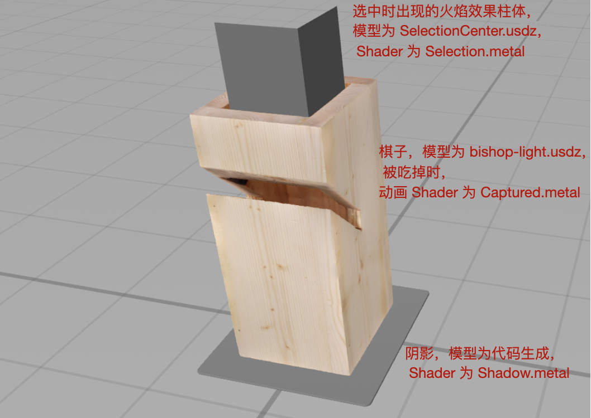

这一步中主要关注棋子中心的柱体，以及棋子本身的模型部分。

---

- 选中棋子的发光效果 → **表面着色器 (Surface Shader)**

   **GOAL**：我们希望对被选中的棋子添加一个特殊效果以示区分。如下图所示，被选中的棋子中央多了一束光柱。

   这一步将通过 surface shader 来完成。Surface shader 可以让你设置材质参数，然后 RealityKit 的 fragment shader 会对每个像素调用你定义的 surface shader 方法。

   

   这束光柱的基础是一个处于棋子中心的柱体（即前面图中提到的 SelectionCenter）。我们先在 Metal 实现图左这样看起来像火焰效果的 surface shader，然后通过 `CustomMaterial` 应用到这个柱体上，以得到右边的效果。

     

```c++
// 1. 实现 surface shader 方法 (in Selection.metal)

// 黄色棋子对应的 surface shader
[[visible]] // 自定义的 shader 方法要加上这个前缀
void selectionSurfaceYellow(realitykit::surface_parameters params)
{
    const half3 yellowColor = half3(0.968411, 0.807722, 0.273454);
    selectionSurface(params, yellowColor);
}

void selectionSurface(realitykit::surface_parameters params, half3 color)
{
   // ... 计算颜色与不透明度
   // 关于这里 surface shader 实现的具体细节，详见第三节
  
   // 设置颜色和不透明度
    params.surface().set_emissive_color(color);
    params.surface().set_opacity(opacity);
}
```

首先实现 surface shader 方法。

- surface shader 只有一个 `realitykit::surface_parameters` 类型的入参 `params`，通过这个参数可以访问到来自 entity 的材质的输入，以及通过顶点数据插值得到的数值（比如颜色）；
- 通过 `params.surface()` 的 `set_` 系列方法来设置经过 surface shader 后的输出，比如本例中设置的颜色及不透明度。

```swift
// 2. 获取上一步定义的 surface shader 

// in MetalLibLoader.swift
struct MetalLibLoader {
   // ...
    static var library: MTLLibrary!
   
    static func initializeMetal() {
       // ...
       // Metal device
        guard let device = MTLCreateSystemDefaultDevice() else {
            fatalError()
        }
       // ...
       // Metal library
        guard let library = device.makeDefaultLibrary() else {
            fatalError()
        }
        self.library = library
        // ...
    }
}

// in SelectionCube.swift
// 通过方法名加载 surface shader (用到上面创建的 library)
private let player1SurfaceShader = CustomMaterial.SurfaceShader(named: "selectionSurfaceYellow", in: MetalLibLoader.library)
// 3. 创建 CustomMaterial
private var player1CustomMaterial = try! CustomMaterial(surfaceShader: player1SurfaceShader, lightingModel: .unlit)

class SelectionCube: Entity {
    convenience init(player: ChessGame.Player, type: ChessGame.Piece.PieceType) {
       // ...
        if let selection = try? Entity.load(named: "SelectionCenter") {
           // ...
           // 使用 CustomMaterial
            selection.modifyMaterials { _ in
                var material = player == .player1 ? player1CustomMaterial : player2CustomMaterial
                // ...
                return material
            }
        }
    }
}

extension Entity {
    func modifyMaterials(_ closure: (Material) throws -> Material) rethrows {
        try children.forEach { try $0.modifyMaterials(closure) }
        
        guard var comp = components[ModelComponent.self] as? ModelComponent else { return }
        comp.materials = try comp.materials.map { try closure($0) }
        components[ModelComponent.self] = comp
    }
}
```

`selection` 即是对应上文提到的棋子中心的柱体模型的 Entity。通过 `modifyMaterials` 方法将创建好的使用 surface shader 的 `CustomMaterial` 设置给了 `selection`。

- 棋子被吃掉时的动画效果 → **几何修改器 (Geometry Modifier)**

   **GOAL**：现在我们希望棋子被吃掉时有下面这样的动画效果：棋子先被拉长，再被压扁消失，同时水平方向有一个波浪的效果。

   

   我们可以通过 Geometry modifier 来改变顶点数据，比如位置，法向量（normals），纹理坐标等。对于每个顶点，RealityKit 的顶点着色器（vertex shader）会调用一次这些 Metal 函数。这些修改是非持久的（transient），只会影响 RealityKit 渲染的结果，不会影响实际 Entity 的顶点数据。

```swift
class ChessPiece: Entity, HasChessPiece {
  // 棋子被吃掉的进度
    var capturedProgress: Float {
        get {
            (pieceEntity?.model?.materials.first as? CustomMaterial)?.custom.value[0] ?? 0
        }
        set {
            pieceEntity?.modifyMaterials { material in
                guard var customMaterial = material as? CustomMaterial else { return material }
                // 吃子这个动作是由玩家触发的，因此我们需要通知 geometry modifier 何时进行修改；通过设置 customMaterial 的 custom 属性，数据可以在 CPU 和 GPU 间共享（此处通过 custom.value 将动画进度传给 geometry modifier）
                customMaterial.custom.value = SIMD4<Float>(newValue, 0, 0, 0)
                return customMaterial
            }
        }
    }
}
```

吃子动画与被吃掉的进度有关，这个进度值在 geometry modifier 中需要用到，因此当进度 `capturedProgress` 被设置的时候，需要通过 `modifyMaterials` 更新 `CustomMaterial`，传递进度值。

通过这个例子可以看到数据如何进行传递：设置时通过 `CustomMaterial` 的 `custom.value` 进行设置；设置后，在 Metal 侧通过 `params.uniforms().custome_parameter()` 获取（surface shader 同理）。

```c++
// in Captured.metal
[[visible]]
void capturedGeometry(realitykit::geometry_parameters params)
{
   // 在 Metal 侧，通过这里的 custom_parameter() 获取进度值
    const float progress = params.uniforms().custom_parameter()[0];
  
   // ... 计算顶点信息
   // 关于这里 geometry modifier 实现的具体细节，详见第三节
  
   // 设置顶点位置偏移
    geo.set_model_position_offset(offset);
    geo.set_custom_attribute(float4(t, 0, 0, 0));
}
```

#### 4. 当前棋子可移动位置提示 → **后处理回调 (post process callback)**

这一步中需要给画面加上泛光的**后处理效果**。顾名思义，后处理是在物体渲染后执行的 shader(s)，输入包括颜色与深度信息，根据需要处理后再得到目标颜色（如下图）。

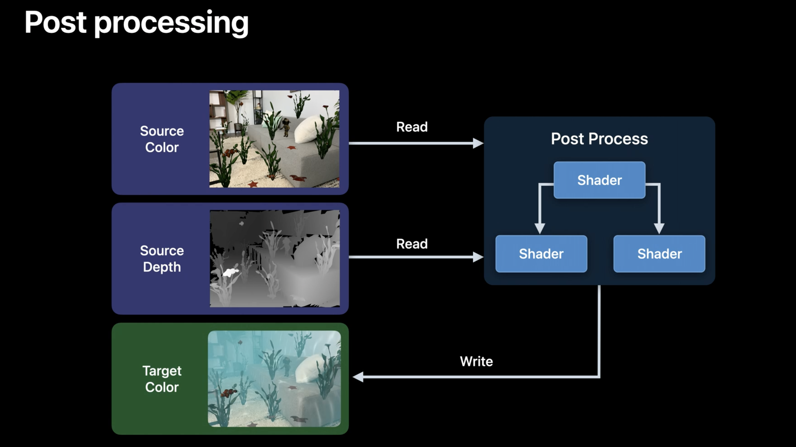

使用后处理的基本步骤是：

1. 实现需要的后处理 shader 方法：可以通过现有的框架比如 Core Image，Metal Performance Shaders，SpriteKit 实现或是自定义 Metal Shader 方法；
2. 设置对应的 ARView 的 renderCallbacks。

---

**GOAL**：给当前棋子可以走的格子加上一个闪烁的效果。


首先使用 surface shader 实现棋盘格的闪烁效果（具体解读见下一节）：

```c++
// Checker.metal
[[visible]]
void whiteCheckerSurface(realitykit::surface_parameters params)
{
    checkerSurface(params, 0.5);
}

void checkerSurface(realitykit::surface_parameters params, float amplitude, bool isBlack = false)
{
   // 当前格子是否是可以走的位置，依旧是通过 custom_parameter() 获取
    bool isPossibleMove = params.uniforms().custom_parameter()[0];
    // ...
    if (isPossibleMove) {
       // 闪烁的动画效果，根据时间设置不同值
        const float a = amplitude * sin(params.uniforms().time() * M_PI_F) + amplitude;
        params.surface().set_emissive_color(half3(a));
        if (isBlack) {
            color = half3(min(max(a, 0.05), 0.92));
            params.surface().set_base_color(color);
        }
    }
}

```

再加上泛光（bloom）的后处理效果来加强这种视觉差异；这个效果会使亮区的边界处产生一种向外延伸的效果。

实现这个效果需要三步：

1. 找到图像中的亮区：一定阈值以下的亮度被设为 0；
2. 对上一步的结果进行高斯模糊（亮区的光因此扩散到周围）；
3. 将原图像与上一步模糊的结果进行叠加。

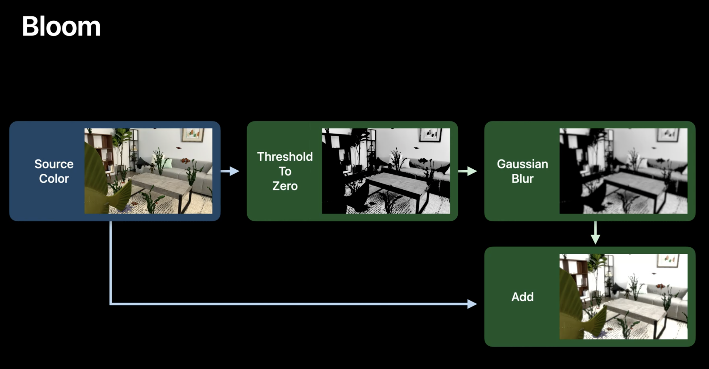

这里我们使用内置的 Metal performance shader 方法来实现泛光效果：

```swift
extension ChessViewport {
   // 泛光效果
    func postEffectBloom(context: ARView.PostProcessContext) {
        context.prepareTexture(&self.bloomTexture)
        
    // 1. 找到亮区
        let brightness = MPSImageThresholdToZero(
          device: context.device,
          thresholdValue: 0.85,
          linearGrayColorTransform: nil
        )
        brightness.encode(
          commandBuffer: context.commandBuffer,
          sourceTexture: context.sourceColorTexture,
          destinationTexture: bloomTexture!
        )
    
       // 2. 进行高斯模糊
        let gaussianBlur = MPSImageGaussianBlur(device: context.device, sigma: 20)
        gaussianBlur.encode(
          commandBuffer: context.commandBuffer,
          inPlaceTexture: &bloomTexture!
        )

       // 3. 叠加原图像与模糊结果
        let add = MPSImageAdd(device: context.device)
        add.encode(
          commandBuffer: context.commandBuffer,
          primaryTexture: context.sourceColorTexture,
          secondaryTexture: bloomTexture!,
          destinationTexture: context.compatibleTargetTexture
        )
    }
}
```

然后把对应 ARView 的`renderCallbacks.postProcess` 回调设为刚才定义的方法。

```swift
class ChessViewport: ARView {
 init(gameManager: GameManager) {
  // ...
  renderCallbacks.postProcess = postEffectBloom // 设置回调
 }
}
```

## Shader 详细解读

在上一节 3.3 小节中，我们展示了使用 `CustomMaterial` 实现自定义 shader 的整体流程；本节我们将详细解读 shader 的具体代码实现。

### 1. 项目代码的整体结构

首先来看下项目的整体结构。我们可以重点关注几个部分：

- 游戏中的物体（Entities）
- 动画系统（AnimationSystem）
- **Shader 的实现（*.metal）**

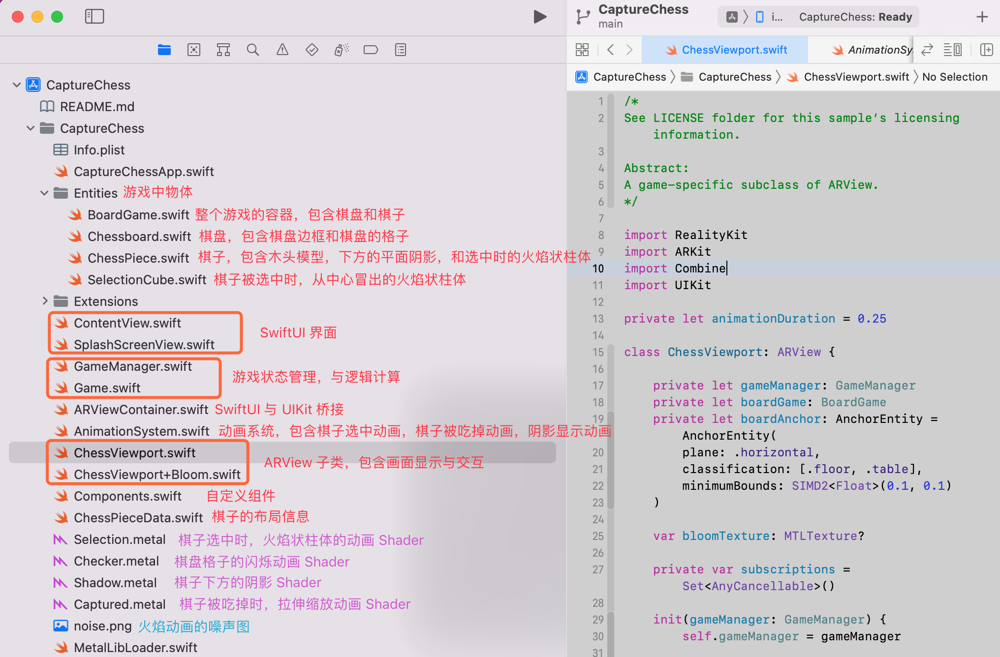

### 2. 棋子结构 & 参数传递

#### 1. 棋子结构

在开始看代码前，先再来仔细看看整个棋子的实际结构，以及棋子中各部分的**位置与尺寸**，这与 Shader 息息相关。

一个棋子有三部分：1. 底部的阴影；2. 棋子模型本身；3. 选中时棋子中央出现的柱体。


首先来看棋子底部的阴影，它其实是个边长为 1 的立方体，然后通过 `scale` 将其拍扁，用来呈现阴影。而 Shader 本质是作用于 mesh 之上的，所以这里需要记住：mesh **边长为 1**。

> `scale.y` 设置为 0.01，**只影响视觉效果**，在 Shader 中读取 mesh 高度仍为 1。由于原点在中间，所以上下高度各 0.5。

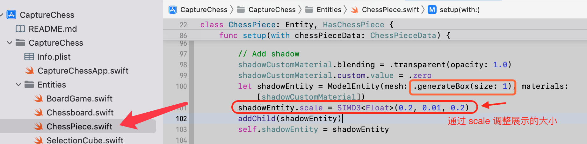

再看棋子模型，长宽基本为 0.1 米，高度在 0.15～0.28 之间，棋子内部的空洞尺寸大约是 0.06 米（6 厘米）。

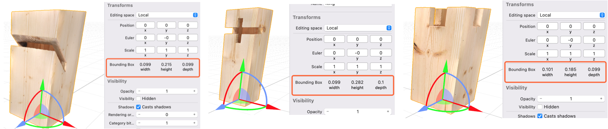

最后看中心的方柱体，长宽约为 6 厘米（Xcode 不显示模型的尺寸单位，需要用其他工具查看，如 Reality Composer），并带有伸长的动画。

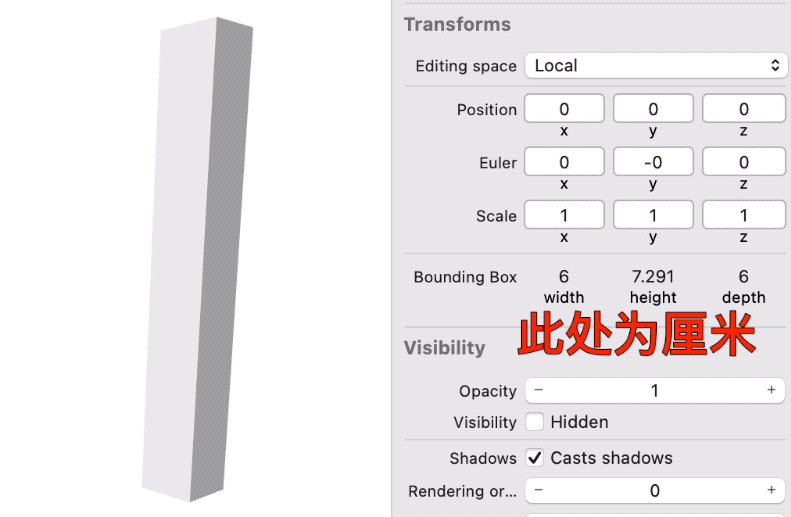

我们还需要注意：这个火焰柱体与棋子模型的相对位置。已知：

- 火焰底部与棋子模型中心点对齐；
- 不同棋子模型高度在 0.15～0.28 之间；
- 当棋子比较高时，火焰柱体会被拉伸 1.2 倍；

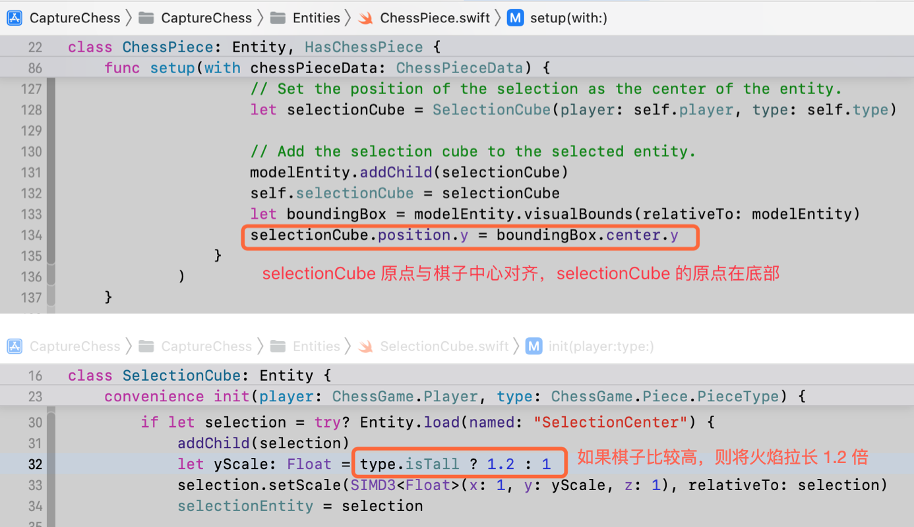

因此可知：火焰柱体的 mesh 与棋子模型的**重叠区域**大约是 0.1。请记住 **0.1** 这个值，后面的 Shader 会用到。

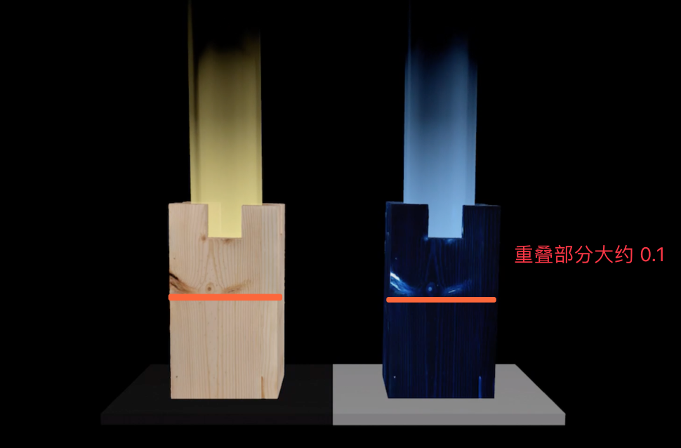

#### 2. Shader 中的自定义参数传递

前面我们提到过，自定义参数的传递可以通过 `CustomMaterial` 的 `custom.value` 进行。但在这之前的步骤（参数是如何与动画中的值绑定，如何在每帧进行更新的）是怎样的呢？这里主要有两种方式：

- 需要渐变的值（如下图中红色和绿色箭头所指的 `shadowOpacity` 和 `capturedProgress`）

    1. 通过**动画的 `bindTarget` 属性**，获取到变化中的值

    2. 经过自定义 System 的**动画系统的 `update()` 方法**，一帧帧传递到 Shader 中（通过 `CustomMaterial` 的 `custom.value` ）
- 不需要渐变的值（如下图蓝色箭头所指的 `isPossibleMove` ）

    1. **保存在自定义 Component** 中

    2. 经过**动画系统的 `update()` 方法**，传递到 Shader 中（通过 `CustomMaterial` 的 `custom.value` ）

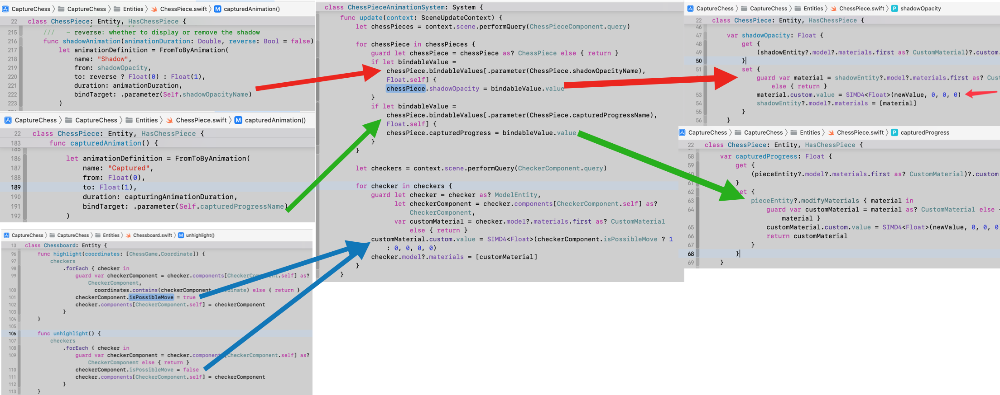

### 3. Shader 具体实现

了解了基本的结构，现在我们来看看几个 shader 的代码。

#### 1. 棋子底部阴影 Shader

首先是棋子底部的阴影。阴影 Shader 其实总共有 4 步：

1. 调整显示范围，只显示最上面一层（回忆一下，阴影的模型实际是边长为 1 的立方体）；

2. 设置阴影颜色为黑色；

3. 根据 uv 生成边缘柔和的矩形阴影；

4. 与自定义参数混合，设置阴影透明度（阴影是有动画的：棋子拿起/落下时阴影逐渐消失/出现）。

```c++
[[visible]]
void shadowSurface(realitykit::surface_parameters params)
{
    float3 position = params.geometry().model_position();
    // 1. 当 y 坐标小于 0.49，则不显示；由于模型 mesh 的边长为 1，原点在中心，y 坐标范围是 [-0.5, 0.5]，所以这里只显示最上面薄薄的一层
    if (position.y < 0.49) {
        discard_fragment();
    }
    // 2. 设置颜色为黑色
    half3 shadowColor = half3(0, 0, 0);
    params.surface().set_base_color(shadowColor);
    // 3. 根据 uv 坐标计算透明度，smoothrect 计算得到的是边缘柔和的矩形阴影
    const float2 uv = params.geometry().uv0();
    const float phi = smoothrect(uv, 0.3);
    // 4. 获取自定义参数，此处用来控制渐变动画（例如棋子拿起/落下时阴影的渐隐/出现）。最后设置阴影透明度。
    // 自定义参数是通过 ChessPiece 的 shadowOpacity 变量设置的，通过前文所述的方式进行传递
    const float progress = params.uniforms().custom_parameter()[0];
    params.surface().set_opacity(phi * 0.5 * progress);
}
```

那么第 3 步中 `smoothrect` 函数是怎么让矩形边缘变柔和呢？其实就是将 4 个 `smoothstep` 函数乘起来：

```c++
float smoothrect(float2 uv, float s)
{
    return smoothstep(0, s, uv.x) * (1.0 - smoothstep(1 - s, 1, uv.x)) *
        smoothstep(0, s, uv.y) * (1.0 - smoothstep(1 - s, 1, uv.y));
}
```

我们知道：`smoothstep` 是个柔和渐变函数，`smoothstep(0, 0.3, uv.x)` 就意味 `uv.x` 会在 [0, 0.3] 区间产生柔和渐变，而超过 0.3 部分会截断为 0.3。如下图，前两个相乘就解决了 x 轴方向的渐变，同理 4 个相乘就得到了矩形的渐变。

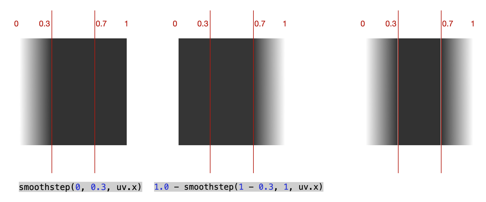

最终，我们就得到了，棋子下方淡淡的边缘柔和的阴影。

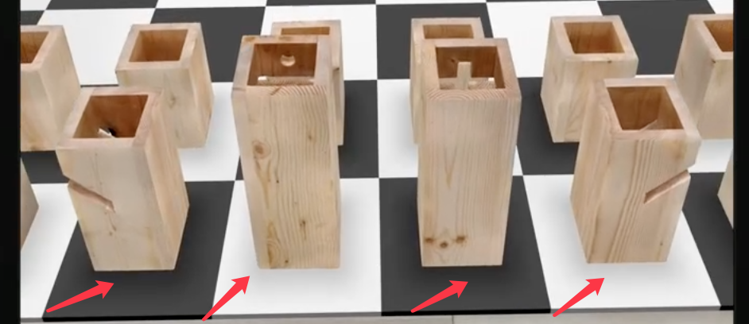

#### 2. 棋子被选中时的动画 Shader

> 对应上一节 3.3 部分

接下来是棋子被选中时中间的光柱。两方棋子选中时光柱颜色不同，分别对应各自的 shader，内部统一调用 `selectionSurface` 方法实现动画。

```c++
// 黄色棋子的 shader
[[visible]]
void selectionSurfaceYellow(realitykit::surface_parameters params)
{
    const half3 yellowColor = half3(0.968411, 0.807722, 0.273454);
    selectionSurface(params, yellowColor);
}
// 蓝色棋子的 shader
[[visible]]
void selectionSurfaceBlue(realitykit::surface_parameters params)
{
    const half3 blueColor = half3(0.204652, 0.470958, 0.966113);
    selectionSurface(params, blueColor);
}
```

其实基本的原理非常简单，利用一张噪声图（产生随机数）和时间函数，产生随时间和空间渐变的动画。如下图：

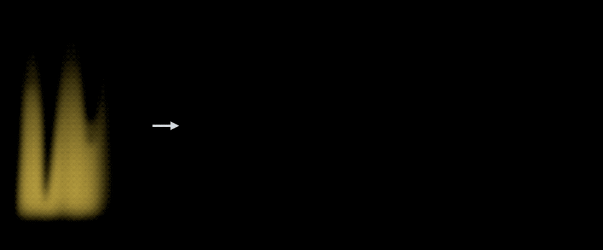

下面来看看具体代码。

```c++
void selectionSurface(realitykit::surface_parameters params, half3 color)
{
    const float NOISEFREQUENCY = 0.6;
    const float NOISESPEED = 0.04;
    const float OPACITYSCALE = 0.75;

    const float2 uv = params.geometry().uv0();
    const float3 modelPosition = params.geometry().model_position();
    // 1. 对 uv 进行调整，将 x 坐标缩小至 0.6，可以让噪声变化更平稳；将 y 坐标与时间关联，1.0 / 0.04 = 25，故每 25 秒 y 坐标从 0 变化到 1
    float2 shapeUV = uv;
    shapeUV.x *= NOISEFREQUENCY; //  缩小 uv.x 
    shapeUV.y = fmod(params.uniforms().time() * NOISESPEED, 1.0); // fmod 函数求余数，让 y 随时间变化

    // 2. 准备对噪声图进行采样，用调整后的 uv 和原始 uv 分别采样
    constexpr sampler textureSampler(coord::normalized, address::repeat, filter::linear, mip_filter::linear);
    auto tex = params.textures().base_color();

   // 采样两次，分别用于整体效果和细节调整
    half3 noiseColor = tex.sample(textureSampler, shapeUV).rgb;
    half3 detailColor = tex.sample(textureSampler, uv).rgb;

    // 3. a.将噪声图的 x 分量，即红色分量，从 [0, 0.57] 映射到 [0.4, 0.6] 区间，为后面做准备
    float noiseAmount = remapInputToNewRange(noiseColor.x, 0, 0.57, 0.4, 0.6);

    // b.调整模型上不同高度的透明度，要让 y 越大，透明度越接近 0；同时为了让同样的 y 坐标产生不同的透明度，就要利用噪声 noiseAmount 来调整起点和终点。起始点为noiseAmount - 0.4，范围[0, 0.2]，终止点 noiseAmount，范围[0.4, 0.6]；
    float opacity = remapInputToNewRange(modelPosition.y, noiseAmount - 0.4, noiseAmount, 1, 0);

    // c.将 y 坐标[0.1, 0.35]范围内，再添加一些随机的衰减（使光柱顶部透明度更有细节变化）
    opacity *= remapInputToNewRange(modelPosition.y, 0.1, 0.35, 1, detailColor.x);

    // 4. 添加 fresnel 效果，影响不同角度的透明度，使边缘更柔和
    float3 normal = normalize(params.geometry().normal());
    float3 I = -normalize(params.geometry().view_direction());

    float viewAngle = dot(normal, I);
    float fresnel = remapInputToNewRange(viewAngle, -0.2, 0.2, 1, 0);
    opacity *= fresnel;

    // 5. 调整最终效果，并设置自发光颜色和透明度
    opacity *= OPACITYSCALE;// 调整最终的透明度强度

    color += color * detailColor.x;// 根据噪声图的红色分量，调整最终整体的颜色强度

    params.surface().set_emissive_color(color);
    params.surface().set_opacity(opacity);
}
```

相信很多人没有看懂第 3 步和第 4 步到底在干什么，下面我们画图来详细解释。

先从第 3 步开始，这一步是效果的核心步骤：

​ a. 获取噪声图的 x 分量，即红色分量，重新映射（➡️ 获取噪声随机值作为后续输入）；

​ b. 利用 a 的结果，让 y 坐标越大，透明度越接近于 0，但同时让不同 x 坐标处产生不同的渐变（➡️ 使光柱越高处越透明，且形状不规则）；

​ c. 在 b 的基础上，让 y 坐标在 [0.1, 0.35] 范围内，再叠加一些随机的渐变（➡️ 使光柱顶部更富于变化而底部更实）；

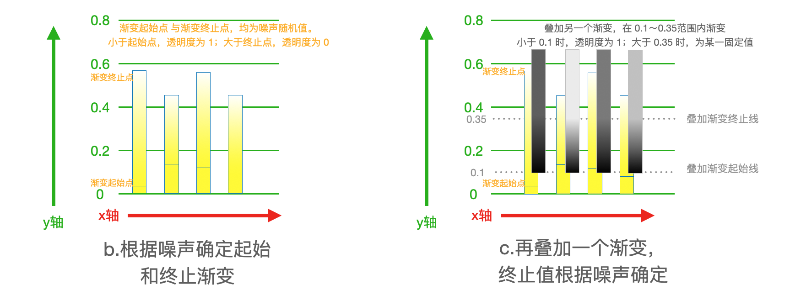

> 还记得之前说「火焰柱体与棋子模型的重叠区域大约是 **0.1**」吗？这里步骤 c 中，叠加渐变的起始线从 0.1 开始，即是从柱体超出棋子的部分开始的。

而第 4 步添加 fresnel 效果的目的，就是让火焰柱体正面观看时，更不透明；从后面看时，变得透明，从而使效果更自然，边缘更柔和。这里我们用向量点乘来得到观察方向，然后进行 `remapInputToNewRange(viewAngle, -0.2, 0.2, 1, 0)` 操作。计算得到的 `fresnel` 值，根据观察方向不同共有三种状态（见下图右）：

- 正面时 fresnel 为 1（绿色区域）；
- 侧面时从 1 渐变到 0（渐变区域）；
- 后面时 fresnel 为 0（红色区域）。

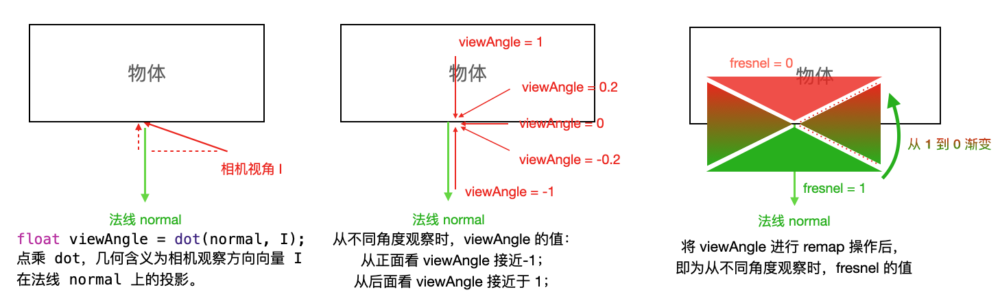

这个 `fresnel` 值最终会被叠加到透明度上，影响不同观察角度下的火焰透明度。

#### 3. 棋子被吃掉的动画 Shader

> 对应上一节 3.3 部分

然后是棋子被吃掉时的动画效果。棋子是通过 Object Capture 生成的模型，具体动画代码在 `ChessPiece` 中。棋子被吃掉的动画，本质是沿 y 轴方向先拉伸，再压缩的动画。同时让 x 轴不同位置的点，提前或延后进入动画，以达到类似波浪的动画效果。

我们直接来看 Shader 代码：

```c++
[[visible]]
void capturedGeometry(realitykit::geometry_parameters params)
{
    // 1. 获取自定义参数（棋子被吃掉的进度）
    const float progress = params.uniforms().custom_parameter()[0];
    // 2. 根据 x 轴上位置，对 y 轴进行缩放
    constexpr int kScaleAxis = 1;
    constexpr int kTimeAxis = 0;

    auto geo = params.geometry();
    // 3. 利用 bounceInShape 函数计算变形曲线
    float timeOffset = 1 - progress; // progress 从 0 变到 1，而 timeOffset 则从 1 变到 0
    float geoOffset = geo.model_position()[kTimeAxis]; // 即 x 坐标（模型长宽约为 0.1 米，x 坐标范围[-0.05, 0.05]）
    float t = bounceInShape(timeOffset - geoOffset); // 如果 x 坐标为 0，则 bounceInShape(1) 到 bounceInShape(0)
    // 4. 计算缩放偏移量
    float3 offset(0);
    offset[kScaleAxis] = -geo.model_position()[kScaleAxis] * (1.0 - t);
    // 5. 设置坐标偏移量，实现变形效果
    geo.set_model_position_offset(offset);
    geo.set_custom_attribute(float4(t, 0, 0, 0)); // 传递给 surface shader 的参数，此 Demo 中无用
}
```

我们来看看上面第 3 步中 `bounceInShape` 函数到底是个什么曲线：

```c++
float bounceInShape(float t, float height = 1.5)
{
    // 将 t 限制在[0, 1]之间
    t = saturate(t);
    // step(0.5,t) 含义：当 t >= 0.5 取 1；当 t < 0.5，取 0（对应下图中 DC，BA 两段）
    // sin(t * M_PI_F) 因为 t 被限制在[0, 1]之间，此处 sin 的值只有半个周期，乘以 1.5，为 [0, 1.5]
    return max(sin(t * M_PI_F) * height, step(0.5,t));
}
```

结合起来最终的函数曲线如下图中红色曲线所示，是一个先拉伸再压缩的曲线：

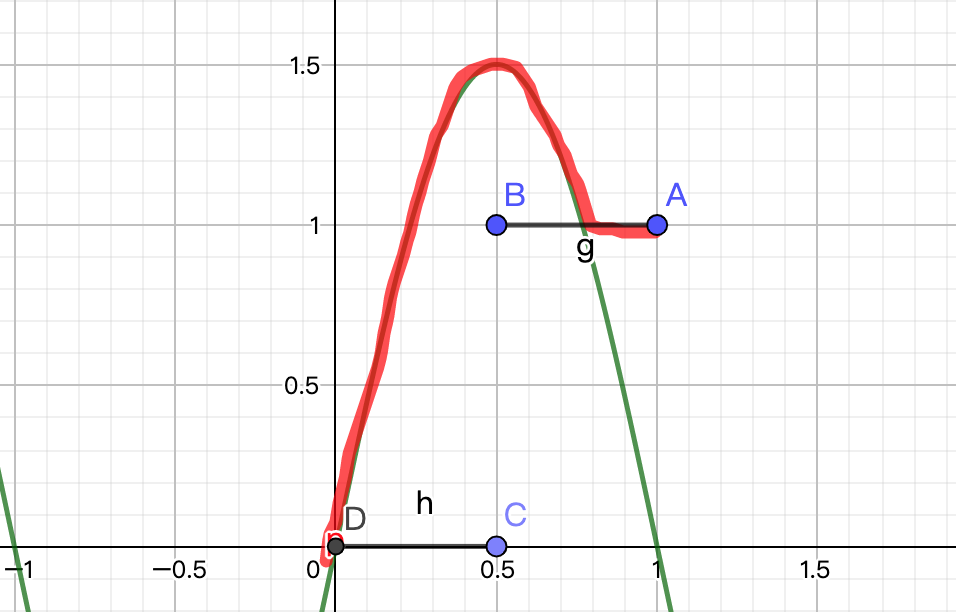

配合上图，我们再来看 `t` 的变化：

```c++
float t = bounceInShape(timeOffset - geoOffset);
```

`bounceInShape` 的输入是 `timeOffset - geoOffset`，`geoOffset` 即是 x 坐标，而 `timeOffset` 由当前动画进度得到，从 1 到 0。也即是说，动画进度 与 x 坐标值共同影响了 y 轴偏移量。

如果 x 坐标为 0，则等同于从 `bounceInShape(1)` 到 `bounceInShape(0)`，即是一个先向上拉伸再压扁到消失的过程。

最后得到的就是下图动画中的效果，注意因为个别棋子朝向不同，所以它们自身的 x 轴方向可能并不一致，动画波浪的方向也不一样。

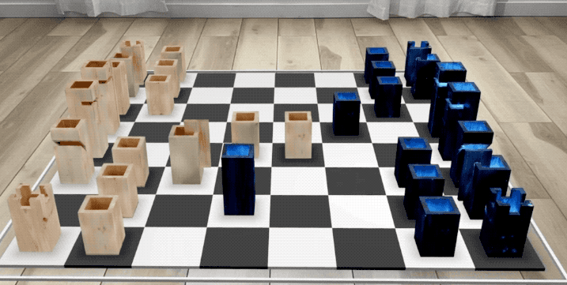

#### 4. 棋盘网格闪烁动画 Shader

> 对应上一节 3.4 部分

最后是用于提示当前棋子可以走的位置的棋盘动画。棋盘是由一个个黑白相间的 Entity 组成，具体代码在 `Chessboard` 中，计算是否可移动及闪烁动画的代码也在其中。我们直接来看 Shader 代码：

```c++
// 白色棋盘格的 Shader
[[visible]]
void whiteCheckerSurface(realitykit::surface_parameters params)
{
    checkerSurface(params, 0.5);
}
// 黑色棋盘格的 Shader
[[visible]]
void blackCheckerSurface(realitykit::surface_parameters params)
{
    checkerSurface(params, 0.5, true);
}
```

最终调用的是下面的函数，真正的闪烁动画是由一个 `sin` 函数实现的：

```c++
void checkerSurface(realitykit::surface_parameters params, float amplitude, bool isBlack = false)
{
    // 1. 获取自定义参数，此处代表是否可移动到该网格
    bool isPossibleMove = params.uniforms().custom_parameter()[0];
    // 2. 根据棋盘网格原来的颜色，设置基础颜色、粗糙度、镜面反射
    half3 color;
    float roughness, specular;
    if (isBlack) {
        color = half3(0.05, 0.05, 0.05);
        roughness = 0.7;
        specular = 0.5;
    }
    else {
        color = half3(0.92, 0.92, 0.92);
        roughness = 0.1;
        specular = 0.8;
    }
    params.surface().set_base_color(color);
    params.surface().set_roughness(roughness);
    params.surface().set_specular(specular);
    // 3. 对可移动到的网格，添加动画
    if (isPossibleMove) {
      // 4. sin 函数原始周期是 2*pi，此处 sin(params.uniforms().time() * M_PI_F) 则代表 2 秒一个周期（即一亮一灭，耗时 2 秒），sin 函数值域为 [-1, 1]，amplitude = 0.5，故 a 最终取值范围为[0, 1]
        const float a = amplitude * sin(params.uniforms().time() * M_PI_F) + amplitude;
        params.surface().set_emissive_color(half3(a));
        if (isBlack) {
            color = half3(min(max(a, 0.05), 0.92));
            params.surface().set_base_color(color);
        }
    }
}
```

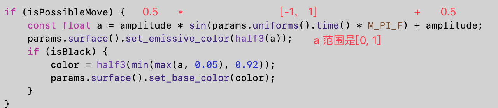

## 最后

> 该 session 提供了这个 AR 象棋的 [demo](https://developer.apple.com/documentation/realitykit/using_object_capture_assets_in_realitykit)（需要 **Xcode14** 和 **iOS15** ）
