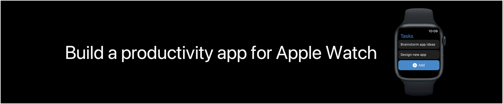

## 个人介绍

Layer（杨杰），就职于抖音 iOS 即时通讯团队，经常被可爱的人看到个人介绍。

## 审核介绍

## 不超过 120 个字的文章简介

“你的手腕从未像现在这样如此高效。”我们将展示如何将获取文本输入、与朋友共享内容以及显示基本图表，以及将这些功能结合起来，使用 SwiftUI 为 Apple Watch 构建一个独立的、跟踪「项目完成」的效率 App，这将是一个全新的、并且有更多的功能 Watch App。

## 公众号/小专栏图文头图

