# 【WWDC - 10142】 通过并发编程更优雅的管理后台任务

本文基于 [Session 10142](https://developer.apple.com/videos/play/wwdc2022/10142/) 梳理。

这篇 session 结合场景和案例，基于 SwiftUI 和 Swift 并发特性来讲解如何以更好的方式来管理异步的后台任务执行流程，并介绍了 URLSession 的后台模式，以更贴合实际的方式来解释后台任务的原理和规则。
> 作者说：后台任务队列经过 iOS 13 以后有了更强的能力，与远古时代的“后台保活”的各种黑科技及苹果审核的模糊地带不同的是，新的后台任务模式，一方面满足了开发者在后台执行任务的诉求；更重要的一方面，是在保证设备基本性能的基础上，系统为应用提供了一种新方式来优化用户体验。
> 作为 Swift 的并发特性，`await` 和 `async` 的目标是用于优化异步编程中嵌套层级和逻辑复杂度。那么把 `await` 和 `async` 与后台任务结合，会碰撞出怎样的火花呢？

## 前言

随着 SWiftUI 在苹果生态中的使用越来越广泛，在 SwiftUI 中新 API 是如何工作的？借助于并发性又如何简化后台任务的调用流程？

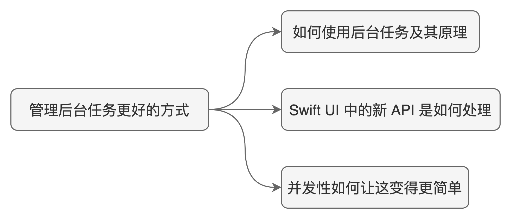

## 提出问题

### 如何在 SWiftUI 中使用后台任务，其背后的原理是什么

在本文中我们将涉及到以下知识点。

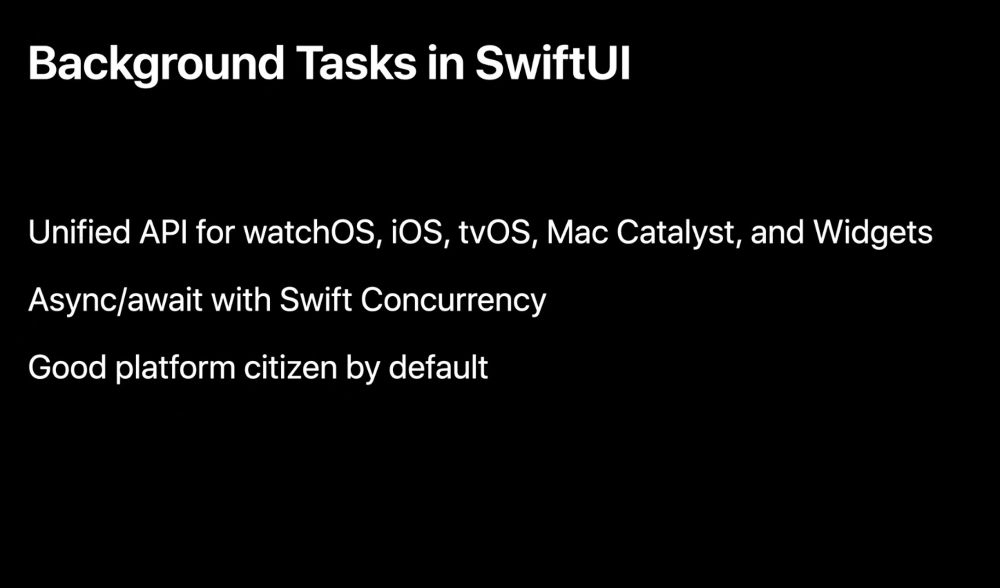

## 分析业务流程

我们将打造一个在每天中午检查用户当前天气情况，并在特定天气条件下提醒用户拍照，随后上传的 Demo App。业务流程如下：

1. 在特定时间以通知形式提醒用户拍照；

2. 用户点击通知进入 App ，拍照并上传至服务器；

3. 上传成功通知用户

这整个过程中，有多个步骤涉及后台任务执行和 App 挂起/激活状态的转换。

以一张图来示意即如下：

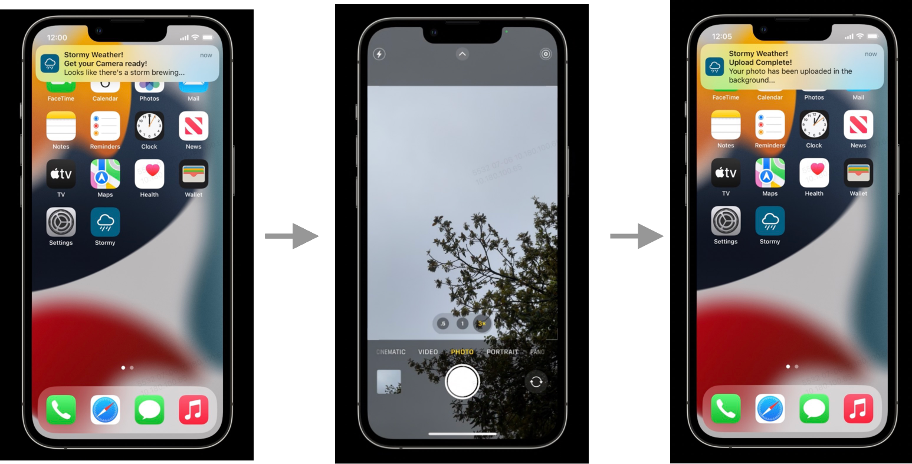

接下来我们借助时序图来探究这个过程中的细节和原理。

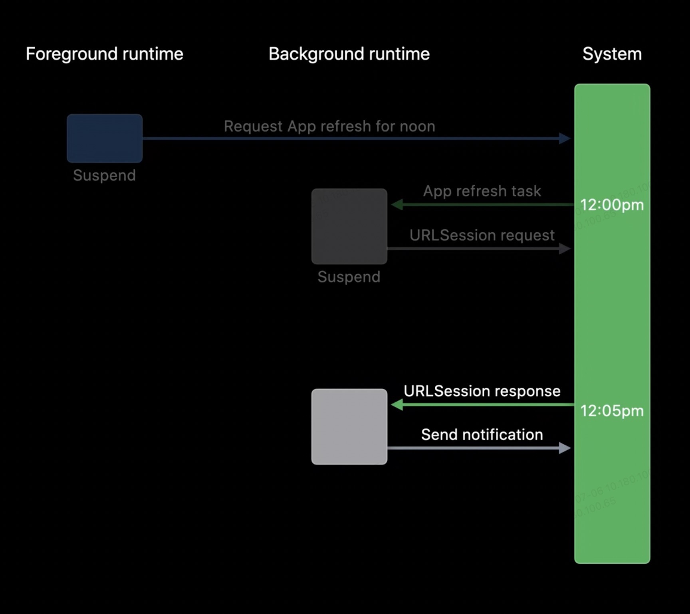

- 当用户第一次打开应用时（此时处于*前台状态*），我们便有了第一次机会来调度一个后台刷新任务；

- 随后用户离开应用，此时应用处于*挂起状态*，系统将会以我们前面指定的时间再次唤起应用。也即系统会在午间唤起应用同时发起一个后台应用刷新任务。但请注意，此时 App 状态为*后台状态*；

> 此时按照业务逻辑，我们应该检查当前是否是暴雨天，如果是则通知用户。
> 为此，我们需要发起一个天气查询服务的网络请求。

- 通过后台调度的 URLSession ，应用将会回到*挂起状态*并等待请求的完成；
- 当请求完成时，应用会因此再次获得一次*后台*运行时间。

到这一步，应用已经被唤起两次，同时也有了两次后台运行机会。拿到请求结果后就可以判断当前外面的天气情况是怎样的也决定了下一步是否需要提醒用户。

换个角度，我们以 *应用后台-系统调用* 这个角度再来梳理后台任务执行的细节。

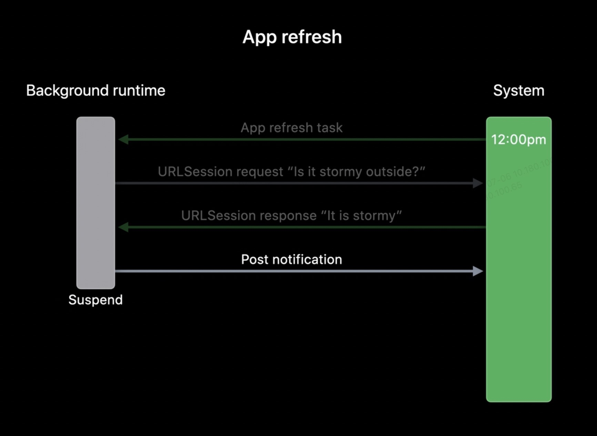

这个交互流程可以描述为：

1. 系统 --> 后台：App 刷新任务

2. 后台 --> 系统：发起天气服务接口请求

3. 系统 --> 后台：**理想情况下**，在系统分配的后台任务周期内完成了刷新任务

4. 后台 --> 系统：推送通知用户

5. 应用挂起

注意这里特别强调的是“理想情况下”，但是，正如我们日常所遇到的各种网络情况，网络请求不一定是可靠、及时的，假如，在一个后台周期内任务没有完成会发生什么？

对于熟悉后台任务的同学，应该清楚，答案就是系统会强制杀死应用，并且拒绝之后的后台任务的请求。而这个任务周期，则是 180s 以内。如此机制，正是系统出于性能考虑，因为后台状态下仍有可能出现高负载的任务。原则是后台任务不应耗费更多的系统资源，从而形成与前台任务的资源竞争，来保障前台 App 的使用体验。

但是换个角度想想，如果应用的后台运行时间不足的情况下，系统会通知到应用，可以让我们以更优雅的方式来处理，体验就会好很多。

为了达到这种效果，我们应该确保发起的请求是*后台网络请求*类型。这种类型的请求可以让我们立即完成 App 刷新任务，同时可以当网络请求完成时再次被分配额外的后台执行时间。

这样我们上面的交互就被拆分为 2 个后台任务：App 刷新任务，URLSession 接口请求任务。

## 实现细节

分析了业务逻辑，我们进入代码环节。

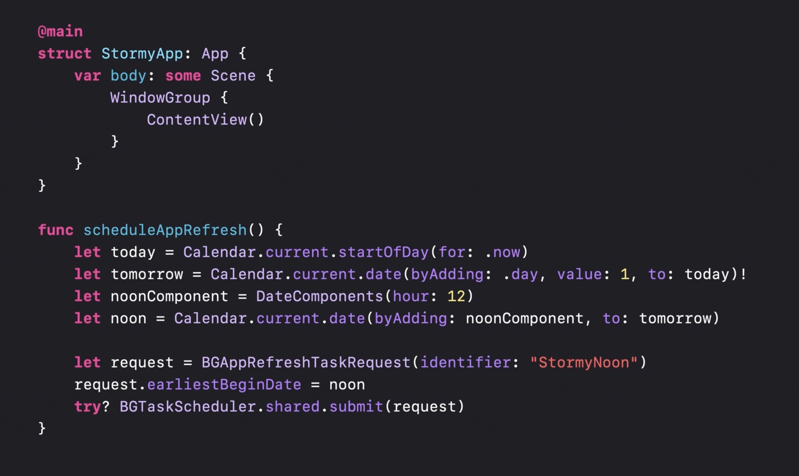

在一个基础的 SwiftUI 应用中，增加了一个调度后台刷新任务的任务的方法。

这个方法中我们创建了一个 `tomorrow`这个日期对象，然后通过 `BGAppRefreshTaskRequest` 初始化了一个后台刷新请求并提交给了系统调度器。

值得注意的是这里我们为这个后台任务请求指定了一个"`StormyNoon`" 标识符，这个标识符后面我们还会用到。

以上步骤，我们就成功发起了一个在指定时间（明天中午）要被出发的后台应用刷新任务的请求。

只是发起了后台任务请求这还不够，因为我们还需要处理由`系统-->后台`这个过程中在 App 后台状态需要执行的任务回调。

这也很简单，如下：

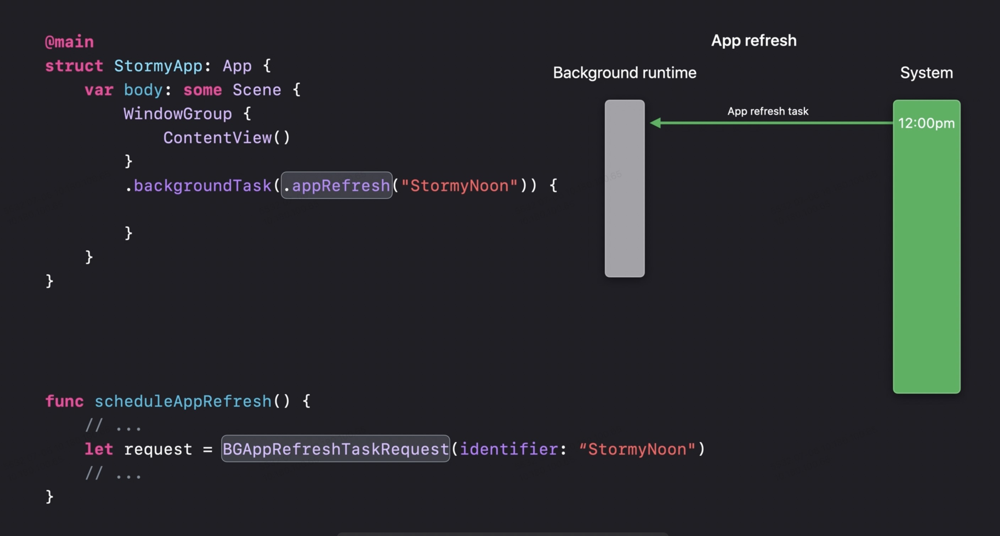

注意到，这里我们就用上了上面的"`StormyNoon`" 标识符，这个标识符告诉了系统，当应用前面申请的后台任务被触发时，当前这个后台任务处理代码块应被调起。

在这个后台应用刷新任务的回调中，我们应该实现天气状况检查和通知用户拍照的任务，代码如下：

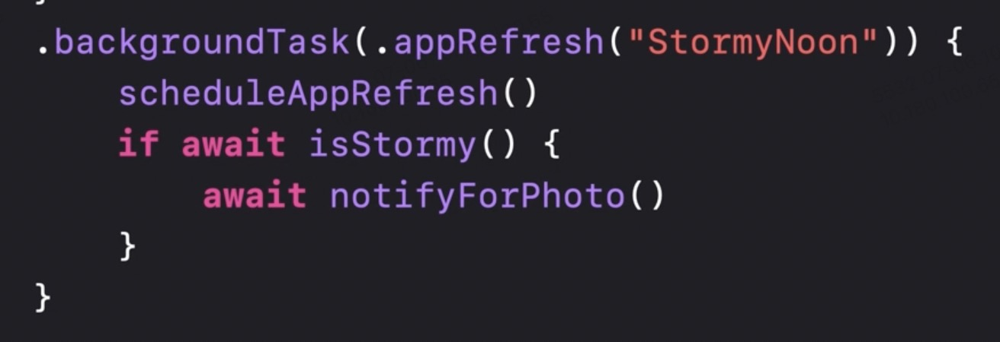

为了能够在第二天能够继续被调度，需要在这段处理程序中首先调用 `scheduleAppRefresh` 方法再发起一个新的后台刷新请求，如此便形成了一个周期重复性的定时任务。

这段代码中的 `isStormy()` 和`notifyForPhoto()` 方法是我们接下来要实现的，同时应注意，这里我们用上了 `await` 关键字来标识，也恰恰是使用上了 Swift 并发性。 这段代码执行完就意味着我们第一个后台应用刷新请求完成了，此时由系统调度的后台任务就会被标记为完成，随后应用再次挂起。

在这个过程中，应用被唤起且执行的代码，也只有这段与后台任务绑定了相同标识符的处理程序。

> [Swift Concurrency](https://docs.swift.org/swift-book/LanguageGuide/Concurrency.html)
> 并发特性是在 iOS 15+ ， Xcode 13+ ，及 Swift 5.5 后支持的一种新的语言特性，解决了异步代码如 completion\handler 之类造成的逻辑复杂，嵌套深等代码结构问题；同时更重要的是，使用了并发特性，在多核设备上更能发挥设备性能，例如一个 4 核心的处理器就可以同时处理 4 段标记了并发性的代码片段。

Swift 并发特性会在接下来被频繁的使用到。

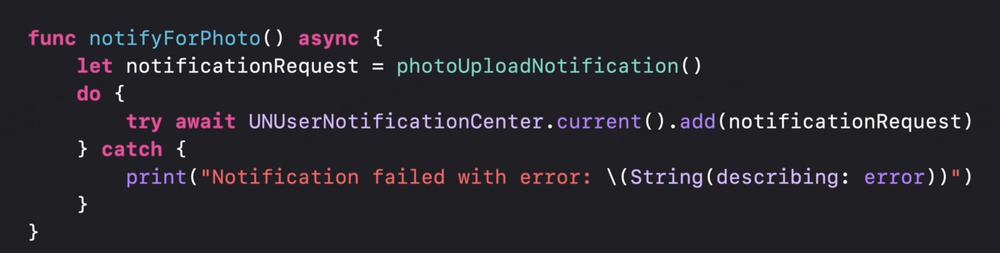

对于`notifyForPhoto()` 方法，我们只需要向通知中心添加一个通知，而这里向`UserNotificationCenter`添加通知的方法，也使用了并发性。

在接下来的`isStormy()`方法中，会使用 `async`/`await` 来完成一些更繁重的工作。

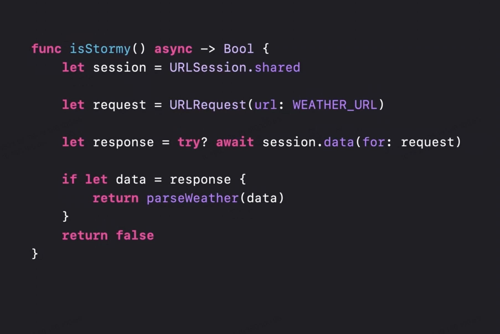

我们取的 `URLSession`单例并初始化一个天气服务的请求。`URLSession`已经采用了并发性，并且有一个可以被异步上下文等待的下载数据的方法。有了这个方法我们就可以去服务器查询当前的天气状况。

但是还记得前面提到的“后台任务周期”的概念吗？

网络是不可靠的，在一些情况下，请求的结果也不能确保能在执行周期内完成，怎么办？

答案就是，放弃共享单例，以后台请求会话的配置选项来初始化一个新的 `URLSession`对象。

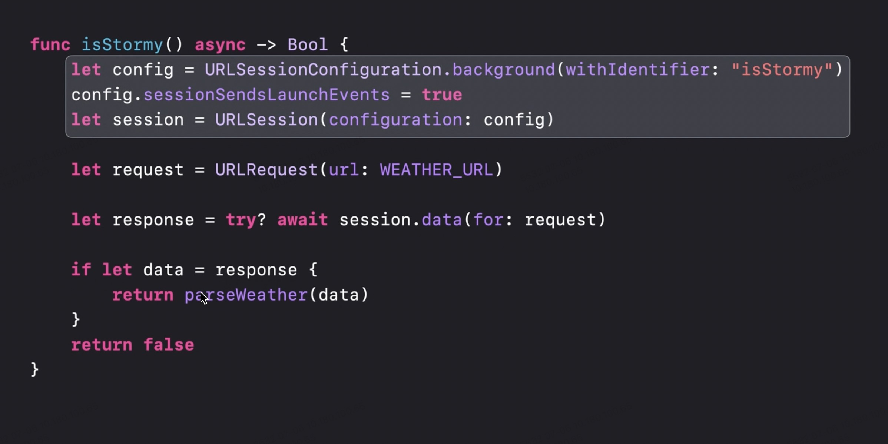

我们通过一个`sessionSendsLaunchEvents`属性为`true`的设置项来初始化一个新的`URLSession`对象。这样做的目的是告知系统，网络请求在应用挂起时需要继续运行，并在完成时唤醒 App。

> 这点在 watchOS 上尤其重要，因为所有在 watchOS 上运行的应用程序发出的网络请求必须通过后台 URLSessions 发起。

到这里我们还没有解决因网络超时而导致的后台任务未能完成的问题。

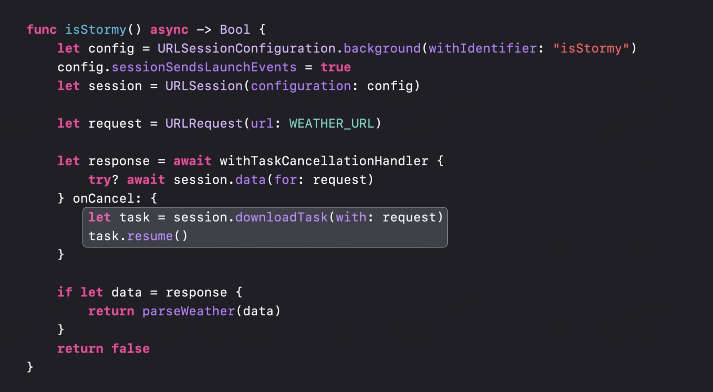

为了响应和取消处理程序的执行，我们可以使用 Swift 并发中内置的`withTaskCancellationHandler`函数。我们不再直接等待结果，而是将下载代码放到`withTaskCancellationHandler` 调用中，并等待这个结果。

这个函数参数中的第一个 block 是我们想要运行并等待的异步过程，第二个 onCancel 尾闭包是在任务取消时运行的代码。这样，当即时网络请求由于运行时过期而被取消时，我们将网络请求升级为一个后台下载任务，在这个任务上我们可以调用 resume 并触发后台下载，即使我们的应用挂起也会持续。

值得注意的是，这段代码并不会产生两次网络请求，因为我们使用相同的 `URLSession` 来发起这两次请求，而且 `URLSession` 会在底层删除任何进程内的重复请求。

最后别忘了实现，这个后台请求任务的处理程序。

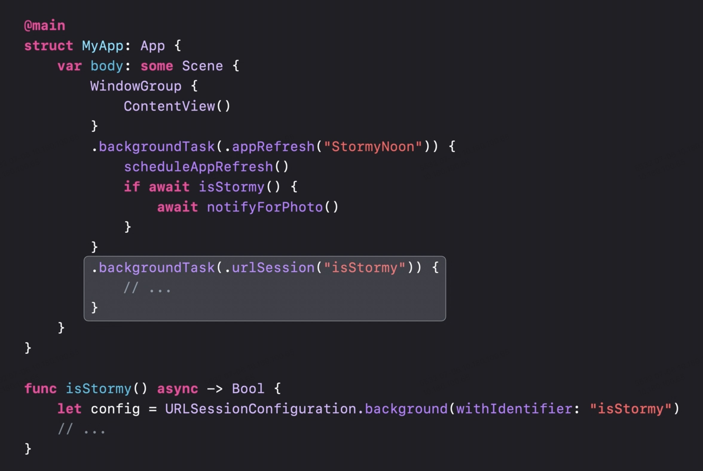

这里我们用到了另外一个后台任务标识符 “isStormy” 来标记检查天气请求的后台任务，与之匹配的是前面我们实例化的新的 URLSession 对象。这样我们就完成了天气检查服务后台任务的发起和处理工作。

## 回顾

我们来简单总结下在实现这个 App 时用到的技术点：

1. 后台任务的发起和处理应通过相同的标识符来一一匹配，即一个后台任务对应一个任务处理程序；

2. Swift 并发特性，为我们带来了更直观的逻辑顺序和代码层次结构，避免了多层嵌套可能引起的“嵌套地狱”；

3. 每个后台任务都有其执行的最大时间，规定时间内如果不完成执行，就会被系统毫不留情的杀掉。这就意味着，我们使用后台任务，时刻应该警醒这个时间线，同时以更谨慎的态度去处理后台任务处理程序；

4. `URLSession`可以支持后台请求，除了在实例化时配置后台任务标识符之外，就是要在`withTaskCancellationHandler`这个函数中升格请求为后台执行。

## 后记

后台任务，是官方基于性能、体验等多维度设计出来的功能特性。合理的使用，除了可以为用户带来更好体验之外，更能增加用户对 App 可靠性及信赖感的提升。同时应该意识到的是，后台任务是一把双刃剑，如果滥用，除了会被系统杀掉外，对用户的设备性能也有较大的损害，这是极其糟糕的体验。

举个例子，就在几年前我们项目中使用的一个第三方 SDK 用到了后台任务，但是使用方法却非常粗暴，申请了许多后台任务不说，还没有将任务和处理程序一一对应，任务超时的处理逻辑也缺乏考虑。这就造成了线上不断有客诉反馈“杀后台严重”。一开始我们也没有意识到是这个问题引起的，最后还是通过符号断点一个一个数才发现是这个 SDK 的锅。

至此，文章告于段落。

如果你想对`async/await`有更多的了解，可以参考 [Meet Async/await in Swift](https://developer.apple.com/videos/play/wwdc2021/10132/)，

如果你想 Swift UI 中的并发特性有更多的了解，可以参考 [Discover Concurrency in SwiftUI](https://developer.apple.com/videos/play/wwdc2021/10019/)

它们在 [《WWDC 2021 内参》](https://xiaozhuanlan.com/wwdc21)中也有介绍。

关于后台任务的更多知识，可以参考 [Background Tasks](https://developer.apple.com/documentation/backgroundtasks) 官方文档。
