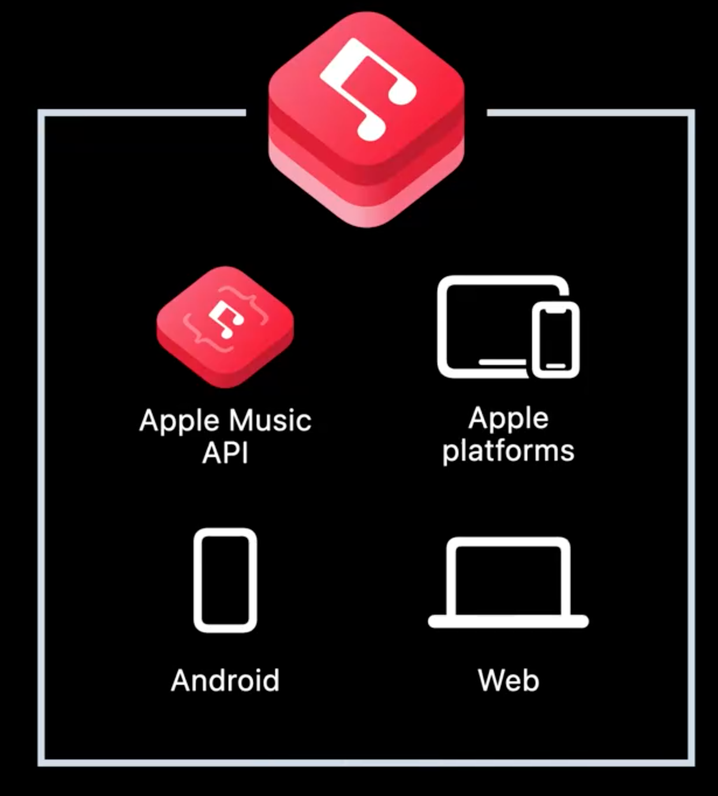
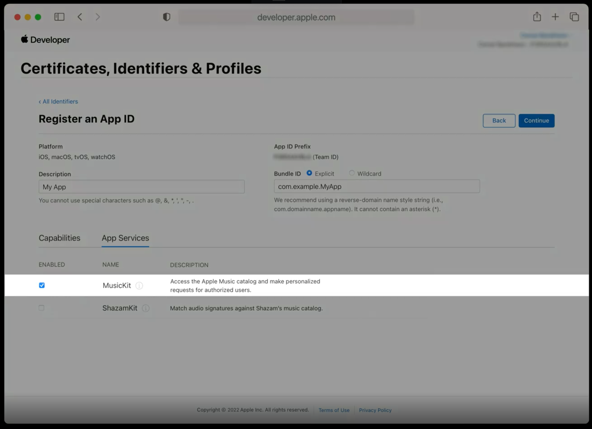
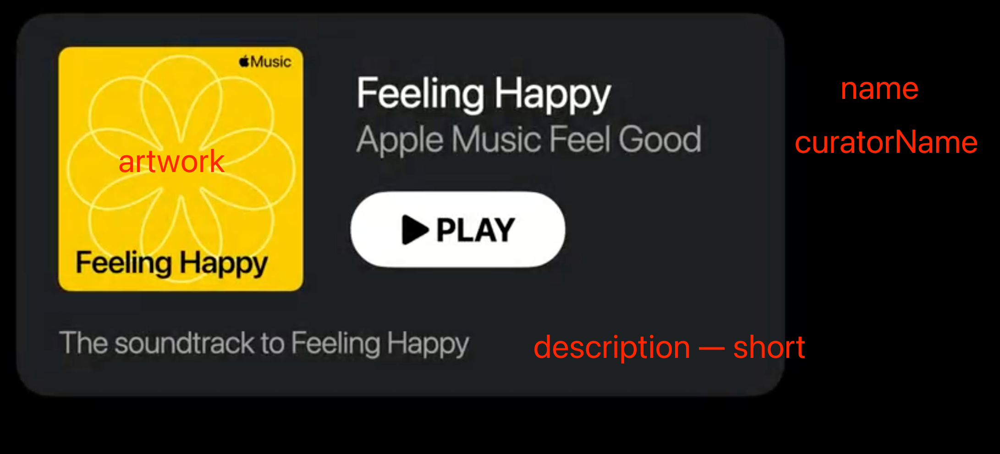
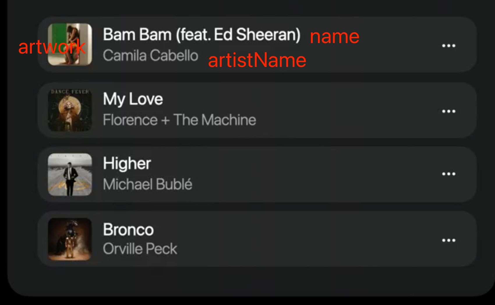
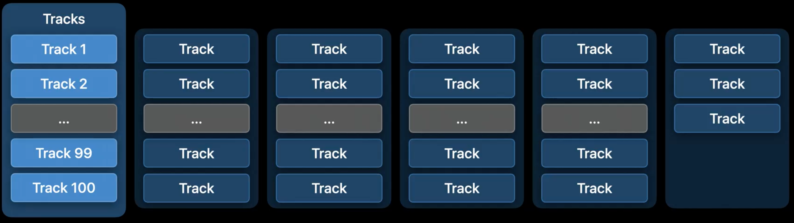

# 【WWDC22 10148】Meet Apple Music API & MusicKit

本文基于 session 10148 梳理

> 作者：SiriusLong ，目前就职于字节跳动中国音乐团队，负责音乐播放器相关业务。

## About MusicKit & MusicAPI

2017 年，Apple 首次推出 MusicKit 框架，并在 2021 年推出了一组 Swift API ，使对整个 Apple Music 访问和控制变得可能。

MusicKit 是一个将客户端框架（iOS 、Android、Web）和 Apple MusicAPI 结合起来的工具包。客户端通过 MusicKit 可以在   Apple Music 资料库中获取或搜索单曲、专辑、歌单，还可以在验证订阅者身份后，访问订阅用户的播放列表、播放历史，以及个性化推荐的内容。



使用 MusicKit 可以轻松的将 Apple Music 集成到自己的 App 中，换句话说，我们可以基于 Apple Music 在 APP 中扩展出更多的音乐内容。比如说 NIKE RUN CLUB ，其通过集成 Apple Music 将主打锻炼、运动类型的 App 扩展出了音乐模块。

## Abstract

本文简要介绍了 MusicKit & Apple MusicAPI 的背景和能力，并通过一个简单的需求，详细介绍了在播放列表、搜索等场景下 Apple MusicAPI 的使用。

## Integration

Apple MusicAPI 是提供给开发者访问和搜索曲库内容的一些服务端接口。（MusicAPI 可以在多平台使用，这里我们只聚焦于 iOS 平台）

为了能更直观的理解相关过程，我们假设一个需求场景：基于 Apple Music 构建一个播放列表，设计稿如下。


分析一下设计稿，我们可能需要准备以下数据：

- 歌单艺术封面

- 歌单名称

- 管理员详情

- 歌单描述

- 播放按钮状态

- 歌曲列表
  - 单曲艺术图
  - 单曲名称
  - 单曲艺人

为了能更聚焦本 session 内容，我们假设已经搭建好 UI 界面，只剩下数据的获取工作。

### 获取访问权限

我们需要为 APP 申请一个 Developer Token ，针对 apple 平台的应用，可以在 Apple Developer 网站注册 AppleID 地方，启用 MusicKit 服务。这样我们就可以利用 Musickit 进行自动令牌管理。



在配置好令牌之后，我们就可以开始尝试着使用相关接口，来请求资源。

### 请求资源

假设我们需要获取一个 ID 为 *p1.2b0e6e332fdf4* 美国地区曲库中的播放列表。通过查阅[API 接口](https://developer.apple.com/documentation/applemusicapi/get_a_catalog_playlist)，我们构造出了如下 URL：

> **URL:** https://*api.music.apple.com*/ *v1* */* *catalog / us* */* *playlists* */ p1.2b0e6e332fdf4* *?* *include=curator*

首先我们分析一下这个 URL 中包含的信息

*https://*api.music.apple.com*/* *v1* */* *catalog / us* */* *playlists* */ p1.2b0e6e332fdf4* *?* *include=curator*

​                          API 版本   xx 地区的曲库    内容类型  资源唯一标识    需要额外关联的元数据

该 URL 可以描述为`使用V1版本的api 向 applemusic 请求美国地区资料库中有关xxx标识的播放列表类型资源，且关联该资源管理员信息的元数据`

在请求成功后，我们会收到一个集合类型的 response ，其中`data` 数组中包含了我们请求的播放列表内容

```JSON
{
    "data":[
        {
            // ID和type是资源的唯一标识
            "id": "p1.2b0e6e332fdf4"
            "type": "playlists"
            //href 表示资源位置，与请求URL中一致
            "href":"/v1/catalog/us/playlists/p1.2b0e6e332rdf4".
            // 资源的元数据
            "attributes": {...}
            // 元数据中相关参数的映射内容
            "relationships": {
                "curator": {...}
                "tracks": {...}
            }
        }
    ]
}
```

这里需要关注 attributes 和 relationships 两个返回的实体

- attributes

```JSON
"attributes":
{
    // 歌单名称
    "name": "Feeling Happy",
    // 管理者名称
    "curatorName": "Apple Music Feel Good",
    // 歌单描述
    "description": {
        "short"; "The soundtrack to Feeling Happ
    }
    // 播放属性，包含是否可播等属性
    "playparams": {... },
    // 艺术图
    "artwork": {
        "width": 1080,
        "height": 1080,
        "url": "https://.../{w]x{h}SC.DN01.jpg"
    },
    ...
}
```

可以看出，attributes 主要包含歌单的一些元数据，或者说是歌单的一个摘要信息。



其中，歌单的封面艺术图信息在 artwork 实体中，并包含了一个可以指定宽高参数的图片 URL，这是 Apple MusicAPI 提供的新特性。也就是说我们可以根据设计稿中封面图的尺寸，通过设置 URL 宽高参数来获取定制的图片。

- relationships

在 attributes 的摘要信息中，我们拿到了所需的歌单基础信息，但 UI 设计稿中，管理员名称是可以点击，跳转到管理员详情页的。 还记得歌单的请求 URL 吗，`include=curator` 这时就派上了用途，但 curator 内容并不在 attributes 中，而是藏在了 relationships 实体里。relationships 中存放的就是该歌单相关的关联资源。

```JSON
"relationships " : {
    //管理员信息
    "curator": {
        "href""/v1/catalog/us/playlists/pl. . . /curator",
        "data": [ {
            "id":"15551720 ",
            "type": "apple-curators " ,
            "href" "/v1/catalog/us/apple-curators/15551720"} 
        ]
    }
    //歌曲列表
    "tracks "; {
        "href": "/v1/catalog/us/playlists/pl. . . /tracks",
        //单曲信息的集合
        "data" : [{
            "id""1332327867",
            "type": "songs",
            "href": "/v1/catalog/us/songs/1332327867 ",
            //单曲元数据
            "attributes " : { 
                //单曲艺人图
                "artwork": { ... },
                //单曲名称
                "name": "As It Was",
                //艺人名称
                "artistName": "Harry Styles",
                ...
            }
           },
           { ... },
           ...
        ]
    }
}
```

so~我们在 relationships 实体中拿到了 curator 的 href 即资源标识信息，这样 curator 成功更新为一个链接，用户就可以根据需要导航到详情页发现更多内容

> <https://api.music.apple.com/v1/catalog/curators/15551720>

通过分析 relationships 实体中的 tracks ，不难发现，MusicAPI 返回的数据结构十分套娃，因此通过 attributes 可以很轻松的获取到单曲的摘要信息，这样我们已经轻松完成了大部分需求。



### 资源控制

有些同学可能已经想到了一个 badcase ，当歌单中存在 1000 条甚至是更多的歌曲时，MusicAPI 会一股脑返回吗？不用担心，MusicAPI 为我们提供了分页能力。

默认情况下，仅包含播放列表的前 100 首歌曲。如果播放列表有超过 100 首歌曲，则必须通过分页来获取更多的附加歌曲。



假设我们通过上述 URL*`https://api.music.apple.com/v1/catalog/us/playlists/p1.2b0e6e332fdf4`* 获得了一个超过 100 首歌曲的歌单，response 如下

```JSON
// GET https://api.music.apple.com/v1/catalog/us/playlists/pl.2b0e6e332fdf4
{
    "data":[
     {
        "id" "pl.2b@e6e332fdf4 ",
        "type": "playlists",
        "href": "/v1/catalog/us/playlists/pl.2b0e6e332fdf4",
        "attributes " : {... },
        "relationships " : {
            "curator": { ... }
            "tracks": {
                "href":"/v1/catalog/us/playlists/pl.2b0e6e332fdf4/tracks ",
                "data": [...] // first 100 tracks
                "next": "/v1/catalog/us/playlists/pl.2b0e6e332fdf4/tracks?offset=100"
            }
     }
    ]
}
```

在 tracks 实体中，新增了 next 参数，改参数中 offset 表示下一次加载歌单的起始位置。在列表页面触发 loadmore 逻辑时，则需要使用包含 offset 的下一页请求，即*`https:.../v1/catalog/us/playlists/p1.2b0e6e332fdf4/tracks?offset=100`* 为保证偏移位置的准确有效性和避免资源重复，这里建议直接使用 next 参数返回的 href 进行分页请求。

当然我们也可以根据业务需要，自定义分页的数目限制，只需要在每一个请求的 URL 后加上 limit 参数，例如

*`https:.../v1/catalog/us/playlists/p1.2b0e6e332fdf4/tracks?offset=100&limit=200`*

需要注意的是，当资源被全部加载完成之后则不会返回 next 参数。

到这里，我们需求的完成度已经达到了预期，但是 PM 临时要求给我们的 App 增加搜索功能！需要通过用户的兴趣词搜索单曲和专辑内容！不要慌，Apple MusicAPI 也提供了曲库的搜索能力。

## Explore Search

> Apple MusicAPI 提供了使用搜索词在曲库中查找内容的能力。

假设我们已经通过加班来完成了搜索 UI 的搭建，只剩下和 server 交互的工作。

和前面请求播放列表的流程类似，我们拿到了用户的兴趣词 pop 。

首先，通过查阅[API 接口](https://developer.apple.com/documentation/applemusicapi/get_a_catalog_playlist)，我们构造出了如下 GET 请求的 URL：

```
https://api.music.apple.com/v1/catalog/us/search?term=pop&types=albums,songs&limit=10
```

我们分析一下这个 URL 中包含的信息

*https:// ...*  */ us* */* *search* *?* *term=pop&types=albums,songs*   *&* *limit=10*

​             xx 地区      term                   搜索参数                      自定义分页限制

该 URL 可以描述为 搜索美国地区曲库中属于流行类型的专辑和单曲，且对专辑和单曲返回的最大结果数限制为 10，分页获取。

请求成功后，我们可以获取如下 response

```JSON
//GET https://api.music.apple.com/v1/catalog/us/search?term=pop&types=albums,songs&limit=10
{
    "results": {
        //专辑匹配项
        "albums": {
            "href"; "/v1/catalog/us/search?limit=1e&term=pop&types=albums",
            "data": [... ],
            "next": "/v1/catalog/us/search ?offset=10&term=pop&types=albums ",
        }
        //单曲匹配项
        "songs": {
            "href": "/v1/catalog/us/search?limit=108term=pop&types=songs",
            "data":[... ],
            "next"; "/v1/catalog/us/search ?offset=10&term=pop&types=songs",
        }
    }
    "meta":
        "results": {
            "order": [ "albums ", "songs"]
        }
    }
}
```

其中，需要关注两个返回实体 results 和 meta

- results

该实体包含搜索项的匹配结果，匹配结果中包含 albums 和 songs 分页限制的信息。根据 data 实体中的 attributes 和 relationships ，可以很轻松的获取到搜索结果展示页面所需要的摘要信息。

需要注意的是，每一个资源中都包含了地址唯一标识 href ，在用户点击搜索结果中感兴趣的内容时，我们也能及时获取资源内容或者将资源地址交给下一个页面。

- meta

除了搜索项的结果，API 还返回了一组元对象，通过字段 order ，可以获取到搜索结果的排列顺序。这对多种内容类型的搜索场景来说，可以优化用户体验，和简化业务逻辑。

## Summary

本文简单介绍了 MusicKit 和 Apple MusicAPI，并通过一个简单的例子探索了一下将 Apple Music 集成到我们自己 APP 中的过程。

近两年，Apple 一直在增强和扩展 Music 相关的接口和功能，甚至推出了跨平台的使用方案。目前，若是想在自己的产品中扩展出音乐相关功能，可以选择将 Apple Music 嵌入到 APP 中，在 Musickit 和 Apple MusicAPI 的加持下，个人开发者或者中小型团队可以不用再在版权、推荐模型等音乐模块上耗费太多，而是可以把精力放在用户体验上和更多玩法上。期待激发出更大的创造 ~
