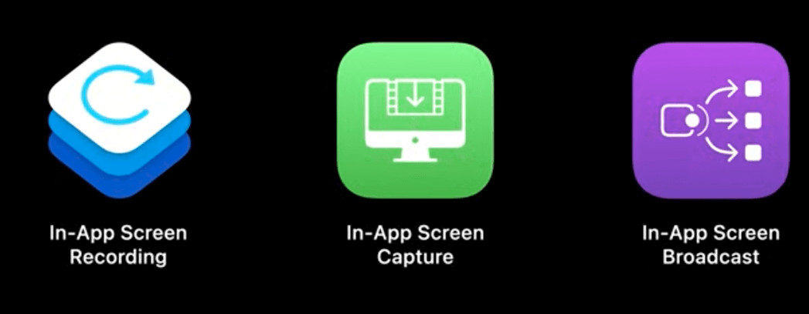
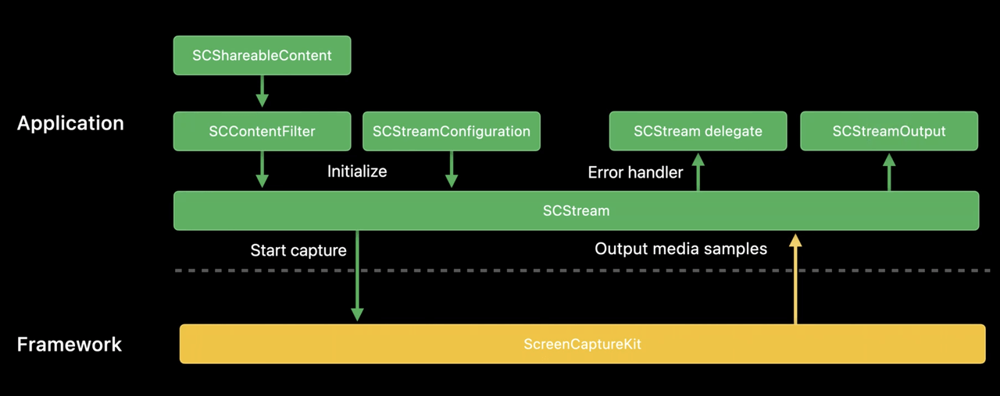
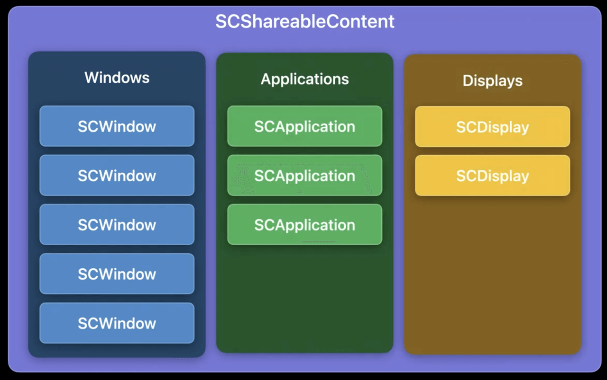
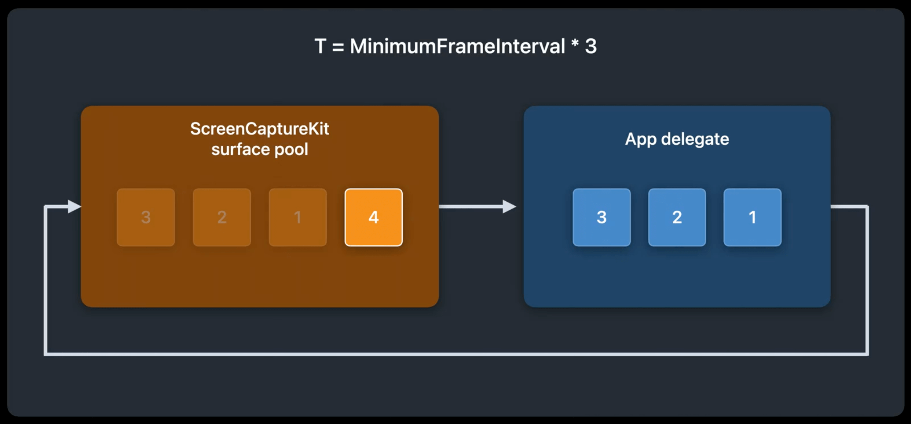

# WWDC22 10155 - ScreenCaptureKit：MacOS 上的高性能屏幕录制框架

## 导言

屏幕录制一直以来都是一个桌面系统需要提供的基本能力，可以应用到很多场景，例如：视频会议中的桌面共享、电脑游戏直播、远程桌面控制等。 今年的 WWDC 苹果新推出了一个 MacOS 上的高性能屏幕录制框架 ScreenCaptureKit。 ScreenCaptureKit 不仅通过提供更加易于理解的 API 来简化开发成本，还大大提升了屏幕录制的性能，以便 MacOS 用户可以获得更佳的使用体验。

> 本文主要信息来源于以下两个 WWDC session：
>
> - Session 10155 [Take ScreenCaptureKit to the next level](https://developer.apple.com/videos/play/wwdc2022/10155)
>
> - Session 10156 [Meet ScreenCaptureKit](https://developer.apple.com/videos/play/wwdc2022/10156)

## ScreenCaptureKit 前时代

在介绍 ScreenCaptureKit 之前，我们先看看苹果在推出 ScreenCaptureKit 前，MacOS 下有哪些主要的方法可以进行屏幕录制。

### [AVCaptureScreenInput](https://developer.apple.com/documentation/avfoundation/avcapturescreeninput?language=objc)

与正常采集摄像头视频流数据一样，将 AVCaptureScreenInput 作为 AVCaptureSession 的输入源，就能得到当前的屏幕图像数据。 这种方式的优点是：

- 可以通过调整`scaleFactor`来指定分辨率。
- 可以配置是否包含鼠标光标。
- 性能很好，可以达到 60fps，CPU 占用不显著。

不过也有显著的缺点，可定制性较差：

- 只能捕获整个屏幕，不能忽略窗口抓屏，不能只捕获某个窗口

### [CGDisplayStreamCreate](https://developer.apple.com/documentation/coregraphics/1455170-cgdisplaystreamcreate?language=objc)

使用[CGDisplayStreamCreate](https://developer.apple.com/documentation/coregraphics/1455170-cgdisplaystreamcreate?language=objc) API 可以不通过 AVCaptureSession 直接创建一个屏幕图像数据流。 与 AVCaptureSession + AVCaptureScreenInput 的方式类似。优势：

- 可以通过来参数指定分辨率。
- 可以配置是否包含鼠标光标。
- 实时屏幕流，可以增量，性能很好，CPU 占用不显著。

也有同样的缺点，可定制性较差：

- 只能捕获整个屏幕，不能忽略窗口抓屏，不能只捕获某个窗口

### [CGDisplayCreateImage](https://developer.apple.com/documentation/coregraphics/1455691-cgdisplaycreateimage?language=objc)

[CGDisplayCreateImage](https://developer.apple.com/documentation/coregraphics/1455691-cgdisplaycreateimage?language=objc) 以及 [CGDisplayCreateImageForRect](https://developer.apple.com/documentation/coregraphics/1454595-cgdisplaycreateimageforrect?language=objc) 系统 API 可以直接截取当前屏幕的图像。相对于视频采集 API， 这种方式的优点是：

- 可以排除特定窗口，抓屏时会自动忽略掉所有 sharingType 为 NSWindowSharingType::*NSWindowSharingNone 的 NSWindow*

但是缺点也很多：

- 无法指定分辨率， 只能是显示到屏幕的物理分辨率。
- 不能只抓去特定的窗口。
- 抓屏时会同时包含鼠标光标，无法去除。
- 调用开销比较大，CPU 占用显著提高，帧率不可控。
- 输出数据类型是 CGImageRef，需要应用层转换成原始数据

### [CGWindowListCreateImageFromArray](https://developer.apple.com/documentation/coregraphics/1455730-cgwindowlistcreateimagefromarray?language=objc)

[CGWindowListCreateImageFromArray](https://developer.apple.com/documentation/coregraphics/1455730-cgwindowlistcreateimagefromarray?language=objc) 以及 [CGWindowListCreateImage](https://developer.apple.com/documentation/coregraphics/1454852-cgwindowlistcreateimage?language=objc) 系统 API 可以获得对应窗口的图像。虽然不可以指定任意分辨率抓屏，但是可以通过 CGWindowImageOption 参数选择按照原始物理分辨率抓屏（kCGWindowImageBestResolution），还是坐标分辨率抓屏（kCGWindowImageNominalResolution）。 同时也可以灵活控制捕获或者忽略特定窗口。

相对缺点是：

- 最小化或者被隐藏的窗口无法捕获图像
- 无法捕获到鼠标光标的图像，需要额外处理
- 和 CGDisplayCreateImage 类似，调用开销比较大，CPU 占用显著提高。
- 输出数据类型是 CGImageRef，需要应用层转换成原始数据

### ReplayKit

还有一个取巧的方法，我们都知道在 iOS 平台有一个 ReplayKit 的框架，支持在 iOS 设备上抓屏。 近年来苹果在推动各个平台融合，ReplayKit 也被移植到 Mac 平台上了。 因此也可以通过 ReplayKit 在 Mac 上实现抓屏。参考 WWDC 2020 ReplayKit 相关 session。
[Capture and stream apps on the Mac with ReplayKit - WWDC 2020 - Videos - Apple Developer](https://developer.apple.com/wwdc20/10633)



相对于其他方案 ReplayKit 的优点是：

- 能够捕获当前应用输出的音频
- 性能相对较好

但是 ReplayKit 也有很大的限制：

- ReplayKit 在 Mac 上仅可以实现当前应用的屏幕录制，因此也限制了应用场景
- 捕获图像不会包含鼠标光标

### 总结

在 ScreenCaptureKit 之前， macOS 上捕获特定窗口图像和捕获性能不可兼得。相关 API 使用起来也相对复杂，可配置性也不高。这些都促使了 ScreenCaptureKit 的推出。

## ScreenCaptureKit

ScreenCaptureKit 集合了以前所有抓屏方法的优点，提供

- 提供整个屏幕、应用、窗口等不同级别的捕获能力
- 支持配置是否包含鼠标光标图像，输出的像素格式、色彩空间，帧率以及分辨率。 帧率和分辨率最高可与实际显示器显示的帧率分辨率一致。
- 支持以应用级别的声音采集，配置音频采集通道数量和采样率， 最高可达双通道 48khz 采样率
- 支持动态的选择捕获图像内容，以及动态的配置捕获参数
- 高性能： 充分利用 GPU 能力，低 CPU 消耗
- 隐私体验：苹果生态的隐私权限控制

### 总体架构

ScreenCaptureKit 提供了一套易于理解的 Swift 风格的 API 。结构如下：



应用层使用 ScreenCaptureKit 的核心对象是 `SCStream` ，`SCStream` 可以创建多个实例，每个实例相互独立，可以同时进行多路屏幕图像的捕获。

创建一个`SCStream` 对象，需要提供内容过滤器（`SCContentFilter`）和配置参数（`SCStreamConfiguration`）来控制捕获屏幕图像的内容。 通过配置 SCStream delegate 来处理屏幕捕获过程中的错误，通过配置 `SCStreamOutput` 对象来获得捕获到的数据。

```Swift
// 使用过滤器和流配置创建捕获流
stream = SCStream(filter: filter, configuration: streamConfig, delegate: self)

// 添加流输出以捕获屏幕和音频内容
try stream?.addStreamOutput(self, type: .screen, sampleHandlerQueue: screenFrameOutputQueue)
try stream?.addStreamOutput(self, type: .audio, sampleHandlerQueue: audioFrameOutputQueue)

// 启动捕获会话
try await stream?.startCapture()      

// ...
// 错误处理委托
func stream(_ stream: SCStream, didStopWithError error: Error) {
    DispatchQueue.main.async {
        self.logger.error("Stream stopped with error: \(error.localizedDescription)")
        self.error = error
        self.isRecording = false
   }
}
// SCStreamOutput protocol 实现
func stream(_ stream: SCStream, didOutputSampleBuffer sampleBuffer: CMSampleBuffer, of type: SCStreamOutputType) {
    switch type {
    case .screen:
        handleLatestScreenSample(sampleBuffer)
    case .audio:
        handleLatestAudioSample(sampleBuffer)
    }
}

// ...
// 停止捕获会话
try await stream?.stopCapture()    
```

这样看起来是不是很简单？ 虽然使用起来很简单，但是 ScreenCaptureKit 提供的定制化能力却是强大的，接下来我们再详细看一看各个部分是怎么配置的。

### ShareableContent

ShareableContent 是一个用来枚举当前系统可以被用来屏幕录制的实体的工具。我们能够通过它对应的数组属性得到当前有效的 SCDisplay， SCRunningApplication， SCWindow 对象。



其中：

- SCDisplay： 表示连接到 Mac 的物理显示器。可以通过此对象获得显示屏幕的唯一标识和分辨率坐标信息
- SCRunningApplication：表示在屏幕上显示的应用。 可以通过此对象获得应用的应用名称、bundleIdentifier 以及主进程的进程 ID
- SCWindow： 表示在屏幕上显示的窗口。可以通过此对象获得显示窗口的区域范围、标题名称、所属应用、相对其他窗口的层级等相关信息。

ShareableContent 对象不能被应用层创建，需要通过其四个 class 异步方法构造。例如下列代码表示仅包含显示在当前屏幕上的窗口，并包含如 Finder、dock 等系统基础内容：

```Swift
// Get the content that's available to capture.
let content = try await SCShareableContent.excludingDesktopWindows(
    false,
    onScreenWindowsOnly: true
)
```

其他的构造方法大同小异，可以参考苹果官方文档：[SCShareableContent](https://developer.apple.com/documentation/screencapturekit/scshareablecontent)

### 如何控制捕获内容

`SCContentFilter` 顾名思义这是一个用来控制共享内容的对象。  可以通过一系列的构造方法来创建`SCContentFilter` 对象。通过`SCContentFilter` 对象我们可以指定需要显示或者排除哪些应用或者窗口。

#### 创建过滤器

##### 只捕获特定的窗口

```Swift
SCContentFilter(desktopIndependentWindow: SCWindow)
```

通过此方法创建的内容过滤器，只包含一个窗口。

##### 屏幕捕获特定的窗口

```Swift
SCContentFilter(display: SCDisplay, including: [SCWindow])
```

通过此方法创建的内容过滤器，会包含多个窗口，同时包含屏幕桌面和菜单栏。 这里需要注意的是如果应用运行过程中新增了窗口，是不会自动将其添加到捕获内容中的。

##### 捕获屏幕内容但是排除特定的窗口

```Swift
SCContentFilter(display: SCDisplay, excludingWindows: [SCWindow])
```

通过此方法创建的内容过滤器，会包含屏幕上所有窗口，同时包含屏幕桌面和菜单栏。 只有特定的窗口不会包含其中。

##### 屏幕捕获特定的应用

```Swift
SCContentFilter(
    display: SCDisplay,
    including: [SCRunningApplication],
    exceptingWindows: [SCWindow]
)
```

通过此方法创建的内容过滤器，会包含多个应用的窗口，同时包含屏幕桌面和菜单栏。 此时如果应用新增了一个窗口例如 Safari 新开了一个窗口，会自动添加到捕获内容中。

##### 捕获屏幕内容但是排除特定的应用

```Swift
SCContentFilter(
    display: SCDisplay,
    excludingApplications: [SCRunningApplication],
    exceptingWindows: [SCWindow]
)
```

通过此方法创建的内容过滤器，会包含屏幕上所有窗口，同时包含屏幕桌面和菜单栏。但是排除指定应用的所有窗口。

exceptingWindows 这个参数有点特殊。里面所列的窗口，如果在前面的规则里被包含了，则将其指定为例外会将其从输出中排除。同样，如果在前面的规则里被排除了，则会将其包含在输出中。

更多信息可以参考苹果官方文档：[SCContentFilter](https://developer.apple.com/documentation/screencapturekit/sccontentfilter)

#### 捕获音频内容

目前 ScreenCaptureKit 捕获音频内容是以一个应用为基础单位的。 因此即便是只排除应用的一个窗口，应用的整个声音也不会被捕获。

#### 源窗口变化

当源窗口大小被用户改变时，频繁更改流输出分辨率可能会导致额外的内存分配，因此不推荐。流输出分辨率大多是固定的，并且它不会随源窗口调整大小。我们可以通过输出流附加数据来识别这个变化，以便在展示时进行正确的调整处理。 输出流附加数据相关概念会在捕获流输出部分详细介绍。

当源窗口被遮挡或部分遮挡时，捕获流输出总是包含窗口的全部内容。例如窗口完全离开屏幕或移动到其他显示器的情况。而当源窗口最小化时，捕获流输出将暂停，直到源窗口不再最小化时恢复。

#### 动态更新捕获内容

除了在创建 SCStream 对象时必须指定内容过滤器 SCContentFilter 外， SCStream 也支持动态更新内容，通过下面的代码随时改变要捕获的内容。

```Swift
try await stream?.updateContentFilter(filter) 
```

### 如何控制捕获行为

`SCStreamConfiguration` 配置了一系列捕获参数。 例如输出分辨率、帧率、是否包含鼠标光标、是否捕获应用音频等。为开发者提供了强大的定制能力。 下面是一份基础的配置：

```Swift
// 创建 SCStreamConfiguration 对象
let streamConfig = SCStreamConfiguration()
        
// 设置输出分辨率
streamConfig.width = 1920
streamConfig.height = 1080

// 设置帧率 （每帧间隔时间）
streamConfig.minimumFrameInterval = CMTime(value: 1, timescale: CMTimeScale(60))

// 设置是否隐藏鼠标光标
streamConfig.showsCursor = false

// 设置是否捕获音频数据
streamConfig.capturesAudio = true

// 设置捕获音频数据参数 采样率 48khz，双声道立体声
streamConfig.sampleRate = 48000
streamConfig.channelCount = 2
```

更多配置信息可以参考苹果官方文档：[SCStreamConfiguration](https://developer.apple.com/documentation/screencapturekit/scstreamconfiguration)

#### 动态更新配置

除了在创建 SCStream 对象时必须指定`SCStreamConfiguration`外， SCStream 也支持动态更新输出配置，通过下面的代码可以在捕获过程中，随时改变输出配置。

```Swift
try await stream?.updateConfiguration(streamConfig) 
```

> 动态更新配置的一个典型的场景是动态的更新分辨率和帧率。 在视频会议的屏幕共享场景下，会期望在静态内容分享时使用较低的帧率和较高的分辨率。 而分享如视频等动态内容时采用较高的帧率但是较低的分辨率。

### 如何得到捕获的数据

要想得到捕获的数据，需要实现 `SCStreamOutput` 协议。 并将处理数据的对象在开始捕获前配置到 SCStream 中。屏幕捕获流和音频捕获流需要分开配置。同时可以指定接收数据的调度队列。

```Swift
添加流输出以捕获屏幕和音频内容
try stream?.addStreamOutput(screenOutput, type: .screen, sampleHandlerQueue: screenFrameOutputQueue)
try stream?.addStreamOutput(audioOutput, type: .audio, sampleHandlerQueue: audioFrameOutputQueue)
```

和采集摄像头数据一样，随着流的启动和运行，只要有新帧可用，应用程序就会收到帧更新，数据格式是 CMSampleBuffer。对于屏幕捕获流帧输出包括表示捕获帧的 IOSurface 以及每帧的元数据。

#### IOSurface 缓存池

IOSurface 是跨多个进程共享硬件加速缓冲区数据（帧缓冲区和纹理）。能够更有效地管理图像内存。对于屏幕捕获数据流， 每个返回给应用层的 CMSampleBuffer 实际引用了一个 IOSurface。

ScreenCaptureKit 内部维护了一个 IOSurface 的缓存池。可以通过`SCStreamConfiguration`的 queueDepth 属性来配置其大小。queueDepth 取值范围是 3 到 8 未配置情况下取最小值 3。 也就是意味着默认情况下有 3 个 IOSurface 缓存。

缓存队列深度设置多少，取决于应用场景。更多的 queueDepth 可以达到更高的帧率，更低延迟，但是也会消耗更多的内存。当应用层持有 IOSurface 进行数据处理时，ScreenCaptureKit 会使用空闲的 IOSurface 缓存来存储捕获的屏幕数据流。 如下图所示，当 queueDepth 为 4 的时候， 如果应用层持有 3 个 IOSurface 缓存，ScreenCaptureKit 内部就只剩下一个 IOSurface 缓存用于捕获屏幕图像了。



这里需要注意的是当应用层持有所有的 IOSurface 缓存后，ScreenCaptureKit 没有可用的缓存，则会造成丢帧。 应用层需要根据应用场景及时释放 IOSuface 缓存。

#### 附加数据

可以通过下列代码从 CMSampleBuffer 中获得视频帧的一些附加数据。附加数据是一个字典， key 定义类型为 [SCStreamFrameInfo](https://developer.apple.com/documentation/screencapturekit/scstreamframeinfo) 。

```Swift
guard let attachmentsArray = CMSampleBufferGetSampleAttachmentsArray(sampleBuffer, 
                                                          createIfNecessary: false) as? 
                                                         [[SCStreamFrameInfo, Any]], 
        let attachments = attachmentsArray.first else { return }

        let contentRect = attachments[.contentRect]
        let contentScale = attachments[.contentScale]
        let scaleFactor = attachments[.scaleFactor]
        ...

    }
```

都有哪些附加数据呢？最基本的有 displayTime 表示当前图像的时间戳。status 表示当前缓存的状态。此外还有一些图像数据内容相关的附加数据，下面重点介绍一下。

##### DirtyRect

比较特别的一个附加数据是 DirtyRect （脏区域）， 它表示和上一帧数据相比，本帧数据在哪些区域发生了变化。一般情况下，DirtyRect 大小会远远小于需要完整的图像大小。这个数值可以让编码器减少计算帧间差异的工作从而提高性能。 对于一些简单的应用场景也可以通过一些策略，减少编码和传输的数据量。

##### contentRect 和 contentScale

前文提到过一般情况下，不会根据源窗口的大小变化而改变输出的分辨率。 那么怎么识别源窗口的大小变化呢？ 就是通过 contentRect 和 contentScale。 ScreenCaptureKit 会保证输出缓存包含完整的源窗口。contentScale 记录对源窗口大小的缩放比例。如果源窗口的长宽比和输出缓存的长宽比不同，则输出缓存会有一部分没有内容填充。 contentRect 记录着实际有内容填充的区域。

##### scaleFactor

对于一些视网膜屏幕，会使用 4 个物理像素点来表示一个逻辑像素点，以达到更好的视觉体验。 ScreenCaptureKit 会以物理像素点来采集数据。因此从视网膜屏幕捕获的数据会从普通屏幕捕获的数据大 4 倍。如果在普通屏幕上显示大小就和直观体验不一致了。 scaleFactor 信息记录了这个比例，应用层可以据此调整显示大小。

### 错误处理

在创建 SCStream 时可以传递一个 SCStreamDelegate 对象来处理运行时错误。 在调用开启捕获、更新内容或参数等 API 时，也可能会返回错误。错误类型为 SCStreamError，其具体含义及处理方式可以参考文档 [Error Constants](https://developer.apple.com/documentation/screencapturekit/scstreamerror/error_constants)。

## ScreenCaptureKit 的优势和限制

对比以前的屏幕捕获 API，ScreenCaptureKit 提供了方便灵活的控制抓取内容的能力，使用方法和概念也和 CGDisplayStream 系列 API 类似，十分方便迁移。同时性能也大大提升了。

根据苹果 OBS studio 工程师对 ScreenCaptureKit 性能的评估。在同一个复杂场景下，CGWindowListCreateImage API 会有严重的卡顿，只能做到每秒 7 帧， 而使用 ScreenCaptureKit 则可以达到 60 帧，画面平滑流畅。内存使用降低了 15%， CPU 占用率降低了一半。可以说性能十分优异。

ScreenCaptureKit 还支持同时多路窗口捕获，得益于其高超的性能，通过合理的配置能够提供优秀的体验。例如苹果在介绍 ScreenCaptureKit 时展示的窗口选择器。

不过目前 ScreenCaptureKit 只支持 MacOS 12.3+，Mac Catalyst 15.4+ ，是比较新的操作系统。 这意味着如果应用需要支持更老的操作系统，兼容性还是需要考虑的。此外 ScreenCaptureKit 音频采集还是应用级别的， API 文档中很多音频相关的 API 还被标注为 Beta，这意味着以后还有变化的可能。

## 应用场景展望

通过苹果公布的 WWDC session 视频已经可以看出 ScreenCaptureKit 在 facetime shareplay 中共享屏幕，游戏直播 OBS 推流等领域已经开始应用了。 其具有高性能、可定制、易使用等特点。相信很快就会在 Mac 上的视频会议中的桌面共享、电脑游戏直播、远程桌面控制等场景中广泛普及开来。不过由于其需要的 MacOS 版本较高，完全替代其他技术还需要一段时间。 另外音频的捕获是对之前的屏幕捕获的新增能力，也还需要一段时间来进一步完善。

## 参考资料

- [CMSampleBuffer | Apple Developer Documentation](https://developer.apple.com/documentation/coremedia/cmsamplebuffer-u71)
- [ScreenCaptureKit | Apple Developer Documentation](https://developer.apple.com/documentation/screencapturekit)
- [Meet ScreenCaptureKit](https://developer.apple.com/videos/play/wwdc2022/10156)
- [Take ScreenCaptureKit to the next level](https://developer.apple.com/videos/play/wwdc2022/10155)
