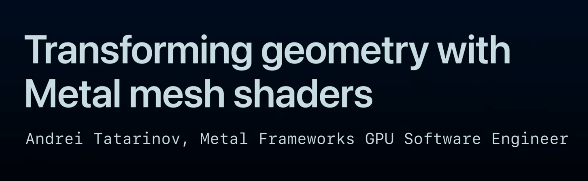

## 个人介绍

ysunwill，iOS开发

## 审核介绍

要求待补充...
要求待补充...
要求待补充...

## 不超过 120 个字的文章简介

本文主要讲述Metal 3 新推出的网格渲染管线，其中包括对象着色器（Object Shader）和网格着色器（Mesh Shader），文章分为三个部分：

- **第一部分**，新旧渲染管线对比，对网格渲染管线有个初步认识
- **第二部分**，通过两个具体的例子，更深入地感受网格渲染管线
- **第三部分**，网格渲染管线的一些限制，包括着色器限制以及运行新管线的设备要求

## 公众号/小专栏图文头图

