# WWDC22 10162 - 使用网格着色器处理几何变换

本文基于 WWDC22 10162 [Transform your geometry with Metal mesh shaders](https://developer.apple.com/videos/play/wwdc2022/10162/) 整理，主要介绍 Metal 新一代着色器 - `网格着色器`。请注意，网格着色器目前还是 Beta 版本，后续可能会有更新或改变。

> 作者：yunwill，iOS 开发
>
> 审核：

## 前言

**Metal**，是苹果主推的面向底层的图形编程接口，基于自家的硬件优化，支持出色的性能并降低开销。时隔 5 年，Metal 3 发布，必然带来一些新的特性，其中之一就是`网格着色器（Mesh Shaders）`。网格着色器其实并不是新产物，此前 NVDIA、AMD、Intel 也都支持类似功能的着色器。

> 注意：
>
> **Mesh Shaders 其实是指`Object Shader`和`Mesh Shader`。**

**网格渲染管线**，由 GPU 驱动（GPU-driven）的新一代几何渲染管线，类似于 compute kernel，其中包括：

- `对象着色器（Object Shader）`，顾名思义，主要是处理对象的。对象是一个抽象概念，比如场景模型、程序生成的空间区域等。
- `网格着色器（Mesh Shader）`，用来处理网格，并输出几何数据给光栅化器。

总体来说，GPU 驱动的核心思路就是减少 CPU 和 GPU 之间的通信，将渲染相关的事务更多地交由 GPU 处理。新的管线可以替代传统的几何渲染管线，相对比传统渲染管线，网格渲染管线更加灵活，潜力也更大。它的应用十分广泛，比如：

- 细粒度的几何剔除

- 基于 GPU 的可扩展的程序（procedual）生成

  注：程序生成，也可以理解为`过程生成`、`随机生成`

- 自定义几何输入，比如压缩顶点数据流（compressed vertex streams）、网格片段（meshlets）、复杂的程序生成算法（complex procedural algorithms）

## 传统渲染管线 VS 网格渲染管线

假如我们要渲染这只经典的斯坦福兔子，如下图：

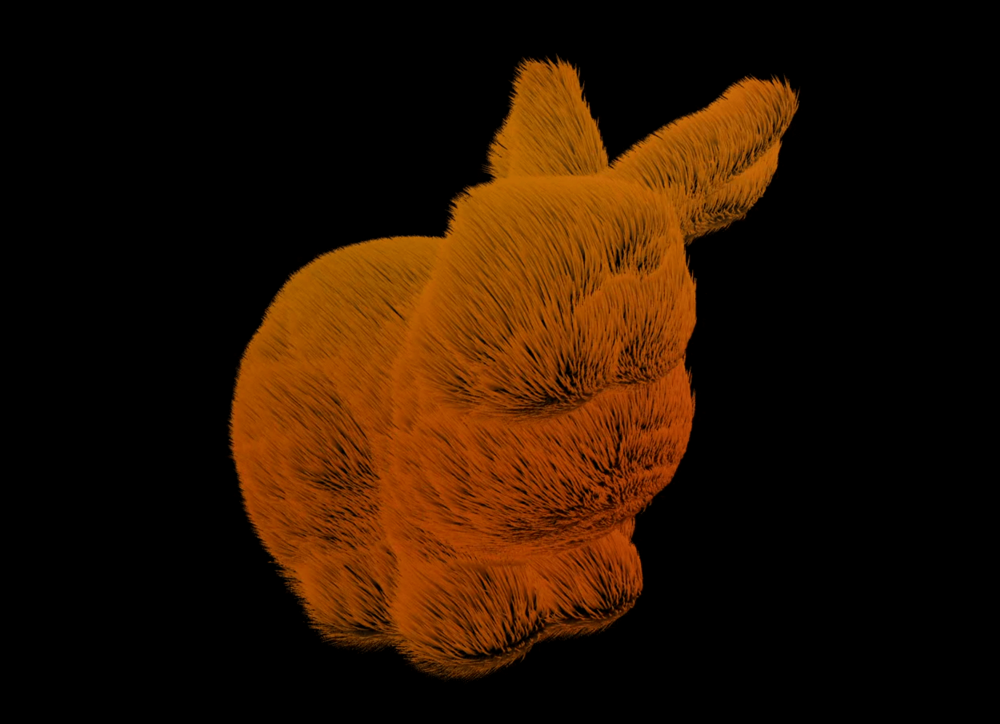

### 传统渲染管线（Traditional rendering pipeline）

主要流程：

- 创建计算命令编码器
  - 从内存中读取网格数据（顶点数据）
  - 处理网格数据，输出几何数据
  - 将几何数据写回内存
- 创建渲染命令编码器，调用传统 draw call
  - 顶点着色器处理刚才生成的几何数据
  - 光栅化
  - 片元着色器处理，最后生成图像

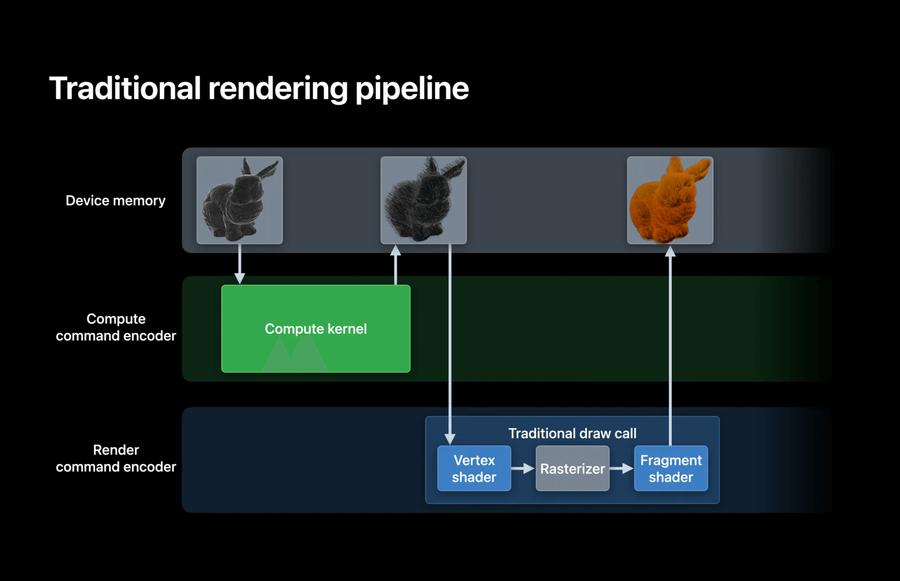

以上是传统的渲染管线，可以完成最终图片渲染，但同时也存在一些**问题**：

- 需要创建两个不同的命令编码器，而且这两个编码器无法在 GPU 上同时工作
- 需要额外的内存来存储生成的几何数据，而且如果有间接的 draw call，可能导致更高的内存占用

### 网格渲染管线（Mesh rendering pipeline）

主要流程：

- 创建渲染命令编码器，调用网格 draw call
  - 对象着色器（Object shader）处理网格数据（顶点数据），然后输出 `payload` 数据
  - 网格着色器（Mesh shader）处理对象着色器输出的 payload 数据，然后输出 `metal::mesh` 数据
  - 光栅化
  - 片元着色器处理，生成最后的数据

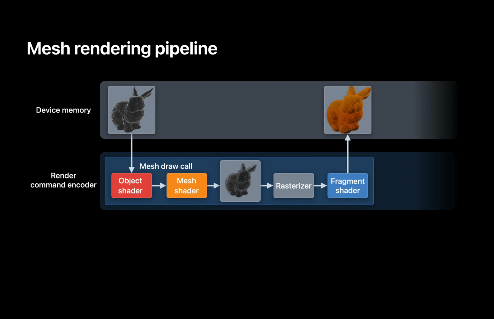

可以看出，网格渲染管线与传统渲染管线的主要**区别**：

> 网格渲染管线只使用一个命令编码器，也就是`渲染命令编码器`

> 网格渲染管线不占用额外的内存，生成的几何数据将直接传递给光栅化器

> 网格渲染管线将原先的顶点着色器阶段替换为`对象着色器`阶段和`网格着色器`阶段

在光栅化之前，网格渲染管线出现了两个全新的着色器，`对象着色器（Object shader）`和`网格着色器（Mesh Shader）`。下面通过两个例子，来详细讲述这两个全新的着色器。

## 例子一：头发渲染

我们将要渲染下图的一小片头发：

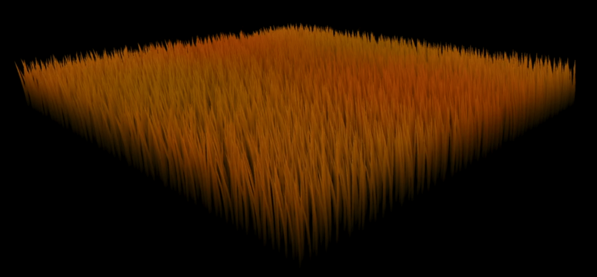

### 对象着色器阶段

#### 创建对象着色器

将这片区域划分切片，其中每块切片代表一个对象线程组（threadgroup），每个线程组计算头发丝的数量，并且生成每根发丝的曲线控制点数据，也就是 payload 数据。注：`payload`数据完全自定义，后续传递给网格着色器。

> 有关线程和线程组的介绍，可参考这个[官方文档](https://developer.apple.com/documentation/metal/compute_passes/creating_threads_and_threadgroups)

```c++
[[object]]  // 新增内置变量，表明是对象着色器
void objectShader(object_data CurvePayload *payloadOutput [[payload]],
                             const device void *inputData [[buffer(0)]], 
                             uint hairID [[thread_index_in_threadgroup]],
                             uint triangleID [[threadgroup_position_in_grid]],
                             mesh_grid_properties mgp)
{
    if (hairID < kHairsPerBlock)
       payloadOutput[hairID] = generateCurveData(inputData, hairID, triangleID);
    if (hairID == 0)
       mgp.set_threadgroups_per_grid(uint3(kHairPerBlockX, kHairPerBlockY, 1));
}
```

#### 设置渲染管线描述

通过 MTLMeshRenderPipelineDescriptor 初始化渲染管线描述，包括`objectFunction`、`payloadMemoryLength`、`maxTotalThreadsPerObjectThreadgroup`。

> 有关 MTLMeshRenderPipelineDescriptor 的其它属性，可参考这个[官方文档](https://developer.apple.com/documentation/metal/mtlmeshrenderpipelinedescriptor)

```swift
let meshPipelineDesc = MTLMeshRenderPipelineDescriptor()
meshPipelineDesc.objectFunction = objectFunc // 上面的对象着色器函数
meshPipelineDesc.payloadMemoryLength = kPayloadLength
meshPipelineDesc.maxTotalThreadsPerObjectThreadgroup = kHairsPerBlock
```

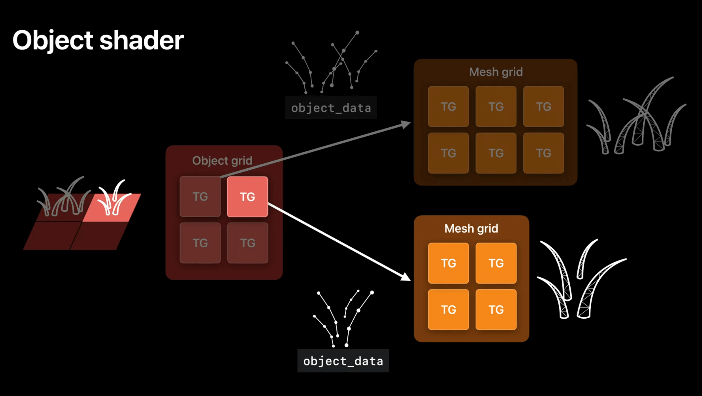

其中`object_data`就是 payload 数据，如图所示，4 根头发会生成 2 X 2 的网格

### 网格着色器阶段

接收上个阶段输出的 payload 数据，输出`metal::mesh`类型的数据到光栅化器。

这个阶段的处理速度**非常快**，可以将更多的处理放到此阶段。

#### 定义输出数据

根据需要定义`metal::mesh`类型的内置结构体数据，包括顶点数据、图元数据、网格拓扑等。

``` c++
struct VertexData    { float4 position [[position]]; };
struct PrimitiveData { float4 color; };

using triangle_mesh_t = metal::mesh<
                                    VertexData,               // 顶点数据
                                    PrimitiveData,            // 图元数据
                                    10,                       // 最大顶点数量
                                    6,                        // 最大图元数量
                                    metal::topology::triangle // 网格拓扑
>;
```

#### 创建网格着色器

处理顶点数据、索引数据、图元数据。

```c++
[[mesh]] // 新增内置变量，表明是网格着色器
void myMeshShader(triangle_mesh_t outputMesh,
                         uint tid [[thread_index_in_threadgroup]])
{
    if (tid < kVertexCount)
        outputMesh.set_vertex(tid, calculateVertex(tid));

    if (tid < kIndexCount)
        outputMesh.set_index(tid, calculateIndex(tid));

    if (tid < kPrimitiveCount)
        outputMesh.set_primitive(tid, calculatePrimitive(tid));

    if (tid == 0)
        outputMesh.set_primitive_count(kPrimitiveCount);
}
```

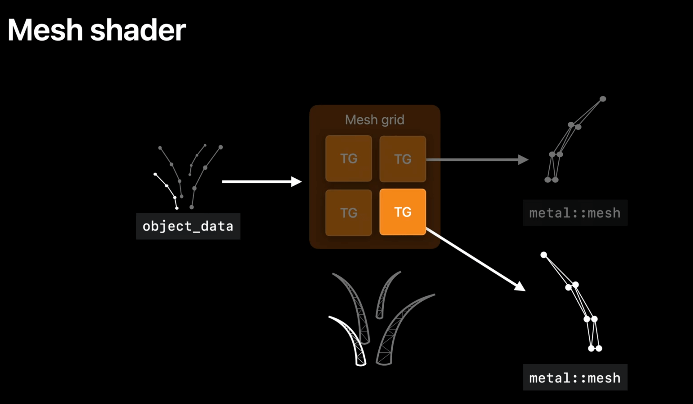

#### 继续设置渲染管线描述

继续使用上面定义的渲染管线描述，设置`meshFunction`、`maxTotalThreadsPerMeshThreadgroup`、`fragmentFunction`。

```swift
meshPipelineDesc.meshFunction = meshFunc
meshPipelineDesc.maxTotalThreadsPerMeshThreadgroup = kVertexCountPerHair
meshPipelineDesc.fragmentFunction = fragmentFunc
```

### 创建渲染管线状态

```swift
// 创建渲染管线状态对象
var meshPipeline: MTLRenderPipelineState! 
do {
    meshPipeline = try device.makeRenderPipelineState(descriptor: meshPipelineDescriptor)
} catch {
    print(“Error when creating pipeline state: \(error)\”)
}
```

### 编码

类似于传统渲染管线的编码工作，包括传递数据、绘制图形等。

```swift
var encoder = commandBuffer.makeRenderCommandEncoder(descriptor: desc)!

encoder.setRenderPipelineState(meshPipeline)

encoder.setObjectBuffer(objectBuffer, offset: 0, atIndex: 0)
encoder.setMeshTexture(meshTexture, atIndex: 2)
encoder.setFragmentBuffer(fragmentBuffer, offset: 0, atIndex: 0)

let oGroups   = MTLSize(width: kTrianglesPerModel, height: 1, depth: 1)
let oThreads  = MTLSize(width: kHairsPerBlock, height: 1, depth: 1)
let mThreads  = MTLSize(width: kThreadsPerHair, height: 1, depth: 1)
encoder.drawMeshThreadgroups(oGroups, threadsPerObjectThreadgroup: oThreads, threadsPerMeshThreadgroup: mThreads)

encoder.endEncoding()
```

后续流程，就是光栅化以及片元着色器生成最后图像，不再赘述。

## 例子二：网格片段剔除（Meshlet culling）

**网格片段（Meshlet）**是由网格（Mesh）模型分割出的颗粒度更小的片段。网格渲染管线可以有效处理和渲染大量的几何体，并且通过对 Meshlet 颗粒度划分，可以实现`更高效`和`细粒度`的剔除。

如图所示，我们要剔除矩形外的`黑白`部分，只保留矩形内的`彩色`部分：

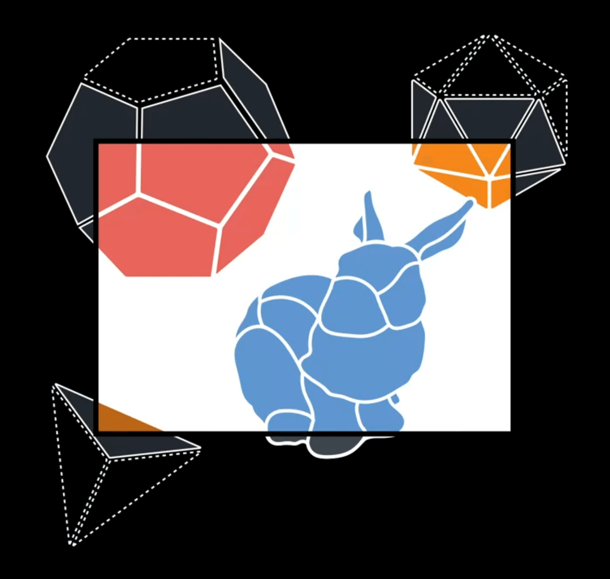

### 传统渲染管线

主要流程：

- 视锥体剔除（相机所见范围外的物体直接剔除）
- 层次细节选择（近处的物体加载高精度模型，越远的物体选择加载越低精度模型）
- 编码
- 进入渲染流程，最后生成图像

其中**Compute pass**阶段由 CPU 处理完成，CPU 并行能力相比 GPU 弱很多，而且还需要缓冲区存储中间绘制命令（Scene draw commands），所以整个过程不是特别高效。

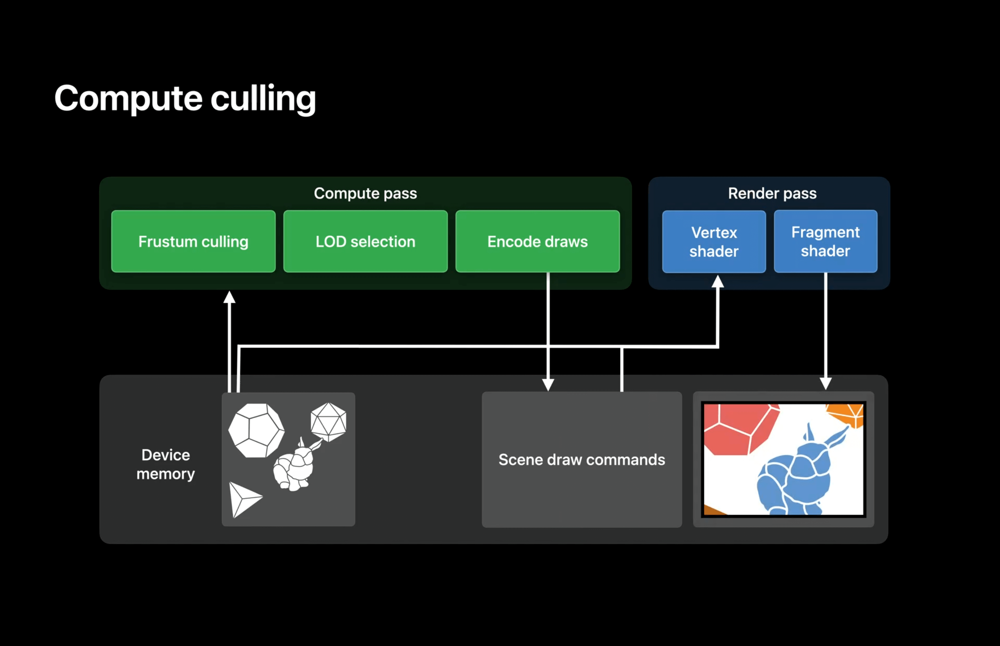

### 网格渲染管线

主要流程：

- 对象着色器阶段，经过视锥体剔除、细节层次选择，输出 payload 数据，即一系列网格片段 ID（Meshlet IDs）
- 网格着色器阶段，经过编码，输出 `metal::mesh` 类型数据到光栅化器
- 渲染，生成最后图像

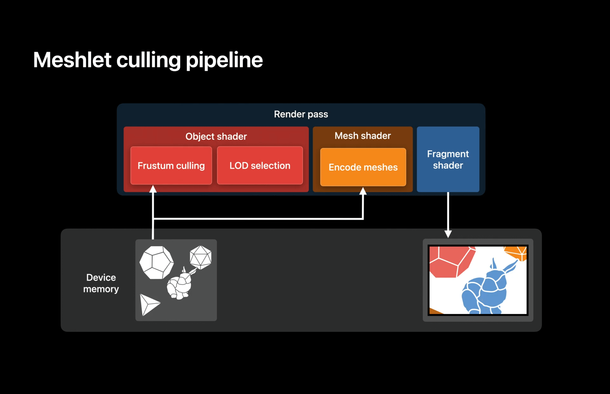

新的渲染管线由 GPU 驱动渲染，并行处理能力比 CPU 强很多，而且避免了缓存中间绘制命令，效率比传统渲染管线高。下面重点讲述下其中的`剔除`过程：

- 将场景模型划分成对象网格，这个过程完由你决定
- 将每个对象网格划分颗粒度更小的网格片段，其中不可见的网格片段将会被剔除，后续也不会再处理

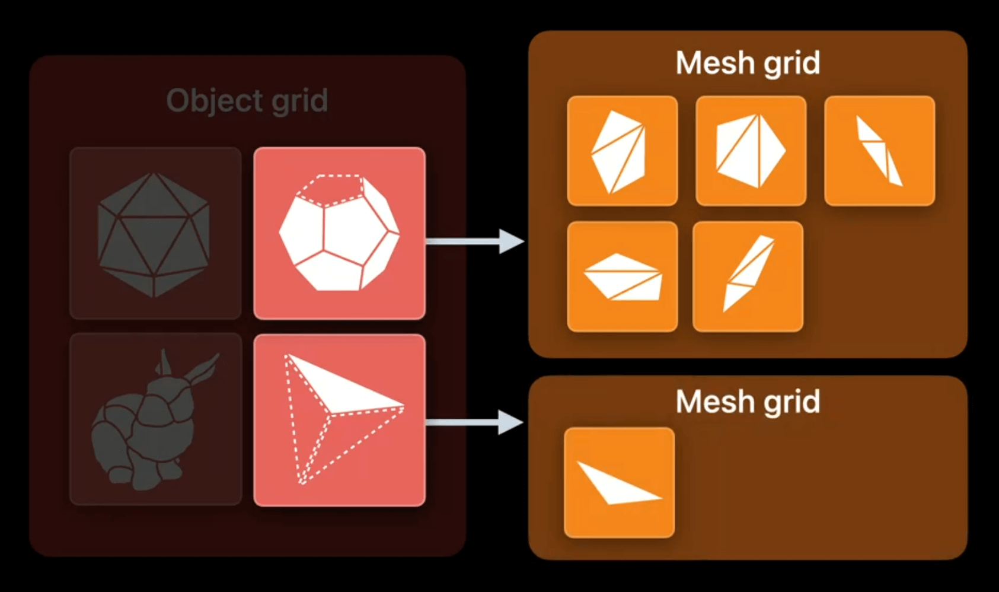

## 一些限制

### 对象着色器

- 输出数据（payload 数据）不超过 16KB
- 每个对象线程组生成的网格线程组不超过 1024 个

### 网格着色器

- 输出数据（metal::mesh，下同）最多支持 256 个顶点
- 输出数据最多支持 512 个图元
- 输出数据不超过 16KB

### 新管线运行设备要求

- macOS：`Mac2/Apple7+`
  - iMac 2015 及以后机型
  - MacBook Pro 2016 及以后机型
  - MacBook 2016 及以后机型
  - iMac Pro 2017 及以后机型
  - M1 / M2 系列电脑
- iOS：`Apple7+`
  - A14 及以上，即 iPhone 12 及以后手机
  - M1 系列 iPad

## 总结

网格着色管线作为新的几何渲染管线，在处理巨大的几何模型（剔除）或者程序生成等方面，有更高的效率以及更大的灵活性，相信未来必定有很多应用使用此管线。最后，如果你对新的渲染管线感兴趣，不妨看一下官方的 Demo 。  

> 官方 Demo ：[Adjusting the level of detail using Metal mesh shaders](https://developer.apple.com/documentation/metal/metal_sample_code_library/adjusting_the_level_of_detail_using_metal_mesh_shaders)
>
> 运行要求：macOS 13，Xcode 14

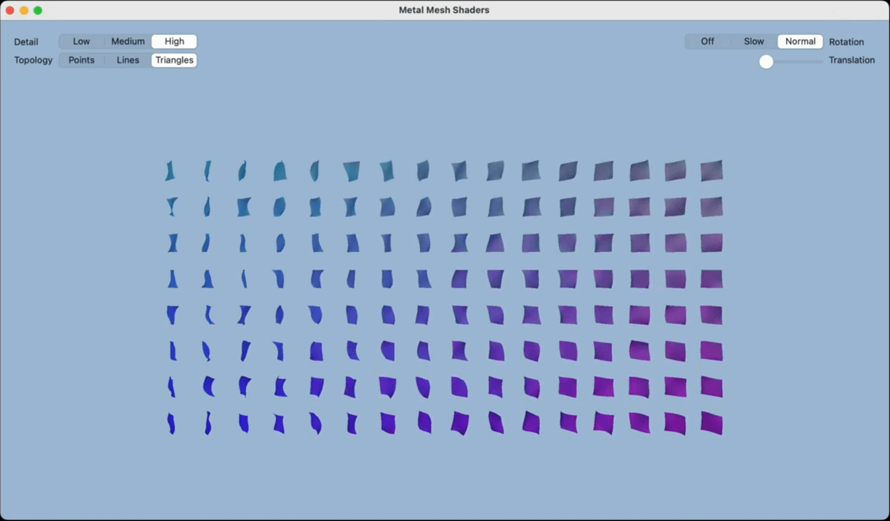
