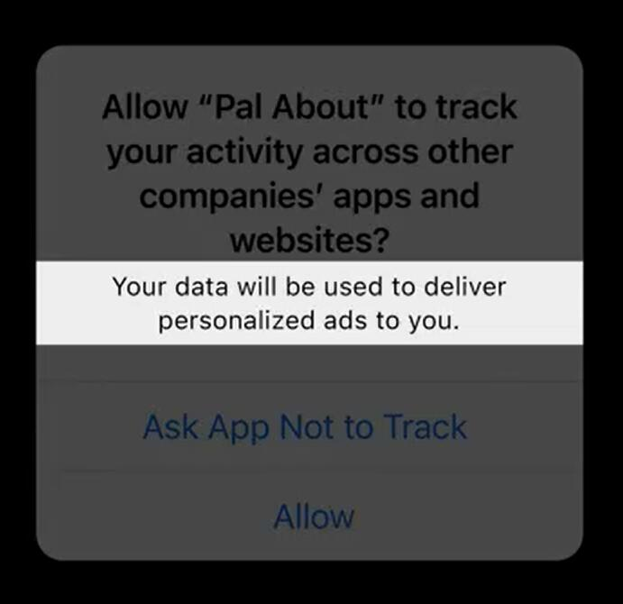

# WWDC22 10166 - 探索应用追踪透明化 App Tracking Transparency

> 作者：小铁匠 Linus，iOS 开发者，微信公众号《WLB 工作生活两不误》号主。
>
> 审核：

> 前情提要
> App Tracking Transparency（ATT） 是苹果官方从 iOS 14 开始重点强调的`申请用户广告追踪权限`相关的框架。

当用户了解了自己的数据将如何被共享时，他们才更有可能信任并使用 App。这就是为什么从 iOS 14 开始，苹果官方要求所有的 App 在追踪用户之前必须获得用户授权的原因。

本文主要从以下三个方面探讨 App Tracking Transparency：

1. 如何定义用户追踪
2. 在明确需要用户追踪的情况下，如何获得用户的许可
3. 注意事项

> 相关 Session ：
>
> [Session 10167 Create your Privacy Nutrition Label](https://developer.apple.com/videos/play/wwdc2022/10167)
>
> [Session 10038 What's new with SKAdNetwork](https://developer.apple.com/videos/play/wwdc2022/10038)
>
> [Session 10096 What’s new in privacy](https://developer.apple.com/videos/play/wwdc2022/10096)

## 如何定义用户追踪

苹果官方对用户追踪的定义是：将从 App 中收集的用户或设备数据与从其他公司的 App、网站或离线数据中收集的用户或设备数据结合起来，用于定向广告或广告效果衡量的行为。

如果你觉得上面的定义晦涩难懂的话，那么通过以下几个具体的例子，相信你一定能大致掌握关于用户追踪定义的门道了。

### 不涉及用户追踪的场景 1

假设你早餐想吃鸡蛋饼，你打开一款美食评价 App 搜索了附近的鸡蛋饼店，此时这款 App 记录了你的搜索记录。然后，这款 App 正好想给那些早餐店做广告，它基于你的搜索记录就给你展示了早餐的广告。

在本例中，该款 App 没有将用户数据与其他公司的 App 或网站中的任何数据相结合，以用于给你推荐早餐广告。因此，此场景不会被视为用户追踪。

### 不涉及用户追踪的场景 2

再次假设：拥有上面那款美食评价 App 的公司还有另一款优惠券 App，两款 App 的数据都是存储在自家的服务器上。然后，这款优惠券 App 基于你对鸡蛋饼的喜爱而给你发放了相关的优惠券（它用到了你在美食评价 App 中搜索鸡蛋饼的记录）。

在本例中，该款优惠券 App 不需要获得用户追踪的授权，即不属于用户追踪，这是因为美食评价 App 并没有将获取到的用户数据与其他公司的 App 或网站的任何数据相结合。

划重点：自家 App 内部的数据共享是不需要授权的。

### 用户追踪的场景 1（跨主体的 App）

假设你使用了一款不是上面那家公司的外卖 App，而且还在深夜点了一份夜宵。在注册外卖 App 时，你使用了与美食评价 App 相同的联系方式（可能是电子邮箱、地理位置、电话等等）。此后，美食评价 App 给你推送了一则全天提供早餐的餐馆广告，因为它利用相同的联系方式从外卖 App 处收集到了你点外卖的订单数据。

此场景需要美食评价 App 请求用户追踪权限，因为它出于广告目的，跨 App 将用户数据通过特定的联系方式链接在一起。因此，只要是出于结合用户数据的广告目的，即使将电子邮箱或其他用户标识符提前进行了哈希处理，App 仍然是需要用户追踪权限的（因为 App 中用户的数据仍会与其他公司的数据相链接）。

值得注意的是，标识符的类型以及它是否被哈希化并没有改变它被用于追踪的事实，即不管什么形式都需要进行用户追踪的授权。

### 用户追踪的场景 2（第三方 SDK）

要确定 App 是否需要请求追踪权限，还需要考虑第三方 SDK 是否有共享 App 中的数据。

继续举例，假设美食评价 App 中并没有编写任何需要用户追踪权限的代码，但希望在其 App 中包含第三方 SDK，用于广告效果的衡量。此时，美食评价 App 是否需要申请用户追踪的权限，就取决于该第三方 SDK 有没有将美食评价 App 的用户与从其它 App 或网站获取的用户数据进行结合了。

这时候你可能会问，我怎么知道第三方 SDK 到底有没有做需要用户追踪权限的事情吖？！答案就是：询问该 SDK 的开发人员。毕竟作为开发人员，你要对整个 App 的行为负责。

### 与数据代理共享数据

除上面提到的情况之外，用户追踪还包含与数据代理商共享用户或设备数据的行为。

#### 如何定义数据代理商？

数据代理商有很明确的法律定义。但一般来说，数据代理商是指那些定期收集和出售、许可或以其他方式向第三方披露与业务没有直接关系的特定用户个人信息的公司。

#### App 接入了数据代理商，该怎么办？

苹果官方明确了以下几个要求：

1. 无论共享给数据代理商的数据是否与其他公司用于广告或广告效果测量的数据相关联，该场景都被视为用户追踪，需要得到用户的授权。
2. 即使 App 没有直接将数据共享给数据代理商，但后续通过自家的服务器将数据共享给数据代理商的场景，也是需要在 App 端向用户申请追踪的权限的。

## 如何获得用户许可

根据 App 自身场景，如果确定需要追踪用户，则需要请求并获取用户的授权。相应的方法步骤如下。

### 请求 App 的追踪权限

为了请求 App 跟踪的权限，您需要通过调用 `requestTrackingAuthorization(completionHandler:)` 方法来显示 App 跟踪授权请求提示。

调用这个方法将会有一个系统权限提示框出现在 App 里。

<center></center>

这是一次性提示。系统将记住用户的选择，并且不会再次提示，除非卸载并重新安装 App。

### 配置 NSUserTrackingUsageDescription 隐私描述

在 `info.plist` 文件中配置 Key 为 `NSUserTrackingUsageDescription` 对应的字符串，用于在请求权限时展示给用户。一个清晰、简洁的字符串，可以帮助用户理解为什么要求他们允许自己被追踪。

此字符串不需要包含 App 的名称，因为系统将自动识别请求的 App，并在系统提示中显示 App 名称。

如果未包含使用说明字符串，则当显示系统提示时，App 将崩溃。

### 判断当前 App 追踪权限的状态

iOS 14 起，可以使用 `trackingAuthorizationStatus` 确定用户对 App 追踪权限的状态。如果用户已选择允许授权，App 有权将用户的活动数据链接到其他 App 和网站，只要其追踪授权的状态是保持授权不变的。当然，用户可以随时更改、授予或撤销其追踪授权，因此请**确保在每次启动时的授权状态**，再进行后续的操作。

用户可以控制 App 是否具有追踪每个 App 的权限。用户授予某个 App 追踪的权限，并不意味着同一公司另一个 App 的追踪权限也被授权了。不同的 App 在从该 App 获取数据之前，必须分别请求用户对该特定 App 的权限。

```swift
if (@available(iOS 14, *)) {
    ATTrackingManagerAuthorizationStatus status = ATTrackingManager.trackingAuthorizationStatus;
    ...
} else {

}
```

## 注意事项

首先，根据 App Store 审查指南，不能因为用户不同意授权 App 的追踪权限而限制功能。

其次，如果用户要求你的 App 不要追踪，IDFA API 将返回全零。那么，此时 App 只能使用不带有追踪的广告进行替代。

而对于广告效果测量方面，苹果也在持续建立和改进广告网络的相关技术。有关 SKAdNetwork 和广告点击转化计算等方面的更多信息，请参阅 [Session 10033 Meet privacy preserving ad attribution](https://developer.apple.com/videos/play/wwdc2021/10033/) 和 [Session 10038 What's new with SKAdNetwork](https://developer.apple.com/videos/play/wwdc2022/10038)。

在提交 App 时，还需要声明 App 将使用什么数据来追踪，而这些描述会显示在 App 的隐私营养标签（Privacy Nutrition Label）上。隐私营养标签，类似于食物上的营养标签，展示的是 App 在用户追踪时所需信息的描述。有关隐私营养标签以及如何在 App 中填写营养标签，请参阅 [Session 10167 Create your Privacy Nutrition Label](https://developer.apple.com/videos/play/wwdc2022/10167)。

最后，让我们谈谈指纹（Fingerprinting）。

用户有授权时，允许追踪，这没什么问题。但无论用户是否授予 App 追踪的权限，利用指纹或其它来自设备的信息尝试识别设备或用户，都是不允许的。尝试识别的内容包括但不限于用户的 Web 浏览器及其配置、用户的设备及其配置、用户的地理位置或用户的网络连接等。只要是为了生成指纹而收集任何数据的行为，都是不允许的。
