# WWDC22 10170/10169 - 通过 App Intents 实现 App Shortcuts

>作者：刘欢、王守楷， iOS 开发者，就职于京东 App 黄金流程团队。

本文基于 WWDC22  [Session 10169](https://developer.apple.com/videos/play/wwdc2022/10169/)、[Session 10170](https://developer.apple.com/videos/play/wwdc2022/10170/)  整理，从设计 Shortcuts 的产品思路切入，回顾了现有的相关开发框架 [SiriKit (Intents、IntentsUI)](https://developer.apple.com/documentation/sirikit) + [CoreSpotlight](https://developer.apple.com/documentation/corespotlight?language=objc)，并重点讲解了 iOS16 下使用全新框架 [App Intents Framework](https://developer.apple.com/documentation/appintents) 开发 Shortcuts  的流程。

## 概述

### 什么是 Shortcuts

Shortcuts 即快捷指令，是快速执行 App 某项功能的一种便捷方式。它允许用户可以通过询问 Siri，或者点一下 Spotlight 中 Siri Suggestion 的智能推荐，就能完成某项工作。用户甚至可以在苹果的 Shortcuts App 中，通过组合不同 App 提供的各种各样的 Shortcuts，定制出强大的自动化操作。

### Shortcuts 近年来进化过程

苹果在 2016 年 WWDC 大会上发布了 SiriKit，将原本只能在苹果系统中使用的 Siri 能力开放给第三方 App。2017 年苹果收购了 Workflow App (后更名为 Shortcuts App)，并在随后的 2018 年发布 Siri Shortcuts，允许第三方 App 通过 Shortcuts 将其功能开放到 Siri 中。这使得 Siri 能够根据上下文在合适的时间点智能推荐第三方 App 的 Shortcuts，进一步丰富并开放了 Siri 的生态系统。

今年的 WWDC22 中，苹果引入了全新的 API：[App Intents Framework](https://developer.apple.com/documentation/appintents)。新的 API 会更有效的将第三方 App 整合到苹果 Siri 体系中。使用新的 API 开发的 Shortcuts，在 App 被下载安装之后就会立即生效，不再需要用户做任何的手动设置 (比如手动操作 Add To Siri 等)，这意味人们比以往任何时候都更容易访问到他们喜欢的功能。整体的开发流程也更简单、清晰。这本质上是苹果对 Siri 生态系统的更进一步完善。

### 为什么需要创建 Shortcuts

当我们为 App 开发了 Shortcuts 后，它会在适合的场景下出现在 Shortcuts App、Siri、Spotlight 等系统程序中，与系统融合打通，这会为我们的 App 带来很多优势：

- 让 App 更容易被发现，提高 App 的曝光度和用户参与度。为 App 提供更多触达到用户的场景。
- 融入 Siri 生态，利用 Siri 的强大能力提高人机交互效率，解放用户双手。
- 通过 Shortcuts，用户甚至可以不用启动 App 就可以便捷的完成某种操作。可以让用户在应用程序之外，灵活、轻松地完成习惯性任务，提高用户粘性。

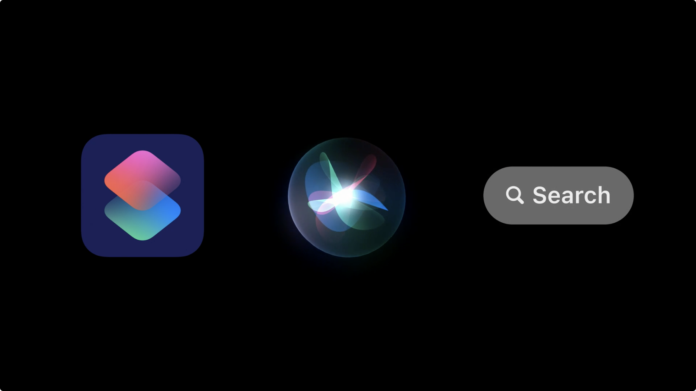

### 如何设计 Shortcuts

大多数 App 都会具有多种多样的功能。如果考虑制作为 App Shortcuts，可以专注考虑我们 App 的核心功能中具有独立性的能力。这部分功能会相对轻量、执行步骤相对简洁，用户甚至能够不打开 App，直接独立完成操作。反之，如果需要大量输入信息才能完成的操作，对于 Shortcuts 来说，可能就有些臃肿了。

每个 Shortcut，可以由多个 action 组合，每个 action 代表人们可以使用 App 完成的单个任务，例如创建提醒或发送消息。

这个 action 可以以不同的方式使用：

- **自定义快捷方式** 人们可以根据自己的喜好和创意，使用各种不同 App 中的一个或多个 action 来组成自定义的快捷方式。
- **应用程序快捷方式** 由应用程序开发人员预先创建好。
  - iOS16 以前，用户需要找到并点击 Add To Siri 按钮才能启用 Shortcut。
  - iOS16 中，我们应用创建的 App Shortcuts 将在应用被安装后自动生效。

#### 挑选出适合作为 Shortcuts 的功能

想想我们应用程序中有哪些核心功能，然后拆解为互相独立的任务：

- 要能够独立执行完成。一个出色的 Shortcut，甚至可以不用启动 App，就可独立执行。
- 功能建议要轻量一些。简单高效的任务易于使用，容易形成用户习惯。

> Tips: 每个 App 最多可以创建 10 个 Shortcuts。Shortcuts 在于精而不是多。大多数情况下，制作 2 ~ 5 个高质量的 Shortcuts 往往就足够代表应用的核心功能了。

#### 选择合适的短语来定义 Shortcuts

这个短语会出现在 Spotlight、Shortcuts App 中对应 App 标题的旁边，也是人们通过 Siri 调用 Shortcuts 时所说的话。可以从以下几个思路去命名：

- Shortcuts 的短语应该易于记忆并能清楚地传达其功能。

- 尽量保持简单、简短。

- 注意包含应用名字。App 名字一般比较容易被记住，并有助于提高品牌识别度。可以把名字作为短语中的名词或者动词。同时，也可以考虑 App 名字的同义词。

  > Tips: iOS11 之后系统支持设置 App 名字的同义词。

另外，短语中可以使用动态参数。如下图所示，Compassion 就是动态的，用户可以有多种选择：

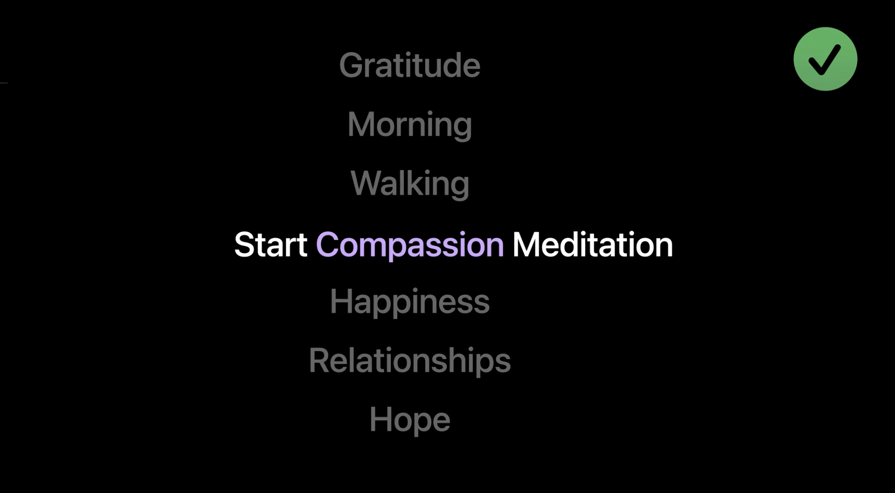

对于动态参数需要注意的是：

- 一个短语中只能有一个动态参数，并且只能用于从有限列表中进行选择。
- 这个动态的参数值列表可能随着 App 迭代发展而更新，因此要确保它始终包含最新的改动。

#### 优化视觉

在通过 Siri 触发 Shortcuts 时，系统可以允许用户在一定程度上和自定义视图交互，以便确认用户意图、向用户展示结果或者要求用户提供更多输入信息等。如下图所示：

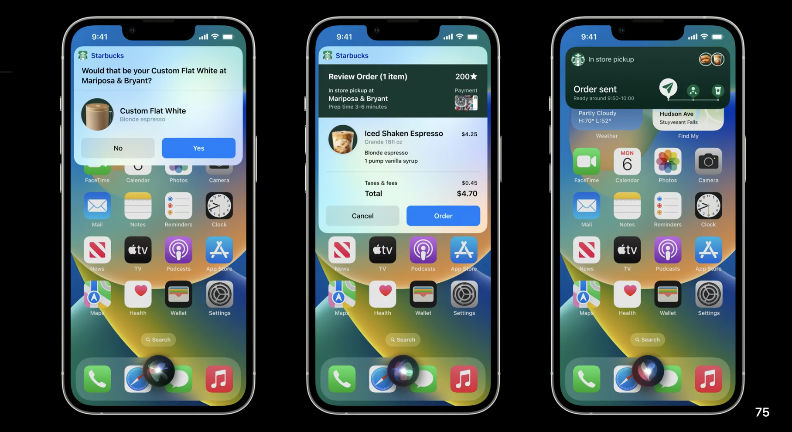

在 iOS 16 中显示结果有两种方式：Live Activity 和 [Custom Snippets](https://developer.apple.com/documentation/sirikit/inuihostedviewcontext/sirisnippet):

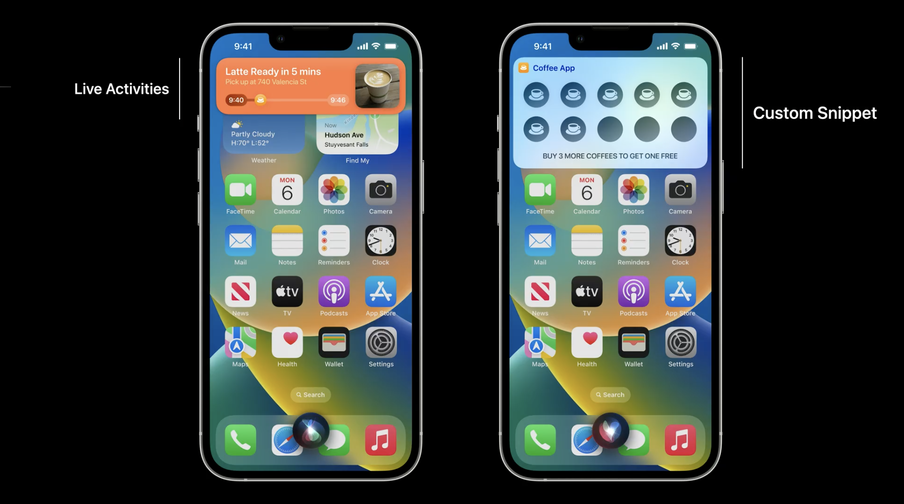

在设计视觉方面，有几点 Tips 可以作为参考：

- 对于需要有持续进度的信息，比如同城订单配送或者倒计时计时器等，可以考虑使用 Live Activity。
- UI 风格建议尽量能够与系统保持统一。使用半透明背景，不要用不透明的背景填充视觉对象。并注意适配暗黑模式。
- 当 Shortcuts 出现在 Spotlight 中的时候，每个 Shortcut 在右侧会有一个符号。可以结合 SF Symbols 库，为其选择一个含义贴近的符号。
- 在必要时，充分利用 Dialog 对话框。这是 Siri 所说的内容，会辅助自定义视图为用户传达出关键信息。
- Snippet 可用于其他设备。比如 Apple Watch 也将支持 Snippets，要注意 watchOS 9 的适配。以及纯语音的设备，比如 AirPods，要保证提供的 Dialog 信息能够囊括视图里的所有关键信息。

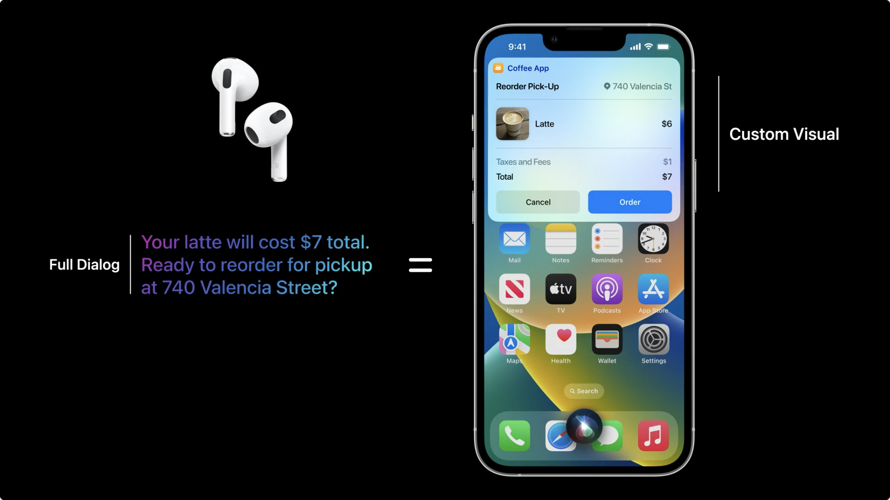

#### 推广 Shortcuts

制作 Shortcuts 的目的之一，就是为了向用户在更广泛的场景下展示并使用我们 App 的功能。那么让我们的 Shortcuts 被用户注意到，并被唤起使用，就是十分重要的了。除了让我们的 Shortcuts 质量更高，让用户更愿意使用以外，还可以考虑使用 Siri Tip 告知用户我们拥有 Shortcuts 的能力。Siri Tip 同时支持 SwiftUI 和 UIKit。可以参考：[SwiftUI Siri Tip View](https://developer.apple.com/documentation/appintents/siritipview) 或者 [UIKit Siri Tip View](https://developer.apple.com/documentation/appintents/siritipuiview)。

如果 App 有很多 Shortcuts，也可以使用 [ShortcutsLink](https://developer.apple.com/documentation/appintents/shortcutslink/) 按钮。用户可以通过 ShortcutsLink 唤起 Shortcuts App，并罗列出该 App 内的所有 Shortcuts。

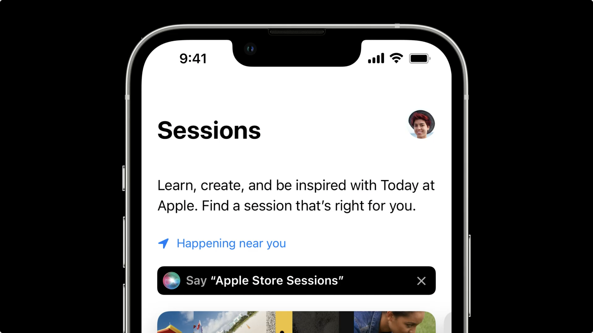

以上，是我们在开发 App Shortcuts 时值得注意和思考的一些事项。
下面我们具体看看开发实现。首先，我们回顾一下过去的开发流程。

## 过去的 SiriKit 与 CoreSpotlight

Shortcuts 并不是苹果新提出的功能，在这之前已经有一些成熟的框架可以用来开发 Shortcuts。不过整体开发流程没有被统一整合，比较松散。开发时往往涉及多个库以及一个基于图形界面的 intentDefinitionFile。

如果是需要通过 Shortcuts 打开 App 特定页面，跳转到 App 内用户继续完成一些操作。这种情况的推荐使用 `NSUserActivity` 来实现，只需修改 `userActivity` 的新属性 `isEligibleForPrediction` ，并向 `viewcontroller` 的 `userActivity` 属性赋值即可。这种开发过程简单，Shortcuts 的功能也简单，是轻量级的实现方式：

- 需要打开 App 进行操作时使用
- 仅仅表示在 Spotlight 中的索引项目时展示
- Siri 建议的颗粒度较大

如果用户无需跳转到 App 内，通过 Siri 语音或者自定义的 Siri 展示界面响应用户需求（使用 Siri Intent Extension Target 响应），需要使用 SiriKit。

SiriKit 包含 **Intents**  和 **IntentsUI** 框架，可以提供最优的 Shortcuts 体验。支持两种类型的扩展：

- Intents app extension: 负责接收来自 SiriKit 的用户请求，并将其转换为 App 特定的操作。
- Intents UI app extension: 支持自定义扩展程序的样式，但自定义视图控制器无法收到任何触摸事件。

创建一个 Shortcuts 大致分为 4 个步骤：

- 创建 Intent Definition File
- 定义 Intent，包括 Shortcuts 要用到的类型（如 Task），以及需要的事件（如 CreateTask）
- 执行编译，在编译日志中会发现 Xcode 将 Intent Definition 生成了对应的类文件
- 实现对应协议方法，响应 Intent 事件

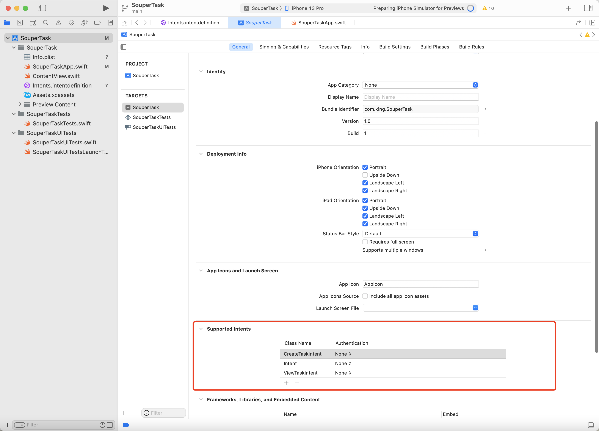

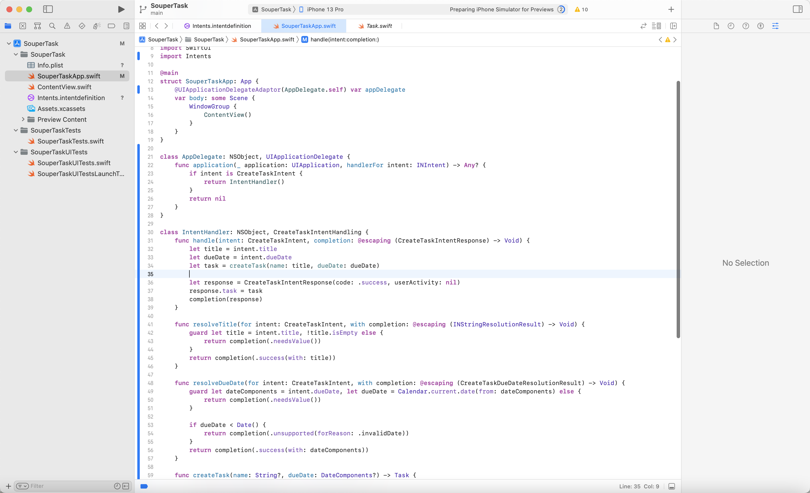

可见，整体的开发体验并不能说已经做到了极致。Shortcuts 发展到现在，也是时候为其开发流程做一次融合升级了。由此，苹果在今年 WWDC22 为开发者推出了全新的框架。

## 全新的 App Intents Framework

[App Intents Framework](https://developer.apple.com/documentation/appintents) 是一个全新的 Swift-Only 的库。使用全新的 API，开发流程相对于之前更高效了。对于开发者来说，整体的开发体验更友好了：

- 更简洁的框架设计，使得开发变简单。编写一个新的 Intent 其实只需要几行代码即可。
- 更现代化。新的库框架充分使用了`result builder`、`property wrapper`、`async await`、`protocol-oriented`、`generice` 等现代语法，全力以赴使用 Swift、 SwiftUI 的优秀特性，使得新框架有更好的可读性和可扩展性。
- 工程适配也很简单，不需要重构项目或者创建一个 Framework，Xcode 会在编译期间自动提取相关 Intent 数据。
  
  > NOTE: 为了保证 Xcode 在编译期间能正常生成 Intent 相关元数据，要保证 App Intents 相关实现代码、本地化文件直接存在于 App 或者 App Extension 中，不要在 Framework 里。

- 更利于维护。相对于之前的开发流程，新 API 整个开发过程都是需要通过编写 Swift 代码来实现的。开发者不用再关心创建和维护可视化的数据文件 (Intent Definiton File)，只要将注意力集中在编码即可。极大利于开发者做 Code review 和解决代码冲突。

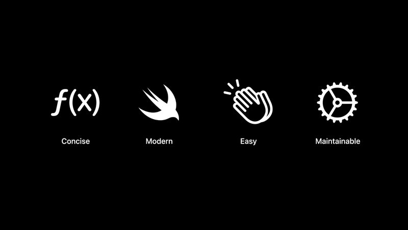

### App Intents API 的三个关键要素

新库主要有三个关键组成部分：[Intents](https://developer.apple.com/documentation/appintents/app-intents)、[Entities](https://developer.apple.com/documentation/appintents/app-entities)、[App Shortcuts](https://developer.apple.com/documentation/appintents/app-shortcuts)。理解了他们就很容易入手开发制作 Shortcuts 了。

- **Intents**。一个 Intent 可以理解为是 App 的一个相对独立的、单一的功能。通过 Intent，我们将 App 的某种功能暴露给系统。比如打开某个读书 App 的某本书。另外要注意，一个 Intent 运行完成后，要么返回一个 result，要么要抛出一个 error。一个 Intent 包含了三个关键点：
  
  + **metadata**，元数据即 Intent 的基本信息。比如一个本地化的 Title。
  + **parameters** ，参数，运行 Intent 的输入信息。很多时候，运行一个 Intent 需要用户提供额外的输入信息。比如某个读书应用，希望 Siri 可以打开某本书开始阅读。这时候可能需要用户额外输入一些信息，比如书的名字。
  + **perform method** ，执行方法。这个方法里面是一个 Intent 真正要执行的内容。
- **Entities** 。Intent 使用 Entity 来描述表达 App。是和系统间数据交互的桥梁。
- **App Shortcuts** 。最后包装所有 Intents，使其能够被系统识别发现。

  > NOTE: 每一个 App 最多支持 10 个 Shortcuts。

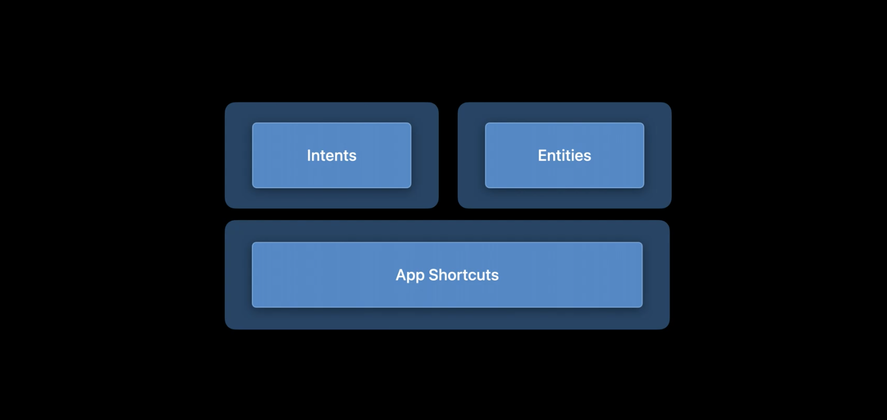

### 举例个栗子🌰

设想有一个冥想 App，可以通过播放不同种类的音频语音来帮助用户放松身心，或者提高用户做事情时的专注力。现在为这款 App 添加一个 Shortcuts，允许用户便捷的通过 Siri 指令，开始一段冥想。当然，冥想音乐会有很多种类，我们可以首先实现一个相对简单的默认的播放。

#### 创建一个 Intent

首先用 Swift 结构体创建一个自定义 Intent，并继承 [AppIntent](https://developer.apple.com/documentation/appintents/appintent) 协议。一个基础的 AppIntent 有两个必须实现：

```swift
//1.title 属性：Intent 的名字。会用于在 Shortcuts App 中展示。
static var title: LocalizedStringResource 
//2.perform 方法：Intent 运行时真正执行的方法。在此处补充需要 Intent 实现的逻辑，并在运行的最后返回一个结果(或者错误信息)。
func perform() async throws -> Self.PerformResult
```

> 其他重要属性：
>
> ```swift
> //是否需要打开 App。默认是 NO，不需要唤起 App 可以不用设置。
> static var openAppWhenRun: Bool
> ```

创建一个自定义的 StartMeditationIntent，实现 AppIntent 协议：

```swift
import AppIntents

struct StartMeditationIntent: AppIntent {
  static let title: LocalizedStringResource = "Start Meditation Session"
  
  //perform 方法是 async 的，在这个方法里我们可以执行异步操作。比如网络请求或者邀请用户输入更多信息。
  func perform() async throws -> some IntentResult & ProvidesDialog {
    await MeditationService.startDefaultSession()
    return .result(dialog: "Okay, starting a meditation session.")
  }
}
```

> NOTE: 制作 Shortcuts 时，无论动作执行成功或者失败，都需要注意给用户合适的反馈信息。比如上述代码返回的 dialog。

到这里，一个简单的 Intent 就开发完成了。StartMeditationIntent 已经能够出现在系统 Shortcuts App 内。

下面我们为这个 Intent 创建一个 Shortcut。这样用户就可以跳过设置 Shortcut 的步骤，在 App 被安装后就可以自动生效了。

#### 为用户自动提供一个 Shortcut

和自定义 Intent 类似，创建一个 Swift 结构体并遵守 [AppShortcutsProvider](https://developer.apple.com/documentation/appintents/appshortcutsprovider) 协议。对于 AppShortcutsProvider 协议来说，最重要的属性是:

```swift
//该属性向系统提供目前所支持设置的shortcuts。最多支持10个。
static var appShortcuts: [AppShortcut]
```

上面的属性包含一组 [AppShortcut](https://developer.apple.com/documentation/appintents/appshortcut) 实例，每个 AppShortcut 包含一些基础属性，比如：

- intent:  一个自定义 Intent 的实例。
- phrases: 一组口语短语，Siri 将通过这些短语唤醒启动 AppShortcut。

现在为 StartMeditationIntent 创建一个 Shortcut: MeditationShortcuts

```swift
import AppIntents

struct MeditationShortcuts: AppShortcutsProvider {
  static var appShortcuts: [AppShortcut] {
    AppShort(
      intent: StartMeditationIntent(),
      phrases: ["Start a \(.applicationName)"]
    ) 
  }
}
```

实现完上述代码，在用户安装好我们的 App 后，如果想触发冥想，就只需要对 Siri 说 "Start a meditation"。Siri  就会执行我们定义的 StartMeditationIntents，并读出我们设置好的 dialog 作为结果反馈。当然，用户如果在 Spotlight 中搜索，也会同样展示出我们的 Shortcut。

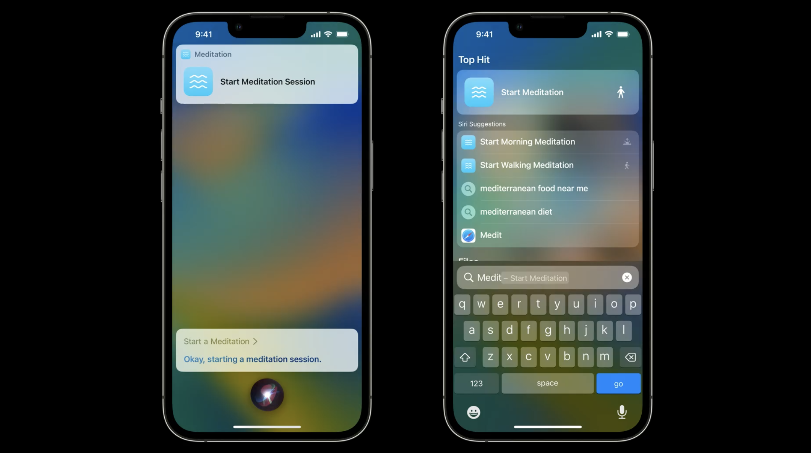

到目前为止，一个没有和用户有过多交互的简单的 Shortcut 就已经完成了。

不过在有些时候，Shortcuts 是需要和用户之间有更多输入输出信息交互的。接下来我们看看如何更多的增加 input、 output 交互过程。

#### 自定义视图 SnippetView

App Intent 框架中，使用 SwiftUI 来构建视图，相关技术和制作小组件是相似的。

> NOTE: 和小组件类似，Custom Snippet View 是有一定限制的，不可使用动画或者有交互性的视图，比如 ScrollViews 等。

现在，使用 SwiftUI 创建一个自定义视图 MeditationSnippetView。并重新调整 StartMeditationIntent 中的 perform() 方法。在执行完 Intent，输出 dialog 的同时，展示一个自定义页面。

```swift
func perform() async throws -> some ProvidesDialog & ShowsSnippetView {
  await MeditationService.startDefaultSession()
  return .result(
    dialog: "Okay, starting a meditation session.",
    //返回一个自定义视图，系统会自动处理将其组合、包裹到 Snippet View 中。
    //自定义视图要注意整体UI风格尽量保持和系统Snippet View 一致。
    view: MeditationSnippetView()
  )
}
```

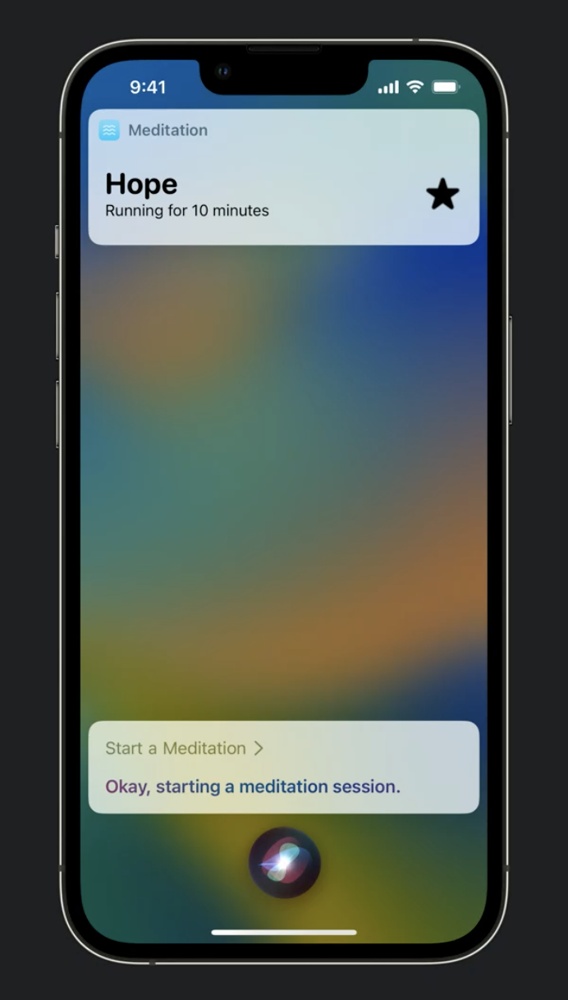

#### 增加参数获取信息 Dynamic Parameter

参数代表着 Intent 和 系统之间的输入输出交互内容。比如，如果想支持让用户通过输入选择不同的冥想类型，进入不同的 Session 场景，播放不同类型的音乐。可以在对应 Intent 中，增加一个 Property wrapper: [@Parameter](https://developer.apple.com/documentation/appintents/intentparameter)，代表需要用户输入更多信息。

利用 @Parameter 邀请用户输入更多信息，主要有三种方式：

```swift
//Disambiguations 会列举一系列选项，让用户从中挑选
func requestDisambiguation(among: [Value.ValueType], dialog: IntentDialog?) async throws -> Value.ValueType
//Value 会允许用户录入开放式内容
func requestValue(IntentDialog?) -> Error
//Confirmation 往往适用于 double-check
func requestConfirmation(for: Value.ValueType, dialog: IntentDialog?) async throws -> Bool
```

对应的状态，如下图所示：

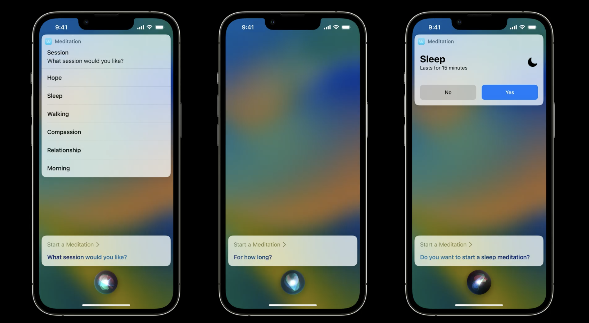

要实现上述功能。首先，我们先创建一个结构体 MeditationSession，并实现 [AppEntity](https://developer.apple.com/documentation/appintents/appentity/) 协议。这代表着上图中的每一个 Session 场景，如 Hope、Sleep、Walking...

```swift
import AppIntents

struct MeditationSession: AppEntity {
  let id: UUID
  let name: LocalizedStringResource
  
  //displayRepresentation 提供基础信息用于展示 Entity
  static var typeDisplayName: LocalizedStringResource = "Meditation Session"
  var displayRepresentation: AppIntents.DisplayRepresentation {
    DisplayRepresentation(title: name)
  }
  
  //提供 EntityQuery 的实现，用于 Siri 搜索匹配到目标 Entity
  static var defaultQuery = MeditationSessionQuery()
}
```

> NOTE: [DisplayRepresentation](https://developer.apple.com/documentation/appintents/displayrepresentation/) 是用来描述 AppEntity 的 UI 展示的。支持的展示配置有：title、subtitle、image 等。

为上述 `defaultQuery` 创建一个默认匹配 MeditationSessionQuery，并实现 [EntityQuery](https://developer.apple.com/documentation/appintents/entityquery/) 协议。该协议帮助系统查找到对应的 Entity，并作为 Parameter 输入给 Intent。

```swift
struct MeditationSessionQuery: EntityQuery {
  func entities(for identiifiers: [UUID]) async throws -> [MeditationSession] {
    return identiifiers.compactMap { SessionManager.session(for: $0) }
  }
}
```

最后，更新结构体 StartMeditationIntent。使用 @Parameter 为其增加一个 Parameter，标记 Intent 需要的入参。调整 `perform()` 方法，向用户请求更多输入信息。

```swift
struct StartMeditationIntent: AppIntent {
  
  // ...
  
  @parameter(title: "Session Type")
  var session: SessionType?
  
  func perform() async throws -> some ProvidesDialog {
    //调用 parameter.requestDisambiguation，列举一系列 Session 选项，供用户选择 
    let sessionToRun = self.session ?? try await $session.requestDisambiguation(
      //among: 列表中罗列的内容。UI 展示参考 AppEntity.displayRepresentation 属性
      among: SessionManager.allSessions, 
      dialog: IntentDialog("What session would you like?")
    )
    await MeditationService.start(session: sesstionToRun)
    return .result(
      dialog: "Okay, starting a \(sessionToRun.name) meditaion session."
    )
  }
}
```

到此为止，我们的 Intent 应该能够接受用户的入参，选择不同的 Session 场景进入冥想了。

不过，在实际的 Shortcuts 设计中，过多的输入 Parameter 会让 Shortcut 的使用变得繁琐。应该谨慎使用，只在必要时要求用户输入信息。我们可以为 Shortcut 提供更多预先设置的触发语句，来减少这种情况。比如，默认的 "Start Meditation Session"，会唤起输入 Parameter 的界面。但我们可以额外提供一个 "Start a walking Session" 这样的短语，如果用户对 Siri 说 "Start a walking Session"，这样就可以跳过输入 Parameter 的步骤，直接触发对应的 Session。"Start a XXXX Session"，这就是把固定触发短语动态参数化。

#### 预先配置参数化短语 Parameterized phrases

首先，要提供支持参数化短语对应的 Entities。更新 MeditationSessionQuery，实现 `suggestedEntities()` 方法，返回一组 AppEntity。

```swift
struct MeditationSessionQuery: EntityQuery {
  func entities(for identiifiers: [UUID]) async throws -> [MeditationSession] {
    return identiifiers.compactMap { SessionManager.session(for: $0) }
  }
  func suggestedEntities() async throws -> [MeditationSession] {
    return SessionManager.allSessions
  }
}
```

然后记得在数据层发生变化时，通知 App Intents Framework 做相应更新。只调用 AppShortcut 的类方法 `updateAppShortcutParameters()` 即可，该方法不需要自己实现，系统会自动调用 `EntityQuery.suggestedEntities()` 方法获取最新状态。

```swift
MeditationShortcuts.updateAppShortcutParameters()
```

最后，更新 MeditationShortcuts 中的 phrases。

```swift
import AppIntents

struct MeditationShortcuts: AppShortcutsProvider {
  static var appShortcuts: [AppShortcut] {
    AppShort(
      intent: StartMeditationIntent(),
      phrases: ["Start a \(.applicationName)",
                "Begin \(.applicationName)",
                "Start a \(\.$session) session with \(.applicationName)",//👈🏻参数化短语
                "Begin a \(\.$session) session with \(.applicationName)"//👈🏻参数化短语
               ]
    ) 
  }
}
```

到现在为止，主要的 Shortcut 功能都已经实现完成了。

## 总结

通过本章，我们介绍了设计 Shortcuts 时的注意事项，比如如何挑选合适的触发短语、如何优化视觉等，这些 Tips 便于我们制作更高质量的 Shortcuts。同时，我们回顾了过去的开发流程，介绍了 iOS16 的全新 App Intents 框架。对比之下可以感受到，全新的 App Intents API 通过更现代化的编程语言和框架设计，让开发 Shortcuts 变为前所未有的简单。编写一个 Shortcut 只需要几行代码即可，并且支持深入的定制。

对于 Shortcuts 来说，这是激动人心的一年。苹果并没有为了增强 Shortcuts 的能力而增加开发的复杂性。相反，苹果最大限度地减少了开发者的工作量。更少的工作量，往往能获得更高的优先级，更快地开发。意味着在不远的将来可能会有更多高质量的 Shortcuts 产品产出。
