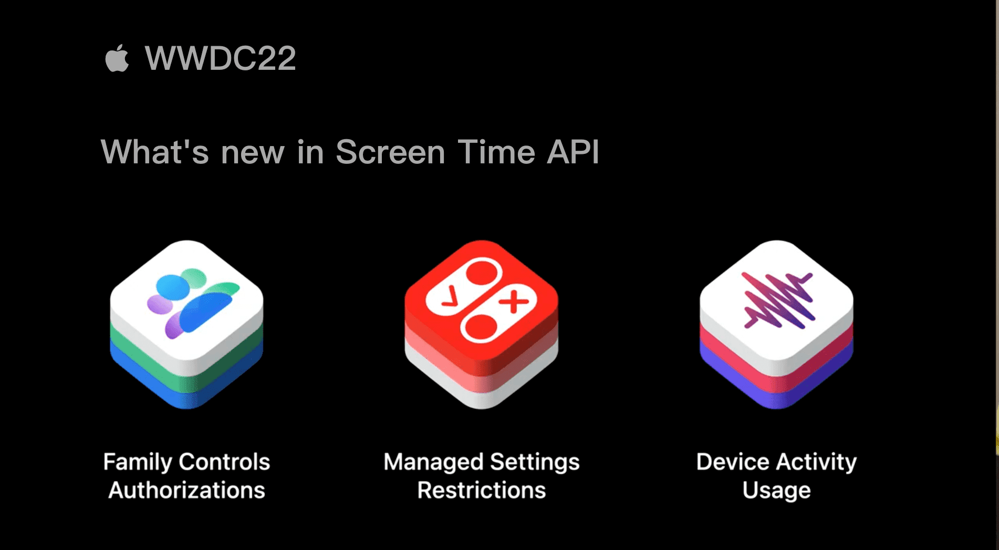

## 个人介绍

neverLand，目前就职于货拉拉，主要负责地图相关业务开发与维护。

## 审核介绍

黄骋志（橙汁），老司机技术社区核心成员，现于西瓜视频负责稳定性 OOM/Watchdog 相关工作。

王浙剑（Damonwong），老司机技术社区负责人、《WWDC22 内参》主理人，目前就职于阿里巴巴。

## 不超过 120 个字的文章简介

本文将介绍 Screen Time API 在 iOS 16 的新特性以及基于此可以实现的功能。全文分为三个部分：

1. 回顾 iOS 15 中 Screen Time API 特性
2. Screen Time API 在 iOS 16 的新特性介绍
3. Screen Time API 新特性的实践

## 公众号/小专栏图文头图

