# WWDC22 110336 - Screen Time API 的新特性

> 本文基于 [WWDC22 Session 110336](https://developer.apple.com/videos/play/wwdc2022/110336/) 梳理。
>
> 作者：neverLand，就职于货拉拉，主要负责地图相关业务的开发与维护。
>
> 审核：[ChengzhiHuang](https://github.com/ChengzhiHuang)，老司机周报编辑，就职于字节，现负责西瓜视频的稳定性（OOM / WatchDog）相关工作。

## 导读

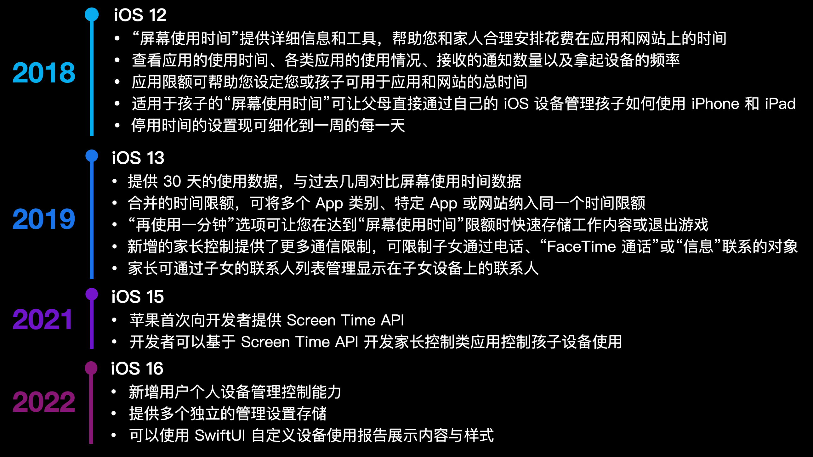

一年一度的苹果开发者”春晚“ —— WWDC 在 6 月份如期而至，回顾过去，2018 年苹果在 iOS 12 为用户带来了“屏幕使用时间（Screen Time）”功能，并在 2019 年 iOS 13 对功能进行了完善优化。在去年的 WWDC21 苹果向开发者提供了全新的 Screen Time API，开发者可以使用它来对用户设备增加限制进行管理，例如：指定应用的使用时长、设定时间范围内不允许使用应用或访问指定网站受限制。这一功能尤其在”家长-子女“这种关系中显得格外强大。

一年过去了，开发者针对 Screen Time API 也提出了很多反馈，今年的 WWDC22 苹果在 Screen Time API 中又提供了新的特性，究竟有哪些新的功能等待着开发者去使用呢？接下来的文章将为大家详细讲解。

本文会通过三个部分来为大家介绍 Screen Time API:

1. 回顾 iOS 15 中 Screen Time API 特性
2. Screen Time API 在 iOS 16 的新特性介绍
3. Screen Time API 新特性的实践

## iOS 15 中 Screen Time API 特性

大家可以参考 WWDC21 内参中的文章[【WWDC21 10123】初见 Screen Time API](https://xiaozhuanlan.com/topic/6874305291)。

诞生于 iOS 15 的 Screen Time API 主要包含三个框架：**Family Controls**、**Managed Settings**、**Device Activity**。如果把 Screen Time API 比作一个工厂，三个框架我们可以形象的理解为三个职业：保安队长、总经理和监工组长。

### Famlily Controls：“我是一名保安，保卫一方平安”

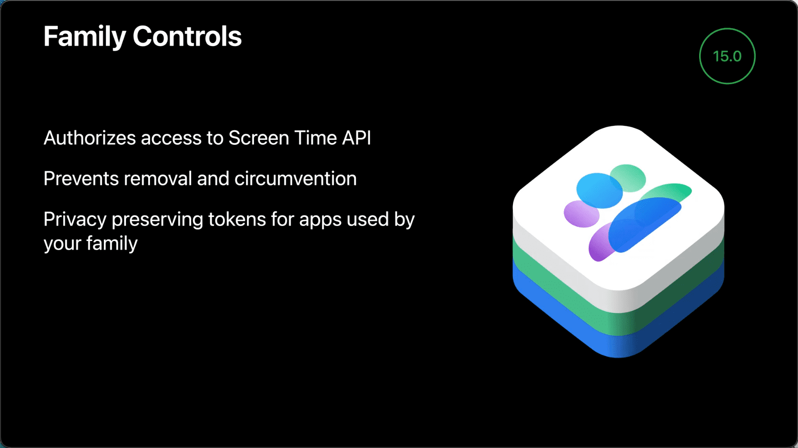

作为保安队长的 Family Contols 框架为 Screen Time API 提供了鉴权能力，在应用首次启动时会获取家长控制权限，此时页面会弹出一个提示框。并且它还防止被监管的用户移除或规避 Screen Time API 的管理。从隐私安全的角度来看，在使用 Screen Time API 来进行监控或者限制功能使用的整个过程中，Family Contols 会为家庭成员使用的应用或访问的网站提供隐私不透明令牌。

在 Family Controls 框架中提供了 `FamilyActivityPicker` 的 SwiftUI 组件来选择要限制的应用、网站或分类。

### Managed Settings：“经理经理，我来管理”

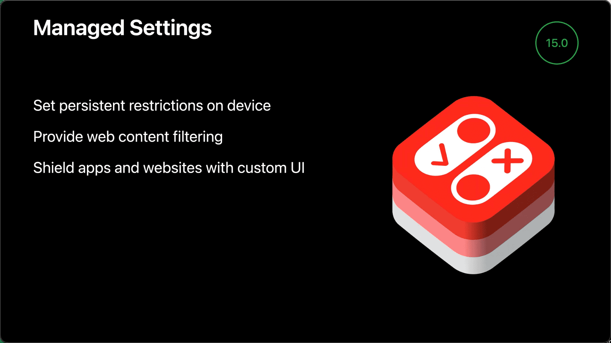

Managed Setting 框架为用户提供了一种保护隐私的方式来对设备中的某些功能进行限制，这些限制会持续生效直到家长或者监护人解除。还可以提供网页内容过滤、保护应用和网站。

开发者可以根据应用自身的品牌调性以及功能需求，相应地进行定制化开发，设置多种类型的限制包括：

- 账号
- 蜂窝网络
- 设备日期与时间
- 设备密码
- 屏蔽视图
- Siri
- 应用的最大年龄等级
- 禁止应用内购买
- 要求购买密码
- 应用
- 电影、电视评级
- Game Center：添加用户和加入组队游戏
- 媒体内容
- Safari：cookies 管理和自动填充
- 网站

### Managed Settings：“监工监工，数据精通”

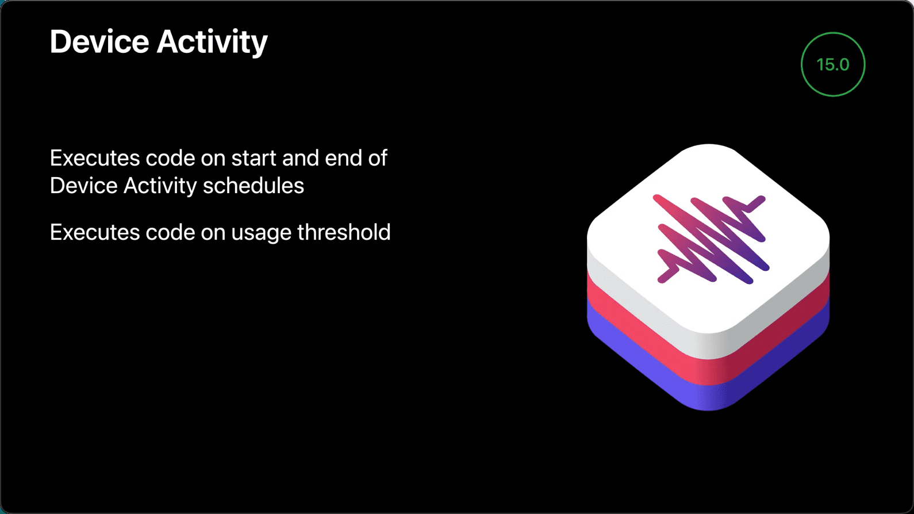

Device Activity 框架提供了监控网站和应用的使用状况的能力，开发者可以在适当的地方执行代码来实现监控。`Device Activity Schedule` 会在时窗的开始和结束时，在程序中运行一个拓展。当使用设备的用户达到 `Device Activity Schedule` 设置的使用阈值时，`Device Activity Events` 会调用拓展中的相应方法。

以上三个框架在 iOS 16 中都有令人惊喜的升级，这些升级不仅会让 Screen Time API 更加方便的使用，而且对用户体验也有很大的提升，接下来就让我们一窥究竟。

## iOS16 中 Screen Time API 的新特性

总的来说 iOS 15 和 iOS 16 中 Screen Time API 的特性可以整理为下面表格中的内容：

| Screen Time API  |                            ios 15                            |                         ios 16                          |
| :--------------: | :----------------------------------------------------------: | :-----------------------------------------------------: |
| Family Controls  | 提供鉴权能力只有家庭成员可以访问，只能通过 iCloud 认证授权子女设备 |    可以单独授权给当前设备用户，实现自我设备控制管理     |
| Managed Settings |            Managed Setting Store 每个进程只有一个            | 最多可以创建 50 个拥有独立名称的 Managed Setting Store  |
| Device Activity  | 应用可以响应计时窗口的开始、结束，以及在其他应用和网站使用达到阈值时进行操作 | 应用可以使用 SwiftUI 完整的自定义使用报告展示内容和样式 |

接下来让我们详细的看一下三个框架都有哪些升级优化

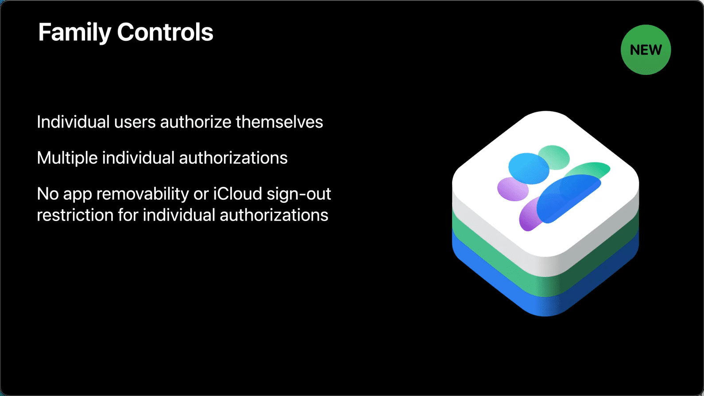

在 iOS 15 中，Family Controls 只能通过 iCloud 认证授权子女设备，而在 iOS 16 用户可以从自己的设备授权给用户本身，这意味着使用 iOS 16 提供的新方法，Screen Time API 可以不仅能够实现家长控制功能，还可以实现自我控制管理。

与现有的家长控制授权不同，个人授权可以被设备中的任意数量应用程序使用。另一方面，由于个人授权不适用于家长控制，因此针对家长控制功能的 iCloud 退出和应用程序删除的隐性限制将不适用于自我控制管理功能。

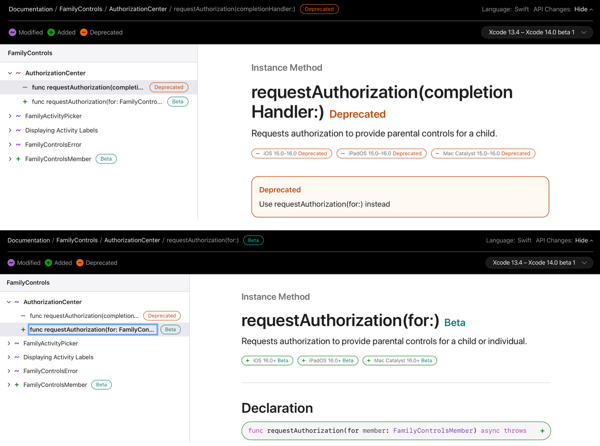

个人授权与家长控制授权使用都很简单，苹果使用异步方式对两者进行了优化。

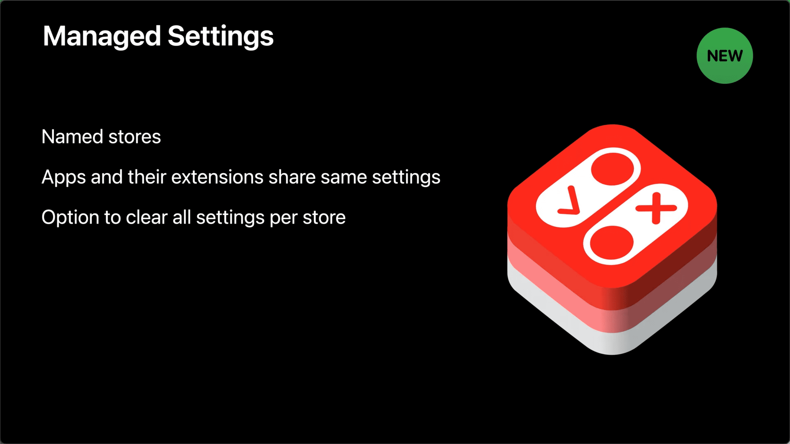

Managed Settings 已经被重新修改，修改后开发者使用更简单容易，特别是 Managed Setting Store。

```
Tip: WWDC22 该 Session 发布时，Managed Settings 修改尚未完全开发完成，需等待 iOS 16 正式发布。
```

Managed Setting Store 是对当前用户或设备应用设置的数据存储工具，在 iOS 15 每个进程只有一个，应用和 Device Activity 拓展必须使用不同的 Managed Setting Store，这使得修改设置来响应 Device Activity 变得困难。

在 iOS 16 中，每个进程开发者最多可以创建 50 个拥有独立名称的 Managed Setting Store，这些命名的 Managed Setting Store 也会自动在应用程序和所有应用拓展之间共享，同时开发者现在可以立即删除给定名称的 Managed Setting Store 中所有设置。

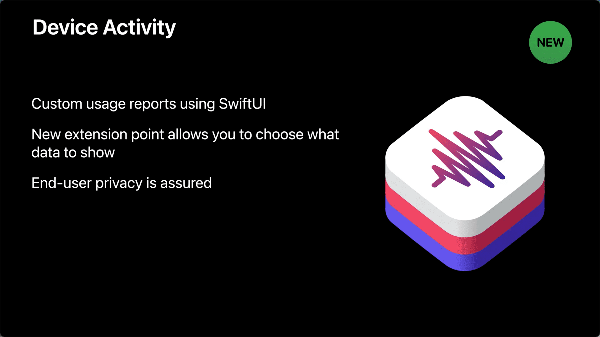

在 iOS 15 中，Device Activity 可以让应用响应计时窗口的开始、结束，以及在应用和网站使用达到阈值时进行操作。

在 iOS 16 中，Device Activity 提供了新的报告服务：应用可以使用 SwiftUI 完整的自定义使用报告展示样式。一个新的拓展点持有设备使用数据，开发者可以自定义展示哪些数据、如何在屏幕上展示数据，并且这些数据都是完全私密的，用户的隐私将会得到保证。

由此可见，iOS 16 中 Screen Time API 为开发者提供的新特性将会丰富的拓展原有的应用控制管理能力，那么基于 iOS 16 中 Screen Time API 如何实现新特性呢？

## Screen Time API 新特性的实践

### Family Controls

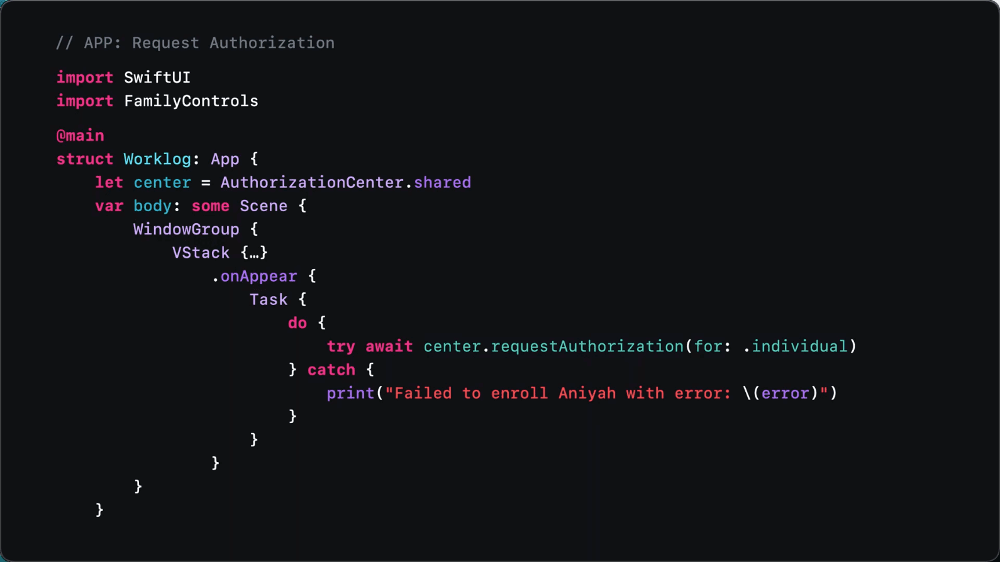

对于 Family Controls 框架，新的独立授权功能首先需要在应用首次启动时使用`AuthorizatioinCenter.shared`请求授权，授权请求可能导致更新独立授权状态，也有可能回调错误。

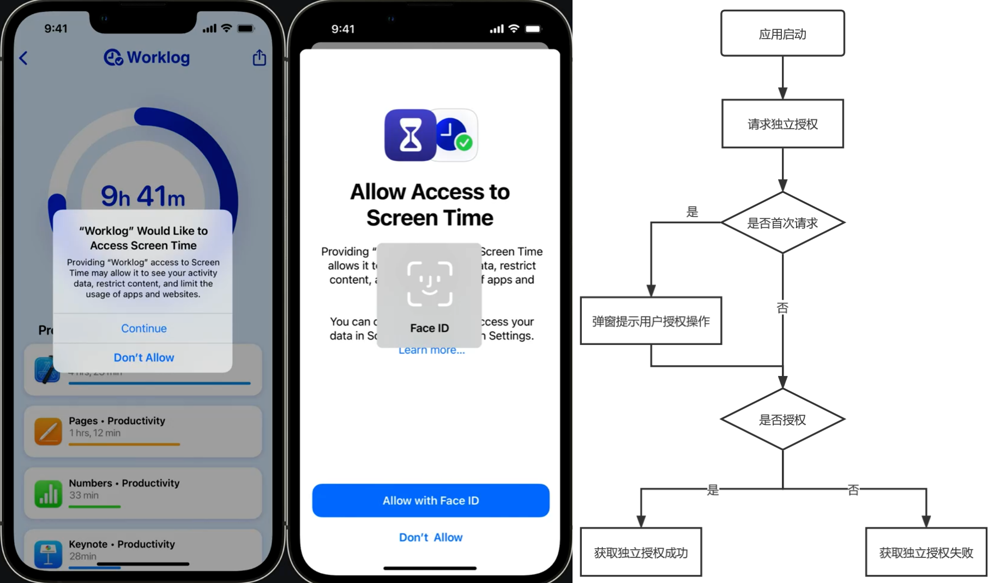

当应用第一次在设备启动，授权请求会通过弹窗提醒用户授权操作，用户选择同意授权，会调用 Face ID、Touch ID 或设备密码对用户进行身份验证。一旦用户授权成功，再次调用授权请求将不再弹窗显示地提示用户而是默认授权请求成功。

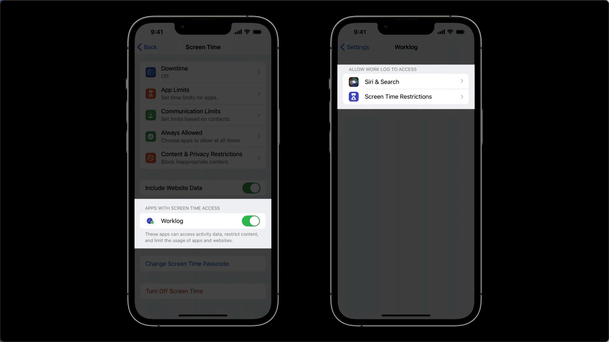

当用户通过 Family Controls 的授权，设置中将会新增两个开关：一个是在 Screen Time 的 `APPS WITH SCREEN TIME ACCESS` 列表中；另一个则是在应用程序设置中被标记为 `Screen Time Restrictions`。家长和个人用户可以通过这两个开关中的任何一个来解除对应用程序的授权。

### Managed Settings

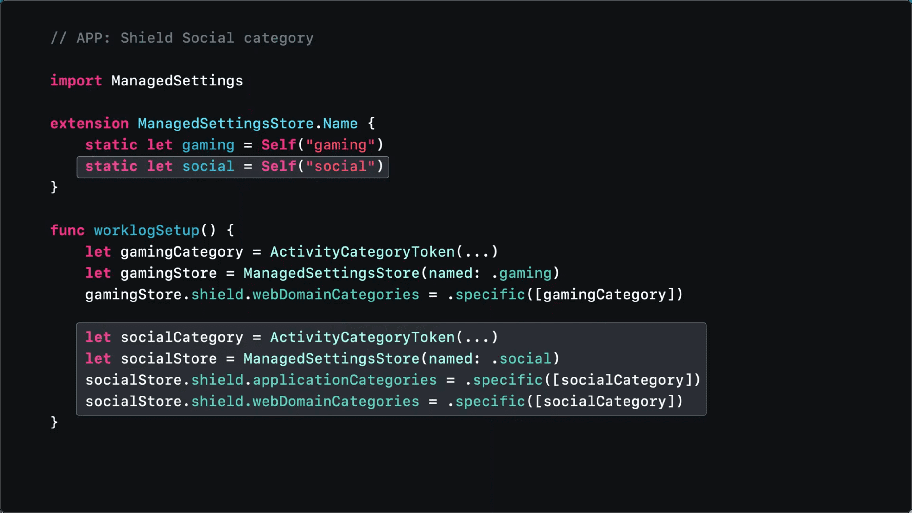

当应用首次启动并设备授权成功，创建名为 “gaming” 和 “social” 的 ManagedSettingStore：命名为 “gaming” 的 ManagedSettingStore 包含了所有游戏的限制，可以屏蔽所有游戏网站；命名为 "social" 的  ManagedSettingStore 会屏蔽社交媒体类应用和网站。

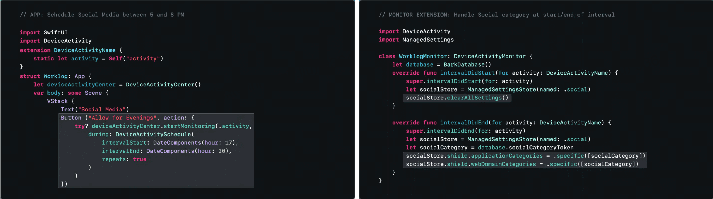

实现只有在 17 点至 20 点可以访问社交媒体应用和网站功能：通过点击按钮创建 Device Activity Schedule 在 17 点开始到 20 点结束，在 17 点活动监视器取消了社交媒体 ManagedSettingStore 的限制，在 20 点又重新开启限制。

如果社交媒体类限制与游戏类限制有重复，那么在社交媒体类限制被移除时，游戏类限制还会生效吗？答案是：游戏类中的与社交媒体类中重复的限制依旧生效。

## Device Activity

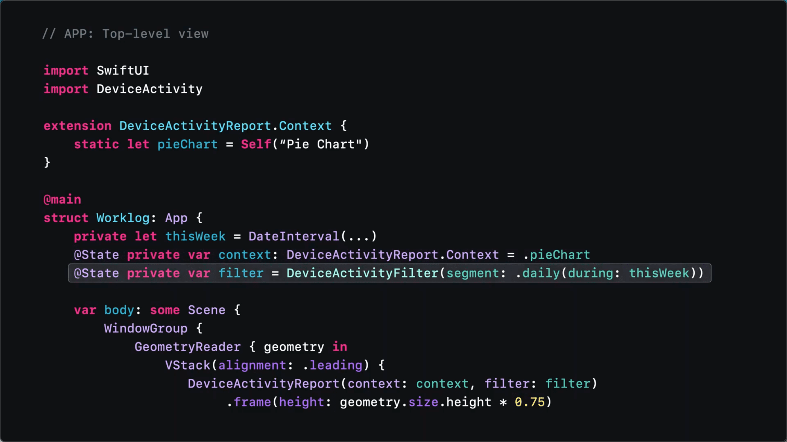

自定义报告数据展示首先需要创建 `DeviceActivityReport.Context` 和 `DeviceActivityFilter`，`DeviceActivityReport.Context` 是展示 DeviceActivity Data 的自定义视图展示类型，`DeviceActivityFilter` 可以定时报告上下文的计时窗口。

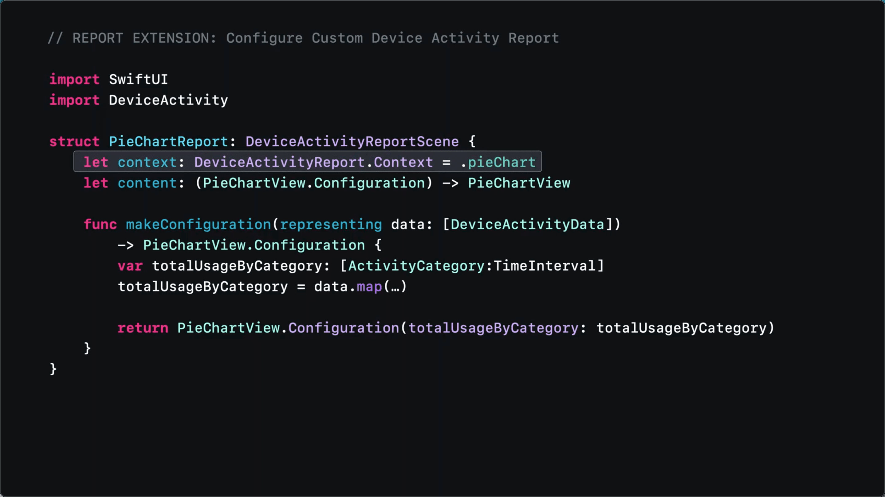

在 DeviceActivityReportScene 中设置设备活动报告 context 的定义，告诉场景要展示那种类型内容，content 对象中声明自定义配置 PieChartView.Configuration 以及报告的 SwiftUI 视图。

在 makeConfiguration 方法内，将 DeviceActivityData 进行映射到自定义数据展示视图配置。每当获取新的使用数据时，Device Activity 框架将调用 makeConfiguration 方法。

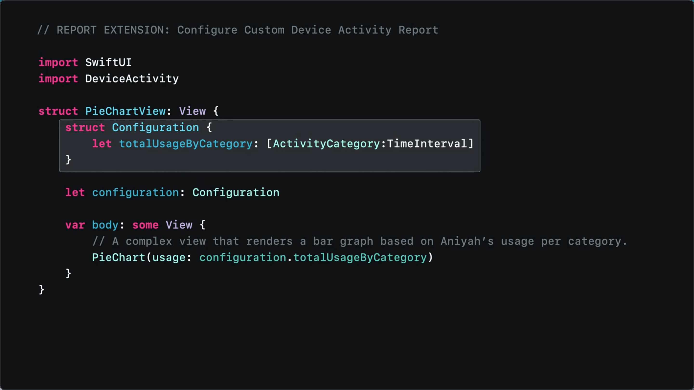

在自定义 PieChartView 视图中，configuration 是自定义视图的视图模型，为视图提供报告数据。

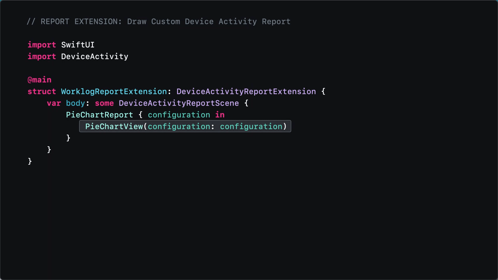

最终，在 DeviceActivityReportEvtension 的 body 中展示通过 SwiftUI 自定义的报告视图。

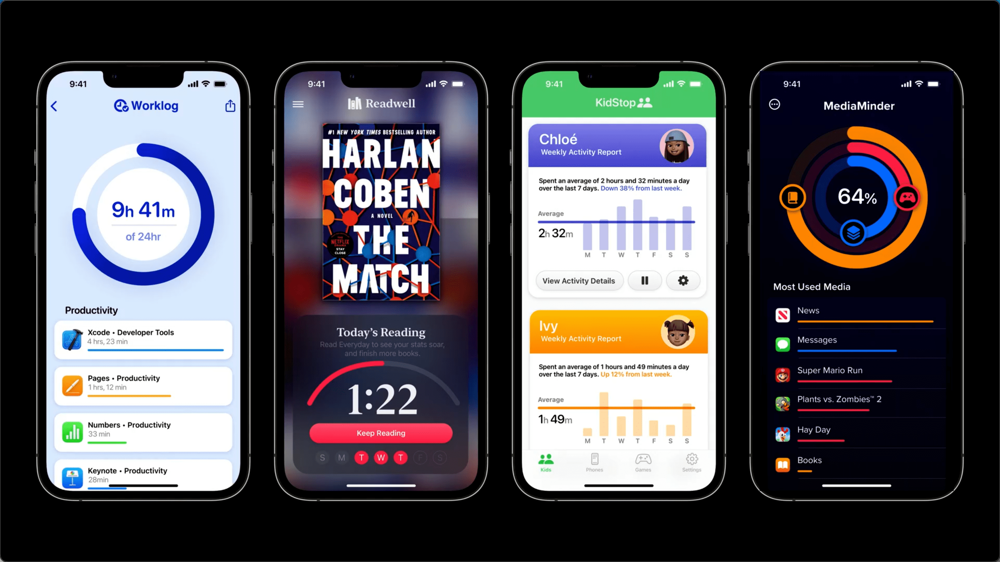

## 总结

新的 Screen Time API 为开发者带来了独立的授权控制、多个独立的 Managed Setting Store 用于区分不同的使用限制、可自定义的设备使用数据展示 UI，其中独立的授权控制正是对去年开发者提出的“个人设备时间管理”诉求的回应。与此同时，苹果一如既往的对用户的隐私进行安全的保护。

个人感觉在 iOS 16 中，苹果将 Screen Time API 拆分的更加细致，为开发者提供了更多自定义功能支持。尤其是数据报告支持 Swift UI ，这将会激发开发者更多的热情来为数据展示的用户体验而努力。相较于去年适用于“家长-子女”关系的应用监控管理，今年新的特性将支持自我监控管理，个人预感将会有更多的日程类、时间管理类应用会使用 Screen Time API 来拓展管理。

随着 Screen Time API 的功能日益完善，个人又有一个新的想法：如果 Screen Time API 与 iOS 15 推出的“专注模式”相结合，这样既可以控制应用网站的访问权限，又可以在消息通知上有所管理。两者相结合，对于时间管理、自制力与专注度的提升将会提供很大的增益。期待苹果为开发者带来更多的惊喜。

## 相关资料

- [Apple Support：使用 iPhone、iPad 或 iPod touch 上的“屏幕使用时间”](https://support.apple.com/zh-cn/HT208982)
- [Apple Support：使用您孩子的 iPhone、iPad 和 iPod touch 上的“家长控制”](https://support.apple.com/zh-cn/HT201304)

- [Video：Get to know Screen Time for families on iPhone, iPad, and iPod touch](https://www.youtube.com/watch?v=ZAXcyGw8Q2Y)
