# Session 110338 - 在 Now Playing 中展示播放信息与控制播放

本文基于 [Session 110338](https://developer.apple.com/videos/play/wwdc2022/110338/) 梳理，并对原视频中的代码进行优化，使其更 Swiftly。

> 作者：bq，野生工程师一枚，rocker，专注于音视频和图像处理，就职于字节跳动。
>
> 审核：

导读：本文主要讲述在 Now Playing 中展示播放信息与控制播放，分为：

- Now Playing 是什么
- 在 Now Playing 中展示播放信息与控制播放的最佳实践
- Now Playing 时下的实践与骚操作

## Now Playing

Now Playing 是什么，顾名思义，就是展示正在播放内容的信息的地方。典型的如 iOS、iPadOS、macOS 控制中心的 Now Playing 卡片（tile），不仅仅是展示信息，还能控制播放。

如 iOS 制中心的 Now Playing 部分展示了当前设备上正在播放媒体的封面（artwork）、标题和进度。它还允许用户播放、暂停，甚至快进快退。展开 Now Playing 卡片还能展示更多细节，如封面图片和播放进度，它还允许你拖动进度和调节音量。在锁屏界面同样展示了相同的信息和控件，为用户提供了一个便捷的地方来检查播放进度、播放状态，甚至是无需解锁 AirPlay 到另一台设备。

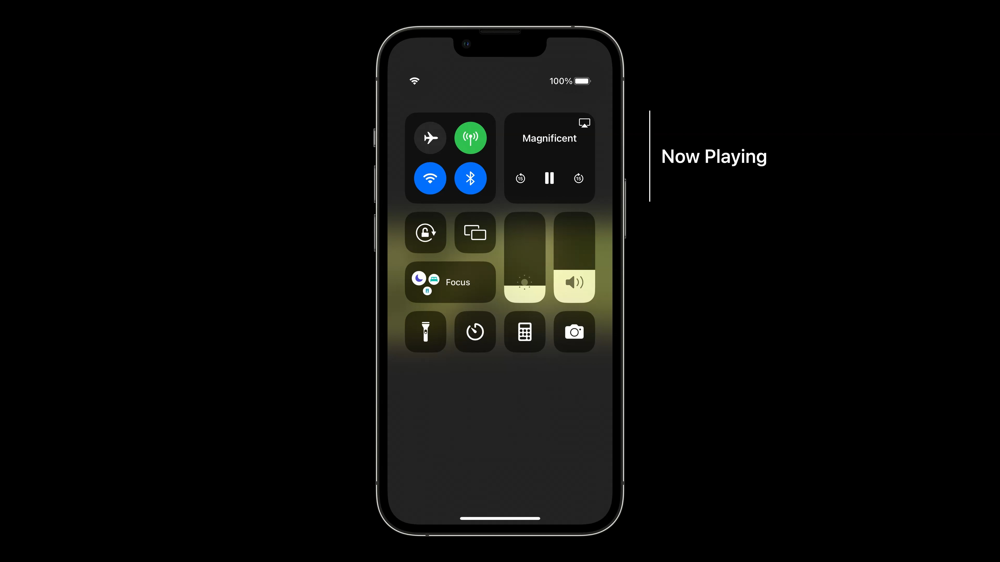

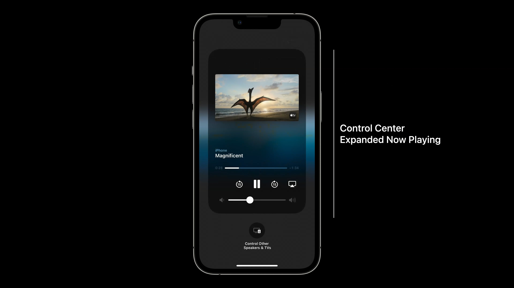

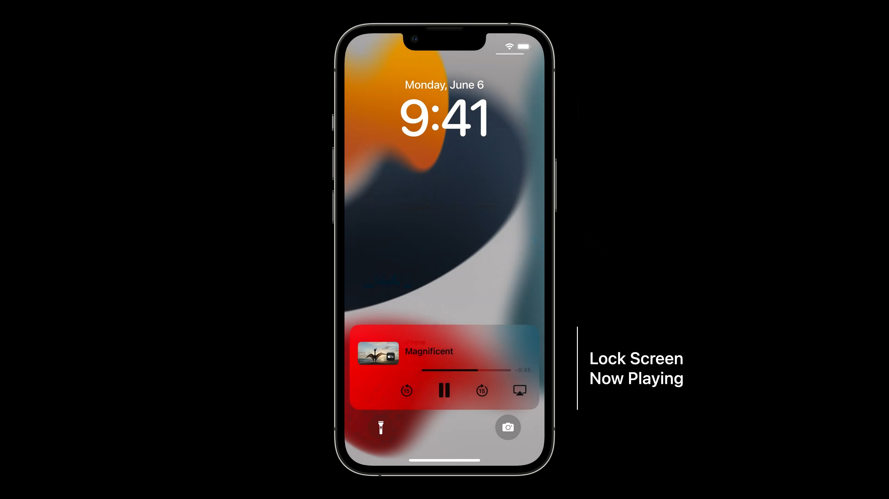

另外，无论使用什么设备进行播放，与之配对的 Apple Watch 上的 Now Playing App 都提供相同的体验。它甚至还内置了 Apple TV 遥控器。

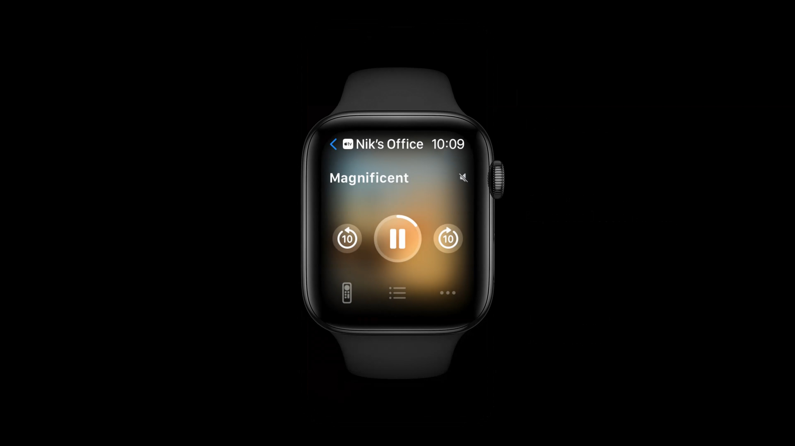

在 tvOS 上使用 AVKit 时，播放界面中以信息浮层将展示标题和章节信息。当下滑到信息面板时，会展示更多详细信息，如封面图片和描述。按住 Apple TV 遥控器上的 TV 按钮时会展示控制中心，也会有类似 iOS 的 Now Playing 卡片，支持展开。当在 tvOS 上后台播放音频内容时，无论是按下遥控器上的播放按钮，还是从另一台设备上选择 Music App 中的曲目，都会展示带有 Now Playing 信息的通知。另外，在 tvOS 播放音频时，停止操作一会后，tvOS 会全屏展示当前 Now Playing 的内容。

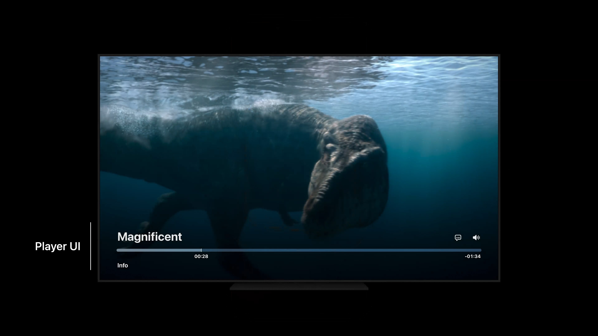

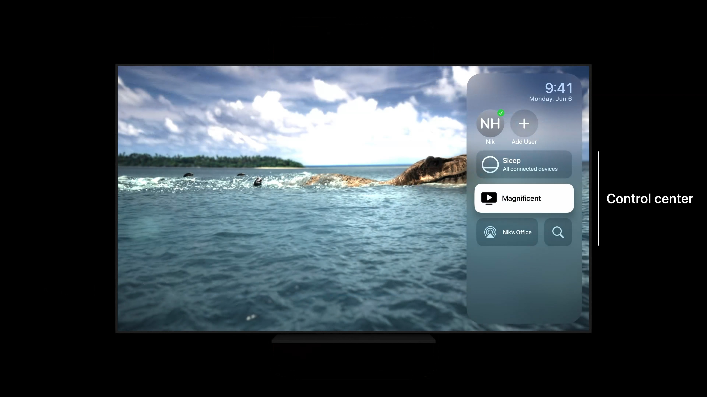

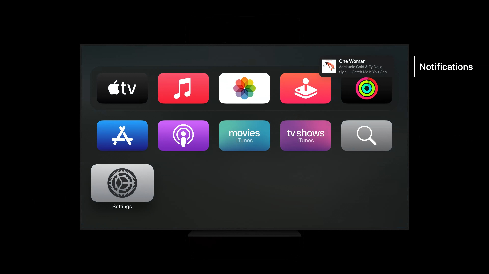

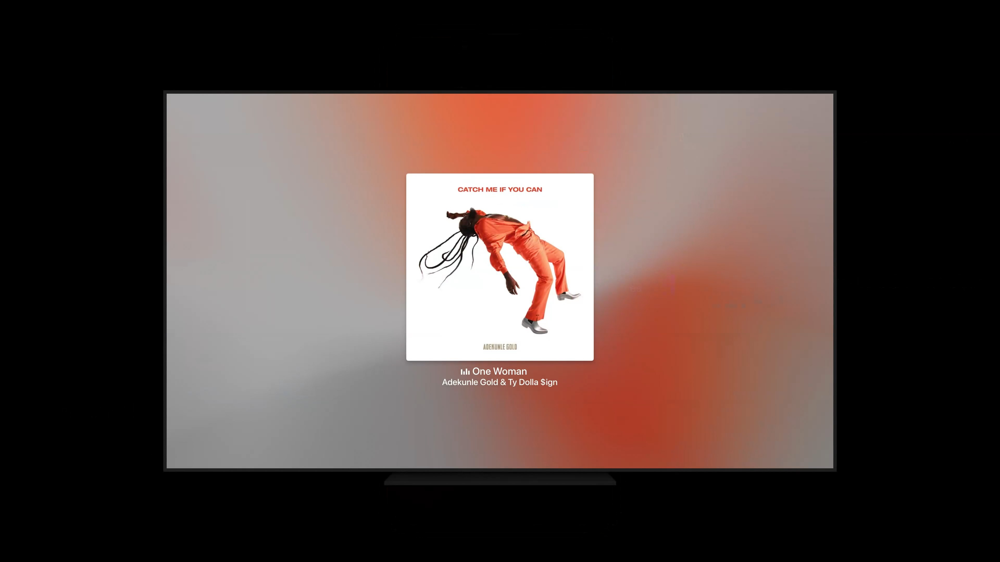

最后，在 iOS 的“控制其他扬声器”（Control Other Speakers）和 TV 按钮上，可以浏览所有设备上 Now Playing 的信息，并控制其播放。

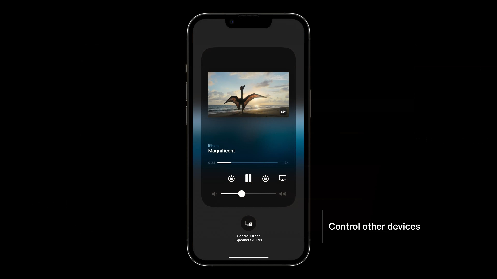

随着在 Now Playing 中展示信息、可控制播放的设备的增加，正确发布 Now Playing 的信息和响应远程命令就尤为重要了。

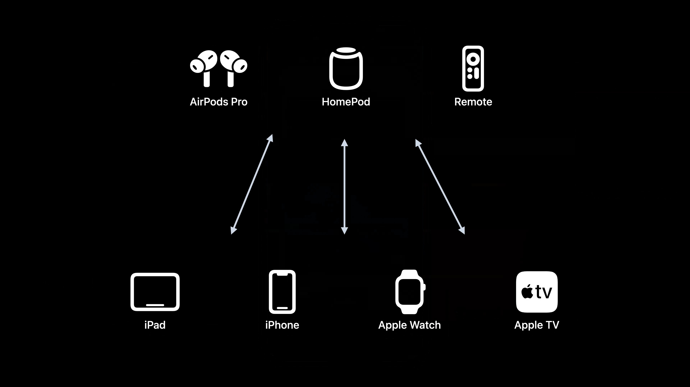

下面，看看 Apple 官方在 Now Playing 的最佳实践。

## 在 Now Playing 中展示播放信息与控制播放

这部分内容从以下几个方面由浅入深地讲述了 Now Playing 使用：

- 使用 `MPNowPlayingSession` 进行 Now Playing 信息发布与播放控制。
  - 不同的使用场景选择合适的构建方式。
  - 便捷地响应远程播放命令。
  - 支持自动元数据发布。
- 使用 AVKit 时如何发布元数据。
- 使用自定义播放器时，如何手动发布元数据。

### MPNowPlayingSession

使用 AVFoundation 播放媒体时，发布 Now Playing 元数据和响应播放交互的最佳方式是使用 `MPNowPlayingSession` 类。该类以前只能在 tvOS 上可以使用，现在也能在 iOS 16 上使用了。它用于表示不同的播放会话，如果 App 包含多个活动会话，它可以控制 Now Playing 的状态。它支持手动元数据发布，以及在 iOS 和 tvOS 16 新增的自动发布。使用 AVKit 时，不应在 tvOS 上使用 `MPNowPlayingSession`，它有自己的自动发布机制。

成为 Now Playing 的 App，系统会将相关信息展示到控制中心、锁定屏幕等，并接收用户在任意界面的播放控制。使用 `MPNowPlayingSession`，可以在单个 App 中表示多个并发播放会话。但当使用多个会话时，App 必需将其中一个会话提升为活动会话，当进行远程播放控制时，该会话将展示在整个系统中。例如，当使用画中画（Picture in Picture）功能，就可能有两个并发播放会话，其中全屏播放的会话应作为活动的 Now Playing 会话。

系统还有一些启发式的途径保证 App 合法使用 Now Playing：

1. App 至少响应一个远程命令。App 必须至少为一个远程命令注册一个 handler。可以想象，不响应任何播放交互的 App 很可能不是展示在 Now Playing 的理想候选者。
2. App 的 `AVAudioSession` 必须配置为非混合的类别和类别选项，如 `.playback` 类别。播放通知时通常使用可混合播放类别和类别选项，因此这向系统表明当前播放的内容也不是 Now Playing 的合适候选者。

#### 创建 MPNowPlayingSession 实例

下面通过几个例子帮助理解播放会话：

- 单一内容的播放，对应使用单个 `MPNowPlayingSession` 来表示。
- 画中画播放，将有两个 `MPNowPlayingSession`：一个用于主播放器，一个用于画中画播放。
- 赛车现场的多视角视频播放，将会放置四个播放器，每个象限一个，播放比赛的不同视角。这将使用多个播放器的对应一个 `MPNowPlayingSession`。

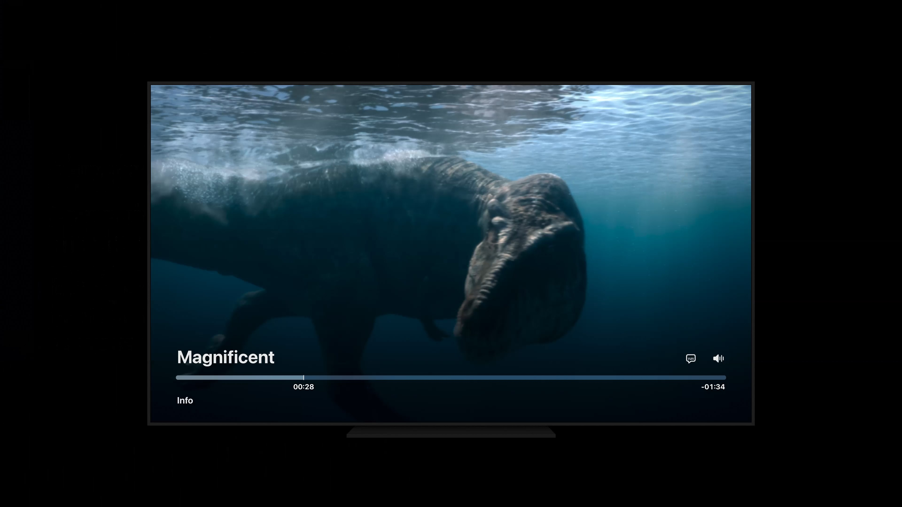

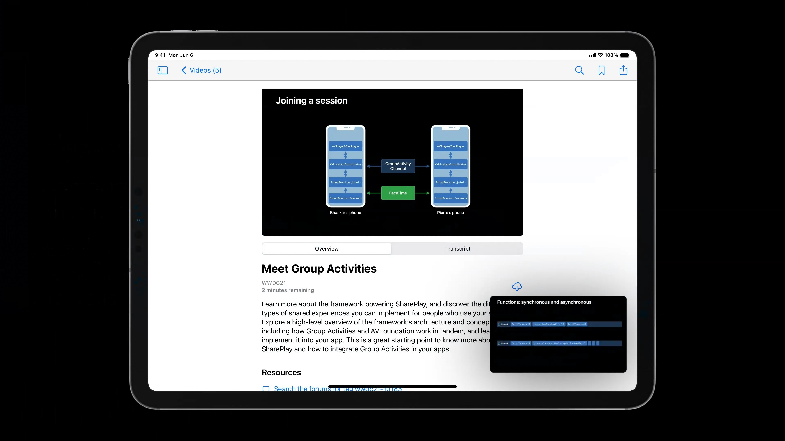


`MPNowPlayingSession` 创建起来也很简单，都是是与 `AVPlayer` 配合使用。

例一：播放单个内容，一个会话对应一个播放器。

```swift
// playing Magnificent
self.session = MPNowPlayingSession(players: [player])
```

例二：使用画中画功能，所以会有两个会话，每个会话会有一个播放器：一个会话对应播放全屏内容，一个会话对应播放画中画内容。

```swift
// Playing different WWDC sessions, one full screen and one in PiP
self.session = MPNowPlayingSession(players: [plaver])
self.pipSession = MPNowPlayingSession(players: [pipPlayer])
```

例三：多视角赛车现场，使用一个会话对应四个播放器。

```swift
// playing multi-view race
self.session = MPNowPlayingSession(players: [topLeft, topRight, bottomLeft, bottomRight])
```

总的来说，一个使用场景对应一个播放会话。

当 App 确实有多个会话时，App 有责任在合适的情况下把给定会话提升为活动会话。例如，如果媒体在画中画中播放时，如果用户将其展开到全屏，则之前的全屏会话不再处于活动状态和 Now Playing，现在的全屏画中画会话应成为活动状态。这种转换可以通过在 `MPNowPlayingSession` 上调用 `becomeActiveIfPosable` 来完成。

```swift
// Promoting and demoting sessions as Now Playing

self.session = MPNowPlayingSession(players: [player])
self.pipSession = MPNowPlayingSession(players: [pipPlayer])

// if the content in PiP is promoted to full screen, swap active

self.pipSession.becomeActivelfPossible { becameActive in
    // if success, pipSession data populates lock screen, etc, and controls from lock screen, etc are routed to pipSession
}
```

#### 响应远程命令进行播放交互

`MPNowPlayingSession` 可以接收和响应远程命令，远程命令可能是来自锁屏或者另一个房间的 HomePod。

其实声明真正接收和响应远程命令的还是 `MPRemoteCommandCenter` 对象，在 Apple 推出 `MPNowPlayingSession` 之前要响应远程命令是直接使用其单例（`MPRemoteCommandCenter.shared()`）进行操作的。如今每个 `MPNowPlayingSession` 实例都有自己的 `MPRemoteCommandCenter` 实例，这种转变意味着可以为每个播放会话配置独立的远程命令响应逻辑。

以注册播放和暂停命令为例，让 App 能够在用户从另一台设备按下播放/暂停按钮或使用 Siri 发出相应命令时收到回调。

```swift
// Example of responding to play and pause commands

self.session = MPNowPlayingSession(players: [player])

// respond to play commands
self.session.remoteCommandCenter.playCommand.addTarget { event in
    player.play()
    return .success
}

// respond to pause commands
self.session.remoteCommandCenter.pauseCommand.addTarget { event in
    player.pause()
    return .success
}
```

1. 实例化 `MPNowPlayingSession`。因为目前只有一个会话，所以不需要调用 `becomeActiveIfPossible` 方法。当 App 成为 Now Playing App，且只有一个会话时，该会话将是默认会话。
2. 为 `playCommand` 添加 handler，在其中调用播放器的 `play` 方法，并返回成功。
3. 对 `pauseCommand` 做同样的事情。

应该尽可能为 App 支持的或适合当前播放内容的命令添加 handler。

类似地，配置快进和快退命令。该命令适用于大多数播放内容，但像是直播流无法快进的媒体除外。

```swift
// Example responding to skip forward commands

self.session.remoteCommandCenter.skipForwardCommand.preferredIntervals = [15.0]
self.session.remoteCommandCenter.skipForwardCommand.addTarget { event in
    let skipCommand = event as! MPSkipIntervalCommandEvent

    // use player.currentTime() and skipCommand.interval to make new time to seek
    let newTime = player.currentTime() + CMTime(seconds: skipCommand.interval, preferredTimescale: 1)
    player.seek(to: newTime)

    return MPRemoteCommandHandlerStatus.success
}

// commands can also be disabled. for example, during an ad:
self.session.remoteCommandCenter.skipForwardCommand.isEnabled = false

// add handlers for all commands that are applicable to the content
// https://developer.apple.com/documentation/mediaplaver/mpremotecommandcenter
```

1. 必须给出偏好的间隔时长是多少，或者在某个方向上跳过的秒数时长。在这里，我们使用跳过 15 秒。
2. 与播放、暂停命令所做的类似，添加一个 handler，当用户按下快进按钮或要求 Siri 执行快进命令时将调用该 handler。在 handler 中，我们接收一个 `MPSkipIntervalCommandEvent`，因此首先我们把事件转换成该类型。
3. 我们通过获取当前时间和 `MPSkipIntervalCommandEvent` 中提供的间隔时长来计算新的经过时间，执行 `seek`，并返回成功来指示已经成功跳到了新位置。

另外，在带广告的视频中，可能不希望允许用户快进广告，这个场景中，可以通过禁用 `skipForwardCommand` 来实现暂时禁用命令的需求。

> **注意：**
>
> 快进命令响应代码中，使用了 `skipCommand.interval` 来计算新的时间，这是因为虽然上面配置了 `skipForwardCommand.preferredIntervals`，但该命令也会被 Siri 触发，跳过的时长就不一定是 `preferredIntervals`，而是具体的 `interval`。

#### 自动元数据发布

`MPNowPlayingSession` 还支持自动元数据发布。

自动发布机制通过自动维护元数据属性（它可以直接从播放器中监听，如时长，当前经过时间、播放状态和播放进度），避免了准确维护元数据带来的繁重工作。如果内容中包含不应计算时间到总时长和经过时间的广告，它还可以计算净时间，并进行汇报。其他元数据，如标题、描述和封面图片，可以直接使用 `nowPlayingInfo` 属性添加到 `AVPlayerItem` 中。

> **注意：**
>
> 这里自动发布的只是 `AVPlayer` 的通用信息，像是标题、描述、封面这样的用户信息还是要自行配置的。

下面例子中，使用自动发布机制来完成大部分的工作，并设置标题和封面图片。

```swift
// Example of setting artwork metadata

let artwork = MPMediaItemArtwork(boundsSize: image.size) { _ in image }
let title = "Magnificent"

playerItem.nowPlavingInfo = [
    MPMediaItemPropertyTitle: title,
    MPMediaItemPropertyArtwork: artwork,
    // ...
]

self.session = MPNowPlayingSession(players: [player])
self.session.automaticallyPublishNowPlayingInfo = true
```

1. 封面图片使用 `MPMediaItemArtwork` 表示，iOS 10.0- 的 API 是通过传入一个 `UIImage` 进行创建，新的 API 则支持根据尺寸进行异步获取 `UIImage`。大多数 App 将通过网络请求来获取该信息。
2. 设置内容的字符串标题。
3. 把封面和标题设置为使用 `MPMediaItemPropertyTitle` 和 `MPMediaItemPropertyArtwork` 的当前 playerItem 的 `nowPlayingInfo` 字典。Now Playing 元数据可以由 `MPMediaItemProperty` 和 `MPNowPlayingInfoProperty` 组成。
4. 创建传递了播放器的 `MPNowPlayingSession` 实例，并将 `automaticallyPublishNowPlayingInfo` 属性设为 `true`（默认应为 `true`，但 API 文档还未完善，没给出具体描述）。

一旦 `automaticallyPublishNowPlayingInfo` 属性设置为 `true`，`MPNowPlayingSession` 实例将开始监听播放器的状态变化，如拖放进度、播放/暂停事件或当前 playerItem 变化等。

参阅 [General Media Item Property Keys](https://developer.apple.com/documentation/mediaplayer/mpmediaitem/general_media_item_property_keys) 可查询所有可用的 `MPMediaItemProperty`，它们都是以 `MPMediaItemProperty` 为前缀的常量字符串。

参阅 [MPNowPlayingInfoCenter](https://developer.apple.com/documentation/mediaplayer/mpnowplayinginfocenter) 的 Now Playing Metadata Properties 可查询所有可用的 `MPNowPlayingInfoProperty`，它们都是以 `MPNowPlayingInfoProperty` 为前缀的常量字符串。

另外一个例子，将展示如何在已编码（baked into）了广告的 asset 中，让总时长和经过时间不包含广告时间，并继续使用自动元数据发布。

```swift
// Example with ads that should not contribute to elapsed time and duration
let preroll = MPAdTimeRange(timeRange: CMTimeRange(start: .zero, duration: CMTime(seconds: 30, preferredTimescale: 1)))

playerItem.nowPlayingInfo = [
    // ...
    MPNowPlavingInfoPropertyAdTimeRanges: [preroll],
    // ...
]

self.session = MPNowPlayingSession(players: [player])
self.session.automaticallyPublishNowPlavingInfo = true
```

为此，将编码的每个广告创建 `MPAdTimeRange` 实例。在该示例中，有一个从一开始就播放的 30 秒广告。所以其起点为零，时长为 30 秒。跟之前处理标题和封面的方式类似，只需要使用 `MPNowPlayingInfoPropertyAdTimeRanges` 把 `MPAdTimeRange` 数组添加到 playerItem 的 `nowPlayingInfo` 字典中。然后就像之前的处理方式那样，创建 `MPNowPlayingSession` 并启用自动发布。

#### 小结

- `MPNowPlayingSession` 代表的是一个播放会话。
- 可以组合多个播放器和使用多个播放会话。
- 若使用多个活动会话时，需手动控制 Now Playing 状态。
- 支持传统的手动元数据发布和自动元数据发布。自动元数据发布仍需要手动配置像标题、封面这样的用户元数据。
- 支持从生态系统中接收播放控制。
- 每个 `MPNowPlayingSession` 实例都有自己的 `MPRemoteCommandCenter` 实例，可以独立响应远程命令。
- 使用限制：
  - iOS 16.0+。
  - 需使用 `AVPlayer` 作为播放器。
  - 不能用于 `AVPlayerViewController`。

### 使用 AVKit 发布元数据

AVKit 是 AVFoundation 的更高一层的封装，提供了开箱即用的播放功能。不同的平台有不同的表现。

- iOS
  - `AVPlayerViewController`：系统样式的本地或在线音视频播放器，是个 `UIViewController` 子类，提供了默认播放控件，并继承了系统常用的功能。但不支持定制 UI，甚至继承实现子类都不允许。
- tvOS
  - 虽然同样是使用 `AVPlayerViewController`，但支持一些定制化的控件。
- macOS
  - `AVPlayerView`：提供了类似 QuickTime 播放器的播放界面，甚至支持裁剪。
  - `AVCaptureView`：提供了系统默认的录制界面。
- 跨平台通用
  - `VideoPlayer`：SwiftUI 控件，提供了适配了各平台的音视频播放器。
  - `AVRoutePickerView`：新的播放路由（AirPlay）选择器，iOS 11.0+。

前面提到 `MPNowPlayingSession` 不能用于 AVKit，那么 AVKit 是否会有类似的自动发布元数据的机制呢？

答案是肯定的。工作原理类似于 `MPNowPlayingSession`：只需将用户定义元数据直接添加到 `AVPlayerItem`，其他的信息如经过时间、时长和播放状态将自动更新并发布。

AVKit 还负责注册和响应远程命令。使用 AVKit 是上述讨论过的平台功能以及 AirPlay 和画中画等其他功能集成的最佳和最简单的方式。

使用 AVKit 时设置的元数据是使用 `AVPlayerItem` 上的外部元数据（`externalMetadata`）数组完成的，该数组由 `AVMetadataItem` 实例组成，用于描述播放的内容。可以直接从播放器和 asset 中收集元数据进行填充。

注意区别与上面提到的 `nowPlayingInfo`，`nowPlayingInfo` 是个字典，`externalMetadata` 是个 `AVMetadataItem` 数组，使用场景也不一样。

`AVMetadataItem` 是 AVFoundation 表示元数据的最小集，表达的是一个 asset 或 asset track 的元数据。创建一个 `AVMetadataItem` 使用 `AVMutableMetadataItem` 构建，通常会在每个实例上设置以下属性：

```swift
var identifier: AVMetadataIdentifier? { get set }
@NSCopying var value: (NSCopying & NSObjectProtocol)? { get set }
var dataType: String? { get set }
var extendedLanguageTag: String? { get set }
```

- `identifier`：要表达元数据的 key。例如，`AVMetadataCommonIdentifierTitle` 指向内容标题，`AVMetadataCommonIdentifierArtwork` 指向封面图片。
- `value`：对于标题，这是个包含标题的字符串；对于封面图片，这是个包含图像数据的 `NSData` 实例。
- `dataType`：用于表示封面的数据格式。如果包含 JPEG 数据，将使用 `kCMMetadatabaseDataType_JPEG` 表达类型。
- `extendedLanguageTag`：用于在多语言展示不同值，表达该元数据只在该语言下展示，若使用 `und` 或 `undefined` 则能确保所有用户都能展示使用该元数据。如果值设为 `en-us`，英语地区能使用该元数据，但这样会导致语言设置为其他语言（如西班牙语）的设备无法使用该元数据。

下面例子设置了封面图片和标题。

```swift
// Example of setting artwork metadata

let path = Bundle.main.path(forResource: "poster", ofType: "jpg")
let posterData = FileManager.default.contents(atPath: path!)!

let artwork = AVMutableMetadataItem()
artwork.identifier = .commonIdentifierArtwork
artwork.value = posterData as NSData
artwork.datalype = kCMMetadataBaseDataType_JPEG as String
artwork.extendedLanguageTag = "und"

let title = AVMutableMetadataItem()
title.identifier = .commonIdentifierTitle
title.value = "Magnificent" as NSString
title.extendedLanguageTag = "und"

playerItem.externalMetadata = [artwork, title]
```

1. 从 bundle 中获取封面图片数据，但大多数 App 都会从网络资源中获取。
2. 实例化一个可变的 `AVMetadataItem`。
3. `identifier` 设置为 `commonIdentifierArtwork`。
4. `value` 设置为原始图像数据的 `NSData`。由于图像数据格式是 JPEG，所以把 `dataType` 设置为 `kCMMetadataBaseDataType_JPEG`。如果图片数据格式是 PNG，则设为 `kCMMetadataBaseDataType_PNG`。
5. `extendedLanguageTag` 设置为 `und`，让元数据对任何语言的设备的用户可见。
6. 对标题进行类似的操作。
7. 设置完所有元数据后，将其添加到数组中，并设置为 `AVPlayerItem` 的 `externalMetadata` 属性。

与封面图片类似，还可以设置其他元数据，如描述、字幕信息和内容评级。App 应设置尽可能多的这些信息，以为用户提供尽可能丰富的体验。如：

- `AVMetadataIdentifier
  `
  - `commonIdentifierTitle`
  - `commonIdentifierArtwork`
  - `commonIdentifierDescription`
  - `iTunesMetadataTrackSubTitle`

- `AVMetadataKey`
  - `iTunesMetadataKeyContentRating`
  - `quickTimeMetadataKeyGenre`


更多元数据标识可参阅 [AVMetadataIdentifier](https://developer.apple.com/documentation/avfoundation/avmetadataidentifier) 和 [AVMetadataKey](https://developer.apple.com/documentation/avfoundation/avmetadatakey)。

### 手动发布元数据

上面提到要使用 `MPNowPlayingSession`，前提要使用并传递 `AVPlayer`，AVKit 的 `AVPlayerViewController` 也需要传递 `AVPlayer`，在 iOS 上甚至还不支持定制 UI。若 App 中不使用 `AVPlayer`，还可以通过手动发布元数据来使用 Now Playing。

手动发布需要为所有元数据提供值。与自动发布不同，经过时间和播放速度不能由系统为你确定。这意味着可以对底层播放状态进行手动精细控制，App 负责随播放更新其准确状态。

> **注意：**
>
> 这里仍需要注册和响应远程命令，并且因为没有使用 `MPNowPlayingSession`，所以必须使用 `MPRemoteCommandCenter` 单例。

下面示例展示如何手动更新 Now Playing 信息字典。

```swift
// Example of setting Now Playing information

let artwork = MPMediaItemArtwork(image: image)

let nowPlayingInfo = [
    MPMediaItemPropertyTitle: title,
    MPMediaItemPropertyArtwork: artwork,
    MPMediaItemPropertyPlaybackDuration:playerItem.duration,
    MPNowPlavingInfoPropertyElapsedPlaybackTime:player.currentTime().seconds,
    MPNowPlayingInfoPropertyPlaybackRate:player.rate
]

MPNowPlayingInfoCenter.default().nowPlayingInfo = nowPlayingInfo
```

这里除了要把标题、封面图片这样的用户数据设置外，还需把播放状态（时长、经过时间、播放速度）添加到字典中。在播放过程中发生重大更新时，如播放暂停、快进快退或播放新内容，还需及时更新元数据。

```swift
// On any non-linear time change, playback rate change, or play/pause

var nowPlayingInfo = MPNowPlayingInfoCenter.default().nowPlayingInfo

nowPlayingInfo[MPNowPlayingInfoPropertyElapsedPlaybackTime] = player.currentTime().seconds
nowPlayingInfo[MPNowPlayingInfoPropertyPlaybackRate] = player.rate

MPNowPlayingInfoCenter.default().nowPlayingInfo = nowPlayingInfo
```

其中经过时间可以不需要定期更新，系统会始终根据上次更新时过去了多少时间来推断经过时间。

以上，就是 Apple 官方推荐的 Now Playing 的使用，现在来看看现在各大 App 具体是怎么玩起来的吧。

## Now Playing 时下的实践与骚操作

早在 WWDC 2019，Apple 就做过一次 Now Playing 最佳实践的 session，里面详细介绍了在 iOS/iPadOS 12.2+、tvOS 12.2+ 和 macOS 10.14+ 上成为 Now Playing App 的通用实现。详细 session 可收看 [501: Reaching the Big Screen with AirPlay 2](https://developer.apple.com/videos/play/wwdc19/501/)，另外还精心搭配了示例代码 [Becoming a Now Playable App](https://developer.apple.com/documentation/mediaplayer/becoming_a_now_playable_app)。

回顾 Now Playing 的使用，因为需要兼容旧系统以及自定义播放器的需求，如今大多数 App 展示在 Now Playing 都是通过上述的[手动发布元数据](#手动发布元数据)方案来实现的，即围绕以下两个类的单例进行配置：

- `MPNowPlayingInfoCenter`：展示 Now Playing 元数据信息。
- `MPRemoteCommandCenter`：接收和响应远程命令。

由于可以动态更新，玩法就比较多了。以下测试的机器为 iOS 15.5 的 iPhone 13 mini。

### 动态展示

先回到 Apple Music App 的标准榜样，看看按照苹果的最佳实践出来的效果是怎么样的，下图是在控制中心展开的样式：

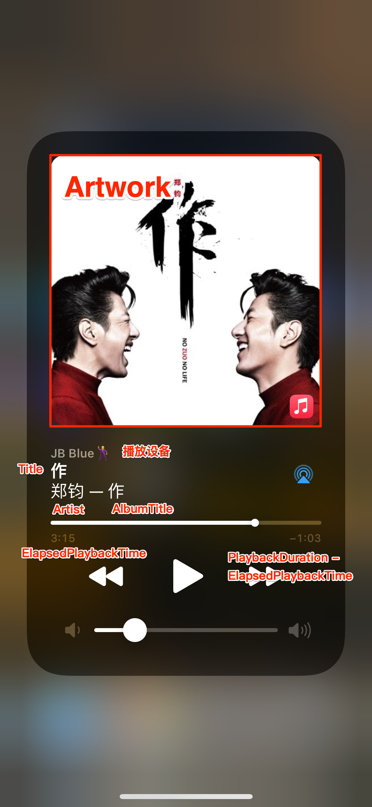

虽然可以设置很多信息，但锁屏和控制中心能展示的信息有限，用户核心关注的可能只是：

- `MPMediaItemPropertyArtwork`：封面图片。
- `MPMediaItemPropertyTitle`：曲目标题。
- `MPMediaItemPropertyArtist`：艺术家。
- `MPMediaItemPropertyAlbumTitle`：专辑标题。

看到这里，你可能会发现，我用的播放器展示的信息不一样呀，会丰富很多，甚至还有滚动歌词！

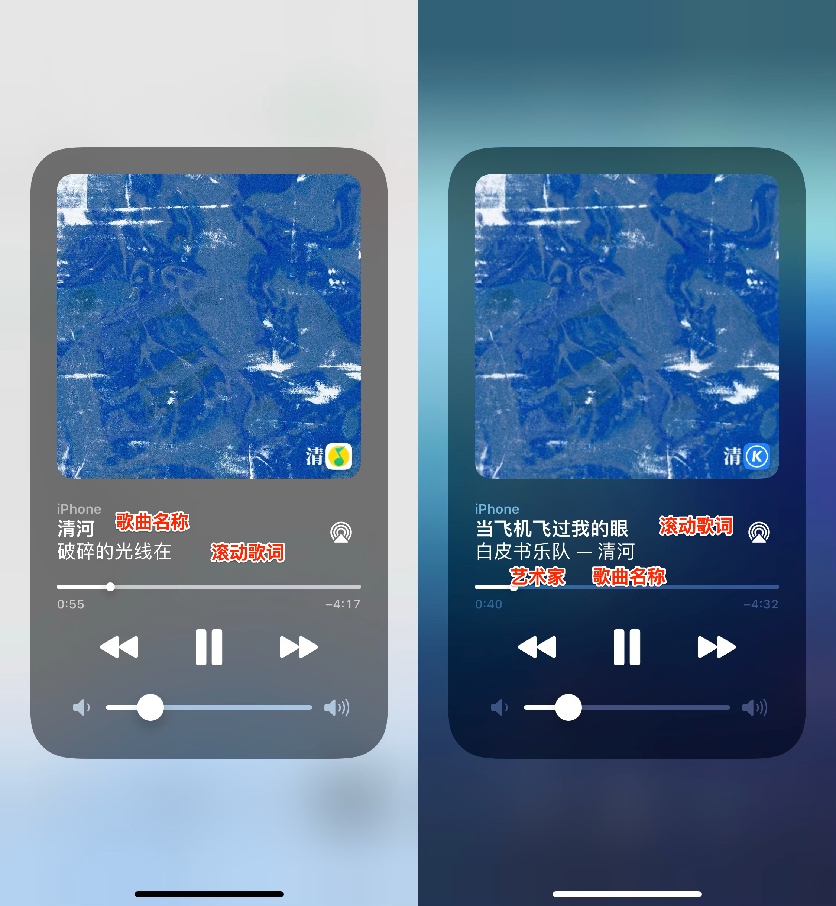

上述几个字段只是定义了信息展示的位置，并没有约束其内容，只要是个字符串就可以了，再加上 `MPNowPlayingInfoCenter` 支持动态实时更新 `nowPlayingInfo` 字典。所以就可以发挥脑洞了，上面两个 App 就是典型的实例。左侧的“QQ 音乐”用 `MPMediaItemPropertyArtist` 或 `MPMediaItemPropertyAlbumTitle` 其中一个字段填充要更新的一句歌词实现实时的滚动歌词。而右侧的“酷狗音乐”则是通过 `MPMediaItemPropertyTitle` 展示滚动歌词，用 `MPMediaItemPropertyAlbumTitle` 展示歌曲标题。

还有更骚的操作，用 `MPMediaItemPropertyArtwork` 实现滚动歌词，实现的方式也很简单粗暴，就是实时地将歌词绘制到专辑封面图片上，然后创建 `MPMediaItemArtwork`，更新到 `nowPlayingInfo` 字典的 `MPMediaItemPropertyArtwork` 字段。

iOS 11.0 之后，控制中心和锁屏界面的专辑封面变小了，还在上面展示歌词就太局促了，甚至都看不清了，ROI 自然就降低了，所以后来大家都只在文字展示的位置玩出花。在 iOS 13.6.1 安装旧版的“网易云音乐”上还是能看出在专辑封面上的滚动歌词。

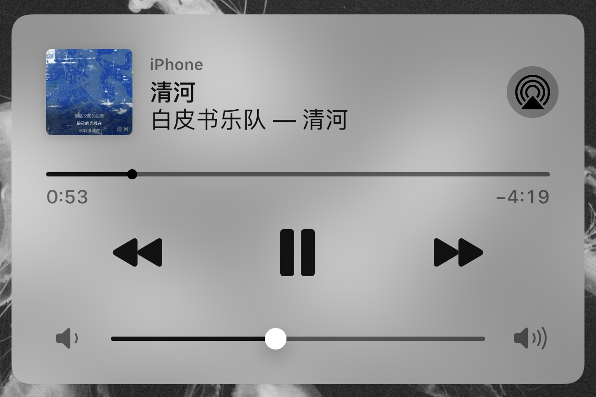

### 自定义控制

`MPRemoteCommandCenter` 提供了许多内置的 `MPFeedbackCommand`，注册不同的命令会有不同的 UI。与上面类似的思路，注册这些命令只是定义了控制中心或锁屏界面  Now Playing 要展示的 UI，或者准确地来说是声明了要展示的图标，甚至其文字都可以通过 `localizedTitle` 配置自定义的内容。所以就有了像“网易云音乐”的更多菜单的效果：


这里使用了 `MPRemoteCommandCenter` 的 `likeCommand` 作为“红心”的菜单选项，使用 `dislikeCommand` 作为“上一首”的菜单选项。这里不用 `previousTrackCommand` 作为“上一首”也是有原因的，因为当有上面提到的这些命令注册后，会“吃掉” `previousTrackCommand` 的位置，导致无法展示 `previousTrackCommand` 对应的菜单项。更多组合方式大家可以发挥脑洞试一试吧。

### 更多骚操作

除了 App 在 Now Playing 上的骚操作，Apple 提供的各种 feature 都有被“合理地”利用起来。

还记得 PC 音乐客户端很喜欢做的“桌面歌词”，现在也“带到”了 iOS。大家想想会是用什么实现呢？

首先要实现桌面级的歌词展示，就必须有个能在桌面展示的机制，所以肯定是使用了某种系统级的服务。看看下面效果，大家可能就瞬间懂了。

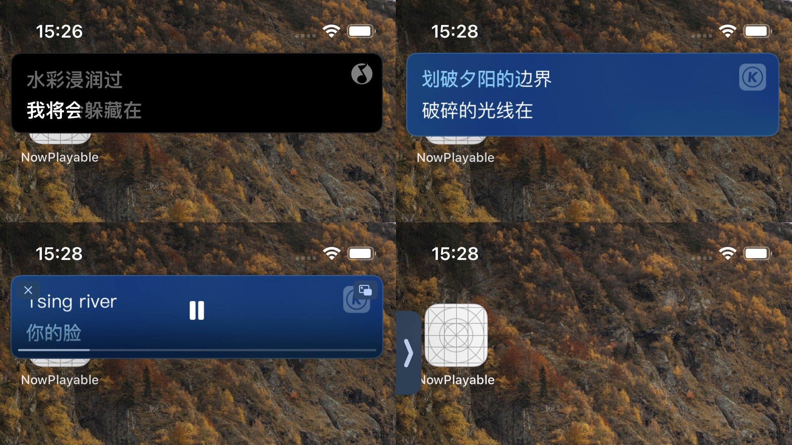

没错，就是 iOS 14 的画中画功能。这可能有些不解，可能很多人理解的画中画是小窗悬浮视频，但假如视频是实时生成的呢？画中画功能的核心控制器 `AVPictureInPictureController` 除了支持展示 `AVPlayerLayer` 的内容，还支持 `AVSampleBufferDisplayLayer`。通过实时生成 sample buffer，就可实现上述的效果。

`AVSampleBufferDisplayLayer` 支持通过 `func enqueue(_ sampleBuffer: CMSampleBuffer)` 方法实时入队并上屏展示 sample buffer。

我们知道 `CMSampleBuffer` 是个包含零到多个压缩或未压缩媒体 sample 的对象。这里的 sample 对于要展示视频的场景来说，是一个未压缩的视频帧，即 `CVImageBuffer`/`CVPixelBuffer`。可以通过 GPU 绘制生成原始位图数据，再封装成 `CVPixelBuffer`，然后封装成 `CMSampleBuffer`，最后调用 `AVSampleBufferDisplayLayer` 的 `enqueue(_:)` 方法进行上屏展示。流程如下：

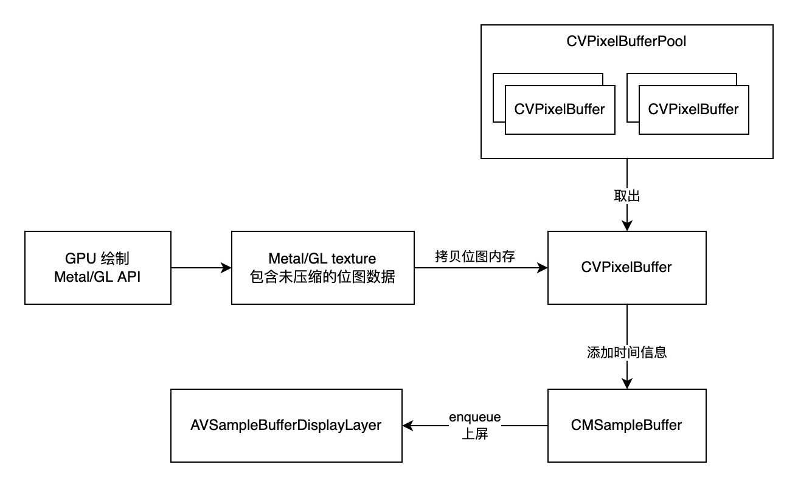

另外，有些聪明的开发者发现画中画弹出后，`UIApplication` 获取的 window 会多出一个，而它刚好就是画中画的 window，那么就可以在上面添加自定义的视图的，这样放什么东西都可以了。配合 KVO 监听画中画的尺寸大小，还能自适应布局，岂不妙哉。

```swift
// MARK: - AVPictureInPictureControllerDelegate

func pictureInPictureControllerWillStartPictureInPicture(_ pictureInPictureController: AVPictureInPictureController) {
    // add custom view to first window
    if let window = UIApplication.shared.windows.first {
        window.addSubview(customView)
        // layout
    }
}

func pictureInPictureControllerDidStartPictureInPicture(_ pictureInPictureController: AVPictureInPictureController) {
    // update custom view content
}

func pictureInPictureControllerDidStopPictureInPicture(_ pictureInPictureController: AVPictureInPictureController) {
    // stop update custom view content
}
```

另外一种实现桌面歌词的方式是利用系统的本地通知，通过实时发送本地通知，实现歌词滚动展示，效果如下：

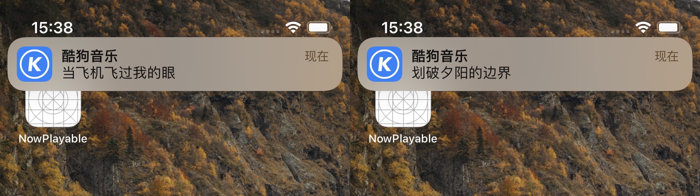

这种样式就单调很多，实现也很简单，管理好 `UNUserNotificationCenter` 即可，还支持修改和删除已发送的通知。至于效果是否讨人喜欢，就见仁见智了。

聪明的你可能还会想到使用 Widget 来展示歌词，但似乎目前的 Widget 刷新机制还不能满足实时刷新展示。

工具是拿来用的，Apple 的 feature 也可视为一种能力，只要内容不设限，任何一种能力都能玩出花来～
