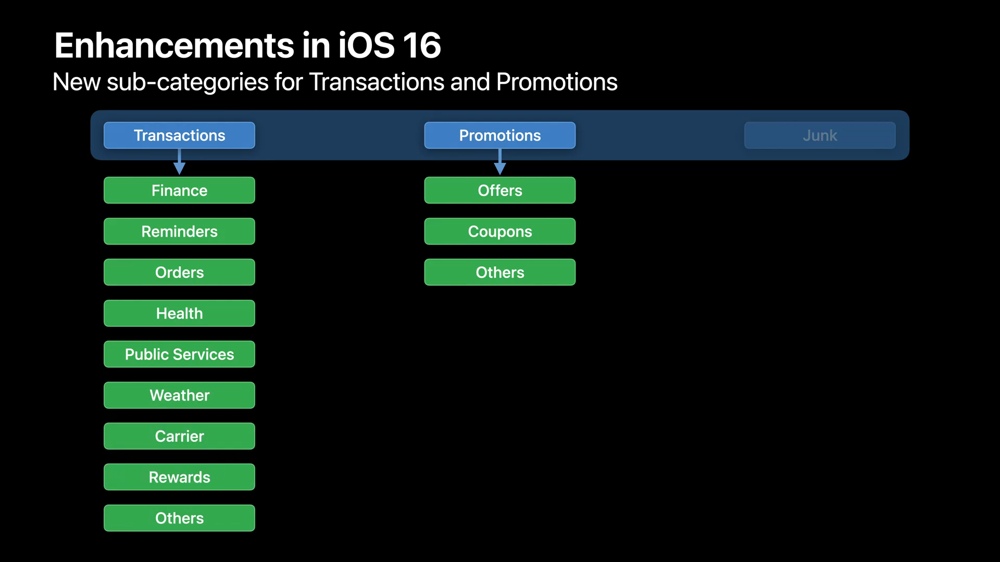
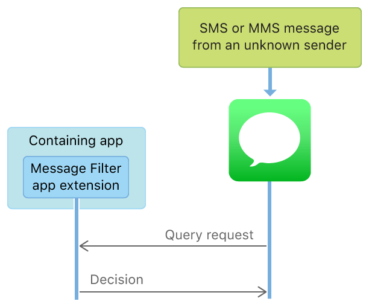
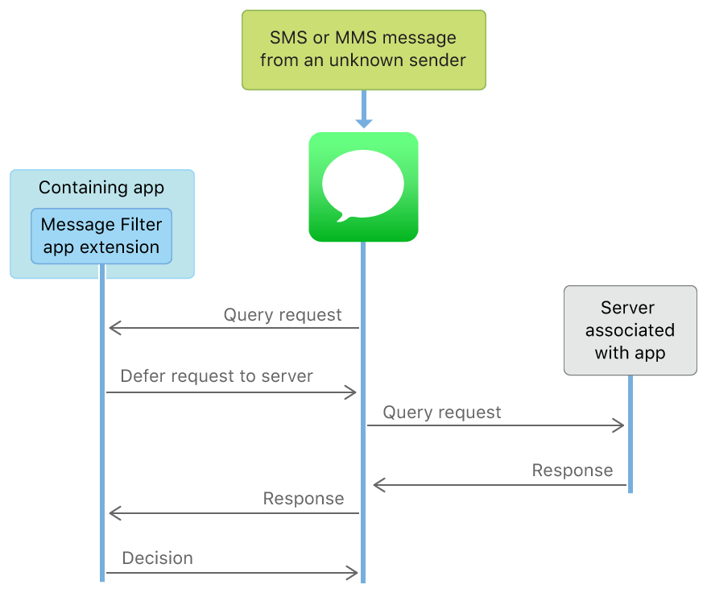
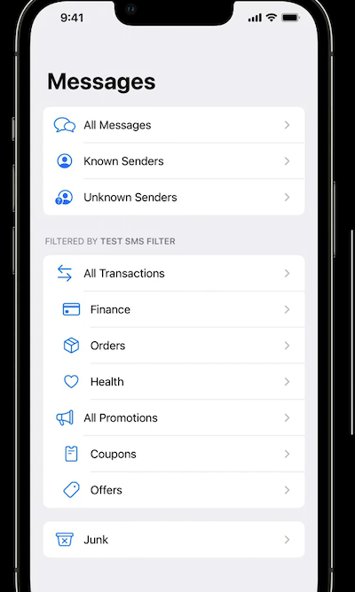
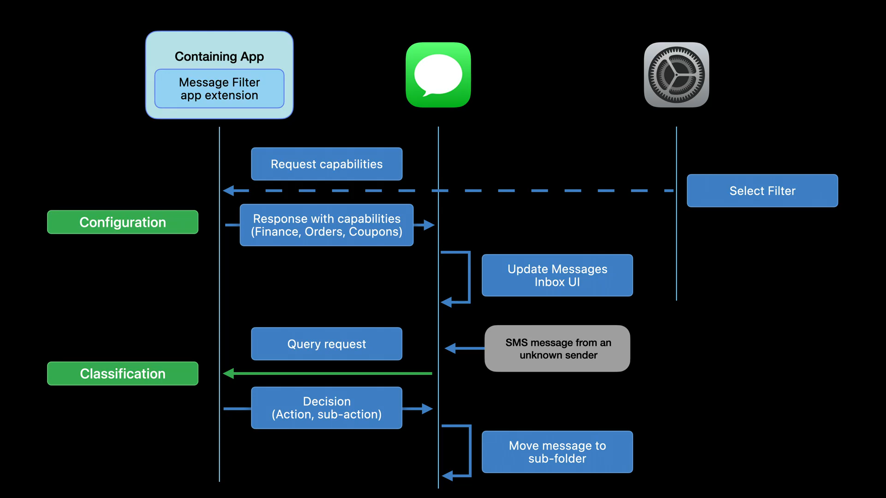
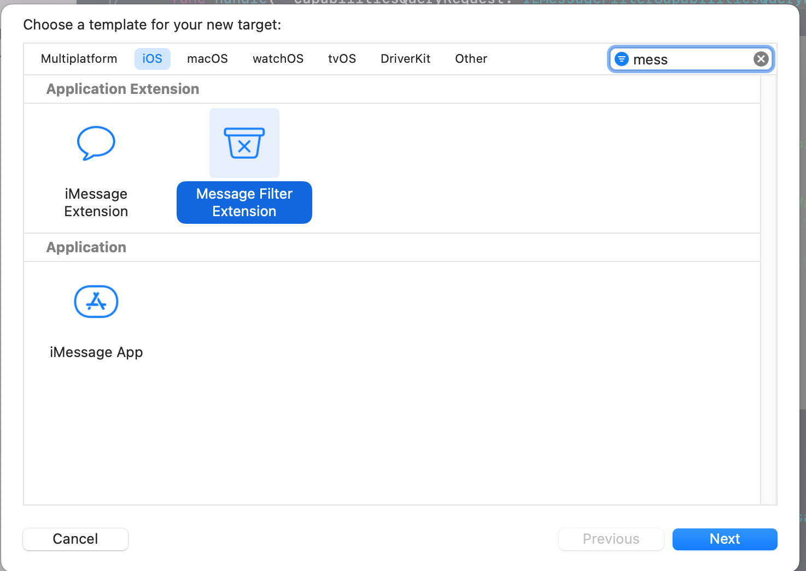
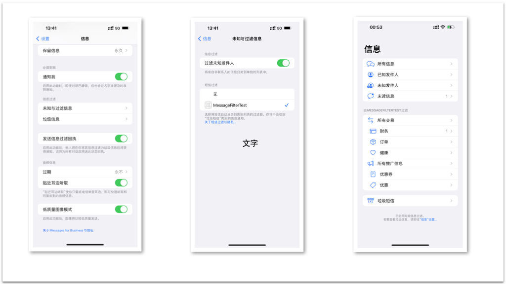
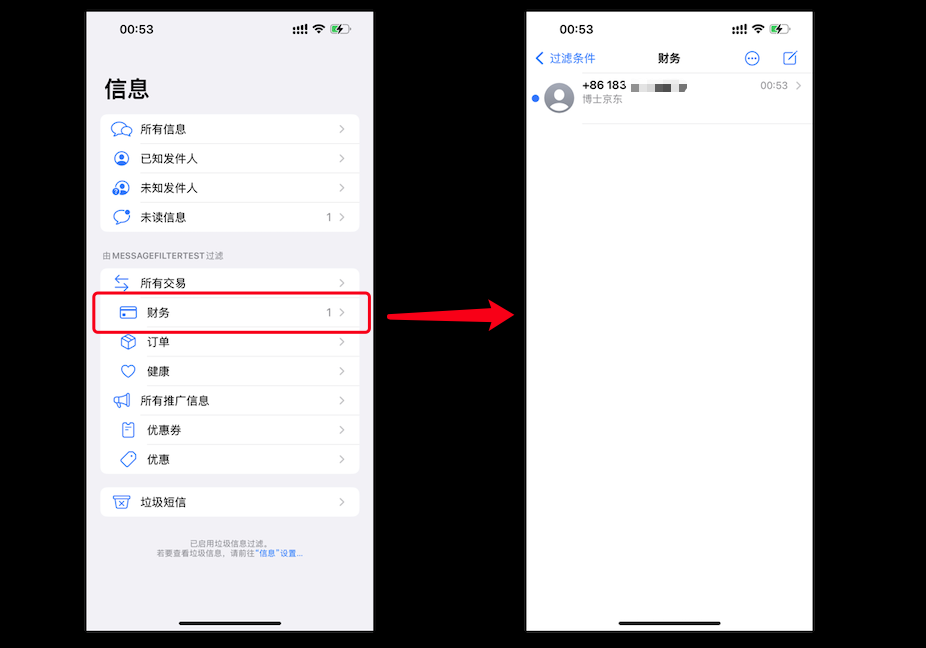
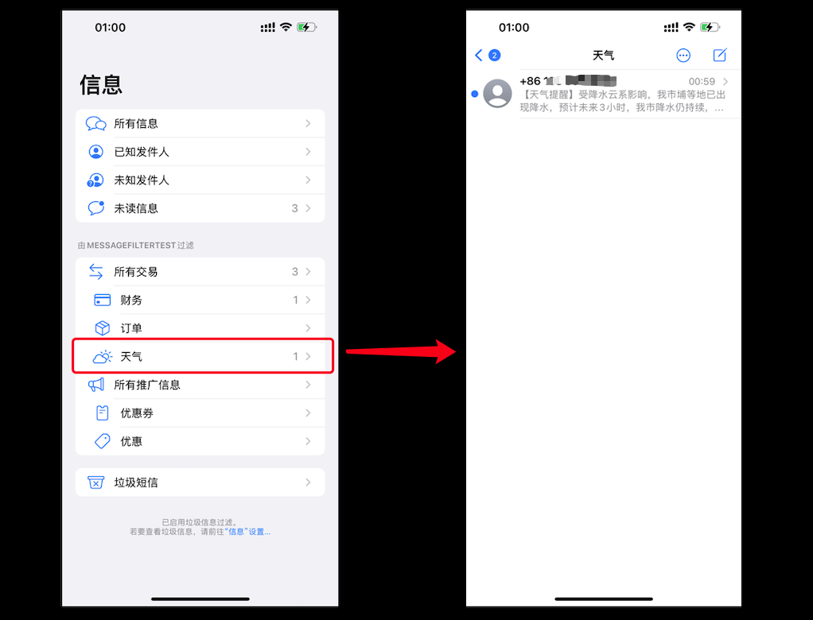
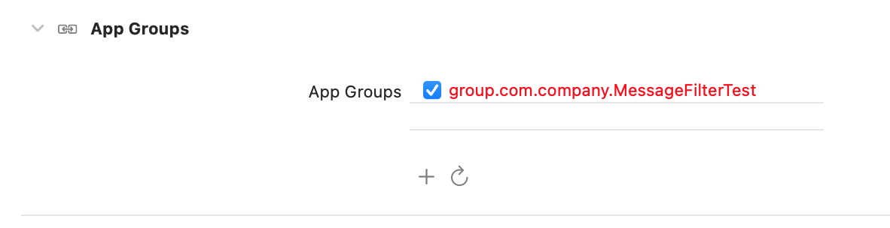

# WWDC2022 110341 - Explore SMS message filters 探索短信过滤器

本文基于[Session 110341](https://developer.apple.com/videos/play/wwdc2022/110341)梳理。

> 作者：Chensh。
>
> 审核：橙汁。

## 前言 

苹果从 iOS 11 的时候就已经推出了 `IdentityLookup` 框架,该框架在保护用户隐私的基础上，提供了一系列 API 接口来帮助用户过滤或上报一些短信SMS或者彩信MMS。

之后在 iOS 14，苹果增加了2种过滤器的筛选类型，分别是 `transaction` （交易短信） 和 `promotion` （推广短信）两种类别，它们将会在短信 App 的入口界面，增加了相应的文件夹入口。如下图：


目前在 App Store 上面有许多做得非常好的短信过滤应用扩展，就是基于这个  `IdentityLookup` 框架能力。有兴趣的可以在 App Store 搜索`短信过滤`等关键词，可以找到很多优秀的短信应用扩展，甚至有些应用扩展还加入 `ML Core` 机器学习框架等能力，帮助增强过滤规则的准确率。

今年的 WWDC 2022 大会，iOS 16 在短信过滤 API 这方面带来了一些新的特性。分别针对 `transaction` （交易短信）和 `promotion` （推广短信）两种类别进行了扩展，增加了 12 个子类型。如下图：



其中 `transaction` （交易短信）增加了9个子类别，分别是： 
- Finace （金融类）
- Reminders （各类提醒）
- Orders （订单）
- Health （健康）
- Public Services （公共服务、公益）
- Weather （天气）
- Carrier （行程信息）
- Rewards （薪资报酬类）
- Others （其他）

 `promotion` （推广短信）增加了3个子类别，分别是：
- Offers （各类营销信息、工作机会等）
- Coupons （各类优惠券）
- Others （其他）

> 小编吐槽：由于国情不一样 ，其实对于国内情况来说，最好的方式还是提供自定义字段类型，例如验证码、提醒信息、垃圾短信等

新增的12个子类型，这给开发者带来了更多的便利，可以给用户提供更为详细的分类筛选。接下来本文将有两个内容介绍：

- 介绍系统短信过滤的原理；

- 提供一个简单的例子来看看最新效果。

## 一、短信或者彩信过滤的原理

> 首先要注意的是，苹果提供的过滤器，仅对于来自未知发件人的短信或彩信有效。
> 通讯录里的联系人发来的信息不会被拦截.
> 回复会话达到 3 次也不会被拦截。

### （一）本地逻辑过滤

为了验证某条未知发件人的消息是否需要进行筛选归类，系统信息 App 会对系统目前已启用的短信过滤应用扩展进行问询，通过 `ILMessageFilterQueryRequest` 对象将消息内容传递给过滤器扩展。其中内容包括 `sender`（发送者号码）、`messageBody`（信息内容）、`receiverISOCountryCode` （接收号码对应的标准ISO 3166-2国家区号）。经过一些逻辑判断过滤，过滤器扩展将判定结果通过 对象返还给系统信息 `ILMessageFilterQueryResponse` App。其流程如下图：



### （二）网络逻辑过滤

如果您的本地处理逻辑因为信息不足无法判定结果，还可以借助后端服务来进行判断。通过如下 API，可以向系统申请网络服务。

```swift
func deferQueryRequestToNetwork(completion: @escaping (ILNetworkResponse?, Error?) -> Void)
```

其流程如下图：



其中网络端的逻辑服务，需要注意的有几点：
- App 里面需要在 `Associated Domains` 加上我们后端的域名。
- 应用扩展 Target 的 `Info.plist` 文件要固定一个访问地址，该地址用于系统发起问询服务。形式如下：

```html
<key>NSExtension</key>
    <dict>
        <key>NSExtensionPrincipalClass</key>
            <string>MessageFilterExtension</string>
        <key>NSExtensionAttributes</key>
            <dict>
                <key>ILMessageFilterExtensionNetworkURL</key>
                <string>https://www.example-sms-filter-application.com/api</string>
            </dict>
        <key>NSExtensionPointIdentifier</key>
        <string>com.apple.identitylookup.message-filter</string>
     </dict>
```

- 后端要配置 [Shared Web Credentials](https://developer.apple.com/documentation/security/shared_web_credentials)，在对应的 `apple-app-site-association` 文件中，加入 `messagefilter` 字段，形式如下：
```json
{
    "messagefilter": {
        "apps": ["<#Team ID#>.com.company.MessageFilterTest.MsgEx",
                 "<#Team ID#>.com.company.MessageFilterTest"]
    }
}
```

### （三）新特性：子分类筛选流程

当应用扩展包含 iOS 16 新的 API 功能后，系统信息在加载的时候，会分为两个阶段：
- configuration 配置加载；
- runtime classification 运行时分类。

当我们在系统的`设置`-`信息`-`未知与过滤信息`中，勾选已经安装的短信过滤扩展后，系统会向该短信扩展发起问询，此阶段属于 configuration `配置加载`阶段。调用函数如下： 

```swift 
func handle(_ capabilitiesQueryRequest: ILMessageFilterCapabilitiesQueryRequest, context: ILMessageFilterExtensionContext, completion: @escaping (ILMessageFilterCapabilitiesQueryResponse) -> Void) {
        let response = ILMessageFilterCapabilitiesQueryResponse()
        // TODO: Update subActions from ILMessageFilterSubAction enum
        response.transactionalSubActions = [.transactionalFinance,
                                            .transactionalOrders,
                                            .transactionalHealth]
        response.promotionalSubActions = [.promotionalCoupons,
                                          .promotionalOffers]
        completion(response)
    }
```

应用扩展则返回相应的 `ILMessageFilterSubAction` 数组对象。新增的12种子分类上文已经提及，信息 App 会根据拿到的子分类数组，进行界面更新，增加相应的分类入口，如下图： 



当信息 App 接收到未知发件人的信息时，会向应用扩展发起问询，传递相应的数据，由过滤器扩展处理后，返回它的决策结果，信息 App 再进行 UI 更新，此阶段为 `runtime classification` 运行时分类。数据处理为如下方法： 

```swift 
func handle(
    _ queryRequest: ILMessageFilterQueryRequest,
    context: ILMessageFilterExtensionContext,
    completion: @escaping (ILMessageFilterQueryResponse) -> Void
)
```

整体流程如下图：



## 二、Demo 演示

接下来我将提供一个简单的例子，来演示 iOS 16 新 API 的功能特性及效果。

###（一）新建工程
打开 `Xcode` 应用，选择新建一个 `iOS` 应用工程。输入工程名 `MessageFilterTest`，这个时候我们得到一个空白的工程，选中菜单栏的`File`-`New`- `Target`，我们新建一个应用扩展。
在iOS平台标签下，选择 `Message Filter Extension`。输入 `Target` 的名字。



###（二）编写筛选分类
此时我们已经创建好了应用扩展，其中文件名为 `MessageFilterExtension.swfit`。
我们在获取 `capabilitiesQueryRequest` 的函数里面返回相应的子分类数组，本示例`transactionalSubAction` 返回 3 个， `promotionalSubActions` 返回 2 个。

```swift
    func handle(_ capabilitiesQueryRequest: ILMessageFilterCapabilitiesQueryRequest, context: ILMessageFilterExtensionContext, completion: @escaping (ILMessageFilterCapabilitiesQueryResponse) -> Void) {
        //
        let response = ILMessageFilterCapabilitiesQueryResponse()
        //
        response.transactionalSubActions = [.transactionalFinance,
                                            .transactionalOrders,
                                            .transactionalWeather]
        response.promotionalSubActions = [.promotionalCoupons,
                                          .promotionalOffers]
        //
        completion(response)
    }
```

然后在 `offlineAction` 函数里面，增加我们的判断逻辑，这里以`京东`、`天气`为关键词，将它们对应返回 `transactionalFinance`、`transactionalWeather` 子类型。

```swift
    private func offlineAction(for queryRequest: ILMessageFilterQueryRequest) -> (ILMessageFilterAction, ILMessageFilterSubAction) {
        //
        guard let message = queryRequest.messageBody else {
            return (.none, .none)
        }
        //
        switch (message) {
        case _ where message.contains("京东"):
            return (.transaction, .transactionalFinance)
        case _ where message.contains("天气"):
            return (.transaction, .transactionalWeather)
        default:
            return (.none, .none)
        }
    }
```

> 这里需要注意的是，返回的 Action 和 subAction 必须匹配，否则子分类会不生效。

之后运行工程，成功在我们真机上面安装后，在`设置`-`信息`-`未知与过滤信息`中，勾选我们的 `MessageFilterTest` 这个过滤器。此时到 信息 App 这个界面，就可以看到我们的分类入口了。 



接下来，我们进行测试，用一个陌生的号码给真机发送短信，短信内容发送包含`京东`关键词，此时短信 App 会将这个未知发件人的归类到我们的 `transactionalFinace`（财务）分类下。



当我们测试短信里面包含`天气`这个关键词时，则会归类到 `transactionalWeather`（天气）这个分类下面。



> 到这里可以看出，我们的过滤器目前仅能对应用扩展安装后的未知发件人发送的信息进行筛选过滤，而原先信箱里面已经存在的信息，则不会再重新分类。

### (三)进阶，过滤器规则动态变更

由于可以申请后端查询服务，所以就算我们本地逻辑无法处理的，也可以通过后端实时更新规则来判定，另外，也可以通过主 App 工程来进行变更。由于应用扩展是运行在沙盒中，隔绝了跟主 App 的数据传输，但是我们可以通过 `App Groups` 这个功能来进行数据共享。

在 Xcode 工程中，开启 `App Groups` 这项权限，勾选同一个 `Groups`，本示例使用 `UserDefault` 来进行共享数据。



创建一个枚举类型 `AppGroupUserDefault`，方便后期不同的需求扩展,代码如下： 

```swift 
public enum AppGroupUserDefault: String {
    case widget = "group.com.company.MessageFilterTest"
    public var standard: UserDefaults {
        switch self {
        case .widget:
            if let ud = UserDefaults.init(suiteName: self.rawValue) {
                return ud
            } else {
                return UserDefaults.standard
            }
        }
    }
}
```

在主工程 App 里面增加一个按钮，用来动态调整过滤规则的关键词。原本的过滤词只有`京东`，当按钮打开后，会增加`淘宝`、`天猫`两个关键词。代码如下： 

```swift 
    // 此处为演示动态增删关键词（规则），通过 App Group 实现数据共享
    @IBAction func keywordSwitchValueDidChanged(_ sender: Any) {
        //
        var keywordArr: [String] = ["京东"]
        //
        if self.keywordSwitch.isOn {
            keywordArr.append(contentsOf: ["淘宝", "天猫"])
        }
        //
        AppGroupUserDefault.widget.standard.set(keywordArr, forKey: "transactionalKeywordArray")
        AppGroupUserDefault.widget.standard.synchronize()
    }
```

最后，在应用扩展的代码里，相应地增加动态获取关键词的逻辑即可。 

```swift
    private func offlineAction(for queryRequest: ILMessageFilterQueryRequest) -> (ILMessageFilterAction, ILMessageFilterSubAction) {
        //
        guard let message = queryRequest.messageBody else {
            return (.none, .none)
        }
        // 此处为演示动态增删关键词（规则），通过 App Group 实现数据共享
        if let keywordArr: [String] = AppGroupUserDefault.widget.standard.stringArray(forKey: "transactionalKeywordArray") {
            for item in keywordArr {
                if message.contains(item) {
                    return (.transaction, .transactionalFinance)
                }
            }
        }
        //
        switch (message) {
        case _ where message.contains("京东"):
            return (.transaction, .transactionalFinance)
        case _ where message.contains("天气"):
            return (.transaction, .transactionalWeather)
        default:
            return (.none, .none)
        }
    }
```

到此，我们的 `Demo` 演示介绍告一段落，通过这个简单的示例，我们可以编写各种符合当下国情短信的规则、关键词，来将一些陌生人信息进行归档，避免太多的信息打扰。以上如有错漏之处，欢迎指出: mail2chensh@gmail.com 。

> Demo工程文件下载： [点击这里](https://github.com/mail2chensh/MessageFilterTest)


