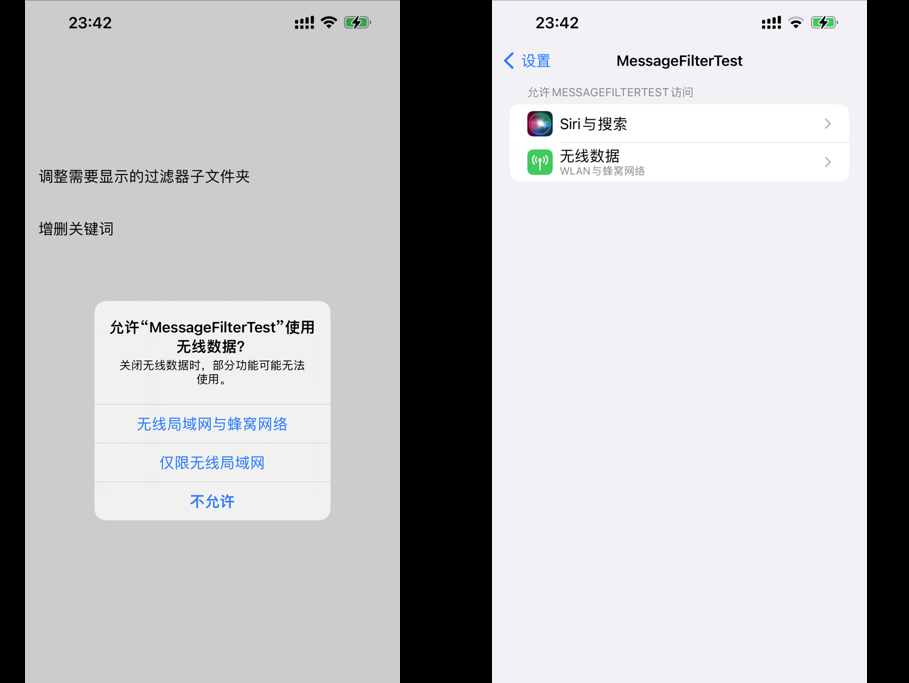
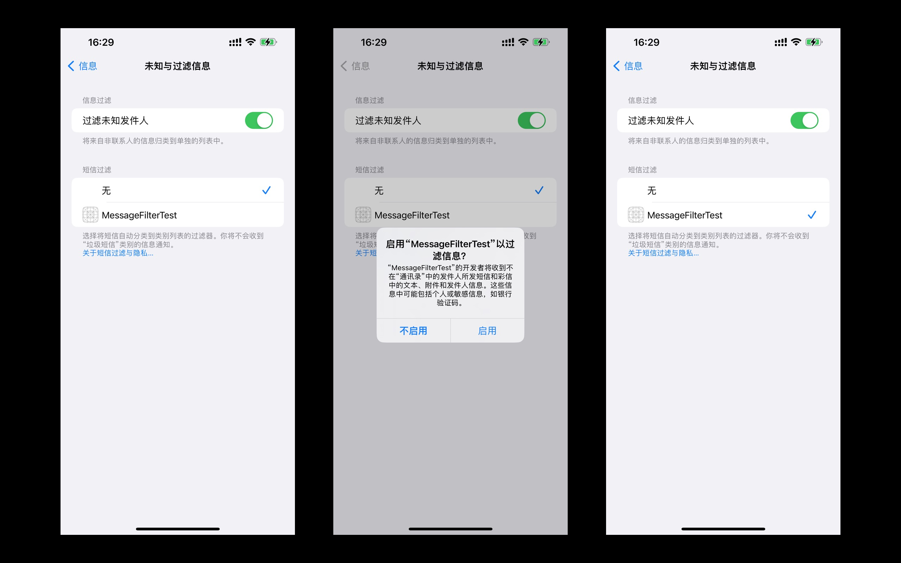
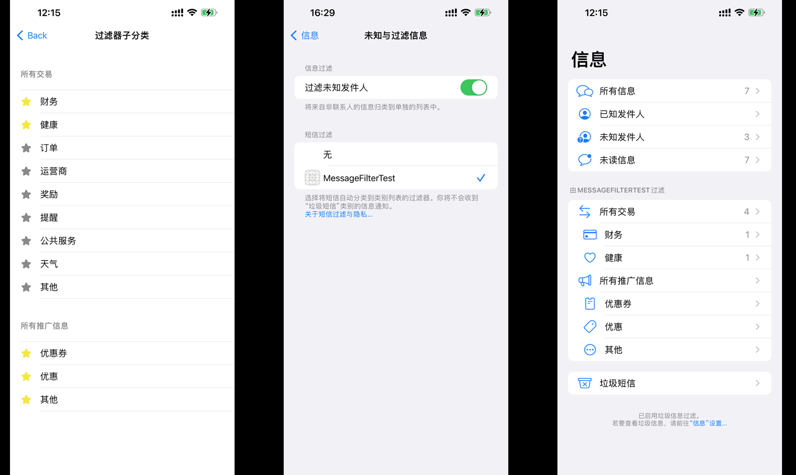
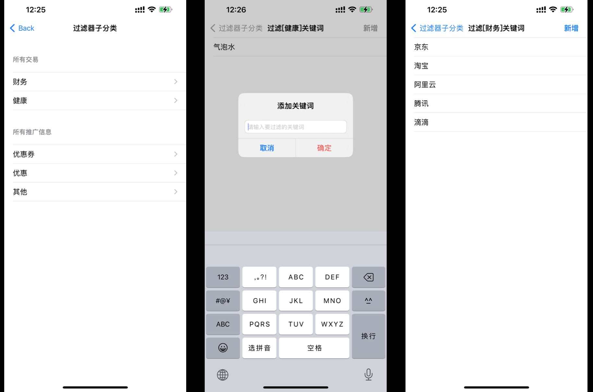

# WWDC2022 110341 - Explore SMS message filters 探索短信过滤器

本文基于[Session 110341](https://developer.apple.com/videos/play/wwdc2022/110341)梳理。

> 作者：Chensh。
>
> 审核：橙汁。

## 前言

在国内，各类 App 登录账号最常用的方式是依靠手机号码进行注册，这也导致信箱里充斥了各类验证码，不仅如此，只要你在购物平台买过东西，也会有很多商家不断地推送各类营销折扣信息给你，除此之外，日常生活中还会接收到包括不限于各类 App 平台的信息、生活水电、出行信息通知、运营商通知等等，全部都混杂到一个收件箱里面，让人眼花缭乱。这个时候，用户就会感叹一下，要是能自动将短信过滤筛选，自动分类就好了。

其实早在 iOS 11 的时候，苹果官方就已经推出了 `IdentityLookup` 框架，该框架提供了一系列 API 接口来帮助用户过滤或上报一些短信 SMS 或者彩信 MMS。

> **小编备注：**
> 是的，仅限于短信和彩信，而无法作用于国内用户深恶痛绝的 iMessage 信息骚扰（各类菠菜、在线发牌、小黄网等垃圾信息）。期待苹果官方快点增加对 iMessage 的过滤支持。

也许是听到了众多开发者对于该 API 能力太过局限的呼声，之后在 iOS 14，苹果增加了 2 种过滤筛选类型，分别是 `transaction`（交易）和 `promotion`（推广信息）两种类别，它们将会在系统信息 App 的主界面，增加了相应的文件夹入口。如下图：


目前在 App Store 上面有许多做得非常好的短信过滤应用扩展，就是基于这个  `IdentityLookup` 框架能力。有兴趣的可以在 App Store 搜索`短信过滤`等关键词，可以找到很多优秀的短信应用扩展，甚至有些应用扩展还加入 `ML Core` 机器学习框架等能力，帮助增强过滤规则的准确率。

但是，仅仅加入这 2 种类型对于国内短信现状还是不够，于是在今年的 WWDC 2022 大会，iOS 16 在短信过滤 API 这方面带来了一些新的特性。分别针对 `transaction`（交易短信）和 `promotion`（推广短信）两种类别进行了扩展，增加了 12 个子类型。如下图：


其中 `transaction`（交易短信）增加了 9 个子类别，分别是：

- Finace （财务）
- Reminders （提醒）
- Orders （订单）
- Health （健康）
- Public Services （公共服务）
- Weather （天气）
- Carrier （运营商）
- Rewards （奖励）
- Others （其他）

 `promotion`（推广短信）增加了 3 个子类别，分别是：

- Offers （优惠券）
- Coupons （优惠）
- Others （其他）

> **小编备注：**
> 苹果官方提供的子文件夹类型是固定的，虽然类型有 12 个，但根据小编个人喜好经验，觉得对于国内情况来说，最好的方式还是能提供自定义字段类型，例如验证码、生活水电、垃圾短信等，这样在语义上更贴近国内用户需求。

新增的 12 个子类型，这给开发者带来了更多的便利，可以给用户提供更为详细的分类筛选。接下来本文将有两个内容介绍：

- 介绍系统短信或彩信过滤的工作原理；

- 提供一个 Demo 来演示如何使用这些 API，以及展示它们呈现的效果。

## 系统短信或者彩信过滤的工作原理

> **注意：**
> （1）首先，苹果提供的过滤器，仅对于来自未知发件人的短信或彩信有效。
> （2）通讯录里的联系人发来的信息不会被拦截.
> （3）回复会话达到 3 次也不会被拦截。

### 本地逻辑过滤

为了验证某条未知发件人的消息是否需要进行筛选归类，系统信息 App 会对系统目前已启用的短信过滤应用扩展进行问询，通过 `ILMessageFilterQueryRequest` 对象将消息内容传递给过滤器扩展。其中内容包括 `sender`（发送者号码）、`messageBody`（信息内容）、`receiverISOCountryCode`（接收号码对应的标准 `ISO 3166-2` 国家区号）。经过一些逻辑判断过滤，过滤器扩展将判定结果通过 `ILMessageFilterQueryResponse` 对象返还给系统信息 App。其流程如下图：


### 网络逻辑过滤

如果您的本地处理逻辑因为信息不足无法判定结果，还可以借助服务端来进行判断。通过如下 API，可以向系统申请网络服务。

```swift
func deferQueryRequestToNetwork(completion: @escaping (ILNetworkResponse?， Error?) -> Void)
```

其流程如下图：


其中网络端的逻辑服务，需要注意的有几点：

- App 里面需要在 `Associated Domains` 加上我们后端的域名。
- 应用扩展 Target 的 `Info.plist` 文件要固定一个访问地址，该地址用于系统发起问询服务。形式如下：

```html
<key>NSExtension</key>
    <dict>
        <key>NSExtensionPrincipalClass</key>
            <string>MessageFilterExtension</string>
        <key>NSExtensionAttributes</key>
            <dict>
                <key>ILMessageFilterExtensionNetworkURL</key>
                <string>https://www.example-sms-filter-application.com/api</string>
            </dict>
        <key>NSExtensionPointIdentifier</key>
        <string>com.apple.identitylookup.message-filter</string>
     </dict>
```

- 后端要配置 [Shared Web Credentials](https://developer.apple.com/documentation/security/shared_web_credentials)，在对应的 `apple-app-site-association` 文件中，加入 `messagefilter` 字段，形式如下：

```json
{
    "messagefilter": {
        "apps": ["<#Team ID#>.com.company.MessageFilterTest.MsgEx"，
                 "<#Team ID#>.com.company.MessageFilterTest"]
    }
}
```

当应用扩展发起网络问询时，系统会根据我们配置 `ILMessageFilterExtensionNetworkURL` 的地址发起一个 `Https` 的 `POST` 类型请求。[参考官方文档格式](https://developer.apple.com/documentation/sms_and_call_reporting/ilmessagefilterextensioncontext/2880240-deferqueryrequesttonetwork)，请求的内容体大致如下：

```
POST /server-endpoint HTTP/1.1
Accept: */*
Content-Type: application/json; charset=utf-8
Content-Length: 148
{
    "_version": 1,
    "query": {
        "sender": "14085550001",
        "message": {
            "text": "This is a message"
        }
    },
    "app": {
        "version": "1.1"
    }
}
```

为了验证这个网络处理功能，我这边简单用 `Express` 这个框架来实现后端接口功能。新增一个 `Post` 接口，用于接收苹果传递的数据，并且固定返回过滤结果，如下：

```javascript
// 固定返回过滤结果为真，并且子分类为 10001，即 transactionalFinance （财务）这个子分类
router.post('/', function(req, res, next) {
    logger.info(req.body);
    res.json({"filter": true, "subAction" : 10001}); 
});
```

由上面的代码可以看出，我们后端接口返回的数据结构是由我们自己自定义的，并没有固定要求，只需要我们的 iOS 客户端和后端协商好即可。

这里不由得提一下小编踩到的`一个坑`，在处理网络了逻辑请求时，应用扩展的网络请求函数 `deferQueryRequestToNetwork` 一直返回报错，错误如下：

```log
Printing description of error:
▿ Optional<Error>
  - some : Error Domain=com.apple.IdentityLookup.error.messagefilter Code=4 "(null)" 
  UserInfo={NSUnderlyingError=0x102d08700 {Error Domain=NSURLErrorDomain Code=-1009 "The Internet connection appears to be offline." UserInfo={_kCFStreamErrorDomainKey=1, _NSURLErrorFailingURLSessionTaskErrorKey=LocalDataTask <3CF7F1F3-BC7B-4E3C-ACE7-194925EE1208>.<1>, _NSURLErrorRelatedURLSessionTaskErrorKey=(
    "LocalDataTask <3CF7F1F3-BC7B-4E3C-ACE7-194925EE1208>.<1>"
), NSLocalizedDescription=The Internet connection appears to be offline.,
 NSErrorFailingURLStringKey=https://www.chensh.fun/messagefilter, 
 NSErrorFailingURLKey=https://www.chensh.fun/messagefilter, _kCFStreamErrorCodeKey=50}}}
```

这里的错误 `Code` 一会为 3，一会为 4，搞得小编头大，前前后后检查了工程配置，没找到问题。最后在打开其他新下载的 App 时，才突然找到苗头，问题就在于我的主 App 工程没有进行网络请求，所以系统也没有弹出是否允许 App 使用无线数据的弹窗，导致应用扩展没有网络请求权限，所以就有了后来的网络访问一直失败。



### 新特性：子文件夹分类筛选流程

当应用扩展包含 iOS 16 新的 API 功能后，系统信息在加载相应扩展的时候，会分为两个阶段：

- configuration 配置加载；
- runtime classification 运行时分类。

#### configuration 配置加载

当我们在系统的`设置`-`信息`-`未知与过滤信息`中，勾选已经安装的短信过滤扩展后，系统会向该短信扩展发起问询请求，此阶段属于 `configuration 配置加载` 阶段。调用函数如下：

```swift
func handle(_ capabilitiesQueryRequest: ILMessageFilterCapabilitiesQueryRequest， context: ILMessageFilterExtensionContext， completion: @escaping (ILMessageFilterCapabilitiesQueryResponse) -> Void) {
        let response = ILMessageFilterCapabilitiesQueryResponse()
        // TODO: Update subActions from ILMessageFilterSubAction enum
        response.transactionalSubActions = [.transactionalFinance，
                                            .transactionalOrders，
                                            .transactionalHealth]
        response.promotionalSubActions = [.promotionalCoupons，
                                          .promotionalOffers]
        completion(response)
    }
```

应用扩展则返回相应的 `ILMessageFilterSubAction` 数组对象。新增的 12 种子分类上文已经提及，系统信息 App 会根据拿到的子分类数组，进行界面更新，增加相应的分类入口，这里的代码我们返回了 3 种 `transactionalSubActions` 和 2 种 `promotionalSubActions`，如下图：


这里要注意的是，系统发起 `configuration 配置加载` 这个问询请求的时机，是在**用户手动勾选应用扩展的时候**，系统会弹出窗体询问用户是否启用该过滤器。如下图。所以当我们进行动态调整分类时，要想让配置重新生效，必须手动再去**启用**一次我们的应用扩展。



此时，系统进程 `com.apple.calls.messagefilter` 会向我们的应用扩展进行 `ILMessageFilterCapabilitiesQueryRequest` 问询请求，拿到最新的子文件夹分组信息后，再更新系统信息 App 界面。

这里我们橙汁同学提出一个有意思的想法，倘若在 `ILMessageFilterCapabilitiesQueryRequest` 用 `while 1 {}` 卡住了，或者不返回相应的 `response` 对象，那么系统会有什么表现？

```swift
func handle(_ capabilitiesQueryRequest: ILMessageFilterCapabilitiesQueryRequest， context: ILMessageFilterExtensionContext， completion: @escaping (ILMessageFilterCapabilitiesQueryResponse) -> Void) {
    //
    while true {
        
    }
}
```

首先通过日志观察我们得知，我们的应用扩展是通过进程间通信 `xpcservice` 与系统的子进程 `com.apple.IdentityLookup.MessageFilter` 进行通信，其中存在异步监听的过程，系统服务发起问询后，就开始等待我们的应用扩展进行 `handshake` 与监听服务建立连接后进行通信。

```log
默认    11:13:50.850684+0800    MsgEx    Hello， I'm launching as euid = 501， uid = 501， personaid = 1000， type = DEFAULT， name = <private>
默认    11:13:50.895790+0800    MsgEx    Initializing connection
默认    11:13:50.896109+0800    MsgEx    Removing all cached process handles
默认    11:13:50.896517+0800    MsgEx    Sending handshake request attempt #1 to server
默认    11:13:50.896822+0800    MsgEx    Creating connection to com.apple.runningboard
默认    11:13:50.897357+0800    runningboardd    Setting client for [xpcservice<com.company.MessageFilterTest.MsgEx([xpcservice<com.apple.IdentityLookup.MessageFilter([osservice<com.apple.imagent>:70])>:7132:7132])>:8301] as ready
默认    11:13:50.898345+0800    MsgEx    Handshake succeeded
默认    11:13:50.898631+0800    MsgEx    Identity resolved as xpcservice<com.company.MessageFilterTest.MsgEx([xpcservice<com.apple.IdentityLookup.MessageFilter([osservice<com.apple.imagent>:70])>:7132:7132])>
默认    11:13:50.899712+0800    MsgEx    Bootstrapping; Bootstrap complete. Ready for handshake from host.
```

如果使用 while 来卡住进程，这里会引发 CPU 占用过高，系统监测到超过一定的阙值会进行警告。

```log
默认    10:26:33.358374+0800    symptomsd    Received CPU usage trigger: 
  MsgEx[7210] () used 144.00s of CPU over 145.64 seconds (averaging 98%)， violating a CPU usage limit of 144.00s over 180 seconds.
```

当监听服务等待超时，或者无法获取正确的数据结构，会进行报错。

```log
Error handling request <ILMessageFilterCapabilitiesQueryRequest 0x102d042b0 extensionIdentifier=com.company.MessageFilterTest.MsgEx>: Optional(Error Domain=NSCocoaErrorDomain Code=4097 "connection from pid 7133 on anonymousListener or serviceListener" UserInfo={NSDebugDescription=connection from pid 7133 on anonymousListener or serviceListener})
```

如果系统问询请求什么都无法拿到，那么系统就默认显示两种父过滤文件夹，不显示子文件夹。

#### runtime classification 运行时分类

当信息 App 接收到未知发件人的信息时，会向应用扩展发起问询，传递相应的数据，由过滤器扩展处理后，返回它的决策结果，信息 App 再进行 UI 更新，此阶段为 `runtime classification` 运行时分类。数据处理为如下方法：

```swift
func handle(
    _ queryRequest: ILMessageFilterQueryRequest，
    context: ILMessageFilterExtensionContext，
    completion: @escaping (ILMessageFilterQueryResponse) -> Void
)
```

以上整体流程如下图：


## Demo 演示

接下来我将提供一个简单的例子，来演示 iOS 16 新 API 的功能特性及效果。

### 新建工程

打开 `Xcode` 应用，选择新建一个 `iOS` 应用工程。输入工程名 `MessageFilterTest`，这个时候我们得到一个空白的工程，选中菜单栏的`File`-`New`- `Target`，我们新建一个应用扩展。
在 iOS 平台标签下，选择 `Message Filter Extension`。输入 `Target` 的名字。


### 编写筛选分类

此时我们已经创建好了应用扩展，其中文件名为 `MessageFilterExtension.swfit`。

考虑到实际应用情况下，用户可能会进行动态调整分组下的子文件类型，所以这里我们可以通过主 App 工程来进行变更。由于应用扩展是运行在沙盒中，隔绝了跟主 App 的数据传输，但是我们可以通过 `App Groups` 这个功能来进行数据共享。

#### 构建 AppGroupUserDefault 来进行数据共享

在 Xcode 工程中，开启 `App Groups` 这项权限，勾选同一个 `Groups`，本示例使用 `UserDefault` 来进行共享数据。


创建一个枚举类型 `AppGroupUserDefault`，方便后期不同的需求扩展，代码如下：

```swift
public enum AppGroupUserDefault: String {
    case widget = "group.com.company.MessageFilterTest"
    public var standard: UserDefaults {
        switch self {
        case .widget:
            if let ud = UserDefaults.init(suiteName: self.rawValue) {
                return ud
            } else {
                return UserDefaults.standard
            }
        }
    }
}
```

这个时候我们就可以通过 `App Groups` 来进行数据共享，我们在主 App 里面加入一个功能，用户可以通过自己调整要显示的子文件夹，这里要注意每次调整后，都要在设置页面里，重新勾选一下我们的应用扩展。



#### 响应 capabilitiesQueryRequest 请求

我们在获取 `capabilitiesQueryRequest` 的函数里面返回相应的子分类数组，如下代码:

```swift
func handle(_ capabilitiesQueryRequest: ILMessageFilterCapabilitiesQueryRequest， context: ILMessageFilterExtensionContext， completion: @escaping (ILMessageFilterCapabilitiesQueryResponse) -> Void) {
    //
    let response = ILMessageFilterCapabilitiesQueryResponse()
    //
    var transactionArray: [ILMessageFilterSubAction] = []
    var promotionalArray: [ILMessageFilterSubAction] = []
    //
    if let array: [Int] = AppGroupUserDefault.widget.standard.array(forKey: Capabilities_Key_Str) as? [Int] {
        for item in array {
            if item >= ILMessageFilterSubAction.promotionalOthers.rawValue {
                promotionalArray.append(ILMessageFilterSubAction.init(rawValue: item) ?? .none)
            } else {
                transactionArray.append(ILMessageFilterSubAction.init(rawValue: item) ?? .none)
            }
        }
    }
    //
    response.transactionalSubActions = transactionArray
    response.promotionalSubActions = promotionalArray
    //
    completion(response)
}
```

> 小编备注：
> 如果想要看所有子文件夹展示效果的，就会发现一个问题，所有的子文件夹总数不能超过 5 个，这个在 session 的视频里面一句带过，但是在官方文档里面还未明确写出。
> 当总数超过 5 个，该框架会直接不显示所有的子文件夹，而仅仅显示两个父文件夹。

#### 响应 ILMessageFilterQueryRequest 请求

然后在 `offlineAction` 函数里面，增加我们的判断逻辑，我们在主 App 里面，加入了手动添加关键词的功能，用户可以根据自己的需求，增加相应的过滤关键词，另外，开发者在这里也可以进行扩展，增加一些像正则过滤的功能等。



然后我们在 ILMessageFilterQueryRequest 这里返回相应的过滤结果，代码如下：

```swift

    private func offlineAction(for queryRequest: ILMessageFilterQueryRequest) -> (ILMessageFilterAction， ILMessageFilterSubAction) {
        //
        guard let message = queryRequest.messageBody else {
            return (.none， .none)
        }
        //
        let result = KeywordManager.shared.isMatchKeyword(content: message)
        return result
    }

    func isMatchKeyword(content: String) -> (ILMessageFilterAction， ILMessageFilterSubAction) {
        for (key， valueList) in self.dict {
            for value in valueList {
                if content.contains(value) {
                    //
                    let subAction = ILMessageFilterSubAction.init(rawValue: Int(key) ?? 0) ?? .none
                    //
                    return (self.getFilterAction(item: subAction)， subAction)
                }
            }
        }
        //
        return (.none， .none)
    }
    
    func getFilterAction(item: ILMessageFilterSubAction) -> ILMessageFilterAction {
        if item.rawValue >= ILMessageFilterSubAction.promotionalOthers.rawValue {
            return ILMessageFilterAction.promotion
        } else {
            return ILMessageFilterAction.transaction
        }
    }

```

> 这里需要注意的是，返回的 Action 和 subAction 必须匹配，否则子分类会不生效。

#### 测试效果

接下来，我们进行测试，用一个陌生的号码给真机发送短信，短信内容发送包含`京东`关键词，此时短信 App 会将这个未知发件人的归类到我们的 `transactionalFinace`（财务）分类下。


当我们测试短信里面包含`天气`这个关键词时，则会归类到 `transactionalWeather`（天气）这个分类下面。


> **小编备注：**
> 到这里可以看出，我们的过滤器目前仅能对应用扩展安装后的未知发件人发送的信息进行筛选过滤，而原先信箱里面已经存在的信息，则不会再重新分类。

> **Question:**
> 每条刚接收到的短信的处理时间多长？
> **Answer：**
> 这里小编没有一个明确的测试结果，根据整体的过滤处理流程，可以看出是一个异步等待时长。其中最多的时间是花在我们的本地逻辑处理和网络逻辑处理。按照我们的代码来看，如果想要缩短信息的过滤等待时长，并且本地的过滤规则做的好，可以考虑去掉网络逻辑处理，因为发起的网络连接有一个等待超时的时间。

到此，我们的 `Demo` 演示介绍告一段落，通过这个简单的示例，我们可以编写各种符合当下国情短信的规则、关键词，来将一些陌生人信息进行归档，避免太多的信息打扰。以上如有错漏之处，欢迎指出: mail2chensh@gmail.com 。

> Demo 工程文件下载： [点击这里](https://github.com/mail2chensh/MessageFilterTest)
