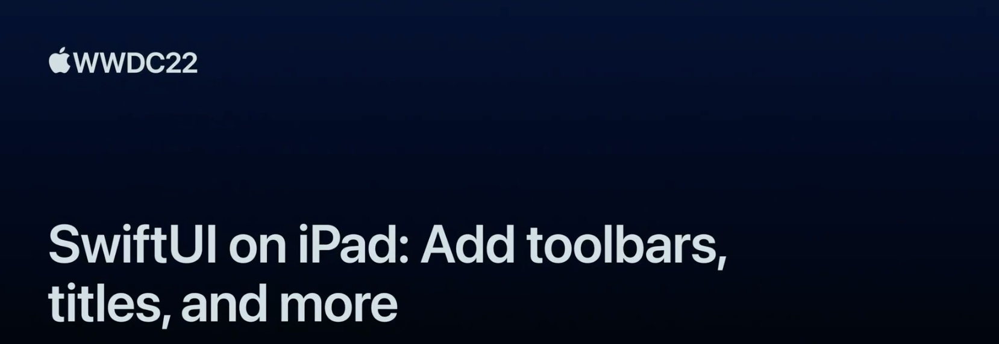

## 个人介绍

sunset，iOS 开发者，目前工作中开始使用 SwiftUI。

## 审核介绍

## 不超过 120 个字的文章简介

本文基于 WWDC22 SwiftUI on iPad: Add toolbars, titles, and more Session 的内容梳理，以官方 Places App 为范例，介绍了 iPadOS 16 对 toolbar 的改进。

## 公众号/小专栏图文头图

