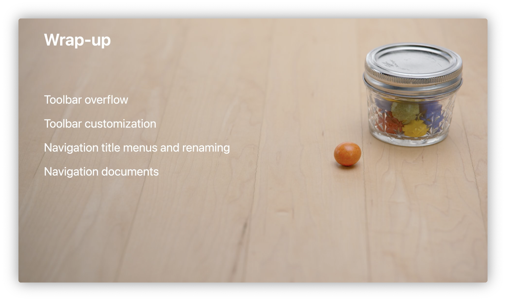

# Session 110343 - SwiftUI on iPad: Add toolbars, titles, and more

> 摘要：本文基于 WWDC22 SwiftUI on iPad: Add toolbars, titles, and more Session 的内容梳理，以官方 Places App 为范例，介绍了 iPadOS 16 对 toolbar 的改进。
>
> 作者：sunset，iOS 开发者，目前工作中开始使用 SwiftUI。

在 iPadOS 16 中，toolbar 新增不少特性。Toolbar 往往是一个应用常用功能的快捷入口。设计一个好的 toolbar 可以提高用户的生产力！

> 📝
> 《SwiftUI on iPad: Organize your interface》和《SwiftUI on iPad: Add toolbars, titles, and more》分别为上下两集。在继续往下阅读之前，建议先看完上半集。

在上半集中，Raj 给我们展示了如何用新的 Table API 构建 Places 应用：


Wow！看起来很不错！但如果有一个能提高用户操作效率的 toolbar，整个 App 的质量就会更上一层楼！    

这里先放出 toolBar 加强后的 Places 应用截图，让大家提前感受到可以利用新 API 做到什么效果：

还新增了对自定义 toolbar 的支持：


Toolbar 新增的改动概览：
* 支持导航栏标题左对齐
* 支持 `ToolbarItem` 居中显示
* 支持次级 `ToolbarItem` 菜单栏
* 支持自定义 toolbar 
* 支持导航栏标题菜单栏


##  Toolbar 新增的 API 
### ToolbarItemGroup
如果有多个 `ToolbarItem` 时，为了适配 compact size class，之前常见的做法是：在 `ToolbarItem` 中塞入一个 `Menu`：

而现在可以借助 `ToolbarItemGroup` 新的 API，自动帮你实现菜单（Overflow Menu）效果：


### Placement
到目前为止，一切看起来还行，但这似乎没能利用到 iPad 大屏的优势，信息密度不高。如上图所示，`ToolbarItemGroup` 新的 API 使用了 placement 的参数，该参数能间接控制 `ToolbarItem` 出现的位置。    

导航栏可以细分为三个不同的区域：

左右两侧一般是放置 `ToolbarItem` 的常见位置，中间一般是用来展示导航栏的标题。

#### Primary Action
被标记为 `primaryAction` 的 `ToolbarItem` 一般放在导航栏的右侧，这代表该 `ToolbarItem` 是该应用最常见的功能的入口之一。


#### Secondary Action
而 iOS 16 新增了 `secondaryAction`。被标记为 `secondaryAction` 的 `ToolbarItem` 常常是应用某些次级功能在导航栏上的入口。
默认情况下，被标记为 `secondaryAction` 的 `ToolbarItem` 不会出现在导航栏上，而是出现在导航栏上的菜单里。


我们可以把 `toolbarRole` 设置为 `editor` 来修改这种默认行为，这样会告诉系统：此时的导航栏需要为编辑效果作优化。系统认为导航栏需要给 `ToolbarItem` 更多的空间，所以把导航栏的标题从中间移动到了左边。这样，`ToolbarItem` 就可以名正言顺地显示在导航栏的中间位置！
 


> 📝
> 只有被标记为 `secondaryAction` 的 `ToolbarItem` 才有可能出现在导航栏的中间位置。
> 在当前为 compact size class 的情况下，导航栏会忽略 `toolbarRole`，继续把标题放在居中的位置。

把 `secondaryAction` 和 `toolbarRole` 组合使用成功地提高了 iPad 大屏展示的信息密度，但如果往导航栏中间塞了过多的 `ToolbarItem` 则会把事情推向另一个极端。

## 自定义 Toolbar 
macOS 上的自定义 Toolbar 功能如今也来到了 iPadOS 上。但只有 `ToolbarItem` 支持自定义，`ToolbarItemGroup` 并不支持自定义。所以我们需要把原有的 `ToolbarItemGroup` 拆分为单个的 `ToolbarItem`，并给每个 `ToolbarItem` 以及 toolbar 视图修饰器（View Modifier）加个唯一的标识。

到此为止，当前这个 toolbar 就支持自定义啦！


> 📝
> [ShareLink](https://developer.apple.com/documentation/SwiftUI/ShareLink) 依赖于一个名为 `Transferable` 的协议，详情请移步 [Meet Transferable](https://developer.apple.com/videos/play/wwdc2022/10062/)。

`ToolbarItem` 也可被设置为默认不显示，这样的 `ToolbarItem` 起初就会藏在自定义 `ToolbarItem` 的弹窗里。


在逻辑上，有些支持自定义的 `ToolbarItem` 是可以被归为一组的。举个例子，假设有两个 `ToolbarItem` 分别是“粘贴”和“复制”，一般来说，用户把“粘贴”拖放在导航栏中，也会再把“复制”一起拖放在导航栏中。如果这样操作两次，就显得有些繁琐。

### Control Group

我们可以使用 Control Group 来给逻辑上关联紧密的 `ToolbarItem` 分成一组。

甚至可以给 Control Group 加上对应的 Label，

效果如下：


##  Navigation title 新增 API
iPadOS 16 也带来了对导航栏标题菜单的支持！

特别地，只要传入对导航栏标题的绑定（Binding）属性，就可以配合 `RenameButton` 来编辑导航栏的标题。但在 Xcode 14 Beta 2 上实际运行这个 API 时，Xcode 发出警告：
> 'navigationTitle(_:actions:)' was deprecated in iOS 16.0: Use 
> ToolbarTitleActions in a toolbar modifier 
> or the toolbarTitleActions modifier.

所以，上图所示代码段应更新为：
```swift
                .toolbarTitleActions(actions: {
                    MyPrintButton()
                    RenameButton()
                })
```

我们也可以把一个 URL 与导航栏标题相关联。关联之后，导航栏标题菜单就会在菜单头部展示出该 URL 对应文档的预览视图：


## Wrap up

iPadOS 16 上对 toolbar 的改进，能有效地帮助用户提高生产力。再者，对 toolbar 良好的适配会使你的应用在 iPad 上与众不同。你的 toolbar 可以是 iPadOS 16 上的 toolbar！