# Session 10058 & 110343 - SwiftUI on iPad

本文中所使用的范例是 Places，它是用来记录地点的应用，帮助使用者从中挑选出适合安静阅读的地点。

## List and tables

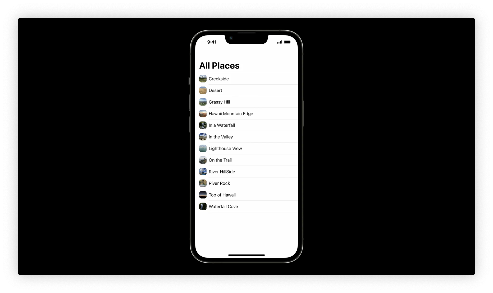
对于上图所示的首页 UI 设计，我们可以使用 `List` 来实现：

``` swift
struct PlacesList: View {
    @Binding var modelData: ModelData

    var body: some View {
        List(modelData.places) { place in
            PlaceCell(place)
        }
    }
}
```

但当这段代码跑在 iPad 上时：
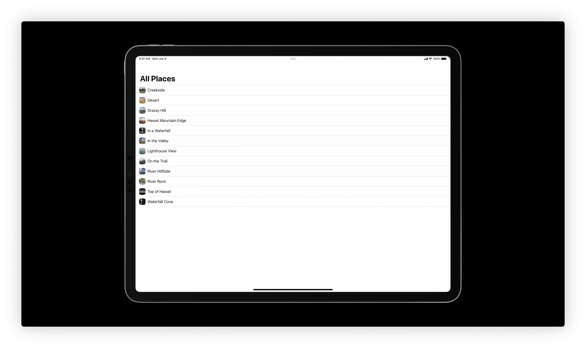
这样的效果并不是人们所期望的 iPad 应用。因为它没有利用 iPad 的大屏优势，导致展示出来的信息密度大幅降低。

### Multi-column tables

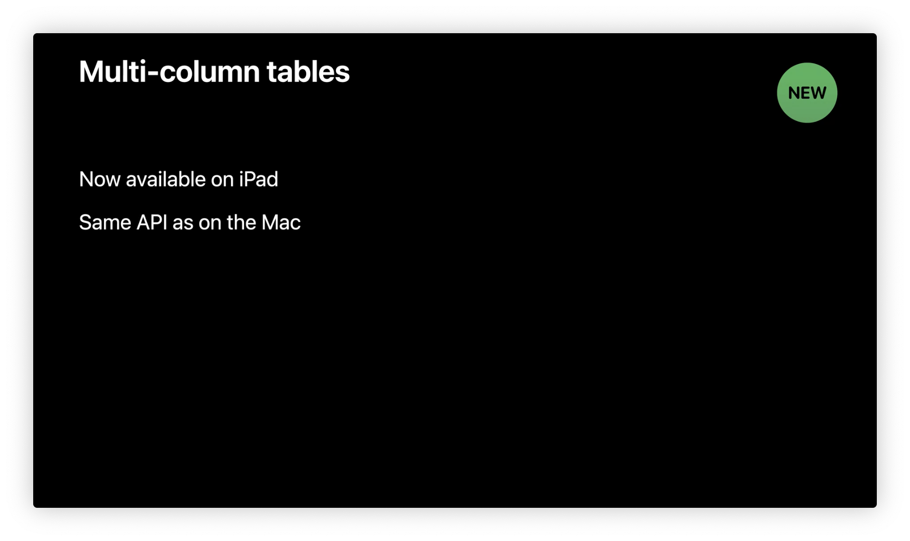

Multi-column table 首次登场于 macOS Monterey，今年也开始支持 iPadOS 16。它在两端的 API 保持一致，这也能侧面体现 SwiftUI 在苹果生态圈内跨平台的特性。

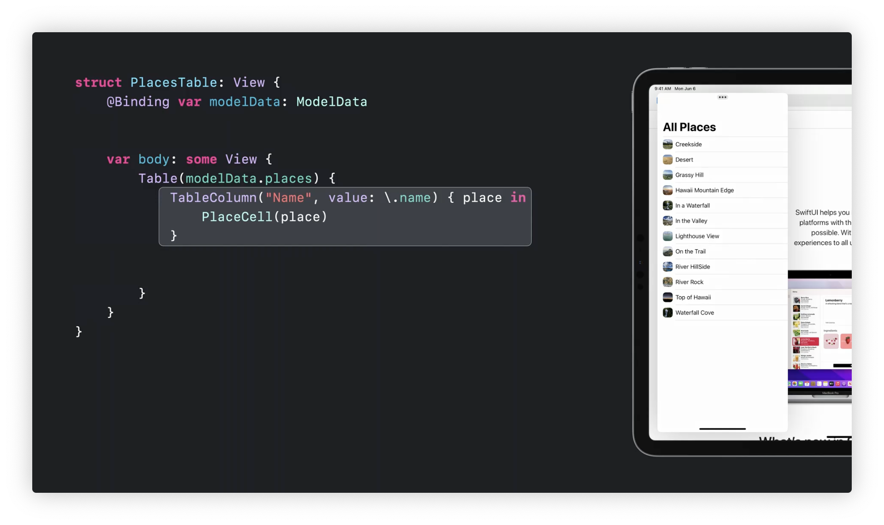
`Table` 与 `List` 的不同之处在于：`Table` 构造器接受的参数是 column builder 而不是 view builder。Column builder 构造器接受的参数是当前列的名称以及当前列的 view builder，并通过额外传入的 value 关键路径（Key Path）来支持列的排序。

值得一提的是：在 compact size class 的情况下（如 iPhone 的竖屏模式和 iPad 的滑动侧栏），Multi-column tables 仅显示第一列。这就意味着：即使从 `List` 迁移至 `Table`，在 iPhone 上的显示效果仍保持一致。

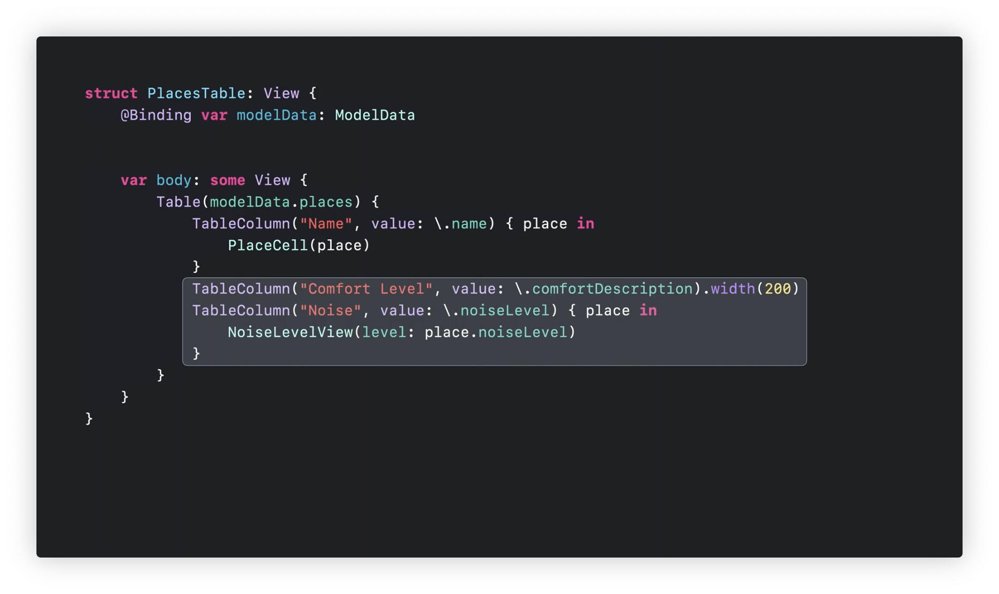
我们接着新建两列，一列表示当前地点的舒适程度，另一列表示当前地点的噪音大小。请注意 `Comfort Level` 这一列，如果某一列仅展示文本，可以用 `TableColumn` 这个 API，无需再编写当前列的 view builder。

#### Table Sorting

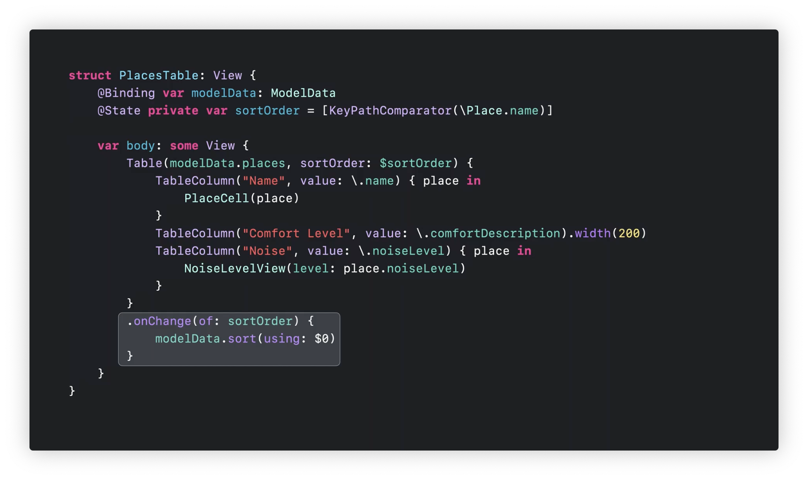
Multi-column table 对列排序也有良好的支持。上图所示的三列均在构造器中指定了 value 关键路径，从而默认为可排序的。我们需要在 Table 构造时，传入对 `sortOrder` 的绑定属性，并使用 `onChange(of:perform:)` 修饰器来监听 `sortOrder` 的变化。当用户点击列名称，希望当前数据根据该列来进行排序时，`sortOrder` 会发生相应的变化。我们使用最新的 `sortOrder` 来更新数据模型，从而触发视图的更新。

为什么 `sortOrder` 是个数组呢？因为 `sortOrder` 代表当前 Table 所有的关键路径比较器（KeyPathComparator）。在上述例子中，当 `sortOrder` 初始化时，仅包含 `\Place.name` 的一个关键路径比较器，因此当前 `Table` 的排序方式默认为以地点进行排序。

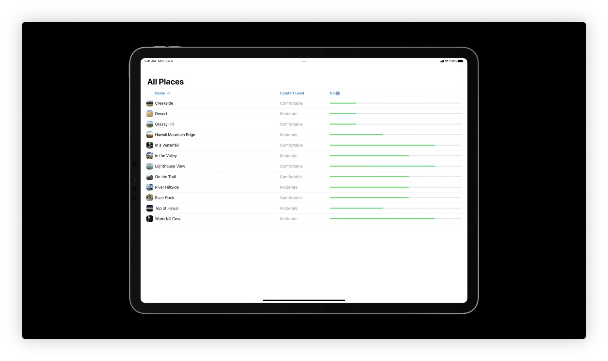
喔嚯！这样看起来不错。迁移至 `Table` 之后，展示的信息密度大大提高，而且点击每一列的标题，就能根据所在列进行排序。但 Multi-column tables 在 iPadOS 16 上不像在 macOS 上支持水平滑动，所以我们得格外注意这一点：**控制列的数量**，以确保所有的列能一块显示出来。

## Section and menus

### SwiftUI 中列表选中效果的基本原理

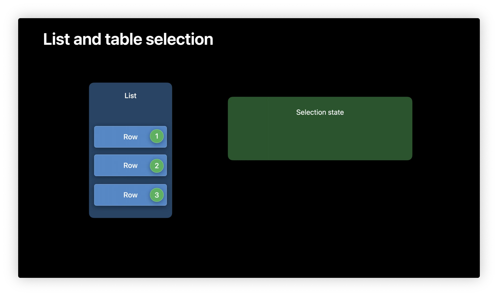
以 `List` 为例，每一行都有一个特殊的值与之对应，`List` 通过这些特殊值来实现行的选中效果。
光有这些还不够，还有一种数据类型来记录当前行的选中情况。


举个例子，如果 `List` 支持多选，那么就由一个 Set 来记录当前行的选中情况。

不难看出，`List` 行的选中效果由两部分组成：

1. 与每一行相关联的 tag
2. 记录当前行的选中情况的数据结构

#### Automatic tags

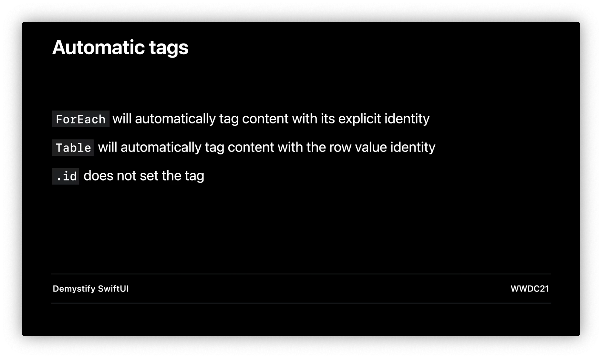
某行的 tag 是一个与该行视图相关联的哈希值（Hashable value）。 `List` 利用这个值来定位并选中相应的行。大多数情况下，SwiftUI 可以帮助我们为每行自动生成 tag。这些 tag 有点像行的标识符（identifier）。当使用 `ForEach` 时，SwiftUI 自动从视图的标识（identify）中取得这个 tag，而在选中某行时，SwiftUI 使用 `TableColumn` 的 `RowValue` 作为 tag。更多详情，请移步 [WWDC 21 Demystify SwiftUI](https://developer.apple.com/videos/play/wwdc2021/10022/)。

#### Manual tags

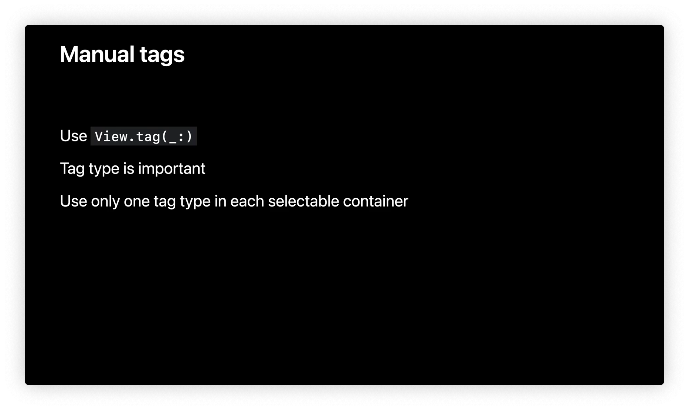
我们可以通过 [tag(_:)](https://developer.apple.com/documentation/swiftui/view/tag(_:)) 来手动设置视图的 tag。`ForEach` 也是通过这个方法来获取每个视图对应的 tag。当在一个子视图可选中的容器内时，所有子视图对应的 tag 必须为同一数据类型，否则 SwiftUI 将会不知道如何选中某个子视图。

这时候，有人可能会问 [id(_:)](https://developer.apple.com/documentation/swiftui/view/id(_:)) 与 [tag(_:)](https://developer.apple.com/documentation/swiftui/view/tag(_:)) 的区别是啥？答案是：对某个视图使用 [id(_:)](https://developer.apple.com/documentation/swiftui/view/id(_:)) 并不会设置该视图的 tag。

### iPad multiple-selection updates

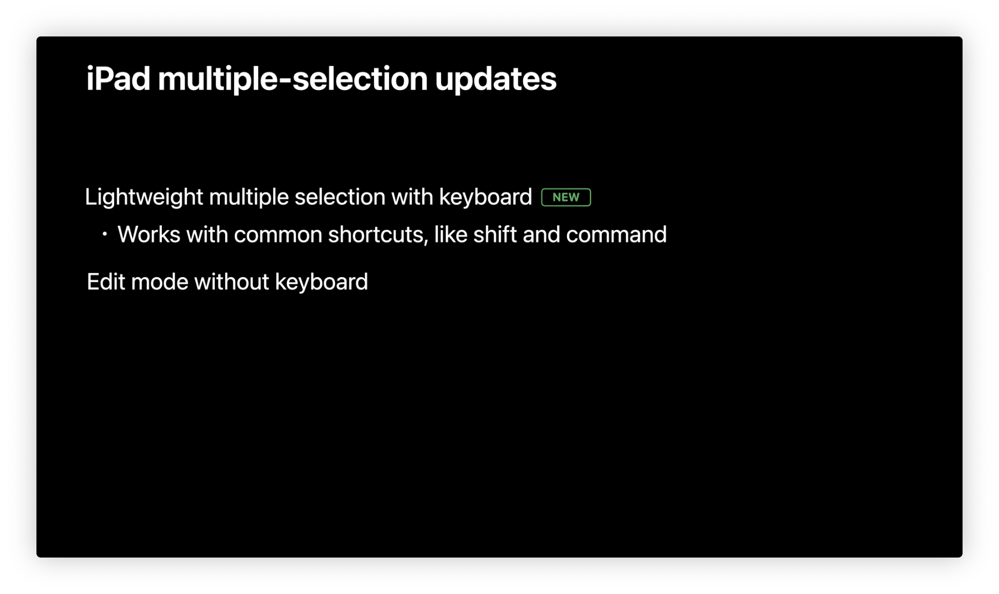
iPadOS 16 带来了一种轻量级的多选方式。相比之前，这种多选方式在外接键盘的加持下无需进入编辑模式即可开始多选。
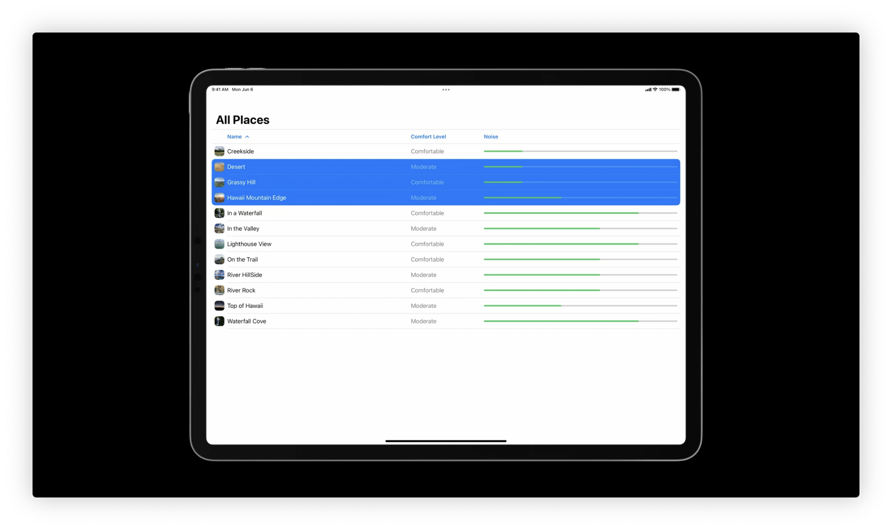
如上图所示，这种模式下的多选不会让选中行缩进。但如果不使用外接键盘，还是得使用触屏，手动进入编辑模式。这算是提升了点 iPad 配合外接键盘的使用体验。

### 编辑模式更新

从 iOS 16 和 iPadOS 16 开始，无需进入编辑模式即可在 `List` 中进行单选操作，这与 SwiftUI 新版导航 API 配合使用起来很方便。

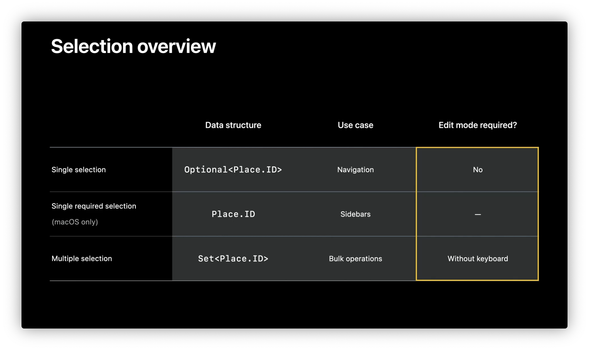
上图给出了三种多选方法的总结。值得注意的是：从 iOS 16 和 iPadOS 16 开始，一旦接入外接键盘，就通过快捷键直接在 `List` 或者 `Table` 中进行多选操作，再也不需要先进入编辑模式了！

### Multi-select context menus

为了进一步提高多选操作的便捷性，从 iOS 16 和 iPadOS 16 开始，SwiftUI 开始支持多选菜单。
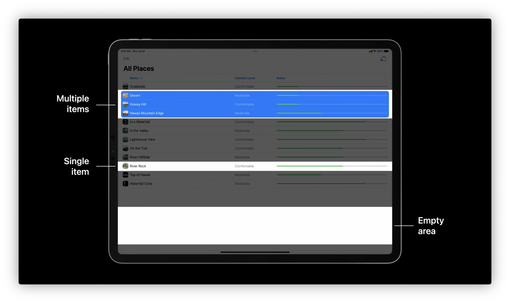
共有三种情况可唤出菜单：

1. 选中多个选项时
2. 选中单个选项时
3. 未选中任何选项，并点击空白区域时

示例代码如下：

``` swift
// Item context menus

Table(modelData.places, selection: $selection, sortOrder: $sortOrder) {
    ...
}
.contextMenu(forSelectionType: Place.ID.self) { items in
    if items.isEmpty {
        // Empty area
        AddPlaceButton()
    } else {
        if items.count == 1 {
            // Single item
            FavoriteButton(isSet: $modelData.places[items.first!].isFavorite)
        }

        // Single and multiple items
        AddToGuideButton(items)
    }
}
```

## Split Views

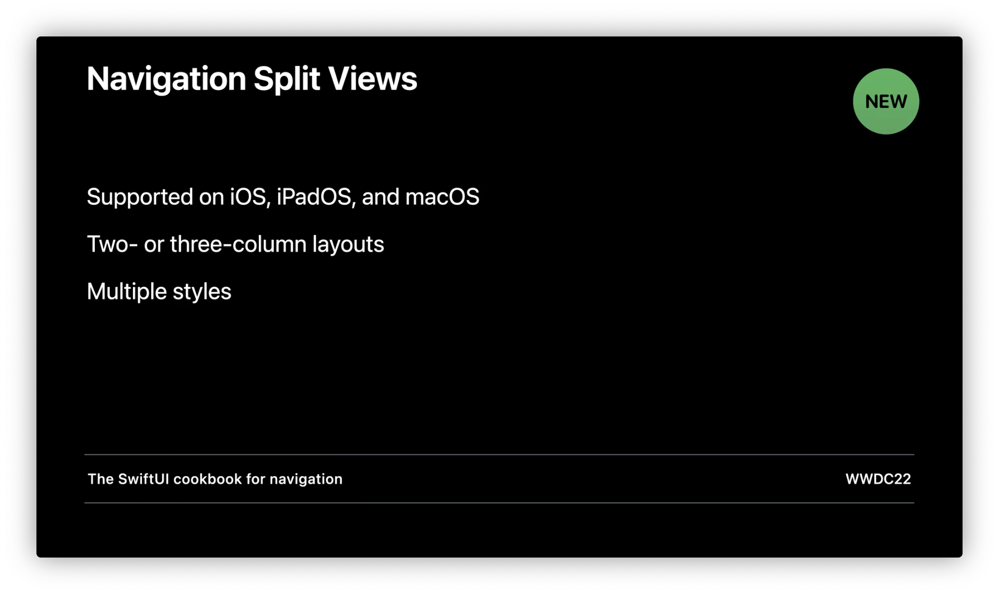
全新的 [NavigationSplitView](https://developer.apple.com/documentation/swiftui/navigationsplitview/) 不仅支持两列和三列布局，而且也新增了几种样式风格的设定。

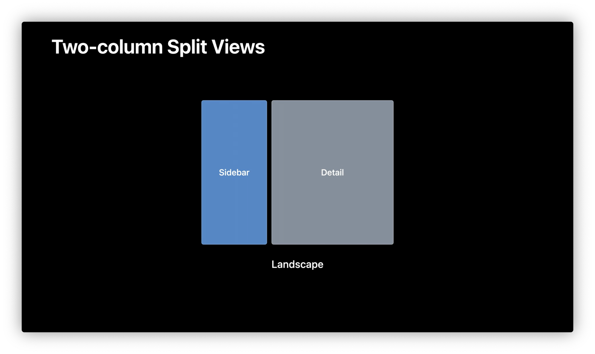
在两列布局时，如果 iPad 处于竖屏模式，`Sliderbar` 视图会默认隐藏，仅显示 `Detail` 视图。而 iPad 处于横屏模式时，两者均正常显示。

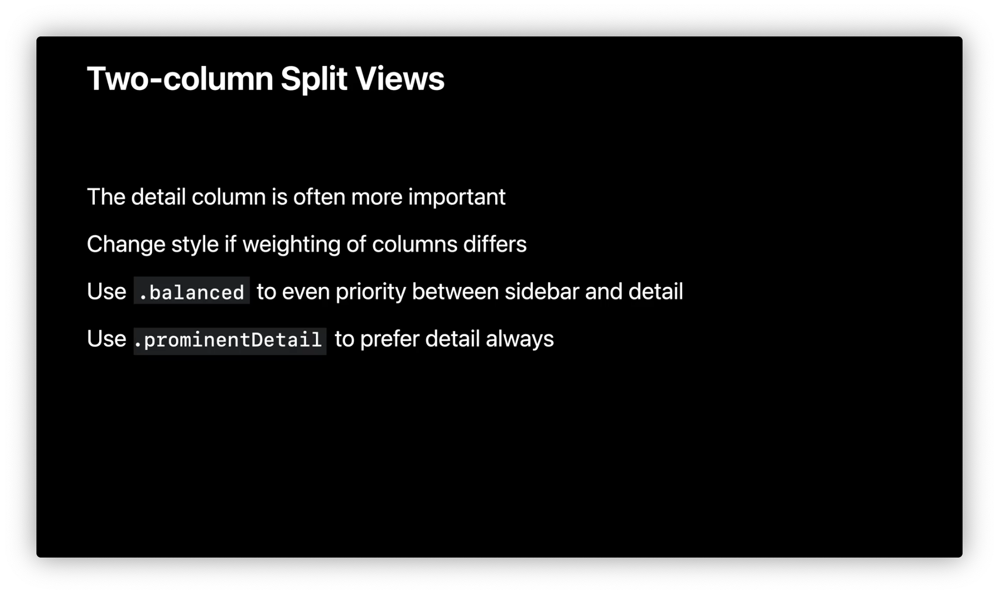
我们可以通过使用 [navigationSplitViewStyle(_:)](https://developer.apple.com/documentation/swiftui/labeledcontent/navigationsplitviewstyle(_:)) 来设置 style。如果把当前 [NavigationSplitView](https://developer.apple.com/documentation/swiftui/navigationsplitview/) 设置为 `balanced`，那么在竖屏的模式，`Sliderbar` 视图也会显示，但 `Detail` 视图的宽度减少一些，以适应这项改动。

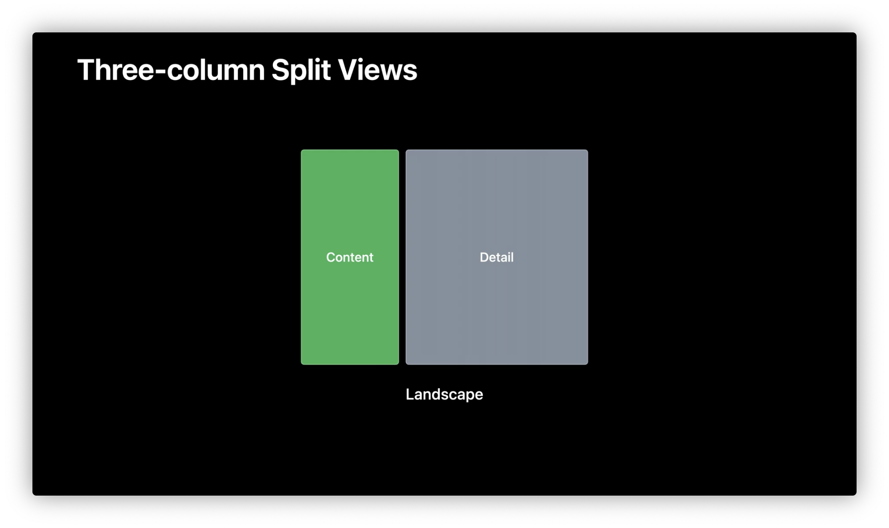
在三列布局时，`Content` 视图与 `Detail` 视图默认显示，`Sliderbar` 视图可通过 `Sliderbar` 按钮控制显示或者隐藏。

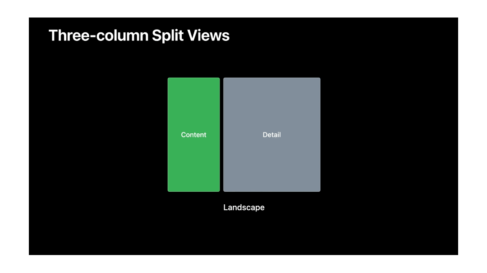

而在竖屏模式时，默认显示 `Detail` 视图。通过点击 `Sliderbar` 按钮，`Content` 视图与 `Sliderbar` 视图会依次出现，并覆盖在 `Detail` 视图之上。

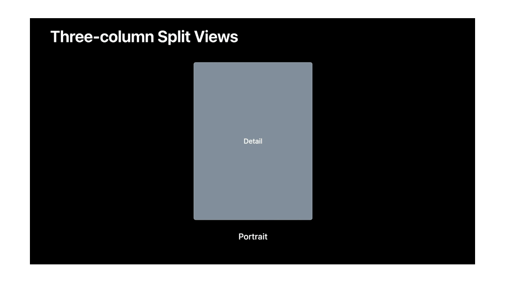

上述内容只是 SwiftUI 新版导航 API 的冰山一角，还有更多丰富的内容，请移步 [WWDC 22 The SwiftUI cookbook for navigation](https://developer.apple.com/videos/play/wwdc2022/10054/)。

到此为止，我们已经了解如何用新的 Table API 构建 Places 应用：
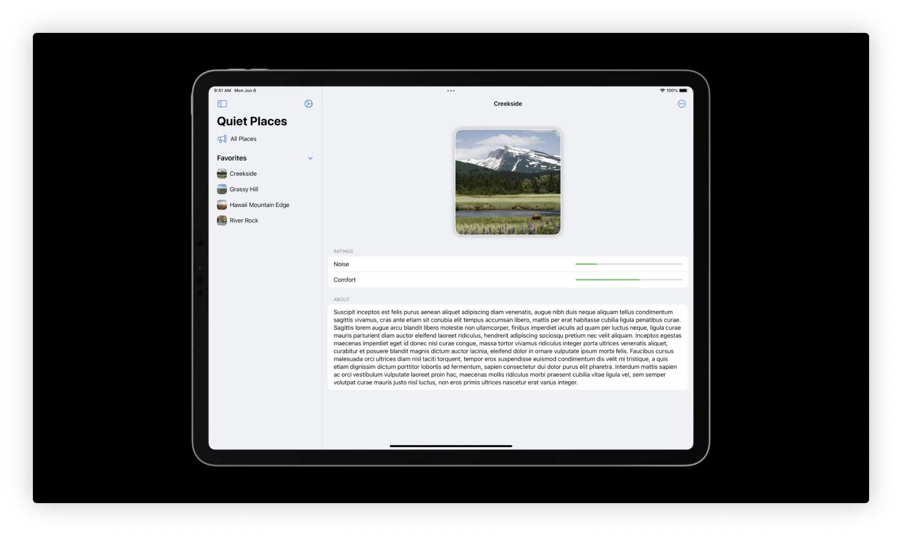
在 iPadOS 16 中，toolbar 新增不少特性。Toolbar 往往是一个应用常用功能的快捷入口。设计一个好的 toolbar 可以提高用户的生产力！

虽然目前 Places 应用看起来还不错，但如果有一个能提高用户操作效率的 toolbar，整个 App 的质量就会更上一层楼！

这里先放出 toolBar 加强后的 Places 应用截图，让大家提前感受到可以利用新 API 做到什么效果：
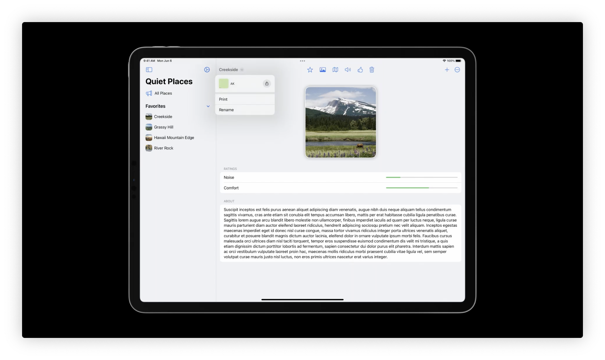
还新增了对自定义 toolbar 的支持：
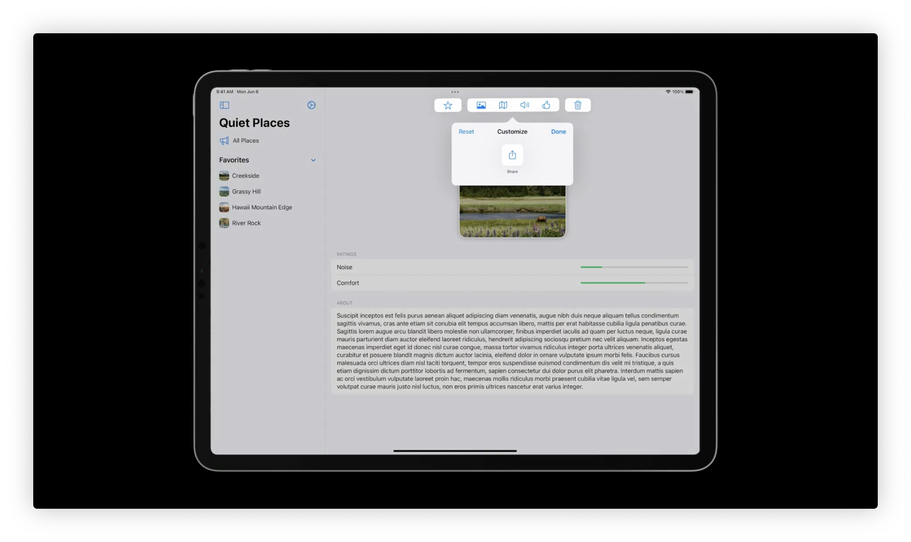

Toolbar 新增的改动概览：

* 支持导航栏标题左对齐
* 支持 `ToolbarItem` 居中显示
* 支持次级 `ToolbarItem` 菜单栏
* 支持自定义 toolbar
* 支持导航栏标题菜单栏

## Toolbar 新增的 API

### ToolbarItemGroup

如果有多个 `ToolbarItem` 时，为了适配 compact size class，之前常见的做法是：在 `ToolbarItem` 中塞入一个 `Menu`：
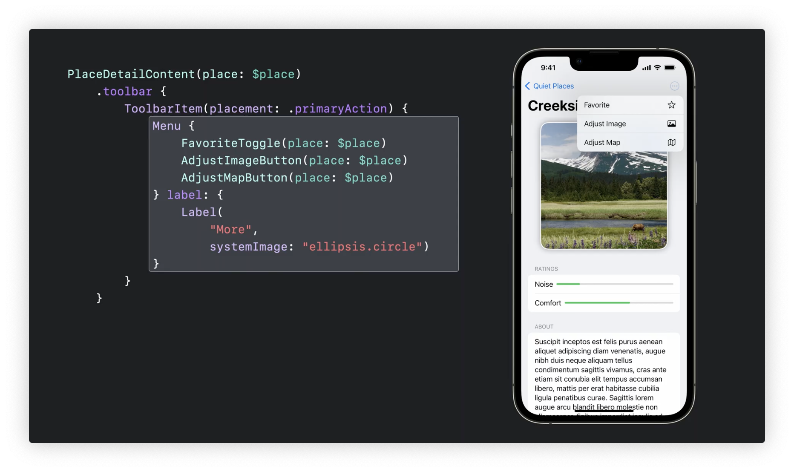
而现在可以借助新的 API `ToolbarItemGroup` 来自动实现菜单（Overflow Menu）效果：
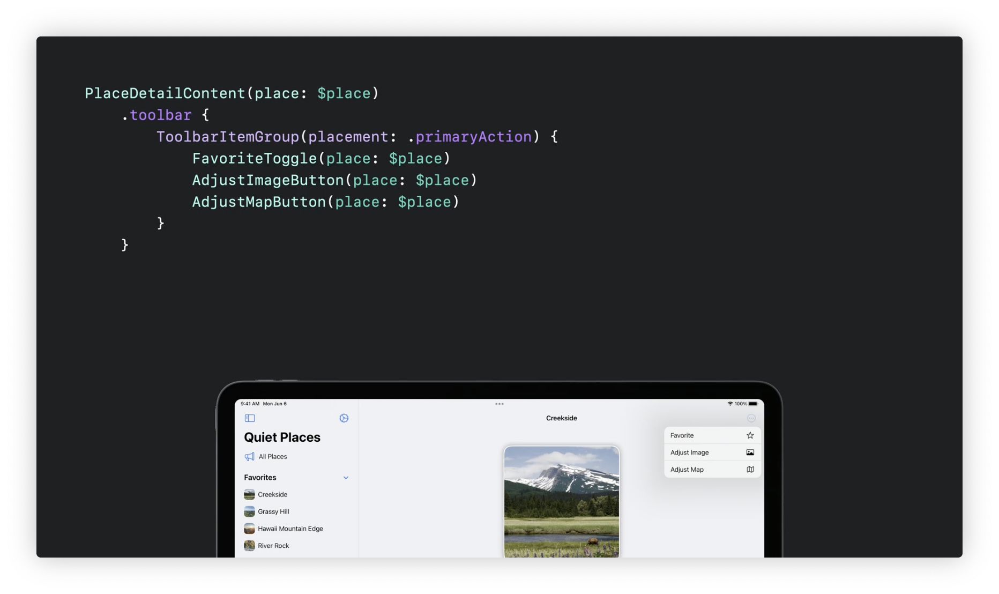

### Placement

到目前为止，一切看起来还行，但这似乎没能利用到 iPad 大屏的优势，信息密度不高。如上图所示，`ToolbarItemGroup` 新的 API 使用了 placement 的参数，该参数能间接控制 `ToolbarItem` 出现的位置。

导航栏可以细分为三个不同的区域：
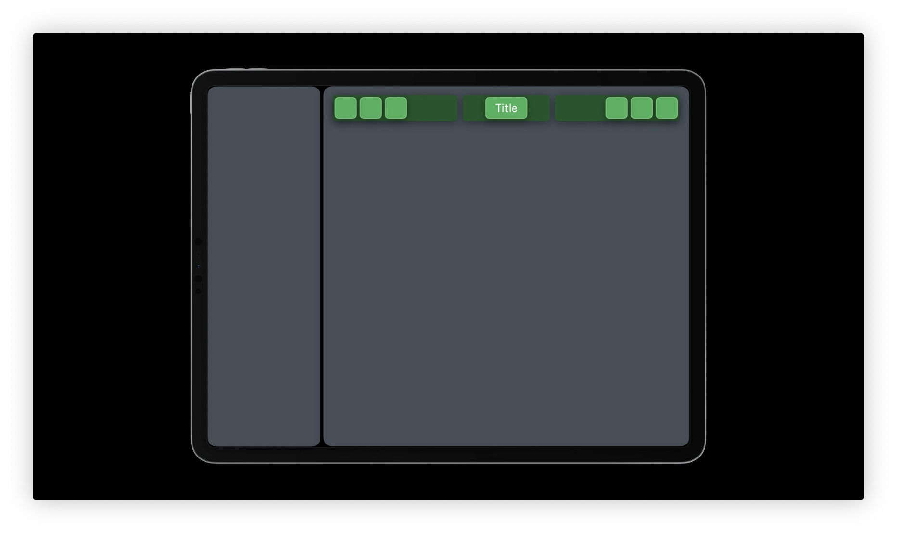
左右两侧一般是放置 `ToolbarItem` 的常见位置，中间一般是用来展示导航栏的标题。

#### Primary Action

被标记为 `primaryAction` 的 `ToolbarItem` 一般放在导航栏的右侧，这代表该 `ToolbarItem` 是该应用最常见的功能的入口之一。
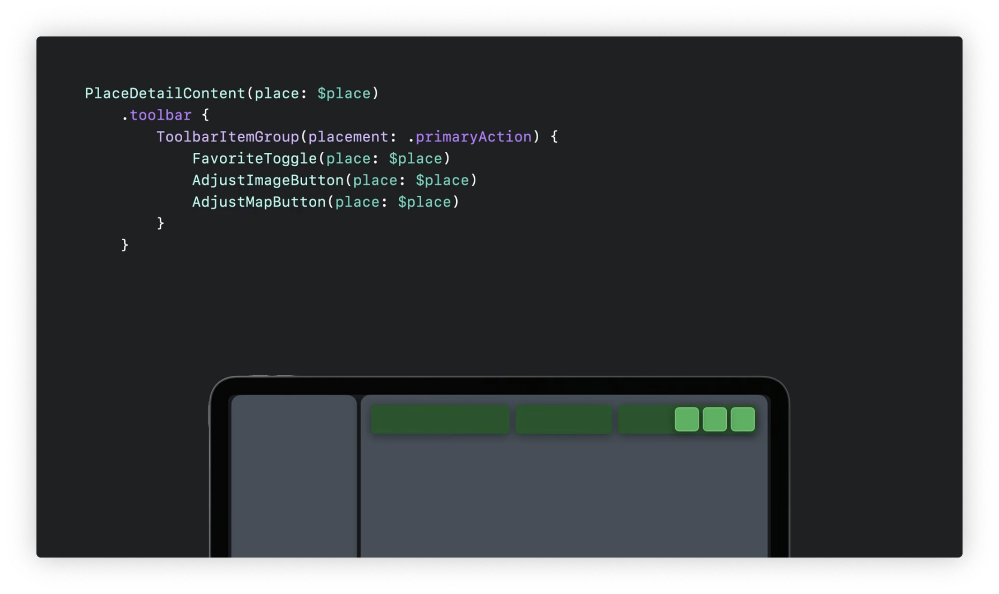

#### Secondary Action

而 iOS 16 新增了 `secondaryAction`。被标记为 `secondaryAction` 的 `ToolbarItem` 常常是应用某些次级功能在导航栏上的入口。
默认情况下，被标记为 `secondaryAction` 的 `ToolbarItem` 不会出现在导航栏上，而是出现在导航栏上的菜单里。
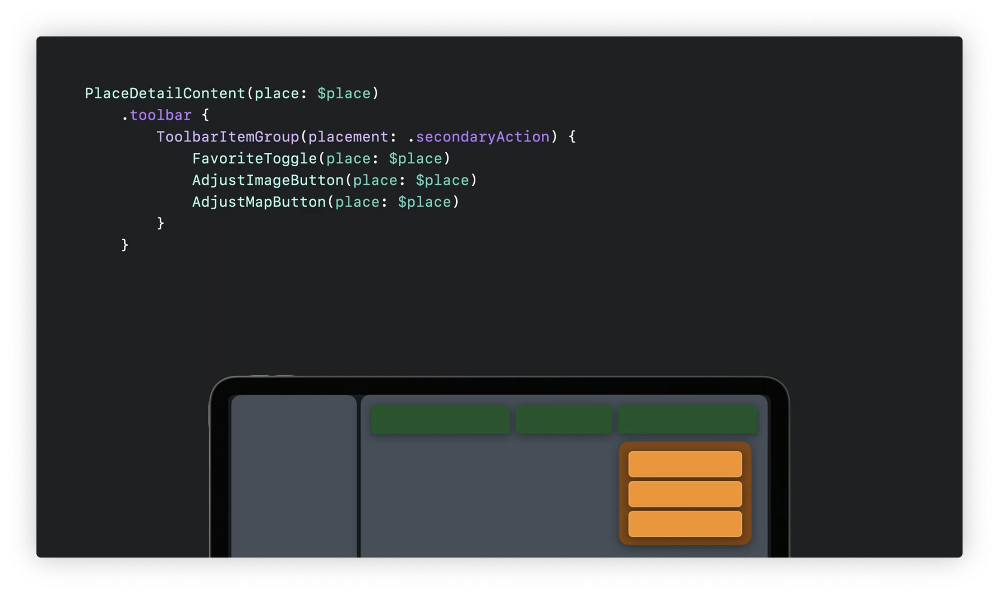

我们可以把 `toolbarRole` 设置为 `editor` 来修改这种默认行为，这样会告诉系统：此时的导航栏需要为编辑效果作优化。系统认为导航栏需要给 `ToolbarItem` 更多的空间，所以把导航栏的标题从中间移动到了左边。这样，`ToolbarItem` 就可以名正言顺地显示在导航栏的中间位置！
 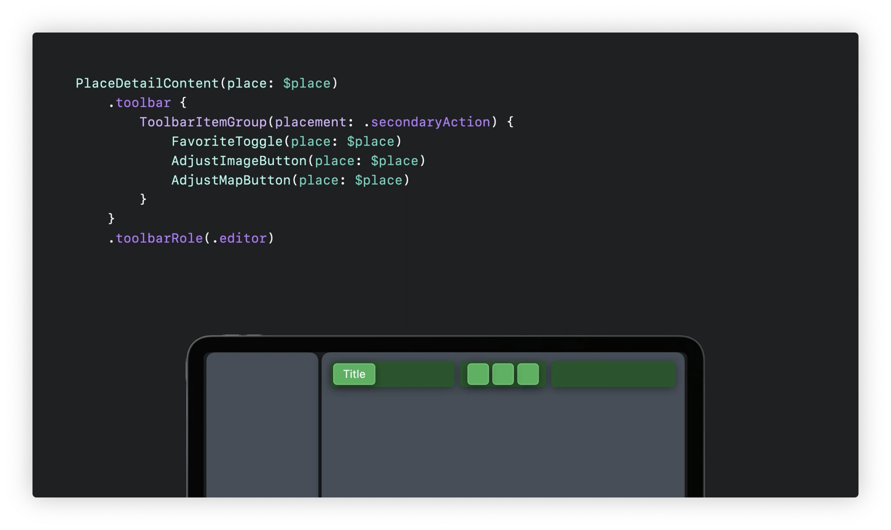

> 📝
> 只有被标记为 `secondaryAction` 的 `ToolbarItem` 才有可能出现在导航栏的中间位置。
> 在当前为 compact size class 的情况下，导航栏会忽略 `toolbarRole`，继续把标题放在居中的位置。

把 `secondaryAction` 和 `toolbarRole` 组合使用能有效提高 iPad 大屏展示的信息密度，但如果往导航栏中间塞了过多的 `ToolbarItem` 则往往会走向另一种极端。

## 自定义 Toolbar

macOS 上的自定义 Toolbar 功能如今也来到了 iPadOS 上。但只有 `ToolbarItem` 支持自定义，`ToolbarItemGroup` 并不支持自定义。所以我们需要把原有的 `ToolbarItemGroup` 拆分为单个的 `ToolbarItem`，并给每个 `ToolbarItem` 以及 toolbar 视图修饰器（View Modifier）加个唯一的标识。
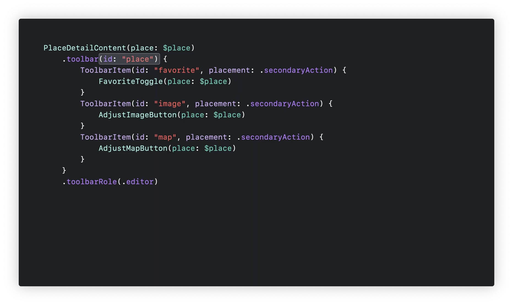
到此为止，当前这个 toolbar 就支持自定义啦！

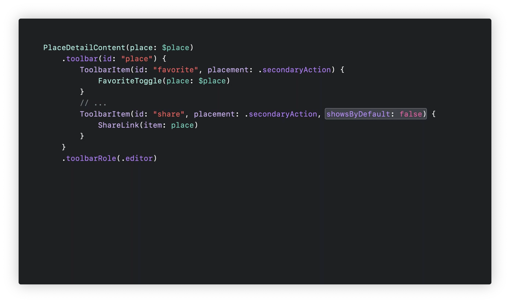
> 📝
> [ShareLink](https://developer.apple.com/documentation/SwiftUI/ShareLink) 依赖于一个名为 `Transferable` 的协议，详情请移步 [Meet Transferable](https://developer.apple.com/videos/play/wwdc2022/10062/)。

`ToolbarItem` 也可被设置为默认不显示，这样的 `ToolbarItem` 起初就会藏在自定义 `ToolbarItem` 的弹窗里。
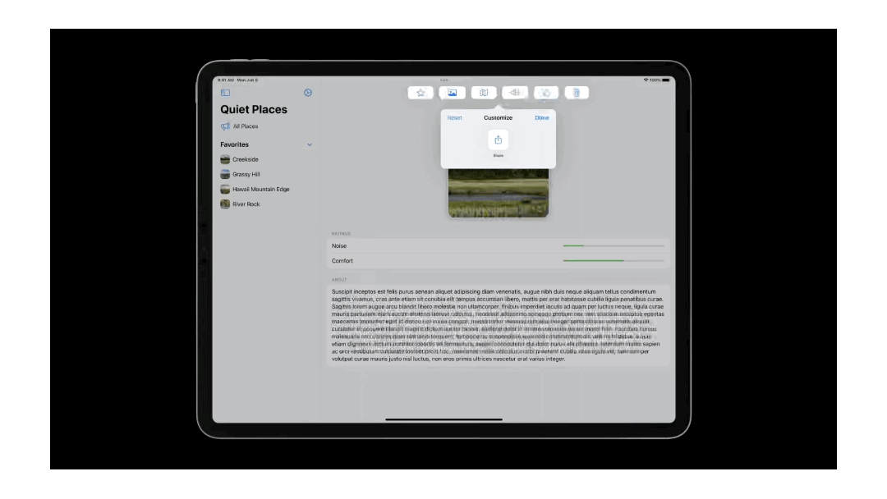

在逻辑上，有些支持自定义的 `ToolbarItem` 是可以被归为一组的。举个例子，假设分别有“粘贴”和“复制”两个不同的 `ToolbarItem`。一般来说，当用户把“粘贴”拖放在导航栏中，也会把“复制”一同拖放在导航栏中，但是这样的操作需要重复执行显得有些繁琐。

### Control Group

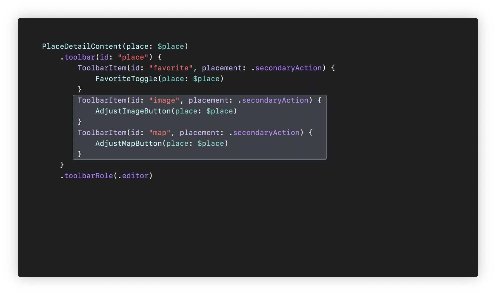
我们可以使用 Control Group 来给逻辑上关联紧密的 `ToolbarItem` 分成一组。
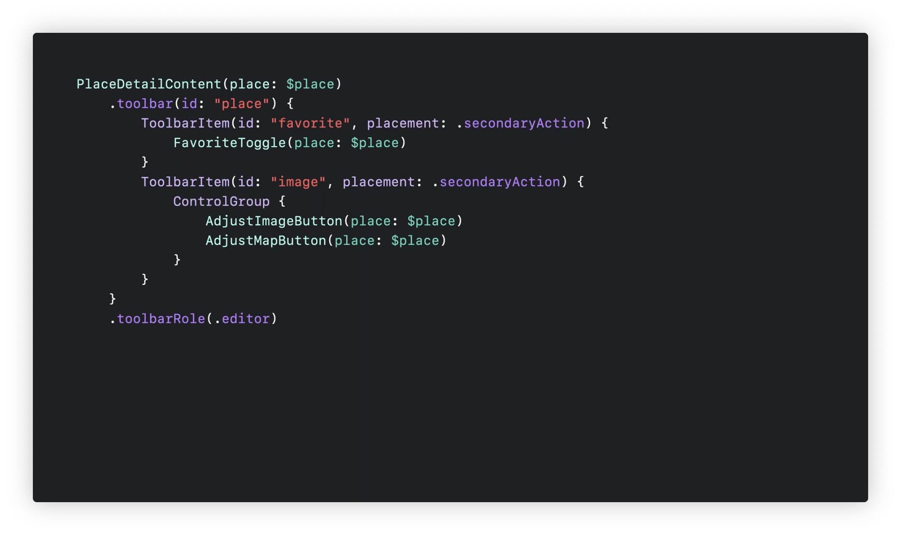
甚至可以给 Control Group 加上对应的 Label。
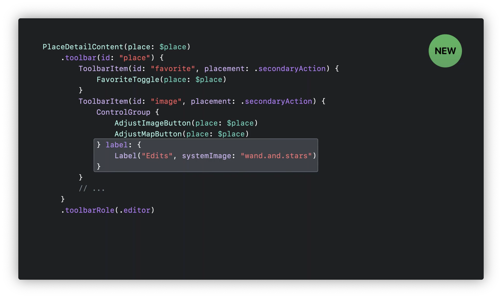
效果如下：
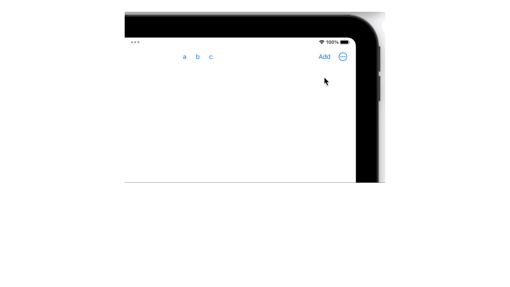

## Navigation title 新增 API

iPadOS 16 也带来了对导航栏标题菜单的支持！
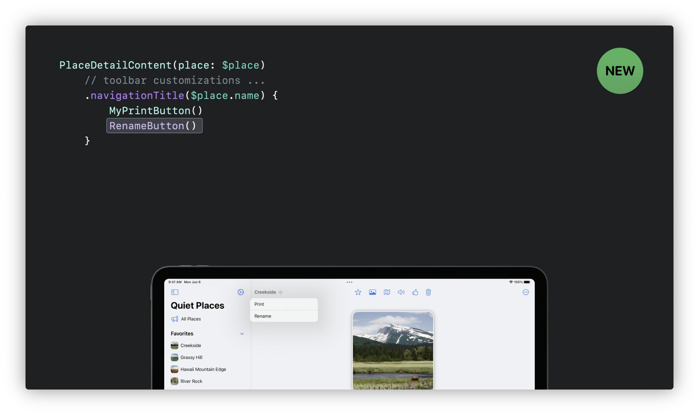
只要把绑定（Binding）属性传入对导航栏标题，就可以配合 `RenameButton` 来编辑导航栏的标题。但在 Xcode 14 Beta 2 上实际运行这个 API 时，Xcode 发出警告：

> 'navigationTitle(_:actions:)' was deprecated in iOS 16.0: Use
> ToolbarTitleActions in a toolbar modifier
> or the toolbarTitleActions modifier.

所以，上图所示代码段应更新为：

```swift
                .toolbarTitleActions(actions: {
                    MyPrintButton()
                    RenameButton()
                })
```

我们也可以把一个 URL 与导航栏标题相关联。关联之后，导航栏标题菜单就会在菜单头部展示出该 URL 对应文档的预览视图：
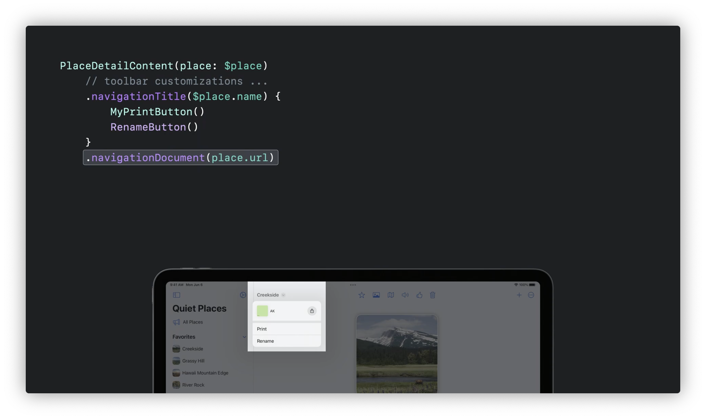

## 结语

Places 应用已从当初一个 `List` 进化成如今功能完备的 iPad 应用了。希望今年 SwiftUI 在 iPadOS 上的新特性能帮助一些 iPad 应用脱颖而出，既能帮助用户提高生产力，又能帮助开发者更好地完善自己的作品。
