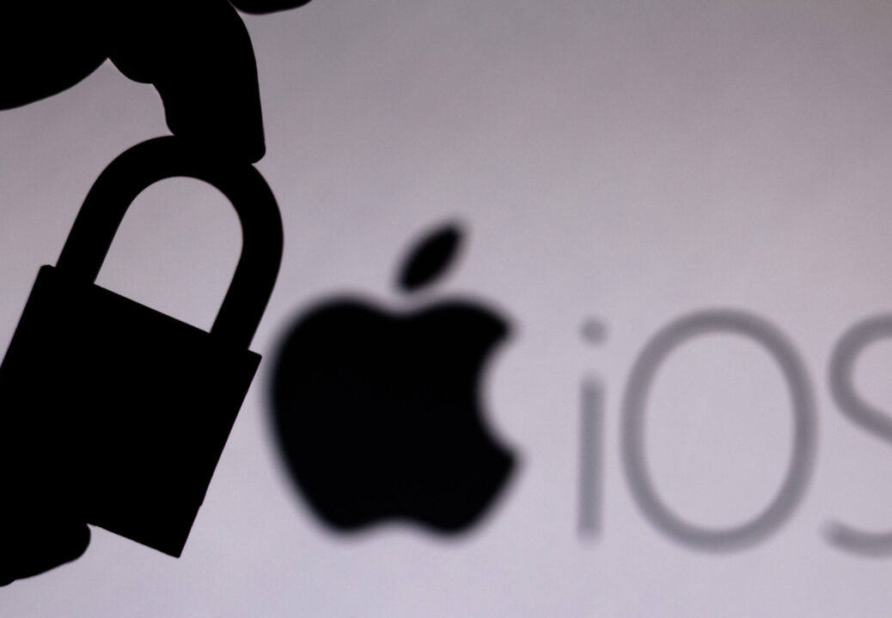

## 个人介绍

郑一一 , 现供职于 TikTok iOS 开发团队。

## 审核介绍

## 文章简介

苹果作为隐私安全方面的先行者，一直致力于让用户能够下载到可靠和安全的应用，并确保用户和开发者的使用体验，试图在安全性和易用性上达到一个良好的平衡。

本文介绍的 iOS 方向的 developer mode 和 macOS 方向的 notarization 都是苹果基于这些原则的最新实践。

## 公众号/小专栏图文头图

